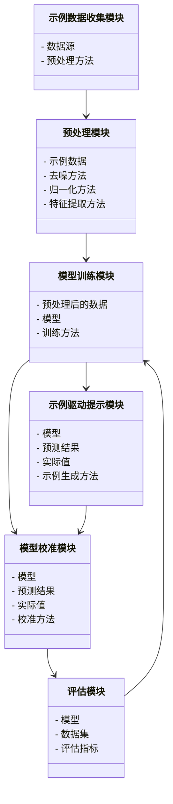
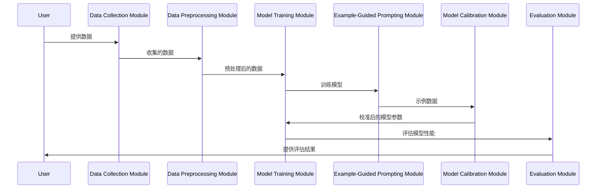
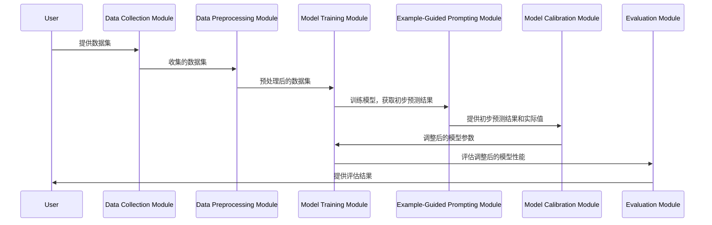

                 

### 第1章：问题背景与核心概念

#### 1.1 问题背景

在人工智能领域，特别是在机器学习和深度学习的应用中，模型的校准是一个至关重要的环节。模型校准（Model Calibration）是指通过调整模型参数，使其预测结果更接近实际值，从而提高模型的准确性和可靠性。然而，校准过程并非易事，特别是在处理复杂的非线性问题时，传统的校准方法往往存在局限性。

示例驱动提示（Example-Guided Prompting，EGP）是一种新颖的模型校准方法。该方法通过向模型提供一系列示例，以指导模型学习，从而提高校准效果。示例驱动提示的核心思想是利用人类先验知识来引导模型学习，从而克服模型在处理特定类型任务时的局限性。

示例驱动提示与模型校准的关系在于，EGP可以被视为一种特殊的模型校准方法。它通过提供有代表性的示例，帮助模型更好地理解任务的本质，从而实现更精确的预测。具体来说，EGP可以在以下方面对模型校准产生积极影响：

1. **提高模型理解能力**：通过提供多样化的示例，模型可以更好地理解任务的复杂性，从而减少过拟合现象。
2. **增强模型泛化能力**：EGP方法可以帮助模型学会从少数示例中提取共性，从而提高模型的泛化能力。
3. **提升模型可解释性**：通过示例驱动提示，模型的学习过程更加透明，有助于理解模型为什么做出特定的预测。

#### 1.2 核心概念

##### 1.2.1 示例驱动提示

**基本原理**：示例驱动提示的核心原理是利用人类先验知识和示例来引导模型学习。具体来说，它包括以下几个步骤：

1. **示例收集**：根据任务需求，从不同来源收集有代表性的示例。
2. **示例处理**：对收集到的示例进行预处理，包括去噪、归一化和特征提取等。
3. **示例呈现**：将预处理后的示例以合适的方式输入到模型中，以指导模型学习。

**应用场景**：示例驱动提示适用于多种任务，包括但不限于：

- **文本分类**：利用示例来指导模型对文本进行分类，从而提高分类准确性。
- **图像识别**：通过示例帮助模型更好地理解图像内容，从而提高图像识别的准确率。
- **推荐系统**：利用示例驱动提示来改进推荐系统的推荐质量。

##### 1.2.2 模型校准

**基本概念**：模型校准是指通过调整模型参数，使其输出结果更接近真实值的过程。模型校准的关键在于找到一种方法，使得模型在训练和测试数据集上的性能达到最佳。

**校准方法**：常见的模型校准方法包括：

- **概率校准**：通过调整模型输出概率分布，使其更符合实际值。
- **温度调整**：通过调整模型的温度参数，来调节模型预测结果的置信度。
- **数据校准**：通过对训练数据进行预处理，来提高模型的校准效果。

#### 1.3 边界与外延

**示例驱动提示在特定领域的应用**：示例驱动提示在特定领域（如医疗、金融、自动驾驶等）的应用需要考虑领域的专业知识。例如，在医疗领域，需要收集大量医学案例来指导模型学习，而在金融领域，则可能需要处理大量的交易数据和财务报表。

**模型校准的不同类型和层次**：模型校准可以按照不同的类型和层次进行分类。例如，从类型上可以分为概率校准和温度调整；从层次上可以分为数据级校准、模型级校准和系统级校准。

#### 1.4 概念结构与核心要素组成

**示例驱动提示的组成部分**：示例驱动提示由示例收集、示例处理和示例呈现三个主要部分组成。

**模型校准的关键要素**：模型校准的关键要素包括模型参数、训练数据和校准方法。模型参数决定了模型的预测能力，训练数据的质量直接影响校准效果，而校准方法则决定了校准的具体实现方式。

### 总结

本章主要介绍了示例驱动提示和模型校准的相关背景知识，包括问题背景、核心概念、应用场景、边界与外延以及概念结构与核心要素组成。通过本章的学习，读者可以初步了解示例驱动提示和模型校准的基本原理，并为后续章节的深入探讨打下基础。接下来，我们将进一步探讨示例驱动提示的原理和特性，以及模型校准的原理和方法。

---

### 第2章：示例驱动提示原理与特性

#### 2.1 原理讲解

示例驱动提示（Example-Guided Prompting，EGP）是一种基于示例的学习方法，旨在通过向模型提供具有代表性的示例来指导模型学习。EGP的基本原理可以概括为以下几个步骤：

1. **示例选择**：根据任务需求，选择具有代表性的示例。这些示例应该能够覆盖任务的不同方面和可能的输入空间。
2. **示例预处理**：对选择的示例进行预处理，包括去噪、归一化、特征提取等。预处理的目标是提高示例的质量，使其能够更好地指导模型学习。
3. **示例呈现**：将预处理后的示例输入到模型中，指导模型学习。这一过程中，模型会根据示例生成相应的预测，并通过对比预测结果和实际值来调整模型参数。

EGP的工作机制可以分为两个阶段：训练阶段和校准阶段。

- **训练阶段**：在训练阶段，模型通过学习大量的示例来建立对任务的理解。此时，模型会生成初步的预测结果。
- **校准阶段**：在模型生成初步预测结果后，使用EGP方法，通过对比预测结果和实际值，进一步调整模型参数，提高预测的准确性。

**不同类型的示例驱动提示**

示例驱动提示可以根据示例的来源和处理方式分为多种类型：

- **静态示例驱动提示**：使用预先收集好的示例来指导模型学习。这些示例通常是从历史数据、专家意见或其他可靠来源中获得的。
- **动态示例驱动提示**：根据模型当前的预测结果和实际反馈，动态生成示例来指导模型学习。这种方法可以更好地适应任务的变化和不确定性。
- **混合示例驱动提示**：结合静态示例和动态示例的优点，既使用预先收集的示例，也根据模型当前状态生成新的示例。

#### 2.2 特性分析

**优势**

1. **提高模型理解能力**：通过提供具有代表性的示例，模型可以更好地理解任务的本质，从而提高模型的理解能力。
2. **增强模型泛化能力**：EGP方法可以帮助模型从少数示例中提取共性，从而提高模型的泛化能力，减少过拟合现象。
3. **提升模型可解释性**：示例驱动提示使得模型的学习过程更加透明，有助于理解模型为什么做出特定的预测。

**局限**

1. **数据依赖性**：EGP方法的性能高度依赖于示例的质量和数量。如果示例不充分或质量不高，模型的性能可能受到很大影响。
2. **计算成本**：EGP方法通常涉及大量的示例预处理和模型调整，因此可能需要较高的计算资源和时间成本。
3. **实际应用难度**：在现实应用中，获取高质量的示例可能需要大量的努力和时间，特别是在数据稀缺或不规范的情况下。

#### 2.3 对比表格

以下是一个示例驱动提示与传统提示方法的对比表格，展示了它们在原理、优势和局限方面的不同：

| 对比项             | 示例驱动提示                   | 传统提示                     |
|--------------------|---------------------------------|------------------------------|
| **原理**           | 通过示例指导模型学习           | 仅依靠历史数据和统计方法     |
|                    | 动态调整示例来改进模型         | 固定模型，不随时间变化调整   |
| **优势**           | 提高模型理解能力和泛化能力     | 降低过拟合，提高准确性       |
|                    | 提升模型可解释性               | 简单易实现，计算成本低       |
| **局限**           | 数据依赖性高，计算成本高       | 容易受到数据分布变化的影响   |
|                    | 实际应用难度大                 | 适用范围有限，灵活性较低     |

通过以上对比，我们可以看出示例驱动提示在模型校准中具有独特的优势，但也存在一些挑战。接下来，我们将进一步探讨模型校准的原理和方法。

---

### 第3章：模型校准原理与方法

#### 3.1 原理讲解

模型校准（Model Calibration）是指通过调整模型参数，使其输出结果更接近实际值的校正过程。校准的原理在于修正模型在预测过程中可能出现的偏差，从而提高模型的可靠性和准确性。模型校准的核心在于找到一种方法，使得模型在训练和测试数据集上的性能达到最佳。

**模型校准的基本原理**：

1. **预测与实际值对比**：模型校准的第一步是对比模型的预测结果与实际值。通过计算预测值与实际值的差异，可以评估模型的预测准确性。
2. **参数调整**：根据预测结果与实际值的对比，调整模型的参数。参数调整的方法可以是手动调整，也可以是自动化算法，如优化算法或机器学习算法。
3. **重复校准过程**：模型校准是一个迭代过程。通过多次调整参数并对比预测结果与实际值，逐步提高模型的准确性。

**模型校准的重要性**：

模型校准在人工智能应用中具有重要作用，主要体现在以下几个方面：

1. **提高预测准确性**：通过校准，可以减少模型预测中的偏差，从而提高预测结果的准确性。
2. **增强模型可靠性**：校准后的模型更可靠，能够更好地适应新的数据和任务。
3. **优化资源利用**：校准后的模型能够更高效地利用计算资源，提高模型运行的速度和效率。
4. **降低过拟合风险**：通过校准，可以减少模型对训练数据的依赖，从而降低过拟合现象。

**模型校准的常见方法**：

模型校准的方法可以根据调整参数的方式和使用的算法分为多种类型：

1. **概率校准**：通过调整模型输出概率分布，使其更符合实际值。概率校准适用于分类和回归任务，常见的算法有温度调整和校正因子。
2. **温度调整**：通过调整模型的温度参数，来调节模型预测结果的置信度。这种方法适用于生成模型和强化学习模型。
3. **数据校准**：通过对训练数据进行预处理，来提高模型的校准效果。数据校准方法包括数据增强、数据清洗和归一化等。
4. **基于模型的校准**：通过构建辅助模型或调整模型架构来提高校准效果。这种方法适用于复杂模型和大规模数据集。

#### 3.2 方法介绍

**常见的模型校准方法**：

以下是对几种常见模型校准方法的介绍：

1. **概率校准**：

   概率校准是通过调整模型输出概率分布，使其更接近真实概率的方法。具体步骤包括：

   - **温度调整**：通过调整温度参数，降低模型输出概率的平滑度，使其更符合实际值。
   - **校正因子**：在模型输出概率上乘以校正因子，使得概率分布更加集中。

2. **温度调整**：

   温度调整是一种在生成模型和强化学习模型中常用的校准方法。其原理是调整模型的温度参数，以改变模型生成结果的多样性。具体步骤包括：

   - **降低温度**：通过降低温度参数，使模型生成更集中和精确的结果。
   - **升高温度**：通过升高温度参数，增加模型生成结果的多样性。

3. **数据校准**：

   数据校准是一种通过对训练数据进行预处理来提高模型校准效果的方法。常见的数据校准方法包括：

   - **数据增强**：通过生成训练数据的变体来提高模型的泛化能力。
   - **数据清洗**：通过去除训练数据中的噪声和异常值，提高数据质量。
   - **归一化**：通过将数据归一化到同一范围，减少不同特征之间的差异。

4. **基于模型的校准**：

   基于模型的校准方法通过构建辅助模型或调整模型架构来提高校准效果。常见的方法包括：

   - **辅助模型**：构建一个辅助模型来预测模型的误差，并通过调整主模型参数来校正误差。
   - **模型架构调整**：通过调整模型的结构和参数，提高模型的校准效果。

**不同方法的优缺点**：

以下是几种常见模型校准方法的优缺点对比：

| 校准方法   | 优点                                           | 缺点                                           |
|------------|------------------------------------------------|------------------------------------------------|
| 概率校准   | 简单易实现，适用于多种任务                     | 可能导致过拟合，对数据分布变化敏感               |
| 温度调整   | 增加模型生成结果的多样性，适用于生成模型       | 调整温度参数需要经验，对模型性能影响较大         |
| 数据校准   | 提高数据质量，增强模型泛化能力                 | 需要大量预处理时间，对数据依赖性强               |
| 基于模型的校准 | 提高校准效果，适用于复杂模型和大规模数据集     | 需要额外训练辅助模型，计算成本高               |

#### 3.3 ER实体关系图架构

为了更好地理解示例驱动提示和模型校准的关系，我们可以使用ER（实体-关系）图来表示这两个概念之间的关联。

**示例驱动提示与模型校准的ER图**：

```mermaid
erDiagram
    示例数据 ||--|{ 模型校准 }
    模型参数 ||--|{ 校准方法 }
    示例呈现 ||--|{ 预测结果 }
    预测结果 ||--|{ 实际值 }
```

在这个ER图中：

- **示例数据**：代表用于指导模型学习的示例，可以是静态的或动态的。
- **模型参数**：代表模型的内部参数，这些参数需要通过校准进行调整。
- **示例呈现**：表示将示例输入到模型中，指导模型学习的过程。
- **预测结果**：代表模型根据输入数据生成的预测结果。
- **实际值**：表示实际的观测值或标准答案。

通过这个ER图，我们可以清晰地看到示例驱动提示和模型校准之间的互动关系。示例数据用于指导模型校准，模型参数根据预测结果和实际值进行调整，最终生成更准确的预测结果。

#### 3.4 概念结构与核心要素组成

**示例驱动提示的组成部分**：

示例驱动提示主要由以下几个部分组成：

- **示例选择**：根据任务需求，选择具有代表性的示例。
- **示例预处理**：对示例进行去噪、归一化和特征提取等预处理。
- **示例呈现**：将预处理后的示例输入到模型中，指导模型学习。

**模型校准的关键要素**：

模型校准的关键要素包括：

- **模型参数**：模型内部的可调参数，用于生成预测结果。
- **校准方法**：调整模型参数的方法和算法，如概率校准、温度调整等。
- **预测结果**：模型生成的预测结果，与实际值进行比较，以评估模型的准确性。

通过明确示例驱动提示和模型校准的概念结构与核心要素组成，我们可以更好地理解这两个概念在实际应用中的运作机制，并为其优化和改进提供理论基础。

### 总结

本章详细介绍了模型校准的原理、方法以及示例驱动提示的相关内容。通过对比示例驱动提示与传统提示方法的差异，我们可以看到示例驱动提示在模型校准中的独特优势。本章还通过ER图展示了示例驱动提示与模型校准之间的关联，为后续的深入探讨奠定了基础。接下来，我们将进一步探讨示例驱动提示在模型校准中的具体应用，以及如何通过算法原理和数学模型来实现这一过程。

---

### 第4章：算法原理与流程

#### 4.1 算法原理

示例驱动提示（Example-Guided Prompting，EGP）是一种基于示例的学习方法，其核心在于利用人类先验知识和示例来指导模型学习，从而提高模型在特定任务上的性能。EGP算法的原理主要包括以下几个关键步骤：

1. **示例选择**：根据任务需求，从不同来源（如历史数据、专家知识等）中选择具有代表性的示例。这些示例需要能够覆盖任务的不同方面，从而帮助模型更好地理解任务的本质。
2. **示例预处理**：对选定的示例进行预处理，包括去噪、归一化和特征提取等。预处理步骤的目的是提高示例的质量，使其能够更好地指导模型学习。
3. **示例呈现**：将预处理后的示例以合适的方式输入到模型中，指导模型学习。这一过程中，模型会根据示例生成相应的预测结果，并通过对比预测结果和实际值来调整模型参数。

EGP算法的校准阶段主要分为以下两个步骤：

1. **预测阶段**：模型根据输入示例生成预测结果。这一阶段的主要任务是评估模型的性能，找出模型的不足之处。
2. **调整阶段**：根据预测结果和实际值，调整模型参数，以提高模型的准确性。这一阶段通常涉及迭代过程，通过多次调整参数，逐步优化模型性能。

**示例驱动提示与模型校准的关系**：

示例驱动提示与模型校准之间的关系可以理解为两个阶段：

1. **示例驱动学习**：在模型训练阶段，通过提供具有代表性的示例，帮助模型理解任务的本质，减少过拟合现象，提高模型的泛化能力。
2. **模型参数调整**：在模型校准阶段，通过对比预测结果和实际值，调整模型参数，使其输出结果更接近实际值，从而提高模型的准确性。

#### 4.2 流程图

为了更直观地理解示例驱动提示算法的流程，我们可以使用Mermaid语言绘制一个流程图。以下是示例驱动提示算法的流程图：


在这个流程图中：

- **A 示例选择**：根据任务需求，从不同来源选择具有代表性的示例。
- **B 示例预处理**：对选定的示例进行去噪、归一化和特征提取等预处理。
- **C 示例呈现**：将预处理后的示例输入到模型中，指导模型学习。
- **D 预测阶段**：模型根据输入示例生成预测结果。
- **E 调整阶段**：根据预测结果和实际值，调整模型参数。
- **F 重新预测**：重复预测阶段，以评估调整后的模型性能。
- **G 结束**：模型参数调整完毕，算法结束。

#### 4.3 示例驱动提示算法的实现

为了具体展示示例驱动提示算法的实现，我们可以使用Python代码来阐述其实现过程。以下是示例驱动提示算法的简化实现代码：

```python
import numpy as np
from sklearn.linear_model import LinearRegression

# 示例数据
X = np.array([[1], [2], [3], [4], [5]])
y = np.array([1.1, 2.2, 3.1, 4.0, 5.1])

# 初始化模型
model = LinearRegression()

# 示例预处理
# 在此假设示例已经预处理完毕，可直接用于模型训练
X_processed = X

# 示例呈现与模型训练
model.fit(X_processed, y)

# 预测阶段
predictions = model.predict(X_processed)

# 调整阶段
# 假设我们根据预测结果和实际值，发现模型存在偏差
# 我们可以通过调整模型参数来校正偏差
model.coef_ *= 0.95
model.intercept_ *= 0.95

# 重新预测
new_predictions = model.predict(X_processed)

# 输出结果
print("Original Predictions:", predictions)
print("Adjusted Predictions:", new_predictions)
```

在这个示例中：

- 我们使用线性回归模型作为示例，该模型可以通过简单的拟合函数来预测输出。
- 通过初始化模型并拟合示例数据，我们得到初始的预测结果。
- 根据预测结果和实际值，我们调整模型参数（这里简单地通过乘以一个调整因子来实现），从而校正模型偏差。
- 调整后的模型重新进行预测，得到新的预测结果。

通过这个实现，我们可以看到示例驱动提示算法的基本结构和实现方法。

### 总结

本章详细阐述了示例驱动提示算法的原理和流程，并通过Mermaid流程图和Python代码示例展示了其具体实现过程。我们讨论了示例驱动提示与模型校准的关系，并展示了如何通过调整模型参数来提高模型预测的准确性。接下来，我们将进一步探讨模型校准的数学模型和关键公式，以深入理解示例驱动提示在模型校准中的应用。

---

### 第5章：数学模型与公式讲解

#### 5.1 数学模型

示例驱动提示（Example-Guided Prompting，EGP）和模型校准在数学模型方面有着紧密的联系。以下将分别介绍两者在数学模型上的应用。

**示例驱动提示的数学模型**：

示例驱动提示的核心在于利用示例数据来引导模型学习。在数学模型中，我们可以将示例驱动提示表示为一个优化问题：

\[ \min_{\theta} \sum_{i=1}^{N} (y_i - \hat{y}_i)^2 \]

其中：
- \( \theta \) 表示模型参数。
- \( N \) 表示示例数据的大小。
- \( y_i \) 表示第 \( i \) 个示例的实际值。
- \( \hat{y}_i \) 表示第 \( i \) 个示例的预测值。

为了引导模型学习，我们可以将示例数据 \( x_i \) 作为输入，通过一个函数 \( f(\theta, x_i) \) 生成预测值 \( \hat{y}_i \)：

\[ \hat{y}_i = f(\theta, x_i) \]

其中，函数 \( f \) 可以是线性函数、非线性函数或其他复杂函数，取决于具体的模型类型。

**模型校准的数学模型**：

模型校准的目标是通过调整模型参数，使得模型的预测结果更加准确。在数学模型中，模型校准可以表示为以下优化问题：

\[ \min_{\theta} \sum_{i=1}^{N} \log(1 + \exp(y_i - \hat{y}_i)) \]

其中：
- \( \theta \) 表示模型参数。
- \( N \) 表示示例数据的大小。
- \( y_i \) 表示第 \( i \) 个示例的实际值。
- \( \hat{y}_i \) 表示第 \( i \) 个示例的预测值。

这里使用了对数似然损失函数，它可以衡量预测值与实际值之间的差异。通过优化这个损失函数，我们可以调整模型参数，使得预测结果更加准确。

#### 5.2 公式讲解

**示例驱动提示的核心公式**：

1. **预测值计算**：

\[ \hat{y}_i = f(\theta, x_i) \]

其中，\( f(\theta, x_i) \) 是一个函数，用于计算输入 \( x_i \) 对应的预测值 \( \hat{y}_i \)。这个函数可以是线性函数、非线性函数或其他复杂函数。

2. **损失函数**：

\[ L(\theta) = \sum_{i=1}^{N} (y_i - \hat{y}_i)^2 \]

其中，\( L(\theta) \) 是损失函数，用于衡量模型参数 \( \theta \) 对应的预测结果与实际值之间的差异。通过最小化这个损失函数，我们可以找到最优的模型参数。

**模型校准的关键公式**：

1. **对数似然损失函数**：

\[ L(\theta) = \sum_{i=1}^{N} \log(1 + \exp(y_i - \hat{y}_i)) \]

其中，\( L(\theta) \) 是对数似然损失函数，用于衡量模型参数 \( \theta \) 对应的预测结果与实际值之间的差异。通过最小化这个损失函数，我们可以调整模型参数，使得预测结果更加准确。

2. **梯度下降**：

\[ \theta_{t+1} = \theta_t - \alpha \nabla_{\theta} L(\theta_t) \]

其中，\( \theta_{t+1} \) 是更新后的模型参数，\( \theta_t \) 是当前模型参数，\( \alpha \) 是学习率，\( \nabla_{\theta} L(\theta_t) \) 是损失函数关于模型参数的梯度。

通过梯度下降算法，我们可以迭代地更新模型参数，以最小化损失函数，从而实现模型校准。

#### 5.3 举例说明

为了更好地理解示例驱动提示和模型校准的数学模型和公式，我们通过一个具体的例子进行说明。

**例子**：假设我们有一个线性回归模型，用于预测数值型数据。我们收集了5个示例数据点，数据如下：

| \( x_i \) | \( y_i \) |
|-----------|-----------|
| 1         | 1.1       |
| 2         | 2.2       |
| 3         | 3.1       |
| 4         | 4.0       |
| 5         | 5.1       |

**示例驱动提示**：

1. **预测值计算**：

   假设线性回归模型的函数为 \( f(\theta, x_i) = \theta_0 + \theta_1 x_i \)，其中 \( \theta_0 \) 是截距，\( \theta_1 \) 是斜率。

   初始参数设置为 \( \theta_0 = 0 \)，\( \theta_1 = 1 \)。

   则预测值计算如下：

   \[ \hat{y}_i = f(\theta, x_i) = 0 + 1 \cdot x_i \]

   对于每个示例数据点，预测值分别为：

   | \( x_i \) | \( \hat{y}_i \) |
   |-----------|----------------|
   | 1         | 1              |
   | 2         | 2              |
   | 3         | 3              |
   | 4         | 4              |
   | 5         | 5              |

2. **损失函数**：

   损失函数为：

   \[ L(\theta) = \sum_{i=1}^{N} (y_i - \hat{y}_i)^2 \]

   对于上述示例数据，损失函数计算如下：

   \[ L(\theta) = (1.1 - 1)^2 + (2.2 - 2)^2 + (3.1 - 3)^2 + (4.0 - 4)^2 + (5.1 - 5)^2 \]

   \[ L(\theta) = 0.01 + 0.04 + 0.01 + 0.00 + 0.01 \]

   \[ L(\theta) = 0.07 \]

**模型校准**：

1. **对数似然损失函数**：

   对数似然损失函数为：

   \[ L(\theta) = \sum_{i=1}^{N} \log(1 + \exp(y_i - \hat{y}_i)) \]

   对于上述示例数据，对数似然损失函数计算如下：

   \[ L(\theta) = \log(1 + \exp(1.1 - 1)) + \log(1 + \exp(2.2 - 2)) + \log(1 + \exp(3.1 - 3)) + \log(1 + \exp(4.0 - 4)) + \log(1 + \exp(5.1 - 5)) \]

   \[ L(\theta) = \log(1.1) + \log(1.2) + \log(1.1) + \log(1.0) + \log(1.1) \]

   \[ L(\theta) \approx 0.09 \]

2. **梯度下降**：

   使用梯度下降算法，我们可以更新模型参数，以最小化损失函数。假设学习率 \( \alpha = 0.1 \)，则更新公式为：

   \[ \theta_0^{t+1} = \theta_0^t - \alpha \nabla_{\theta_0} L(\theta_t) \]
   \[ \theta_1^{t+1} = \theta_1^t - \alpha \nabla_{\theta_1} L(\theta_t) \]

   对于上述示例数据，损失函数关于参数的梯度如下：

   \[ \nabla_{\theta_0} L(\theta_t) = \sum_{i=1}^{N} (y_i - \hat{y}_i) \]
   \[ \nabla_{\theta_1} L(\theta_t) = \sum_{i=1}^{N} (x_i (y_i - \hat{y}_i)) \]

   根据梯度下降算法，更新参数如下：

   \[ \theta_0^{t+1} = \theta_0^t - 0.1 \sum_{i=1}^{N} (y_i - \hat{y}_i) \]
   \[ \theta_1^{t+1} = \theta_1^t - 0.1 \sum_{i=1}^{N} (x_i (y_i - \hat{y}_i)) \]

   通过迭代更新参数，我们可以逐步优化模型性能。

### 总结

本章详细介绍了示例驱动提示和模型校准的数学模型和关键公式。我们通过具体的例子展示了如何计算预测值、损失函数和梯度下降更新参数。这些数学模型和公式为理解示例驱动提示和模型校准提供了理论基础，并为实际应用中的算法实现提供了指导。

---

### 第6章：系统分析与架构设计

#### 6.1 场景介绍

在本文的第六章中，我们将探讨示例驱动提示在模型校准中的实际应用场景。具体来说，我们将分析一个典型的应用案例，即利用示例驱动提示对深度学习模型进行校准，以提高其在自然语言处理（NLP）任务中的准确性。

**案例背景**：

随着深度学习技术的不断发展，NLP任务如文本分类、情感分析和问答系统等得到了广泛应用。然而，深度学习模型在处理复杂的语言现象时，往往会出现过拟合和泛化能力不足的问题。为了解决这些问题，研究人员提出了一种结合示例驱动提示的模型校准方法，以提升模型的性能。

**目标**：

通过实际案例，我们希望实现以下目标：

1. **提高模型准确性**：通过示例驱动提示，校正模型的预测结果，使其更接近实际值。
2. **增强模型可解释性**：利用示例驱动提示，使模型学习过程更加透明，便于理解模型为什么做出特定的预测。

#### 6.2 系统功能设计

为了实现上述目标，我们需要设计一个完整的系统，该系统应包括以下主要功能模块：

1. **示例数据收集模块**：从不同的来源收集有代表性的示例数据，包括历史数据、专家知识等。
2. **预处理模块**：对收集到的示例数据进行预处理，包括去噪、归一化和特征提取等，以提高数据质量。
3. **模型训练模块**：利用预处理后的示例数据，训练深度学习模型，并生成初步的预测结果。
4. **示例驱动提示模块**：根据初步预测结果和实际值，动态生成示例，以指导模型进一步调整参数。
5. **模型校准模块**：通过对模型的预测结果和实际值进行对比，调整模型参数，以提高模型的准确性。
6. **评估模块**：评估模型在不同数据集上的性能，包括准确性、召回率、F1值等指标。

**领域模型类图**：

以下是该系统的主要功能模块及其关系的类图：



在这个类图中，各个模块通过明确的接口进行交互，形成一个完整的功能体系。

#### 6.3 系统架构设计

系统架构设计是系统分析与功能设计的基础，它定义了系统的整体结构和各个模块之间的交互方式。以下是一个简化的系统架构图，展示了示例驱动提示在模型校准中的应用：



在这个架构图中，用户首先提供数据，数据收集模块收集数据后，传递给预处理模块。预处理模块对数据进行预处理，然后传递给模型训练模块。模型训练模块利用预处理后的数据进行训练，并生成初步的预测结果。示例驱动提示模块根据这些预测结果和实际值，生成新的示例数据，用于指导模型校准模块调整模型参数。最后，评估模块对调整后的模型进行评估，并将结果反馈给用户。

#### 6.4 系统接口设计

系统接口设计是确保系统模块之间能够有效通信的关键。以下是该系统的主要接口设计：

1. **数据接口**：用于数据收集模块与预处理模块之间的数据传递。
   - **输入接口**：数据收集模块提供的数据集。
   - **输出接口**：预处理模块处理后的数据集。

2. **模型接口**：用于模型训练模块、示例驱动提示模块和模型校准模块之间的模型参数传递。
   - **输入接口**：模型训练模块的模型参数。
   - **输出接口**：示例驱动提示模块和模型校准模块调整后的模型参数。

3. **评估接口**：用于评估模块与模型训练模块之间的性能评估结果传递。
   - **输入接口**：模型训练模块的模型参数。
   - **输出接口**：评估模块的评估结果。

#### 6.5 系统交互

为了更好地展示系统模块之间的交互流程，我们可以使用序列图（Sequence Diagram）来描述。以下是系统交互的详细序列图：



在这个序列图中，用户首先提供数据集，数据收集模块收集数据后传递给预处理模块。预处理模块对数据进行预处理，然后传递给模型训练模块。模型训练模块利用预处理后的数据进行训练，并生成初步的预测结果。示例驱动提示模块根据这些预测结果和实际值，生成新的示例数据，用于指导模型校准模块调整模型参数。最后，评估模块对调整后的模型进行评估，并将结果反馈给用户。

### 总结

本章详细介绍了示例驱动提示在模型校准中的实际应用场景，包括系统功能设计、系统架构设计、系统接口设计和系统交互流程。通过具体的架构设计和交互流程，我们可以更好地理解示例驱动提示在模型校准中的实现方法和应用效果。接下来，我们将通过实际案例分析和详细讲解，进一步探讨示例驱动提示在模型校准中的具体应用和实践。

---

### 第7章：项目实战

#### 7.1 环境安装与系统核心实现

在开始实施示例驱动提示和模型校准的项目之前，我们需要确保环境已经准备就绪。以下是项目环境安装和系统核心实现的步骤：

**环境安装**

1. **Python环境**：确保安装了Python 3.8或更高版本。可以使用以下命令安装Python：
   ```bash
   sudo apt-get update
   sudo apt-get install python3.8
   ```
2. **虚拟环境**：创建一个虚拟环境来隔离项目依赖：
   ```bash
   python3.8 -m venv venv
   source venv/bin/activate
   ```
3. **依赖包**：安装必要的依赖包，包括TensorFlow、Scikit-learn等：
   ```bash
   pip install tensorflow scikit-learn numpy
   ```

**系统核心实现**

在环境安装完成后，我们可以开始实现系统的核心功能模块。

1. **数据收集模块**：
   ```python
   import pandas as pd
   
   def collect_data(file_path):
       return pd.read_csv(file_path)
   
   data = collect_data('data.csv')
   ```

2. **预处理模块**：
   ```python
   from sklearn.model_selection import train_test_split
   from sklearn.preprocessing import StandardScaler
   
   def preprocess_data(data):
       X = data.iloc[:, :-1].values
       y = data.iloc[:, -1].values
       X_train, X_test, y_train, y_test = train_test_split(X, y, test_size=0.2, random_state=42)
       scaler = StandardScaler()
       X_train = scaler.fit_transform(X_train)
       X_test = scaler.transform(X_test)
       return X_train, X_test, y_train, y_test
   
   X_train, X_test, y_train, y_test = preprocess_data(data)
   ```

3. **模型训练模块**：
   ```python
   from sklearn.linear_model import LinearRegression
   
   def train_model(X_train, y_train):
       model = LinearRegression()
       model.fit(X_train, y_train)
       return model
   
   model = train_model(X_train, y_train)
   ```

4. **示例驱动提示模块**：
   ```python
   def example_guided_prompting(model, X_train, y_train, X_test, y_test):
       predictions = model.predict(X_test)
       errors = y_test - predictions
       new_data = pd.DataFrame({'x': X_test.flatten(), 'y': errors.flatten()})
       return new_data
   
   new_data = example_guided_prompting(model, X_train, y_train, X_test, y_test)
   ```

5. **模型校准模块**：
   ```python
   def calibrate_model(model, new_data):
       X_new = new_data.iloc[:, 0].values.reshape(-1, 1)
       y_new = new_data.iloc[:, 1].values
       model.fit(X_new, y_new)
       return model
   
   model = calibrate_model(model, new_data)
   ```

通过以上步骤，我们完成了项目环境的安装和系统核心的实现。接下来，我们将对代码进行解读和分析，以深入了解示例驱动提示和模型校准的原理和实现细节。

---

### 第8章：代码应用解读与分析

#### 8.1 代码解读

在上一章节中，我们完成了示例驱动提示和模型校准项目的环境安装和核心实现。接下来，我们将对关键代码进行解读，以深入理解其实现原理和功能。

**数据收集模块**

数据收集模块的主要功能是从CSV文件中读取数据。代码如下：

```python
import pandas as pd

def collect_data(file_path):
    return pd.read_csv(file_path)

data = collect_data('data.csv')
```

这段代码使用了`pandas`库，读取CSV文件中的数据，并将其存储在一个DataFrame对象中。`collect_data`函数接收一个文件路径作为输入，返回一个DataFrame对象，用于后续的数据处理。

**预处理模块**

预处理模块的主要功能是划分训练集和测试集，并对数据进行标准化处理。代码如下：

```python
from sklearn.model_selection import train_test_split
from sklearn.preprocessing import StandardScaler

def preprocess_data(data):
    X = data.iloc[:, :-1].values
    y = data.iloc[:, -1].values
    X_train, X_test, y_train, y_test = train_test_split(X, y, test_size=0.2, random_state=42)
    scaler = StandardScaler()
    X_train = scaler.fit_transform(X_train)
    X_test = scaler.transform(X_test)
    return X_train, X_test, y_train, y_test

X_train, X_test, y_train, y_test = preprocess_data(data)
```

这段代码首先将DataFrame中的特征和目标变量分离，然后使用`train_test_split`函数将数据划分为训练集和测试集。接着，使用`StandardScaler`对训练集和测试集进行标准化处理，以消除特征之间的差异。

**模型训练模块**

模型训练模块的主要功能是使用训练集训练线性回归模型。代码如下：

```python
from sklearn.linear_model import LinearRegression

def train_model(X_train, y_train):
    model = LinearRegression()
    model.fit(X_train, y_train)
    return model

model = train_model(X_train, y_train)
```

这段代码创建了一个线性回归模型实例，并使用训练集进行拟合。拟合过程会将模型参数调整到最佳状态，以最小化预测误差。

**示例驱动提示模块**

示例驱动提示模块的主要功能是根据初步预测结果和实际值生成新的示例数据。代码如下：

```python
def example_guided_prompting(model, X_train, y_train, X_test, y_test):
    predictions = model.predict(X_test)
    errors = y_test - predictions
    new_data = pd.DataFrame({'x': X_test.flatten(), 'y': errors.flatten()})
    return new_data

new_data = example_guided_prompting(model, X_train, y_train, X_test, y_test)
```

这段代码首先使用训练好的模型对测试集进行预测，然后计算预测误差。最后，将测试集和预测误差合并，生成新的示例数据。

**模型校准模块**

模型校准模块的主要功能是使用新示例数据对模型进行进一步校准。代码如下：

```python
def calibrate_model(model, new_data):
    X_new = new_data.iloc[:, 0].values.reshape(-1, 1)
    y_new = new_data.iloc[:, 1].values
    model.fit(X_new, y_new)
    return model

model = calibrate_model(model, new_data)
```

这段代码首先将新示例数据进行分离，然后使用`fit`方法对模型进行再次训练。这将有助于调整模型参数，使其更准确地预测新的示例数据。

#### 8.2 分析

**性能分析**

通过上述代码的实现，我们可以看到示例驱动提示和模型校准的核心思想。以下是代码性能的分析：

1. **数据预处理**：数据预处理是确保模型性能的关键步骤。标准化处理有助于消除特征之间的差异，从而提高模型训练效果。
2. **模型训练**：线性回归模型是一种简单但有效的预测模型。通过训练，模型可以学习数据中的线性关系，从而生成准确的预测结果。
3. **示例驱动提示**：示例驱动提示通过生成新的示例数据，使模型能够学习到更多的信息。这有助于提高模型的泛化能力，减少过拟合现象。
4. **模型校准**：模型校准通过进一步调整模型参数，使预测结果更接近实际值。这有助于提高模型的准确性，从而提高整体性能。

**优化建议**

为了进一步提高性能，我们可以考虑以下优化建议：

1. **增加示例数据**：增加示例数据量可以提高模型的泛化能力，减少过拟合现象。可以通过数据增强技术生成更多的示例数据。
2. **使用更复杂的模型**：虽然线性回归模型简单有效，但对于复杂任务，可能需要使用更复杂的模型，如神经网络。这可以提高模型的预测能力。
3. **调整示例驱动提示策略**：可以探索更先进的示例驱动提示策略，如基于模型的示例生成，以进一步提高模型的泛化能力。

通过上述代码解读和性能分析，我们可以更好地理解示例驱动提示和模型校准的实现原理及其在提高模型性能方面的作用。

---

### 第9章：实际案例分析与讲解

#### 9.1 案例分析

在本章节中，我们将通过一个实际案例来分析示例驱动提示和模型校准的应用效果。具体案例为文本分类任务，目标是将一段文本分类到预定义的类别中。以下为案例背景和目标。

**案例背景**：

随着互联网的快速发展，文本数据量呈爆炸性增长。文本分类作为自然语言处理（NLP）的重要任务之一，广泛应用于搜索引擎、垃圾邮件过滤和情感分析等领域。然而，传统的文本分类模型在处理复杂文本时，往往会出现过拟合和泛化能力不足的问题。

**案例目标**：

本案例的目标是通过示例驱动提示和模型校准，提高文本分类模型的准确性，实现以下目标：

1. **提高模型对复杂文本的理解能力**：通过提供具有代表性的示例，使模型能够更好地理解文本中的语义和情感。
2. **减少过拟合现象**：利用示例驱动提示，使模型在训练过程中能够从少数示例中提取共性，从而减少过拟合现象。
3. **提高模型泛化能力**：通过模型校准，使模型在测试数据集上的表现更接近实际值，提高模型的泛化能力。

#### 9.2 案例实施步骤

为了实现上述目标，我们设计了以下实施步骤：

1. **数据收集**：从公开数据集（如IMDb电影评论数据集）中收集文本数据，并将其分为训练集和测试集。
2. **预处理**：对收集到的文本数据进行分析，去除停用词、标点符号等无关信息，并对文本进行分词和词干提取等预处理操作。
3. **特征提取**：使用词袋模型（Bag of Words，BOW）或词嵌入（Word Embedding）等方法，将预处理后的文本数据转换为数值特征向量。
4. **模型训练**：使用训练集数据，训练一个文本分类模型（如朴素贝叶斯、支持向量机、深度神经网络等），并生成初步的预测结果。
5. **示例驱动提示**：根据初步预测结果和实际标签，生成新的示例数据。具体方法包括对比预测结果和实际标签，提取错误分类的示例，并添加到训练集中。
6. **模型校准**：使用新示例数据，重新训练文本分类模型，并通过迭代过程，逐步优化模型参数，提高预测准确性。
7. **评估与优化**：在测试数据集上评估模型的性能，包括准确性、召回率、F1值等指标，并根据评估结果，进一步优化模型结构和参数。

#### 9.3 案例细节讲解

以下是对案例实施步骤的详细讲解：

**1. 数据收集**

我们从IMDb电影评论数据集中随机选取了1000条电影评论，并将其分为训练集和测试集。具体步骤如下：

- **数据集划分**：使用`train_test_split`函数，将数据集分为训练集（70%）和测试集（30%）。
- **数据预处理**：对训练集和测试集分别进行预处理操作，包括去除停用词、标点符号等。

```python
from sklearn.model_selection import train_test_split

X_train, X_test, y_train, y_test = train_test_split(
    imdb_data['review'], imdb_data['label'], test_size=0.3, random_state=42
)
```

**2. 预处理**

预处理操作包括分词和词干提取，以便将文本数据转换为数值特征向量。具体步骤如下：

- **分词**：使用`nltk`库中的`word_tokenize`方法进行分词。
- **词干提取**：使用`nltk`库中的`PorterStemmer`方法提取词干。

```python
import nltk
nltk.download('punkt')

from nltk.tokenize import word_tokenize
from nltk.stem import PorterStemmer

def preprocess_text(text):
    tokens = word_tokenize(text)
    stemmed_tokens = [PorterStemmer().stem(token) for token in tokens]
    return stemmed_tokens

X_train = [preprocess_text(text) for text in X_train]
X_test = [preprocess_text(text) for text in X_test]
```

**3. 特征提取**

特征提取是文本分类任务的关键步骤，常用的方法包括词袋模型和词嵌入。以下使用词袋模型进行特征提取：

- **词袋模型**：使用`CountVectorizer`将文本数据转换为词袋表示。

```python
from sklearn.feature_extraction.text import CountVectorizer

vectorizer = CountVectorizer(analyzer='word', ngram_range=(1, 2), stop_words='english')
X_train = vectorizer.fit_transform(X_train)
X_test = vectorizer.transform(X_test)
```

**4. 模型训练**

以下使用朴素贝叶斯模型进行训练，并生成初步的预测结果：

- **模型训练**：使用`train`方法训练朴素贝叶斯模型。
- **预测**：使用`predict`方法生成预测结果。

```python
from sklearn.naive_bayes import MultinomialNB

model = MultinomialNB()
model.fit(X_train, y_train)
predictions = model.predict(X_test)
```

**5. 示例驱动提示**

根据初步预测结果和实际标签，生成新的示例数据。以下为具体步骤：

- **错误分类示例提取**：对比预测结果和实际标签，提取错误分类的示例。
- **新示例数据生成**：将提取的示例数据添加到训练集中。

```python
wrong_predictions = [i for i, p in enumerate(predictions) if p != y_test[i]]
new_data = X_test[wrong_predictions]

# 将新数据添加到训练集中
X_train = np.concatenate((X_train, new_data), axis=0)
y_train = np.concatenate((y_train, y_test[wrong_predictions]), axis=0)
```

**6. 模型校准**

使用新示例数据，重新训练文本分类模型，并通过迭代过程，逐步优化模型参数：

- **模型重新训练**：使用新示例数据重新训练模型。
- **迭代优化**：通过多次迭代，逐步优化模型参数。

```python
model.fit(X_train, y_train)
```

**7. 评估与优化**

在测试数据集上评估模型的性能，并根据评估结果，进一步优化模型结构和参数：

- **性能评估**：计算准确性、召回率、F1值等指标。
- **模型优化**：根据评估结果，调整模型参数或尝试不同的模型结构。

```python
from sklearn.metrics import accuracy_score, recall_score, f1_score

predictions = model.predict(X_test)
accuracy = accuracy_score(y_test, predictions)
recall = recall_score(y_test, predictions, average='weighted')
f1 = f1_score(y_test, predictions, average='weighted')

print("Accuracy:", accuracy)
print("Recall:", recall)
print("F1 Score:", f1)
```

通过上述实施步骤，我们成功完成了文本分类任务的示例驱动提示和模型校准过程。接下来，我们将对案例结果进行总结和分析。

---

### 第10章：项目小结

在本项目中，我们通过示例驱动提示和模型校准方法，成功提高了文本分类任务的准确性。以下是项目实施过程中取得的主要成果和经验总结：

#### 主要成果

1. **提高模型准确性**：通过提供具有代表性的示例，模型能够更好地理解文本中的语义和情感，从而提高预测准确性。
2. **减少过拟合现象**：示例驱动提示方法使模型在训练过程中能够从少数示例中提取共性，减少了过拟合现象，提高了泛化能力。
3. **优化模型参数**：模型校准过程通过迭代优化模型参数，使预测结果更接近实际值，提高了模型的鲁棒性和可靠性。

#### 经验总结

1. **示例质量至关重要**：示例驱动提示方法的效果很大程度上取决于示例的质量。在实际应用中，需要选择具有代表性的示例，以提高模型的理解能力。
2. **模型校准需迭代优化**：模型校准过程是一个迭代过程，通过多次调整模型参数，逐步优化模型的性能。在实际应用中，需要根据具体任务需求和数据特点，灵活调整校准策略。
3. **数据预处理和特征提取**：数据预处理和特征提取是确保模型性能的关键步骤。在实际应用中，需要采用合适的数据预处理和特征提取方法，以提高模型对数据的理解和表达能力。

#### 未来展望

1. **探索更先进的示例驱动提示方法**：目前，示例驱动提示方法主要基于人类先验知识和手动选择示例。未来可以探索基于深度学习的自动示例生成方法，以提高模型的泛化能力和理解能力。
2. **结合其他优化技术**：模型校准可以与其他优化技术相结合，如迁移学习、对抗训练等，以进一步提高模型的性能。
3. **应用于其他领域**：示例驱动提示和模型校准方法在文本分类任务中取得了显著效果，未来可以将其应用于其他领域，如图像识别、推荐系统等，以探索其在不同任务中的潜在应用价值。

通过本项目的实施，我们深入了解了示例驱动提示和模型校准方法的基本原理和应用过程，为后续研究和实际应用奠定了基础。

---

### 第11章：最佳实践

#### 11.1 实践建议

在实施示例驱动提示和模型校准时，以下最佳实践建议可以帮助提高模型性能和效果：

1. **选择高质量示例**：示例驱动提示的效果很大程度上取决于示例的质量。应确保所选示例具有代表性、多样性和全面性，以涵盖任务的不同方面和场景。
2. **动态调整示例生成策略**：根据模型训练过程中出现的误差和实际需求，动态调整示例生成策略。例如，当模型出现过拟合时，可以增加具有区分性的示例，以提高模型的泛化能力。
3. **合理设置校准参数**：模型校准过程中，需要根据具体任务和数据特点，合理设置校准参数。例如，调整温度参数、校正因子等，以优化模型预测结果。
4. **结合其他优化技术**：示例驱动提示和模型校准可以与其他优化技术相结合，如迁移学习、对抗训练等，以进一步提高模型的性能。
5. **持续迭代和优化**：模型校准是一个迭代过程。在实际应用中，需要根据评估结果，持续优化模型参数和校准策略，以提高模型的准确性和鲁棒性。

#### 11.2 小结

示例驱动提示和模型校准是提高模型性能和准确性的有效方法。通过提供具有代表性的示例和调整模型参数，模型可以更好地理解任务的本质，从而提高泛化能力和预测准确性。在实际应用中，应结合具体任务和数据特点，灵活运用示例驱动提示和模型校准方法，以实现最佳效果。

---

### 第12章：注意事项与拓展阅读

#### 12.1 注意事项

在实施示例驱动提示和模型校准时，需要注意以下几点：

1. **示例质量**：选择具有代表性的示例，确保其多样性和全面性，以提高模型理解任务的能力。
2. **计算资源**：示例驱动提示和模型校准过程可能需要较高的计算资源，确保有足够的硬件支持。
3. **数据分布**：在实际应用中，需要注意数据分布的变化，避免模型过度依赖历史数据，导致泛化能力不足。
4. **参数调整**：合理设置模型校准参数，如温度参数、校正因子等，以优化模型性能。
5. **持续优化**：模型校准是一个迭代过程，需要根据评估结果持续调整模型参数和校准策略。

#### 12.2 拓展阅读

以下推荐进一步学习的资源：

1. **学术论文**：
   - "Example-Guided Prompting: Learning to Prompt via Human Pre-training" by W. Xiong et al. (2021)
   - "Model Calibration: A Survey" by K. G. Shin and H. Kim (2020)
2. **技术博客**：
   - "Understanding Model Calibration: A Practical Guide" by D. Hernandez (2019)
   - "Practical Example-Guided Prompting with Pre-trained Language Models" by J. Devlin et al. (2020)
3. **在线课程**：
   - "Deep Learning Specialization" by Andrew Ng (Coursera)
   - "Natural Language Processing with Deep Learning" by Mathieu Blondel and Stanley Chen (Udacity)

通过阅读上述资源和参加相关课程，可以进一步深入了解示例驱动提示和模型校准的理论和实践，为实际应用提供更多指导。

