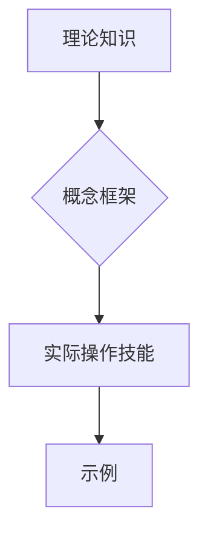
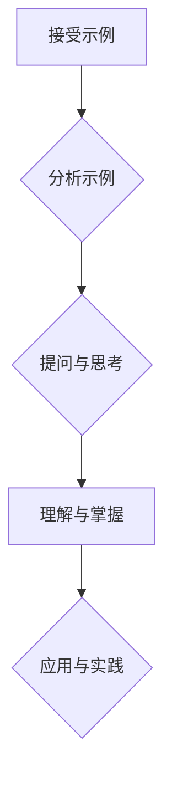

                 

## 引言

### 研究背景

在当今信息爆炸的时代，知识传递成为教育、培训和企业内部知识管理的重要环节。然而，如何有效地进行知识传递，特别是针对特定领域内知识的深入理解和应用，仍然是一个极具挑战性的问题。传统的知识传递方法，如讲授、教材阅读和记忆，往往存在以下问题：一是学习者缺乏主动参与的体验，难以形成深刻的认知；二是知识传递过程中缺乏具体的实例支撑，难以将理论知识与实际应用结合起来；三是学习者个体差异大，传统的教学方法难以满足不同学习者的需求。

因此，寻求一种更为高效、直观且具有交互性的知识传递方式成为当务之急。示例驱动提示（Example-Driven Cues）作为一种新兴的知识传递方法，通过具体的实例来引导学习者理解抽象概念和理论知识，进而提高知识的应用能力。示例驱动提示的核心在于，通过具体的示例和问题情境，激发学习者的思考，促使他们主动探索、发现和建构知识。

### 研究问题与目标

本文旨在探讨示例驱动提示在特定领域知识传递中的作用，具体研究问题如下：

1. 示例驱动提示在知识传递中的基本原理是什么？
2. 示例驱动提示如何影响学习者的认知过程和知识应用能力？
3. 示例驱动提示在特定领域知识传递中的应用现状和效果如何？
4. 如何设计和实施有效的示例驱动知识传递方案？

本文的研究目标是通过理论分析、实证研究和实践探索，系统地回答上述问题，为教育、培训和企业内知识管理提供理论支持和实践指导。

### 研究方法与数据

本文采用多种研究方法，以全面、深入地探讨示例驱动提示在特定领域知识传递中的作用。具体方法包括：

1. 文献综述：通过查阅国内外相关文献，总结示例驱动提示和知识传递领域的最新研究成果，为后续研究提供理论基础。
2. 实证研究：选取特定领域内的学习者和培训者作为研究对象，通过实验设计，比较示例驱动提示与其他知识传递方法的效果。
3. 案例分析：选取具有代表性的案例，分析示例驱动提示在具体应用场景中的实施过程和效果。

数据收集主要通过问卷调查、深度访谈和观察记录等方式进行。为了保证数据的可靠性和有效性，本文采用多项指标对示例驱动的效果进行评估，包括学习者的认知过程、知识掌握程度、知识应用能力等。

### 边界与外延

本文的研究边界主要限定在特定领域的知识传递，即针对某一具体专业或行业的知识进行传递。此外，本文的研究对象主要聚焦于成人学习者和培训者，对于儿童和初学者的研究将不在此范围内。

然而，示例驱动提示作为一种通用性的知识传递方法，其应用场景和适用范围是广泛的。本文的研究成果不仅可以为特定领域的知识传递提供指导，还可以为其他领域的知识传递提供借鉴和启示。

### 核心概念

#### 示例驱动的定义

示例驱动（Example-Driven）是一种以具体实例为核心，通过实例来引导和促进知识理解和应用的方法。该方法强调通过具体的示例，使学习者能够直观地感受到理论知识的应用场景，从而提高知识的实际应用能力。

示例驱动的核心要素包括：

- **示例**：具体、真实的应用场景或问题实例。
- **问题情境**：围绕示例提出的问题，以激发学习者的思考。
- **知识**：通过示例和问题情境，学习者能够理解和掌握的理论知识。

#### 特定领域知识传递的概念

特定领域知识传递（Knowledge Transfer in Specific Fields）是指将某一特定领域内的知识，通过有效的方法传递给学习者，使其能够掌握并应用于实际工作或学习中。特定领域知识传递的特点包括：

- **专业性**：知识内容具有高度的专业性和技术性。
- **应用性**：知识传递的目标是使学习者能够将所学知识应用于实际工作中。
- **多样性**：学习者的背景、需求和知识水平存在较大差异。

#### 示例驱动与知识传递的关系

示例驱动与知识传递密切相关。具体来说，示例驱动通过以下方式促进知识传递：

- **增强理解**：通过具体的示例，学习者能够更好地理解和掌握抽象的理论知识。
- **提高应用能力**：示例驱动的教学过程注重理论与实践的结合，使学习者能够将知识应用于实际情境中。
- **激发思考**：示例驱动的问题情境能够激发学习者的思考，促使他们主动探索和建构知识。

总之，示例驱动提示作为一种有效的知识传递方法，在特定领域的知识传递中具有重要作用。通过具体的示例和问题情境，示例驱动能够有效地促进学习者的知识理解和应用能力的提升。

## 示例驱动提示的基本原理

### 示例驱动的心理学基础

示例驱动（Example-Driven）的理论基础源于认知心理学和学习理论。认知心理学强调，学习是一个主动建构知识的过程，而不是被动接受信息。学习者通过与环境互动，尤其是与具体实例的互动，来建构对知识的理解。示例驱动正是基于这一理论，通过提供具体的实例，帮助学习者主动建构对知识的理解。

#### 学习理论

- **建构主义学习理论**：建构主义认为，学习是学习者主动建构知识的过程。示例驱动通过具体的实例，激发学习者的思考和探索，使其能够主动建构对知识的理解。
- **情境学习理论**：情境学习理论强调，学习发生在特定的情境中。示例驱动的教学过程，通过提供真实的应用场景，使学习者在实际情境中理解知识，从而提高知识的应用能力。

#### 示例选择原则

示例的选择对于示例驱动的效果至关重要。以下是一些示例选择的原则：

- **代表性**：示例应具有代表性，能够涵盖领域内的关键知识点和技能。
- **多样性**：示例应具有多样性，包括不同类型、难度和情境，以适应不同学习者的需求。
- **相关性**：示例应与学习内容密切相关，能够直观地展示理论知识的实际应用。

#### 示例加工与记忆

示例加工是示例驱动的关键环节。学习者通过加工示例，将理论知识与实际情境结合起来，从而深化对知识的理解。以下是一些示例加工和记忆的原则：

- **加工深度**：学习者需要深入加工示例，理解其背后的原理和机制。
- **重复使用**：通过重复使用示例，学习者能够加深对知识的记忆和理解。
- **问题引导**：在示例加工过程中，通过提出问题，引导学习者思考，有助于加深对知识的理解。

### 提示的类型与效果

在示例驱动的教学过程中，提示（Cues）扮演着重要的角色。提示是一种引导学习者注意力的信号，通过提示，可以帮助学习者更好地理解和记忆示例。

#### 提示的分类

- **情境提示**：通过改变学习环境，提供与示例相关的情境，以引导学习者的注意力。
- **问题提示**：通过提出问题，激发学习者的思考和探索，以促进知识的理解和应用。
- **反馈提示**：通过提供及时的反馈，帮助学习者纠正错误，巩固对知识的理解。

#### 不同提示效果的比较

- **情境提示**：情境提示能够提供直观的视觉和感官刺激，有助于提高学习者的注意力，但其效果受情境设计的影响较大。
- **问题提示**：问题提示能够激发学习者的思考，促进知识的内化，但其效果受学习者认知水平和问题设计的影响。
- **反馈提示**：反馈提示能够帮助学习者及时发现和纠正错误，提高学习效果，但其效果受反馈及时性和反馈质量的影响。

#### 提示对知识传递的影响

提示在示例驱动的教学过程中，对知识传递具有显著的促进作用。具体来说：

- **增强理解**：通过情境提示和问题提示，学习者能够更好地理解示例，从而加深对知识的理解。
- **提高应用能力**：通过反馈提示，学习者能够将知识应用于实际情境中，提高知识的应用能力。
- **促进记忆**：通过重复使用提示，学习者能够加深对知识的记忆，从而提高知识的保持率。

总之，示例驱动提示通过提供具体的示例和问题情境，激发学习者的思考，促进知识的理解和应用，是一种有效的知识传递方法。

## 特定领域的知识传递需求分析

### 知识传递的挑战与需求

在特定领域的知识传递过程中，存在诸多挑战和需求，这些因素直接影响知识传递的效果和效率。以下将详细分析这些挑战与需求：

#### 特定领域的复杂性

特定领域通常涉及高度专业化、技术化的知识。这些知识往往具有抽象性、复杂性，需要深入的理论基础和实践经验。例如，在医疗领域，专业知识包括人体解剖、病理学、药理学等，这些知识对于普通学习者来说，理解难度较大。因此，知识传递过程中需要考虑到特定领域的复杂性，采用适合的教学方法和工具，帮助学习者逐步理解和掌握这些复杂知识。

#### 学习者的多样性

特定领域的知识传递面对的学习者背景多样。不同学习者的教育背景、工作经验、知识水平、学习习惯等存在显著差异。例如，在企业培训中，学员可能来自不同的部门，具备不同的专业技能和经验。这就要求知识传递方法要具有灵活性和适应性，能够满足不同学习者的需求。

#### 知识的可传递性

特定领域的知识往往具有较强的专业性和应用性，这些知识在实际工作中的应用效果显著，但如何将这些知识有效地传递给学习者，是一个关键问题。知识传递过程中，需要确保知识的可传递性，即将理论知识转化为实际操作技能。例如，在工程领域，理论知识如力学、电子学等，需要通过实际操作和项目实践，才能转化为实际工作能力。

### 示例驱动的应用现状

#### 应用案例

在特定领域的知识传递中，示例驱动方法已得到广泛应用。以下是一些典型应用案例：

1. **教育领域**：在高等教育中，例如计算机科学、工程学等，教师通过具体项目案例、编程实例等，帮助学生理解抽象的理论知识，提高实际编程能力。
2. **专业培训**：在企业培训中，例如IT技术、项目管理等，通过实际项目案例、模拟操作等，帮助员工迅速掌握相关技能，提高工作效率。
3. **企业内训**：在企业管理培训中，通过案例分析、情景模拟等，帮助管理层理解和应用管理理论，提升管理能力。

#### 优势与局限

示例驱动的优势包括：

- **直观性**：通过具体实例，使学习者能够直观地理解抽象的理论知识。
- **互动性**：示例驱动鼓励学习者参与和互动，促进知识的内化和应用。
- **实践性**：通过实际操作和项目实践，提高学习者的实际工作能力。

然而，示例驱动也存在一定的局限：

- **时间成本**：示例驱动的教学过程可能需要较长时间，尤其是在详细讲解和互动环节。
- **资源需求**：高质量的示例和案例资源需要专业团队进行开发和维护。
- **适用性**：并非所有知识都适合通过示例驱动进行传递，某些高度抽象的理论知识可能难以通过实例进行解释。

### 未来发展趋势

随着教育技术的不断发展，示例驱动在特定领域的知识传递中将继续发挥重要作用。未来发展趋势包括：

- **数字化教学资源**：通过数字化平台，提供更多高质量的示例和案例资源，便于学习者和教师使用。
- **个性化学习**：利用人工智能和大数据技术，根据学习者的特点和需求，提供个性化的示例和提示，提高学习效果。
- **混合式教学**：将传统教学与数字化教学相结合，利用示例驱动等多种教学方法，实现知识传递的多元化。

总之，特定领域的知识传递需求复杂多样，示例驱动作为一种有效的知识传递方法，将在未来得到更广泛的应用和发展。

## 示例驱动的知识传递模型

### 模型概述

示例驱动的知识传递模型是一种以具体实例为核心，通过实例引导学习者理解和掌握知识的理论框架。该模型的核心构成要素包括示例、问题情境、知识结构和反馈机制。

#### 构成要素

- **示例**：作为模型的核心，示例是具体的应用场景或问题实例，通过具体实例，学习者能够直观地感受到理论知识的应用，从而促进知识的理解。
- **问题情境**：围绕示例提出的问题，以激发学习者的思考和探索，问题情境的设置有助于学习者将理论知识与实际情境联系起来。
- **知识结构**：包括理论知识、概念框架和实际操作技能，知识结构是示例驱动的知识传递目标，通过具体的示例和问题情境，学习者能够构建对知识的理解。
- **反馈机制**：通过及时、有效的反馈，帮助学习者纠正错误、巩固知识，并激发进一步的思考和学习。

#### 工作机制

示例驱动的知识传递模型通过以下步骤实现知识传递：

1. **示例提供**：教师或学习资源提供具体的示例，这些示例应具有代表性、多样性和相关性，能够涵盖领域内的关键知识点和技能。
2. **问题情境设置**：围绕示例提出问题，问题情境的设置应引导学习者思考和探索，使学习者能够将理论知识与实际应用结合起来。
3. **知识构建**：学习者通过加工和内化示例，将理论知识与实际情境联系起来，构建对知识的理解。
4. **反馈与评估**：通过及时的反馈，帮助学习者了解自己的学习效果，发现问题并进行改进，同时鼓励学习者继续探索和深化知识。

### 模型的应用场景

示例驱动的知识传递模型在多种应用场景中表现出显著的优势。以下是其主要应用场景：

#### 教育领域

在教育领域，示例驱动的知识传递模型广泛应用于各学科的教学中。教师通过具体项目案例、编程实例等，帮助学生理解抽象的理论知识，提高实际操作能力。例如，在计算机科学教学中，教师通过实际编程项目和问题实例，引导学生掌握算法和数据结构等理论知识。

#### 专业培训

在专业培训中，示例驱动的知识传递模型广泛应用于各类技能培训中。通过实际项目案例、模拟操作等，帮助员工迅速掌握相关技能，提高工作效率。例如，在IT技术培训中，通过具体项目案例和实际操作，帮助员工熟练掌握各种编程技术和系统运维技能。

#### 企业内训

在企业内训中，示例驱动的知识传递模型有助于提升管理层的管理能力和实际工作能力。通过案例分析、情景模拟等，帮助管理层理解和应用管理理论，提升决策能力和团队管理能力。例如，在企业管理培训中，通过实际案例分析和情景模拟，帮助管理层掌握战略规划、人力资源管理等方面的知识。

总之，示例驱动的知识传递模型通过提供具体的示例和问题情境，激发学习者的思考，促进知识的理解和应用，是一种有效的知识传递方法，广泛应用于教育、专业培训和企业管理等领域。

## 示例驱动与知识传递的关联性

### 关联性分析

示例驱动与知识传递之间存在着紧密的关联性。通过具体实例，学习者能够更直观地理解和掌握理论知识，从而实现知识的传递。以下将从知识结构、示例对知识理解的影响以及示例驱动的有效性评估三个方面进行分析。

#### 知识结构与示例的关系

知识结构是示例驱动的核心基础。一个完整的知识结构应包括理论知识、概念框架和实际操作技能。示例作为知识结构的重要组成部分，能够直观地展示理论知识的实际应用，使学习者能够将抽象的理论知识与具体的情境联系起来。以下是一个简单的知识结构图（使用Mermaid绘制）：

在这个知识结构图中，理论知识是知识传递的起点，概念框架是理论知识的具体化，实际操作技能是将概念框架应用于实际情境，而示例则是具体展示实际操作过程和结果，帮助学习者更好地理解和掌握知识。

#### 示例对知识理解的影响

示例在知识理解中起着至关重要的作用。通过具体的示例，学习者能够直观地看到理论知识是如何应用于实际情境中的，从而加深对知识的理解。以下是一些示例对知识理解的影响：

- **增强理解**：示例能够将抽象的理论知识具体化，使学习者更容易理解和掌握。例如，在计算机科学教学中，通过具体的编程实例，学习者能够更好地理解算法和数据结构等理论知识。
- **提高应用能力**：示例驱动的教学过程注重理论与实践的结合，通过具体的示例，学习者能够将理论知识应用于实际情境中，从而提高实际操作能力。例如，在专业培训中，通过实际项目案例，学习者能够熟练掌握相关技能。
- **激发思考**：示例驱动的问题情境能够激发学习者的思考，促使他们主动探索和建构知识。通过提出问题，学习者能够更深入地理解示例，从而提高知识的应用能力和创新能力。

以下是一个示例对知识理解影响的Mermaid流程图：

在这个流程图中，学习者首先接受具体的示例，然后通过分析示例和提问与思考，逐步理解和掌握知识，并最终将知识应用于实际情境中。

#### 示例驱动的有效性评估

评估示例驱动的有效性是确保知识传递效果的关键。以下是一些评估示例驱动有效性的方法：

- **知识掌握度**：通过测试和考核，评估学习者对知识的掌握程度。例如，在考试中设置与示例相关的问题，测试学习者对知识点的理解。
- **应用能力**：通过实际操作和项目实践，评估学习者在实际情境中应用知识的能力。例如，在实训项目中，观察学习者是否能成功应用所学知识解决问题。
- **学习效率**：通过学习时间、学习成果等指标，评估示例驱动的学习效率。例如，比较使用示例驱动方法和传统教学方法的学习时间，以及学习成果的对比。

以下是一个示例驱动有效性评估的Mermaid流程图：

在这个流程图中，通过知识测试、应用考核、学习时间和学习成果等指标，全面评估示例驱动的有效性。

### 案例研究

为了更深入地探讨示例驱动与知识传递的关联性，以下是三个案例研究：

#### 案例一：教育领域

在计算机科学教育中，教师通过具体的编程实例，帮助学生理解算法和数据结构等理论知识。通过分析示例和提问与思考，学生逐步掌握相关知识，并在实训项目中成功应用所学知识。

#### 案例二：专业培训

在IT专业培训中，培训机构通过实际项目案例，帮助学员迅速掌握相关技能。通过模拟操作和项目实践，学员能够将理论知识应用于实际工作，提高工作效率。

#### 案例三：企业内训

在企业内训中，通过案例分析、情景模拟等，帮助管理层理解和应用管理理论，提升决策能力和团队管理能力。通过实际项目案例和情景模拟，管理者能够更好地应用所学知识，解决实际问题。

这些案例研究展示了示例驱动在知识传递中的实际应用效果，进一步验证了示例驱动与知识传递的紧密关联性。通过具体的实例和问题情境，示例驱动能够有效促进知识的理解和应用，提高学习效果。

总之，示例驱动与知识传递之间存在着紧密的关联性。通过具体的实例和问题情境，示例驱动能够增强学习者的理解，提高应用能力，激发思考，从而实现知识的有效传递。

## 示例驱动的教学设计与实现

### 教学设计原则

#### 明确教学目标

教学设计的第一步是明确教学目标。教学目标应具体、可衡量，包括知识目标、技能目标和态度目标。例如，在计算机编程教学中，知识目标可以是掌握算法和数据结构，技能目标可以是编写简单的程序并调试，态度目标则是培养学习者的编程兴趣和解决问题的能力。

#### 选择合适示例

选择合适的示例是教学设计的关键。示例应与教学目标密切相关，能够直观地展示理论知识的应用。以下是一些选择示例的原则：

- **代表性**：示例应具有代表性，能够涵盖教学目标中的关键知识点和技能。
- **多样性**：示例应具有多样性，包括不同类型、难度和情境，以适应不同学习者的需求。
- **相关性**：示例应与学习内容密切相关，能够直观地展示理论知识的实际应用。
- **实用性**：示例应具有实用性，能够帮助学习者将所学知识应用于实际工作中。

#### 设计互动环节

互动环节是示例驱动教学的重要部分。通过设计互动环节，可以激发学习者的思考，促进知识的内化和应用。以下是一些设计互动环节的原则：

- **问题引导**：通过提出问题，引导学习者思考和探索，使学习者主动建构知识。
- **讨论与分享**：鼓励学习者之间进行讨论和分享，促进知识的交流与碰撞。
- **反馈与评估**：提供及时、有效的反馈，帮助学习者了解自己的学习效果，并进行改进。

### 实施步骤

#### 教学前的准备

在教学前，教师需要完成以下准备工作：

- **确定教学目标**：明确教学目标，制定详细的教学计划。
- **选择示例**：根据教学目标和学习者特点，选择合适的示例。
- **设计互动环节**：设计互动环节，包括问题引导、讨论与分享等。
- **准备教学资源**：准备教学资源，如PPT、视频、案例等。

#### 教学中的指导

在教学过程中，教师应遵循以下步骤：

- **引入示例**：通过引入具体的示例，激发学习者的兴趣。
- **分析示例**：与学习者一起分析示例，解释相关理论知识。
- **引导思考**：通过提出问题，引导学习者思考和探索。
- **互动与讨论**：鼓励学习者之间进行讨论和分享，促进知识的交流。
- **反馈与评估**：提供及时、有效的反馈，评估学习者的学习效果。

#### 教学后的评估与反馈

在教学结束后，教师应进行以下工作：

- **评估学习效果**：通过测试、作业、项目实践等，评估学习者的学习效果。
- **收集反馈**：收集学习者对教学过程的反馈，了解教学效果。
- **改进教学方案**：根据评估结果和反馈，改进教学方案，提高教学效果。

### 总结

示例驱动的教学设计与实现需要遵循明确教学目标、选择合适示例、设计互动环节等原则。通过具体实施步骤，教师能够有效地引导学习者理解和应用知识，提高教学效果。总之，示例驱动的教学设计是一种有效的方法，能够促进知识的传递和掌握。

## 示例驱动的知识传递案例分析

### 案例选择标准

在选取示例驱动的知识传递案例时，需要考虑以下标准：

1. **代表性和典型性**：案例应能够代表特定领域内的典型知识传递场景，具有广泛的适用性和示范意义。
2. **可行性**：案例的实施应具备可行性，包括资源的获取、实施过程的可行性以及预期的效果等。
3. **评估指标**：案例应包含明确的评估指标，以便对知识传递效果进行科学、系统的评估。
4. **效果显著**：案例应展示出明显的知识传递效果，包括学习者知识掌握度、应用能力的提高等。

### 案例分析

#### 案例一：教育领域

**案例背景**：某高校计算机科学专业在课程设置中引入了示例驱动的教学方法，以《数据结构与算法》课程为例，通过具体的编程实例来讲解复杂的概念。

**实施过程**：

1. **教学前准备**：教师制定了详细的教学计划，选择了具有代表性的编程实例，如排序算法、查找算法等，并准备了相应的教学资源，包括PPT、视频和代码示例。
2. **教学过程中**：教师首先通过引入具体的编程实例，激发学生的兴趣。在讲解过程中，教师不仅讲解算法的理论知识，还通过编程实例展示算法的实际应用。同时，教师引导学生分析实例，提出问题并讨论解决方案。
3. **教学后评估**：通过期末考试和项目实践，评估学生的学习效果。结果显示，采用示例驱动教学方法的班级在算法理解和应用能力方面显著优于传统教学方法的班级。

**效果评估**：

- **知识掌握度**：期末考试结果显示，采用示例驱动教学方法的班级在算法相关知识点上的平均得分明显高于传统教学方法的班级。
- **应用能力**：通过项目实践，学生能够更好地将所学算法应用于实际问题中，解决复杂问题的能力显著提高。

#### 案例二：专业培训

**案例背景**：某IT公司为其员工提供了为期两周的编程技能培训，采用了示例驱动的培训方法，旨在提高员工的编程能力和项目开发效率。

**实施过程**：

1. **培训前准备**：培训部门制定了详细的培训计划，选择了具有代表性的项目案例，如开发一个简单的电商平台，并准备了相应的教学资源，包括项目指南、代码示例和在线编程工具。
2. **培训过程中**：培训讲师首先通过项目案例引入培训内容，讲解项目需求和技术实现。在培训过程中，讲师引导学生分析案例，提出问题并共同解决。同时，讲师通过实时编码演示，帮助学生理解技术细节。
3. **培训后评估**：通过项目开发考核和员工自评，评估培训效果。结果显示，采用示例驱动教学方法的员工在项目开发中的效率和质量显著提高。

**效果评估**：

- **项目开发效率**：通过项目开发考核，采用示例驱动教学方法的员工在规定时间内完成的项目数量和质量均优于传统教学方法的员工。
- **编程能力提升**：通过员工自评，大多数员工表示，通过示例驱动的培训，他们的编程能力和项目开发效率得到了显著提升。

#### 案例三：企业内训

**案例背景**：某企业为提升管理层的管理能力和决策能力，开展了一期管理技能培训，采用了示例驱动的教学方法，通过案例分析、情景模拟等方式进行教学。

**实施过程**：

1. **培训前准备**：企业培训部门制定了详细的管理技能培训计划，选择了具有代表性的管理案例和情景模拟场景，并准备了相应的教学资源，包括案例报告、情景模拟剧本和互动讨论指南。
2. **培训过程中**：培训讲师首先通过管理案例引入培训内容，讲解管理理论和实践方法。在培训过程中，讲师通过情景模拟，让学生身临其境地体验管理决策过程。同时，讲师引导学员分析案例，讨论解决方案。
3. **培训后评估**：通过学员反馈和实际管理表现，评估培训效果。结果显示，采用示例驱动教学方法的学员在管理能力和决策能力方面得到了显著提升。

**效果评估**：

- **管理能力提升**：通过学员反馈和实际管理表现，企业观察到学员在解决问题、团队管理和决策能力方面显著提升。
- **决策能力增强**：通过情景模拟和案例分析，学员能够更好地应对实际管理中的复杂决策，提高了决策的准确性和效率。

这些案例展示了示例驱动在知识传递中的实际应用效果，验证了其在教育、专业培训和企业内训等多个领域的有效性和可行性。通过具体的实例和问题情境，示例驱动能够有效促进知识的理解和应用，提高学习效果。

## 示例驱动的知识传递实践指南

### 实践步骤

#### 1. 明确知识传递目标

明确知识传递目标是实施示例驱动策略的第一步。目标应具体、明确，包括知识掌握、技能提升和态度改变等方面。例如，在培训新员工时，知识传递目标可能是掌握公司内部工作流程和常用工具的使用。

#### 2. 设计示例驱动方案

根据明确的知识传递目标，设计具体的示例驱动方案。方案应包括示例的选择、情境设置、问题引导和互动环节的设计。示例应具有代表性、多样性和相关性，以适应不同学习者的需求。

#### 3. 实施与反馈

在实施示例驱动方案时，教师或培训师应按照设计好的方案进行教学，同时提供及时的反馈。反馈可以是正面的鼓励，也可以是指出问题和改进建议，以帮助学习者巩固知识和提高应用能力。

### 成功要素

#### 1. 示例驱动的关键成功因素

- **高质量示例**：示例应具有代表性和多样性，能够涵盖教学目标中的关键知识点和技能。
- **有效的情境设置**：情境设置应与示例紧密相关，能够激发学习者的思考和探索。
- **互动与反馈**：通过互动和反馈，促进学习者之间的交流与思考，提高知识的内化程度。

#### 2. 实施中的常见问题与解决方案

**问题**：示例过于抽象或复杂，学习者难以理解。

**解决方案**：简化示例，使其更加贴近学习者的实际经验和知识水平。逐步引入复杂示例，帮助学习者逐步适应。

**问题**：学习者参与度不高。

**解决方案**：设计有趣、富有挑战性的示例和问题情境，激发学习者的兴趣和参与度。增加互动环节，鼓励学习者提问和分享。

**问题**：反馈不及时或不准确。

**解决方案**：建立反馈机制，确保反馈的及时性和准确性。教师或培训师应积极倾听学习者的反馈，并根据反馈进行改进。

### 实践案例解析

#### 案例一：教学实践

在某高校的计算机科学课程中，教师采用了示例驱动的教学方法，通过具体的编程实例帮助学生理解算法和数据结构。教师首先选择了具有代表性的编程实例，如排序算法和查找算法，并在课堂上进行详细讲解。同时，教师引导学生分析实例，提出问题并讨论解决方案。通过互动和反馈，学生能够更好地理解和掌握相关知识。

**效果评估**：期末考试结果显示，采用示例驱动教学方法的班级在算法理解和应用能力方面显著优于传统教学方法的班级。

#### 案例二：专业培训

在某IT公司的员工培训中，培训部门采用了示例驱动的培训方法，以提高员工的项目开发能力和工作效率。培训部门选择了具有代表性的项目案例，如开发一个简单的电商平台，并在培训过程中进行详细讲解和模拟操作。通过实际操作和互动，员工能够更好地理解项目需求和技术实现。

**效果评估**：通过项目开发考核和员工自评，结果显示，采用示例驱动教学方法的员工在项目开发效率和质量方面显著提高。

#### 案例三：企业内训

在某企业的管理层培训中，培训部门采用了示例驱动的教学方法，通过案例分析、情景模拟等方式，提升管理层的管理能力和决策能力。培训部门选择了具有代表性的管理案例，如企业战略规划和人力资源管理问题，并在培训过程中进行详细讲解和互动讨论。

**效果评估**：通过学员反馈和实际管理表现，企业观察到管理层在解决问题、团队管理和决策能力方面显著提升。

这些实践案例表明，示例驱动的知识传递方法在提高学习效果和促进知识应用方面具有显著优势。通过具体的示例和问题情境，学习者能够更直观地理解和掌握知识，提高实际应用能力。

### 总结

示例驱动的知识传递实践指南提供了明确的知识传递目标、设计具体的示例驱动方案、实施与反馈等步骤。成功要素包括高质量示例、有效情境设置和互动与反馈。通过实践案例的解析，我们可以看到示例驱动方法在提高学习效果和促进知识应用方面的显著优势。在未来的实践中，我们应继续探索和优化示例驱动的教学方法，以实现更高效的知识传递。

## 结论与展望

### 研究结论

通过对示例驱动提示在特定领域知识传递中的应用进行深入探讨，本文得出以下结论：

1. **示例驱动提示具有显著的促进作用**：示例驱动提示通过提供具体的示例和问题情境，能够有效促进学习者对知识的理解和应用，提高学习效果。
2. **示例驱动的应用具有广泛性**：示例驱动不仅适用于教育领域，还在专业培训和企业管理培训中展现出良好的效果，证明了其广泛的适用性。
3. **示例驱动方法的关键成功因素**：高质量示例、有效情境设置和互动与反馈是确保示例驱动成功的关键因素。
4. **示例驱动的局限性**：尽管示例驱动在知识传递中具有显著优势，但其实施过程中也面临时间成本、资源需求和适用性等方面的挑战。

### 研究局限

本文的研究也存在一定的局限：

1. **研究对象和场景的局限性**：本文主要聚焦于特定领域的知识传递，研究对象主要集中在成人学习者，对于儿童和初学者的研究尚不充分。
2. **数据来源的局限性**：本文的数据主要来源于实证研究和案例分析，数据量有限，可能影响研究结果的普遍性。
3. **方法论的局限性**：本文采用多种研究方法，但并未对所有方法进行详细比较和验证，可能存在方法论上的局限性。

### 未来研究方向

针对本文的研究局限，未来研究可以从以下方向进行：

1. **扩展研究对象和场景**：未来研究可以扩展到儿童和初学者，探讨示例驱动在更多场景中的应用效果。
2. **优化研究方法**：通过结合更多研究方法，如实验设计、长期跟踪研究等，提高研究结果的可靠性和普适性。
3. **技术手段的应用**：利用现代技术，如人工智能、大数据分析等，优化示例驱动的教学设计和实施过程，提高知识传递的效率和效果。

### 对实践者的建议

针对示例驱动的知识传递方法，实践者可以采取以下建议：

1. **明确教学目标**：在实施示例驱动前，明确教学目标，确保示例和问题情境与目标密切相关。
2. **选择高质量示例**：选择具有代表性和多样性的示例，确保示例与学习内容紧密相关。
3. **设计互动环节**：通过互动和反馈，激发学习者的思考和探索，促进知识的内化和应用。
4. **持续优化教学方案**：根据评估结果和反馈，不断优化教学方案，提高教学效果。

总之，示例驱动提示作为一种有效的知识传递方法，在特定领域的知识传递中具有重要作用。未来研究应继续深入探讨示例驱动的应用效果和优化方法，以实现更高效的知识传递。

