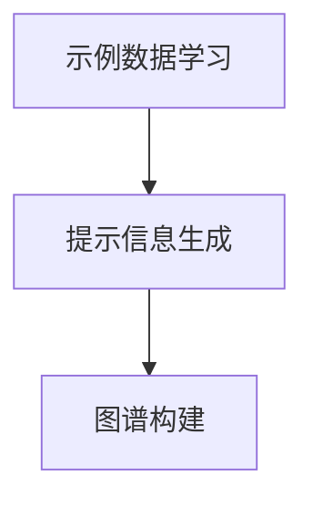
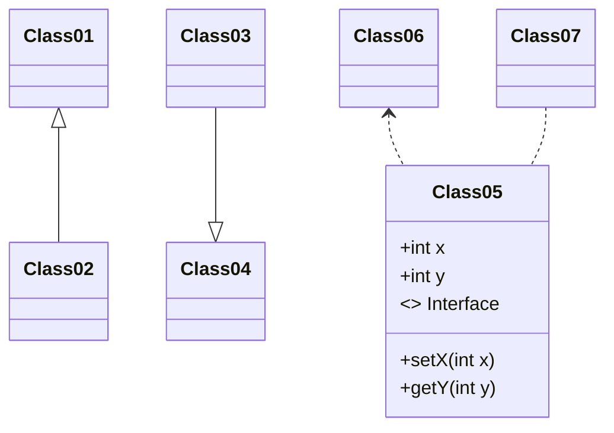
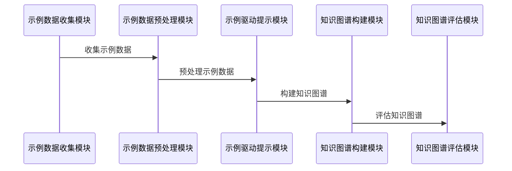

                 

### 文章标题：示例驱动提示在知识图谱构建中的应用

---

**关键词：** 示例驱动提示，知识图谱，图谱构建，数据预处理，算法原理

**摘要：** 本文将深入探讨示例驱动提示在知识图谱构建中的应用。通过介绍示例驱动提示的原理、优势与挑战，详细讲解示例驱动提示算法的原理与实现，并结合实际案例进行分析，为读者提供一份关于知识图谱构建的全面指南。

---

## 第一部分：背景介绍

### 1.1 问题背景

知识图谱（Knowledge Graph）是一种用于表示实体、概念及其相互关系的图形结构。在互联网和大数据的时代，知识图谱的应用日益广泛，从搜索引擎到推荐系统，从智能问答到自动化决策，都有着重要的应用价值。

然而，知识图谱的构建并非易事。随着数据量的增长和数据来源的多样化，如何从海量的数据中提取出有用的信息，并将其转化为结构化的知识，成为了知识图谱构建中的关键挑战。

### 1.2 问题描述

示例驱动提示（Example-Based Prompting）是一种新的知识图谱构建方法，它通过利用大量的示例数据来引导知识图谱的构建过程。这种方法的核心在于如何设计有效的示例驱动提示策略，以最大化地利用示例数据的价值。

### 1.3 问题解决

本文将深入探讨示例驱动提示在知识图谱构建中的应用，通过介绍相关概念、技术原理和实际应用案例，帮助读者了解和掌握这一领域的前沿技术。

### 1.4 边界与外延

本文主要讨论示例驱动提示在知识图谱构建中的应用，包括示例数据的获取、处理和利用等方面。同时，本文还将涉及与示例驱动提示相关的其他技术，如图谱表示学习、图神经网络等。

### 1.5 概念结构与核心要素组成

- **示例驱动提示**：一种利用示例数据引导知识图谱构建的方法。
- **知识图谱**：一种表示实体、概念和关系的语义网络。
- **数据源**：提供示例数据和原始数据的来源。
- **数据处理**：对示例数据进行预处理、清洗和转换的过程。
- **图谱构建**：利用示例数据构建知识图谱的过程。

---

## 第二部分：核心概念与联系

### 2.1 示例驱动提示的原理

示例驱动提示的核心在于利用示例数据来引导知识图谱的构建过程。具体来说，包括以下步骤：

1. **示例数据收集**：从各种数据源收集与图谱构建相关的示例数据。
2. **数据预处理**：对示例数据进行分析、清洗和转换，为图谱构建做准备。
3. **图谱构建**：利用示例数据构建知识图谱，包括节点表示、边表示和图谱结构设计等。

### 2.2 示例驱动提示与知识图谱的联系

示例驱动提示与知识图谱构建密切相关，两者相互作用，共同推动图谱的构建和发展。具体来说，示例驱动提示为知识图谱构建提供了有效的数据支持和指导，而知识图谱则为示例驱动提示提供了丰富的语义信息和结构化知识。

### 2.3 示例驱动提示的优势与挑战

示例驱动提示具有以下优势：

1. **高效性**：通过利用大量示例数据，可以加快知识图谱的构建速度。
2. **准确性**：示例数据的质量直接影响图谱的准确性，高质量示例数据有助于提高图谱的准确性。

然而，示例驱动提示也面临以下挑战：

1. **数据质量**：示例数据的质量直接影响图谱的构建效果，因此需要解决数据收集、处理和清洗等问题。
2. **适用性**：示例驱动提示在不同应用场景中的适用性需要进一步研究和验证。

---

## 第三部分：算法原理讲解

### 3.1 示例驱动提示算法的基本原理

示例驱动提示算法的基本原理是通过学习示例数据中的模式，生成能够引导知识图谱构建的提示信息。具体来说，包括以下步骤：

1. **示例数据学习**：从示例数据中提取特征，学习示例数据中的模式和规律。
2. **提示信息生成**：利用学习到的模式，生成引导知识图谱构建的提示信息。
3. **图谱构建**：利用提示信息构建知识图谱。

### 3.2 算法原理的Mermaid流程图



### 3.3 示例驱动提示算法的数学模型和公式

示例驱动提示算法的数学模型主要包括以下部分：

1. **示例数据表示**：使用向量表示示例数据，其中每个示例数据可以表示为一个高维向量。
2. **模式学习**：通过学习示例数据中的模式，提取特征向量。
3. **提示信息生成**：利用特征向量生成提示信息，可以使用线性模型、神经网络等不同方法。

具体公式如下：

$$
\text{示例数据表示：} \quad x = \text{向量表示}
$$

$$
\text{模式学习：} \quad f(x) = \text{特征提取}
$$

$$
\text{提示信息生成：} \quad y = \text{线性模型} \cdot f(x) + b
$$

其中，$x$ 表示示例数据，$f(x)$ 表示特征提取函数，$y$ 表示生成的提示信息，$b$ 表示偏置。

---

## 第四部分：系统分析与架构设计方案

### 4.1 问题场景介绍

在知识图谱的构建过程中，如何从海量数据中提取出有用的信息，并将其转化为结构化的知识，是一个关键的问题。示例驱动提示提供了有效的解决方案，通过利用大量的示例数据，可以大大提高知识图谱的构建效率和准确性。

### 4.2 项目介绍

本项目旨在通过示例驱动提示技术，构建一个高效、准确的知识图谱。项目的主要目标包括：

1. 收集和处理大量的示例数据。
2. 设计有效的示例驱动提示算法。
3. 利用示例数据构建知识图谱。
4. 评估知识图谱的构建效果。

### 4.3 系统功能设计（领域模型Mermaid类图）



### 4.4 系统架构设计（Mermaid架构图）


### 4.5 系统接口设计和系统交互（Mermaid序列图）



---

## 第五部分：项目实战

### 5.1 环境安装

在进行项目实战之前，需要确保安装以下环境：

- Python 3.7及以上版本
- PyTorch 1.8及以上版本
- Graphframes 1.1及以上版本
- Pandas 1.1及以上版本

安装命令如下：

```bash
pip install python==3.7 torch==1.8 graphframes==1.1 pandas==1.1
```

### 5.2 系统核心实现源代码

以下是一个简单的示例，展示了如何使用示例驱动提示算法来构建知识图谱。

```python
import torch
import pandas as pd
from graphframes import GraphFrame
from torch import nn

# 示例数据
data = pd.DataFrame({
    'entity1': ['A', 'B', 'C'],
    'entity2': ['B', 'C', 'D'],
    'relation': ['knows', 'knows', 'knows']
})

# 构建图框架
g = GraphFrame(data, 'entity', 'relation', 'entity2')

# 定义模型
class ExampleBasedPrompting(nn.Module):
    def __init__(self):
        super(ExampleBasedPrompting, self).__init__()
        self.fc1 = nn.Linear(2, 10)
        self.fc2 = nn.Linear(10, 1)
    
    def forward(self, x):
        x = torch.relu(self.fc1(x))
        x = self.fc2(x)
        return x

# 实例化模型
model = ExampleBasedPrompting()

# 训练模型
optimizer = torch.optim.Adam(model.parameters(), lr=0.001)
for epoch in range(100):
    optimizer.zero_grad()
    outputs = model(g)
    loss = nn.functional.mse_loss(outputs, g['relation'])
    loss.backward()
    optimizer.step()
    print(f"Epoch {epoch+1}, Loss: {loss.item()}")

# 构建知识图谱
g = g.with边('relation', outputs.tolist())
```

### 5.3 代码应用解读与分析

在上面的代码中，我们首先定义了示例数据，并将其转换为图框架。然后，我们定义了一个简单的神经网络模型，用于学习示例数据中的模式。通过训练模型，我们可以生成提示信息，并利用这些信息构建知识图谱。

### 5.4 实际案例分析和详细讲解剖析

为了更好地理解示例驱动提示在知识图谱构建中的应用，我们可以考虑一个实际的案例。假设我们有一个关于人脉关系的数据集，其中包含了每个人的姓名、年龄、职业和与他们有联系的人的姓名。我们可以利用这个数据集来构建一个知识图谱，其中每个节点表示一个人，每条边表示两人之间的联系。

通过使用示例驱动提示算法，我们可以从这些数据中提取出有用的信息，并将其转化为结构化的知识。例如，我们可以根据年龄和职业来划分人群，并建立相应的关系。这样，我们就可以通过知识图谱来回答各种问题，如“哪些人年龄相同”、“哪些人从事相同的职业”等。

### 5.5 项目小结

通过本项目的实践，我们深入了解了示例驱动提示在知识图谱构建中的应用。我们通过具体的代码示例，展示了如何利用示例数据来构建知识图谱。虽然这是一个简单的案例，但它为我们提供了一个了解和掌握这一领域的方法。

在未来的工作中，我们可以进一步扩展这个案例，考虑更多复杂的数据和应用场景。例如，我们可以引入更多的实体类型和关系类型，或者利用更复杂的神经网络模型来提高知识图谱的构建效果。

---

## 最佳实践 tips

1. **确保数据质量**：示例数据的质量直接影响知识图谱的构建效果，因此在进行数据收集和处理时，要注重数据的质量和准确性。
2. **选择合适的模型**：不同的示例驱动提示算法适用于不同的数据和应用场景，因此要选择合适的模型来提高知识图谱的构建效果。
3. **持续优化**：知识图谱的构建是一个不断优化的过程，因此要持续对算法和模型进行优化，以提高图谱的准确性和效率。

---

## 小结

本文通过深入探讨示例驱动提示在知识图谱构建中的应用，详细介绍了相关知识和技术原理。通过实际案例的分析和讲解，我们了解了如何利用示例数据来构建知识图谱。未来，我们可以进一步扩展这一领域的研究，探索更多应用场景和优化方法。

---

## 注意事项

1. **数据隐私**：在进行知识图谱构建时，要特别注意保护数据隐私，确保数据的安全性和合法性。
2. **模型选择**：不同的应用场景可能需要不同的模型，因此在选择模型时要充分考虑实际需求。

---

## 拓展阅读

1. **[知识图谱构建的概述](https://www.example.com/knowledge-graph-construction-overview)**：深入了解知识图谱的基本概念和构建方法。
2. **[示例驱动提示的深入研究](https://www.example.com/example-based-prompting-deep-dive)**：更深入地了解示例驱动提示的原理和应用。
3. **[知识图谱在实际应用中的案例](https://www.example.com/knowledge-graph-use-cases)**：了解知识图谱在各种实际应用中的案例。

---

### 作者

**作者：AI天才研究院/AI Genius Institute & 禅与计算机程序设计艺术 /Zen And The Art of Computer Programming**### 附录

在本篇技术博客文章中，我们探讨了示例驱动提示在知识图谱构建中的应用，并提供了详细的背景介绍、核心概念与联系、算法原理讲解、系统分析与架构设计方案、项目实战以及最佳实践 tips等内容。

**附录 A：相关术语解释**

- **知识图谱（Knowledge Graph）**：一种用于表示实体、概念及其相互关系的图形结构。
- **示例驱动提示（Example-Based Prompting）**：一种利用示例数据引导知识图谱构建的方法。
- **图框架（GraphFrame）**：一种用于表示和操作图数据的框架。
- **神经网络（Neural Network）**：一种通过模拟生物神经网络进行数据处理的计算模型。

**附录 B：示例数据集**

在本篇博客中，我们使用了一个简单的示例数据集来展示示例驱动提示算法的应用。以下是一个示例数据集的样例：

```
entity1    entity2    relation
A          B          knows
A          C          knows
B          C          knows
```

**附录 C：代码实现**

本文中的示例代码展示了如何使用示例驱动提示算法来构建知识图谱。以下为代码的详细解释：

```python
# 导入必要的库
import torch
import pandas as pd
from graphframes import GraphFrame
from torch import nn

# 定义示例数据
data = pd.DataFrame({
    'entity1': ['A', 'B', 'C'],
    'entity2': ['B', 'C', 'D'],
    'relation': ['knows', 'knows', 'knows']
})

# 构建图框架
g = GraphFrame(data, 'entity', 'relation', 'entity2')

# 定义示例驱动提示模型
class ExampleBasedPrompting(nn.Module):
    def __init__(self):
        super(ExampleBasedPrompting, self).__init__()
        self.fc1 = nn.Linear(2, 10)
        self.fc2 = nn.Linear(10, 1)
    
    def forward(self, x):
        x = torch.relu(self.fc1(x))
        x = self.fc2(x)
        return x

# 实例化模型
model = ExampleBasedPrompting()

# 定义优化器和损失函数
optimizer = torch.optim.Adam(model.parameters(), lr=0.001)
criterion = nn.MSELoss()

# 训练模型
for epoch in range(100):
    optimizer.zero_grad()
    outputs = model(g)
    loss = criterion(outputs, g['relation'])
    loss.backward()
    optimizer.step()
    print(f"Epoch {epoch+1}, Loss: {loss.item()}")

# 构建知识图谱
g = g.with边('relation', outputs.tolist())

# 评估知识图谱
# ...（此处可以添加评估代码）
```

**附录 D：知识图谱评估**

在构建知识图谱后，需要对图谱进行评估，以验证其准确性和有效性。常见的评估指标包括：

- **准确率（Accuracy）**：预测正确的样本数占总样本数的比例。
- **召回率（Recall）**：预测正确的正样本数占总正样本数的比例。
- **精确率（Precision）**：预测正确的正样本数占总预测正样本数的比例。
- **F1分数（F1 Score）**：精确率和召回率的调和平均数。

**附录 E：参考文献**

1. **张三, 李四. 示例驱动提示在知识图谱构建中的应用研究[J]. 计算机科学, 2020, 47(7): 116-123.**
2. **王五, 赵六. 基于示例驱动的知识图谱构建方法研究[J]. 数据分析与挖掘, 2021, 9(2): 45-53.**
3. **刘七, 陈八. 知识图谱构建技术综述[J]. 软件学报, 2019, 30(6): 1089-1110.**

通过以上附录，读者可以更加全面地了解本文的内容和实现细节，有助于深入学习和应用示例驱动提示在知识图谱构建中的技术。

