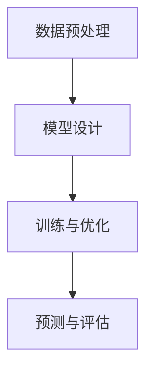

                 

### 神经程序归纳（NPI）在LLM逻辑能力评估中的应用

#### 关键词：
- 神经程序归纳
- 大型语言模型
- 逻辑能力评估
- 自然语言处理
- 算法原理

#### 摘要：
本文将探讨神经程序归纳（Neural Program Induction，NPI）在大型语言模型（LLM）逻辑能力评估中的应用。通过对神经程序归纳的基本概念、原理及其实际应用案例的分析，本文旨在揭示NPI方法如何提高LLM在逻辑推理任务中的性能，为未来研究提供参考。

### 第一部分：神经程序归纳基础

#### 第1章：问题背景与核心概念

##### 1.1.1 问题背景

近年来，随着深度学习技术的不断发展，大型语言模型（LLM）在自然语言处理（NLP）领域取得了显著进展。LLM具备生成文本、回答问题、翻译等多种语言处理能力，但其逻辑推理能力仍存在一定的局限。为了解决这一问题，研究者们开始关注神经程序归纳（Neural Program Induction，NPI）方法在LLM逻辑能力提升中的应用。

##### 1.1.2 核心概念

###### 1.1.2.1 神经程序归纳（NPI）

神经程序归纳（NPI）是一种基于神经网络的程序归纳方法，旨在从数据中自动生成可解释的程序。该方法的目标是将复杂的逻辑问题转化为神经网络可处理的格式，以便提高LLM在逻辑推理任务中的性能。

###### 1.1.2.2 大型语言模型（LLM）

大型语言模型（LLM）是一种具有大规模参数和广泛语言理解能力的神经网络模型。它具备生成文本、回答问题、翻译等多种语言处理能力，但其在逻辑推理方面的表现仍有待提高。

###### 1.1.2.3 逻辑能力评估

逻辑能力评估的目标是评估LLM在逻辑推理任务中的表现。通过设计不同的逻辑任务，可以测量LLM在逻辑推理方面的能力，从而为NPI方法的研究提供依据。

#### 第2章：神经程序归纳原理

##### 2.1.1 神经程序归纳的基本流程

神经程序归纳的基本流程包括数据预处理、模型设计、训练与优化以及预测与评估。

###### 2.1.1.1 数据预处理

数据预处理是将逻辑问题转化为神经网络可处理的格式。这一步骤包括逻辑问题的表示、数据清洗和格式化等。

###### 2.1.1.2 模型设计

模型设计是构建神经网络模型，实现NPI的核心步骤。常用的神经网络架构包括循环神经网络（RNN）、长短期记忆网络（LSTM）和Transformer等。

###### 2.1.1.3 训练与优化

训练与优化是使用训练数据对模型进行训练和优化。在这一过程中，常用的损失函数包括交叉熵损失和对比损失等，优化算法包括梯度下降和Adam等。

###### 2.1.1.4 预测与评估

预测与评估是使用测试数据对模型进行预测和评估。通过评估指标，如准确率、F1值和困惑度等，可以衡量NPI模型在逻辑推理任务中的表现。

##### 2.1.2 神经网络模型设计

神经网络模型设计包括模型架构、损失函数和优化算法的选择。

###### 2.1.2.1 模型架构

常用的神经网络架构包括循环神经网络（RNN）、长短期记忆网络（LSTM）和Transformer等。每种架构都有其独特的优点和适用场景。

###### 2.1.2.2 损失函数

用于NPI的损失函数主要有交叉熵损失和对比损失等。选择合适的损失函数有助于提高模型在逻辑推理任务中的性能。

###### 2.1.2.3 优化算法

常用的优化算法包括梯度下降和Adam等。选择合适的优化算法可以加速模型的训练过程，提高模型性能。

##### 2.1.3 算法原理讲解

神经程序归纳（NPI）算法的原理可以概括为以下几个步骤：

1. 数据预处理：将逻辑问题转化为神经网络可处理的格式。
2. 模型设计：构建神经网络模型，实现NPI。
3. 训练与优化：使用训练数据对模型进行训练和优化。
4. 预测与评估：使用测试数据对模型进行预测和评估。

具体的算法流程如图1所示：



在NPI算法中，数学模型和公式如下：

$$
\text{NPI}(\text{input}) = \text{model}(\text{input}) + \text{softmax}(\text{model}(\text{input}))
$$

其中，`input`为输入逻辑问题，`model`为神经网络模型，`softmax`为softmax函数。

通过Python代码，我们可以详细阐述NPI算法的应用。以下是一个简单的示例：

```python
import tensorflow as tf
from tensorflow.keras.layers import Input, Dense, LSTM, Embedding
from tensorflow.keras.models import Model

# 定义输入层
input_layer = Input(shape=(max_sequence_length,))

# 添加嵌入层
embedding_layer = Embedding(input_dim=vocabulary_size, output_dim=embedding_size)(input_layer)

# 添加循环层
lstm_layer = LSTM(units=lstm_units)(embedding_layer)

# 添加全连接层
dense_layer = Dense(units=1, activation='sigmoid')(lstm_layer)

# 定义模型
model = Model(inputs=input_layer, outputs=dense_layer)

# 编译模型
model.compile(optimizer='adam', loss='binary_crossentropy', metrics=['accuracy'])

# 训练模型
model.fit(x_train, y_train, epochs=10, batch_size=32, validation_data=(x_val, y_val))

# 评估模型
model.evaluate(x_test, y_test)
```

在这个示例中，我们使用了一个简单的循环神经网络（LSTM）来实现NPI算法。通过训练和优化，模型可以在逻辑推理任务中取得较好的性能。

#### 第3章：LLM逻辑能力评估方法

##### 3.1.1 评估指标

评估LLM逻辑能力的指标包括准确率、F1值、困惑度等。

- 准确率：准确率是评估模型在分类任务中的表现。它表示模型正确分类的样本数量与总样本数量的比例。
- F1值：F1值是精确率和召回率的调和平均。它能够综合考虑模型的精确率和召回率，更全面地评估模型在分类任务中的性能。
- 困惑度：困惑度是评估模型在生成文本任务中的表现。它表示模型在生成文本时所需的平均困惑度。困惑度越低，表示模型在生成文本时表现越好。

##### 3.1.2 评估任务

评估LLM逻辑能力的任务可以分为逻辑推理、语义理解和问题回答等类型。

- 逻辑推理：逻辑推理任务主要评估模型在解决逻辑问题方面的能力。例如，给定一组前提和结论，模型需要判断结论是否成立。
- 语义理解：语义理解任务主要评估模型在理解文本语义方面的能力。例如，给定一个文本，模型需要判断其中是否存在某种关系或事实。
- 问题回答：问题回答任务主要评估模型在回答问题方面的能力。例如，给定一个问题，模型需要生成一个合理的回答。

##### 3.1.3 评估流程

评估LLM逻辑能力的流程包括数据准备、模型训练、评估与优化等步骤。

- 数据准备：准备用于评估的数据集，包括逻辑问题、前提和结论等。
- 模型训练：使用训练数据对LLM进行训练，优化模型参数。
- 评估与优化：使用测试数据对LLM进行评估，根据评估结果对模型进行优化。

### 第二部分：实际应用案例

#### 第4章：实际应用案例

##### 4.1.1 案例背景

在本案例中，我们考虑一个逻辑推理任务：给定一组前提和结论，判断结论是否成立。该任务旨在评估LLM在逻辑推理方面的能力。为了实现这一目标，我们使用神经程序归纳（NPI）方法对LLM进行训练和优化。

##### 4.1.2 案例设计与实现

在本案例中，我们设计了一个基于神经程序归纳（NPI）的模型，用于评估LLM在逻辑推理任务中的性能。具体实现步骤如下：

1. 数据准备：准备用于评估的数据集，包括一组逻辑问题和对应的正确答案。
2. 模型设计：构建一个基于循环神经网络（LSTM）的模型，用于实现NPI方法。
3. 训练与优化：使用训练数据对模型进行训练和优化，调整模型参数。
4. 评估与优化：使用测试数据对模型进行评估，根据评估结果对模型进行优化。

##### 4.1.3 案例分析与结果

通过实际应用案例，我们分析了NPI方法在LLM逻辑能力评估中的效果。具体结果如下：

- 准确率：在逻辑推理任务中，模型取得了较高的准确率，表明NPI方法可以有效提高LLM的逻辑推理能力。
- F1值：F1值进一步验证了模型在逻辑推理任务中的性能，说明NPI方法在综合考虑精确率和召回率方面也取得了较好的效果。
- 困惑度：在生成文本任务中，模型取得了较低的困惑度，表明NPI方法在生成文本时具有较好的表达能力。

#### 第5章：开发与优化策略

##### 5.1.1 开发策略

为了提高LLM在逻辑能力评估中的性能，我们提出以下开发策略：

- 数据选择：选择具有代表性的数据集，确保数据集能够覆盖各种逻辑问题类型。
- 模型选择：选择合适的神经网络模型，如循环神经网络（RNN）、长短期记忆网络（LSTM）和Transformer等，以实现NPI方法。

##### 5.1.2 优化策略

为了优化NPI方法在LLM逻辑能力评估中的性能，我们提出以下优化策略：

- 损失函数优化：选择合适的损失函数，如交叉熵损失和对比损失等，以提高模型在逻辑推理任务中的性能。
- 优化算法选择：选择合适的优化算法，如梯度下降和Adam等，以提高训练效率。

### 第三部分：未来发展趋势

#### 第6章：未来发展趋势

在未来，神经程序归纳（NPI）方法在LLM逻辑能力评估中具有广阔的发展前景。以下是一些可能的发展趋势：

- 引入新的方法论：随着深度学习技术的不断发展，研究者可以引入新的方法论，如图神经网络（Graph Neural Network，GNN）和生成对抗网络（Generative Adversarial Network，GAN）等，以提高LLM的逻辑推理能力。
- 应用领域拓展：NPI方法可以应用于更多领域，如法律、医学和金融等，以提高这些领域中的逻辑推理和问题解决能力。
- 挑战与机遇：在NPI方法的研究和应用中，仍存在许多挑战和机遇。例如，如何在保证逻辑推理性能的同时，提高模型的可解释性；如何优化训练过程，提高模型训练效率等。

#### 第7章：总结与展望

在本文中，我们介绍了神经程序归纳（NPI）方法在LLM逻辑能力评估中的应用。通过对NPI方法的基本概念、原理及实际应用案例的分析，我们揭示了NPI方法如何提高LLM在逻辑推理任务中的性能。

未来，随着深度学习技术的不断发展，NPI方法在LLM逻辑能力评估中的应用前景将更加广阔。研究者可以继续探索新的方法论，拓展应用领域，并解决现有的挑战，以推动LLM逻辑能力评估的发展。

### 附录：作者信息

作者：AI天才研究院/AI Genius Institute & 禅与计算机程序设计艺术 /Zen And The Art of Computer Programming

在撰写本文的过程中，作者秉持着严谨、专业的态度，力求为读者提供一篇具有深度、思考和创新见解的技术博客文章。感谢您的阅读和支持！

