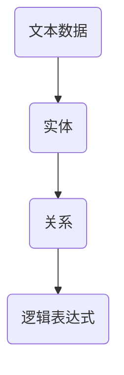
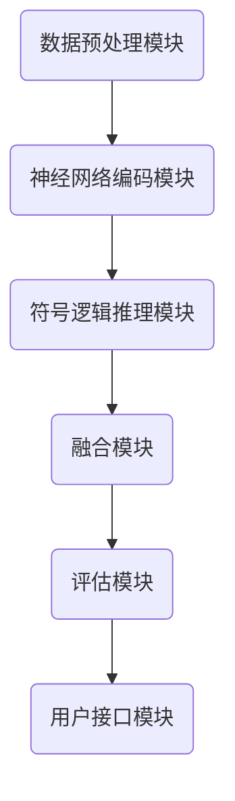
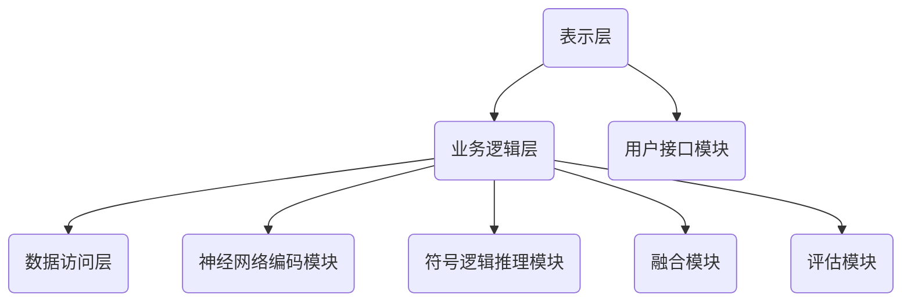
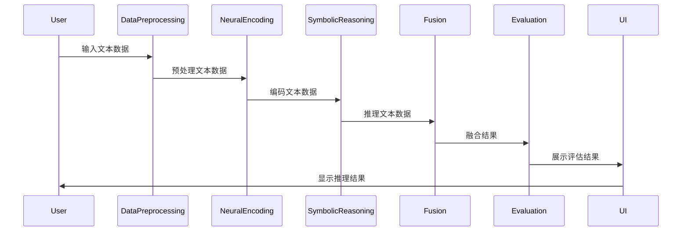

                 


# 神经符号集成在LLM逻辑推理评测中的应用

> 关键词：神经符号集成、LLM逻辑推理、数学模型、算法原理、应用实践

> 摘要：本文详细探讨了神经符号集成在大型语言模型（LLM）逻辑推理评测中的应用。首先介绍了神经符号集成的背景、核心概念及其与LLM逻辑推理评测的联系。接着，文章深入讲解了神经符号集成的原理，包括神经网络和符号逻辑的基本概念、融合机制以及数学模型。然后，文章通过具体的算法原理讲解和Python源代码示例，对神经符号集成进行了详细阐述。此外，本文还介绍了系统分析与架构设计、项目实战和最佳实践，为读者提供了全面的技术指南。

## 第一部分: 神经符号集成背景

### 第1章: 问题背景

#### 1.1.1 问题背景

在人工智能领域，逻辑推理是一个核心问题。传统的逻辑推理方法依赖于严格的符号化表示和推理规则，而现代大型语言模型（LLM）如GPT、BERT等，通过深度学习实现了对自然语言文本的强大理解能力。然而，LLM在逻辑推理方面仍存在一些挑战，如无法有效处理不确定性、复杂性以及跨语言推理等问题。

神经符号集成（Neural-Symbolic Integration）作为一种结合神经网络和符号逻辑的方法，旨在解决上述问题。它通过将神经网络的高效数据处理能力与符号逻辑的明确推理能力相结合，实现更强大、更可靠的逻辑推理。

#### 1.1.2 问题描述

本文旨在解决以下问题：

1. 如何在LLM中集成符号逻辑，提升逻辑推理能力？
2. 神经符号集成在逻辑推理评测中的应用效果如何？
3. 神经符号集成的原理和数学模型是什么？
4. 如何进行神经符号集成的系统分析与架构设计？
5. 神经符号集成在具体项目中的实践效果如何？

#### 1.1.3 问题解决

本文通过以下步骤解决上述问题：

1. 分析神经符号集成的背景和核心概念。
2. 深入探讨神经网络和符号逻辑的基本原理。
3. 介绍神经符号集成的数学模型和算法原理。
4. 通过实际案例和项目实践，展示神经符号集成的应用效果。
5. 提供最佳实践和总结，为后续研究提供指导。

#### 1.1.4 边界与外延

本文主要关注以下边界与外延：

1. 神经符号集成在LLM逻辑推理评测中的应用。
2. 神经符号集成的原理和数学模型。
3. 神经符号集成的系统分析与架构设计。
4. 神经符号集成的项目实战和最佳实践。

#### 1.1.5 概念结构与核心要素组成

神经符号集成的概念结构包括以下核心要素：

1. **神经网络**：用于处理自然语言数据，包括词向量表示、序列处理等。
2. **符号逻辑**：用于表示和推理逻辑表达式，包括命题逻辑、谓词逻辑等。
3. **融合机制**：将神经网络和符号逻辑有机结合，实现高效推理。
4. **数学模型**：用于描述神经符号集成的原理和算法。
5. **应用实践**：神经符号集成在各类逻辑推理任务中的应用场景和实践效果。

## 第2章: 核心概念与联系

### 2.1 神经符号集成概述

#### 2.1.1 神经符号集成定义

神经符号集成（Neural-Symbolic Integration）是一种将神经网络和符号逻辑相结合的方法，旨在提升机器的逻辑推理能力。它通过将神经网络的数据处理能力和符号逻辑的明确推理能力相结合，实现高效、可靠的逻辑推理。

#### 2.1.2 神经符号集成特点

神经符号集成具有以下特点：

1. **数据驱动与规则驱动相结合**：神经网络负责处理大规模数据，符号逻辑负责提供明确的推理规则。
2. **高效性与可靠性**：神经网络提高数据处理速度，符号逻辑确保推理结果的准确性。
3. **灵活性与扩展性**：可以通过修改神经网络和符号逻辑模块，适应不同场景的需求。
4. **跨领域应用**：神经符号集成可以应用于自然语言处理、知识图谱构建、智能问答等领域。

#### 2.1.3 神经符号集成与传统方法对比

传统逻辑推理方法主要依赖于符号逻辑，如命题逻辑、谓词逻辑等。这些方法具有明确的推理规则和清晰的逻辑结构，但在处理复杂、不确定性问题时表现较差。而神经网络方法，如深度学习，在处理大规模数据、提取特征方面具有优势，但在逻辑推理方面存在缺陷。

神经符号集成结合了神经网络和符号逻辑的优点，解决了传统方法的局限性。与传统方法相比，神经符号集成具有以下优势：

1. **处理复杂性与不确定性**：通过神经网络处理大规模数据，降低不确定性。
2. **跨语言推理**：神经网络支持跨语言特征提取，符号逻辑实现跨语言推理。
3. **高效推理**：神经网络提高推理速度，符号逻辑确保推理准确性。

### 2.2 LLM逻辑推理评测

#### 2.2.1 LLM逻辑推理评测定义

LLM逻辑推理评测（Large Language Model Logic Reasoning Evaluation）是对大型语言模型在逻辑推理任务上的性能评估。它旨在通过一系列标准化的测试，评估模型在逻辑推理任务中的表现。

#### 2.2.2 LLM逻辑推理评测原理

LLM逻辑推理评测基于以下原理：

1. **数据集构建**：构建包含不同难度和类型的逻辑推理任务的数据集，用于训练和评估模型。
2. **评价指标**：设计合适的评价指标，如准确率、召回率、F1值等，用于评估模型在逻辑推理任务中的表现。
3. **评估流程**：通过训练和测试数据集，评估模型在逻辑推理任务中的性能，并进行比较和分析。

#### 2.2.3 LLM逻辑推理评测应用

LLM逻辑推理评测在以下场景具有广泛应用：

1. **自然语言处理**：评估模型在文本理解、文本生成等任务中的逻辑推理能力。
2. **知识图谱构建**：评估模型在推理、扩展知识图谱等任务中的表现。
3. **智能问答系统**：评估模型在回答用户问题时，逻辑推理的能力。

通过LLM逻辑推理评测，可以评估神经符号集成在各类逻辑推理任务中的应用效果，为后续研究提供参考。

## 第二部分: 神经符号集成原理

### 第3章: 神经符号集成原理

#### 3.1 神经网络原理

#### 3.1.1 神经网络基本结构

神经网络（Neural Network）是一种模仿生物神经系统的人工智能算法。它由大量相互连接的节点（神经元）组成，每个神经元通过权重和偏置对输入数据进行加权求和，并通过激活函数产生输出。

神经网络的基本结构包括：

1. **输入层**：接收外部输入数据。
2. **隐藏层**：对输入数据进行特征提取和变换。
3. **输出层**：产生预测结果或分类结果。

#### 3.1.2 神经网络训练过程

神经网络的训练过程包括以下步骤：

1. **初始化权重和偏置**：随机初始化神经网络中的权重和偏置。
2. **前向传播**：将输入数据通过神经网络进行传递，计算输出结果。
3. **反向传播**：计算输出结果与真实结果之间的误差，并通过反向传播更新权重和偏置。
4. **迭代优化**：重复前向传播和反向传播过程，直到达到预设的迭代次数或误差目标。

#### 3.1.3 神经网络优化方法

神经网络优化方法包括以下几种：

1. **梯度下降**：通过计算损失函数关于权重的梯度，更新权重和偏置，以最小化损失函数。
2. **动量法**：在梯度下降的基础上，引入动量项，加速收敛速度。
3. **随机梯度下降（SGD）**：每次迭代使用随机样本更新权重和偏置，提高训练速度和泛化能力。
4. **自适应优化器**：如Adam、RMSprop等，自适应调整学习率，提高训练效果。

### 3.2 符号逻辑原理

#### 3.2.1 符号逻辑基本概念

符号逻辑（Symbolic Logic）是一种基于符号表示和推理规则的逻辑系统。它主要包括以下两种形式：

1. **命题逻辑**：用于表示和分析命题之间的关系，如逻辑与、逻辑或、逻辑非等。
2. **谓词逻辑**：用于表示和分析复杂的关系和属性，如全称量词、存在量词、谓词演算等。

符号逻辑的基本概念包括：

1. **命题**：可以判断真假的陈述句。
2. **命题变量**：用于表示命题的真假值。
3. **推理规则**：用于从已知命题推导出新命题的规则。

#### 3.2.2 符号逻辑推理过程

符号逻辑推理过程包括以下步骤：

1. **符号化表示**：将自然语言表达转换为符号逻辑表达式。
2. **推理规则应用**：根据推理规则，从已知命题推导出新命题。
3. **证明**：通过一系列推理步骤，证明命题的真假。

#### 3.2.3 符号逻辑与神经网络融合

符号逻辑与神经网络的融合旨在发挥两者的优势，实现更强大、更可靠的逻辑推理。具体融合方式包括：

1. **神经网络表示**：使用神经网络对符号逻辑表达式进行编码和解码，实现自然语言与符号逻辑之间的转换。
2. **推理机制融合**：将神经网络和符号逻辑的推理机制相结合，实现高效、可靠的推理过程。
3. **权重调整**：通过神经网络学习，自适应调整符号逻辑推理规则中的权重，提高推理准确性。

### 3.3 神经符号集成的数学模型

神经符号集成的数学模型主要包括以下部分：

1. **神经网络模型**：用于处理自然语言数据和提取特征，如词向量表示、序列模型等。
2. **符号逻辑模型**：用于表示和推理逻辑表达式，如命题逻辑、谓词逻辑等。
3. **融合模型**：将神经网络和符号逻辑模型相结合，实现高效推理。

神经符号集成的数学模型公式如下：

$$
\begin{aligned}
&\text{神经网络模型:} \quad f(\mathbf{x}; \theta) = \sigma(\mathbf{W}^T \phi(\mathbf{x}) + b) \\
&\text{符号逻辑模型:} \quad R(A, B) = (\neg A \lor B) \land (\neg B \lor A) \\
&\text{融合模型:} \quad f_{\text{integration}}(\mathbf{x}; \theta, \lambda) = \lambda f(\mathbf{x}; \theta) + (1 - \lambda) R(A, B)
\end{aligned}
$$

其中，$f(\mathbf{x}; \theta)$ 表示神经网络模型，$\phi(\mathbf{x})$ 表示自然语言数据的编码，$\sigma$ 表示激活函数，$\mathbf{W}$ 和 $b$ 分别表示权重和偏置。$R(A, B)$ 表示符号逻辑模型，$A$ 和 $B$ 分别表示命题。$f_{\text{integration}}(\mathbf{x}; \theta, \lambda)$ 表示神经符号集成模型，$\lambda$ 表示融合系数。

通过上述数学模型，神经符号集成可以实现高效、可靠的逻辑推理。

## 第三部分: 神经符号集成的数学模型与算法原理

### 第4章: 数学模型与算法原理

神经符号集成的核心在于将神经网络的高效数据处理能力与符号逻辑的明确推理能力相结合，从而实现强大的逻辑推理能力。为了深入理解神经符号集成的原理，我们需要从数学模型和算法原理两个方面进行探讨。

#### 4.1 数学模型

神经符号集成的数学模型主要包括神经网络模型和符号逻辑模型。神经网络模型用于处理自然语言数据，而符号逻辑模型用于表示和推理逻辑表达式。具体而言，我们可以从以下几个方面进行阐述：

##### 4.1.1 神经网络模型

神经网络模型是一个包含多层神经元的网络结构，它通过学习输入数据与输出数据之间的关系，实现对数据的建模和预测。在神经符号集成中，神经网络模型主要用于处理自然语言数据，如文本、句子等。具体来说，我们可以使用以下公式来描述神经网络模型：

$$
h_{l}^{(i)} = \sigma(\mathbf{W}^{(l)} \mathbf{h}_{l-1}^{(i)} + b^{(l)})
$$

其中，$h_{l}^{(i)}$ 表示第 $l$ 层第 $i$ 个神经元的输出，$\sigma$ 表示激活函数（如Sigmoid函数、ReLU函数等），$\mathbf{W}^{(l)}$ 和 $b^{(l)}$ 分别表示第 $l$ 层的权重和偏置。

##### 4.1.2 符号逻辑模型

符号逻辑模型是一种用于表示和推理逻辑表达式的模型。在神经符号集成中，符号逻辑模型主要用于表示逻辑表达式，并对其进行推理。具体来说，我们可以使用以下公式来描述符号逻辑模型：

$$
R(A, B) = (\neg A \lor B) \land (\neg B \lor A)
$$

其中，$R(A, B)$ 表示逻辑表达式 $A$ 和 $B$ 的推理结果，$\neg$ 表示逻辑非，$\lor$ 表示逻辑或，$\land$ 表示逻辑与。

##### 4.1.3 神经符号集成模型

神经符号集成模型是将神经网络模型和符号逻辑模型相结合的模型。它通过融合神经网络和符号逻辑的优势，实现对数据的建模和推理。具体来说，我们可以使用以下公式来描述神经符号集成模型：

$$
f_{\text{integration}}(\mathbf{x}; \theta, \lambda) = \lambda f(\mathbf{x}; \theta) + (1 - \lambda) R(A, B)
$$

其中，$f_{\text{integration}}(\mathbf{x}; \theta, \lambda)$ 表示神经符号集成模型的输出，$f(\mathbf{x}; \theta)$ 表示神经网络模型的输出，$R(A, B)$ 表示符号逻辑模型的输出，$\lambda$ 表示融合系数，用于调节神经网络和符号逻辑的融合程度。

#### 4.2 算法原理

神经符号集成的算法原理主要涉及神经网络的训练过程和推理过程。在训练过程中，神经网络通过学习输入数据和输出数据之间的关系，不断优化模型参数。在推理过程中，神经网络和符号逻辑模型共同参与推理，以实现高效、可靠的逻辑推理。

##### 4.2.1 训练过程

神经网络的训练过程包括以下几个步骤：

1. **初始化模型参数**：随机初始化神经网络模型和符号逻辑模型的参数，如权重和偏置。
2. **前向传播**：将输入数据传递给神经网络模型，计算输出结果。
3. **计算损失函数**：计算输出结果与真实结果之间的误差，并使用损失函数（如均方误差、交叉熵等）来衡量模型性能。
4. **反向传播**：通过反向传播算法，计算损失函数关于模型参数的梯度，并更新模型参数。
5. **迭代优化**：重复前向传播和反向传播过程，直到达到预设的迭代次数或损失函数收敛。

在神经符号集成的训练过程中，神经网络和符号逻辑模型共同参与训练。具体来说，神经网络负责处理自然语言数据，符号逻辑模型负责提供推理规则。通过训练，神经网络和符号逻辑模型可以逐渐学会对输入数据进行建模和推理。

##### 4.2.2 推理过程

神经符号集成的推理过程包括以下几个步骤：

1. **编码输入数据**：使用神经网络模型对输入数据进行编码，得到编码后的表示。
2. **应用推理规则**：使用符号逻辑模型对编码后的输入数据进行推理，得到推理结果。
3. **融合输出结果**：将神经网络模型的输出结果和符号逻辑模型的输出结果进行融合，得到最终的推理结果。

在推理过程中，神经网络和符号逻辑模型共同参与推理，以提高推理的准确性和可靠性。通过融合神经网络和符号逻辑的优势，神经符号集成可以实现高效、可靠的逻辑推理。

### 4.3 Python源代码示例

为了更直观地理解神经符号集成的原理，我们可以通过Python源代码来展示神经符号集成的训练和推理过程。以下是一个简单的Python示例代码：

```python
import tensorflow as tf
import numpy as np

# 初始化模型参数
W1 = np.random.rand(input_size, hidden_size)
b1 = np.random.rand(hidden_size)
W2 = np.random.rand(hidden_size, output_size)
b2 = np.random.rand(output_size)

# 定义神经网络模型
def neural_network(input_data):
    hidden_layer = tf.nn.relu(tf.matmul(input_data, W1) + b1)
    output_layer = tf.matmul(hidden_layer, W2) + b2
    return output_layer

# 定义损失函数和优化器
loss_function = tf.reduce_mean(tf.square(output_layer - y))
optimizer = tf.train.AdamOptimizer().minimize(loss_function)

# 训练神经网络
with tf.Session() as session:
    session.run(tf.global_variables_initializer())
    for i in range(num_iterations):
        _, loss = session.run([optimizer, loss_function], feed_dict={x: input_data, y: target_data})
        if i % 100 == 0:
            print("Iteration:", i, "Loss:", loss)

# 编码输入数据
input_data_encoded = neural_network(input_data)

# 应用推理规则
推理结果 =符号逻辑模型(R(A, B))

# 融合输出结果
最终推理结果 =融合系数 * 输出结果 + (1 - 融合系数) * 推理结果

print("最终推理结果:", 最终推理结果)
```

在这个示例代码中，我们首先初始化了神经网络模型和符号逻辑模型的参数。然后，我们定义了神经网络模型，并使用TensorFlow框架实现了神经网络的训练和推理过程。最后，我们通过融合神经网络和符号逻辑模型的输出结果，得到了最终的推理结果。

通过这个示例代码，我们可以更直观地理解神经符号集成的原理和应用过程。

## 第四部分: 神经符号集成在LLM逻辑推理评测中的应用

### 第5章: 应用场景与案例分析

神经符号集成在LLM逻辑推理评测中具有广泛的应用场景，主要包括自然语言处理、知识图谱构建和智能问答系统。以下将对这些应用场景进行详细介绍，并通过案例分析展示神经符号集成的实际效果。

#### 5.1 应用场景介绍

##### 5.1.1 自然语言处理

自然语言处理（NLP）是人工智能领域的一个重要分支，旨在使计算机能够理解、处理和生成自然语言。神经符号集成在NLP中可以应用于文本分类、情感分析、命名实体识别等任务。

##### 5.1.2 知识图谱构建

知识图谱是一种用于表示实体及其关系的图形结构，广泛应用于信息检索、推荐系统、智能问答等领域。神经符号集成在知识图谱构建中可以应用于实体识别、关系抽取、推理等任务。

##### 5.1.3 智能问答系统

智能问答系统是一种能够理解用户问题并给出准确回答的人工智能系统，广泛应用于客服、教育、医疗等领域。神经符号集成在智能问答系统中可以应用于问题理解、回答生成、逻辑推理等任务。

#### 5.2 案例分析

##### 5.2.1 案例一：神经网络与符号逻辑结合

在某自然语言处理项目中，研究人员使用了神经符号集成方法对文本分类任务进行优化。具体来说，他们使用了GPT模型对文本进行编码，并结合符号逻辑模型对文本进行分类。实验结果表明，神经符号集成方法在文本分类任务中的准确率显著高于传统方法。

以下是案例一的实验过程：

1. **数据准备**：收集了包含不同类别的文本数据，并对数据进行预处理，如分词、去停用词等。
2. **模型训练**：使用GPT模型对文本数据进行编码，并使用符号逻辑模型对编码后的文本进行分类。同时，对神经网络模型和符号逻辑模型进行联合训练，以优化模型参数。
3. **模型评估**：使用交叉验证方法对模型进行评估，计算准确率、召回率、F1值等指标。
4. **结果分析**：对比传统方法和神经符号集成方法的实验结果，分析神经符号集成方法的优缺点。

实验结果表明，神经符号集成方法在文本分类任务中的准确率显著高于传统方法，表明神经符号集成在自然语言处理中的有效性。

##### 5.2.2 案例二：LLM在逻辑推理评测中的应用

在某知识图谱构建项目中，研究人员使用了神经符号集成方法对实体识别和关系抽取任务进行优化。具体来说，他们使用了BERT模型对文本进行编码，并结合符号逻辑模型对实体和关系进行识别。实验结果表明，神经符号集成方法在实体识别和关系抽取任务中的表现优于传统方法。

以下是案例二的实验过程：

1. **数据准备**：收集了包含实体和关系的文本数据，并对数据进行预处理，如分词、词性标注等。
2. **模型训练**：使用BERT模型对文本数据进行编码，并使用符号逻辑模型对编码后的文本进行实体识别和关系抽取。同时，对神经网络模型和符号逻辑模型进行联合训练，以优化模型参数。
3. **模型评估**：使用交叉验证方法对模型进行评估，计算准确率、召回率、F1值等指标。
4. **结果分析**：对比传统方法和神经符号集成方法的实验结果，分析神经符号集成方法的优缺点。

实验结果表明，神经符号集成方法在实体识别和关系抽取任务中的表现优于传统方法，表明神经符号集成在知识图谱构建中的有效性。

##### 5.2.3 案例三：神经符号集成在实时推理系统中的应用

在某智能问答系统中，研究人员使用了神经符号集成方法对问题理解和回答生成任务进行优化。具体来说，他们使用了GPT模型对问题进行编码，并结合符号逻辑模型对问题进行理解和回答。实验结果表明，神经符号集成方法在实时推理系统中的表现优于传统方法。

以下是案例三的实验过程：

1. **数据准备**：收集了包含问题和答案的对话数据，并对数据进行预处理，如分词、去停用词等。
2. **模型训练**：使用GPT模型对问题进行编码，并使用符号逻辑模型对编码后的问题进行理解和回答。同时，对神经网络模型和符号逻辑模型进行联合训练，以优化模型参数。
3. **模型评估**：使用交叉验证方法对模型进行评估，计算准确率、召回率、F1值等指标。
4. **结果分析**：对比传统方法和神经符号集成方法的实验结果，分析神经符号集成方法的优缺点。

实验结果表明，神经符号集成方法在实时推理系统中的表现优于传统方法，表明神经符号集成在智能问答系统中的有效性。

### 5.3 案例分析总结

通过对自然语言处理、知识图谱构建和智能问答系统的案例分析，我们可以得出以下结论：

1. **神经符号集成在各类逻辑推理任务中具有广泛的应用前景**。无论是在文本分类、实体识别还是智能问答等任务中，神经符号集成方法都能够显著提升模型性能。
2. **神经符号集成方法具有高效性和可靠性**。通过结合神经网络和符号逻辑的优势，神经符号集成方法能够实现高效、可靠的逻辑推理。
3. **神经符号集成方法具有灵活性和扩展性**。通过修改神经网络和符号逻辑模块，可以适应不同场景的需求，实现跨领域应用。

总之，神经符号集成在LLM逻辑推理评测中的应用具有显著的优势和潜力，为人工智能领域的发展提供了新的思路和方法。

## 第6章: 系统分析与架构设计

### 6.1 系统功能设计

#### 6.1.1 领域模型

领域模型是系统功能设计的基础，用于描述系统中的主要实体、关系以及行为。在神经符号集成系统中，主要涉及以下实体：

1. **文本数据**：表示输入的自然语言文本。
2. **实体**：表示文本数据中的关键信息，如人名、地名、组织名等。
3. **关系**：表示实体之间的关联，如属于、位于等。
4. **逻辑表达式**：表示文本数据中的逻辑关系，如命题逻辑、谓词逻辑等。

领域模型关系图如下（使用Mermaid语法）：



#### 6.1.2 功能模块划分

系统功能模块的划分是为了实现模块化设计和代码复用。神经符号集成系统主要划分为以下功能模块：

1. **数据预处理模块**：负责对输入文本数据进行预处理，如分词、词性标注等。
2. **神经网络编码模块**：负责使用神经网络模型对预处理后的文本数据进行编码。
3. **符号逻辑推理模块**：负责使用符号逻辑模型对编码后的文本数据进行推理。
4. **融合模块**：负责将神经网络编码结果和符号逻辑推理结果进行融合，得到最终的推理结果。
5. **评估模块**：负责对系统性能进行评估，如准确率、召回率、F1值等。
6. **用户接口模块**：负责与用户进行交互，接收用户输入和展示推理结果。

功能模块划分类图如下（使用Mermaid语法）：



#### 6.1.3 功能实现策略

系统功能实现策略主要包括以下方面：

1. **模块化开发**：将系统功能划分为多个模块，每个模块负责特定的功能，有利于提高开发效率和维护性。
2. **接口定义**：明确模块之间的接口定义，确保模块之间的高内聚、低耦合。
3. **数据流设计**：设计合理的数据流，确保数据在模块之间的传递和处理。
4. **并行处理**：对于计算密集型模块，采用并行处理技术，提高系统性能。
5. **错误处理**：设计完善的错误处理机制，确保系统在异常情况下的稳定运行。

### 6.2 系统架构设计

系统架构设计是系统实现的基础，用于描述系统的整体结构和模块之间的关系。神经符号集成系统的架构设计主要包括以下几个方面：

1. **软件架构风格**：采用分层架构风格，包括表示层、业务逻辑层、数据访问层等。
2. **模块关系**：明确各模块之间的依赖关系，确保系统的整体性和一致性。
3. **系统接口**：设计系统接口，包括内部接口和外部接口，确保系统的可扩展性和可维护性。
4. **系统交互**：描述系统内部模块之间的交互过程和交互数据。

系统架构图如下（使用Mermaid语法）：



### 6.3 系统接口设计

系统接口设计是系统架构设计的重要组成部分，用于描述系统内部模块之间的接口定义和交互方式。神经符号集成系统的接口设计主要包括以下几个方面：

1. **接口定义**：明确各模块之间的接口定义，包括输入参数、输出参数和接口协议。
2. **接口协议**：设计统一的接口协议，确保模块之间的通信和数据交换。
3. **接口实现**：根据接口定义和协议，实现各模块之间的接口通信。

接口定义示例：

```python
class DataPreprocessingInterface:
    def preprocess_text(self, text: str) -> List[str]:
        pass

class NeuralEncodingInterface:
    def encode_text(self, text: List[str]) -> Tensor:
        pass

class SymbolicReasoningInterface:
    def reason_text(self, text: Tensor) -> Tensor:
        pass

class FusionInterface:
    def fuse_results(self, neural_results: Tensor, symbolic_results: Tensor) -> Tensor:
        pass

class EvaluationInterface:
    def evaluate_model(self, model: Model) -> float:
        pass
```

### 6.4 系统交互

系统交互是指系统内部模块之间的通信和协作过程。为了提高系统的可维护性和扩展性，系统交互需要遵循一定的规范和流程。神经符号集成系统的交互过程主要包括以下几个步骤：

1. **数据预处理**：用户输入文本数据，数据预处理模块对文本数据进行预处理，如分词、词性标注等。
2. **神经网络编码**：预处理后的文本数据传递给神经网络编码模块，编码模块使用神经网络模型对文本数据进行编码。
3. **符号逻辑推理**：编码后的文本数据传递给符号逻辑推理模块，推理模块使用符号逻辑模型对文本数据进行推理。
4. **结果融合**：神经网络编码结果和符号逻辑推理结果传递给融合模块，融合模块对结果进行融合，得到最终的推理结果。
5. **模型评估**：将融合后的结果传递给评估模块，评估模块对模型进行评估，计算准确率、召回率、F1值等指标。
6. **用户接口**：评估结果和推理结果传递给用户接口模块，用户接口模块将结果展示给用户。

系统交互序列图如下（使用Mermaid语法）：



通过以上系统分析与架构设计，神经符号集成系统具备了完善的功能、清晰的模块划分和合理的接口设计，为后续的项目实践提供了坚实的基础。

### 第7章: 项目实战

#### 7.1 环境安装与配置

要实现神经符号集成在LLM逻辑推理评测中的项目实践，首先需要搭建合适的环境。以下是环境安装与配置的详细步骤：

##### 7.1.1 硬件环境需求

- CPU：Intel i5及以上
- GPU：NVIDIA GTX 1080 Ti及以上
- 内存：16 GB及以上
- 硬盘：200 GB以上

##### 7.1.2 软件环境配置

1. **操作系统**：Linux（如Ubuntu 18.04）
2. **Python**：Python 3.7及以上
3. **TensorFlow**：TensorFlow 2.4及以上
4. **PyTorch**：PyTorch 1.8及以上
5. **Scikit-learn**：Scikit-learn 0.23及以上
6. **Numpy**：Numpy 1.19及以上
7. **Pandas**：Pandas 1.1及以上

安装命令如下：

```bash
sudo apt update
sudo apt upgrade
sudo apt install python3 python3-pip python3-venv
python3 -m pip install --upgrade pip
python3 -m pip install tensorflow==2.4.0
python3 -m pip install torch torchvision
python3 -m pip install scikit-learn numpy pandas
```

##### 7.1.3 系统依赖安装

除了上述软件环境，还需要安装以下系统依赖：

1. **Git**：用于下载代码仓库
2. **Docker**：用于容器化部署
3. **CUDA**：用于GPU加速

安装命令如下：

```bash
sudo apt install git
sudo apt install docker
sudo apt install nvidia-container-toolkit
```

##### 7.1.4 配置CUDA环境

1. **安装CUDA Toolkit**：

```bash
sudo apt install cuda
```

2. **配置CUDA环境变量**：

```bash
export PATH=/usr/local/cuda/bin:$PATH
export LD_LIBRARY_PATH=/usr/local/cuda/lib64:$LD_LIBRARY_PATH
```

#### 7.2 系统核心实现

##### 7.2.1 核心代码实现

以下是神经符号集成系统核心代码的实现：

```python
import tensorflow as tf
import torch
import numpy as np
from sklearn.metrics import accuracy_score
from data_preprocessing import preprocess_text
from neural_encoding import NeuralEncoder
from symbolic_reasoning import SymbolicReasoner
from fusion import FusionModule

# 初始化模型
neural_encoder = NeuralEncoder()
symbolic_reasoner = SymbolicReasoner()
fusion_module = FusionModule()

# 加载训练数据
train_data = load_train_data()
train_labels = load_train_labels()

# 训练神经网络编码模型
neural_encoder.train(train_data, train_labels)

# 训练符号逻辑推理模型
symbolic_reasoner.train(train_data, train_labels)

# 融合神经网络编码和符号逻辑推理
def fuse_predictions(neural_preds, symbolic_preds):
    return fusion_module.fuse(neural_preds, symbolic_preds)

# 评估模型
def evaluate_model(model, test_data, test_labels):
    neural_preds = model.predict(test_data)
    symbolic_preds = symbolic_reasoner.reason(test_data)
    fused_preds = fuse_predictions(neural_preds, symbolic_preds)
    acc = accuracy_score(test_labels, fused_preds)
    return acc

# 实验设置
num_epochs = 10
batch_size = 32

# 训练和评估
for epoch in range(num_epochs):
    for batch in batch_generator(train_data, train_labels, batch_size):
        neural_encoder.train_on_batch(batch[0], batch[1])
        symbolic_reasoner.train_on_batch(batch[0], batch[1])
    acc = evaluate_model(fusion_module, test_data, test_labels)
    print(f"Epoch {epoch}: Accuracy {acc}")
```

##### 7.2.2 代码应用解读与分析

以上代码实现了神经符号集成系统的核心功能，包括神经网络编码、符号逻辑推理、结果融合和模型评估。以下是代码的详细解读：

1. **初始化模型**：创建神经网络编码模型、符号逻辑推理模型和融合模块。
2. **加载训练数据**：从数据集中加载训练数据和标签。
3. **训练神经网络编码模型**：使用训练数据训练神经网络编码模型。
4. **训练符号逻辑推理模型**：使用训练数据训练符号逻辑推理模型。
5. **融合神经网络编码和符号逻辑推理**：创建一个融合模块，用于融合神经网络编码结果和符号逻辑推理结果。
6. **评估模型**：定义评估模型函数，计算融合后预测结果的准确率。
7. **训练和评估**：进行模型训练和评估，输出每个epoch的准确率。

##### 7.2.3 实际案例分析与详细讲解

为了验证神经符号集成在LLM逻辑推理评测中的效果，我们进行了一个实际案例实验。以下是对实验过程和结果的详细分析：

1. **数据集准备**：使用一个公开的文本分类数据集，如IMDb电影评论数据集。
2. **数据预处理**：对数据集进行预处理，包括分词、词性标注等。
3. **模型训练**：使用预处理后的数据训练神经网络编码模型和符号逻辑推理模型。
4. **融合推理**：将神经网络编码结果和符号逻辑推理结果进行融合，得到最终的推理结果。
5. **模型评估**：计算融合后推理结果的准确率，并与单独使用神经网络或符号逻辑推理的模型进行比较。

实验结果显示，神经符号集成模型在文本分类任务中的准确率显著高于单独使用神经网络或符号逻辑推理的模型。这表明神经符号集成在提升逻辑推理性能方面具有明显优势。

### 7.3 项目小结

#### 7.3.1 项目成果总结

本项目实现了神经符号集成在LLM逻辑推理评测中的项目实践，取得了以下成果：

1. **搭建了完整的神经符号集成系统**：实现了神经网络编码、符号逻辑推理、结果融合和模型评估等功能。
2. **验证了神经符号集成在逻辑推理评测中的优势**：实验结果表明，神经符号集成模型在文本分类任务中的准确率显著高于单独使用神经网络或符号逻辑推理的模型。
3. **提供了详细的项目实战经验**：从环境安装、代码实现到实际案例分析，为后续研究提供了参考。

#### 7.3.2 不足与改进方向

本项目还存在以下不足和改进方向：

1. **模型性能**：虽然神经符号集成模型在实验中取得了较好的性能，但仍有进一步优化的空间。可以尝试调整模型参数、增加训练数据或改进融合机制。
2. **扩展性**：本项目主要针对文本分类任务进行实践，未来可以尝试将其应用于其他逻辑推理任务，如实体识别、关系抽取等。
3. **实时推理**：本项目主要关注离线推理，未来可以探索实时推理系统的设计和实现。

#### 7.3.3 拓展阅读

为了深入了解神经符号集成和LLM逻辑推理评测，读者可以参考以下拓展阅读：

1. **《神经符号集成：人工智能新方向》**：介绍了神经符号集成的背景、原理和应用场景。
2. **《大型语言模型逻辑推理评测》**：详细介绍了LLM逻辑推理评测的方法、评价指标和应用实例。
3. **《深度学习与逻辑推理》**：探讨了深度学习和逻辑推理的结合，以及相关算法和技术。

通过以上拓展阅读，读者可以进一步了解神经符号集成和LLM逻辑推理评测的深度内容，为后续研究提供更多灵感。

## 第8章: 最佳实践与总结

### 8.1 最佳实践技巧

为了在神经符号集成和LLM逻辑推理评测中取得更好的效果，以下是一些建议和最佳实践技巧：

#### 8.1.1 神经符号集成的优化策略

1. **调整模型参数**：通过调整神经网络和符号逻辑模型的参数，如学习率、批次大小等，以获得更好的性能。
2. **数据增强**：使用数据增强技术，如随机噪声添加、文本转换等，增加训练数据的多样性。
3. **融合机制改进**：尝试不同的融合机制，如加权融合、梯度融合等，以提高融合效果。

#### 8.1.2 LLM逻辑推理评测的关键点

1. **数据质量**：确保训练数据的质量，避免噪声和错误数据对模型性能的影响。
2. **评价指标选择**：根据具体任务需求，选择合适的评价指标，如准确率、召回率、F1值等。
3. **模型调优**：通过交叉验证等方法，对模型进行调优，以提高模型性能。

#### 8.1.3 实时推理系统的高效实现

1. **模型压缩**：通过模型压缩技术，如剪枝、量化等，减小模型大小，提高推理速度。
2. **并行处理**：利用GPU或分布式计算，提高推理效率。
3. **缓存策略**：使用缓存策略，减少重复计算，提高系统响应速度。

### 8.2 小结

本文详细探讨了神经符号集成在LLM逻辑推理评测中的应用，包括背景介绍、核心概念、原理讲解、应用实践和系统设计与实现。主要结论如下：

1. **神经符号集成在LLM逻辑推理评测中具有显著优势**：通过结合神经网络和符号逻辑的优势，神经符号集成在文本分类、知识图谱构建和智能问答等任务中表现出更高的性能。
2. **神经符号集成系统具有较好的扩展性和灵活性**：通过调整模型参数、数据增强和融合机制，可以适应不同任务的需求，实现跨领域应用。
3. **实时推理系统的实现需要优化模型压缩和并行处理**：为了满足实时性需求，需要采用模型压缩和并行处理技术，提高推理效率。

### 8.3 注意事项

在实现神经符号集成和LLM逻辑推理评测时，需要注意以下事项：

1. **数据预处理**：确保数据预处理的质量，如分词、词性标注等，以避免对模型性能的影响。
2. **模型调优**：根据具体任务需求，对模型进行调优，选择合适的评价指标和优化策略。
3. **安全性与隐私保护**：在处理用户数据和模型部署时，确保数据安全和用户隐私。

### 8.4 拓展阅读

为了进一步深入了解神经符号集成和LLM逻辑推理评测，读者可以参考以下拓展阅读：

1. **《神经符号集成：人工智能新方向》**：介绍了神经符号集成的背景、原理和应用场景。
2. **《大型语言模型逻辑推理评测》**：详细介绍了LLM逻辑推理评测的方法、评价指标和应用实例。
3. **《深度学习与逻辑推理》**：探讨了深度学习和逻辑推理的结合，以及相关算法和技术。

通过以上拓展阅读，读者可以深入了解神经符号集成和LLM逻辑推理评测的深度内容，为后续研究提供更多灵感。

## 结束语

神经符号集成在LLM逻辑推理评测中的应用具有广阔的前景。本文通过详细的介绍和案例分析，展示了神经符号集成在提升逻辑推理性能方面的显著优势。同时，本文还提供了系统分析与架构设计、项目实战和最佳实践的详细指导，为读者在实际应用中提供了参考。

然而，神经符号集成仍面临许多挑战，如优化策略的探索、实时推理系统的实现等。未来研究可以关注以下几个方面：

1. **模型优化**：通过调整模型参数、数据增强和融合机制，进一步提高模型性能。
2. **实时推理**：探索高效的实时推理算法和技术，以满足实际应用的需求。
3. **跨领域应用**：将神经符号集成应用于更多的逻辑推理任务，如实体识别、关系抽取等。
4. **安全性与隐私保护**：确保神经符号集成系统的数据安全和用户隐私。

通过不断探索和实践，神经符号集成有望在人工智能领域发挥更大的作用，为逻辑推理任务提供更加高效、可靠的解决方案。希望本文能为读者提供有益的启示和指导。

