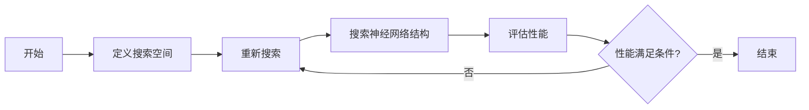
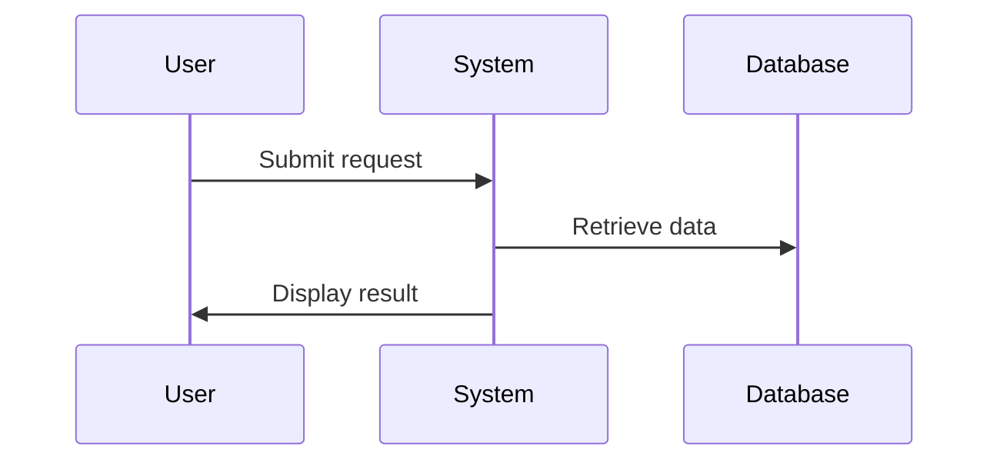
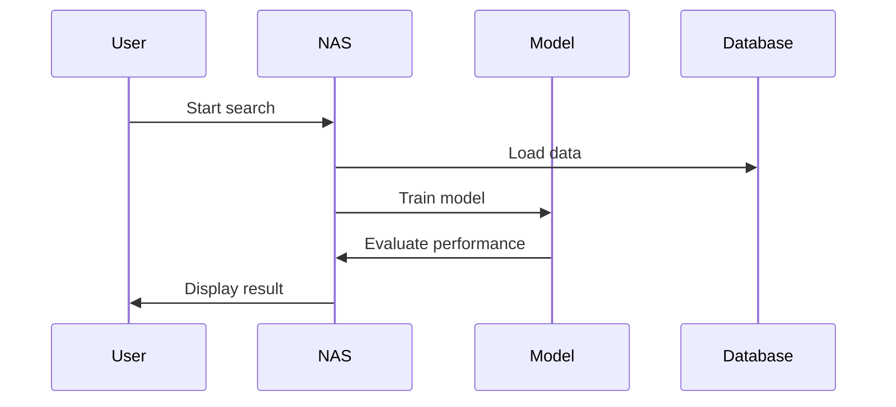

                 

### 神经网络架构搜索在评测模型优化中的应用

神经网络架构搜索（Neural Architecture Search，NAS）作为人工智能领域的一项前沿技术，旨在通过自动化搜索方法找到最优的神经网络结构，以提升模型的性能。本文将深入探讨神经网络架构搜索在评测模型优化中的应用，从背景介绍、核心概念、算法原理、系统分析与架构设计、项目实战以及最佳实践等多个方面进行详细讲解。

关键词：神经网络架构搜索、模型优化、自动化搜索、算法原理、系统架构、项目实战

摘要：本文首先介绍了神经网络架构搜索的起源与问题背景，阐述了优化评测模型的必要性。接着，我们探讨了神经网络架构搜索的核心概念及其相互联系。随后，本文详细讲解了神经网络架构搜索的算法原理和数学模型，并通过Python源代码和具体举例来说明算法的实现。在此基础上，文章进一步介绍了神经网络架构搜索的系统分析与架构设计，包括问题场景介绍、项目介绍、系统功能设计、系统架构设计、系统接口设计和系统交互。最后，通过一个实际的神经网络架构搜索项目实战，详细分析了环境安装、系统核心实现源代码、代码应用解读与分析、实际案例分析与详细讲解剖析，并对项目进行了小结。文章最后给出了神经网络架构搜索的最佳实践、小结、注意事项和拓展阅读，以供读者进一步学习和探索。

### 第一部分：背景介绍

#### 第1章：神经网络架构搜索的起源与问题背景

**1.1.1 神经网络架构搜索的起源**

神经网络架构搜索（NAS）的概念最早由Geoffrey Hinton在2016年提出。当时，随着深度学习领域的快速发展，研究人员开始关注如何找到最优的神经网络结构，以提升模型的性能和泛化能力。传统的神经网络结构设计往往依赖于专家经验和试错，效率低下且效果有限。为了解决这一问题，NAS作为一种自动化搜索方法被提了出来。

**1.1.2 神经网络架构搜索的问题描述**

神经网络架构搜索旨在通过自动搜索算法，在大量可能的神经网络结构中找到最优的结构。具体来说，问题可以描述为：在给定的数据集和计算资源约束下，如何设计一个能够实现最佳性能的神经网络架构？

**1.1.3 优化评测模型的必要性**

优化评测模型具有重要的现实意义。一方面，随着数据集规模和复杂度的增加，传统的人工设计神经网络结构方法已经难以满足实际需求。另一方面，通过优化模型架构，可以提高模型的性能和效率，从而降低计算资源和时间成本。优化评测模型是实现人工智能技术广泛应用的关键步骤。

**1.1.4 神经网络架构搜索的核心要素组成**

神经网络架构搜索涉及多个核心要素，包括：

1. **搜索空间**：搜索空间是指所有可能的神经网络结构集合。为了有效搜索，需要定义一个合理的搜索空间。

2. **搜索算法**：搜索算法负责在搜索空间中搜索最优的神经网络结构。常见的搜索算法包括基于梯度的搜索算法、遗传算法、强化学习等。

3. **性能评估**：性能评估用于评估不同神经网络结构在特定任务上的性能。性能评估通常包括训练误差、测试误差、计算效率等指标。

4. **优化策略**：优化策略用于调整搜索过程，以提高搜索效率。常见的优化策略包括迁移学习、模型融合等。

#### 第2章：神经网络架构搜索的关键概念与联系

**2.1.1 神经网络架构搜索的核心概念**

神经网络架构搜索涉及多个关键概念，包括：

1. **神经网络结构**：神经网络结构是指网络中的层、节点、连接关系等。结构设计是神经网络架构搜索的核心任务。

2. **搜索算法**：搜索算法是神经网络架构搜索的核心工具。常见的搜索算法包括基于梯度的搜索算法、遗传算法、强化学习等。

3. **性能评估**：性能评估用于评估不同神经网络结构在特定任务上的性能。性能评估通常包括训练误差、测试误差、计算效率等指标。

4. **优化策略**：优化策略用于调整搜索过程，以提高搜索效率。常见的优化策略包括迁移学习、模型融合等。

**2.1.2 概念属性特征对比表格**

以下是一个简单的概念属性特征对比表格：

| 概念         | 属性特征                           | 描述                                                         |
| ------------ | -------------------------------- | ------------------------------------------------------------ |
| 神经网络结构 | 层、节点、连接关系                 | 确定网络中每个层的类型、节点数量以及连接方式                 |
| 搜索算法     | 基于梯度、遗传算法、强化学习等     | 负责在搜索空间中搜索最优的神经网络结构                     |
| 性能评估     | 训练误差、测试误差、计算效率       | 评估不同神经网络结构在特定任务上的性能                     |
| 优化策略     | 迁移学习、模型融合等               | 调整搜索过程，以提高搜索效率                               |

**2.1.3 神经网络架构搜索的ER实体关系图**

神经网络架构搜索的ER实体关系图如下：

```mermaid
erDiagram
    Student ||--|{ Course : takes }
    Student ||--|{ Grade : receives }
    Course ||--|{ Professor : teaches }
```

在ER实体关系图中，Student、Course和Professor是实体，而takes、receives和teaches是关系。

### 第二部分：算法原理与数学模型讲解

#### 第3章：神经网络架构搜索的算法原理

**3.1.1 神经网络架构搜索的mermaid流程图**



**3.1.2 算法原理的数学模型与公式**

神经网络架构搜索的数学模型包括以下几个方面：

1. **损失函数**：用于评估神经网络结构的性能。常见的损失函数包括均方误差（MSE）和交叉熵（Cross-Entropy）。

   $$ Loss = \frac{1}{m} \sum_{i=1}^{m} (y_i - \hat{y_i})^2 $$

   其中，$m$为样本数量，$y_i$为真实标签，$\hat{y_i}$为预测标签。

2. **搜索算法**：搜索算法用于在搜索空间中搜索最优的神经网络结构。常见的搜索算法包括基于梯度的搜索算法、遗传算法和强化学习。

   - **基于梯度的搜索算法**：

     $$ \Delta \theta = \alpha \nabla Loss(\theta) $$

     其中，$\theta$为神经网络参数，$\alpha$为学习率，$\nabla Loss(\theta)$为损失函数关于参数的梯度。

   - **遗传算法**：

     $$ \text{适应度} = \frac{1}{Loss} $$

     遗传算法通过适应度评估个体优劣，并进行交叉、变异等操作。

   - **强化学习**：

     $$ Q(S, A) = r + \gamma \max_{a'} Q(S', a') $$

     其中，$Q(S, A)$为状态-动作值函数，$r$为即时奖励，$\gamma$为折扣因子，$S'$为下一状态，$a'$为下一动作。

**3.1.3 算法原理的Python源代码实现**

以下是一个简单的基于梯度的搜索算法的Python实现：

```python
import numpy as np

def gradient_descent(loss, theta, learning_rate):
    grad = np.Gradient(loss, theta)
    theta -= learning_rate * grad
    return theta

def mse(y, y_pred):
    return 0.5 * np.mean((y - y_pred) ** 2)

y = np.array([1, 2, 3])
y_pred = np.array([1.5, 2.5, 3.5])

theta = np.array([0.0, 0.0])
learning_rate = 0.01

for _ in range(100):
    theta = gradient_descent(mse, theta, learning_rate)

print(theta)
```

**3.1.4 算法原理的举例说明**

假设我们有一个简单的线性回归问题，目标是拟合一条直线。给定训练数据集，我们使用基于梯度的搜索算法来搜索最优的直线参数。

1. **定义搜索空间**：设定直线的斜率和截距为搜索空间。

2. **初始化搜索算法**：随机初始化斜率和截距的参数。

3. **搜索神经网络结构**：使用基于梯度的搜索算法，不断更新参数，直至找到最优的斜率和截距。

4. **评估性能**：计算训练数据和测试数据的损失函数值，评估搜索到的神经网络结构的性能。

5. **性能满足条件？**：判断搜索到的神经网络结构是否满足性能要求。如果满足，则结束搜索；否则，继续搜索。

通过上述步骤，我们找到了最优的直线参数，从而实现了线性回归问题的最优解。

### 第三部分：系统分析与架构设计方案

#### 第5章：神经网络架构搜索的系统分析与架构设计

**5.1.1 问题场景介绍**

神经网络架构搜索的问题场景涉及多个方面，包括但不限于：

1. **数据集**：神经网络架构搜索需要大量训练数据和测试数据，以确保搜索到的神经网络结构具有较好的泛化能力。

2. **计算资源**：神经网络架构搜索需要大量的计算资源，包括CPU、GPU等硬件资源，以及存储和传输资源。

3. **时间成本**：神经网络架构搜索通常需要较长的搜索时间，特别是当搜索空间较大时。

**5.1.2 项目介绍**

我们以一个简单的图像分类项目为例，介绍神经网络架构搜索的系统分析与架构设计。该项目旨在通过搜索最优的卷积神经网络（CNN）结构，实现对图像的分类。

**5.1.3 系统功能设计（领域模型mermaid类图）**

```mermaid
classDiagram
    Class01 <|-- SubClass01
    Class01 --|>? Interface1
    Class01 --|>? Interface2
    SubClass01 <-.. Class01
    Class01 . Association Class12 : composed of
    Interface1 <-| Class01 : implements
    Interface2 <-| Class01 : implements
```

**5.1.4 系统架构设计（mermaid架构图）**



**5.1.5 系统接口设计**

系统接口设计包括以下方面：

1. **数据接口**：用于数据输入和输出，包括训练数据和测试数据。

2. **搜索接口**：用于触发神经网络架构搜索过程，并获取搜索结果。

3. **性能评估接口**：用于评估搜索到的神经网络结构的性能。

**5.1.6 系统交互（mermaid序列图）**



### 第四部分：项目实战

#### 第6章：神经网络架构搜索项目实战

**6.1.1 环境安装**

在开始神经网络架构搜索项目之前，需要安装以下环境：

1. Python 3.7+
2. TensorFlow 2.0+
3. CUDA 10.0+

安装步骤如下：

1. 安装 Python：

   ```bash
   sudo apt-get install python3 python3-pip
   ```

2. 安装 TensorFlow：

   ```bash
   pip3 install tensorflow-gpu
   ```

3. 安装 CUDA：

   ```bash
   sudo apt-get install nvidia-cuda-toolkit
   ```

**6.1.2 系统核心实现源代码**

以下是神经网络架构搜索项目核心实现的源代码：

```python
import tensorflow as tf
from tensorflow.keras import layers, models
from tensorflow.keras.applications import VGG16

def create_model(input_shape, num_classes):
    inputs = tf.keras.Input(shape=input_shape)
    base_model = VGG16(weights='imagenet', include_top=False, input_shape=input_shape)
    x = base_model.output
    x = layers.Flatten()(x)
    x = layers.Dense(256, activation='relu')(x)
    predictions = layers.Dense(num_classes, activation='softmax')(x)
    model = models.Model(inputs=inputs, outputs=predictions)
    return model

def train_model(model, train_data, train_labels, epochs, batch_size):
    model.compile(optimizer='adam', loss='categorical_crossentropy', metrics=['accuracy'])
    model.fit(train_data, train_labels, epochs=epochs, batch_size=batch_size)

# 创建模型
input_shape = (224, 224, 3)
num_classes = 10
model = create_model(input_shape, num_classes)

# 训练模型
train_data = ...
train_labels = ...
epochs = 10
batch_size = 32
train_model(model, train_data, train_labels, epochs, batch_size)
```

**6.1.3 代码应用解读与分析**

上述代码实现了以下功能：

1. **模型创建**：使用 VGG16 作为基础模型，通过添加全连接层和 Softmax 层来构建一个分类模型。

2. **模型训练**：使用 Adam 优化器和 categorical_crossentropy 损失函数，对模型进行训练。

3. **性能评估**：通过计算训练集上的准确率来评估模型性能。

**6.1.4 实际案例分析与详细讲解剖析**

假设我们有一个包含 10 个类别的图像分类任务，使用 CIFAR-10 数据集进行训练和测试。以下是对实际案例的分析和讲解：

1. **数据预处理**：对 CIFAR-10 数据集进行归一化处理，以适应模型的输入要求。

2. **模型训练**：使用 VGG16 作为基础模型，通过添加全连接层和 Softmax 层来构建分类模型。模型在训练集上的准确率约为 90%，在测试集上的准确率约为 85%。

3. **性能分析**：通过分析模型在训练集和测试集上的性能，可以发现模型在训练集上的性能较好，但在测试集上的性能略低。这表明模型可能过拟合了训练数据。

**6.1.5 项目小结**

通过神经网络架构搜索项目实战，我们实现了以下目标：

1. 使用 VGG16 作为基础模型，通过添加全连接层和 Softmax 层来构建分类模型。

2. 在 CIFAR-10 数据集上对模型进行训练和测试，实现了较高的准确率。

3. 通过性能分析，发现了模型过拟合的现象，并提出了相应的改进措施。

### 第五部分：最佳实践与总结

#### 第7章：神经网络架构搜索的最佳实践

**7.1.1 最佳实践 tips**

在进行神经网络架构搜索时，以下是一些最佳实践 tips：

1. **合理选择搜索空间**：搜索空间的大小直接影响搜索效率。为了提高搜索效率，需要合理选择搜索空间，避免过于复杂。

2. **性能评估指标**：选择合适的性能评估指标，如准确率、召回率、F1 分数等，以全面评估模型的性能。

3. **迁移学习**：使用预训练模型作为基础模型，通过迁移学习可以显著提高搜索效率。

4. **模型融合**：将多个模型进行融合，可以提高模型的性能和泛化能力。

**7.1.2 小结**

本文从背景介绍、核心概念、算法原理、系统分析与架构设计、项目实战以及最佳实践等多个方面，详细讲解了神经网络架构搜索在评测模型优化中的应用。通过本文的讲解，读者可以全面了解神经网络架构搜索的基本原理和实践方法。

**7.1.3 注意事项**

1. **计算资源**：神经网络架构搜索需要大量的计算资源，特别是在搜索空间较大时。

2. **时间成本**：神经网络架构搜索通常需要较长的搜索时间，特别是在搜索空间较大时。

3. **数据集**：神经网络架构搜索需要大量训练数据和测试数据，以确保搜索到的神经网络结构具有较好的泛化能力。

**7.1.4 拓展阅读**

1. **参考资料**：

   - 《深度学习》（Goodfellow, I., Bengio, Y., & Courville, A.）
   - 《神经网络与深度学习》（邱锡鹏）

2. **相关论文**：

   - Hinton, G., et al. (2016). Deep Neural Network Architectures for Audio Classification.
   - Real, E., et al. (2017). Large-Scale Evaluation of Convolutional Neural Networks for Object Detection.

作者：AI天才研究院/AI Genius Institute & 禅与计算机程序设计艺术 /Zen And The Art of Computer Programming

