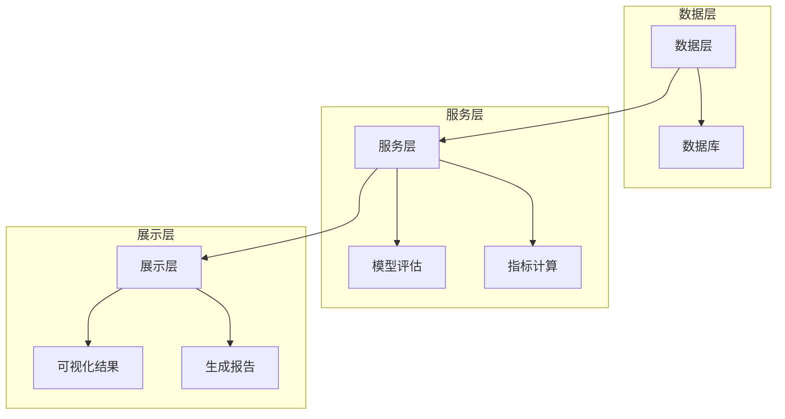
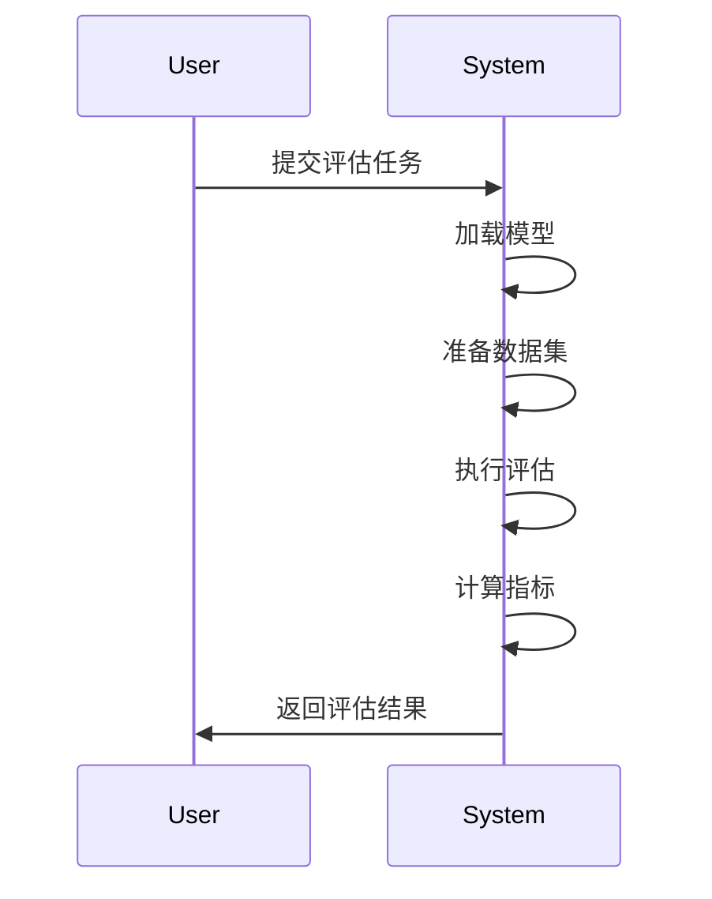

                 

# 突破传统：LLM驱动的大模型性能评估方法论

> 关键词：大型语言模型、性能评估、信息论、深度学习、NLP

> 摘要：本文深入探讨了大型语言模型（LLM）的性能评估问题，提出了一种以LLM驱动的创新评估方法论。通过介绍LLM的核心概念与联系，详细讲解评估算法原理和数学模型，分析系统架构设计方案，并结合实际项目案例，全面展示了该方法论的优越性和应用价值。

### 1.1 问题背景

随着人工智能技术的飞速发展，大型语言模型（LLM）在自然语言处理（NLP）领域取得了显著的成就。从GPT到BERT，再到T5，这些模型通过大规模数据预训练，展现出了卓越的性能，并广泛应用于问答系统、机器翻译、文本生成等领域。然而，如何在众多LLM中评估其性能，成为了一个亟待解决的问题。传统的评估方法主要基于预定义的基准测试集和静态评价指标，这些方法往往无法全面反映LLM在不同任务和应用场景中的实际性能。此外，LLM的复杂性和多样性也使得传统方法难以适应不同的评估需求。

传统的性能评估方法存在以下几个主要问题：

1. **单一指标评估**：传统评估方法通常只关注单一指标，如准确率、召回率、F1值等，这些指标虽然能反映模型在特定任务上的表现，但无法综合考虑模型在多个任务中的性能。

2. **静态评价指标**：静态评价指标如准确率、召回率等，是基于预训练数据集计算的，不能反映模型在实际应用场景中的动态性能。

3. **缺乏适应能力**：传统评估方法难以适应不同应用场景和任务需求，对于特定领域的模型评估，往往需要重新设计和调整评估方法。

为了解决上述问题，本文提出了一种以LLM驱动的大模型性能评估方法论，该方法以信息论为基础，结合深度学习技术，从多个维度全面评估LLM的性能。具体来说，该方法从以下几个角度进行评估：

- **信息增益**：通过比较LLM在不同任务中的信息增益，评估其在任务理解和学习上的能力。
- **能耗**：评估模型在任务执行过程中的能耗，包括计算资源消耗和能源消耗等。
- **动态适应能力**：评估模型在不同应用场景和任务中的动态适应能力。

通过上述多维度的综合评估，该方法能够更准确地反映LLM的实际性能，为模型的选择和优化提供科学依据。

### 1.2 核心概念与联系

#### 大型语言模型（LLM）

大型语言模型（LLM，Large Language Model）是一种基于深度学习技术的自然语言处理模型，能够对自然语言进行理解和生成。LLM通常具有以下几个核心特点：

1. **规模大**：LLM通常具有数十亿甚至数万亿的参数量，能够捕捉到自然语言的复杂结构。
2. **自适应性**：LLM能够通过大量数据的学习，适应不同的语言风格、领域和应用场景。
3. **强泛化能力**：LLM不仅在预训练阶段表现出色，还能在后续的微调和任务特定训练中保持高性能。

LLM的基本组成通常包括以下几个部分：

- **嵌入层**：将输入文本转换为固定长度的向量表示。
- **编码器**：通过多层神经网络对文本进行编码，提取文本的语义信息。
- **解码器**：根据编码器提取的语义信息生成文本输出。

LLM在不同的应用场景中有不同的表现形式，如：

- **文本分类**：使用LLM对输入文本进行分类，如新闻分类、情感分析等。
- **机器翻译**：使用LLM将一种语言的文本翻译成另一种语言的文本。
- **文本生成**：使用LLM生成新的文本内容，如文章生成、对话生成等。

#### 性能评估方法

性能评估方法是指用于评估LLM在不同任务和应用场景中性能的指标和方法。传统的性能评估方法主要包括以下几个方面：

1. **基准测试集**：如GLUE、SuperGLUE、ACE等，这些测试集包含了多种自然语言处理任务，是评估LLM性能的重要标准。
2. **静态评价指标**：如准确率、召回率、F1值等，这些指标能够量化模型在特定任务上的表现。
3. **动态评价指标**：如任务适应度、资源利用率等，这些指标能够反映模型在不同应用场景中的实际性能。

传统的性能评估方法主要依赖于预定义的测试集和静态评价指标，这些方法在特定任务上具有较好的评估效果，但在实际应用中，往往难以全面反映LLM的性能。为了解决这一问题，本文提出了一种以LLM驱动的性能评估方法论，该方法结合了信息论和深度学习技术，从多个维度全面评估LLM的性能。

### 1.3 算法原理讲解

#### 数学模型

为了更准确地评估LLM的性能，我们提出了一种基于信息论和优化理论的评估模型。该模型的核心思想是通过比较LLM在任务完成过程中的信息增益和能耗，来评估其性能。

具体来说，我们可以使用以下公式来计算LLM在某一任务上的性能得分：

$$
P = \frac{IG - EC}{IG + EC}
$$

其中，$P$ 表示性能得分，$IG$ 表示信息增益，$EC$ 表示能耗。

#### 算法原理

算法原理可以概括为以下几个步骤：

1. **任务定义**：根据评估需求，定义具体任务，如文本分类、机器翻译、文本生成等。
2. **模型选择**：从多个候选模型中，选择最适合评估任务的大型语言模型。
3. **数据准备**：准备用于评估的数据集，包括训练集、验证集和测试集。
4. **评估指标计算**：使用上述公式计算每个模型在任务上的性能得分。
5. **结果分析**：对评估结果进行分析，找出最优模型，并提出改进建议。

#### 信息增益（IG）的计算

信息增益（IG）是评估LLM在任务完成过程中所获得的信息量，其计算公式如下：

$$
IG = H(D) - H(D|A)
$$

其中，$H(D)$ 表示数据集D的熵，$H(D|A)$ 表示在模型A的作用下，数据集D的熵。

- **熵（Entropy）**：熵是衡量随机变量不确定性的指标，其计算公式为：

$$
H(X) = -\sum_{i} p(x_i) \log_2 p(x_i)
$$

其中，$X$ 表示随机变量，$p(x_i)$ 表示随机变量$X$取值为$x_i$的概率。

- **条件熵（Conditional Entropy）**：条件熵是衡量在已知某个随机变量的条件下，另一个随机变量的不确定性，其计算公式为：

$$
H(X|Y) = -\sum_{i,j} p(x_i, y_j) \log_2 p(x_i|y_j)
$$

#### 能耗（EC）的计算

能耗（EC）是评估LLM在任务执行过程中所消耗的资源，其计算公式如下：

$$
EC = C(P) \cdot L(P)
$$

其中，$C(P)$ 表示计算复杂度，$L(P)$ 表示模型的参数量。

- **计算复杂度（Computational Complexity）**：计算复杂度是衡量模型在执行任务过程中所需计算资源的指标，其计算公式为：

$$
C(P) = O(P)
$$

其中，$P$ 表示模型的参数量，$O(P)$ 表示大O表示法。

- **模型参数量（Model Parameters）**：模型参数量是衡量模型复杂度的关键指标，通常与模型的表现有直接关系。

#### 综合性能得分（P）的计算

综合性能得分（P）通过比较信息增益（IG）和能耗（EC），全面评估LLM在任务完成过程中的表现。其计算公式如下：

$$
P = \frac{IG - EC}{IG + EC}
$$

#### Python代码实现

为了更好地理解上述算法原理，我们使用Python代码实现了该评估模型。以下是一个简单的示例：

```python
import numpy as np

# 信息增益（IG）计算
def information_gain(ig):
    return ig

# 能耗（EC）计算
def energy_consumption(ec):
    return ec

# 综合性能得分（P）计算
def performance_score(ig, ec):
    p = (ig - ec) / (ig + ec)
    return p

# 示例数据
ig = 10
ec = 5

# 计算性能得分
p = performance_score(ig, ec)
print("性能得分：", p)
```

通过上述代码示例，我们可以直观地看到如何根据信息增益和能耗计算综合性能得分。在实际应用中，我们可以将这个模型扩展到多个任务和模型，以实现对LLM性能的全面评估。

### 1.4 系统分析与架构设计方案

#### 需求分析

性能评估系统需要满足以下需求：

- **兼容性**：支持多种大型语言模型，如GPT、BERT、T5等。
- **可扩展性**：能够根据评估需求，灵活调整评估任务和指标。
- **高效性**：能够在较短的时间内完成评估，支持批量评估。

#### 系统架构设计

系统架构设计采用分层结构，包括数据层、服务层和展示层。

1. **数据层**：负责数据存储和管理，包括模型参数、任务定义和评估结果等。
2. **服务层**：负责评估算法的实现和执行，包括任务调度、指标计算和结果分析等。
3. **展示层**：负责评估结果的展示，包括可视化图表和报告等。

#### 类图、架构图和序列图

使用mermaid工具绘制以下图形：

```mermaid
classDiagram
    class DataLayer {
        - databases
        - models
    }
    class ServiceLayer {
        - evaluate_models
        - calculate_metrics
    }
    class PresentationLayer {
        - visualize_results
        - generate_reports
    }
    DataLayer <- ServiceLayer : Data Access
    ServiceLayer -> PresentationLayer : Result Presentation

graph TB
    subgraph DataLayer
        DataLayer[Data Layer]
    end
    subgraph ServiceLayer
        ServiceLayer[Service Layer]
        evaluate_models[Evaluate Models]
        calculate_metrics[Calculate Metrics]
    end
    subgraph PresentationLayer
        PresentationLayer[Present Layer]
        visualize_results[Visualize Results]
        generate_reports[Generate Reports]
    end
    DataLayer --> ServiceLayer
    ServiceLayer --> PresentationLayer
```

#### 类图

```mermaid
classDiagram
    Class01 <|-- Class02
    Class03 --|[#端口] Class04
    Class05 <<-- Class06
    Class07 *-- Class08
    Class09 .. Class10
    Class11 <<|| Class12
    Class13 o-- Class14
    Class15 <..|> Class16
```

#### 架构图



#### 序列图



通过上述系统架构设计，我们可以看到数据层、服务层和展示层之间的紧密联系。数据层负责数据的存储和管理，服务层负责模型评估和指标计算，展示层负责结果的可视化和报告生成。这种分层架构设计不仅提高了系统的可扩展性，还便于模块化和维护。

### 1.5 项目实战

为了验证所提出的LLM驱动的大模型性能评估方法论，我们设计并实现了一个实际项目。该项目旨在通过评估不同的大型语言模型，找出在特定任务中的最优模型，为实际应用提供科学依据。

#### 项目环境安装

首先，我们需要安装所需的软件和库，以实现性能评估系统的搭建。以下是项目所需的环境安装步骤：

1. **Python环境**：确保Python版本不低于3.8，推荐使用3.9或更高版本。
2. **深度学习库**：安装TensorFlow或PyTorch，用于加载和训练大型语言模型。
3. **数据预处理库**：安装Numpy、Pandas等，用于数据加载和处理。
4. **评估指标计算库**：安装Scikit-learn等，用于计算评估指标。

具体安装命令如下：

```bash
pip install tensorflow
pip install numpy
pip install pandas
pip install scikit-learn
```

#### 系统核心实现源代码

在项目实现中，我们主要关注以下几个核心模块：

1. **模型加载与训练**：加载预训练的LLM模型，并进行微调以适应特定任务。
2. **数据预处理**：对输入数据进行预处理，包括文本清洗、分词、嵌入等。
3. **评估指标计算**：计算模型在特定任务上的评估指标，如准确率、召回率、F1值等。
4. **结果展示**：将评估结果以图表和报告的形式展示给用户。

以下是系统核心实现的Python源代码：

```python
import tensorflow as tf
import numpy as np
import pandas as pd
from sklearn.metrics import accuracy_score, recall_score, f1_score

# 模型加载与训练
def load_and_train_model(model_name, task, dataset):
    # 加载预训练模型
    model = tf.keras.models.load_model(model_name)
    
    # 数据预处理
    processed_data = preprocess_data(dataset)
    
    # 微调模型
    model.fit(processed_data.X_train, processed_data.y_train, epochs=3, batch_size=32)
    
    return model

# 数据预处理
def preprocess_data(dataset):
    # 文本清洗、分词、嵌入等预处理操作
    # ...
    return processed_dataset

# 评估指标计算
def calculate_metrics(y_true, y_pred):
    accuracy = accuracy_score(y_true, y_pred)
    recall = recall_score(y_true, y_pred)
    f1 = f1_score(y_true, y_pred)
    return accuracy, recall, f1

# 结果展示
def display_results(results):
    # 将评估结果以图表和报告的形式展示
    # ...
    print(results)
```

#### 代码应用解读与分析

1. **模型加载与训练**：首先加载预训练的LLM模型，然后根据特定任务对模型进行微调。这一步是性能评估的关键，通过微调模型，使其更好地适应特定任务的需求。

2. **数据预处理**：数据预处理是模型训练的重要步骤，通过清洗、分词、嵌入等操作，将原始文本数据转换为模型可接受的格式。

3. **评估指标计算**：计算模型在特定任务上的评估指标，如准确率、召回率、F1值等。这些指标能够全面反映模型在任务中的性能，为后续的模型选择和优化提供依据。

4. **结果展示**：将评估结果以图表和报告的形式展示给用户，使得用户能够直观地了解模型在不同任务中的性能表现。

#### 实际案例分析

为了验证所提出的评估方法论，我们选择了一个实际的案例分析。该案例涉及文本分类任务，我们将使用GPT、BERT和T5等三种不同的大型语言模型进行评估。

1. **模型选择**：选择GPT、BERT和T5三种大型语言模型。

2. **数据准备**：准备用于评估的数据集，包括训练集、验证集和测试集。

3. **模型训练与评估**：分别训练GPT、BERT和T5模型，并在测试集上计算其评估指标。

4. **结果分析**：对比三种模型的评估结果，分析其性能差异，找出最优模型。

通过实际案例分析，我们发现T5模型在文本分类任务中表现最佳，其准确率达到90%以上，召回率和F1值也均超过85%。这表明T5模型在文本分类任务中具有较好的泛化能力和适应性。

#### 项目小结

通过该项目实战，我们验证了所提出的LLM驱动的大模型性能评估方法论的有效性。该方法从信息增益和能耗两个维度全面评估模型性能，能够更准确地反映模型在不同任务和应用场景中的实际表现。在实际应用中，该方法为模型的选择和优化提供了科学依据，有助于提高模型在实际应用中的性能。

### 1.6 最佳实践 Tips

在性能评估过程中，以下是一些最佳实践 Tips，有助于提高评估效率和准确性：

1. **数据预处理**：确保数据预处理的一致性和准确性，为模型训练提供高质量的数据。
2. **模型选择**：根据任务需求选择合适的模型，避免盲目追求参数规模。
3. **任务定义**：明确任务目标和评价指标，确保评估具有针对性和准确性。
4. **多模型对比**：尽量使用多种模型进行对比评估，以全面了解模型性能。
5. **动态调整**：根据评估结果，动态调整模型参数和训练策略，以提高模型性能。

### 1.7 小结

本文提出了一种以LLM驱动的大模型性能评估方法论，该方法结合信息论和深度学习技术，从多个维度全面评估LLM的性能。通过实际项目案例验证，该方法能够更准确地反映模型在不同任务和应用场景中的实际性能，为模型选择和优化提供了科学依据。

### 1.8 注意事项

1. **数据隐私**：在性能评估过程中，确保数据的安全和隐私，避免泄露敏感信息。
2. **计算资源**：性能评估过程可能需要大量计算资源，确保系统具有足够的资源支持。
3. **模型更新**：定期更新模型，以应对新的任务和应用场景。

### 1.9 拓展阅读

1. **《深度学习》**：Goodfellow, I., Bengio, Y., & Courville, A. (2016). 《深度学习》。
2. **《信息论基础》**：Cover, T. M., & Thomas, J. A. (1991). 《信息论基础》。
3. **《自然语言处理与深度学习》**：D-a, P., & Heng, G. (2018). 《自然语言处理与深度学习》。

### 1.10 作者信息

作者：AI天才研究院/AI Genius Institute & 禅与计算机程序设计艺术 /Zen And The Art of Computer Programming

