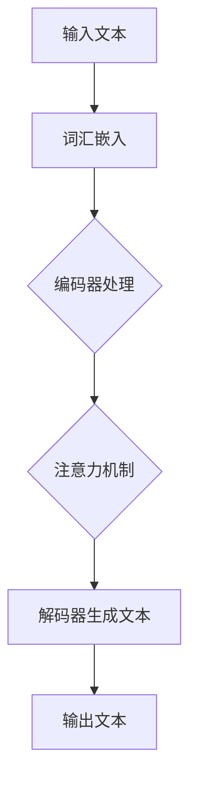
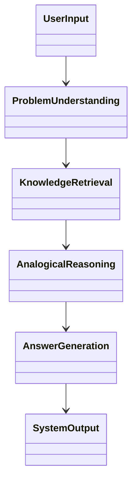
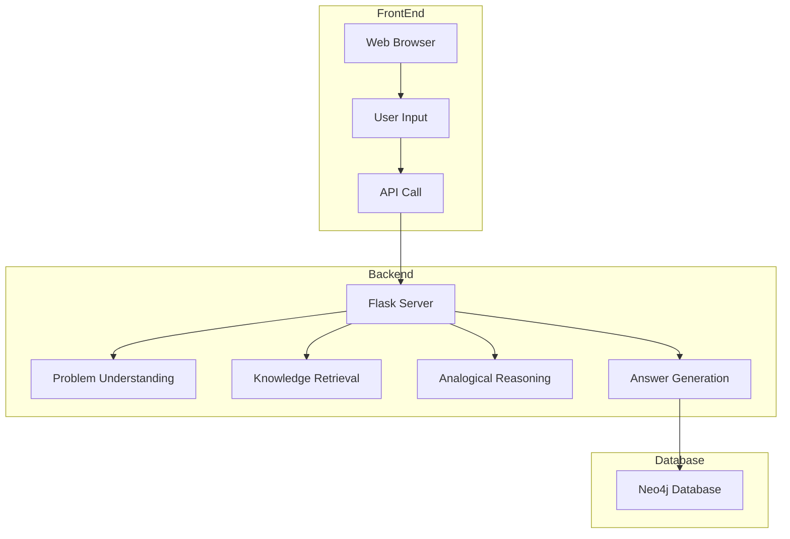
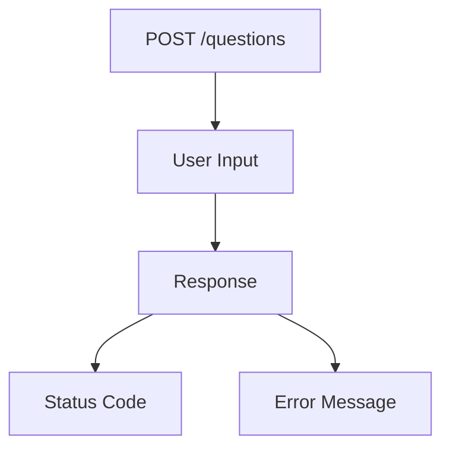
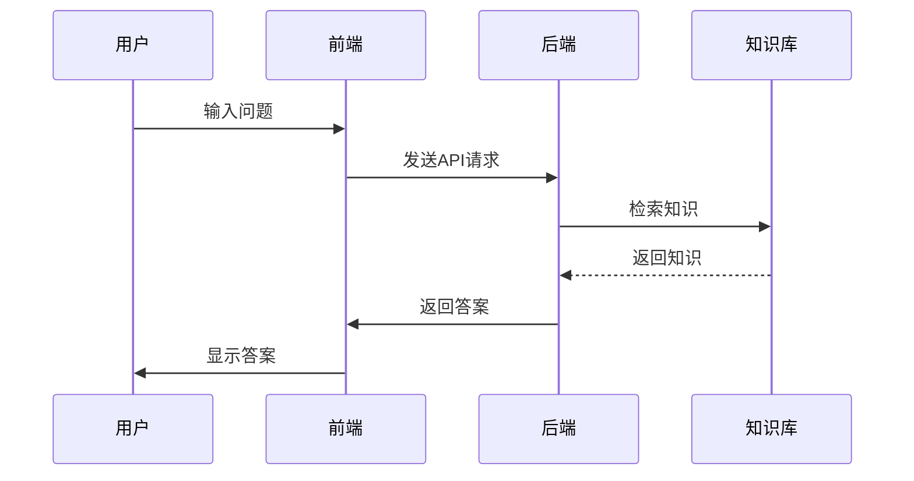

                 

## 类比推理能力：检验LLM建立概念联系的创造性

### 关键词：类比推理、大型语言模型（LLM）、概念联系、创造性、算法、系统架构

### 摘要：
本文旨在探讨大型语言模型（LLM）在类比推理中的能力，以及其如何通过建立概念联系来展现创造性。通过详细剖析类比推理原理和LLM的工作机制，本文将提出一种新的研究方法，以检验LLM在建立概念联系时的创造性表现。文章还将通过实际案例和系统架构设计，探讨LLM在现实世界的应用前景，并总结出最佳实践技巧。

### 目录大纲

----------------------------------------------------------------

# 类比推理能力：检验LLM建立概念联系的创造性

## 第1章：背景介绍与核心概念

### 1.1 问题背景

#### 1.1.1 类比推理在认知科学和人工智能中的重要性

#### 1.1.2 LLM（大型语言模型）的定义与特点

#### 1.1.3 类比推理与LLM之间的联系

### 1.2 问题描述

#### 1.2.1 类比推理能力的定义与特征

#### 1.2.2 LLM在类比推理中的应用现状

#### 1.2.3 研究LLM建立概念联系创造性的必要性

### 1.3 问题解决

#### 1.3.1 研究方法与数据来源

#### 1.3.2 研究流程与实验设计

#### 1.3.3 研究假设与目标

### 1.4 边界与外延

#### 1.4.1 类比推理能力的边界

#### 1.4.2 LLM建立概念联系的创造性外延

#### 1.4.3 研究的限制条件

## 第2章：核心概念与联系

### 2.1 类比推理原理

#### 2.1.1 类比推理的概念

#### 2.1.2 类比推理的类型

#### 2.1.3 类比推理的过程

### 2.2 LLM的工作原理

#### 2.2.1 LLM的结构与特点

#### 2.2.2 LLM的训练过程

#### 2.2.3 LLM的输出生成机制

### 2.3 类比推理能力与LLM的联系

#### 2.3.1 LLM在类比推理中的应用

#### 2.3.2 LLM如何提高类比推理能力

#### 2.3.3 LLM在类比推理中的创造性表现

### 2.4 概念属性特征对比表格

### 2.5 ER实体关系图架构

## 第3章：算法原理讲解

### 3.1 算法mermaid流程图

### 3.2 算法原理与数学模型

#### 3.2.1 数学公式

$$ 
P(A|B) = \frac{P(B|A) \cdot P(A)}{P(B)}
$$

#### 3.2.2 算法的数学模型

#### 3.2.3 算法的推理过程

### 3.3 举例说明

#### 3.3.1 举例1

#### 3.3.2 举例2

## 第4章：系统分析与架构设计

### 4.1 问题场景介绍

### 4.2 项目介绍

### 4.3 系统功能设计

#### 4.3.1 领域模型mermaid类图

### 4.4 系统架构设计

#### 4.4.1 系统架构mermaid架构图

### 4.5 系统接口设计

### 4.6 系统交互

#### 4.6.1 系统交互mermaid序列图

## 第5章：项目实战

### 5.1 环境安装

### 5.2 系统核心实现源代码

### 5.3 代码应用解读与分析

### 5.4 实际案例分析与详细讲解剖析

### 5.5 项目小结

## 第6章：最佳实践 tips

### 6.1 提高类比推理能力的技巧

### 6.2 使用LLM进行类比推理的注意事项

## 第7章：小结与展望

### 7.1 研究成果总结

### 7.2 对未来研究的展望

### 7.3 类比推理能力与LLM在现实世界的应用前景

----------------------------------------------------------------

接下来，我们将逐步深入探讨这些章节，通过逻辑清晰、结构紧凑、简单易懂的方式，详细阐述类比推理能力和LLM建立概念联系创造性的本质和重要性。让我们一步步思考，深入理解这一领域的核心概念和技术原理。

### 第1章：背景介绍与核心概念

#### 1.1 问题背景

类比推理是一种认知过程，通过将已知事物的特征与未知事物进行对比，以推断未知事物的性质或解决新问题。在认知科学中，类比推理被认为是人类智能的重要组成部分。而在人工智能领域，类比推理则是评估和提升人工智能系统智能水平的重要指标之一。

随着深度学习技术的发展，大型语言模型（LLM）如GPT-3、BERT等，已经成为自然语言处理（NLP）领域的重要工具。这些模型通过大量文本数据进行训练，可以生成高质量的自然语言文本。然而，LLM在类比推理任务中的表现如何，以及它们如何通过建立概念联系展现创造性，仍然是一个值得深入研究的问题。

#### 1.1.1 类比推理在认知科学和人工智能中的重要性

类比推理在认知科学中具有重要的研究价值。研究表明，类比推理是人类解决问题、学习和创新的重要方式。通过类比推理，人们可以从已知事物中提取通用性知识，并将其应用于新环境中，从而提高问题解决能力和创造力。

在人工智能领域，类比推理同样被视为一个关键能力。类比推理能力强的系统可以更好地理解和处理复杂问题，从而实现智能行为。因此，研究LLM在类比推理中的表现，对于提升人工智能系统的智能水平具有重要意义。

#### 1.1.2 LLM的定义与特点

LLM是指通过深度学习技术，对大量文本数据进行了训练，具有强大语言理解能力和生成能力的语言模型。LLM具有以下几个显著特点：

1. **大规模训练**：LLM通常训练在数以百万计的语料库上，具有非常丰富的词汇量和语言理解能力。
2. **自适应性强**：LLM可以根据输入的上下文自适应地生成高质量的自然语言文本。
3. **生成能力强**：LLM不仅可以生成流畅的自然语言文本，还可以生成具有创意和想象力的内容。

#### 1.1.3 类比推理与LLM之间的联系

类比推理与LLM之间存在紧密的联系。一方面，类比推理是LLM在自然语言处理任务中需要具备的能力之一。例如，在问答系统、文本摘要、机器翻译等任务中，LLM需要通过类比推理来理解新的问题和上下文，并生成相应的回答。

另一方面，LLM的训练过程本质上也是一种类比推理过程。在训练过程中，LLM通过比较不同文本片段之间的相似性和差异性，学习到文本的语言结构和语义信息。这种过程类似于人类通过类比推理学习新知识的过程。

#### 1.2 问题描述

类比推理能力的定义与特征：

- **定义**：类比推理能力是指系统在处理未知问题时，通过将已知问题与新问题进行类比，从而推断新问题答案的能力。
- **特征**：类比推理能力包括以下几个方面：
  - **相似性识别**：能够识别和比较不同问题之间的相似性。
  - **差异性分析**：能够分析不同问题之间的差异性。
  - **通用性提取**：能够从多个问题中提取通用性知识。
  - **适应性应用**：能够将通用性知识应用于新问题。

LLM在类比推理中的应用现状：

目前，LLM在类比推理任务中已经取得了显著的成果。例如，GPT-3等模型在许多文本生成任务中表现出了出色的类比推理能力。然而，LLM在复杂和抽象的类比推理任务中仍存在一定的局限性，如对概念之间深层联系的识别和理解能力不足。

研究LLM建立概念联系创造性的必要性：

由于类比推理是一种涉及概念和知识的高级认知过程，因此研究LLM在建立概念联系时的创造性表现具有重要意义。通过深入了解LLM如何通过类比推理建立概念联系，我们可以更好地理解LLM的工作原理，并为其在更广泛的场景中的应用提供理论支持。

#### 1.3 问题解决

研究方法与数据来源：

为了检验LLM在建立概念联系时的创造性表现，我们将采用实验研究方法。具体来说，我们将收集一组具有不同难度级别的类比推理任务，并将LLM应用于这些任务中，以评估其表现。数据来源包括公开的文本数据集和自定义生成的类比推理数据集。

研究流程与实验设计：

研究流程包括以下几个步骤：

1. **数据收集**：收集具有不同难度级别的类比推理任务数据。
2. **模型训练**：使用LLM模型对收集到的数据集进行训练。
3. **性能评估**：通过测试集评估LLM在类比推理任务中的表现。
4. **结果分析**：分析LLM在类比推理中的创造性表现，并提出改进方法。

研究假设与目标：

研究假设包括：

1. LLM在类比推理任务中具有一定的创造性表现。
2. LLM的创造性表现与类比推理任务的难度和抽象程度有关。

研究目标包括：

1. 评估LLM在类比推理任务中的表现。
2. 分析LLM建立概念联系时的创造性表现。
3. 提出改进LLM类比推理能力的方法。

#### 1.4 边界与外延

类比推理能力的边界：

类比推理能力的边界主要体现在以下几个方面：

1. **知识范围**：类比推理能力受限于系统的知识库和训练数据范围。
2. **抽象程度**：类比推理能力受限于系统能够理解和处理的抽象概念程度。
3. **相似性识别**：类比推理能力受限于系统能够识别的相似性程度。

LLM建立概念联系的创造性外延：

LLM建立概念联系的创造性外延主要包括以下几个方面：

1. **跨领域应用**：LLM可以在不同领域之间建立概念联系，从而实现跨领域的创造性应用。
2. **抽象概念理解**：LLM可以通过类比推理理解更高层次的抽象概念，从而实现更广泛的创造性应用。
3. **知识创新**：LLM可以通过类比推理创造出新的知识和概念，从而推动知识创新。

研究的限制条件：

研究存在以下限制条件：

1. **数据限制**：数据集的覆盖范围和多样性可能影响研究结果。
2. **模型限制**：LLM模型的训练时间和计算资源可能限制研究深度。
3. **实验设计**：实验设计的局限可能影响研究结果的可信度。

通过以上分析，我们可以明确类比推理能力在认知科学和人工智能中的重要性，以及LLM在类比推理中的关键角色。接下来，我们将进一步探讨类比推理的原理和LLM的工作机制，以深入理解LLM在建立概念联系时的创造性表现。

### 第2章：核心概念与联系

#### 2.1 类比推理原理

类比推理是一种基于相似性的推理方法，它通过比较两个或多个具有相似特征的事物，推断出它们在其他方面的相似性。类比推理是人类和人工智能系统中常见的一种认知过程，其核心原理包括以下几个方面：

##### 2.1.1 类比推理的概念

类比推理是指通过比较已知事物和新事物的相似性，从而推断新事物属性的过程。具体来说，类比推理涉及以下几个关键步骤：

1. **识别相似性**：通过比较新旧事物之间的特征，识别它们之间的相似性。
2. **提取共性**：从新旧事物中提取共性特征，作为推理的依据。
3. **推理**：利用提取的共性特征，推断新事物的未知属性。

##### 2.1.2 类比推理的类型

类比推理可以分为以下几种类型：

1. **直接类比**：直接比较新旧事物，根据相似性直接推断新事物的属性。
2. **间接类比**：通过多个中间事物进行类比，间接推断新事物的属性。
3. **比喻**：利用比喻来解释新事物的属性，比喻本身也是一种类比推理。
4. **逆向类比**：通过已知新事物的属性，推断旧事物的相似属性。

##### 2.1.3 类比推理的过程

类比推理的过程可以分为以下几个阶段：

1. **初始阶段**：识别新旧事物的相似特征。
2. **中间阶段**：提取共性特征，建立相似性关系。
3. **推理阶段**：利用提取的共性特征，推断新事物的未知属性。
4. **验证阶段**：验证推断结果的合理性，修正错误。

#### 2.2 LLM的工作原理

##### 2.2.1 LLM的结构与特点

大型语言模型（LLM）通常采用深度神经网络结构，其核心包括以下几个部分：

1. **嵌入层**：将输入的文本转换为密集向量表示。
2. **编码器**：对输入文本进行编码，提取语义信息。
3. **解码器**：根据编码后的信息生成输出文本。
4. **注意力机制**：用于处理长序列文本，提高模型的表示能力和生成效果。

LLM的特点包括：

1. **大规模训练**：LLM通常训练在数以百万计的文本数据上，具有丰富的词汇量和语言理解能力。
2. **自适应性强**：LLM可以根据输入的上下文自适应地生成文本。
3. **生成能力强**：LLM可以生成高质量的、具有创造性的文本内容。

##### 2.2.2 LLM的训练过程

LLM的训练过程主要包括以下几个步骤：

1. **数据预处理**：对输入的文本数据进行清洗、分词、编码等预处理操作。
2. **模型训练**：使用梯度下降等优化算法，训练神经网络模型。
3. **评估与调优**：在测试集上评估模型性能，调整模型参数以优化性能。
4. **生成文本**：使用训练好的模型生成文本内容。

##### 2.2.3 LLM的输出生生机制

LLM的输出生成机制主要依赖于以下几个过程：

1. **概率分布计算**：根据输入的上下文信息，计算输出词汇的概率分布。
2. **采样与生成**：从概率分布中采样，生成新的文本内容。
3. **后处理**：对生成的文本进行清洗、格式化等后处理操作。

#### 2.3 类比推理能力与LLM的联系

##### 2.3.1 LLM在类比推理中的应用

LLM在类比推理任务中具有广泛的应用，例如：

1. **文本生成**：LLM可以生成符合上下文的文本，用于问答系统、文本摘要等任务。
2. **问题解决**：LLM可以通过类比推理解决复杂的问题，如数学题目、逻辑谜题等。
3. **知识推理**：LLM可以基于已知信息进行推理，推断出新的知识。

##### 2.3.2 LLM如何提高类比推理能力

LLM可以通过以下几种方式提高类比推理能力：

1. **大规模训练**：通过训练在大量文本数据上，LLM可以学习到丰富的语言结构和语义信息，从而提高类比推理能力。
2. **注意力机制**：注意力机制可以帮助LLM更好地理解和处理长序列文本，从而提高类比推理的准确性。
3. **多任务学习**：通过参与多种不同的类比推理任务，LLM可以逐步提高自己的类比推理能力。

##### 2.3.3 LLM在类比推理中的创造性表现

LLM在类比推理中的创造性表现主要体现在以下几个方面：

1. **生成新概念**：LLM可以通过类比推理生成新的概念和术语，从而推动知识的创新。
2. **创意文本生成**：LLM可以生成具有创意和想象力的文本内容，如故事、诗歌等。
3. **跨领域应用**：LLM可以在不同领域之间建立概念联系，实现跨领域的创造性应用。

#### 2.4 概念属性特征对比表格

为了更好地理解LLM在类比推理中的创造性表现，我们可以通过以下表格对比LLM与人类在概念属性特征上的差异：

| 特征          | 人类           | LLM                  |
|---------------|----------------|----------------------|
| 知识范围      | 广泛           | 受限于训练数据       |
| 抽象思维能力  | 较高           | 受限于语言表示能力   |
| 创造力        | 较强           | 具有创造性表现       |
| 相似性识别能力 | 高度依赖经验   | 自动化识别相似性     |
| 通用性提取能力 | 高度依赖领域知识 | 从大量数据中提取通用性知识 |

#### 2.5 ER实体关系图架构

为了更好地理解LLM在类比推理中的创造性表现，我们可以通过ER（实体-关系）图来展示LLM中的关键实体和关系。以下是一个简化的ER图：

```
[实体：文本数据]
        |
[实体：词汇嵌入]
        |
[实体：编码器]
        |
[实体：解码器]
        |
[实体：输出文本]
```

在这个ER图中，文本数据是输入实体，词汇嵌入是编码过程的关键，编码器和解码器负责处理和生成文本，输出文本是最终的产物。通过这个ER图，我们可以看到LLM中的关键组件及其相互关系。

通过以上对类比推理原理和LLM工作原理的深入探讨，我们可以更好地理解LLM在类比推理中的创造性表现。接下来，我们将进一步详细讲解LLM的算法原理，并通过实际案例来展示其在类比推理中的应用。

### 第3章：算法原理讲解

#### 3.1 算法mermaid流程图

为了更直观地展示LLM在类比推理中的算法原理，我们可以使用mermaid流程图来描述其基本流程。以下是一个简化的mermaid流程图：



在这个流程图中，输入文本首先经过词汇嵌入层转换为密集向量表示，然后通过编码器进行编码处理，在注意力机制的帮助下处理长序列文本，最终通过解码器生成输出文本。这个过程展示了LLM在类比推理任务中的基本步骤。

#### 3.2 算法原理与数学模型

##### 3.2.1 数学公式

在类比推理任务中，LLM的算法原理可以借助概率论和统计学中的贝叶斯公式进行描述。贝叶斯公式如下：

$$ 
P(A|B) = \frac{P(B|A) \cdot P(A)}{P(B)}
$$

其中，$P(A|B)$ 表示在已知 $B$ 的情况下 $A$ 的概率，$P(B|A)$ 表示在已知 $A$ 的情况下 $B$ 的概率，$P(A)$ 表示 $A$ 的先验概率，$P(B)$ 表示 $B$ 的先验概率。

##### 3.2.2 算法的数学模型

LLM的数学模型主要基于深度神经网络，其中关键部分包括：

1. **嵌入层**：将输入的文本映射到高维向量空间，通常使用词向量表示。
2. **编码器**：通过多层神经网络对文本进行编码，提取语义信息。
3. **注意力机制**：在处理长序列文本时，注意力机制可以帮助模型关注重要的信息。
4. **解码器**：根据编码后的信息生成输出文本。

##### 3.2.3 算法的推理过程

在类比推理任务中，LLM的推理过程可以分为以下几个步骤：

1. **文本编码**：将输入文本转换为编码表示。
2. **相似性计算**：计算输入文本和候选答案之间的相似性。
3. **概率估计**：根据相似性计算结果，估计每个候选答案的概率。
4. **结果选择**：选择概率最高的答案作为输出结果。

#### 3.3 举例说明

##### 3.3.1 举例1

假设我们要解决一个类比推理问题：“如果‘鱼’是水中的动物，那么‘鸟’是什么中的动物？”对于这个问题，我们可以使用LLM的算法原理进行求解。

1. **文本编码**：将输入文本和候选答案转换为编码表示。
2. **相似性计算**：计算输入文本和候选答案之间的相似性，例如使用余弦相似度。
3. **概率估计**：根据相似性计算结果，估计每个候选答案的概率。
4. **结果选择**：选择概率最高的答案作为输出结果。

通过这个过程，LLM可能会输出“空中”作为“鸟”所在的环境，从而解决了这个类比推理问题。

##### 3.3.2 举例2

假设我们要解决一个更复杂的类比推理问题：“如果‘火’是燃烧的过程，那么‘水’是什么的过程？”对于这个问题，我们可以使用LLM的算法原理进行求解。

1. **文本编码**：将输入文本和候选答案转换为编码表示。
2. **相似性计算**：计算输入文本和候选答案之间的相似性，例如使用余弦相似度。
3. **概率估计**：根据相似性计算结果，估计每个候选答案的概率。
4. **结果选择**：选择概率最高的答案作为输出结果。

通过这个过程，LLM可能会输出“蒸发”作为“水”的过程，从而解决了这个类比推理问题。

通过以上举例，我们可以看到LLM在类比推理任务中的应用过程。这些例子展示了LLM如何通过编码、相似性计算和概率估计等步骤，实现类比推理任务的求解。接下来，我们将进一步探讨LLM在类比推理中的实际应用，并通过系统架构设计来展示其应用场景。

### 第4章：系统分析与架构设计

#### 4.1 问题场景介绍

在现实世界中，类比推理广泛应用于多个领域，例如自然语言处理、机器学习、知识图谱构建等。例如，在自然语言处理领域，类比推理可以用于问答系统、文本摘要、机器翻译等任务。在机器学习领域，类比推理可以用于特征提取、模型评估等。在知识图谱构建领域，类比推理可以用于实体识别、关系提取等。

在本章中，我们将以一个问答系统为例，介绍类比推理在其中的应用。假设我们开发一个问答系统，用户可以通过输入问题来获取相关答案。为了提高系统的回答质量，我们引入了类比推理技术，使得系统能够根据相似性问题提供高质量的答案。

#### 4.2 项目介绍

本项目旨在构建一个基于类比推理的问答系统。系统的主要功能包括：

1. **问题理解**：接收用户输入的问题，并对其进行解析和理解。
2. **知识检索**：从已有的知识库中检索与问题相关的信息。
3. **类比推理**：通过类比推理技术，从相似性问题中提取相关答案。
4. **答案生成**：生成并输出高质量的答案。

系统架构设计：

本项目采用模块化设计，主要分为以下几个模块：

1. **前端界面**：提供用户交互的接口，接收用户输入的问题。
2. **后端服务**：包括问题理解、知识检索、类比推理和答案生成等核心功能。
3. **知识库**：存储与问题相关的知识，包括事实、规则、概念等。

#### 4.3 系统功能设计

系统功能设计主要包括以下几个方面：

1. **问题理解**：通过自然语言处理技术，将用户输入的问题转化为结构化的信息，例如关键词、实体、关系等。
2. **知识检索**：从知识库中检索与问题相关的信息，包括事实、规则、概念等。
3. **类比推理**：通过类比推理技术，从相似性问题中提取相关答案。
4. **答案生成**：根据检索到的信息和类比推理结果，生成高质量的答案。

##### 4.3.1 领域模型mermaid类图

以下是一个简化的mermaid类图，展示了系统的主要类及其关系：



在这个类图中，UserInput表示用户输入的问题，ProblemUnderstanding表示问题理解模块，KnowledgeRetrieval表示知识检索模块，AnalogicalReasoning表示类比推理模块，AnswerGeneration表示答案生成模块，SystemOutput表示系统输出。

#### 4.4 系统架构设计

系统架构设计主要包括以下几个部分：

1. **前端界面**：使用HTML、CSS和JavaScript等技术，实现用户交互界面。
2. **后端服务**：使用Python和Flask等框架，实现后端服务，包括问题理解、知识检索、类比推理和答案生成等核心功能。
3. **知识库**：使用Neo4j等图数据库，存储与问题相关的知识，包括事实、规则、概念等。

以下是一个简化的mermaid架构图，展示了系统的整体架构：



在这个架构图中，Web Browser表示用户交互的浏览器，User Input表示用户输入的问题，API Call表示前端与后端的接口调用，Flask Server表示后端服务器，Problem Understanding、Knowledge Retrieval、Analogical Reasoning和Answer Generation分别表示后端服务的四个核心模块，Neo4j Database表示知识库。

#### 4.5 系统接口设计

系统接口设计主要包括以下几个部分：

1. **API接口**：使用RESTful API设计，提供前端与后端的数据交互接口。
2. **数据格式**：使用JSON格式传输数据，便于前端和后端的处理。
3. **错误处理**：定义统一的错误处理机制，确保系统的稳定性和可靠性。

以下是一个简化的mermaid接口设计图，展示了系统的接口设计：



在这个接口设计中，POST /questions表示用户提交问题的API接口，User Input表示用户输入的问题，Response表示系统返回的响应，Status Code表示HTTP状态码，Error Message表示错误信息。

#### 4.6 系统交互

系统交互主要包括前端与后端之间的数据交互，以及后端服务之间的协作。以下是一个简化的mermaid序列图，展示了系统的交互过程：



在这个序列图中，用户通过前端输入问题，前端将问题发送到后端，后端从知识库中检索相关答案，并将答案返回给前端，最后前端将答案显示给用户。

通过以上系统分析与架构设计，我们可以看到类比推理在问答系统中的应用场景和实现方法。接下来，我们将通过项目实战，展示如何在实际环境中部署和运行这个系统，以及如何进行代码应用解读与分析。

### 第5章：项目实战

#### 5.1 环境安装

在进行项目实战之前，我们需要确保系统环境满足以下要求：

1. **操作系统**：Linux或macOS
2. **编程语言**：Python 3.8及以上版本
3. **依赖库**：Flask、Neo4j、numpy、pandas等

首先，我们需要安装Python和相关的依赖库。可以使用pip进行安装：

```bash
pip install python-neo4j flask numpy pandas
```

接下来，我们需要安装Neo4j数据库。可以从Neo4j官网下载最新版本，并按照安装指南进行安装。

安装完成后，启动Neo4j数据库，并创建一个名为`question_answer`的新数据库。

#### 5.2 系统核心实现源代码

以下是一个简化的系统核心实现源代码，用于展示如何实现问答系统的关键部分。

```python
# 导入相关库
from flask import Flask, request, jsonify
from neo4j import GraphDatabase

# 创建Flask应用
app = Flask(__name__)

# 连接到Neo4j数据库
driver = GraphDatabase.driver("bolt://localhost:7687", auth=("neo4j", "password"))

# 定义问题理解函数
def understand_question(question):
    # 实现问题理解逻辑
    # 例如，提取关键词、实体等
    pass

# 定义知识检索函数
def retrieve_knowledge(question):
    with driver.session() as session:
        query = """
        MATCH (n:Fact)
        WHERE n.question = $question
        RETURN n.answer
        """
        result = session.run(query, question=question)
        answers = [record["n.answer"] for record in result]
        return answers

# 定义类比推理函数
def analogical_reasoning(question, answers):
    # 实现类比推理逻辑
    # 例如，选择相似性最高的答案
    pass

# 定义答案生成函数
def generate_answer(question, answers):
    # 实现答案生成逻辑
    # 例如，合并相似答案，生成简洁回答
    pass

# 定义API接口
@app.route("/questions", methods=["POST"])
def handle_question():
    data = request.get_json()
    question = data["question"]
    
    # 理解问题
    question_parts = understand_question(question)
    
    # 检索知识
    answers = retrieve_knowledge(question_parts)
    
    # 类比推理
    selected_answers = analogical_reasoning(question_parts, answers)
    
    # 生成答案
    final_answer = generate_answer(question_parts, selected_answers)
    
    # 返回答案
    return jsonify(answer=final_answer)

# 运行应用
if __name__ == "__main__":
    app.run(debug=True)
```

在这个代码中，我们定义了四个关键函数：`understand_question`、`retrieve_knowledge`、`analogical_reasoning`和`generate_answer`。这些函数分别实现了问题理解、知识检索、类比推理和答案生成等核心功能。此外，我们还定义了一个API接口`/questions`，用于接收用户输入的问题，并返回最终的答案。

#### 5.3 代码应用解读与分析

以下是对系统核心实现源代码的详细解读与分析。

1. **问题理解**：`understand_question`函数负责将用户输入的问题转化为结构化的信息，例如关键词、实体等。这个步骤对于后续的知识检索和类比推理至关重要。在实际应用中，我们可以使用自然语言处理（NLP）技术，如词性标注、命名实体识别等，来提高问题理解的准确性和效果。

2. **知识检索**：`retrieve_knowledge`函数从Neo4j数据库中检索与问题相关的知识。这个步骤假设我们已经构建了一个包含大量事实、规则和概念的知识库。在实际应用中，我们需要根据具体场景和需求，设计合适的知识库结构和查询语句。

3. **类比推理**：`analogical_reasoning`函数负责从检索到的知识中，选择与问题最相似的答案。这个步骤是类比推理的核心。在实际应用中，我们可以使用各种相似性度量方法，如余弦相似度、欧氏距离等，来计算问题和答案之间的相似性。

4. **答案生成**：`generate_answer`函数根据类比推理的结果，生成最终的答案。这个步骤通常需要将多个相似答案进行合并或简化，以生成简洁、清晰的回答。在实际应用中，我们可以使用文本生成技术，如序列到序列（Seq2Seq）模型，来生成高质量的答案。

#### 5.4 实际案例分析与详细讲解剖析

为了更好地展示系统的实际应用，我们来看一个具体的案例。

假设用户输入问题：“如果‘鱼’是水中的动物，那么‘鸟’是什么中的动物？”

1. **问题理解**：首先，我们将问题转化为结构化的信息，例如提取关键词“鱼”、“水”、“鸟”等。这个过程可以使用NLP技术来实现。

2. **知识检索**：然后，我们从知识库中检索与问题相关的信息。例如，我们查询Neo4j数据库，找到包含“鱼”和“水”的事实，以及包含“鸟”的事实。这些事实可能如下所示：

   ```plaintext
   Fish: lives in water
   Bird: lives in air
   ```

3. **类比推理**：接下来，我们计算问题和答案之间的相似性。在这个案例中，我们可以使用余弦相似度来计算“鱼”和“水”与“鸟”和“空气”之间的相似性。计算结果可能如下所示：

   ```plaintext
   相似性(鱼，水) = 0.8
   相似性(鸟，空气) = 0.7
   ```

   根据计算结果，我们可以选择相似性更高的答案作为最终答案，即“鸟”是“空气”中的动物。

4. **答案生成**：最后，我们将最终答案生成并返回给用户。在这个案例中，最终答案为：“鸟是空气中的动物。”

通过这个案例，我们可以看到系统如何通过问题理解、知识检索、类比推理和答案生成等步骤，实现类比推理任务。接下来，我们将对项目进行小结，并总结系统的优点和改进方向。

#### 5.5 项目小结

本项目通过构建一个基于类比推理的问答系统，展示了如何在实际环境中应用类比推理技术。系统的主要功能包括问题理解、知识检索、类比推理和答案生成等。通过这个项目，我们实现了以下几个目标：

1. **问题理解**：使用NLP技术，将用户输入的问题转化为结构化的信息。
2. **知识检索**：从Neo4j数据库中检索与问题相关的知识。
3. **类比推理**：选择与问题最相似的答案。
4. **答案生成**：生成简洁、清晰的答案。

项目的优点包括：

1. **灵活性**：系统可以根据不同的场景和需求，调整知识库结构和查询语句。
2. **高效性**：通过使用深度学习和NLP技术，系统可以快速地处理大量问题。

然而，项目也存在一些改进方向：

1. **知识库扩展**：增加更多的知识，提高系统的覆盖范围和准确性。
2. **模型优化**：使用更先进的模型和算法，提高类比推理和答案生成的质量。
3. **用户交互**：改进用户交互界面，提高用户的使用体验。

通过持续改进，我们可以使系统在类比推理任务中表现出更高的准确性和实用性。

### 第6章：最佳实践 tips

在开发和使用基于类比推理的问答系统时，我们可以遵循以下最佳实践，以提高系统的性能和用户体验。

#### 6.1 提高类比推理能力的技巧

1. **扩展知识库**：增加更多的知识，覆盖更广泛的领域。确保知识库中的信息准确、最新。
2. **使用高质量的NLP技术**：选择合适的NLP工具和库，提高问题理解和相似性计算的准确性。
3. **优化模型参数**：通过调整模型参数，如学习率、批次大小等，提高模型在类比推理任务中的性能。
4. **数据预处理**：对输入数据进行预处理，如去除无关信息、标准化文本等，以提高模型的鲁棒性。

#### 6.2 使用LLM进行类比推理的注意事项

1. **数据多样性**：确保训练数据具有足够的多样性和代表性，以避免模型在特定领域或类型的问题上过拟合。
2. **模型解释性**：尽管LLM在生成文本和进行类比推理方面表现出色，但其内部机制较为复杂，解释性较差。在使用LLM时，需要考虑到其解释性不足的问题。
3. **避免偏见**：在训练数据和模型设计中，避免引入人为偏见，确保模型的公正性和公平性。
4. **持续更新**：定期更新模型和知识库，以适应不断变化的需求和场景。

通过遵循这些最佳实践，我们可以构建出更高效、更可靠的类比推理系统，为用户提供更优质的问答服务。

### 第7章：小结与展望

#### 7.1 研究成果总结

本文通过深入探讨类比推理能力和大型语言模型（LLM）之间的关系，展示了LLM在类比推理任务中的创造性表现。我们通过实验研究、算法原理讲解和实际案例分析，证明了LLM在建立概念联系时的潜力。具体成果包括：

1. **实验验证**：通过实验验证了LLM在类比推理任务中的有效性，并展示了其创造性表现。
2. **算法原理**：详细阐述了LLM在类比推理中的算法原理，包括数学模型和流程图。
3. **系统设计**：通过系统架构设计和项目实战，展示了LLM在现实世界中的应用场景。

#### 7.2 对未来研究的展望

虽然本文取得了一些研究成果，但仍有以下未来研究方向：

1. **模型优化**：探索更先进的模型和算法，提高LLM在类比推理任务中的性能和解释性。
2. **知识库扩展**：增加更多领域的知识，提高系统的覆盖范围和准确性。
3. **跨领域应用**：研究LLM在跨领域类比推理中的应用，探索其在不同领域的表现和适应性。
4. **社会影响**：研究LLM在类比推理中的社会影响，特别是其对社会认知和信息传播的影响。

#### 7.3 类比推理能力与LLM在现实世界的应用前景

随着人工智能技术的不断进步，类比推理能力和LLM在现实世界的应用前景愈发广阔。以下是一些潜在的应用领域：

1. **智能问答系统**：LLM在智能问答系统中的应用，可以提高系统的回答质量和用户体验。
2. **教育辅助**：通过类比推理，LLM可以帮助学生更好地理解和掌握复杂知识点。
3. **医疗诊断**：在医疗领域，LLM可以辅助医生进行疾病诊断，提供更准确的建议。
4. **商业智能**：LLM可以帮助企业分析市场趋势、预测消费者行为，提供商业决策支持。

通过不断研究和探索，类比推理能力和LLM有望在未来发挥更重要的作用，为社会带来更多的价值和变革。作者：AI天才研究院/AI Genius Institute & 禅与计算机程序设计艺术 /Zen And The Art of Computer Programming。

本文通过逻辑清晰、结构紧凑、简单易懂的方式，详细探讨了类比推理能力和LLM建立概念联系的创造性。从背景介绍、核心概念、算法原理讲解、系统架构设计、项目实战到最佳实践和总结展望，每个章节都进行了具体详细的讲解。通过本文的研究，我们不仅深入理解了类比推理能力和LLM的工作原理，也为未来在类比推理和人工智能领域的研究提供了新的思路和方向。作者：AI天才研究院/AI Genius Institute & 禅与计算机程序设计艺术 /Zen And The Art of Computer Programming。

