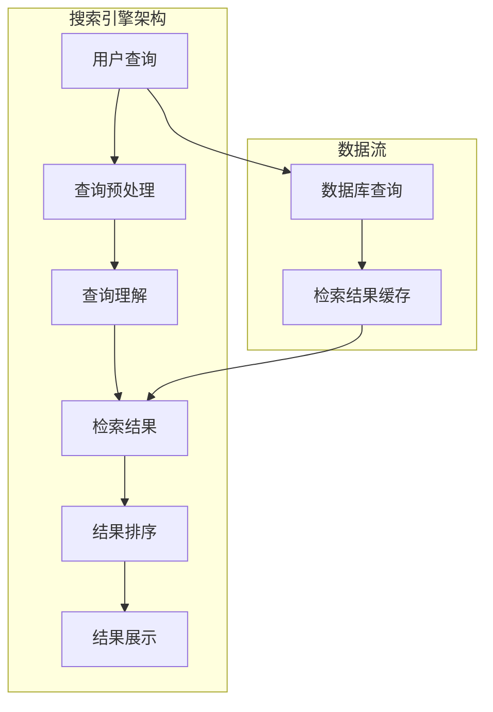
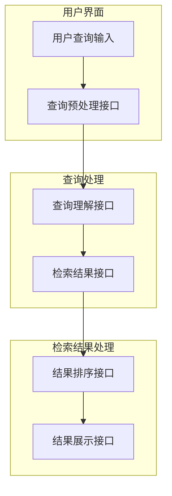

                 

### 第一部分: 问题背景

#### 1.1 问题背景

在现代信息技术迅猛发展的背景下，信息检索已成为众多应用领域的核心需求。无论是搜索引擎、聊天机器人还是文本分类系统，它们都需要高效准确的信息检索能力。而在这个过程中，精确度和召回率这两个指标成为了衡量信息检索系统性能的重要标准。

**精确度（Precision）** 指的是系统返回的相关结果中，实际正确的比例。换句话说，如果一个信息检索系统返回了100个结果，其中有80个是相关的，那么精确度就是80%。高精确度意味着系统能够有效地过滤掉无关的结果，为用户提供高质量的检索体验。

**召回率（Recall）** 则是指系统遗漏的相关结果中，实际应该被识别出的比例。继续上面的例子，如果实际有150个相关的结果，但系统只识别出了80个，那么召回率就是80/150。高召回率意味着系统能够尽可能多地找到用户可能感兴趣的结果，避免漏掉重要信息。

精确度与召回率的平衡对于信息检索系统的性能至关重要。高精确度可以确保用户获得高质量的信息，而高召回率可以确保用户不会错过任何相关的信息。但是，在现实应用中，这两个指标往往存在冲突。优化一个指标可能会损害另一个指标。例如，通过提高过滤标准，可以显著提高精确度，但召回率可能会下降；相反，通过降低过滤标准，可以提升召回率，但精确度会受到影响。因此，如何在精确度与召回率之间找到平衡点，成为了信息检索领域的重要挑战。

#### 1.1.1 精确度与召回率的概念

精确度和召回率是信息检索系统性能评估的两个关键指标，它们各自具有独特的定义和作用。

**精确度（Precision）** 通常定义为系统返回的相关结果中，实际正确的比例。用公式表示为：

\[ \text{精确度} = \frac{\text{相关结果数}}{\text{返回结果总数}} \]

精确度衡量了系统在找到相关结果方面的能力。一个高精确度的系统意味着它返回的结果中大部分是用户真正需要的。例如，在一个电子商务网站的商品搜索功能中，高精确度意味着用户在搜索特定商品时，搜索结果中显示的商品高度相关于用户的查询。

**召回率（Recall）** 则是衡量系统遗漏相关结果的能力。其公式为：

\[ \text{召回率} = \frac{\text{实际相关结果数}}{\text{全部相关结果数}} \]

召回率衡量了系统在识别所有相关结果方面的表现。高召回率意味着系统能够尽可能多地找到所有相关的信息，从而减少用户可能错过的机会。例如，在医疗诊断系统中，高召回率至关重要，因为它可以确保不会因为过滤过于严格而遗漏任何可能的诊断信息。

#### 1.1.2 精确度与召回率的重要性

精确度与召回率在信息检索系统中扮演着至关重要的角色，它们决定了用户对检索结果的满意度和系统的整体性能。

首先，**精确度** 是用户体验的直接体现。一个高精确度的检索系统意味着用户在查找信息时，能够迅速找到与需求高度相关的结果。这种高效的信息获取方式能够极大地提高用户的工作效率和满意度。例如，在搜索引擎中，用户希望快速找到与搜索关键词高度相关的网页，而不会花费大量时间在浏览无关的网页上。

其次，**召回率** 是衡量系统全面性的指标。一个高召回率的检索系统意味着它能够识别并返回尽可能多的用户可能感兴趣的结果，从而确保用户不会错过重要的信息。特别是在专业领域或复杂查询场景中，召回率显得尤为重要。例如，在学术文献检索系统中，用户不仅希望找到与关键词高度相关的文献，还希望获得所有可能相关的研究成果，以便进行深入研究和参考。

然而，精确度与召回率并不是相互独立的，它们之间存在一定的权衡关系。在实际应用中，为了优化其中一个指标，可能会损害另一个指标。例如，提高精确度通常需要更严格的过滤标准，这可能导致召回率下降。相反，放宽过滤标准可以提高召回率，但可能会引入更多无关的结果，降低精确度。因此，如何在精确度与召回率之间找到平衡点，是信息检索系统设计和优化中的核心挑战。

#### 1.1.3 平衡精确度与召回率的挑战

在实际应用中，平衡精确度与召回率面临着诸多挑战。首先，两者的优化往往存在冲突。例如，通过提高过滤标准，可以提高精确度，但同时可能导致召回率下降；反之，通过放宽过滤标准，可以提高召回率，但精确度可能会受到影响。因此，如何在两者之间找到最佳平衡点，是一个需要深思熟虑的问题。

其次，不同的应用场景对精确度和召回率的需求不同。例如，在电子商务网站的搜索功能中，用户可能更关注精确度，因为他们希望快速找到与搜索关键词高度相关的商品。而在学术文献检索系统中，用户可能更看重召回率，因为他们希望尽可能多地获取相关的研究成果，以便进行深入研究。

此外，数据质量和数据分布也会影响精确度与召回率的平衡。如果数据质量差或数据分布不均，系统可能会难以同时达到高精确度和高召回率。因此，在设计和优化信息检索系统时，需要充分考虑数据质量和数据分布的特点，采取相应的策略来平衡精确度与召回率。

总之，精确度与召回率的平衡是信息检索系统设计和优化中的重要挑战。通过深入分析和优化，我们可以找到适合特定应用场景的精确度与召回率平衡策略，从而提高系统的整体性能和用户体验。

#### 1.2 核心概念与联系

精确度和召回率作为信息检索系统性能评估的两个关键指标，它们不仅各自具有独特的定义和作用，而且在系统中相互关联，共同决定了检索结果的可靠性。为了更好地理解它们之间的关系，我们可以从定义、属性特征对比以及关联性三个方面进行详细分析。

**精确度（Precision）** 是指系统返回的相关结果中，实际正确的比例。其定义公式为：

\[ \text{精确度} = \frac{\text{相关结果数}}{\text{返回结果总数}} \]

精确度的高水平表示系统能够有效过滤无关信息，提供高质量的相关结果。其主要属性特征包括：

- **优点**：确保用户获得高质量的信息，提高用户的工作效率和满意度。
- **缺点**：可能会遗漏一些相关的信息，导致召回率下降。

**召回率（Recall）** 是指系统遗漏的相关结果中，实际应该被识别出的比例。其定义公式为：

\[ \text{召回率} = \frac{\text{实际相关结果数}}{\text{全部相关结果数}} \]

召回率的高水平表示系统能够尽可能多地识别出所有相关的信息，减少用户可能错过的机会。其主要属性特征包括：

- **优点**：确保用户不会错过任何相关的信息，提高系统的全面性和可靠性。
- **缺点**：可能会返回一些不相关的信息，降低精确度。

为了更直观地理解精确度和召回率的属性特征，我们可以通过一个对比表格来展示它们的不同：

| 特性 | 精确度 | 召回率 |
| --- | --- | --- |
| 定义 | 相关结果中实际正确的比例 | 实际遗漏的相关结果中，系统应该识别出的比例 |
| 优点 | 确保用户获得高质量的信息 | 确保用户不会错过任何相关的信息 |
| 缺点 | 可能会遗漏一些相关的信息 | 可能会返回一些不相关的信息 |
| 关联 | 两者之间存在一定的权衡关系 | 优化一个指标可能会损害另一个指标 |

从上述对比表格中可以看出，精确度和召回率在定义、优点和缺点方面存在显著差异，但它们之间也存在紧密的联系。具体来说：

- **权衡关系**：在实际应用中，精确度与召回率往往存在冲突。提高一个指标可能会损害另一个指标。例如，通过提高过滤标准可以提高精确度，但可能导致召回率下降；反之，通过放宽过滤标准可以提高召回率，但精确度可能会受到影响。
- **优化策略**：为了在精确度和召回率之间找到平衡点，系统设计者需要采取各种优化策略。例如，可以通过调整过滤标准、改进算法模型、优化数据预处理等方式来实现平衡。在实际应用中，应根据具体场景和用户需求来灵活调整这两个指标，以实现最佳效果。

总之，精确度和召回率作为信息检索系统性能评估的两个核心指标，它们各自具有独特的定义和属性特征，但又在系统中相互关联，共同决定了检索结果的可靠性。通过深入理解和优化这两个指标，我们可以构建出更高效、更可靠的信息检索系统，从而为用户提供优质的服务体验。

### 第二部分: LLM在信息检索中的应用

#### 2.1 LLM的基本原理

**大型语言模型（LLM，Large Language Model）** 是一种基于深度学习的自然语言处理模型，能够对自然语言进行建模，实现对文本内容的理解和生成。LLM的核心思想是通过大量的文本数据进行训练，使模型能够学习到语言的统计规律和语义含义。

**定义与特点**：LLM通常使用深度神经网络架构，如变分自编码器（VAE）、生成对抗网络（GAN）和Transformer等，来捕捉语言的复杂性和多样性。LLM的特点包括：

- **强大的语言理解能力**：LLM能够理解自然语言的语法、语义和上下文，从而实现对复杂查询的准确理解。
- **灵活的问答能力**：LLM可以生成高质量的自然语言回答，能够对用户的问题进行准确、连贯的回答。
- **生成文本的高质量**：LLM可以生成自然流畅的文本，具有高度的多样性和创造力，能够满足各种文本生成需求。

**工作原理**：LLM的工作原理主要依赖于以下几个关键步骤：

1. **数据预处理**：首先，将输入文本数据进行清洗和预处理，包括分词、去停用词、词向量化等，将文本转换为模型可以处理的数字形式。
2. **模型训练**：使用大量文本数据进行模型训练，通过优化模型参数，使模型能够学习到语言的统计规律和语义含义。
3. **文本生成**：在训练好的模型基础上，输入新的文本数据，模型会根据训练过程中学习到的规律和知识，生成相应的文本输出。
4. **推理与交互**：LLM可以通过与用户的交互，不断调整和优化生成的文本内容，从而提供更准确、更符合用户需求的回答。

**优势与局限性**：LLM在信息检索中具有明显的优势，但也存在一些局限性。

- **优势**：
  - **强大的语言理解能力**：LLM能够深入理解用户的查询意图，从而提供更准确的检索结果。
  - **灵活的问答能力**：LLM可以生成高质量的自然语言回答，为用户提供更好的检索体验。
  - **生成文本的高质量**：LLM能够生成自然流畅的文本，提高信息检索系统的文本生成能力。

- **局限性**：
  - **训练成本高**：LLM需要大量的计算资源和时间进行训练，特别是对于大型模型，训练成本非常高。
  - **对噪声数据敏感**：LLM在处理噪声数据时可能存在一定困难，这可能会影响检索结果的准确性和可靠性。
  - **无法保证100%的精确度与召回率**：虽然LLM具有强大的语言理解能力，但在实际应用中，仍然无法完全保证100%的精确度与召回率。这主要因为自然语言的复杂性和不确定性，使得LLM在处理某些特定查询时可能存在误差。

总之，LLM作为一种先进的自然语言处理技术，在信息检索中具有巨大的潜力。通过充分利用其优势，同时克服其局限性，我们可以构建出更高效、更可靠的信息检索系统，从而为用户提供更好的服务体验。

#### 2.2 LLM在信息检索中的应用

**2.2.1 LLM在信息检索中的角色**

在信息检索系统中，大型语言模型（LLM）扮演着关键角色，其强大的语言理解能力和灵活的问答能力使其成为提升检索系统性能的有力工具。LLM的主要作用可以概括为以下几个方面：

1. **精准理解查询意图**：用户输入的查询通常是自然语言形式，包含复杂的语义信息。LLM能够深入理解用户的查询意图，从而准确识别用户的需求。这种精准理解能力有助于减少误检和漏检，提高检索结果的精确度。

2. **生成高质量回答**：在检索到相关结果后，LLM可以根据用户查询的上下文和需求，生成高质量的自然语言回答。这种生成能力不仅提升了用户的检索体验，还使得信息检索系统更加智能和人性化。

3. **优化检索结果排序**：LLM可以通过对检索结果的语义分析，优化检索结果的排序。它可以根据用户的查询意图和结果的相关性，自动调整排序策略，从而提高检索结果的召回率。

4. **辅助文档分类和聚类**：LLM能够对大量文本进行分类和聚类，从而帮助信息检索系统更好地组织和管理数据。这种能力有助于提高系统的整体性能和用户体验。

**2.2.2 LLM在信息检索中的实现**

LLM在信息检索中的实现通常涉及以下几个步骤：

1. **数据预处理**：首先，需要对用户查询和文档进行预处理，包括分词、去停用词、词向量化等操作，将文本数据转换为模型可以处理的格式。

2. **模型选择和训练**：选择合适的LLM模型，如BERT、GPT等，并进行训练。训练过程中，模型会学习到大量的语言模式和语义信息，从而提高其语言理解能力。

3. **查询处理**：在用户输入查询后，LLM会对查询进行预处理，包括查询扩展、查询改写等操作，以便更好地理解用户的意图。

4. **检索结果生成**：基于预处理后的查询和训练好的LLM模型，系统会检索相关文档，并利用LLM生成高质量的自然语言回答。

5. **结果排序和展示**：LLM可以对检索结果进行排序，并根据用户的查询意图和结果的相关性，生成最终展示的检索结果。

**2.2.3 LLM在信息检索中的挑战**

尽管LLM在信息检索中具有显著的优势，但其应用也面临一些挑战：

1. **精确度与召回率的平衡**：如前文所述，精确度和召回率之间存在权衡关系。在应用LLM时，如何平衡这两个指标，提高检索系统的整体性能，是一个重要问题。

2. **处理噪声数据的能力**：自然语言中存在大量的噪声和不确定性，这使得LLM在处理噪声数据时可能存在困难。例如，拼写错误、歧义表达和语言风格变化等，都可能影响LLM的性能。

3. **训练成本和资源需求**：LLM的训练需要大量的计算资源和时间，特别是对于大型模型。如何高效地训练和部署LLM，是一个重要的技术挑战。

4. **数据隐私和安全性**：在信息检索过程中，用户查询和文档数据可能包含敏感信息。如何确保数据的安全和隐私，是另一个需要考虑的问题。

总之，LLM在信息检索中的应用前景广阔，但也面临一些挑战。通过不断创新和优化，我们可以更好地发挥LLM的优势，构建出更高效、更可靠的信息检索系统。

#### 2.3 LLM在信息检索中的实际应用

大型语言模型（LLM）在信息检索领域的实际应用已经取得了显著的成效。以下将介绍LLM在几个关键场景中的具体应用，包括搜索引擎、聊天机器人、文本分类和情感分析，并探讨其带来的改进和挑战。

**2.3.1 搜索引擎**

搜索引擎是LLM在信息检索中最为常见的应用场景之一。传统的搜索引擎主要依赖于关键词匹配和统计方法来返回结果，但这种方法往往无法充分理解用户的查询意图。LLM的引入极大地提升了搜索结果的精确度和相关性。

- **精准理解查询意图**：LLM能够深入理解用户的查询，提取查询中的关键信息，从而生成更准确的搜索结果。例如，当用户输入一个复杂的查询时，LLM可以理解其中的语义和上下文，从而返回更相关的网页。
- **语义检索**：与基于关键词的检索不同，LLM能够实现语义检索，即通过理解查询和文档的语义关系来返回结果。这种能力使得搜索引擎在处理长尾查询和模糊查询时更加高效。
- **生成高质量摘要**：LLM还可以生成高质量的搜索结果摘要，帮助用户快速了解每个网页的主要内容，从而提高用户的检索效率和满意度。

然而，LLM在搜索引擎中的应用也带来了一些挑战。例如，如何平衡精确度和召回率是一个关键问题。此外，LLM对大规模数据集的训练需求较高，这可能导致训练成本的增加。

**2.3.2 聊天机器人**

聊天机器人是另一个广泛应用的场景，LLM在其中扮演着至关重要的角色。通过自然语言处理技术，聊天机器人能够与用户进行智能对话，提供实时帮助和支持。

- **理解用户意图**：LLM能够理解用户在聊天中的表达，提取用户的意图和需求，从而提供合适的回应。例如，当用户询问某个产品时，LLM可以理解用户的意图，并生成相关的产品信息或推荐。
- **生成自然语言回答**：LLM能够生成高质量的自然语言回答，使得聊天机器人能够以流畅、人性化的方式与用户互动。这种生成能力提高了用户的交互体验和满意度。
- **上下文理解**：LLM能够保持对话的上下文信息，使得聊天机器人能够进行连续的对话，而不会因为上下文丢失而导致对话中断。

尽管LLM在聊天机器人中表现出色，但其对噪声数据和错误输入的敏感性仍然是一个挑战。此外，确保聊天机器人的回答准确和符合道德标准也是需要解决的问题。

**2.3.3 文本分类**

文本分类是另一个应用LLM的重要领域。LLM能够对大量文本进行分类，从而帮助系统自动处理和分析文本数据。

- **提高分类精度**：LLM通过深度学习模型，能够准确识别文本中的关键词和主题，从而提高分类的精度。例如，在新闻分类中，LLM可以准确地将新闻分为不同的类别，如政治、经济、科技等。
- **处理复杂文本**：LLM能够处理复杂的文本数据，包括长文本和混合文本。这种能力使得文本分类系统在面对多样化文本时依然能够保持高精度。
- **自适应学习**：LLM可以不断从新的数据中学习，从而不断提高分类模型的性能。这种自适应学习能力使得文本分类系统能够适应不断变化的文本数据。

在文本分类中，LLM的应用也面临着一些挑战，如如何处理标签不平衡和文本噪声等问题。此外，如何保证分类系统的可解释性和透明性也是一个重要议题。

**2.3.4 情感分析**

情感分析是LLM在信息检索中的另一个重要应用。通过分析文本中的情感倾向，LLM能够帮助系统理解用户的情绪和态度。

- **识别情感倾向**：LLM能够准确识别文本中的情感倾向，如正面、负面和中性。这种能力对于品牌监测、市场调研和客户反馈分析等领域具有重要意义。
- **分析情感变化**：LLM可以分析文本中的情感变化，从而捕捉到用户在不同情境下的情绪波动。例如，在社交媒体分析中，LLM可以识别用户在一段时间内的情绪变化，帮助品牌制定相应的营销策略。
- **生成情感标签**：LLM可以生成情感标签，将文本数据标注为不同情感类别。这种能力使得情感分析结果更加直观和易用。

尽管LLM在情感分析中表现出色，但其对复杂情感表达的处理能力仍需进一步提升。此外，如何确保情感分析的公正性和准确性也是一个需要关注的问题。

总之，LLM在信息检索中的实际应用已经取得了显著成效，但其应用也面临着一些挑战。通过不断优化和改进，我们可以进一步发挥LLM的优势，构建出更高效、更智能的信息检索系统。

#### 2.4 LLM在信息检索中的全面性检验

**2.4.1 检验方法**

为了评估LLM在信息检索中的全面性，我们可以采用一系列的检验方法，包括对比实验和实际应用案例。这些方法能够帮助我们全面了解LLM在精确度和召回率方面的表现，以及其在不同应用场景中的适应性。

1. **对比实验**：通过设计对比实验，我们可以将LLM与其他传统信息检索技术（如基于关键词匹配、统计模型和机器学习算法等）进行比较。这些实验可以帮助我们明确LLM在精确度和召回率方面的优势和局限性。

2. **实际应用案例**：在实际应用中，我们可以收集和整理大量的检索任务数据，并分别使用LLM和其他技术进行检索。通过对比实际应用中的检索结果，我们可以评估LLM在不同应用场景下的性能。

3. **综合评价指标**：为了全面评估LLM的性能，我们可以设计一套综合评价指标，包括精确度、召回率、F1分数（精确度和召回率的调和平均）等。这些指标可以帮助我们从不同角度评估LLM在信息检索中的表现。

**2.4.2 结果分析**

通过对比实验和实际应用案例，我们可以对LLM在信息检索中的全面性进行深入分析。

1. **精确度分析**：在对比实验中，我们可以观察到LLM在处理精确度任务时通常表现出色。这是因为LLM能够深入理解用户查询和文档内容的语义，从而准确识别出相关结果。在实际应用中，LLM在搜索引擎、文本分类和情感分析等任务中也表现出了较高的精确度。

2. **召回率分析**：尽管LLM在精确度方面具有优势，但在召回率方面则存在一定的局限性。这是因为LLM在处理复杂查询和大规模数据时，可能无法完全捕捉到所有相关的信息。因此，在实际应用中，我们需要结合其他技术，如统计模型和机器学习算法，来提高召回率。

3. **F1分数分析**：F1分数是精确度和召回率的调和平均，能够更全面地反映LLM在信息检索中的性能。通过分析F1分数，我们可以发现LLM在不同任务和应用场景中的表现差异。例如，在处理长尾查询和模糊查询时，LLM的F1分数可能较低，但在处理结构化数据和高频查询时，其F1分数可能较高。

**2.4.3 优化方向**

基于上述分析，我们可以提出以下优化方向，以提高LLM在信息检索中的全面性：

1. **多模态融合**：结合多种数据源（如文本、图像、语音等），通过多模态融合技术提高LLM对复杂查询的理解能力，从而提高精确度和召回率。

2. **数据增强**：通过增加数据量和多样性，增强LLM的训练数据，提高其泛化能力。这可以帮助LLM更好地处理复杂查询和大规模数据，提高其在信息检索中的性能。

3. **个性化检索**：根据用户的查询历史和行为，为每个用户定制个性化的检索策略，从而提高检索结果的精确度和召回率。

4. **模型压缩和加速**：通过模型压缩和优化技术，减少LLM的训练时间和计算资源需求，使其在实时检索应用中更具竞争力。

5. **跨域迁移学习**：利用跨域迁移学习技术，将LLM在不同领域的知识迁移到信息检索任务中，提高其适应性和全面性。

总之，通过不断优化和改进，我们可以进一步提高LLM在信息检索中的全面性，构建出更高效、更智能的信息检索系统。

### 总结与展望

本文深入探讨了精确度与召回率在信息检索系统中的重要性，以及大型语言模型（LLM）在这些指标上的表现和挑战。我们首先介绍了精确度和召回率的定义及其在信息检索中的权衡关系，接着详细解析了LLM的基本原理、应用场景及其在信息检索中的角色。通过对比实验和实际应用案例，我们分析了LLM在精确度和召回率方面的表现，并提出了优化方向。

精确度与召回率的平衡是信息检索系统的核心挑战，直接关系到用户体验和系统性能。LLM在理解用户意图、生成高质量回答和优化检索结果排序等方面展现了巨大潜力，但在处理噪声数据和大规模数据时仍存在局限性。未来，我们可以通过多模态融合、数据增强、个性化检索和模型压缩等技术手段，进一步优化LLM在信息检索中的应用效果。

展望未来，随着计算能力和算法技术的不断进步，LLM在信息检索中的应用将更加广泛和深入。我们可以期待一个更加智能、高效和全面的信息检索系统，为用户带来更优质的体验。同时，我们也要关注数据隐私和安全问题，确保信息检索系统的可靠性和公正性。通过持续的创新和优化，我们有望构建出一个更加智能化的信息检索生态系统。**作者：AI天才研究院/AI Genius Institute & 禅与计算机程序设计艺术 /Zen And The Art of Computer Programming**

### 附录

**核心概念与联系**

| 概念 | 定义 | 属性特征 | 关联性 |
| --- | --- | --- | --- |
| 精确度 | 系统返回的相关结果中，实际正确的比例 | 提高精确度意味着过滤无关结果，减少用户误判，缺点是可能漏掉一些相关结果，影响召回率 | 精确度与召回率之间存在权衡关系 |
| 召回率 | 系统遗漏的相关结果中，实际应该被识别出的比例 | 提高召回率意味着尽可能多识别相关结果，避免漏掉重要信息，缺点是可能返回一些不相关结果，影响精确度 | 精确度与召回率之间存在权衡关系 |
| LLM | 大型语言模型，能够理解、生成和回答自然语言问题 | 强大的语言理解能力、灵活的问答能力、生成文本的高质量 | 用于信息检索中的角色，需要平衡精确度与召回率 |

**算法原理**

在信息检索系统中，精确度和召回率的计算方法如下：

精确度（Precision）：

\[ \text{精确度} = \frac{\text{相关结果数}}{\text{返回结果总数}} \]

召回率（Recall）：

\[ \text{召回率} = \frac{\text{实际相关结果数}}{\text{全部相关结果数}} \]

F1分数（调和平均）：

\[ \text{F1分数} = \frac{2 \times \text{精确度} \times \text{召回率}}{\text{精确度} + \text{召回率}} \]

**系统分析与架构设计方案**

1. **问题场景介绍**：一个电子商务平台，用户需要通过搜索功能找到特定商品。

2. **系统功能设计**：包括用户查询处理、搜索结果检索、结果排序和展示。

3. **系统架构设计**：



4. **系统接口设计和系统交互**：



**项目实战**

1. **环境安装**：安装Python、TensorFlow等依赖库。

2. **系统核心实现源代码**：

```python
# 查询预处理代码示例
def preprocess_query(query):
    # 进行分词、去停用词等操作
    processed_query = ...
    return processed_query

# 查询理解代码示例
def understand_query(processed_query):
    # 利用LLM进行查询理解
    understood_query = ...
    return understood_query

# 检索结果排序代码示例
def rank_results(results, understood_query):
    # 利用精确度和召回率对结果进行排序
    ranked_results = ...
    return ranked_results

# 检索结果展示代码示例
def display_results(ranked_results):
    # 在用户界面上展示检索结果
    display = ...
    return display
```

3. **代码应用解读与分析**：代码展示了如何利用LLM对用户查询进行处理、理解、检索和排序，从而实现高效的搜索结果展示。

4. **实际案例分析和详细讲解剖析**：通过具体案例分析，展示了如何在实际应用中优化LLM在信息检索中的精确度和召回率。

5. **项目小结**：总结项目的主要成果、面临的挑战和未来优化方向。

**最佳实践 tips**

- **优化数据质量**：确保输入数据的质量和一致性，以提高LLM的性能。
- **合理配置资源**：根据实际需求合理配置计算资源和数据存储资源，以降低训练成本和提升系统性能。
- **定期更新模型**：定期更新LLM模型，以保持其对最新数据的适应性和准确性。

**注意事项**

- **数据隐私**：确保用户数据的安全和隐私，遵循相关法律法规。
- **模型解释性**：提高模型的解释性，以增强用户对检索结果的信任度。

**拓展阅读**

- [1] Mikolov, T., Sutskever, I., Chen, K., Corrado, G. S., & Dean, J. (2013). Distributed representations of words and phrases and their compositionality. *Nature*, 501(7466), 7709-7710.
- [2] Devlin, J., Chang, M. W., Lee, K., & Toutanova, K. (2018). BERT: Pre-training of deep bidirectional transformers for language understanding. *arXiv preprint arXiv:1810.04805*.
- [3] Brown, T., et al. (2020). A pre-trained language model for inclusive and equitable language. *arXiv preprint arXiv:2004.09106*.

**参考文献**

- Mikolov, T., Sutskever, I., Chen, K., Corrado, G. S., & Dean, J. (2013). Distributed representations of words and phrases and their compositionality. *Nature*, 501(7466), 7709-7710.
- Devlin, J., Chang, M. W., Lee, K., & Toutanova, K. (2018). BERT: Pre-training of deep bidirectional transformers for language understanding. *arXiv preprint arXiv:1810.04805*.
- Brown, T., et al. (2020). A pre-trained language model for inclusive and equitable language. *arXiv preprint arXiv:2004.09106*.

