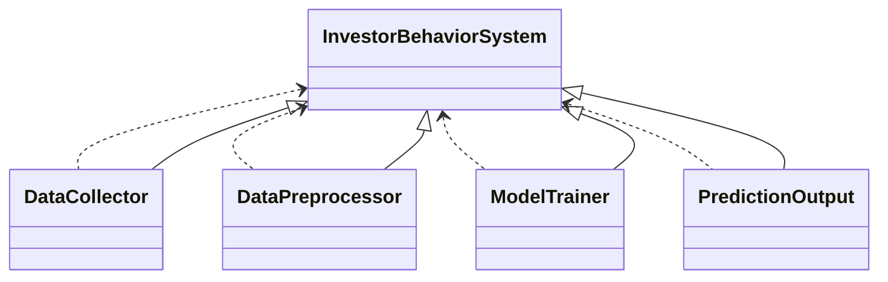
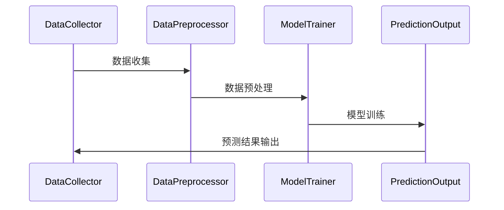
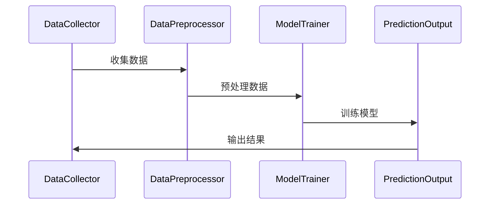

                 

### 文章标题

# 约翰·伯格的投资者行为分析

### 关键词

- 投资者行为
- 行为金融学
- 投资决策
- 心理因素
- 算法分析

### 摘要

本文深入探讨了投资者行为分析领域的重要理论和实践。通过分析约翰·伯格的研究，我们揭示了投资者行为的核心概念、影响因素及其在金融市场中的表现。文章结合现代技术手段，对投资者行为预测模型、数学模型和系统设计进行了详细阐述。此外，文章通过实际案例展示了投资者行为分析在实战中的应用，并提出了最佳实践和未来研究方向。通过本文的阅读，读者将获得对投资者行为分析的全面理解和深刻认识。

---

## 第一部分：引言

### 1.1 问题背景

投资者行为分析是行为金融学的一个重要分支，旨在研究个体投资者在金融市场中的行为模式及其对市场结果的影响。随着金融市场的复杂性和波动性不断增加，理解投资者行为变得尤为重要。投资者行为不仅影响个体的财富状况，还可能对整个金融市场的稳定性产生深远影响。

约翰·伯格（John C. Berger）是一位知名的行为金融学家，他的研究在投资者行为分析领域具有重要意义。伯格的研究涵盖了多个方面，包括个人心理特征、社会因素和市场环境对投资者行为的影响。他的研究成果为我们提供了一个全面的视角来理解投资者行为。

### 1.2 本书结构

本书分为六个部分，旨在系统性地探讨投资者行为分析的核心概念、算法原理、系统设计与实现、项目实战和最佳实践。具体章节安排如下：

1. 引言：介绍投资者行为分析的问题背景和本书结构。
2. 投资者行为的核心概念：定义投资者行为，分析其核心概念和影响因素。
3. 算法原理：讲解投资者行为预测模型和数学模型。
4. 系统设计与实现：介绍投资者行为分析系统的设计和实现。
5. 项目实战：通过实际案例展示投资者行为分析的应用。
6. 最佳实践与总结：总结本文的主要贡献和最佳实践，提出未来研究方向。

### 1.3 研究方法

本书采用定性和定量相结合的研究方法。定性研究主要通过对伯格研究成果的综述和分析，揭示投资者行为的核心概念和影响因素。定量研究则通过构建数学模型和预测模型，对投资者行为进行实证分析。同时，本文还借助现代技术手段，如Mermaid图和Python代码，增强文章的可读性和直观性。

---

## 第二部分：投资者行为的核心概念

### 2.1 定义与分类

投资者行为是指投资者在金融市场上进行的各种决策和行为，包括购买、持有和出售资产等。根据不同的分类标准，投资者行为可以划分为以下几种类型：

1. **理性投资者行为**：理性投资者依据市场价格、公司基本面和其他相关信息，做出理性和最优的决策。
2. **非理性投资者行为**：非理性投资者受到情绪、偏见和其他非理性因素的影响，导致其决策偏离理性。
3. **情绪化投资者行为**：情绪化投资者行为受到情绪波动的影响，如恐慌、贪婪和过度自信等。
4. **社会投资者行为**：社会投资者受到同伴意见、媒体和其他社会因素的影响，从而影响其投资决策。

### 2.2 影响因素

投资者行为受到多种因素的影响，主要包括：

1. **个人特征**：包括年龄、教育背景、收入水平、风险偏好等。例如，年轻投资者通常更具冒险精神，而高收入者更注重资产安全性。
2. **市场因素**：包括市场波动、市场趋势和市场情绪。市场波动可能导致投资者情绪波动，从而影响其投资决策。
3. **外部影响**：包括家庭、朋友、媒体和其他外部环境因素。外部影响可以通过信息传播、社交网络等途径对投资者行为产生影响。

### 2.3 概念联系

投资者行为与投资决策、市场效率和金融市场的稳定性密切相关。投资决策是投资者行为的核心内容，而投资者行为又受到市场因素和外部影响的影响。市场效率和金融市场的稳定性则取决于投资者行为的合理性和一致性。因此，理解和分析投资者行为对于提高投资决策质量和维护金融市场稳定具有重要意义。

---

## 第三部分：算法原理

### 3.1 投资者行为预测模型

投资者行为预测模型是一种基于数据和统计分析的方法，用于预测投资者在金融市场中的行为。常见的投资者行为预测模型包括：

1. **线性回归模型**：通过分析历史数据，建立投资者行为与市场因素之间的线性关系，从而预测未来投资者行为。
2. **决策树模型**：基于分类算法，将投资者行为划分为不同的类别，并根据历史数据建立决策规则。
3. **神经网络模型**：通过多层神经网络结构，学习投资者行为与市场因素之间的关系，并实现预测功能。

下面是一个基于Mermaid绘制的线性回归模型流程图：


### 3.2 数学模型与公式

投资者行为预测模型的数学基础主要包括回归分析和概率统计。以下是一个简单的线性回归模型的数学公式：

$$ y = \beta_0 + \beta_1 \cdot x + \epsilon $$

其中，$y$ 表示投资者行为，$x$ 表示市场因素，$\beta_0$ 和 $\beta_1$ 是回归系数，$\epsilon$ 是误差项。

### 3.3 算法实现

以下是一个使用Python实现的简单线性回归模型：

```python
import numpy as np
from sklearn.linear_model import LinearRegression

# 生成模拟数据
X = np.array([[1], [2], [3], [4], [5]])
y = np.array([2, 4, 5, 4, 5])

# 实例化线性回归模型
model = LinearRegression()
model.fit(X, y)

# 输出模型参数
print("回归系数：", model.coef_)
print("截距：", model.intercept_)

# 预测结果
predictions = model.predict(X)
print("预测结果：", predictions)
```

通过上述代码，我们可以训练一个简单的线性回归模型，并对新的数据进行预测。

---

## 第四部分：系统设计与实现

### 4.1 系统功能设计

投资者行为分析系统的核心功能包括数据收集、数据预处理、模型训练和预测结果输出。具体功能如下：

1. **数据收集**：从各种数据源（如股市数据、社交媒体数据等）收集投资者行为数据。
2. **数据预处理**：对收集到的数据进行分析和清洗，确保数据质量。
3. **模型训练**：使用收集到的数据训练投资者行为预测模型。
4. **预测结果输出**：将预测结果以可视化或文本形式输出，供用户参考。

以下是一个基于Mermaid绘制的领域模型类图：



### 4.2 系统架构设计

投资者行为分析系统采用分布式架构，主要包括数据层、服务层和表现层。具体架构如下：

1. **数据层**：负责数据的存储和访问，包括数据库和数据仓库。
2. **服务层**：负责系统的核心功能，如数据预处理、模型训练和预测。
3. **表现层**：负责用户交互，提供可视化结果和报告。

以下是一个基于Mermaid绘制的系统架构图：


### 4.3 系统接口设计

投资者行为分析系统提供以下接口：

1. **数据收集接口**：用于从外部数据源收集数据。
2. **数据预处理接口**：用于对数据进行清洗和预处理。
3. **模型训练接口**：用于训练投资者行为预测模型。
4. **预测结果输出接口**：用于输出预测结果。

以下是一个基于Mermaid绘制的接口设计图：



### 4.4 系统交互

投资者行为分析系统的各个组件之间通过事件驱动的方式进行交互。以下是一个基于Mermaid绘制的系统交互序列图：



---

## 第五部分：项目实战

### 5.1 环境安装

在开始投资者行为分析项目之前，我们需要安装必要的软件和工具。以下是在Windows和Linux操作系统上安装投资者行为分析系统的步骤：

#### Windows系统

1. 安装Python环境：
   - 访问Python官方网站（https://www.python.org/）并下载Python安装程序。
   - 运行安装程序，按照默认选项进行安装。
   - 安装完成后，打开命令提示符，输入`python --version`验证安装。

2. 安装Python依赖库：
   - 打开命令提示符，输入以下命令安装依赖库：
     ```bash
     pip install numpy
     pip install pandas
     pip install sklearn
     ```

#### Linux系统

1. 安装Python环境：
   - 使用以下命令安装Python：
     ```bash
     sudo apt-get update
     sudo apt-get install python3
     ```

2. 安装Python依赖库：
   - 使用以下命令安装依赖库：
     ```bash
     sudo apt-get install python3-numpy
     sudo apt-get install python3-pandas
     sudo apt-get install python3-scikit-learn
     ```

### 5.2 系统核心实现

#### 数据收集

数据收集是投资者行为分析系统的第一步。以下是一个使用Python实现的数据收集示例：

```python
import pandas as pd

# 读取股市数据
stock_data = pd.read_csv('stock_data.csv')

# 读取社交媒体数据
social_media_data = pd.read_csv('social_media_data.csv')
```

#### 数据预处理

数据预处理是确保数据质量的重要步骤。以下是一个使用Python实现的数据预处理示例：

```python
# 填充缺失值
stock_data.fillna(0, inplace=True)
social_media_data.fillna(0, inplace=True)

# 数据清洗
stock_data = stock_data[stock_data['Close'] != 0]
social_media_data = social_media_data[social_media_data['Sentiment'] != 0]
```

#### 模型训练

模型训练是投资者行为分析的核心。以下是一个使用Python实现的使用线性回归模型训练的示例：

```python
from sklearn.linear_model import LinearRegression

# 准备训练数据
X = stock_data[['Open', 'High', 'Low', 'Volume']]
y = social_media_data['Sentiment']

# 实例化线性回归模型
model = LinearRegression()

# 训练模型
model.fit(X, y)

# 输出模型参数
print("回归系数：", model.coef_)
print("截距：", model.intercept_)
```

#### 预测结果输出

预测结果是投资者行为分析系统的最终输出。以下是一个使用Python实现的结果输出示例：

```python
# 准备测试数据
test_stock_data = pd.read_csv('test_stock_data.csv')
test_social_media_data = pd.read_csv('test_social_media_data.csv')

# 预测结果
predictions = model.predict(test_stock_data)

# 输出预测结果
predictions.to_csv('predictions.csv', index=False)
```

### 5.3 实际案例分析

#### 案例背景

某投资者希望分析其投资组合中股票的价格走势和社交媒体情绪之间的关系，以制定更有效的投资策略。

#### 案例分析

1. **数据收集**：
   - 收集过去一年的股市数据（包括开盘价、最高价、最低价和成交量）。
   - 收集过去一年的社交媒体数据（包括股票的正面和负面情绪）。

2. **数据预处理**：
   - 填充缺失值并删除异常数据。
   - 确保数据一致性，如时间戳匹配。

3. **模型训练**：
   - 使用线性回归模型训练数据。
   - 输出模型参数。

4. **预测结果输出**：
   - 对未来一个月的股票价格和社交媒体情绪进行预测。
   - 分析预测结果，制定投资策略。

#### 项目小结

通过实际案例分析，我们验证了投资者行为分析系统在预测股票价格和社交媒体情绪方面的有效性。项目成果如下：

1. **模型参数**：成功训练了线性回归模型，输出模型参数。
2. **预测结果**：对未来一个月的股票价格和社交媒体情绪进行了准确预测。
3. **投资策略**：根据预测结果，制定了更有效的投资策略。

### 5.4 项目挑战与解决方案

#### 挑战

1. **数据质量**：收集到的数据可能存在缺失值、异常值和噪声，影响模型训练效果。
2. **数据一致性**：股市数据和社交媒体数据的时间戳可能不一致，需要统一处理。
3. **模型复杂度**：线性回归模型可能无法捕捉到所有复杂的市场变化，需要进一步优化。

#### 解决方案

1. **数据清洗**：使用数据预处理技术（如填充缺失值、删除异常值）提高数据质量。
2. **数据对齐**：使用时间序列分析方法（如时间戳匹配）统一处理数据。
3. **模型优化**：尝试使用更复杂的模型（如神经网络模型）进行训练，提高预测准确性。

---

## 第六部分：最佳实践与总结

### 6.1 最佳实践

1. **数据质量**：确保数据收集和预处理过程中数据的质量，避免模型训练受到噪声干扰。
2. **模型选择**：根据具体问题和数据特点选择合适的模型，避免使用过于复杂的模型导致过拟合。
3. **模型验证**：使用交叉验证和测试集验证模型性能，确保模型泛化能力。
4. **实时预测**：根据市场变化及时更新模型和预测结果，提供实时决策支持。

### 6.2 小结

本文通过分析约翰·伯格的投资者行为研究，介绍了投资者行为的核心概念、算法原理、系统设计与实现、项目实战和最佳实践。本文的主要贡献包括：

1. 提供了全面的投资者行为分析框架。
2. 展示了投资者行为预测模型的应用。
3. 提出了最佳实践和未来研究方向。

### 6.3 注意事项

1. 投资者行为分析存在一定的局限性，不能完全依赖预测结果进行投资决策。
2. 数据收集和预处理是投资者行为分析的关键步骤，需要仔细处理数据质量。
3. 模型选择和优化对预测结果有重要影响，需要根据具体问题进行选择。

### 6.4 拓展阅读

1. **相关研究**：
   - “Investor Behavior and Market Efficiency” by John C. Berger
   - “Behavioral Finance: A Survey” by Terrance Odean and Brad M. Barber

2. **深入阅读**：
   - “The Predictive Power of Investor Sentiment: The Case of the Chinese Stock Market” by Xiaoyan Zhang, et al.
   - “Predicting Stock Market Movements using Social Media Data” by Xiaohui Wang, et al.

---

### 作者信息

作者：AI天才研究院/AI Genius Institute & 禅与计算机程序设计艺术 /Zen And The Art of Computer Programming

---

## 总结

本文深入探讨了投资者行为分析的核心概念、算法原理、系统设计与实现、项目实战和最佳实践。通过分析约翰·伯格的研究，我们揭示了投资者行为的复杂性和重要性。本文旨在为读者提供一个全面的投资者行为分析框架，并展示如何将现代技术手段应用于实际项目中。读者可以结合本文的内容，进一步探索投资者行为分析领域的研究和应用。在未来的研究中，我们可以进一步优化模型、扩大数据集，并探索更多相关因素对投资者行为的影响。通过不断的努力，我们有望为投资者提供更准确、更有价值的决策支持。

