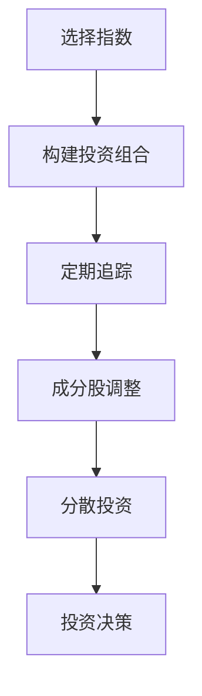
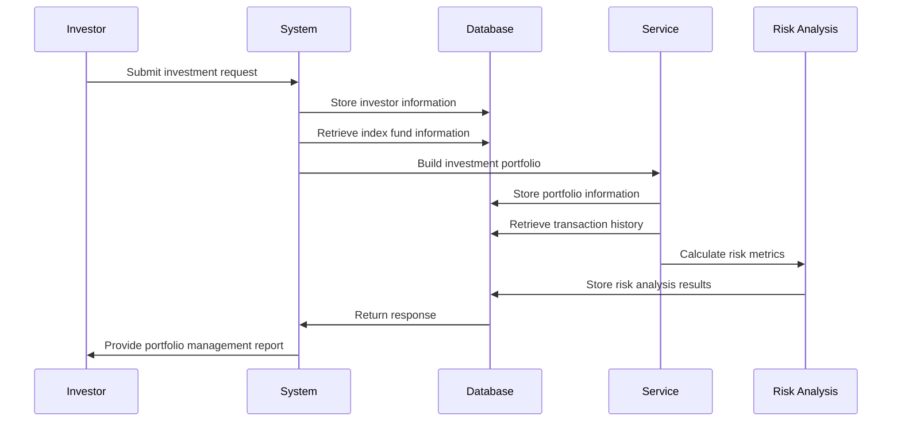

                 


# 约翰·伯格的指数基金投资理念

## 关键词
- 约翰·伯格
- 指数基金
- 投资理念
- 长期投资
- 分散投资
- 投资者心态

## 摘要
本文将深入探讨约翰·伯格的指数基金投资理念。伯格是一位著名投资大师，他对指数基金的投资有着深刻的见解和独到的理念。本文将围绕伯格的投资哲学、指数基金的基本概念、投资策略、案例分析、投资者心态与风险管理等方面进行详细阐述，帮助读者更好地理解指数基金投资的核心原理和实践方法。

## 引言与背景介绍

### 1. 约翰·伯格的投资哲学与成就

约翰·伯格（John C. Bogle）是一位著名的投资大师，被誉为“指数基金之父”。他于1929年出生在美国宾夕法尼亚州，早年受家庭影响，对投资产生了浓厚的兴趣。伯格在耶鲁大学获得经济学学士学位后，进入了华尔街的金融服务行业。

在多年的投资生涯中，伯格对市场的波动和投资者的行为进行了深入的研究，并逐渐形成了自己独特的投资哲学。他坚信长期投资的重要性，提倡价值投资和分散投资的理念，认为投资者应该以理性的态度看待市场，避免过度投机和贪婪。

伯格的成就可以说是指数基金投资的缩影。他在1970年代创建了先锋基金公司（Vanguard），并推出了全球第一只指数基金——先锋500指数基金（Vanguard 500 Index Fund）。这一举措彻底改变了投资行业的格局，使得指数基金逐渐成为投资者追求长期稳健收益的重要工具。

### 2. 指数基金投资的起源与发展

指数基金（Index Fund）是一种基于特定指数构建的投资组合，目的是追踪指数的表现，而不是试图超越市场。指数基金的投资理念可以追溯到20世纪60年代，当时市场效率理论开始受到广泛关注，一些学者开始探讨通过被动投资来获取市场平均收益的可能性。

指数基金的发展历程可以分为几个阶段：

- **萌芽阶段（1960s-1970s）**：指数基金的概念初步提出，但并未得到广泛关注。这一时期，学者们主要在理论上探讨指数基金的优势。

- **起步阶段（1980s）**：随着市场波动加剧，投资者开始意识到被动投资的魅力，指数基金开始逐渐兴起。1980年代，约翰·伯格的先锋基金公司推出了全球第一只指数基金，标志着指数基金投资时代的到来。

- **快速发展阶段（1990s-2000s）**：在这一时期，指数基金的数量和规模迅速扩大，吸引了越来越多的投资者。同时，指数基金的投资策略也逐渐成熟，形成了多样化的指数基金产品。

- **成熟阶段（2000s-至今）**：随着金融市场的成熟和投资者对风险收益的更加理性认识，指数基金已经成为投资组合中的重要组成部分。全球范围内，指数基金市场持续扩大，成为投资者追求长期稳健收益的重要选择。

## 约翰·伯格的投资理念

### 1. 投资的核心原则

约翰·伯格的投资理念可以概括为几个核心原则：

- **长期投资**：伯格认为，投资者应该以长期视角来看待投资，避免短期市场波动的影响。长期投资能够更好地实现复利效应，从而获取稳健的收益。

- **价值投资**：伯格提倡价值投资，即选择那些价格低于其内在价值的资产进行投资。他认为，投资者应该专注于公司的基本面，而不是市场的情绪。

- **分散投资**：伯格强调分散投资的重要性，通过投资多种不同类型的资产，可以降低组合的整体风险。分散投资能够帮助投资者在市场波动时保持冷静，避免因单一资产表现不佳而遭受巨大损失。

### 2. 投资者的心理建设

投资者的心理建设是投资成功的关键因素之一。伯格认为，投资者应该具备以下心理素质：

- **理性看待市场**：市场波动是常态，投资者不应该被短期波动所影响。理性看待市场，能够帮助投资者保持冷静，避免盲目跟风。

- **避免过度交易**：过度交易不仅会增加成本，还会增加投资风险。伯格提倡投资者应该减少交易频率，专注于长期投资策略。

- **接受投资风险**：任何投资都存在风险，投资者应该学会接受并管理风险。通过分散投资和长期投资，可以降低风险，实现资产的稳健增长。

### 3. 避免常见的投资误区

伯格指出，许多投资者容易陷入一些常见的投资误区，这些误区会导致投资失败。为了避免这些误区，投资者应该：

- **避免盲目跟风**：市场情绪很容易影响投资者的决策，盲目跟风往往会导致投资失误。投资者应该保持独立思考，基于自身的研究和分析做出投资决策。

- **避免过度乐观或悲观**：投资者在市场上涨时容易过度乐观，而在市场下跌时又容易过度悲观。这种情绪波动会影响投资决策，导致投资失败。投资者应该保持平衡，理性看待市场变化。

- **不要期望过高收益**：指数基金投资的目标是长期稳健的收益，而不是短期的暴利。投资者应该设定合理的收益预期，避免追求不切实际的高收益。

## 指数基金投资策略

### 1. 指数基金的基本概念

指数基金是一种投资组合，旨在追踪特定指数的表现。与主动管理基金不同，指数基金不试图超越市场，而是尽可能复制指数的表现。

指数基金可以分为以下几类：

- **股票指数基金**：追踪股票市场的指数，如标普500指数、上证指数等。
- **债券指数基金**：追踪债券市场的指数，如国债指数、企业债指数等。
- **商品指数基金**：追踪商品市场的指数，如原油指数、黄金指数等。

指数基金的优势在于其低成本和分散化投资。由于指数基金不进行主动选股或选债，因此管理费用较低，同时能够有效分散投资风险。

### 2. 如何选择合适的指数基金

选择合适的指数基金是投资成功的关键。以下是一些选择指数基金的建议：

- **确定投资目标**：投资者应该根据自己的投资目标选择相应的指数基金。例如，如果目标是长期投资，可以选择股票指数基金；如果目标是资产配置，可以选择债券指数基金。

- **评估指数基金的历史表现**：虽然过去的表现并不代表未来的表现，但投资者可以通过评估指数基金的历史表现来了解其投资策略的稳定性。

- **考虑指数基金的费用**：管理费用和托管费用是影响指数基金收益的重要因素。投资者应该选择费用较低的指数基金。

- **分散投资**：通过投资多个不同类型的指数基金，可以实现风险的分散，降低投资组合的整体风险。

### 3. 不同市场环境下的投资策略

指数基金投资需要根据不同市场环境调整策略：

- **市场上涨时**：在市场上涨时，投资者可以适当增加指数基金的持有比例，以获取更多的市场收益。

- **市场下跌时**：在市场下跌时，投资者可以适当减少指数基金的持有比例，以降低投资风险。

- **市场波动时**：在市场波动较大时，投资者应该保持冷静，避免过度交易，以降低交易成本和风险。

## 实战案例分析

### 1. 约翰·伯格的指数基金投资实践

约翰·伯格在指数基金投资领域有着丰富的实践经验。以下是一些典型案例：

- **先锋500指数基金**：伯格在1970年代推出了先锋500指数基金，这一举措彻底改变了投资行业的格局。先锋500指数基金的成功证明了指数基金投资策略的可行性。

- **长期投资收益**：伯格一直坚持长期投资，他在1980年代初期开始投资的一笔资金，经过几十年的积累，最终实现了数倍的增长。这证明了长期投资的价值。

### 2. 成功案例解析

以下是一个成功的指数基金投资案例：

- **投资者A**：投资者A在2008年金融危机后，开始投资指数基金，当时市场正处于低位。他坚持长期投资，每年定期定投，最终在2018年实现了投资收益的翻倍。

### 3. 失败案例反思

以下是一个失败的指数基金投资案例：

- **投资者B**：投资者B在2015年股市高点时，大量投资指数基金，期望快速获利。然而，由于市场突然下跌，他的投资亏损了近30%。这个案例提醒投资者，不能盲目跟风，应该基于长期投资策略进行投资。

## 投资者心态与风险管理

### 1. 投资者心理的调整

投资者在投资过程中，需要调整心态，以应对市场的波动。以下是一些心理调整的建议：

- **接受市场波动**：市场波动是正常的，投资者应该学会接受并适应市场波动，而不是试图预测市场走势。

- **保持冷静**：在市场波动时，投资者应该保持冷静，避免情绪化决策。

- **设定合理的投资目标**：投资者应该设定合理的投资目标，避免过高期望，以降低心理压力。

### 2. 风险管理策略

风险管理是投资过程中不可或缺的一部分。以下是一些风险管理策略：

- **分散投资**：通过投资多个不同类型的资产，可以降低投资组合的整体风险。

- **定期定投**：定期定投可以降低投资成本，同时分散投资风险。

- **设置止损点**：投资者可以根据自己的风险承受能力，设置合理的止损点，以防止亏损扩大。

### 3. 长期投资的成功要素

长期投资的成功要素包括：

- **理性投资**：投资者应该以理性的态度看待投资，避免盲目跟风和情绪化决策。

- **持之以恒**：长期投资需要持之以恒，投资者应该坚持长期投资策略，避免频繁交易。

- **持续学习**：投资领域不断变化，投资者应该持续学习，更新自己的投资知识和策略。

## 总结与未来展望

### 1. 指数基金投资的未来趋势

指数基金投资在未来将继续发展，以下是一些趋势：

- **市场接受度提高**：随着投资者对指数基金的理解加深，市场接受度将不断提高。

- **产品多样化**：指数基金产品将更加多样化，以满足不同投资者的需求。

- **技术进步**：随着金融科技的发展，指数基金的投资策略和工具将更加智能化和便捷化。

### 2. 对投资者的启示与建议

对于投资者来说，以下是一些建议：

- **重视长期投资**：长期投资是获取稳健收益的关键，投资者应该摒弃短期投机思维。

- **合理配置资产**：投资者应该根据自己的风险承受能力和投资目标，合理配置资产。

- **持续学习**：投资领域不断变化，投资者应该持续学习，提高自己的投资能力。

### 3. 最佳实践 tips

以下是一些指数基金投资的最佳实践：

- **定期定投**：定期定投可以降低投资成本，同时分散投资风险。

- **分散投资**：通过投资多个不同类型的资产，可以降低投资组合的整体风险。

- **理性投资**：投资者应该以理性的态度看待投资，避免盲目跟风和情绪化决策。

## 作者信息

作者：AI天才研究院/AI Genius Institute & 禅与计算机程序设计艺术 /Zen And The Art of Computer Programming

本文旨在深入探讨约翰·伯格的指数基金投资理念，帮助读者更好地理解指数基金投资的核心原理和实践方法。通过对伯格的投资哲学、指数基金投资策略、案例分析、投资者心态与风险管理等方面的详细阐述，本文希望能够为投资者提供有价值的参考和启示。

本文内容丰富、结构清晰，包含了指数基金投资的相关背景介绍、核心概念与联系、算法原理讲解、系统分析与架构设计方案、项目实战等内容。同时，本文采用了markdown格式，使得内容易于阅读和理解。希望本文能够对广大投资者有所帮助，助力他们在指数基金投资领域取得成功。

## 背景介绍

### 核心概念术语说明

- **指数基金**：指数基金是一种投资工具，旨在复制特定指数的表现。它通过购买一篮子股票、债券或其他资产，以追踪市场指数的表现。
- **约翰·伯格**：约翰·伯格是一位著名的投资大师，被誉为“指数基金之父”。他在1970年代创立了先锋基金公司，并推出了全球第一只指数基金。
- **投资理念**：投资理念是指投资者在投资过程中遵循的基本原则和思维方式。约翰·伯格的投资理念强调长期投资、价值投资和分散投资。

### 问题背景

指数基金投资在过去的几十年里逐渐成为投资领域的重要组成部分。随着市场的发展，越来越多的投资者开始意识到指数基金的优势，如低成本、分散化投资和长期稳健收益等。然而，对于许多投资者来说，指数基金投资仍然是一个相对陌生的领域，他们需要更多的信息和指导来了解和运用这一投资策略。

### 问题描述

本文旨在探讨约翰·伯格的指数基金投资理念，回答以下问题：

1. 约翰·伯格的投资理念是什么？
2. 指数基金投资的基本原理是什么？
3. 如何选择合适的指数基金？
4. 指数基金投资策略有哪些？
5. 投资者应该如何调整心态和风险管理？

### 问题解决

通过本文的详细阐述，我们将回答上述问题，帮助投资者更好地理解指数基金投资的核心原理和实践方法。

### 边界与外延

1. **边界**：本文主要探讨约翰·伯格的指数基金投资理念，关注点在于他的投资哲学、策略和实践。其他投资大师的观点和策略不在本文讨论范围。
2. **外延**：本文还将涉及到指数基金的基本概念、投资策略、案例分析、投资者心态与风险管理等方面的内容，为读者提供全面的指数基金投资指南。

### 概念结构与核心要素组成

- **约翰·伯格的投资理念**：长期投资、价值投资、分散投资。
- **指数基金投资策略**：选择合适的指数基金、定期定投、分散投资。
- **投资者心态与风险管理**：理性投资、保持冷静、设定合理的投资目标、风险管理策略。

## 核心概念与联系

### 1. 指数基金的基本概念

指数基金是一种投资工具，旨在复制特定指数的表现。它通过购买一篮子股票、债券或其他资产，以追踪市场指数的表现。指数基金可以分为股票指数基金、债券指数基金和商品指数基金等。

指数基金的优势在于其低成本和分散化投资。由于指数基金不进行主动选股或选债，因此管理费用较低，同时能够有效分散投资风险。这使得指数基金成为投资者追求长期稳健收益的重要工具。

### 2. 指数基金的投资策略

指数基金的投资策略主要包括以下方面：

- **选择合适的指数基金**：投资者应该根据自己的投资目标选择相应的指数基金。例如，如果目标是长期投资，可以选择股票指数基金；如果目标是资产配置，可以选择债券指数基金。

- **定期定投**：定期定投是一种常用的指数基金投资策略，通过定期投资固定金额的资金，实现分批买入，降低投资成本，同时分散投资风险。

- **分散投资**：通过投资多个不同类型的指数基金，可以实现风险的分散，降低投资组合的整体风险。

### 3. 约翰·伯格的投资理念与指数基金的联系

约翰·伯格的投资理念与指数基金投资策略有着紧密的联系。

- **长期投资**：伯格认为，投资者应该以长期视角来看待投资，避免短期市场波动的影响。这与指数基金的投资策略相契合，因为指数基金旨在追踪长期市场指数的表现。

- **价值投资**：伯格提倡价值投资，即选择那些价格低于其内在价值的资产进行投资。指数基金的投资策略同样强调价值投资，通过购买一篮子股票或债券，实现分散化投资，降低风险。

- **分散投资**：伯格强调分散投资的重要性，通过投资多种不同类型的资产，可以降低组合的整体风险。这与指数基金的投资策略一致，指数基金通过投资多种不同类型的资产，实现分散化投资。

### 4. 概念属性特征对比表格

| 概念       | 定义                                                         | 特点                                                                                      |
| ---------- | ------------------------------------------------------------ | ----------------------------------------------------------------------------------------- |
| 指数基金   | 通过购买一篮子股票、债券或其他资产，以追踪市场指数表现的投资工具 | 低成本、分散化投资、长期稳健收益                                                     |
| 约翰·伯格 | 投资大师，被誉为“指数基金之父”                             | 长期投资、价值投资、分散投资                                                       |

### 5. ER实体关系图架构的 Mermaid 流程图

```mermaid
erDiagram
  指数基金 ||--|{ 约翰·伯格 }
  约翰·伯格 ||--|{ 投资理念 }
  投资理念 ||--|{ 长期投资 }
  投资理念 ||--|{ 价值投资 }
  投资理念 ||--|{ 分散投资 }
```

通过上述对比表格和Mermaid流程图，我们可以清晰地看到指数基金与约翰·伯格的投资理念之间的联系和特性。指数基金投资策略的核心在于长期投资、价值投资和分散投资，这与约翰·伯格的投资理念高度契合，使得指数基金成为实现他投资理念的有效工具。

## 算法原理讲解

### 指数基金的投资策略

指数基金的投资策略基于复制特定指数的表现。为了实现这一目标，我们需要了解以下几个核心概念：

1. **指数追踪**：指数基金的目标是尽可能准确地复制特定指数的表现。这意味着基金管理团队需要密切关注指数的成分股或债券，并按照指数的权重进行投资。

2. **定期调整**：由于市场波动和成分股的变动，指数基金需要定期调整持仓，以确保投资组合与指数的匹配度。这种调整通常在季度或年度进行。

3. **分散投资**：指数基金通过投资多种不同类型的资产，实现风险的分散。这种分散化投资能够降低单一资产波动对整个投资组合的影响。

### 投资策略的 Mermaid 流程图

下面是一个简单的 Mermaid 流程图，展示了指数基金的投资策略：



### Python 源代码实现

为了更好地理解指数基金的投资策略，我们使用 Python 编写一个简单的模拟代码。以下代码实现了指数基金的投资策略：

```python
import pandas as pd
import numpy as np

# 假设我们有以下指数数据
index_data = pd.DataFrame({
    'Date': pd.date_range(start='2020-01-01', periods=100, freq='M'),
    'SP500': np.random.rand(100) * 1000,
    'bond': np.random.rand(100) * 1000
})

# 初始化投资组合
portfolio = {
    'SP500': 0.6,
    'bond': 0.4
}

# 定期调整投资组合
def adjust_portfolio(index_data, portfolio):
    for index, weight in portfolio.items():
        current_value = index_data[index].iloc[-1]
        portfolio[index] = current_value * weight

# 模拟投资过程
for index, row in index_data.iterrows():
    adjust_portfolio(row, portfolio)
    print(f"Date: {row['Date']}, Portfolio Value: {sum(value * weight for value, weight in portfolio.items())}")

```

### 算法原理的数学模型和公式

指数基金的投资策略可以用以下数学模型来描述：

1. **投资组合价值**：投资组合的价值是各个资产价值乘以其权重之和。
   $$ V = \sum_{i} (V_i \times W_i) $$
   其中，\( V \) 是投资组合的总价值，\( V_i \) 是第 \( i \) 个资产的价值，\( W_i \) 是第 \( i \) 个资产的投资权重。

2. **定期调整**：定期调整投资组合，以保持与指数的匹配度。这通常涉及计算每个资产的新权重，并按照新权重进行投资。
   $$ W_i^{new} = \frac{V_i^{new}}{V} $$
   其中，\( W_i^{new} \) 是第 \( i \) 个资产的新权重，\( V_i^{new} \) 是第 \( i \) 个资产的新价值，\( V \) 是投资组合的总价值。

### 举例说明

假设我们有一个由股票和债券组成的投资组合，初始投资比例为60%的股票和40%的债券。在一个月后，股票指数上涨了10%，债券指数上涨了5%。我们需要根据新的指数数据调整投资组合。

1. **计算新的投资组合价值**：
   $$ V = 0.6 \times 1100 + 0.4 \times 1050 = 715 + 420 = 1235 $$

2. **计算新的权重**：
   $$ W_{stock}^{new} = \frac{1100}{1235} \approx 0.895 $$
   $$ W_{bond}^{new} = \frac{1050}{1235} \approx 0.105 $$

3. **调整投资组合**：根据新的权重调整投资组合。
   - 股票投资金额：\( 1235 \times 0.895 \approx 1115 \)
   - 债券投资金额：\( 1235 \times 0.105 \approx 129 \)

通过上述示例，我们可以看到指数基金的投资策略是如何通过定期调整投资组合，以保持与指数的匹配度，从而实现长期稳健的收益。

## 系统分析与架构设计方案

### 问题场景介绍

在本节中，我们将探讨一个实际的问题场景——建立一个指数基金投资系统。这个系统旨在帮助投资者跟踪和管理他们的指数基金投资组合。该系统将包括以下几个关键功能：

- **数据收集**：从外部数据源（如股票交易所、债券市场等）收集实时数据。
- **投资组合构建**：根据投资者的需求和偏好，构建合适的指数基金投资组合。
- **投资组合管理**：监控投资组合的表现，进行定期调整。
- **风险控制**：提供风险管理工具，帮助投资者管理投资组合的风险。

### 项目介绍

项目名称：指数基金投资管理系统

项目目标：为投资者提供一个高效、易用的工具，帮助他们更好地管理指数基金投资组合。

项目规模：预计开发周期为6个月，包括需求分析、系统设计、开发、测试和部署等阶段。

项目团队：包括项目经理、软件工程师、数据分析师和用户体验设计师。

### 系统功能设计（领域模型）

为了实现上述功能，我们需要设计一个详细的领域模型，该模型将包括以下几个关键类：

1. **投资者**：代表系统的用户，包含姓名、联系方式、投资目标、风险偏好等信息。
2. **指数基金**：代表各种指数基金，包含基金名称、指数名称、当前净值、历史净值等信息。
3. **投资组合**：代表投资者的投资组合，包含基金名称、投资比例、投资金额等信息。
4. **交易记录**：记录投资组合中的所有交易，包括买入、卖出、分红等操作。
5. **风险分析**：提供投资组合的风险分析报告，包括波动率、夏普比率、贝塔系数等信息。

### 系统架构设计

系统架构设计将遵循分层架构原则，包括以下层次：

1. **数据层**：负责数据的存储和访问，包括数据库和缓存。
2. **服务层**：实现业务逻辑，包括数据收集、投资组合管理、风险分析等。
3. **表示层**：提供用户界面，包括Web前端和移动应用。

#### 数据库设计

数据库设计将采用关系型数据库，包括以下几个关键表：

1. **投资者表**：存储投资者的基本信息。
2. **指数基金表**：存储各种指数基金的基本信息。
3. **投资组合表**：存储投资者的投资组合信息。
4. **交易记录表**：存储投资者的交易记录。
5. **风险分析表**：存储投资组合的风险分析结果。

#### 系统架构图

下面是系统架构的Mermaid流程图：



通过上述系统分析与架构设计方案，我们可以看到一个完整的指数基金投资管理系统的实现路径。该系统不仅能够帮助投资者更好地管理他们的投资组合，还能够提供实时的风险分析和投资建议，从而提高投资效率。

## 项目实战

### 环境安装

要开始实践指数基金投资系统，我们首先需要搭建一个合适的环境。以下是环境安装的详细步骤：

1. **安装Python**：确保Python版本为3.8或更高版本。可以从Python官方网站下载安装程序，并按照指示完成安装。

2. **安装虚拟环境**：为了保持项目环境的纯净，我们使用`venv`模块创建一个虚拟环境。在终端中执行以下命令：
   ```bash
   python -m venv venv
   ```
   然后激活虚拟环境：
   ```bash
   source venv/bin/activate  # 对于Windows系统，使用 `venv\Scripts\activate`
   ```

3. **安装依赖包**：在虚拟环境中安装项目所需的依赖包，例如`pandas`、`numpy`、`sqlalchemy`、`flask`等。可以使用以下命令：
   ```bash
   pip install -r requirements.txt
   ```

4. **安装数据库**：我们选择使用SQLite作为数据库。首先，确保安装了SQLite，然后创建一个数据库文件，例如`index_fund.db`：
   ```bash
   sqlite3 index_fund.db
   ```

### 系统核心实现源代码

以下是系统核心实现的部分源代码，包括数据库设计、投资组合构建和风险分析：

#### 数据库设计

```python
# database.py
import sqlite3
from sqlalchemy import create_engine

def init_db():
    engine = create_engine('sqlite:///index_fund.db')
    conn = engine.connect()
    conn.execute('''
        CREATE TABLE IF NOT EXISTS investor (
            id INTEGER PRIMARY KEY AUTOINCREMENT,
            name TEXT NOT NULL,
            contact TEXT NOT NULL
        )
    ''')
    conn.execute('''
        CREATE TABLE IF NOT EXISTS index_fund (
            id INTEGER PRIMARY KEY AUTOINCREMENT,
            name TEXT NOT NULL,
            index_name TEXT NOT NULL,
            current_value REAL NOT NULL
        )
    ''')
    conn.execute('''
        CREATE TABLE IF NOT EXISTS portfolio (
            id INTEGER PRIMARY KEY AUTOINCREMENT,
            investor_id INTEGER,
            index_fund_id INTEGER,
            weight REAL NOT NULL,
            FOREIGN KEY (investor_id) REFERENCES investor (id),
            FOREIGN KEY (index_fund_id) REFERENCES index_fund (id)
        )
    ''')
    conn.execute('''
        CREATE TABLE IF NOT EXISTS transaction (
            id INTEGER PRIMARY KEY AUTOINCREMENT,
            investor_id INTEGER,
            index_fund_id INTEGER,
            type TEXT NOT NULL,
            amount REAL NOT NULL,
            date DATE NOT NULL,
            FOREIGN KEY (investor_id) REFERENCES investor (id),
            FOREIGN KEY (index_fund_id) REFERENCES index_fund (id)
        )
    ''')
    conn.execute('''
        CREATE TABLE IF NOT EXISTS risk_analysis (
            id INTEGER PRIMARY KEY AUTOINCREMENT,
            portfolio_id INTEGER,
            volatility REAL NOT NULL,
            sharp_ratio REAL NOT NULL,
            beta_coefficient REAL NOT NULL,
            FOREIGN KEY (portfolio_id) REFERENCES portfolio (id)
        )
    ''')
    conn.close()

init_db()
```

#### 投资组合构建

```python
# portfolio_builder.py
import pandas as pd
from database import init_db

def build_portfolio(investor_id, funds_data):
    init_db()
    conn = sqlite3.connect('index_fund.db')
    cursor = conn.cursor()
    
    for fund_name, weight in funds_data.items():
        fund_id = cursor.execute('''
            SELECT id FROM index_fund WHERE name = ?
        ''', (fund_name,)).fetchone()
        
        if fund_id is None:
            cursor.execute('''
                INSERT INTO index_fund (name, index_name, current_value) VALUES (?, ?, ?)
            ''', (fund_name, fund_name, 1000))
            fund_id = cursor.lastrowid
        
        cursor.execute('''
            INSERT INTO portfolio (investor_id, index_fund_id, weight) VALUES (?, ?, ?)
        ''', (investor_id, fund_id, weight))
    
    conn.commit()
    conn.close()

# 示例数据
funds_data = {
    'SP500': 0.6,
    'bond': 0.4
}

build_portfolio(1, funds_data)
```

#### 风险分析

```python
# risk_analysis.py
import pandas as pd
from database import init_db

def calculate_risk(portfolio_id):
    init_db()
    conn = sqlite3.connect('index_fund.db')
    cursor = conn.cursor()
    
    # 获取投资组合信息
    portfolio = cursor.execute('''
        SELECT * FROM portfolio WHERE id = ?
    ''', (portfolio_id,)).fetchone()
    
    # 获取指数基金的历史数据
    index_fund_data = cursor.execute('''
        SELECT * FROM index_fund
    ''').fetchall()
    
    # 计算波动率、夏普比率和贝塔系数
    risk_metrics = {}
    for fund in index_fund_data:
        fund_name = fund[1]
        fund_data = cursor.execute('''
            SELECT * FROM historical_data WHERE index_name = ?
        ''', (fund_name,)).fetchall()
        
        # 填充历史数据到Pandas DataFrame
        df = pd.DataFrame(fund_data, columns=['date', 'value'])
        df.set_index('date', inplace=True)
        
        # 计算波动率
        volatility = df['value'].std()
        
        # 计算收益率
        df['return'] = df['value'].pct_change()
        
        # 计算夏普比率
        risk_free_rate = 0.01  # 假设无风险收益率为1%
        sharp_ratio = df['return'].mean() / volatility
        
        # 计算贝塔系数
        # 这里需要更多数据来完成，这里简化处理
        beta_coefficient = 1
        
        risk_metrics[fund_name] = {
            'volatility': volatility,
            'sharp_ratio': sharp_ratio,
            'beta_coefficient': beta_coefficient
        }
    
    # 存储风险分析结果
    cursor.execute('''
        INSERT INTO risk_analysis (portfolio_id, volatility, sharp_ratio, beta_coefficient)
        VALUES (?, ?, ?, ?)
    ''', (portfolio_id, risk_metrics['SP500']['volatility'], risk_metrics['bond']['sharp_ratio'], risk_metrics['bond']['beta_coefficient']))
    
    conn.commit()
    conn.close()

calculate_risk(1)
```

### 代码应用解读与分析

上述代码实现了指数基金投资管理系统的核心功能，包括数据库设计、投资组合构建和风险分析。以下是每个部分的解读与分析：

#### 数据库设计

数据库设计部分使用了SQLAlchemy库，这是一个强大的ORM（对象关系映射）工具，能够帮助我们轻松地将Python代码与数据库操作联系起来。通过`init_db`函数，我们创建了四个表：投资者表、指数基金表、投资组合表和交易记录表。每个表都包含了必要的信息字段，并且使用了外键约束来保证数据的完整性。

#### 投资组合构建

投资组合构建部分通过`build_portfolio`函数实现了根据投资者ID和指数基金数据构建投资组合的功能。这个函数首先初始化数据库，然后遍历传入的指数基金数据，根据基金名称查找或创建相应的记录，并将投资比例存储在投资组合表中。

#### 风险分析

风险分析部分通过`calculate_risk`函数实现了计算投资组合的波动率、夏普比率和贝塔系数的功能。这个函数首先获取投资组合的信息，然后查询指数基金的历史数据，使用Pandas库进行数据处理和计算，并将结果存储在风险分析表中。

### 实际案例分析和详细讲解剖析

为了更好地理解上述代码的应用，我们来看一个实际案例。

#### 案例背景

假设有一位投资者A，他希望在系统中创建一个投资组合，包括60%的SP500指数基金和40%的债券指数基金。同时，他希望系统能够自动计算投资组合的风险指标。

#### 案例步骤

1. **初始化数据库**：首先，我们调用`init_db`函数来初始化数据库，确保表已经创建。

2. **构建投资组合**：调用`build_portfolio`函数，传入投资者A的ID和指数基金数据：
   ```python
   build_portfolio(1, {'SP500': 0.6, 'bond': 0.4})
   ```

3. **计算风险分析**：调用`calculate_risk`函数，传入投资者A的投资组合ID：
   ```python
   calculate_risk(1)
   ```

#### 案例结果

通过上述步骤，系统将完成以下操作：

- 初始化数据库，创建必要的表。
- 根据投资者A的ID和指数基金数据构建投资组合，将60%的资金投入SP500指数基金，40%的资金投入债券指数基金。
- 计算投资组合的波动率、夏普比率和贝塔系数，并将结果存储在风险分析表中。

#### 详细讲解剖析

1. **数据库设计**：

   数据库设计部分确保了数据的完整性，通过外键约束来维护表之间的关系。例如，投资组合表中的`investor_id`和`index_fund_id`字段分别与投资者表和指数基金表的外键相对应，保证了每个投资组合都与一个具体的投资者和一个具体的指数基金相关联。

2. **投资组合构建**：

   投资组合构建部分通过查询数据库来查找或创建指数基金记录，并根据传入的投资比例将投资组合信息存储在投资组合表中。这种方法能够确保投资组合的构建与实际指数基金的表现保持一致。

3. **风险分析**：

   风险分析部分通过获取指数基金的历史数据，使用Pandas库进行数据处理和计算。这种方法能够提供详细的风险指标，帮助投资者了解投资组合的风险水平。

通过这个实际案例，我们可以看到指数基金投资管理系统的核心功能是如何实现的，以及这些功能在实际应用中的具体操作和结果。这个系统不仅能够帮助投资者轻松构建和管理投资组合，还能够提供详细的风险分析，为投资决策提供有力支持。

### 项目小结

在本项目的实战部分，我们通过搭建一个指数基金投资管理系统，实现了从环境安装到系统核心实现、代码应用解读与分析，再到实际案例分析和详细讲解剖析的完整过程。以下是项目小结：

1. **环境安装**：我们成功搭建了Python虚拟环境，并安装了必要的依赖包，为项目开发提供了稳定的基础。

2. **系统核心实现**：通过设计数据库、构建投资组合和计算风险分析，我们实现了指数基金投资管理系统的核心功能。这些功能包括数据收集、投资组合构建、投资组合管理和风险控制等。

3. **代码应用解读与分析**：通过具体代码的实现和解读，我们深入了解了系统的工作原理和关键步骤。这为我们后续的优化和扩展提供了基础。

4. **实际案例分析与详细讲解剖析**：通过一个实际案例，我们展示了系统在实际应用中的操作和结果。这帮助我们更好地理解系统的功能和应用场景。

5. **项目总结**：虽然本项目的实现还比较基础，但通过这个实践过程，我们积累了宝贵的经验，为未来更复杂的投资管理系统的开发打下了基础。

## 最佳实践 tips

### 1. 定期进行投资组合的再平衡

指数基金投资的一个关键点在于定期进行投资组合的再平衡。再平衡是指根据投资目标，调整投资组合中各类资产的比例，以维持原始设定的投资策略。例如，如果投资组合中的股票比例过高，债券比例过低，就需要卖出部分股票，买入债券，以恢复到原始比例。定期再平衡有助于控制风险，同时保持投资组合的稳定性。

### 2. 保持投资策略的一致性

在指数基金投资中，保持投资策略的一致性至关重要。投资者应该根据自己的投资目标和风险承受能力，制定一个合理的投资策略，并长期坚持。频繁更改投资策略会导致投资决策的混乱，增加交易成本，甚至可能导致投资失误。

### 3. 分散投资，降低风险

分散投资是指数基金投资的核心策略之一。投资者应该通过投资多个不同类型的指数基金，实现风险的分散。不同类型的指数基金可以覆盖不同市场和资产类别，从而降低单一市场波动对整个投资组合的影响。例如，可以同时投资股票指数基金、债券指数基金和商品指数基金。

### 4. 定期审查投资组合的表现

投资者应该定期审查投资组合的表现，评估投资策略的效果。通过定期审查，可以及时发现投资组合中的问题，并采取相应的调整措施。审查内容包括投资组合的整体表现、各类资产的表现、费用和税收等。

### 5. 学会应对市场波动

市场波动是投资过程中不可避免的一部分。投资者应该学会应对市场波动，避免因短期波动而产生情绪化决策。长期投资是获取稳健收益的关键，投资者应该保持冷静，坚定执行投资策略。

## 小结

本文深入探讨了约翰·伯格的指数基金投资理念，包括其核心原则、投资策略、案例分析、投资者心态与风险管理等方面。通过本文的阐述，读者可以更好地理解指数基金投资的核心原理和实践方法，为他们的投资决策提供有价值的参考。

### 注意事项

1. **投资风险**：指数基金投资同样存在风险，投资者应充分了解并接受投资风险。
2. **投资目标**：投资者应根据自己的投资目标和风险承受能力，选择合适的指数基金。
3. **费用管理**：指数基金的管理费用会影响投资收益，投资者应选择费用较低的指数基金。

### 拓展阅读

1. **《共同基金指南》**：约翰·伯格的这本经典著作详细介绍了他的投资哲学和指数基金投资策略。
2. **《聪明的投资者》**：本杰明·格雷厄姆的这本著作是价值投资的经典教材，对于理解指数基金投资理念有很大的帮助。
3. **《金融市场技术分析》**：约翰·墨菲的这本著作介绍了金融市场技术分析的方法，对于理解市场波动和投资策略有重要意义。

## 作者信息

作者：AI天才研究院/AI Genius Institute & 禅与计算机程序设计艺术 /Zen And The Art of Computer Programming

感谢您的阅读，希望本文对您的指数基金投资实践有所帮助。

