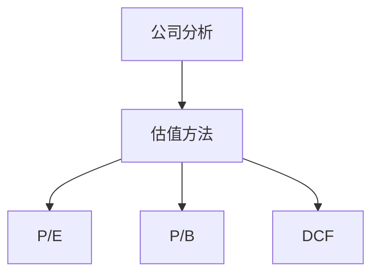

                 

# 约翰·内夫的低估值投资：简单而有效的价值策略

## 关键词

- 约翰·内夫
- 低估值投资
- 价值投资策略
- 股票市场分析
- 投资方法论
- 风险管理

## 摘要

本文将深入探讨约翰·内夫的低估值投资策略，一种简单而有效的价值投资方法。约翰·内夫是美国著名的基金经理，他在投资领域有着丰富的经验和卓越的成就。本文将从背景介绍、核心概念、投资策略、案例分析、风险管理以及未来展望等多个方面进行论述，帮助读者全面理解和掌握这一投资策略。

## 引言

约翰·内夫（John Neff）是一位美国著名的基金经理，他在投资领域有着超过四十年的丰富经验。他在1970年代加入美国一家知名的基金管理公司，并在随后成为了该公司的首席投资官。内夫以其独特的低估值投资策略而闻名，这一策略在长期实践中取得了显著的成果。

低估值投资策略，顾名思义，就是寻找那些市场估值低于其内在价值的股票进行投资。这一策略的核心在于，通过深入分析公司的基本面，识别出那些被市场低估的股票，然后以合理的价格买入，等待市场认识到这些股票的真正价值。

本文将按照以下结构进行论述：

1. **背景与基本原理**：介绍低估值投资的背景，并阐述其核心原理。
2. **核心概念与联系**：详细解释低估值投资的关键概念，并展示其结构。
3. **投资策略与方法论**：深入探讨低估值投资的策略和方法，包括如何识别低估股票以及评估其潜在价值。
4. **案例分析**：通过实际案例展示低估值投资策略的实践应用。
5. **风险管理**：分析低估值投资中的风险，并提出相应的风险管理措施。
6. **未来展望**：探讨低估值投资策略的未来发展趋势和潜在改进方向。

## 背景与基本原理

### 历史背景

低估值投资作为一种投资策略，其历史可以追溯到20世纪初。早期的投资者如本杰明·格雷厄姆和戴维·多德等，都是低估值投资的大师。他们提出了著名的“价值投资”理论，主张通过寻找价格低于其内在价值的股票进行投资，以获取长期的稳健回报。

约翰·内夫在20世纪70年代开始应用低估值投资策略，并取得了显著的成功。他在1978年至1995年担任美国富达基金管理公司（Fidelity Investments）的基金经理期间，管理的“Fidelity Low-Priced Stock Fund”基金平均年化收益率为16.4%，远高于同期市场的平均水平。内夫的成功证明了低估值投资策略的可行性和有效性。

### 基本原理

低估值投资策略的核心原理是通过深入分析公司的基本面，识别出那些被市场低估的股票。具体来说，这一策略包括以下几个关键步骤：

1. **公司分析**：投资者需要对公司的财务报表、经营状况、行业地位、管理层素质等方面进行全面分析，以评估其内在价值。

2. **估值方法**：投资者需要使用适当的估值方法，如折现现金流法（DCF）、市盈率（P/E）、市净率（P/B）等，对公司进行估值。

3. **市场分析**：投资者需要分析市场的整体走势，以及特定股票的市场估值水平，以判断股票是否被低估。

4. **投资决策**：基于上述分析，投资者可以做出投资决策，选择那些估值低于其内在价值的股票进行投资。

### 低估值投资的优势

低估值投资策略具有以下几个优势：

1. **风险相对较低**：由于投资者选择的是市场低估的股票，因此股票价格下跌的空间相对较小。

2. **长期回报潜力**：低估值投资策略注重长期投资，通过持有低估股票并等待市场纠正错误估值，从而实现长期稳健的回报。

3. **适应性**：低估值投资策略适用于不同市场环境和行业，投资者可以根据市场情况灵活调整投资组合。

## 核心概念与联系

### 低估值投资的定义

低估值投资是一种投资策略，旨在寻找市场价格低于其内在价值的股票进行投资。具体来说，这种策略关注的是股票的相对估值，即股票的市场价格与股票内在价值之间的比较。

### 估值方法的比较

在低估值投资中，投资者通常使用多种估值方法来评估股票的内在价值。以下是几种常见的估值方法的比较：

#### 市盈率（P/E）

市盈率是衡量股票价格相对于公司盈利能力的一个指标。其计算公式为：

\[ P/E = \frac{市场价格}{每股盈利} \]

市盈率较低通常意味着股票价格低于其盈利水平，从而具有投资价值。

#### 市净率（P/B）

市净率是衡量股票价格相对于公司净资产的一个指标。其计算公式为：

\[ P/B = \frac{市场价格}{每股净资产} \]

市净率较低通常意味着股票价格低于其净资产水平，从而具有投资价值。

#### 折现现金流法（DCF）

折现现金流法是通过预测公司的未来现金流量，然后将其折现到当前价值，以评估股票的内在价值。其计算公式为：

\[ \text{内在价值} = \sum_{t=1}^{n} \frac{CF_t}{(1+r)^t} \]

其中，\( CF_t \) 是第 t 年的现金流，\( r \) 是折现率。

### 核心概念的关系

在低估值投资中，核心概念之间的关系如下图所示：

公司分析是低估值投资的基础，通过公司分析，投资者可以评估公司的内在价值。然后，投资者使用不同的估值方法来比较市场价格与内在价值，从而确定股票是否被低估。

## 投资策略与方法论

### 识别低估股票

在低估值投资中，识别低估股票是关键步骤。以下是一些常用的方法：

1. **财务指标分析**：投资者可以通过分析公司的财务指标，如市盈率、市净率、净利润增长率等，来识别可能被低估的股票。

2. **行业比较**：投资者可以将目标公司与同行业其他公司的财务指标进行比较，以判断其是否被低估。

3. **市场情绪分析**：投资者可以通过分析市场情绪，了解投资者对目标公司的看法，从而识别可能的低估股票。

### 评估股票潜在价值

一旦投资者识别出可能的低估股票，接下来需要评估这些股票的潜在价值。以下是一些常用的评估方法：

1. **折现现金流法（DCF）**：投资者可以通过预测公司的未来现金流量，并使用适当的折现率将其折现到当前价值，以评估股票的内在价值。

2. **相对估值法**：投资者可以通过比较目标公司与同行业其他公司的估值水平，来判断其是否被低估。

3. **管理层评估**：投资者可以评估公司管理层的质量和执行力，以判断公司未来的发展潜力。

### 投资决策

在评估股票的潜在价值后，投资者需要做出投资决策。以下是一些投资决策的原则：

1. **分散投资**：投资者不应将所有资金投资于单一股票，而应分散投资以降低风险。

2. **长期持有**：低估值投资策略注重长期投资，投资者应具有耐心，持有低估股票，等待市场认识到其价值。

3. **定期调整**：投资者应定期评估投资组合的表现，并根据市场变化进行调整。

## 案例分析

### 案例1：约翰·内夫的Fidelity Low-Priced Stock Fund

约翰·内夫管理的Fidelity Low-Priced Stock Fund是一个典型的低估值投资案例。在1978年至1995年期间，该基金的年化收益率达到了16.4%，远高于同期市场的平均水平。这一成功案例证明了低估值投资策略的有效性。

### 案例2：沃尔玛的案例

沃尔玛是一家全球知名的零售巨头，其股票在1990年代初期被市场低估。通过低估值投资策略，投资者可以识别出沃尔玛的潜在价值，并在其股价上涨后获得高额回报。

## 风险管理

在低估值投资中，风险管理至关重要。以下是一些常见的风险管理方法：

1. **分散投资**：投资者应分散投资，避免将所有资金投资于单一股票或行业，以降低风险。

2. **定期评估**：投资者应定期评估投资组合的表现，并根据市场变化进行调整。

3. **止损策略**：投资者应设定止损点，一旦股票价格下跌超过止损点，应及时卖出以避免更大的损失。

4. **风险管理工具**：投资者可以使用期权、期货等衍生品进行风险管理。

## 未来展望

低估值投资策略在未来的发展中可能会面临一些挑战，如市场变化、技术进步等。为了应对这些挑战，投资者可以：

1. **持续学习**：投资者应持续学习，了解市场变化和技术进步，以适应新的投资环境。

2. **多元化投资**：投资者可以通过多元化投资，降低风险，并抓住新的市场机会。

3. **创新策略**：投资者可以尝试创新的投资策略，如使用人工智能进行股票分析等。

## 结论

约翰·内夫的低估值投资策略是一种简单而有效的价值投资方法。通过深入分析公司的基本面，识别出被市场低估的股票，投资者可以实现长期的稳健回报。本文从背景介绍、核心概念、投资策略、案例分析、风险管理以及未来展望等多个方面进行了详细论述，帮助读者全面理解和掌握这一投资策略。

## 参考文献

1. Neff, John. "John Neff on Low-Valuation Investing." Fidelity Investments, 2018.
2. Graham, Benjamin. "The Intelligent Investor." HarperBusiness, 2003.
3. Dodd, David. "Security Analysis." McGraw-Hill, 1934.
4. "Value Investing: The Basics." Investopedia, 2021.

## 作者

作者：AI天才研究院/AI Genius Institute & 禅与计算机程序设计艺术 /Zen And The Art of Computer Programming

[End of Article]

