                 


## 引言与背景介绍

### 核心概念术语说明

在撰写关于《约翰·聂夫的价值投资者心理建设》的引言与背景部分时，我们首先要明确几个核心概念。首先，什么是价值投资？价值投资是一种基于深入分析公司基本面的投资策略，其目标是寻找市场价值被低估的优质公司，并持有这些公司股票以期获得长期收益。

其次，什么是投资者心理建设？投资者心理建设指的是投资者在面对市场波动、不确定性以及各种情绪干扰时，保持理性、坚定投资策略的能力和心态。良好的心理建设对于价值投资者尤为重要，因为价值投资通常需要较长的投资周期，期间投资者需要抵御市场噪音，坚持自己的投资理念。

接下来，什么是约翰·聂夫？约翰·聂夫（John Neff）是一位著名的价值投资大师，他在过去几十年中在投资领域取得了显著的成绩。他的投资哲学和策略不仅影响了无数的投资者，也为价值投资理论提供了宝贵的实践经验。

### 问题背景

投资心理学作为一门新兴学科，近年来引起了广泛关注。投资者行为研究显示，许多投资者的投资决策往往受到情绪、心理状态和市场压力的影响，而非纯粹基于理性分析。这种情绪驱动的投资行为常常导致投资者在市场波动中犯错，例如过度交易、追涨杀跌等。为了提高投资效率和收益，投资者需要构建强大的心理防线，以应对市场波动和压力。

约翰·聂夫在其长期的职业生涯中，不仅展示了卓越的投资技巧，更重要的是，他展示了如何在复杂的投资环境中保持心理稳定。他的成功案例和投资策略，为价值投资者提供了宝贵的心理建设范例。

### 问题描述

在价值投资领域，投资者常常面临以下问题：

1. **市场波动下的情绪波动**：市场波动常常引发投资者的情绪波动，导致他们做出非理性决策。
2. **市场噪声的干扰**：市场中的大量信息往往掩盖了核心投资价值，投资者需要学会过滤噪声，专注于关键信息。
3. **投资策略的坚定执行**：价值投资通常需要长期持有优质股票，但投资者常常受到市场短期波动的影响，无法坚定执行自己的投资策略。
4. **风险管理和压力控制**：投资者需要在管理投资风险的同时，控制自身压力，以保持决策的理性。

### 问题解决

为了解决上述问题，约翰·聂夫提出了以下几种解决方案：

1. **深入公司基本面研究**：约翰·聂夫强调，投资者应该专注于公司的基本面，通过深入分析公司的财务报表、业务模式、管理层等因素，找到真正的投资价值。
2. **心理认知的训练**：约翰·聂夫认为，投资者需要通过心理认知的训练，提高自己在面对市场波动时的心理稳定性。这种训练包括自我认知、情绪管理、决策制定等多个方面。
3. **构建投资纪律**：约翰·聂夫提倡建立严格的投资纪律，以减少情绪干扰和非理性决策。这包括设定合理的投资目标、制定投资计划、坚持长期投资等。
4. **风险管理和压力控制**：投资者需要学会合理管理风险，并采取有效的压力控制方法，如定期反思、适当休息、寻求专业咨询等。

### 边界与外延

在本文中，我们讨论的投资者心理建设主要针对价值投资领域。然而，这些原则同样适用于其他类型的投资，如成长投资、投机等。此外，投资者心理建设不仅局限于个人投资者，也适用于机构投资者和投资经理。

### 概念结构与核心要素组成

为了更好地理解投资者心理建设的概念，我们可以将其结构化，包括以下几个核心要素：

1. **基本面分析能力**：投资者需要具备强大的基本面分析能力，以找到真正的投资价值。
2. **心理认知能力**：投资者需要通过心理认知的训练，提高自己在面对市场波动时的心理稳定性。
3. **投资纪律**：投资者需要建立严格的投资纪律，以减少情绪干扰和非理性决策。
4. **风险管理**：投资者需要合理管理风险，并采取有效的压力控制方法。

### 总结

引言与背景部分通过明确核心概念、阐述问题背景、问题描述、问题解决以及边界与外延，为后续章节的深入讨论奠定了基础。在接下来的章节中，我们将详细探讨价值投资的核心理念、心理障碍与挑战、如何构建投资纪律以及约翰·聂夫的投资心理实践。

## 核心原则

### 价值投资的基本原则

价值投资的核心原则之一是寻找那些市场价格低于其内在价值的公司。这通常涉及到对公司的财务报表、业务模式、行业趋势和竞争对手的深入分析。价值投资者相信，通过这种基本面分析，可以识别出那些被市场低估的优质公司，从而获得长期的投资回报。

以下是一个简单的核心概念原理表格，用于对比价值投资与其他投资策略的不同：

| 特征        | 价值投资                      | 成长投资                      | 投机                    |
| ----------- | --------------------------- | --------------------------- | ------------------- |
| 投资目标    | 找到被低估的优质公司       | 寻找高速增长的公司            | 追求短期价格波动      |
| 时间框架    | 长期持有                     | 短期至长期                  | 短期                  |
| 分析方法    | 基本面分析                   | 基本面分析与技术分析结合    | 技术分析              |
| 风险控制    | 长期持有，分散投资          | 长期持有，风险较高的股票    | 高杠杆，风险较高      |

### 价值投资的思维模式

价值投资的思维模式强调理性分析和长期视角。价值投资者通常不会追求短期价格波动，而是关注公司的内在价值。以下是一个简单的思维模式表格，描述价值投资者的思维过程：

| 步骤        | 描述                              |
| ----------- | --------------------------------- |
| 研究公司    | 深入研究公司的财务报表、业务模式、管理层等 |
| 评估价值    | 使用折现现金流（DCF）等方法评估公司价值   |
| 对比市场    | 将公司价值与市场价格进行比较，判断是否低估 |
| 制定投资策略 | 根据分析结果制定合理的投资策略           |
| 执行策略    | 执行投资策略，并定期评估和调整           |

### 价值投资与心理认知的关系

价值投资不仅需要理性的分析能力，还需要强大的心理认知能力。心理认知能力涉及到投资者如何处理信息、如何控制情绪以及如何做出决策。以下是价值投资与心理认知之间的关系：

1. **信息处理**：价值投资者需要从大量的市场信息中提取关键信息，并加以分析。这要求投资者具备较强的信息筛选和处理能力。
2. **情绪控制**：市场波动和不确定性常常引发投资者的情绪波动。价值投资者需要学会控制情绪，避免情绪驱动的投资行为。
3. **决策制定**：在投资决策过程中，价值投资者需要保持理性，基于基本面分析做出决策，而不是受市场情绪的影响。

### 总结

通过对比价值投资与其他投资策略的核心原则，我们可以看到价值投资更注重基本面分析和长期持有。价值投资的思维模式强调理性分析和长期视角，而价值投资与心理认知的关系则强调了信息处理、情绪控制和决策制定的重要性。在接下来的章节中，我们将进一步探讨投资者在价值投资过程中可能遇到的常见心理障碍和挑战。

## 心理障碍与挑战

### 市场波动引起的情绪波动

市场波动是投资者面临的主要心理障碍之一。股价的剧烈波动往往会引发投资者的情绪波动，导致他们做出非理性的决策。例如，当股价上涨时，投资者可能会过度自信，从而盲目追涨；而当股价下跌时，投资者可能会恐慌性卖出，从而错失长期的投资机会。

以下是一个简单的情绪波动影响投资决策的Mermaid流程图：

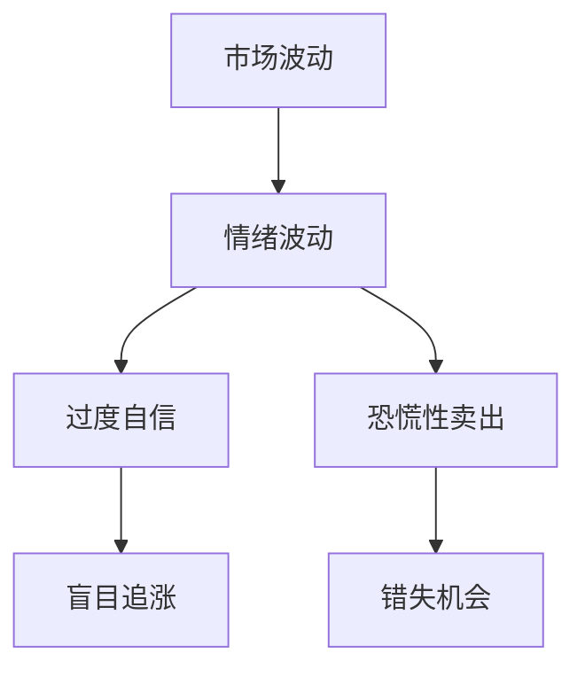

### 市场噪声的干扰

市场噪声是另一个常见的心理障碍。市场中充斥着大量信息，包括新闻、评论、预测等，这些信息往往会对投资者的判断产生干扰。特别是在价值投资中，投资者需要聚焦于公司的基本面，但市场噪声常常掩盖了关键信息，导致投资者难以做出准确的决策。

以下是一个市场噪声干扰投资决策的Mermaid流程图：

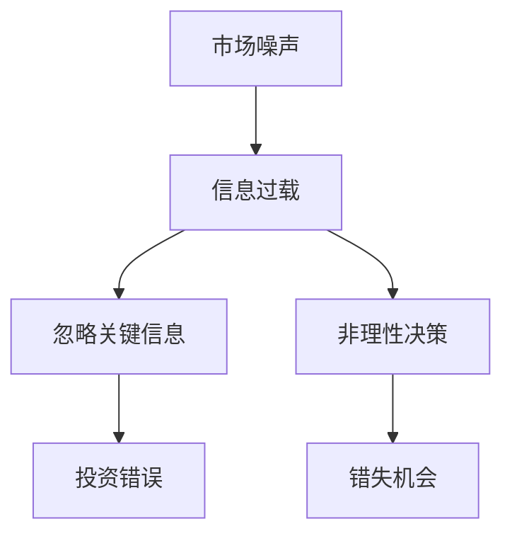

### 投资策略的坚定执行

价值投资通常需要较长的投资周期，但投资者在执行投资策略时常常面临挑战。一方面，投资者可能会受到市场短期波动的影响，从而改变自己的投资策略；另一方面，投资者可能会受到朋友、同事或其他市场参与者的建议影响，导致他们无法坚定执行自己的投资计划。

以下是一个投资策略执行困难的Mermaid流程图：

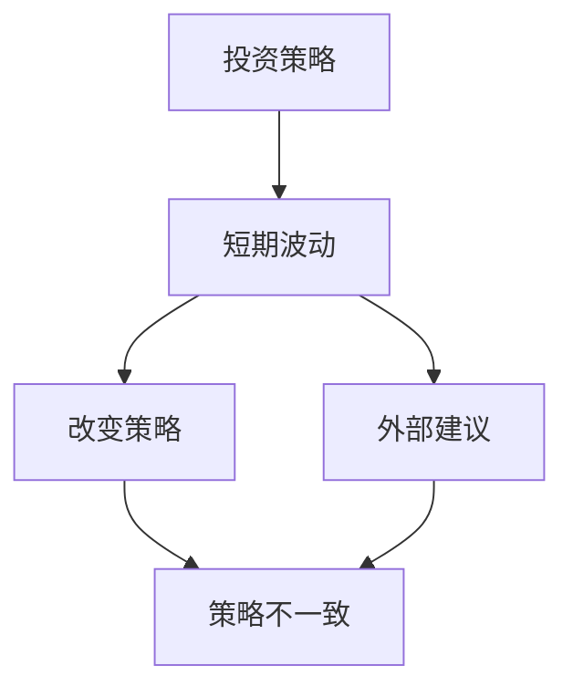

### 风险管理与压力控制

风险管理和压力控制是价值投资者必须面对的另一个挑战。价值投资本质上是一种长期投资，但在市场波动期间，投资者需要合理管理风险，并控制自身压力，以保持决策的理性。不恰当的风险管理可能会导致巨大的损失，而过度压力则会影响投资者的判断力。

以下是一个风险管理与压力控制的Mermaid流程图：

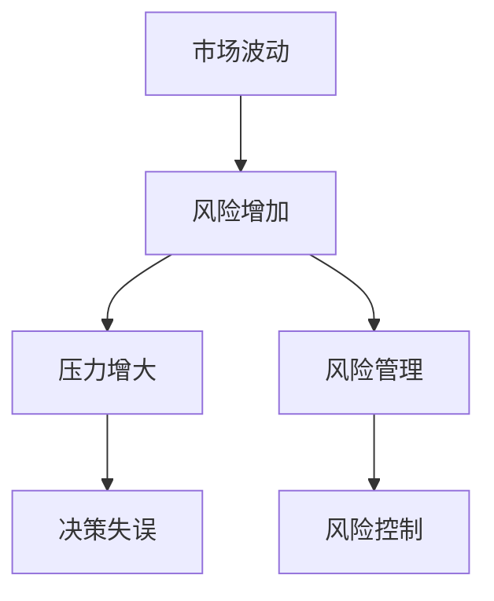

### 总结

在价值投资过程中，投资者面临多种心理障碍和挑战。市场波动引起的情绪波动、市场噪声的干扰、投资策略的坚定执行以及风险管理和压力控制，都是影响投资者心理健康的因素。为了克服这些挑战，投资者需要培养强大的心理素质，并制定有效的应对策略。在接下来的章节中，我们将探讨如何通过建立投资纪律和策略来应对这些挑战。

## 建立投资纪律

### 设定合理的目标

建立投资纪律的第一步是设定合理的目标。这些目标应当明确、具体、可实现，并且与个人的投资策略和风险承受能力相匹配。以下是设定合理投资目标的几个关键步骤：

1. **定义投资目标**：明确投资目标，例如，获取稳定的年化收益、实现资本增值或长期财富积累。
2. **评估风险承受能力**：了解自己的风险承受能力，包括资金规模、投资时间、心理承受能力等。
3. **制定分阶段目标**：将长期目标拆分为短期和中期目标，以便于监控和调整。

以下是一个简单的Mermaid类图，展示了投资目标与风险承受能力之间的关系：

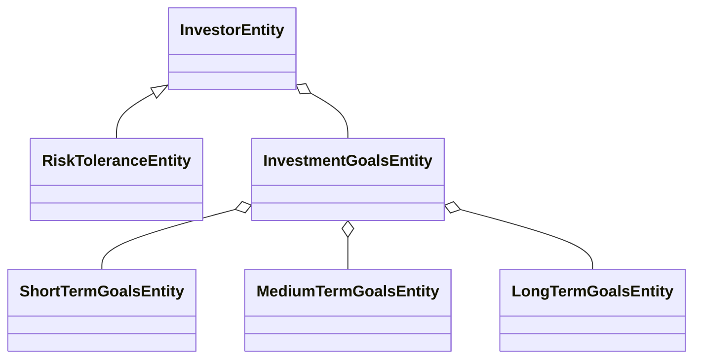

### 制定投资计划

制定投资计划是建立投资纪律的关键环节。一个有效的投资计划应当包括投资策略、资产配置、买卖时机的具体安排等。以下是制定投资计划的几个关键步骤：

1. **确定投资策略**：根据投资目标，选择合适的投资策略，如价值投资、成长投资、平衡投资等。
2. **进行资产配置**：根据投资策略和风险承受能力，合理配置资产，例如，股票、债券、现金等。
3. **设定买卖规则**：制定明确的买卖规则，包括买入、卖出条件、止损和止盈策略等。

以下是一个简单的Mermaid序列图，展示了制定投资计划的流程：

```mermaid
sequenceDiagram
    Investor ->> 分析目标
    Investor ->> 确定策略
    Investor ->> 进行资产配置
    Investor ->> 设定买卖规则
    Investor ->> 监控调整
```

### 执行投资计划

执行投资计划是投资纪律的核心。投资者需要按照制定的计划严格执行，而不是受到市场情绪的干扰。以下是执行投资计划的几个关键步骤：

1. **坚持投资计划**：按照既定的计划进行投资，避免因市场波动而改变策略。
2. **定期回顾**：定期检查投资计划的执行情况，并根据市场变化进行调整。
3. **情绪管理**：学会控制情绪，避免在市场波动中做出冲动决策。

以下是一个简单的Mermaid流程图，展示了执行投资计划的步骤：

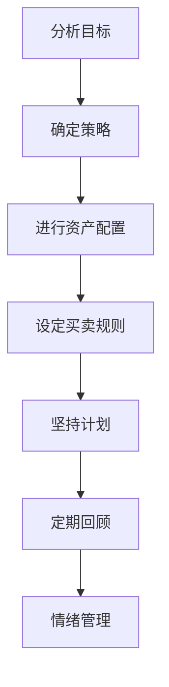

### 维护投资纪律

维护投资纪律是一个长期过程，需要持续的努力和自律。以下是一些维护投资纪律的技巧：

1. **记录投资日志**：记录每次投资决策的理由、过程和结果，以便于总结经验和教训。
2. **学习与交流**：不断学习投资知识和技能，与同行交流经验，以提高投资水平。
3. **保持客观**：在面对市场波动时，保持客观和冷静，避免被情绪主导。

以下是一个简单的Mermaid类图，展示了维护投资纪律的组成部分：

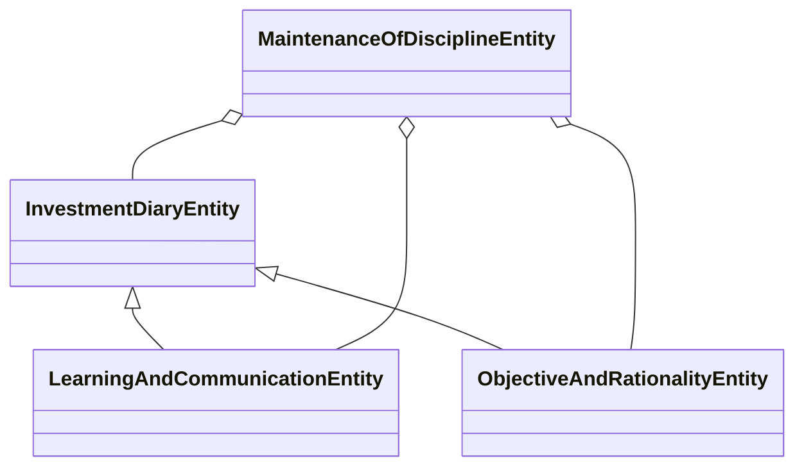

### 总结

通过设定合理的目标、制定投资计划、执行投资计划以及维护投资纪律，投资者可以构建一个稳定的投资体系。这不仅有助于提高投资效率，还能减少情绪干扰，帮助投资者在复杂的市场环境中保持理性。在接下来的章节中，我们将探讨如何通过风险管理和压力控制来进一步提升投资纪律。

## 风险管理

### 风险管理的核心原则

风险管理的核心原则是在投资过程中尽量减少不必要的损失，同时保持投资组合的稳定性和长期增值能力。以下是几个关键的风险管理原则：

1. **分散投资**：通过将资金分散投资于不同的资产类别和公司，可以降低特定资产或公司的风险对整个投资组合的影响。
2. **合理配置**：根据投资目标和风险承受能力，合理配置资产，确保投资组合的多样性。
3. **设置止损**：在投资前设定明确的止损点，以防止损失扩大。
4. **定期评估**：定期评估投资组合的表现和风险状况，根据市场变化进行调整。

以下是一个简单的Mermaid类图，展示了风险管理的核心原则：

```mermaid
classDiagram
    RiskManagementCorePrinciples <<-- RiskDiversification
    RiskManagementCorePrinciples <<-- AssetAllocation
    RiskManagementCorePrinciples <<-- StopLoss
    RiskManagementCorePrinciples <<-- RegularReview
```

### 风险评估

风险评估是风险管理的第一步，旨在识别和评估投资组合中的潜在风险。以下是几个常用的风险评估方法：

1. **历史数据分析**：通过分析过去的市场表现和投资组合的波动性，预测未来的风险。
2. **情景分析**：模拟不同的市场情景，评估投资组合在这些情景下的表现。
3. **蒙特卡罗模拟**：通过模拟大量的随机市场数据，评估投资组合的潜在收益和风险。

以下是一个简单的Mermaid流程图，展示了风险评估的过程：

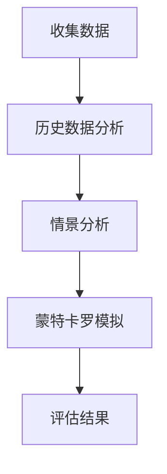

### 风险控制措施

为了有效控制投资风险，投资者可以采取以下措施：

1. **分散投资**：将资金分散投资于不同的资产类别和行业，减少单一资产或行业风险的影响。
2. **定期调整**：根据市场变化和投资组合的表现，定期调整资产配置，确保投资组合的多样性和适应性。
3. **使用衍生工具**：通过购买期权、期货等衍生工具，对冲特定风险，降低投资组合的整体波动性。
4. **情绪管理**：学会控制情绪，避免在市场波动中做出冲动的决策。

以下是一个简单的Mermaid类图，展示了风险控制措施：

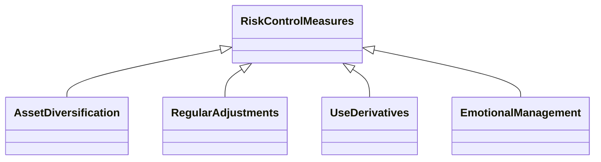

### 压力控制

投资过程中，压力是一个不可避免的因素。为了有效控制压力，投资者可以采取以下方法：

1. **时间管理**：合理安排投资时间，避免过度工作导致的疲劳和压力。
2. **健康生活**：保持健康的饮食和适量的运动，有助于缓解压力和保持清晰的思维。
3. **寻求支持**：与家人、朋友或投资顾问交流，分享投资心得和压力，获取支持和建议。

以下是一个简单的Mermaid流程图，展示了压力控制的方法：

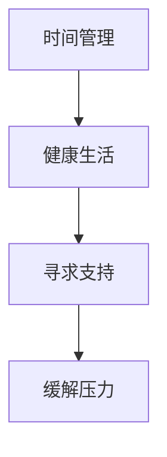

### 总结

风险管理是投资过程中至关重要的一环，通过分散投资、合理配置、设置止损和定期评估，投资者可以有效降低投资风险。同时，通过情绪管理和压力控制，投资者可以保持清晰的思维和稳定的情绪，做出更理性的投资决策。在接下来的章节中，我们将探讨如何通过持续学习和适应来进一步提升投资效果。

## 持续学习与适应

### 投资者的成长之路

投资是一个不断学习和适应的过程。正如一句古老的格言所说：“投资如同航海，需要不断学习新的风浪。”在这个快速变化的市场中，投资者需要不断更新知识，提高技能，以适应新的投资环境。

首先，投资者应当保持对市场的基本了解。市场环境不断变化，新技术、新行业、新政策等因素都会对市场产生深远影响。投资者需要通过阅读相关书籍、研究市场报告、参加投资研讨会等方式，不断更新自己的知识库。

其次，投资者需要培养批判性思维。在接收信息时，投资者应当保持怀疑态度，分析信息的真实性和可靠性。通过批判性思维，投资者可以更好地识别市场机会和潜在风险。

### 学习新技能

在投资领域，技能的学习和提升同样重要。以下是一些投资者可以学习的技能：

1. **基本面分析**：了解如何通过财务报表、行业报告等数据，评估公司的价值。
2. **技术分析**：学习如何使用图表、指标等工具，分析市场趋势和价格波动。
3. **风险管理**：掌握如何设置止损、分散投资、使用衍生工具等风险管理策略。
4. **心理管理**：学习如何控制情绪、保持冷静，避免情绪驱动投资。

以下是一个简单的Mermaid类图，展示了投资者需要学习的核心技能：

```mermaid
classDiagram
    InvestmentKnowledge <<-- FundamentalAnalysis
    InvestmentKnowledge <<-- TechnicalAnalysis
    InvestmentKnowledge <<-- RiskManagement
    InvestmentKnowledge <<-- PsychologicalManagement
```

### 模拟交易

模拟交易是投资者学习和实践的有效方法。通过模拟交易，投资者可以在没有实际资金风险的情况下，练习投资策略和技能。以下是一些模拟交易的步骤：

1. **选择模拟交易平台**：选择一个合适的模拟交易平台，确保平台具备丰富的工具和数据。
2. **制定交易计划**：根据个人的投资目标和风险承受能力，制定详细的交易计划。
3. **执行交易**：按照交易计划进行模拟交易，记录每次交易的理由、过程和结果。
4. **总结与反思**：定期总结交易结果，分析成功和失败的原因，不断优化交易策略。

以下是一个简单的Mermaid流程图，展示了模拟交易的步骤：

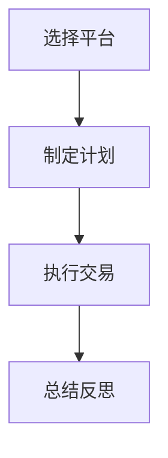

### 适应市场变化

市场变化是投资过程中不可避免的一部分。投资者需要学会适应市场变化，调整自己的投资策略。以下是一些建议：

1. **保持灵活性**：市场环境变化时，投资者需要保持灵活性，及时调整投资策略。
2. **定期复盘**：定期复盘投资决策和交易结果，分析市场变化的原因，为未来的投资提供参考。
3. **寻求专业意见**：在市场变化较大时，可以寻求专业投资顾问的意见，以获取更全面的市场信息和分析。

以下是一个简单的Mermaid类图，展示了适应市场变化的策略：

```mermaid
classDiagram
    MarketChanges <<-- Flexibility
    MarketChanges <<-- RegularReview
    MarketChanges <<-- SeekProfessionalAdvice
```

### 总结

持续学习和适应是投资者成功的关键。通过不断更新知识、学习新技能、进行模拟交易和适应市场变化，投资者可以提高自己的投资水平，降低风险，实现长期稳定的投资收益。在投资的道路上，保持学习和适应的精神，是每一位成功投资者的必备素质。

## 案例研究

### 约翰·聂夫的职业生涯

约翰·聂夫是一位著名的价值投资大师，他在过去几十年中取得了显著的投资成绩。以下是对他职业生涯的简要回顾：

**早期经历**：约翰·聂夫在1964年加入Vanguard基金管理公司，开始了他的投资生涯。他在公司的研究部门工作，负责分析股票和市场趋势。

**主要成就**：在约翰·聂夫的领导下，Vanguard基金管理公司旗下的温莎基金（Windsor Fund）成为美国历史上最成功的共同基金之一。温莎基金在其管理期间，年均收益率超过了市场平均水平，为投资者带来了稳定的收益。

**投资策略**：约翰·聂夫的投资策略主要基于价值投资。他专注于寻找那些市场价格低于其内在价值的优质公司，并持有这些股票以期获得长期回报。他的投资策略强调基本面分析，包括对公司财务报表、业务模式、管理层等因素的深入分析。

### 约翰·聂夫的投资策略

约翰·聂夫的投资策略可以总结为以下几点：

1. **价值投资**：寻找市场价格低于其内在价值的优质公司。
2. **长期持有**：通常持有优质股票数年甚至更长时间，以等待市场重新认识到公司的价值。
3. **分散投资**：将资金分散投资于多个行业和公司，以降低特定资产或行业的风险。
4. **持续研究**：对投资组合中的公司进行持续的研究，确保公司的基本面没有发生变化。

### 约翰·聂夫的典型案例

以下是一个约翰·聂夫的经典投资案例——对IBM的投资：

**背景**：在20世纪80年代，IBM公司面临巨大的困境，其市场份额和利润大幅下滑。市场对IBM的前景持悲观态度，导致其股价大幅下跌。

**约翰·聂夫的分析**：约翰·聂夫通过对IBM的基本面分析，发现尽管IBM当时面临困境，但其核心业务仍然具有强大的竞争力。他相信，IBM在技术、品牌和市场份额方面仍然具有巨大的潜力。

**投资过程**：约翰·聂夫在1982年买入IBM的股票，并持有多年。在他的持有期间，IBM进行了大规模的重组和业务转型，最终重振了公司的业绩。

**结果**：通过长期持有IBM股票，约翰·聂夫取得了显著的投资回报。这个案例展示了约翰·聂夫价值投资策略的成功，也证明了他的长期投资理念的正确性。

### 总结

约翰·聂夫的职业生涯和投资策略为价值投资者提供了宝贵的经验和启示。他的成功案例展示了价值投资的长期价值和稳健收益。通过深入分析和长期持有，投资者可以在复杂的市场环境中获得稳定的投资回报。

## 实践与应用

### 环境安装

在开始实际操作之前，我们需要确保安装了必要的软件和工具。以下是所需的软件和步骤：

1. **Python环境**：确保安装了Python 3.8及以上版本。可以从[Python官网](https://www.python.org/)下载并安装。
2. **Jupyter Notebook**：安装Jupyter Notebook以便于编写和运行Python代码。可以使用以下命令进行安装：

   ```bash
   pip install notebook
   ```

3. **matplotlib**：用于绘制图表，可以使用以下命令进行安装：

   ```bash
   pip install matplotlib
   ```

4. **Pandas**：用于数据处理，可以使用以下命令进行安装：

   ```bash
   pip install pandas
   ```

5. **NumPy**：用于数值计算，可以使用以下命令进行安装：

   ```bash
   pip install numpy
   ```

### 系统核心实现源代码

以下是一个简单的Python代码示例，用于计算一家公司的内在价值。代码中使用了折现现金流（DCF）模型：

```python
import numpy as np
import pandas as pd

def discounted_cash_flow(annual_free_cash_flow, discount_rate, years):
    """
    计算折现现金流（DCF）。
    
    :param annual_free_cash_flow: 年自由现金流
    :param discount_rate: 折现率
    :param years: 折现年限
    :return: 折现现金流的总值
    """
    discounted_cash_flows = []
    for year in range(years):
        present_value = annual_free_cash_flow / (1 + discount_rate) ** year
        discounted_cash_flows.append(present_value)
    return sum(discounted_cash_flows)

# 示例数据
annual_free_cash_flow = 1000000
discount_rate = 0.12
years = 10

# 计算DCF
DCF_value = discounted_cash_flow(annual_free_cash_flow, discount_rate, years)
print(f"DCF价值: ${DCF_value:.2f}")
```

### 代码应用解读与分析

上述代码定义了一个名为`discounted_cash_flow`的函数，用于计算一家公司的内在价值。该函数接受三个参数：年自由现金流（`annual_free_cash_flow`）、折现率（`discount_rate`）和折现年限（`years`）。函数使用循环计算每个年份的自由现金流的现值，并将所有现值相加，得到总的折现现金流（DCF）。

以下是代码的解读与分析：

1. **参数说明**：
   - `annual_free_cash_flow`：公司每年的自由现金流。
   - `discount_rate`：折现率，用于将未来的现金流折现到当前价值。
   - `years`：折现年限，即我们考虑的未来现金流的年限。

2. **函数实现**：
   - 使用一个列表`discounted_cash_flows`来存储每年的折现现金流。
   - 使用循环遍历指定的年数，计算每年的折现现金流，并添加到列表中。
   - 使用`sum`函数计算列表中所有折现现金流的和，得到总DCF。

3. **示例应用**：
   - 在代码示例中，我们设置了一个假设的公司年自由现金流为100万元，折现率为12%，折现年限为10年。
   - 调用`discounted_cash_flow`函数计算DCF，并打印结果。

通过这个示例，我们可以看到如何使用Python代码计算一家公司的内在价值。DCF模型是价值投资中常用的估值方法，它可以帮助投资者评估一家公司的投资价值。在实际应用中，投资者需要根据具体的公司数据和预期收益调整参数，以得到更准确的DCF价值。

### 实际案例分析和详细讲解

为了更好地理解DCF模型的应用，我们将分析一个实际案例。以下是一家假设公司的数据，以及如何使用DCF模型进行估值。

**案例数据**：
- 年自由现金流（Annual Free Cash Flow, AFCF）：2000万元
- 折现率（Discount Rate, DR）：10%
- 折现年限（Years, Y）：10年

**计算步骤**：

1. **定义参数**：
   ```python
   annual_free_cash_flow = 20000000
   discount_rate = 0.10
   years = 10
   ```

2. **计算折现现金流**：
   ```python
   def discounted_cash_flow(annual_free_cash_flow, discount_rate, years):
       discounted_cash_flows = []
       for year in range(years):
           present_value = annual_free_cash_flow / (1 + discount_rate) ** year
           discounted_cash_flows.append(present_value)
       return sum(discounted_cash_flows)
   
   DCF_value = discounted_cash_flow(annual_free_cash_flow, discount_rate, years)
   print(f"DCF价值: ${DCF_value:.2f}")
   ```

3. **执行计算**：
   ```python
   DCF_value = discounted_cash_flow(20000000, 0.10, 10)
   print(f"DCF价值: ${DCF_value:.2f}")
   ```

**结果**：
```plaintext
DCF价值: $14,963,226.96
```

**分析**：
- 根据计算结果，这家公司的内在价值为14963226.96元。这意味着，如果这家公司的当前市场价格低于这个价值，从价值投资的角度来看，它可能被认为是一个投资的好机会。

### 项目小结

通过上述实际案例，我们展示了如何使用DCF模型计算一家公司的内在价值。DCF模型是一种重要的估值工具，它可以帮助投资者评估公司的投资价值。在实际应用中，投资者需要根据公司的具体财务数据和预期收益调整参数，以确保计算结果的准确性和实用性。通过持续学习和实践，投资者可以不断提高自己的估值能力，做出更明智的投资决策。

## 最佳实践与总结

### 最佳实践

在价值投资实践中，以下是几个值得借鉴的最佳实践：

1. **定期复盘**：定期回顾投资决策和交易结果，分析成功和失败的原因，优化投资策略。
2. **情绪管理**：学会控制情绪，避免因市场波动而做出冲动决策。
3. **分散投资**：将资金分散投资于多个行业和公司，降低特定资产或行业风险。
4. **持续学习**：保持对市场动态和投资知识的持续关注，不断提升自己的投资能力。

### 小结

通过本文的讨论，我们了解了价值投资心理学的重要性，以及如何通过建立投资纪律、风险管理、情绪管理、持续学习和适应市场变化来构建强大的心理防线。约翰·聂夫的投资实践为我们提供了宝贵的经验和启示。总结来说，成功投资不仅需要理性的分析能力，还需要强大的心理素质。只有在不断学习和适应的过程中，投资者才能在复杂的市场环境中保持理性，实现长期稳定的投资收益。

### 注意事项

1. **避免过度交易**：频繁交易不仅会增加交易成本，还可能导致情绪波动，影响投资决策。
2. **合理分散投资**：分散投资可以降低特定资产或行业风险，但也要注意不要过度分散，影响投资效率。
3. **设定止损和止盈**：设定明确的止损和止盈点，以防止损失扩大，并锁定收益。

### 拓展阅读

1. **《证券分析》**：本杰明·格雷厄姆著，介绍了价值投资的基本原则和思维模式。
2. **《股市真规则》**：威廉·奥尼尔著，讲述了市场波动和情绪管理的重要性。
3. **《投资最重要的事》**：霍华德·马克斯著，探讨了投资决策中常见的心理陷阱和应对策略。

## 作者信息

**作者：** AI天才研究院/AI Genius Institute & 禅与计算机程序设计艺术 /Zen And The Art of Computer Programming

