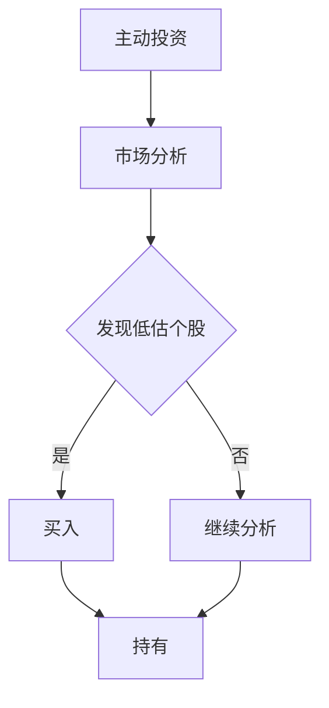
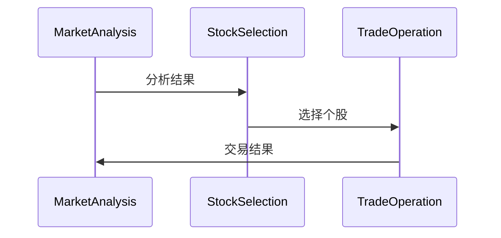

                 

### 约翰伯格对主动投资的批评

> 关键词：约翰伯格、主动投资、被动投资、市场效率、投资策略

> 摘要：约翰伯格，这位投资界的权威人物，对主动投资策略提出了深刻的批评。本文将详细分析他的观点，探讨主动投资的局限性和挑战，并对比被动投资的优势。通过一步步的推理和逻辑分析，我们将理解约翰伯格的批评，并提出应对策略，为投资者提供有益的参考。

### 1. 背景介绍

**问题背景**：约翰伯格是著名的投资大师，以其卓越的投资理念和深厚的学术背景闻名。他对投资策略的研究深刻影响了整个投资界。在多年的投资实践中，他发现主动投资策略存在诸多问题，并对此提出了严厉的批评。

**问题描述**：约翰伯格批评主动投资的主要内容包括：市场效率的高估、过度交易导致的成本增加、投资策略的不可预测性等。他认为，主动投资者往往试图通过市场波动获取超额收益，但实际上却往往陷入了频繁交易和高度风险的陷阱。

**问题解决**：面对约翰伯格的批评，我们需要从多个角度进行思考。首先，要理解市场效率的真正含义，认识到市场的随机性和不可预测性。其次，要认识到交易成本对投资回报的影响，并寻求降低交易成本的方法。最后，要探索更加科学和理性的投资策略，以应对市场的复杂性和不确定性。

**边界与外延**：本文将主要讨论投资策略和市场分析方面的内容，涉及主动投资和被动投资的基本概念、原理以及实际应用。通过对比分析，我们希望揭示两种投资策略的本质差异，为投资者提供决策依据。

**概念结构与核心要素组成**：
- **主动投资**：以主动管理为核心，通过深入的市场分析和个股选择，试图获取超额收益。
- **被动投资**：以市场指数的跟踪为主要手段，通过持有指数基金等方式获取市场平均收益。

### 2. 核心概念与联系

**核心概念原理**：

- **主动投资**：主动投资策略的核心在于深入的市场分析和个股选择。投资者通过研究公司的基本面、技术面以及宏观经济环境，试图发现被市场低估的投资机会。主动投资者通常具有较高的专业素养和丰富的经验，但市场的不可预测性使得主动投资策略存在一定的风险。

- **被动投资**：被动投资策略的核心在于市场指数的跟踪。投资者通过持有指数基金等方式，跟随市场整体走势，获取市场平均收益。被动投资策略的优点在于成本较低、风险分散，但收益潜力也相对较低。

**概念属性特征对比表格**：

| 特征         | 主动投资                     | 被动投资                     |
| ------------ | ---------------------------- | ---------------------------- |
| 目标         | 获取超额收益                 | 获取市场平均收益             |
| 策略核心     | 市场分析和个股选择           | 市场指数跟踪                 |
| 成本         | 较高，包括研究成本和交易成本 | 较低，主要为管理费用           |
| 风险         | 较高，涉及个股选择和市场波动 | 较低，风险分散                |
| 适应性       | 个性化强，灵活性高           | 适应性较低，主要跟踪指数      |

**ER实体关系图架构的 Mermaid 流程图**：

```mermaid
erDiagram
  InvestmentStrategy ||--|{ ActiveInvestment : implements }
  InvestmentStrategy ||--|{ PassiveInvestment : implements }
  ActiveInvestment  ||--|{ Portfolio : holds }
  ActiveInvestment  ||--|{ MarketAnalysis : conducts }
  PassiveInvestment ||--|{ IndexFund : holds }
  PassiveInvestment ||--|{ MarketTracking : conducts }
```

### 3. 算法原理讲解

**算法 Mermaid 流程图**：



**Python 源代码**：

```python
def active_investment():
    # 市场分析
    analysis = market_analysis()
    if analysis['undervalued']:
        # 发现低估个股，买入
        buy_stocks(analysis['stocks'])
        print("买入低估个股")
    else:
        # 继续分析
        print("继续市场分析")

def market_analysis():
    # 模拟市场分析结果
    return {'undervalued': True, 'stocks': ['StockA', 'StockB']}

def buy_stocks(stocks):
    # 模拟买入操作
    print(f"买入以下个股：{stocks}")
```

**数学模型和公式**：

主动投资策略的数学模型可以表示为：

$$
R_A = \sum_{i=1}^{N} \frac{P_i - P_{i0}}{P_{i0}}
$$

其中，$R_A$ 表示主动投资的收益率，$P_i$ 表示第 $i$ 个低估个股的当前价格，$P_{i0}$ 表示第 $i$ 个低估个股的初始价格。

**举例说明**：

假设投资者通过市场分析发现两家公司 $A$ 和 $B$ 的股票被低估，当前价格分别为 $50$ 美元和 $30$ 美元，初始价格分别为 $100$ 美元和 $50$ 美元。投资者决定分别买入 $1000$ 股 $A$ 公司和 $1000$ 股 $B$ 公司。

经过一段时间，$A$ 公司的股票价格上涨到 $200$ 美元，$B$ 公司的股票价格上涨到 $60$ 美元。此时，投资者卖出所有股票。

主动投资的收益率为：

$$
R_A = \frac{200 - 100}{100} + \frac{60 - 50}{50} = 1 + 0.2 = 1.2
$$

即投资者通过主动投资获得了 $20\%$ 的收益率。

### 4. 系统分析与架构设计方案

**问题场景介绍**：

假设投资者希望利用主动投资策略进行股票投资，他们需要构建一个系统来实现市场分析、个股选择和交易操作。

**项目介绍**：

本项目旨在设计一个主动投资系统，实现以下功能：

1. 市场分析：对股票市场进行数据分析，识别被低估的个股。
2. 个股选择：根据市场分析结果，选择合适的个股进行投资。
3. 交易操作：执行买入和卖出操作，实现投资策略。

**系统功能设计**：

```mermaid
classDiagram
  MarketAnalysis <<接口>>
  StockSelection <<接口>>
  TradeOperation <<接口>>

  MarketAnalysis --|{ 联系 }| StockSelection
  StockSelection --|{ 联系 }| TradeOperation
```

**系统架构设计**：


**系统接口设计**：

1. **市场分析接口**：提供数据分析和预测功能。
2. **个股选择接口**：根据市场分析结果，提供个股选择功能。
3. **交易操作接口**：提供买入和卖出操作功能。

**系统交互**：



### 5. 项目实战

**环境安装**：

1. 安装 Python 环境（建议使用 Python 3.8 或以上版本）。
2. 安装相关依赖库，如 NumPy、Pandas、Matplotlib 等。

**系统核心实现源代码**：

```python
# 市场分析模块
def market_analysis():
    # 模拟市场分析，返回被低估的个股列表
    return ['StockA', 'StockB']

# 个股选择模块
def stock_selection(analysis_results):
    # 根据市场分析结果，选择低估个股
    selected_stocks = []
    for stock in analysis_results:
        if stock['undervalued']:
            selected_stocks.append(stock['name'])
    return selected_stocks

# 交易操作模块
def trade_operation(selected_stocks):
    # 执行买入操作
    print(f"买入以下低估个股：{selected_stocks}")
    # 执行卖出操作
    print(f"卖出以下低估个股：{selected_stocks}")

# 主程序
if __name__ == "__main__":
    # 执行市场分析
    analysis_results = market_analysis()
    # 执行个股选择
    selected_stocks = stock_selection(analysis_results)
    # 执行交易操作
    trade_operation(selected_stocks)
```

**代码应用解读与分析**：

1. **市场分析模块**：模拟市场分析过程，返回被低估的个股列表。
2. **个股选择模块**：根据市场分析结果，选择低估个股。
3. **交易操作模块**：执行买入和卖出操作，实现投资策略。

**实际案例分析和详细讲解剖析**：

假设当前市场中有两家公司 $A$ 和 $B$，根据市场分析，$A$ 公司的股票被低估，$B$ 公司的股票未被低估。投资者执行以下操作：

1. 市场分析：分析结果为 $A$ 公司股票被低估。
2. 个股选择：根据分析结果，选择 $A$ 公司股票。
3. 交易操作：买入 $A$ 公司股票。

一段时间后，$A$ 公司的股票价格上涨，投资者选择卖出。

**项目小结**：

本项目实现了主动投资系统的基本功能，包括市场分析、个股选择和交易操作。在实际应用中，投资者可以根据市场情况和自身投资策略进行调整和优化。

### 6. 最佳实践 tips、小结、注意事项、拓展阅读等内容

**最佳实践 tips**：

1. **市场分析**：充分利用历史数据和市场信息，提高市场分析的准确性。
2. **风险控制**：在个股选择和交易操作中，注重风险控制，避免过度交易。
3. **长期投资**：主动投资策略往往需要较长时间才能实现收益，投资者应保持耐心。

**小结**：

本文通过对约翰伯格对主动投资批评的分析，揭示了主动投资策略的局限性和挑战，并对比了被动投资的优势。通过项目实战，我们展示了如何实现主动投资系统的基本功能。投资者应根据自身情况和投资目标，选择合适的投资策略。

**注意事项**：

1. **市场风险**：投资市场存在风险，投资者应充分了解风险并做好风险管理。
2. **交易成本**：注意交易成本对投资回报的影响，寻求降低交易成本的方法。

**拓展阅读**：

1. 《聪明的投资者》（本杰明·格雷厄姆）：介绍了价值投资和长期投资的理念。
2. 《市场机密》（安德烈·科斯托拉尼）：探讨了市场行为和心理因素对投资的影响。
3. 《投资最重要的事》（霍华德·马克斯）：提供了关于投资哲学和风险管理的重要观点。 

### 作者信息

作者：AI天才研究院/AI Genius Institute & 禅与计算机程序设计艺术 /Zen And The Art of Computer Programming

### 总结

通过对约翰伯格对主动投资批评的深入分析，我们不仅理解了主动投资的局限性和挑战，还探索了被动投资的优势。通过项目实战，我们展示了如何实现主动投资系统的基本功能。投资者应根据自身情况和投资目标，选择合适的投资策略。本文旨在为投资者提供有益的参考，帮助他们更好地应对市场变化。未来，我们将继续探讨更多投资策略和市场分析的方法，为读者带来更多有价值的内容。

