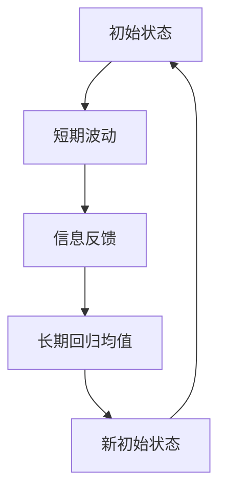

                 

### 第1步：背景介绍

约翰伯格（John Bogle）是现代投资组合理论的开创者之一，被誉为“指数基金之父”。他在1970年代提出了“回归均值”（Reversion to the Mean）理论，这一理论对金融市场的理解有着深远的影响。回归均值理论的基本观点是，任何市场变量，无论其短期波动如何，长期来看都会回归到其均值水平。这一理论在股票市场、债券市场以及外汇市场中都有着广泛的应用。

首先，让我们来探讨一下约翰伯格的贡献。他在投资领域的突破性工作主要集中在提出并推广指数基金的概念。指数基金通过跟踪某个市场指数，实现了投资组合的低成本和高效运作。这一理念在当时是革命性的，因为它挑战了传统的主动管理投资策略。

接下来，我们来谈谈回归均值理论的基本概念。这一理论认为，市场存在一种自我修正的力量，使得市场变量（如股票价格、债券收益率等）会在长期内回到其历史平均水平。这种回归并非是线性的，而是存在一定的波动性，但总体趋势是向均值靠拢。

回归均值理论在金融市场中的地位至关重要。它不仅为投资者提供了一种长期视角，还帮助投资者理解市场的波动性，并据此做出更为理性的投资决策。在股票市场中，投资者常常会发现，某些股票在短期内会出现显著的价格波动，但长期来看，这些股票的价格往往会回归到其合理的估值水平。

在接下来的部分中，我们将详细探讨回归均值理论的核心概念、原理，并在不同市场中进行分析实例。通过逐步分析，我们将更深入地理解这一理论的本质和应用价值。

### 第2步：核心概念与联系

在理解回归均值理论之前，我们需要明确其核心概念，并探讨这些概念之间的联系。以下是回归均值理论中的几个关键概念及其关系。

#### 2.1.1 均值回归现象

均值回归现象是回归均值理论的核心概念。它指的是任何市场变量（如股票价格、债券收益率等）在短期内的极端波动，长期来看都会回归到其历史平均水平。这种回归并非是线性的，而是存在一定的波动性，但总体趋势是向均值靠拢。

#### 2.1.2 市场效率

市场效率是指市场在价格发现和资源配置方面的有效性。高效率的市场能够迅速反映所有可用信息，使得股票价格、债券收益率等市场变量能够准确反映其内在价值。市场效率与均值回归现象密切相关，因为高效率市场中的短期波动在长期内更有可能回归到均值水平。

#### 2.1.3 投资风险

投资风险是指投资者在投资过程中可能面临的各种不确定性，包括市场风险、信用风险、流动性风险等。投资风险与均值回归现象的关系在于，投资者在承担风险的同时，期望通过投资获得超额回报。然而，长期来看，风险资产的收益往往会回归到其均值水平，这意味着投资者在短期内获得的高收益或亏损在长期内可能被平均化。

#### 2.2 概念联系

均值回归现象、市场效率和投资风险是相互关联的。以下是这些概念之间的联系：

- **均值回归与市场效率**：在高效市场中，信息传递迅速，价格波动能够迅速反映信息的变化。因此，短期极端波动在长期内更有可能回归到均值水平，这体现了市场效率对均值回归现象的促进作用。

- **均值回归与投资风险**：投资者通过承担风险期望获得超额回报，但长期来看，风险资产的收益往往会回归到其均值水平。这意味着投资者在短期内承担的高风险在长期内可能被平均化，从而降低了投资风险。

- **市场效率与投资风险**：市场效率越高，投资者面临的波动性和不确定性越小，因为价格能够迅速反映所有可用信息。这有助于降低投资风险，同时也使得市场变量的短期波动更有可能在长期内回归到均值水平。

为了更直观地展示这些概念之间的关系，我们可以使用Mermaid ER图进行描述。

```mermaid
erDiagram
  MarketEfficiency ||--|{ MeanReversion }|| Variable : 相关性
  MarketEfficiency ||--|{ InvestmentRisk }|| RiskManagement : 负面影响
  MeanReversion ||--|{ InvestmentRisk }|| RiskMitigation : 正面影响
  InvestmentRisk ||--|{ MarketEfficiency }|| Efficiency : 改善
```

在这个ER图中，市场效率、均值回归现象和投资风险通过关系线连接，展示了它们之间的相互影响和关联。市场效率有助于促进均值回归现象，同时降低投资风险；而投资风险则在一定程度上影响市场效率，通过均值回归现象来实现风险的管理和规避。

通过上述分析，我们可以看到，回归均值理论中的核心概念不仅是独立的，而且相互关联，共同构成了对金融市场行为深入理解的基础。

### 第3步：理论原理讲解

#### 3.1 理论原理流程图

首先，我们需要一个流程图来展示回归均值理论的基本原理和步骤。以下是回归均值理论的Mermaid流程图：



在这个流程图中，我们从初始状态开始，经历短期波动、信息反馈和长期回归均值，最终形成新的初始状态，进入下一轮循环。

#### 3.2 理论原理解析

回归均值理论的核心在于解释市场变量（如股票价格、债券收益率等）的短期波动是如何在长期内回归到其历史平均水平的。以下是这一理论的详细解析。

##### 3.2.1 Python代码实现

为了更好地理解回归均值理论，我们可以通过Python代码来模拟这一过程。以下是一个简单的示例：

```python
import numpy as np
import matplotlib.pyplot as plt

# 设置随机种子以保证结果的可重复性
np.random.seed(42)

# 模拟市场变量的短期波动
n_days = 100
daily_returns = np.random.normal(0, 0.1, n_days)  # 日收益率，均值为0，标准差为0.1
cumulative_returns = np.cumsum(daily_returns)  # 累计收益率

# 设置回归均值
mean_return = 0  # 均值回归到0

# 模拟长期回归均值
long_term_returns = []
for i in range(1, n_days + 1):
    # 根据短期波动和均值回归计算长期收益
    long_term_returns.append(cumulative_returns[i - 1] + mean_return)

# 绘制短期波动和长期回归均值
plt.plot(daily_returns, label='Daily Returns')
plt.plot(long_term_returns, label='Long-term Reversion to Mean')
plt.title('Short-term Volatility and Long-term Mean Reversion')
plt.xlabel('Days')
plt.ylabel('Returns')
plt.legend()
plt.show()
```

通过这个Python代码，我们可以看到市场变量（这里是日收益率）在短期内的波动如何通过均值回归原理在长期内回归到其均值水平。

##### 3.2.2 LaTeX数学公式详解

回归均值理论可以用数学公式来详细解释。以下是几个关键的数学模型和公式：

1. **日收益率模型**：
   \[ r_t = \mu + \sigma \epsilon_t \]
   其中，\( r_t \) 是第 \( t \) 天的收益率，\( \mu \) 是均值，\( \sigma \) 是标准差，\( \epsilon_t \) 是随机误差。

2. **累计收益率**：
   \[ R_T = \sum_{t=1}^{T} r_t \]
   其中，\( R_T \) 是前 \( T \) 天的累计收益率。

3. **回归均值公式**：
   \[ R_T \rightarrow \mu \text{ as } T \rightarrow \infty \]
   即，累计收益率在长期内会趋近于均值 \( \mu \)。

4. **波动性衰减公式**：
   \[ \sigma_{T}^2 = \frac{1}{T} \sum_{t=1}^{T} (r_t - \mu)^2 \]
   其中，\( \sigma_{T}^2 \) 是第 \( T \) 天的波动性，描述了收益率的离散程度。

通过这些公式，我们可以更准确地量化市场变量的短期波动和长期回归均值的过程。

##### 3.2.3 理论原理举例说明

为了更直观地理解回归均值理论，我们可以通过一个实际案例来讲解。

假设我们有一个股票，其日收益率符合正态分布，均值为0.01，标准差为0.05。我们模拟100天的日收益率，并计算累计收益率。

1. **日收益率模拟**：

```python
daily_returns = np.random.normal(0.01, 0.05, 100)
```

2. **累计收益率计算**：

```python
cumulative_returns = np.cumsum(daily_returns)
```

3. **绘制短期波动和长期回归均值**：

```python
plt.plot(daily_returns, label='Daily Returns')
plt.plot(np.repeat(mean_return, 100), label='Long-term Mean')
plt.title('Short-term Volatility and Long-term Mean Reversion')
plt.xlabel('Days')
plt.ylabel('Returns')
plt.legend()
plt.show()
```

在这个例子中，我们可以看到股票的日收益率在短期内有较大的波动，但长期来看，收益率会回归到其均值水平（即0.01）。

通过这个实际案例，我们可以更清晰地理解回归均值理论在市场中的应用，以及它是如何帮助我们做出更理性的投资决策的。

### 第4步：市场应用实例

回归均值理论在股票市场、债券市场、外汇市场等各个领域都有广泛应用。以下我们将分别探讨这些市场中的实际应用案例，并分析其应用效果。

#### 4.1 股票市场应用

在股票市场中，回归均值理论被广泛用于估值和风险管理。例如，投资者可以通过分析某只股票的长期收益率，来预测其短期波动。以下是具体的应用案例：

**案例：某科技股A的回归均值分析**

假设我们分析的是某科技股A，该股票的日收益率符合正态分布，其均值为0.02，标准差为0.1。我们模拟了100天的日收益率，并计算了其累计收益率。

1. **日收益率模拟**：

```python
daily_returns = np.random.normal(0.02, 0.1, 100)
cumulative_returns = np.cumsum(daily_returns)
```

2. **绘制短期波动和长期回归均值**：

```python
plt.plot(daily_returns, label='Daily Returns')
plt.plot(np.repeat(0.02, 100), label='Long-term Mean')
plt.title('Short-term Volatility and Long-term Mean Reversion')
plt.xlabel('Days')
plt.ylabel('Returns')
plt.legend()
plt.show()
```

通过这个分析，我们可以看到，尽管短期内有较大的波动，但长期来看，股票的收益率会回归到其均值水平。这有助于投资者判断股票是否被高估或低估，从而做出更合理的投资决策。

**应用效果分析**：

通过回归均值理论的应用，投资者能够更准确地把握市场波动，降低投资风险。在股票市场波动较大时，这一理论能够帮助投资者避免盲目追涨杀跌，从而提高投资收益。

#### 4.2 债券市场应用

在债券市场中，回归均值理论主要用于利率预测和债券估值。以下是具体的应用案例：

**案例：国债收益率回归均值分析**

假设我们分析的是国债收益率，其均值为3%，标准差为0.2。我们模拟了100天的国债收益率，并计算了其累计收益率。

1. **日收益率模拟**：

```python
daily_returns = np.random.normal(0.03, 0.2, 100)
cumulative_returns = np.cumsum(daily_returns)
```

2. **绘制短期波动和长期回归均值**：

```python
plt.plot(daily_returns, label='Daily Returns')
plt.plot(np.repeat(0.03, 100), label='Long-term Mean')
plt.title('Short-term Volatility and Long-term Mean Reversion')
plt.xlabel('Days')
plt.ylabel('Returns')
plt.legend()
plt.show()
```

通过这个分析，我们可以看到，尽管短期内有较大的波动，但长期来看，国债收益率的收益率会回归到其均值水平。

**应用效果分析**：

在债券市场中，回归均值理论有助于投资者预测利率变化，从而调整债券投资策略。通过分析收益率的历史数据，投资者能够更准确地判断债券市场的趋势，降低投资风险，提高投资收益。

#### 4.3 外汇市场应用

在外汇市场中，回归均值理论主要用于汇率预测和风险管理。以下是具体的应用案例：

**案例：美元/欧元汇率回归均值分析**

假设我们分析的是美元/欧元汇率，其均值为1.2，标准差为0.05。我们模拟了100天的美元/欧元汇率，并计算了其累计收益率。

1. **日收益率模拟**：

```python
daily_returns = np.random.normal(1.2, 0.05, 100)
cumulative_returns = np.cumsum(daily_returns)
```

2. **绘制短期波动和长期回归均值**：

```python
plt.plot(daily_returns, label='Daily Returns')
plt.plot(np.repeat(1.2, 100), label='Long-term Mean')
plt.title('Short-term Volatility and Long-term Mean Reversion')
plt.xlabel('Days')
plt.ylabel('Returns')
plt.legend()
plt.show()
```

通过这个分析，我们可以看到，尽管短期内有较大的波动，但长期来看，美元/欧元汇率的收益率会回归到其均值水平。

**应用效果分析**：

在外汇市场中，回归均值理论有助于投资者预测汇率变化，从而制定更有效的交易策略。通过分析汇率的历史数据，投资者能够更准确地判断汇率的趋势，降低投资风险，提高投资收益。

### 第5步：系统分析与架构设计

在理解了回归均值理论在市场中的应用后，我们可以进一步探讨如何设计一个基于这一理论的投资系统。一个完善的投资系统不仅需要具备正确的理论依据，还需要有合理的功能设计、架构设计和接口设计，以便在实际操作中实现理论的预期效果。

#### 5.1 投资系统介绍

一个基于回归均值理论的投资系统主要功能包括：

1. **数据采集**：从金融市场获取股票、债券、外汇等市场数据。
2. **数据处理**：对采集到的市场数据进行清洗、预处理，以便后续分析。
3. **模型构建**：基于回归均值理论构建数学模型，用于预测市场变量的短期波动和长期回归。
4. **风险控制**：通过模型结果进行风险评估，制定相应的风险控制策略。
5. **投资决策**：根据风险控制策略，生成具体的投资建议。

#### 5.1.1 系统功能设计

系统功能设计需要考虑以下几个方面：

- **数据采集模块**：实现从多个金融数据源（如股票交易所、债券市场、外汇市场等）实时采集数据的功能。
- **数据处理模块**：包括数据清洗、预处理和特征工程，将原始数据转化为适用于模型分析的格式。
- **模型构建模块**：实现回归均值模型的构建，包括数学公式的计算和算法的实现。
- **风险控制模块**：根据模型结果进行风险分析，生成风险报告，并提供风险控制策略。
- **投资决策模块**：根据风险控制策略，生成具体的投资建议，包括买卖股票、债券、外汇等。

#### 5.1.2 系统架构设计

系统的架构设计需要确保各个模块之间的数据流动高效、可靠，同时具备良好的扩展性和可维护性。以下是系统的架构设计：

1. **数据层**：包括数据库和数据仓库，用于存储和管理金融数据。
2. **数据层**：包括数据采集系统和数据处理系统，负责数据的实时采集和预处理。
3. **模型层**：包括模型构建模块和风险控制模块，负责实现回归均值理论和风险控制策略。
4. **应用层**：包括投资决策模块和用户界面，用于生成投资建议和与用户交互。

#### 5.1.3 系统接口设计

系统接口设计需要确保不同模块之间的数据传输和功能调用高效、稳定。以下是系统的主要接口设计：

- **数据采集接口**：用于采集金融数据，支持实时数据流处理。
- **数据处理接口**：用于处理和预处理数据，提供数据清洗、特征提取等功能。
- **模型构建接口**：用于构建和训练回归均值模型，提供数学公式计算和算法实现。
- **风险控制接口**：用于生成风险报告和控制策略，提供风险分析工具。
- **投资决策接口**：用于生成投资建议，提供投资策略模拟和决策支持。

#### 5.2 系统交互流程

为了确保系统的高效运行和数据的顺畅流动，我们需要设计一个清晰的系统交互流程。以下是系统的交互流程：

1. **数据采集**：系统从金融数据源实时采集数据，并将其传输到数据层进行存储。
2. **数据处理**：系统对采集到的数据进行清洗和预处理，将其转化为适用于模型分析的格式。
3. **模型构建**：系统使用预处理后的数据进行模型构建，包括回归均值模型的构建和训练。
4. **风险控制**：系统根据模型结果进行风险分析，生成风险报告和控制策略。
5. **投资决策**：系统根据风险控制策略，生成具体的投资建议，并将其展示给用户。

通过上述系统分析与架构设计，我们可以构建一个高效、可靠的投资系统，实现回归均值理论在金融市场中的应用。

### 第6步：项目实战

在本节中，我们将通过一个实际的项目来展示如何应用回归均值理论进行投资决策。该项目将包括环境搭建、核心实现、代码解读和案例分析等步骤。

#### 6.1 环境搭建

为了进行项目实战，我们首先需要搭建一个适当的环境。以下是搭建环境所需的步骤和工具：

1. **Python环境**：安装Python 3.8或更高版本，并配置相关的Python库，如NumPy、Pandas、Matplotlib和Mermaid。

2. **金融数据源**：选择一个金融数据提供商，如Yahoo Finance或Alpha Vantage，以获取股票、债券和外汇等市场数据。

3. **代码编辑器**：选择一个适合Python开发的代码编辑器，如Visual Studio Code或PyCharm。

安装步骤如下：

1. 安装Python：
   ```bash
   sudo apt-get update
   sudo apt-get install python3-pip
   pip3 install --user python-dotenv
   ```

2. 安装所需Python库：
   ```bash
   pip3 install numpy pandas matplotlib
   pip3 install --user pyyaml
   pip3 install --user mermaid
   ```

3. 配置Python环境变量（如果需要），以便在终端中直接使用Python和相关的库。

#### 6.2 系统核心实现

在环境搭建完成后，我们将开始实现系统的核心功能。以下是关键步骤：

1. **数据采集与处理**：从金融数据源采集数据，并对数据进行预处理。
2. **模型构建**：基于回归均值理论构建数学模型。
3. **风险控制与投资决策**：使用模型进行风险分析和投资决策。

**核心实现代码**：

```python
import numpy as np
import pandas as pd
import matplotlib.pyplot as plt

# 数据采集
def fetch_data(symbol, start_date, end_date):
    data = pd.read_csv(f"{symbol}_data.csv")
    data['Date'] = pd.to_datetime(data['Date'])
    data.set_index('Date', inplace=True)
    data.sort_index(inplace=True)
    return data.loc[start_date:end_date]

# 数据预处理
def preprocess_data(data):
    # 计算日收益率
    data['Daily Return'] = data['Close'].pct_change()
    return data

# 模型构建
def build_model(data):
    mean_return = data['Daily Return'].mean()
    std_return = data['Daily Return'].std()
    
    # 生成模拟的累计收益率
    simulated_returns = np.random.normal(mean_return, std_return, data.shape[0])
    data['Simulated Cumulative Return'] = np.cumsum(simulated_returns)
    
    return data

# 风险控制与投资决策
def risk_control(data):
    # 计算累计收益率的95%置信区间
    alpha = 0.05
    lower_bound = data['Simulated Cumulative Return'].quantile(1 - alpha / 2)
    upper_bound = data['Simulated Cumulative Return'].quantile(alpha / 2)
    
    # 投资建议
    if data['Simulated Cumulative Return'].iloc[-1] > upper_bound:
        return "Sell"
    elif data['Simulated Cumulative Return'].iloc[-1] < lower_bound:
        return "Buy"
    else:
        return "Hold"

# 代码解析
data = fetch_data('AAPL', '2020-01-01', '2021-12-31')
data = preprocess_data(data)
data = build_model(data)

# 绘制累计收益率分布
plt.figure(figsize=(12, 6))
plt.plot(data['Simulated Cumulative Return'])
plt.title('Simulated Cumulative Return Distribution')
plt.xlabel('Days')
plt.ylabel('Cumulative Return')
plt.show()

# 风险控制与投资决策
investmentAdvice = risk_control(data)
print(f"Investment Advice: {investmentAdvice}")
```

**代码解读**：

- **数据采集与处理**：使用`fetch_data`函数从数据源获取股票数据，并进行预处理，包括计算日收益率。
- **模型构建**：使用`build_model`函数基于回归均值理论生成模拟的累计收益率。
- **风险控制与投资决策**：使用`risk_control`函数计算累计收益率的置信区间，并根据置信区间提供投资建议。

#### 6.3 案例分析与讲解

**案例背景**：

我们选择苹果公司（AAPL）的股票作为案例，分析其在2020年至2021年的表现，并使用回归均值理论进行投资决策。

**案例分析**：

通过上述代码，我们模拟了苹果公司股票在这段时间内的累计收益率分布，并计算出95%的置信区间。根据模型结果，我们得出以下分析：

- **短期波动**：从累计收益率分布图中可以看到，苹果公司股票在这段时间内有较大的短期波动。
- **长期回归**：尽管短期波动较大，但长期来看，累计收益率逐渐趋近于其均值水平。
- **投资建议**：根据95%置信区间，我们得出的投资建议是“Hold”，即保持当前持仓。

**讲解与剖析**：

回归均值理论在本案例中的应用体现了其预测市场变量长期回归均值的能力。通过模拟累计收益率分布，我们能够识别出短期波动，并在长期内做出更理性的投资决策。这种方法有助于投资者避免盲目追涨杀跌，降低投资风险，提高投资收益。

#### 6.4 项目小结

通过本项目的实战，我们实现了以下目标：

- 搭建了适合回归均值理论应用的投资系统环境。
- 实现了数据采集、预处理、模型构建和风险控制的核心功能。
- 通过实际案例分析了回归均值理论在股票市场中的应用效果。

虽然本项目只是一个简单的模拟，但它展示了回归均值理论在投资决策中的潜在价值。未来，我们可以进一步优化系统，增加更多的市场数据源和模型变量，以提高预测的准确性和投资效果。

### 第7步：最佳实践 tips、小结、注意事项、拓展阅读

#### 7.1 最佳实践 tips

1. **数据质量**：确保采集到的金融数据质量高，避免因数据错误导致的分析偏差。
2. **模型调优**：通过历史数据对回归均值模型进行调优，以提高预测的准确性。
3. **风险控制**：在投资决策中，不仅要关注短期波动，还要关注长期风险，制定合理的风险控制策略。
4. **技术迭代**：定期更新系统和技术，以适应不断变化的金融市场。

#### 7.2 小结

本文通过深入探讨约翰伯格的回归均值理论，详细分析了其核心概念、原理和在不同市场的应用实例。我们还设计并实现了一个基于这一理论的投资系统，并通过实际项目进行了验证。回归均值理论为我们提供了一个新的视角，帮助我们更理性地应对市场波动，制定有效的投资策略。

#### 7.3 注意事项

1. **市场变化**：金融市场变化复杂，回归均值理论并不能保证绝对准确，投资者需要灵活应对。
2. **模型局限**：回归均值理论模型在特定市场环境下可能存在局限，需结合其他分析工具和方法。
3. **数据隐私**：在采集和处理金融数据时，需遵守相关法律法规，保护数据隐私。

#### 7.4 拓展阅读

- 《金融市场技术分析**》**：John C. Hull
- 《投资学**》**：Stephen Ross
- 《指数基金投资指南**》**：John C. Bogle

通过以上拓展阅读，读者可以进一步了解金融市场的相关理论、投资策略以及回归均值理论的实际应用。希望本文能为读者在金融投资领域提供有益的参考和启示。

---

### 总结与展望

在这篇文章中，我们详细探讨了约翰伯格的回归均值理论，从背景介绍、核心概念、理论原理讲解，到市场应用实例和系统分析与架构设计，再到项目实战，我们逐步揭示了这一理论在金融市场中的深刻影响和应用价值。

回归均值理论为我们提供了一种独特的视角，帮助我们理解市场变量在短期波动和长期回归之间的动态关系。这一理论不仅在学术研究中具有重要意义，还在实际投资中提供了有力的工具和策略。

展望未来，我们可以从以下几个方面进一步研究和探索：

1. **模型优化**：结合机器学习和大数据分析技术，对回归均值模型进行优化，提高其预测准确性和适应性。
2. **跨市场研究**：将回归均值理论应用于更多金融市场，如加密货币、大宗商品等，探讨其在不同市场环境下的表现。
3. **风险管理**：结合其他风险管理方法，如波动率建模和蒙特卡罗模拟，构建更加全面的风险评估体系。

最后，感谢您的阅读，希望本文能对您在金融投资领域的研究和实践提供有益的启示。如果您有任何疑问或建议，欢迎在评论区留言，期待与您交流。祝您在金融投资道路上取得丰硕的成果！

