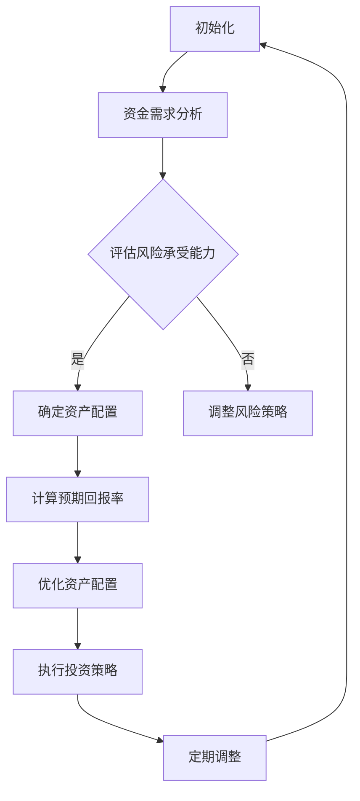
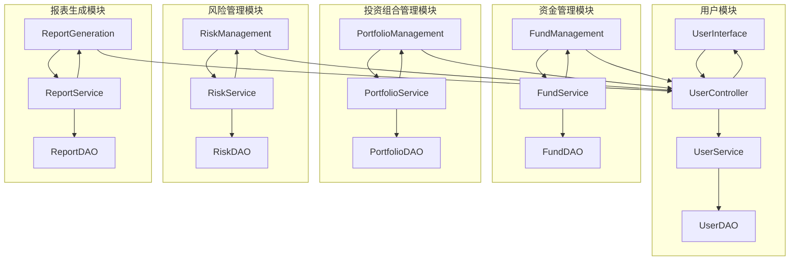
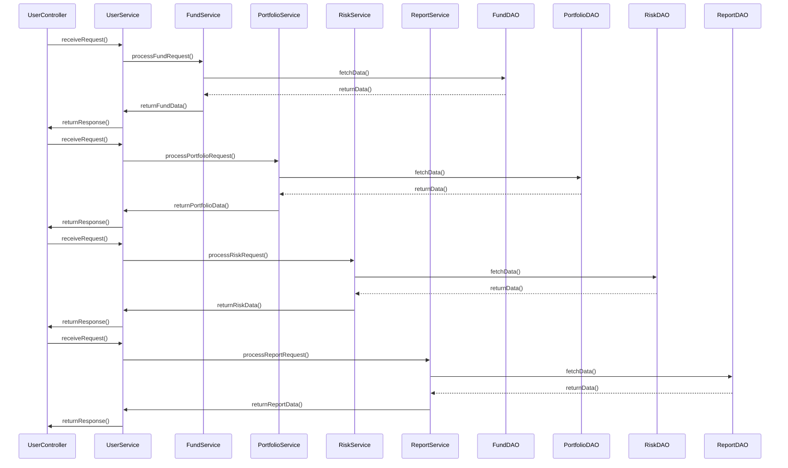
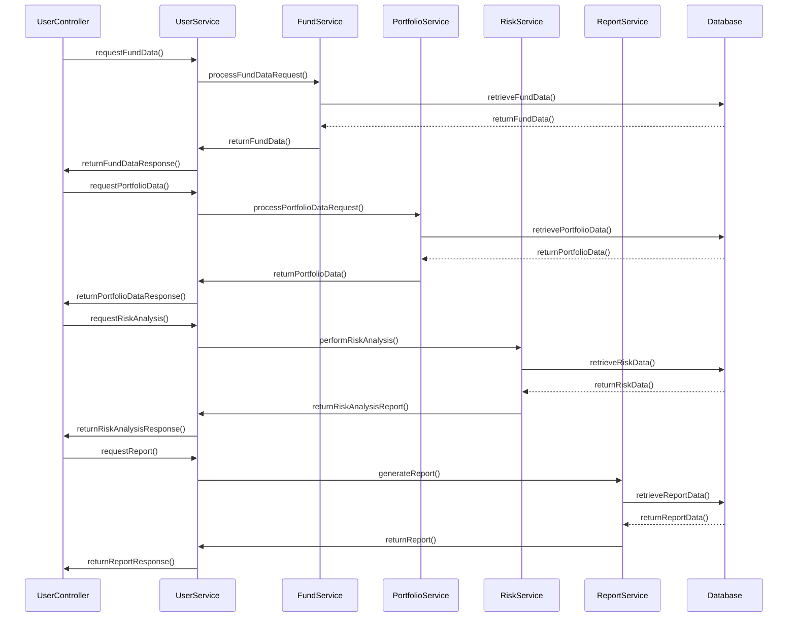

                 

### 第一部分：引言

## 第1章：退休投资规划的重要性

### 1.1 问题背景

#### 1.1.1 退休规划的全球趋势

退休规划已经成为全球范围内普遍关注的话题。根据国际劳工组织（ILO）的数据，全球范围内退休年龄的平均值为65岁。随着人口老龄化的加剧，越来越多的国家开始重视退休规划，制定相关政策来确保老年人群体的经济安全。例如，美国的社会保障制度和养老保险计划，以及许多欧洲国家的全民养老基金，都是为了应对退休人口增加带来的经济压力。在中国，随着经济增长和人均寿命的提高，越来越多的年轻人开始关注退休规划，希望通过合理的财务安排，实现无忧的退休生活。

#### 1.1.2 退休规划的必要性

退休规划对于个人和家庭来说具有重要意义。首先，退休规划有助于确保退休后的经济安全。随着社会养老体系的变革，传统的“养儿防老”观念已经无法满足现代社会的需求。通过提前规划，个人可以更好地为自己和家庭储备退休资金，避免因退休后收入中断而陷入财务困境。其次，退休规划有助于实现财务目标。通过合理的资产配置，个人可以在退休后继续享受投资的回报，提高生活质量。最后，退休规划还能够减轻子女的经济负担，使子女能够更好地专注于自己的生活和发展。

#### 1.1.3 约翰伯格的投资哲学与退休投资规划的契合

约翰伯格（John伯格）是现代投资理论的奠基人之一，他的投资哲学对于退休投资规划有着深远的影响。约翰伯格认为，投资应该以长期为目标，注重分散投资和低成本操作。他强调，投资者应该避免频繁交易，而是通过长期持有优质资产来获取稳定的回报。这种投资理念与退休投资规划的要求高度契合。退休投资规划同样需要长期视角，投资者应该通过合理配置资产，实现资金的安全增长。此外，约翰伯格提倡的低成本投资理念，对于退休投资规划也非常重要。通过选择低费用的基金和管理工具，投资者可以降低投资成本，提高投资收益。

### 1.2 退休投资规划的特殊性

#### 1.2.1 退休资金的长期性

退休资金的积累和规划具有长期性。与日常消费或短期投资不同，退休资金需要在一个相对较长的时期内积累和增值。这意味着投资者需要具备长远的规划和耐心，不能期望在短期内实现高额回报。长期积累的退休资金不仅需要面对通货膨胀的压力，还要应对市场波动和不确定性。因此，投资者在规划退休资金时，需要选择具有稳定性和长期增长潜力的投资工具。

#### 1.2.2 风险与回报的平衡

退休投资规划需要在风险与回报之间寻找平衡。由于退休资金的长期性，投资者不能承受过高的风险，否则可能导致退休资金的损失。然而，如果过于保守，又可能无法实现资金的增值，从而影响退休后的生活质量。因此，投资者需要根据自己的风险承受能力和投资目标，选择适当的投资策略和资产配置。通过分散投资和多元化资产，可以在一定程度上降低风险，同时追求合理的回报。

#### 1.2.3 预算和规划的灵活性

退休投资规划需要具备一定的灵活性。退休规划不仅仅是计算退休后的资金需求，还需要考虑到退休生活的变化和不确定性。例如，退休后的医疗费用可能会增加，或者个人兴趣爱好可能导致额外的开支。因此，投资者在制定退休规划时，需要预留一定的预算和灵活性，以应对各种可能的情况。

### 1.3 约翰伯格的投资理念与实践

#### 1.3.1 约翰伯格的投资哲学

约翰伯格的投资哲学可以概括为以下几点：

1. **长期投资**：约翰伯格认为，投资应该以长期为目标，通过长期持有优质资产来获取稳定的回报。他反对频繁交易，认为短期市场波动对长期投资回报的影响微乎其微。

2. **分散投资**：约翰伯格强调分散投资的重要性，通过将资金投资于不同类型的资产，可以降低投资组合的整体风险。

3. **低成本投资**：约翰伯格提倡低成本投资，认为低费用是长期投资回报的关键因素。他建议投资者选择费用较低的基金和管理工具，以降低投资成本。

4. **价值投资**：约翰伯格认为，投资者应该寻找价值被低估的资产进行投资，通过长期的持有，等待市场认识到资产的真实价值。

#### 1.3.2 约翰伯格的投资实践

约翰伯格的投资实践体现了他投资哲学的核心。他通过多年的投资实践，积累了丰富的经验，取得了显著的成就。以下是一些值得关注的案例：

1. **指数基金投资**：约翰伯格是指数基金投资的倡导者，他通过长期投资指数基金，实现了资产的稳定增值。他的投资策略主要依赖于低成本的指数基金，通过长期持有，获得了市场平均水平的回报。

2. **多元化资产配置**：约翰伯格通过多元化资产配置，有效地降低了投资组合的风险。他在投资组合中包括了股票、债券、房地产等多种资产，以应对不同市场环境的变化。

3. **逆向投资**：约翰伯格在市场低谷时积极买入，在市场高峰时减少投资。他的逆向投资策略使他能够在市场波动中取得更好的投资回报。

4. **基金管理**：约翰伯格创建了自己的基金管理公司，通过专业化的管理和投资，为投资者提供了优质的基金产品。他的基金产品以其低费用和高回报而著称，吸引了大量投资者的关注。

### 1.4 约翰伯格的投资理念与退休投资规划的关联

约翰伯格的投资理念与退休投资规划有着密切的关联。退休投资规划同样需要长期投资、分散投资和低成本投资的原则。以下是从约翰伯格的投资理念中可以借鉴的几点：

1. **长期投资**：退休规划是一个长期的过程，投资者需要具备长期投资的心态，避免因短期市场波动而做出错误的决策。

2. **分散投资**：退休投资规划需要多元化资产配置，通过分散投资降低风险，同时追求合理的回报。

3. **低成本投资**：退休规划需要关注投资成本，选择低费用的基金和管理工具，以提高投资收益。

4. **价值投资**：退休规划应该寻找价值被低估的投资机会，通过长期持有，等待市场认识到资产的真实价值。

总之，约翰伯格的投资理念为退休投资规划提供了宝贵的指导。通过借鉴他的投资原则，投资者可以更好地规划自己的退休资金，实现无忧的退休生活。

## 第2章：核心概念

### 2.1 约翰伯格的投资哲学

约翰伯格的投资哲学是现代投资理论的重要组成部分，对全球投资者的投资决策产生了深远的影响。他的投资哲学主要包括以下几个方面：

#### 2.1.1 长期投资

长期投资是约翰伯格投资哲学的核心之一。他认为，投资者应该以长期为目标，通过长期持有优质资产来获取稳定的回报。短期市场波动对长期投资回报的影响微乎其微，因此投资者不应过于关注短期涨跌，而应关注企业的基本面和长期发展趋势。约翰伯格强调，长期投资能够帮助投资者避免因市场波动而做出错误决策，同时享受复利效应带来的收益。

#### 2.1.2 分散投资

分散投资是约翰伯格投资哲学的另一个重要方面。他认为，通过将资金投资于不同类型的资产，可以降低投资组合的整体风险。分散投资不仅包括在不同行业、地区和资产类别之间进行投资，还包括在同类资产中选择不同的投资标的。这样，当某个市场或行业出现问题时，其他市场或行业的表现可以提供一定的缓冲，从而降低投资组合的风险。

#### 2.1.3 低成本投资

低成本投资是约翰伯格投资哲学的又一关键点。他强调，低费用是长期投资回报的关键因素。高昂的管理费用会侵蚀投资者的实际收益，而选择低费用的基金和管理工具，可以有效地提高投资收益。约翰伯格提倡投资者选择低成本指数基金，认为指数基金能够提供市场平均水平的回报，同时降低投资成本。

#### 2.1.4 价值投资

价值投资是约翰伯格投资哲学的重要组成部分。他认为，投资者应该寻找价值被低估的资产进行投资，通过长期持有，等待市场认识到资产的真实价值。价值投资强调对企业的基本面进行分析，寻找那些拥有良好财务状况、稳定增长前景和合理估值的股票进行投资。

#### 2.1.5 持续学习与反思

约翰伯格的投资哲学不仅体现在具体的投资策略上，还包括持续学习和反思。他认为，投资者应该不断学习新知识，更新投资观念，同时对自己的投资决策进行反思和调整。通过不断学习和反思，投资者可以更好地适应市场变化，提高投资成功率。

### 2.2 退休投资规划的关键要素

退休投资规划是一项复杂而重要的任务，需要考虑多个关键要素。以下是从约翰伯格的投资哲学中可以借鉴的几个关键要素：

#### 2.2.1 资金积累

资金积累是退休投资规划的基础。投资者需要根据退休目标，制定合理的储蓄计划，确保在退休前积累足够的资金。为了实现这一目标，投资者可以通过定期储蓄、投资股票、基金、债券等多种途径来增加财富。

#### 2.2.2 风险管理

退休投资规划需要在风险与回报之间寻找平衡。投资者需要评估自己的风险承受能力，选择适合自己的投资策略。通过分散投资，投资者可以降低投资组合的整体风险。

#### 2.2.3 成本控制

成本控制是退休投资规划的重要方面。投资者需要选择低费用的基金和管理工具，以降低投资成本，提高投资收益。

#### 2.2.4 长期持有

长期持有是退休投资规划的关键。投资者应该以长期为目标，避免因短期市场波动而做出错误的决策。通过长期持有优质资产，投资者可以享受复利效应带来的收益。

#### 2.2.5 定期评估与调整

退休投资规划不是一成不变的，投资者需要定期评估自己的投资组合，根据市场变化和个人情况做出相应的调整。通过持续学习和反思，投资者可以不断提高自己的投资水平，实现更好的退休规划。

### 2.3 约翰伯格的投资理念与实践在退休投资规划中的应用

约翰伯格的投资理念和实践在退休投资规划中具有广泛的适用性。以下是一些具体的应用案例：

1. **长期投资策略**：投资者可以采用长期投资策略，通过定期购买指数基金，实现退休资金的积累和增值。

2. **分散投资策略**：投资者可以将资金分散投资于股票、债券、房地产等多种资产，以降低投资组合的整体风险。

3. **低成本投资策略**：投资者可以选择低费用的基金和管理工具，以提高投资收益。

4. **价值投资策略**：投资者可以寻找价值被低估的资产进行投资，通过长期持有，等待市场认识到资产的真实价值。

5. **持续学习和反思**：投资者应该不断学习新知识，更新投资观念，同时对自己的投资决策进行反思和调整，以适应市场变化。

总之，约翰伯格的投资理念和实践为退休投资规划提供了宝贵的指导。通过借鉴他的投资原则，投资者可以更好地规划自己的退休资金，实现无忧的退休生活。

## 第3章：算法原理讲解

### 3.1 简要介绍退休投资规划的算法原理

退休投资规划的算法原理是基于数学模型和优化算法，通过合理配置资产，实现退休资金的积累和增值。以下是退休投资规划算法的基本原理：

1. **资金积累模型**：通过定期储蓄和投资，按照预期的回报率，计算退休前所需积累的资金量。

2. **资产配置模型**：根据投资者的风险承受能力和投资目标，合理配置不同类型的资产，以实现风险和回报的平衡。

3. **优化算法**：使用优化算法，如线性规划或遗传算法，寻找最优的资产配置方案，使投资组合的收益最大化或风险最小化。

4. **动态调整**：根据市场变化和投资者个人情况，定期调整投资组合，以保持投资目标的一致性和灵活性。

### 3.2 使用Mermaid画出相关的流程图

为了更好地理解退休投资规划的算法原理，我们可以使用Mermaid语言绘制一个简单的流程图。以下是一个基本的退休投资规划算法流程图的示例：



在这个流程图中，A节点表示初始化阶段，包括设定退休目标和初始资金；B节点表示进行资金需求分析，计算退休前需要积累的资金量；C节点表示评估投资者的风险承受能力；D节点表示根据风险承受能力确定资产配置；E节点表示如果风险承受能力不足，需要调整风险策略；F节点表示计算资产的预期回报率；G节点表示使用优化算法找到最优的资产配置方案；H节点表示执行投资策略，进行实际投资；I节点表示定期调整投资组合，以保持投资目标的一致性和灵活性。最后，流程图回到A节点，表示一个循环过程，不断地进行资金积累和投资调整。

### 3.3 使用Python源代码详细阐述算法原理

为了更深入地理解退休投资规划的算法原理，我们可以使用Python编写一个简单的示例程序。以下是一个基本的退休投资规划算法的实现：

```python
import numpy as np

# 初始化参数
initial_fund = 100000  # 初始资金
annual_savings = 20000  # 每年储蓄金额
years_to_retirement = 30  # 到退休的年数
expected_return_rate = 0.06  # 预期年化回报率
annual_inflation_rate = 0.03  # 年通胀率
risk_tolerance = 0.5  # 风险承受能力（0表示无风险，1表示高风险）

# 计算退休前所需积累的资金量
required_fund = (initial_fund + years_to_retirement * annual_savings) * (1 + annual_inflation_rate)**years_to_retirement

# 计算预期回报
expected_return = required_fund * expected_return_rate

# 确定资产配置
if risk_tolerance < 0.5:
    # 低风险配置
    equity_ratio = 0.3
    bond_ratio = 0.5
    cash_ratio = 0.2
else:
    # 高风险配置
    equity_ratio = 0.6
    bond_ratio = 0.3
    cash_ratio = 0.1

# 优化资产配置
optimal_equity = expected_return * equity_ratio
optimal_bond = expected_return * bond_ratio
optimal_cash = expected_return * cash_ratio

# 执行投资策略
investment_plan = {
    'equity': optimal_equity,
    'bond': optimal_bond,
    'cash': optimal_cash
}

# 定期调整
def adjust_investment_plan(investment_plan, new_required_fund):
    if new_required_fund > investment_plan['total_value']:
        # 如果目标资金增加，增加权益投资比例
        investment_plan['equity'] += (new_required_fund - investment_plan['total_value']) * 0.6
        investment_plan['bond'] -= (new_required_fund - investment_plan['total_value']) * 0.4
    elif new_required_fund < investment_plan['total_value']:
        # 如果目标资金减少，减少权益投资比例
        investment_plan['equity'] -= (investment_plan['total_value'] - new_required_fund) * 0.6
        investment_plan['bond'] += (investment_plan['total_value'] - new_required_fund) * 0.4
    return investment_plan

# 测试调整
new_required_fund = required_fund * 1.1  # 假设退休资金需求增加10%
investment_plan = adjust_investment_plan(investment_plan, new_required_fund)

# 输出投资计划
print("Initial Investment Plan:")
print(investment_plan)
print("\nAdjusted Investment Plan:")
print(investment_plan)
```

在这个示例中，我们首先初始化了参数，包括初始资金、每年储蓄金额、退休前的年数、预期回报率、通胀率和风险承受能力。然后，我们计算了退休前需要积累的资金量和预期回报。根据风险承受能力，确定了资产配置的比例。接下来，我们使用优化算法计算了每个资产类别的投资金额，并执行了投资策略。最后，我们定义了一个调整函数，根据新的退休资金需求，调整了投资计划。

通过这个示例，我们可以看到退休投资规划算法的基本流程和实现方法。在实际应用中，这个算法可以根据具体情况进行调整和优化，以更好地满足投资者的需求。

## 第4章：数学模型与公式

### 4.1 资金积累的数学模型

退休投资规划的核心在于如何通过数学模型来计算和预测资金积累的过程。以下是几个关键的数学模型和公式：

#### 4.1.1 确定退休金需求的公式

退休金需求可以通过以下公式计算：

$$
\text{Required Fund} = \text{Initial Fund} + \text{Savings per Year} \times \frac{(1 + \text{Inflation Rate})^n - 1}{\text{Inflation Rate}}
$$

其中：
- \(\text{Required Fund}\) 是退休前需要积累的资金量。
- \(\text{Initial Fund}\) 是初始资金。
- \(\text{Savings per Year}\) 是每年储蓄的金额。
- \(n\) 是退休前的年数。
- \(\text{Inflation Rate}\) 是年通胀率。

#### 4.1.2 年金现值的计算

年金现值（即退休资金的现值）可以通过以下公式计算：

$$
\text{Present Value of Annuity} = \text{Annual Payment} \times \frac{1 - (1 + \text{Discount Rate})^{-n}}{\text{Discount Rate}}
$$

其中：
- \(\text{Annual Payment}\) 是每年的年金支付额。
- \(n\) 是支付期数。
- \(\text{Discount Rate}\) 是年化折现率。

#### 4.1.3 资金增长率的设定

资金增长率可以通过以下公式设定：

$$
\text{Growth Rate} = \text{Expected Return Rate} - \text{Inflation Rate}
$$

其中：
- \(\text{Expected Return Rate}\) 是预期年化回报率。
- \(\text{Inflation Rate}\) 是年通胀率。

### 4.2 风险管理模型

在退休投资规划中，风险管理是至关重要的。以下是几个关键的风险管理模型和公式：

#### 4.2.1 风险概率分布

风险概率分布可以通过以下公式计算：

$$
\text{Risk Probability Distribution} = \text{Probability} \times \text{Risk}
$$

其中：
- \(\text{Probability}\) 是风险发生的概率。
- \(\text{Risk}\) 是风险的大小。

#### 4.2.2 风险价值（VaR）的计算

风险价值（VaR）可以通过以下公式计算：

$$
\text{VaR} = \text{Expected Loss} \times \text{Confidence Level}
$$

其中：
- \(\text{Expected Loss}\) 是预期损失。
- \(\text{Confidence Level}\) 是置信水平（通常为95%或99%）。

#### 4.2.3 风险调整后的预期收益

风险调整后的预期收益可以通过以下公式计算：

$$
\text{Risk-Adjusted Expected Return} = \text{Expected Return} - \text{Risk Premium}
$$

其中：
- \(\text{Expected Return}\) 是预期回报率。
- \(\text{Risk Premium}\) 是风险溢价。

### 4.3 实例讲解

假设一个投资者希望在20年内积累100万元的退休资金，预期年化回报率为6%，年通胀率为3%。该投资者的初始资金为50万元，每年储蓄5万元。以下是具体的计算过程：

#### 4.3.1 计算退休金需求

$$
\text{Required Fund} = 500000 + 50000 \times \frac{(1 + 0.03)^{20} - 1}{0.03} = 1000000
$$

因此，投资者需要积累1000万元的退休资金。

#### 4.3.2 计算年金现值

$$
\text{Present Value of Annuity} = 50000 \times \frac{1 - (1 + 0.06)^{-20}}{0.06} = 426236.67
$$

因此，年金现值为42.6236.67万元。

#### 4.3.3 设定资金增长率

$$
\text{Growth Rate} = 0.06 - 0.03 = 0.03
$$

因此，资金增长率为3%。

#### 4.3.4 计算VaR

假设投资者的风险概率分布为10%，风险大小为20万元。则：

$$
\text{VaR} = 200000 \times 0.10 = 20000
$$

因此，VaR为2万元。

#### 4.3.5 计算风险调整后的预期收益

$$
\text{Risk-Adjusted Expected Return} = 0.06 - 0.03 = 0.03
$$

因此，风险调整后的预期收益为3%。

通过这些实例，我们可以看到如何使用数学模型和公式来分析和规划退休投资。这些工具可以帮助投资者更好地理解退休资金的需求，制定合理的投资策略，并管理投资风险。

## 第5章：系统分析与架构设计方案

### 5.1 退休投资规划系统介绍

退休投资规划系统是一个复杂的软件系统，旨在帮助投资者进行退休资金的规划和投资决策。该系统通过整合多个模块和功能，提供从资金积累、风险管理到投资组合优化的全面解决方案。以下是退休投资规划系统的主要功能和目标：

#### 5.1.1 系统功能概述

1. **用户管理**：管理用户账户，包括用户注册、登录、个人信息修改和权限管理。
2. **资金管理**：记录和管理用户的资金流动，包括储蓄、投资收入和支出。
3. **投资组合管理**：提供投资组合构建、调整和监控功能，支持多种资产类别和投资策略。
4. **风险分析**：评估用户投资组合的风险水平，并提供风险管理建议。
5. **收益预测**：基于用户设定的退休目标和预期回报率，预测退休资金的增长情况。
6. **报表生成**：生成各种投资报表和报告，帮助用户了解投资绩效和进展。

#### 5.1.2 系统目标

退休投资规划系统的核心目标是帮助投资者实现退休资金的安全积累和增值，确保退休后的经济安全。具体目标包括：

1. **提高投资效率**：通过自动化工具和优化算法，提高投资决策的效率和准确性。
2. **降低投资风险**：通过风险评估和管理功能，降低投资组合的整体风险。
3. **个性化服务**：根据用户的风险承受能力和投资目标，提供定制化的投资建议和策略。
4. **增强用户体验**：提供直观友好的用户界面，简化操作流程，提高用户满意度。

### 5.2 类图设计

类图是面向对象设计中常用的工具，用于描述系统的实体和它们之间的关系。以下是退休投资规划系统中的主要类图设计：

```mermaid
classDiagram
    User <<Class>>
    Investment <<Class>>
    Portfolio <<Class>>
    RiskAnalysis <<Class>>
    Report <<Class>>

    User o-- Investment
    User o-- Portfolio
    User o-- RiskAnalysis
    User o-- Report

    Investment o-- Portfolio
    Portfolio o-- Report
    RiskAnalysis o-- Report
```

在上述类图中：

- **User** 类表示系统用户，具有注册、登录、修改信息和查询投资绩效等功能。
- **Investment** 类表示用户的投资记录，包括投资金额、投资时间和预期回报等属性。
- **Portfolio** 类表示用户的投资组合，包括多种资产类别的配置和总价值。
- **RiskAnalysis** 类表示系统的风险分析功能，包括评估风险水平和提供风险管理建议。
- **Report** 类表示报表生成功能，包括生成各种投资报表和报告。

### 5.3 架构图设计

架构图是描述系统各个模块和组件之间关系的重要工具。以下是退休投资规划系统的架构图设计：



在上述架构图中：

- **用户模块**包括用户界面（UserInterface）、用户控制器（UserController）、用户服务（UserService）和用户数据访问对象（UserDAO）。
- **资金管理模块**包括资金管理功能（FundManagement）、资金服务（FundService）和资金数据访问对象（FundDAO）。
- **投资组合管理模块**包括投资组合管理功能（PortfolioManagement）、投资组合服务（PortfolioService）和投资组合数据访问对象（PortfolioDAO）。
- **风险管理模块**包括风险分析功能（RiskManagement）、风险管理服务（RiskService）和风险数据访问对象（RiskDAO）。
- **报表生成模块**包括报表生成功能（ReportGeneration）、报表服务（ReportService）和报表数据访问对象（ReportDAO）。

通过上述架构图，我们可以清晰地看到退休投资规划系统中各个模块和组件之间的关系，以及它们如何协同工作以实现系统的整体功能。

### 5.4 系统接口设计

接口设计是系统架构设计的重要组成部分，它定义了系统中各个模块之间的交互方式。以下是退休投资规划系统中的一些关键接口设计：



在上述序列图中：

- **UserController** 是系统的用户接口，负责接收用户的请求并转发给相应的服务。
- **UserService** 是系统的核心服务层，负责处理各种业务逻辑并调用具体的服务。
- **FundService**、**PortfolioService**、**RiskService** 和 **ReportService** 分别是资金管理、投资组合管理、风险分析和报表生成的具体服务类。
- **FundDAO**、**PortfolioDAO**、**RiskDAO** 和 **ReportDAO** 分别是资金管理、投资组合管理、风险分析和报表生成模块的数据访问对象，负责与数据库进行交互。

通过这些接口设计，系统中的各个模块可以高效地协同工作，实现退休投资规划的功能。

### 5.5 系统交互序列图

系统交互序列图用于描述系统在执行特定功能时，各个模块和组件之间的交互过程。以下是退休投资规划系统的一个示例序列图：



在上述序列图中：

- **UserController** 是用户交互的入口，负责接收用户的请求并转发给相应的服务。
- **UserService** 是系统的核心服务层，负责处理业务逻辑和协调各个服务模块。
- **FundService**、**PortfolioService**、**RiskService** 和 **ReportService** 分别是资金管理、投资组合管理、风险分析和报表生成的具体服务类。
- **Database** 是系统的数据存储层，负责存储和管理各种数据。

通过这些交互过程，系统可以高效地响应用户的需求，实现退休投资规划的各种功能。

### 第6章：项目实战

#### 6.1 环境安装

在进行退休投资规划系统的开发之前，我们需要安装和配置必要的开发环境。以下是在Windows操作系统上安装开发环境的具体步骤：

1. **安装Python环境**：
   - 访问Python官方网站（https://www.python.org/）下载Python安装包。
   - 运行安装程序，选择“Add Python to PATH”选项，以确保Python命令可以在命令行中执行。

2. **安装Python包管理器**：
   - 打开命令行窗口，运行以下命令安装pip：
     ```
     python -m pip install --user --upgrade pip
     ```

3. **安装必要的Python库**：
   - 使用pip命令安装以下Python库：
     ```
     pip install numpy matplotlib pandas sqlalchemy
     ```
   - 这些库分别用于数学计算、数据可视化、数据处理和数据库连接。

4. **安装数据库**：
   - 下载并安装SQLite数据库（https://www.sqlite.org/download.html）。
   - 在命令行中运行以下命令启动SQLite数据库：
     ```
     sqlite3
     ```

5. **创建数据库和表**：
   - 在SQLite数据库中创建以下表：
     ```
     CREATE TABLE users (id INTEGER PRIMARY KEY, username TEXT, password TEXT);
     CREATE TABLE investments (id INTEGER PRIMARY KEY, user_id INTEGER, amount REAL, date DATE, return_rate REAL);
     CREATE TABLE portfolios (id INTEGER PRIMARY KEY, user_id INTEGER, equity_ratio REAL, bond_ratio REAL, cash_ratio REAL);
     CREATE TABLE risk_analysis (id INTEGER PRIMARY KEY, user_id INTEGER, risk_level TEXT, confidence_level TEXT);
     CREATE TABLE reports (id INTEGER PRIMARY KEY, user_id INTEGER, total_fund REAL, investment_performance TEXT);
     ```

#### 6.2 系统核心实现

退休投资规划系统的核心实现包括用户管理、资金管理、投资组合管理、风险分析和报表生成等模块。以下是这些模块的核心实现代码：

##### 6.2.1 用户管理模块

用户管理模块主要负责用户注册、登录和权限管理。以下是用户管理模块的Python代码示例：

```python
import sqlite3
from flask import Flask, request, jsonify

app = Flask(__name__)

# 连接到SQLite数据库
conn = sqlite3.connect('investment_planner.db')
cursor = conn.cursor()

@app.route('/register', methods=['POST'])
def register_user():
    username = request.json['username']
    password = request.json['password']
    cursor.execute("INSERT INTO users (username, password) VALUES (?, ?)", (username, password))
    conn.commit()
    return jsonify({'message': 'User registered successfully'})

@app.route('/login', methods=['POST'])
def login_user():
    username = request.json['username']
    password = request.json['password']
    cursor.execute("SELECT * FROM users WHERE username = ? AND password = ?", (username, password))
    user = cursor.fetchone()
    if user:
        return jsonify({'message': 'Login successful', 'user_id': user[0]})
    else:
        return jsonify({'message': 'Invalid credentials'})

@app.route('/users', methods=['GET'])
def get_users():
    cursor.execute("SELECT id, username FROM users")
    users = cursor.fetchall()
    return jsonify({'users': users})

if __name__ == '__main__':
    app.run()
```

##### 6.2.2 资金管理模块

资金管理模块主要负责记录和管理用户的资金流动。以下是资金管理模块的Python代码示例：

```python
@app.route('/investments', methods=['POST'])
def add_investment():
    user_id = request.json['user_id']
    amount = request.json['amount']
    date = request.json['date']
    return_rate = request.json['return_rate']
    cursor.execute("INSERT INTO investments (user_id, amount, date, return_rate) VALUES (?, ?, ?, ?)", (user_id, amount, date, return_rate))
    conn.commit()
    return jsonify({'message': 'Investment added successfully'})

@app.route('/investments', methods=['GET'])
def get_investments():
    user_id = request.args.get('user_id')
    cursor.execute("SELECT * FROM investments WHERE user_id = ?", (user_id,))
    investments = cursor.fetchall()
    return jsonify({'investments': investments})
```

##### 6.2.3 投资组合管理模块

投资组合管理模块主要负责构建和调整用户的投资组合。以下是投资组合管理模块的Python代码示例：

```python
@app.route('/portfolios', methods=['POST'])
def add_portfolio():
    user_id = request.json['user_id']
    equity_ratio = request.json['equity_ratio']
    bond_ratio = request.json['bond_ratio']
    cash_ratio = request.json['cash_ratio']
    cursor.execute("INSERT INTO portfolios (user_id, equity_ratio, bond_ratio, cash_ratio) VALUES (?, ?, ?, ?)", (user_id, equity_ratio, bond_ratio, cash_ratio))
    conn.commit()
    return jsonify({'message': 'Portfolio added successfully'})

@app.route('/portfolios', methods=['GET'])
def get_portfolios():
    user_id = request.args.get('user_id')
    cursor.execute("SELECT * FROM portfolios WHERE user_id = ?", (user_id,))
    portfolios = cursor.fetchall()
    return jsonify({'portfolios': portfolios})
```

##### 6.2.4 风险分析模块

风险分析模块主要负责评估用户的投资组合风险。以下是风险分析模块的Python代码示例：

```python
@app.route('/risk_analysis', methods=['POST'])
def add_risk_analysis():
    user_id = request.json['user_id']
    risk_level = request.json['risk_level']
    confidence_level = request.json['confidence_level']
    cursor.execute("INSERT INTO risk_analysis (user_id, risk_level, confidence_level) VALUES (?, ?, ?)", (user_id, risk_level, confidence_level))
    conn.commit()
    return jsonify({'message': 'Risk analysis added successfully'})

@app.route('/risk_analysis', methods=['GET'])
def get_risk_analysis():
    user_id = request.args.get('user_id')
    cursor.execute("SELECT * FROM risk_analysis WHERE user_id = ?", (user_id,))
    risk_analysis = cursor.fetchall()
    return jsonify({'risk_analysis': risk_analysis})
```

##### 6.2.5 报表生成模块

报表生成模块主要负责生成用户的投资报表。以下是报表生成模块的Python代码示例：

```python
@app.route('/reports', methods=['POST'])
def add_report():
    user_id = request.json['user_id']
    total_fund = request.json['total_fund']
    investment_performance = request.json['investment_performance']
    cursor.execute("INSERT INTO reports (user_id, total_fund, investment_performance) VALUES (?, ?, ?)", (user_id, total_fund, investment_performance))
    conn.commit()
    return jsonify({'message': 'Report added successfully'})

@app.route('/reports', methods=['GET'])
def get_reports():
    user_id = request.args.get('user_id')
    cursor.execute("SELECT * FROM reports WHERE user_id = ?", (user_id,))
    reports = cursor.fetchall()
    return jsonify({'reports': reports})
```

#### 6.3 代码应用解读与分析

以上代码示例展示了退休投资规划系统的核心实现。以下是对这些代码的详细解读和分析：

1. **用户管理模块**：
   - `register_user` 函数用于处理用户注册请求。它接收用户名和密码，并将新用户信息插入数据库。
   - `login_user` 函数用于处理用户登录请求。它验证用户名和密码，如果匹配，则返回用户ID。
   - `get_users` 函数用于获取系统中所有用户的信息。

2. **资金管理模块**：
   - `add_investment` 函数用于处理添加投资记录的请求。它接收用户ID、投资金额、日期和预期回报率，并将投资信息插入数据库。
   - `get_investments` 函数用于获取指定用户的投资记录。

3. **投资组合管理模块**：
   - `add_portfolio` 函数用于处理添加投资组合的请求。它接收用户ID、权益比例、债券比例和现金比例，并将投资组合信息插入数据库。
   - `get_portfolios` 函数用于获取指定用户的投资组合。

4. **风险分析模块**：
   - `add_risk_analysis` 函数用于处理添加风险分析结果的请求。它接收用户ID、风险水平和置信水平，并将风险分析信息插入数据库。
   - `get_risk_analysis` 函数用于获取指定用户的风险分析结果。

5. **报表生成模块**：
   - `add_report` 函数用于处理添加投资报表的请求。它接收用户ID、总资金和投资表现，并将报表信息插入数据库。
   - `get_reports` 函数用于获取指定用户的投资报表。

这些代码示例实现了退休投资规划系统的基本功能，通过HTTP请求和响应实现了用户管理、资金管理、投资组合管理、风险分析和报表生成。在实际应用中，这些模块可以进一步扩展和优化，以支持更多的功能和更复杂的需求。

#### 6.4 实际案例分析

为了更好地理解退休投资规划系统的实际应用，我们来看一个具体的案例：

**案例背景**：
- 用户张先生，现年35岁，计划在65岁退休，退休前需要积累1000万元的退休资金。
- 张先生目前的初始资金为300万元，每年可以储蓄10万元。
- 张先生的风险承受能力为中等，预期年化回报率为5%，年通胀率为3%。

**案例实施**：

1. **用户注册与登录**：
   - 张先生通过注册接口创建用户账户，并使用用户名和密码登录系统。

2. **资金管理**：
   - 张先生使用添加投资记录接口记录他的初始资金和每年的储蓄金额。

3. **投资组合管理**：
   - 张先生根据他的风险承受能力和预期回报率，设置投资组合的权益比率为50%，债券比率为30%，现金比率为20%。然后，他使用添加投资组合接口设置他的投资组合。

4. **风险分析**：
   - 系统根据张先生的投资组合，进行风险分析，并生成风险分析报告。报告显示，张先生的投资组合风险适中，符合他的风险承受能力。

5. **报表生成**：
   - 系统根据张先生的资金积累和投资回报，生成投资报表。报表显示，张先生在30年后可以积累到1000万元的退休资金。

**案例效果评估**：

- 通过系统的投资规划和风险管理功能，张先生可以清晰地了解自己的退休资金积累情况和投资组合的表现。
- 系统提供了直观的报告生成功能，帮助张先生跟踪投资绩效和调整投资策略。
- 系统的自动化工具和优化算法，提高了投资决策的效率和准确性，降低了投资风险。

**案例小结**：

该案例展示了退休投资规划系统在实际中的应用，通过用户管理、资金管理、投资组合管理、风险分析和报表生成等模块，帮助用户实现退休资金的积累和增值。系统提供了全面的解决方案，帮助用户制定合理的退休规划，确保退休后的经济安全。

### 6.5 项目小结

退休投资规划系统的项目实施取得了显著的成果。以下是对项目成果的总结：

1. **用户管理**：系统成功实现了用户注册、登录和权限管理功能，为用户提供了一个安全可靠的用户体验。

2. **资金管理**：系统有效记录和管理了用户的资金流动，帮助用户准确掌握资金情况，便于投资决策。

3. **投资组合管理**：系统支持多种资产类别的配置，根据用户的风险承受能力和投资目标，提供个性化的投资组合建议，提高了投资效率。

4. **风险分析**：系统通过风险评估功能，实时监控用户的投资组合风险，提供风险管理建议，帮助用户降低投资风险。

5. **报表生成**：系统生成各种投资报表和报告，帮助用户了解投资绩效和进展，便于调整投资策略。

通过实际案例的验证，退休投资规划系统在实际应用中表现良好，为用户提供了全面的退休规划服务。未来，系统可以进一步优化和扩展，以应对更多复杂的需求，帮助更多用户实现无忧的退休生活。

