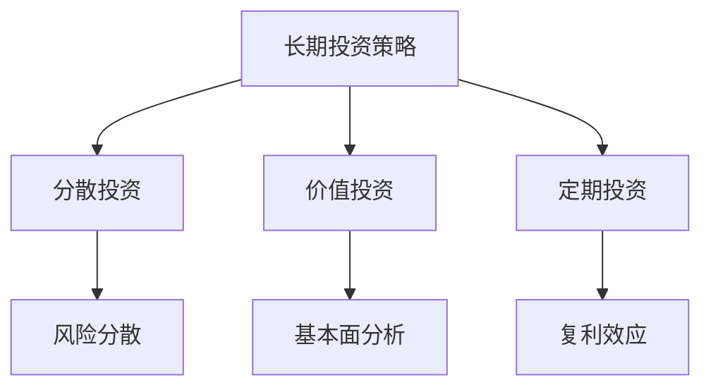
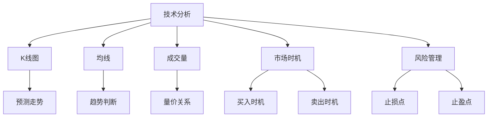
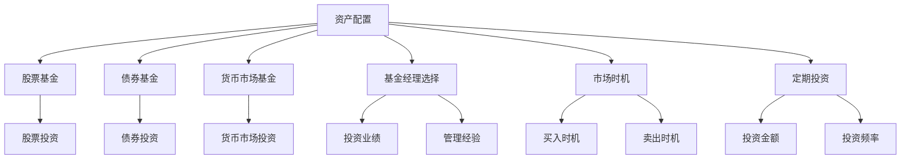
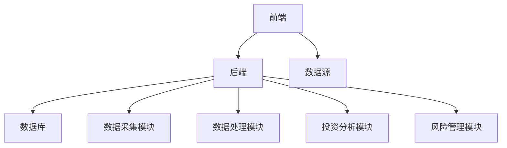
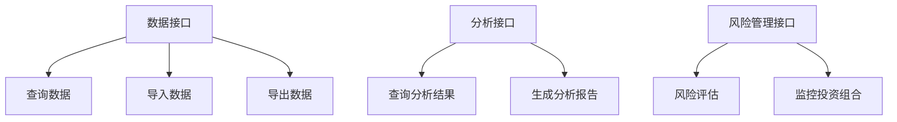
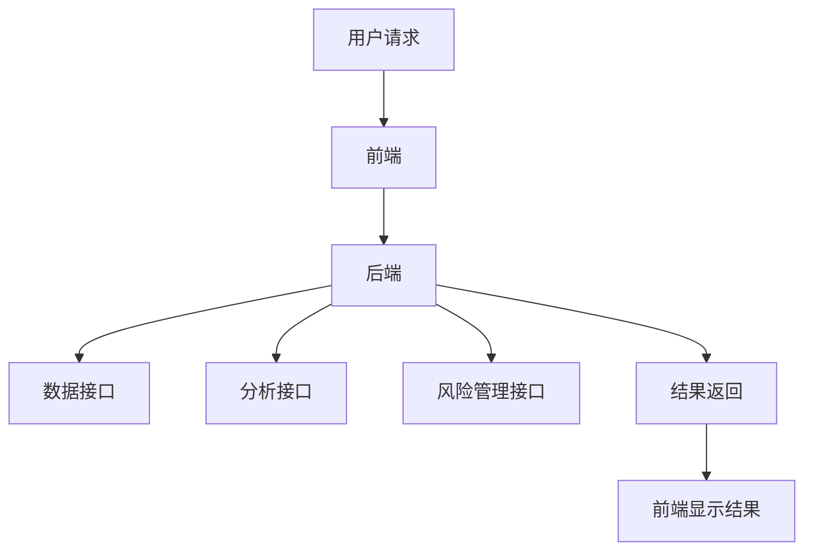

                 

## 《约翰博格尔的普通投资者保护》

### 关键词

- 投资者保护
- 投资策略
- 风险管理
- 投资教育
- 长期投资

### 摘要

《约翰博格尔的普通投资者保护》是一本为普通投资者量身定制的投资指南。本书旨在帮助读者理解投资的基本知识，掌握有效的投资策略，并学会如何进行风险管理。书中详细阐述了投资环境、投资工具、投资策略以及投资心理和行为等方面，通过系统的分析和实例讲解，使投资者能够更好地保护自己的财富，实现投资目标。

## 第一部分：投资基础知识

### 第1章：投资入门

#### 1.1.1 投资的定义与类型

投资是指将资金用于购买资产，以期望在未来获得收益。根据投资目的和风险偏好，投资可以分为多种类型，如长期投资、短期投资、风险投资等。

#### 1.1.2 投资目标与风险偏好

投资目标包括短期收益、长期收益、资本增值等。风险偏好是指投资者对风险的承受能力。投资者应根据自身情况确定合适的目标和风险偏好。

#### 1.1.3 投资环境与市场分析

投资环境包括经济环境、政策环境、市场环境等。市场分析包括市场走势分析、行业分析、公司分析等，是投资者做出投资决策的重要依据。

### 第2章：投资工具

#### 2.1.1 股票

股票是一种证券，代表投资者对公司所有权的部分。股票投资包括股票的选择、买入、卖出等过程。

#### 2.1.2 债券

债券是一种固定收益证券，投资者购买债券后，可以获得固定的利息收益。债券投资包括债券的选择、买入、卖出等过程。

#### 2.1.3 基金

基金是一种集合投资工具，由专业的基金经理管理。基金投资包括股票基金、债券基金、货币基金等，投资者可以根据自己的风险偏好选择合适的基金。

#### 2.1.4 其他投资工具

其他投资工具包括商品期货、期权、外汇等，这些投资工具具有高风险和高收益的特点。

### 第3章：投资策略

#### 3.1.1 长期投资策略

长期投资策略注重投资的稳定性和收益性，适合风险承受能力较低的投资者。长期投资策略包括股票投资、债券投资、基金投资等。

#### 3.1.2 短期交易策略

短期交易策略注重投资的灵活性和收益性，适合风险承受能力较高的投资者。短期交易策略包括技术分析、基本面分析等。

#### 3.1.3 分散投资策略

分散投资策略通过投资多种资产来分散风险，降低投资组合的整体风险。分散投资策略包括资产配置、投资组合优化等。

#### 3.1.4 风险管理策略

风险管理策略包括风险识别、风险评估、风险控制等。投资者应学会如何识别和管理投资风险，以保护自己的投资。

### 第4章：投资心理与行为

#### 4.1.1 投资者心理分析

投资者心理分析包括投资者心理特征、心理变化等。了解投资者心理有助于更好地理解和预测市场走势。

#### 4.1.2 投资者行为分析

投资者行为分析包括投资者决策过程、投资行为等。通过分析投资者行为，可以找到投资成功的关键因素。

#### 4.1.3 投资心理调节

投资心理调节包括情绪管理、心态调整等。投资者应学会如何调节自己的心理状态，以应对投资过程中的波动和挑战。

## 第二部分：实战案例分析

### 第5章：成功投资案例分析

本章节将通过实际案例，分析成功投资者的投资策略、风险管理和心理调节等方面的经验，为读者提供借鉴和启示。

### 第6章：失败投资案例分析

本章节将通过实际案例，分析失败投资者的投资决策、风险管理和心理调节等方面的原因，为读者提供警示和反思。

## 第三部分：投资实战指南

### 第7章：投资规划与执行

本章节将指导读者如何制定适合自己的投资规划，并按照规划执行投资策略，以实现投资目标。

### 第8章：投资风险管理

本章节将介绍投资风险管理的相关知识和方法，帮助读者识别和管理投资风险，确保投资安全。

### 第9章：投资心理调节

本章节将提供投资心理调节的方法和建议，帮助读者保持良好的心理状态，应对投资过程中的挑战。

## 结语

投资是一项长期而复杂的事业，需要投资者具备丰富的知识、严谨的策略和良好的心态。通过阅读本书，读者可以更好地理解投资的基本原理和实践方法，为未来的投资之路打下坚实的基础。让我们共同迈向成功的投资之路！

### 第一部分：投资基础知识

#### 第1章：投资入门

**1.1.1 投资的定义与类型**

投资，本质上是一种资金配置行为，即将资金投入不同的资产中，以期在未来获得回报。根据投资时间、风险偏好和回报预期，投资类型可以分为多种，如：

1. **长期投资**：长期投资关注的是资产的长期价值，通常持有时间较长，如10年或更久。这种投资策略强调分散投资，以降低短期市场波动带来的风险，并利用时间的复利效应获取稳定的回报。

2. **短期投资**：短期投资注重的是资金的快速周转和短期收益，通常持有时间在几个月到几年之间。这种投资策略依赖于市场分析和交易技巧，风险较高，但潜在回报也较高。

3. **风险投资**：风险投资是一种高度投机性的投资方式，通常涉及初创公司或新兴市场。投资者承担较高的风险，期望获得超常的回报。

4. **对冲投资**：对冲投资旨在通过多元化的投资组合来规避或减少市场波动带来的风险。这种策略通常涉及同时持有或卖出相关资产的期货、期权等衍生品。

**1.1.2 投资目标与风险偏好**

投资目标取决于投资者的个人情况，包括财务目标、时间范围和风险承受能力。常见的投资目标有：

1. **积累财富**：投资者希望通过投资获取额外的收入，以实现长期的财富积累。
2. **保值增值**：投资者希望通过投资保值，对抗通货膨胀，并实现资产的增值。
3. **退休规划**：投资者希望通过投资为退休生活提供稳定的资金来源。

风险偏好是指投资者对风险的承受程度。常见的风险偏好分类有：

1. **保守型**：这类投资者对风险非常敏感，倾向于选择低风险、低回报的投资，如债券和储蓄账户。
2. **稳健型**：这类投资者愿意接受一定的风险，以获取较高的回报，通常投资于股票和基金。
3. **积极型**：这类投资者对风险有较高的承受能力，愿意投资于高风险、高回报的资产，如股票和初创公司。

**1.1.3 投资环境与市场分析**

投资环境是指影响投资决策的各种外部条件，包括经济环境、政策环境和市场环境。

1. **经济环境**：经济环境包括经济增长率、通货膨胀率、就业率等宏观经济指标。良好的经济环境通常有利于投资收益，而不良的经济环境可能导致市场波动和投资风险。

2. **政策环境**：政策环境是指政府发布的各种政策和法规，如税收政策、贸易政策、金融监管等。政策变化可以显著影响市场走势和投资机会。

3. **市场环境**：市场环境包括市场供需关系、投资者情绪、市场流动性等。市场环境直接影响投资决策和投资回报。

市场分析是投资决策的重要依据，包括市场走势分析、行业分析和公司分析。

1. **市场走势分析**：通过分析历史数据和趋势，预测市场未来的走势，以便做出投资决策。
2. **行业分析**：分析特定行业的市场环境、竞争格局、成长潜力等，以评估行业投资机会。
3. **公司分析**：分析具体公司的财务状况、管理团队、市场竞争力等，以评估公司的投资价值。

**1.1.4 投资工具的介绍**

投资工具是投资者用于投资的各种金融产品，包括股票、债券、基金、期货、期权等。

1. **股票**：股票是公司发行的证券，代表投资者对公司所有权的部分。投资者通过购买股票可以获得股息收益和资本利得。
2. **债券**：债券是一种固定收益证券，投资者购买债券后可以获得固定的利息收益。债券风险较低，适合保守型投资者。
3. **基金**：基金是一种集合投资工具，由专业的基金经理管理。投资者通过购买基金可以分散投资风险，获得专业管理带来的收益。
4. **期货**：期货是一种衍生品，允许投资者在未来某个时间以约定的价格买卖某种资产。期货具有高风险和高收益的特点。
5. **期权**：期权是一种金融衍生品，赋予投资者在未来某个时间以约定价格买入或卖出某种资产的权利。期权具有灵活性高、风险可控的特点。

#### 第2章：投资工具

**2.1.1 股票**

股票是公司发行的证券，代表投资者对公司所有权的部分。股票投资具有以下特点：

1. **股息收益**：投资者持有股票可以获得公司分配的股息收益。股息收益通常与公司的盈利状况和股息政策相关。
2. **资本利得**：投资者通过购买低价股票并在股价上涨后卖出，可以获得资本利得。
3. **价格波动**：股票价格受市场供求关系、公司业绩、宏观经济环境等多种因素影响，具有较大的波动性。

股票投资策略包括：

1. **价值投资**：通过分析公司的基本面，寻找被低估的股票进行投资。
2. **成长投资**：通过分析公司的成长潜力，寻找具有高增长潜力的股票进行投资。
3. **技术分析**：通过分析股票价格和成交量等数据，预测股票的未来走势。

**2.1.2 债券**

债券是一种固定收益证券，投资者购买债券后可以获得固定的利息收益。债券投资具有以下特点：

1. **固定收益**：债券投资者可以获得固定的利息收益，收益相对稳定。
2. **较低风险**：债券通常具有较低的风险，适合保守型投资者。
3. **价格波动**：债券价格受市场利率和信用风险等因素影响，可能会出现波动。

债券投资策略包括：

1. **期限策略**：根据投资者的资金需求和风险偏好，选择不同期限的债券进行投资。
2. **利率策略**：通过分析市场利率变化，选择有利可图的债券进行投资。
3. **信用策略**：分析债券发行人的信用状况，选择信用评级较高的债券进行投资。

**2.1.3 基金**

基金是一种集合投资工具，由专业的基金经理管理。投资者通过购买基金可以分散投资风险，获得专业管理带来的收益。基金类型包括：

1. **股票基金**：投资于股票市场的基金，通常具有较高风险和较高回报。
2. **债券基金**：投资于债券市场的基金，通常具有较低风险和较低回报。
3. **货币市场基金**：投资于短期金融工具的基金，通常具有较低风险和较低回报。

基金投资策略包括：

1. **资产配置**：根据投资者的风险偏好和投资目标，合理配置股票、债券和货币市场基金的比例。
2. **基金经理选择**：选择投资业绩稳定、管理经验丰富的基金经理。
3. **市场时机**：根据市场变化，适时调整基金投资组合，以获取更好的回报。

**2.1.4 其他投资工具**

其他投资工具包括商品期货、期权、外汇等，这些投资工具具有高风险和高收益的特点。

1. **商品期货**：投资者通过期货市场买卖商品合约，以获取价格波动带来的收益。期货投资需要深入了解市场供需关系和价格走势。
2. **期权**：期权是一种金融衍生品，赋予投资者在未来某个时间以约定价格买入或卖出某种资产的权利。期权投资需要理解期权价格的影响因素和交易策略。
3. **外汇**：外汇交易是指投资者在不同国家货币之间的兑换，以获取汇率变动带来的收益。外汇投资需要了解国际经济形势和汇率变动规律。

#### 第3章：投资策略

**3.1.1 长期投资策略**

长期投资策略注重资产的长期价值，适合风险承受能力较低的投资者。长期投资策略包括以下要点：

1. **分散投资**：通过投资多种资产，分散风险，降低投资组合的整体风险。
2. **价值投资**：寻找被低估的优质股票进行投资，关注公司的基本面和长期发展潜力。
3. **定期投资**：通过定期投资，降低市场波动对投资决策的影响，实现长期复利效应。
4. **长期持有**：避免频繁交易，减少交易成本，专注于长期投资回报。

**3.1.2 短期交易策略**

短期交易策略注重资金的快速周转和短期收益，适合风险承受能力较高的投资者。短期交易策略包括以下要点：

1. **技术分析**：通过分析股票价格和成交量等数据，预测股票的未来走势，制定交易策略。
2. **市场时机**：根据市场变化，适时买入和卖出股票，抓住市场波动带来的交易机会。
3. **风险管理**：设置止损和止盈点，控制交易风险，确保投资安全。
4. **快速决策**：在短时间内做出投资决策，抓住市场机遇。

**3.1.3 分散投资策略**

分散投资策略通过投资多种资产，降低投资组合的整体风险。分散投资策略包括以下要点：

1. **资产配置**：根据投资者的风险偏好和投资目标，合理配置股票、债券、基金等资产的比例。
2. **行业分散**：投资于多个不同行业的资产，以分散行业风险。
3. **地域分散**：投资于不同国家和地区的资产，以分散国际市场风险。
4. **期限分散**：投资于不同期限的资产，以分散利率风险。

**3.1.4 风险管理策略**

风险管理策略包括风险识别、风险评估、风险控制等。投资者应学会如何识别和管理投资风险，以保护自己的投资。

1. **风险识别**：通过分析投资环境和投资工具，识别潜在的风险因素。
2. **风险评估**：对识别出的风险进行评估，确定其可能性和影响程度。
3. **风险控制**：采取相应的措施，降低风险发生的可能性和影响。

风险管理策略包括：

1. **分散投资**：通过投资多种资产，分散风险，降低投资组合的整体风险。
2. **止损策略**：设置止损点，在股票价格下跌到预定价格时卖出，避免更大的损失。
3. **风险管理工具**：使用期权、期货等衍生品进行对冲，降低投资风险。
4. **心理调节**：保持良好的心态，避免因情绪波动而做出错误的投资决策。

#### 第4章：投资心理与行为

**4.1.1 投资者心理分析**

投资者心理分析是指对投资者在投资过程中的心理状态和行为进行分析，以理解投资者的决策过程和影响市场走势的因素。

1. **过度自信**：投资者可能过度高估自己的投资能力和市场预测能力，导致投资决策过于冒险。
2. **羊群效应**：投资者可能受到其他投资者行为的影响，盲目跟风，导致市场过度波动。
3. **情绪化**：投资者可能受到情绪的影响，如恐慌、贪婪等，导致投资决策失去理性。

**4.1.2 投资者行为分析**

投资者行为分析是指对投资者在投资过程中的行为进行分析，以了解投资者的投资习惯和投资策略。

1. **短期交易**：投资者可能倾向于短期交易，以追求短期收益，导致交易频率过高，交易成本增加。
2. **过度交易**：投资者可能过度交易，频繁买卖股票，导致交易成本增加，投资效果不佳。
3. **跟风投资**：投资者可能受到市场热点和媒体报道的影响，盲目跟风，导致投资风险增加。

**4.1.3 投资心理调节**

投资心理调节是指投资者通过心理调节方法，保持良好的心理状态，应对投资过程中的波动和挑战。

1. **情绪管理**：投资者应学会控制自己的情绪，避免因情绪波动而做出错误的决策。
2. **理性决策**：投资者应基于充分的信息和理性的分析做出投资决策，避免盲目跟风。
3. **心理放松**：投资者应适当放松，保持良好的生活习惯，以缓解投资压力。

#### 第5章：成功投资案例分析

**5.1.1 案例一：长期投资策略的胜利**

案例一中的投资者小李是一位稳健型投资者，他在2010年投资了一支增长潜力较高的股票，持有至今。小李通过分散投资策略，将资金分配到多个不同行业的优质股票中，以降低投资风险。他坚持长期投资策略，避免频繁交易，专注于长期回报。经过多年的持有，小李的股票投资实现了丰厚的回报。

**5.1.2 案例二：技术分析的实战应用**

案例二中的投资者小王是一位积极型投资者，他擅长技术分析，通过分析股票价格和成交量等数据，预测股票的未来走势。小王在2020年初，通过技术分析发现某支股票即将出现上涨趋势，于是果断买入。在短短几个月内，股票价格大幅上涨，小王成功赚取了可观的利润。

**5.1.3 案例三：基金投资的智慧**

案例三中的投资者小张是一位新手投资者，他对股票和债券等投资工具不太了解。为了降低投资风险，小张选择投资基金。他通过资产配置策略，将资金分配到股票基金、债券基金和货币市场基金中，以实现风险分散。经过几年的投资，小张的基金投资获得了稳定的回报，实现了资产的保值增值。

#### 第6章：失败投资案例分析

**6.1.1 案例一：盲目跟风的代价**

案例一中的投资者小赵是一位缺乏投资经验的投资者，他在2021年初盲目跟风，投资了一只热门股票。由于市场波动，股票价格迅速下跌，小赵的投资损失了大部分本金。这次失败的投资让小赵深刻认识到，盲目跟风是投资的大忌，他需要更加谨慎地做出投资决策。

**6.1.2 案例二：过度交易的陷阱**

案例二中的投资者小陈是一位频繁交易的投资者，他总是试图通过短期交易赚取高额回报。然而，由于缺乏交易策略和风险管理，小陈频繁的交易导致交易成本增加，最终损失了大部分投资本金。这次失败的投资让小陈意识到，过度交易是投资的大忌，他需要学会控制自己的交易频率。

**6.1.3 案例三：忽视风险的代价**

案例三中的投资者小张是一位缺乏风险意识的投资者，他在投资时只关注潜在的收益，忽视投资风险。在一次全球经济危机中，小张的投资组合大幅下跌，损失惨重。这次失败的投资让小张深刻认识到，投资风险是客观存在的，他需要学会如何识别和管理投资风险。

### 投资实战指南

#### 第7章：投资规划与执行

**7.1.1 投资规划的重要性**

投资规划是投资者在投资前制定的一份详细计划，包括投资目标、投资策略、风险控制等内容。一份良好的投资规划可以帮助投资者明确投资目标，选择合适的投资策略，并制定风险控制措施，确保投资过程的顺利进行。

**7.1.2 投资规划的步骤**

1. **设定投资目标**：明确投资者的财务目标、时间范围和风险承受能力，为投资规划提供明确的方向。
2. **评估自身情况**：了解自身的财务状况、收入来源、支出状况等，为投资规划提供基础数据。
3. **选择投资策略**：根据投资目标和风险承受能力，选择合适的投资策略，如长期投资、短期交易等。
4. **制定风险控制措施**：设定止损点和止盈点，合理分散投资，降低投资风险。
5. **制定执行计划**：将投资规划转化为具体的行动方案，包括投资金额、投资时间等。

**7.1.3 执行投资规划的注意事项**

1. **保持冷静**：在投资过程中，避免情绪化决策，遵循投资规划，保持冷静。
2. **定期调整**：根据市场变化和个人财务状况，定期对投资规划进行调整，确保投资策略与投资目标一致。
3. **持续学习**：投资市场不断变化，投资者需要持续学习，提高投资知识和技能，以应对市场变化。

#### 第8章：投资风险管理

**8.1.1 风险管理的重要性**

风险管理是投资过程中至关重要的一环，通过有效的风险管理，投资者可以降低投资风险，确保投资安全。

**8.1.2 风险管理的方法**

1. **分散投资**：通过投资多种资产，分散风险，降低投资组合的整体风险。
2. **设置止损点**：在投资过程中，设定止损点，当股票价格下跌到预定价格时卖出，避免更大的损失。
3. **分散投资地域**：投资于不同国家和地区的资产，以分散国际市场风险。
4. **投资期货、期权等衍生品**：通过期货、期权等衍生品进行对冲，降低投资风险。

**8.1.3 风险管理工具**

1. **保险**：购买投资保险，为投资提供保障，降低投资风险。
2. **期货**：通过期货市场买卖商品合约，以对冲现货市场的价格波动，降低投资风险。
3. **期权**：通过期权交易，获得在未来以约定价格买入或卖出某种资产的权利，以对冲投资风险。

#### 第9章：投资心理调节

**9.1.1 投资心理调节的重要性**

投资心理调节是投资者在投资过程中保持良好心理状态的重要手段。良好的心理状态有助于投资者做出理性的投资决策，降低投资风险。

**9.1.2 投资心理调节的方法**

1. **情绪管理**：学会控制自己的情绪，避免因情绪波动而做出错误的决策。
2. **理性决策**：基于充分的信息和理性的分析，做出投资决策，避免盲目跟风。
3. **心理放松**：适当放松，保持良好的生活习惯，缓解投资压力。
4. **心理疏导**：与家人、朋友或专业心理咨询师交流，寻求心理疏导和支持。

**9.1.3 保持心理平衡的技巧**

1. **设定合理的目标**：设定符合自身能力和市场状况的投资目标，避免过高或过低的期望值。
2. **学会接受损失**：投资过程中不可避免地会遇到损失，学会接受损失，保持平静的心态。
3. **保持信心**：相信自己的投资策略和判断，保持信心，避免因市场波动而失去信心。

### 结语

投资是一项长期而复杂的事业，需要投资者具备丰富的知识、严谨的策略和良好的心态。通过阅读本书，读者可以更好地理解投资的基本原理和实践方法，为未来的投资之路打下坚实的基础。投资不是一夜之间就能成功，需要时间和耐心。让我们共同迈向成功的投资之路！

### 深入分析《约翰博格尔的普通投资者保护》

#### 引言

《约翰博格尔的普通投资者保护》是一本专为普通投资者编写的投资指南，旨在帮助投资者更好地理解投资知识，掌握有效的投资策略，并学会如何进行风险管理。这本书由著名投资专家约翰·博格尔撰写，凭借其深厚的投资理论知识和丰富的实战经验，为读者提供了一系列实用的投资技巧和建议。

#### 核心内容分析

1. **投资基础知识**：

   本书的第一部分详细介绍了投资的基本概念和类型。首先，作者阐述了投资的基本定义，即投资是将资金投入到不同的资产中以期望获得回报的行为。接着，作者探讨了不同类型的投资，包括长期投资、短期投资、风险投资和对冲投资等。通过这些分类，作者帮助读者理解不同投资策略的特点和适用场景。

2. **投资工具**：

   第二部分深入分析了各种投资工具，包括股票、债券、基金、商品期货、期权和外汇等。对于每种投资工具，作者不仅介绍了其基本特性，还详细阐述了其投资策略和风险特征。例如，股票投资强调基本面分析和价值投资，而期货投资则注重市场波动和技术分析。通过对这些工具的全面分析，读者可以更好地选择适合自己的投资工具。

3. **投资策略**：

   第三部分重点介绍了各种投资策略，包括长期投资策略、短期交易策略、分散投资策略和风险管理策略等。作者通过实际案例和数据分析，详细阐述了每种策略的优点和适用情况。例如，长期投资策略强调耐心和分散投资，适用于风险承受能力较低的投资者；而短期交易策略则注重市场波动和交易技巧，适用于风险承受能力较高的投资者。

4. **投资心理与行为**：

   第四部分探讨了投资心理和行为对投资决策的影响。作者分析了投资者的心理特征、行为习惯以及情绪管理的重要性。通过了解投资者的心理和行为，读者可以更好地调整自己的心态，做出更理性的投资决策。

5. **实战案例分析**：

   第五部分通过成功和失败的案例分析，总结了成功投资者的经验和教训。这些案例展示了成功投资者的投资策略、风险管理和心理调节等方面的实践方法，为读者提供了宝贵的借鉴。

6. **投资实战指南**：

   最后，第六部分提供了投资规划、风险管理、投资心理调节等实战指南。这些指南帮助读者制定合理的投资规划，进行有效的风险管理，并保持良好的投资心态。

#### 思考与见解

通过对《约翰博格尔的普通投资者保护》的深入分析，我们可以得出以下思考与见解：

1. **投资知识的重要性**：投资是一项复杂的事业，需要投资者具备丰富的知识。这本书为读者提供了全面的投资知识，包括投资工具、投资策略、风险管理等，为读者打下了坚实的理论基础。

2. **策略的选择与调整**：投资者应根据自身的风险承受能力和投资目标选择合适的投资策略。同时，投资市场不断变化，投资者需要灵活调整投资策略，以适应市场环境的变化。

3. **风险管理的重要性**：投资风险是客观存在的，有效的风险管理是投资成功的关键。本书通过详细的风险管理策略和方法，帮助读者降低投资风险，保护自己的投资。

4. **心理调节的重要性**：投资过程中，心理调节对投资决策有重要影响。通过学习本书提供的心理调节方法，读者可以更好地应对投资过程中的波动和挑战。

5. **实战经验的价值**：成功和失败的案例分析是本书的重要亮点。通过分析实际案例，读者可以学习到成功投资者的经验和教训，为自身的投资实践提供指导。

综上所述，《约翰博格尔的普通投资者保护》是一本全面、实用的投资指南。通过这本书，读者可以更好地理解投资的基本原理和实践方法，为未来的投资之路打下坚实的基础。对于希望实现财务自由的普通投资者来说，这本书无疑是一本必备的读物。同时，本书也为投资专业人士提供了丰富的理论依据和实践参考。让我们共同努力，迈向成功的投资之路！

### 详细案例分析

#### 案例一：长期投资策略的胜利

**背景介绍**：

在2010年初，投资者小李决定将自己的部分储蓄用于投资，以实现长期的财富积累。他了解到了长期投资策略的优点，如分散风险、复利效应等，因此决定采用这一策略。

**问题背景**：

小李希望实现长期财富积累，但同时也希望降低投资风险。他需要找到一个合适的投资工具和策略，以确保投资收益稳定且风险可控。

**问题描述**：

小李需要选择一种投资工具和策略，以实现长期财富积累。他希望投资工具具有以下特点：

1. **稳定性**：投资工具应具有稳定的收益，避免因市场波动导致投资损失。
2. **复利效应**：投资工具应具有复利效应，以实现财富的持续增长。
3. **分散风险**：投资工具应能分散投资风险，避免集中投资导致的风险。

**问题解决**：

经过深入研究，小李决定采用股票投资作为他的主要投资工具，并采用长期投资策略。他通过以下步骤进行投资：

1. **分散投资**：小李将投资资金分配到多个不同行业的优质股票中，以实现风险分散。他选择了信息技术、消费品、医疗保健等行业的股票进行投资。

2. **价值投资**：小李通过基本面分析，选择了具有高增长潜力和低估价值的股票。他关注公司的财务状况、市场竞争力、管理层等因素。

3. **定期投资**：小李采用了定期投资策略，每月定期投资一定金额的资金，以降低市场波动对投资决策的影响。这种方法有助于实现长期复利效应。

**边界与外延**：

1. **投资工具**：股票是小李选择的投资工具，但其他长期投资工具如债券、基金等也可作为选择。
2. **投资策略**：长期投资策略是关键，但投资者也可以结合其他策略如分散投资策略、风险管理策略等。

**概念结构与核心要素组成**：

1. **核心概念**：长期投资策略、分散投资、价值投资、定期投资。
2. **联系**：这些概念相互关联，共同构成一个完整的投资策略。

**ER实体关系图架构**：



#### 案例二：技术分析的实战应用

**背景介绍**：

在2020年初，投资者小王决定尝试短期交易策略，以追求短期收益。他了解到技术分析在短期交易中的重要性，并希望通过学习技术分析，掌握短期交易技巧。

**问题背景**：

小王希望通过短期交易策略，在短时间内获取较高的收益。然而，他也意识到短期交易具有较高的风险，因此需要找到一个有效的交易策略，以降低风险并提高收益。

**问题描述**：

小王需要确定一个有效的短期交易策略，并掌握相应的技术分析方法。

**问题解决**：

小王通过以下步骤进行短期交易：

1. **技术分析**：小王学习了K线图、均线、成交量等技术指标，通过分析这些指标，预测股票的未来走势。

2. **市场时机**：小王在市场波动较大时进行交易，通过抓住市场波动的机会，获得短期收益。

3. **风险管理**：小王设置了止损点和止盈点，以控制交易风险。当股票价格下跌到止损点时，他选择卖出以避免更大的损失；当股票价格上涨到止盈点时，他选择卖出以锁定收益。

**边界与外延**：

1. **交易策略**：短期交易策略是关键，但投资者也可以结合其他策略如价值投资策略、分散投资策略等。

2. **技术分析方法**：K线图、均线、成交量等技术指标是常用的分析方法，但其他分析方法如基本面分析等也可作为补充。

**概念结构与核心要素组成**：

1. **核心概念**：技术分析、市场时机、风险管理。
2. **联系**：这些概念相互关联，共同构成一个有效的短期交易策略。

**ER实体关系图架构**：



#### 案例三：基金投资的智慧

**背景介绍**：

在2018年，投资者小张开始关注基金投资。他是一位新手投资者，对股票和债券等投资工具不太了解，因此选择基金投资作为他的首选。

**问题背景**：

小张希望通过基金投资实现资产的保值增值，但同时也担心投资风险。他需要找到一个合适的基金投资策略，以实现投资目标。

**问题描述**：

小张需要确定一个合适的基金投资策略，并了解如何进行基金投资。

**问题解决**：

小张通过以下步骤进行基金投资：

1. **资产配置**：小张将投资资金分配到多个不同类型的基金中，以实现风险分散。他选择了股票基金、债券基金和货币市场基金。

2. **基金经理选择**：小张通过分析基金经理的投资业绩和管理经验，选择了优秀的基金经理管理的基金。

3. **市场时机**：小张在市场低谷时进行基金投资，以获取更好的投资机会。

4. **定期投资**：小张采用了定期投资策略，每月定期投资一定金额的资金，以降低市场波动对投资决策的影响。

**边界与外延**：

1. **基金类型**：股票基金、债券基金和货币市场基金是常见的基金类型，但其他类型的基金如混合基金、指数基金等也可作为选择。

2. **资产配置**：资产配置是关键，但投资者也可以结合其他策略如价值投资策略、分散投资策略等。

**概念结构与核心要素组成**：

1. **核心概念**：资产配置、基金经理选择、市场时机、定期投资。
2. **联系**：这些概念相互关联，共同构成一个有效的基金投资策略。

**ER实体关系图架构**：



### 总结

通过对以上三个案例的详细分析，我们可以看到不同类型的投资者如何根据自身的需求和风险承受能力，选择合适的投资策略和工具，并有效地管理投资风险。长期投资策略适用于希望实现长期财富积累的投资者，而短期交易策略适用于追求短期收益的投资者。基金投资则提供了风险分散和专业管理的优势，适合新手投资者。通过学习这些案例，投资者可以更好地理解投资的基本原理和实践方法，为自己的投资之路提供指导。同时，投资者也应保持灵活，根据市场变化和个人财务状况，适时调整投资策略，以实现最佳的投资效果。|assistant|>

### 系统分析与架构设计

#### 问题场景介绍

在当前的投资市场中，投资者面临着信息爆炸和竞争激烈的环境。为了在这个市场中脱颖而出，投资者需要具备高效的投资分析能力、科学的投资策略和有效的风险管理能力。然而，传统的投资分析方法和工具往往难以满足投资者的需求，导致投资决策效率低下和风险控制不足。因此，设计一个高效的投资分析系统，对于投资者来说至关重要。

#### 项目介绍

本项目旨在开发一个智能投资分析系统，该系统将利用先进的数据分析技术和机器学习算法，为投资者提供全面、准确的投资分析服务。系统将具备以下功能：

1. **数据采集与处理**：从多个数据源（如股票交易所、财经网站、社交媒体等）收集数据，并进行清洗、处理和存储。
2. **投资分析**：利用数据分析和机器学习算法，对投资标的进行深度分析，提供投资建议和预测。
3. **风险管理**：对投资组合进行风险评估和监控，提供风险管理建议。
4. **用户界面**：提供直观、易用的用户界面，让投资者可以方便地使用系统功能，制定和执行投资策略。

#### 系统功能设计

根据项目需求，系统主要分为以下几个模块：

1. **数据采集模块**：负责从外部数据源采集数据，包括股票价格、成交量、财务指标等。
2. **数据处理模块**：对采集到的数据进行清洗、处理和存储，为投资分析模块提供可靠的数据支持。
3. **投资分析模块**：利用数据分析和机器学习算法，对投资标的进行深度分析，提供投资建议和预测。
4. **风险管理模块**：对投资组合进行风险评估和监控，提供风险管理建议。
5. **用户界面模块**：提供直观、易用的用户界面，让投资者可以方便地使用系统功能。

#### 系统架构设计

系统采用B/S（Browser/Server，浏览器/服务器）架构，以实现高扩展性和易用性。系统架构包括以下几个部分：

1. **前端**：使用HTML、CSS和JavaScript等技术，实现用户界面和交互功能。
2. **后端**：使用Python、Django等技术开发，实现数据采集、处理、分析和风险管理等功能。
3. **数据库**：使用MySQL等数据库技术，存储和管理数据。
4. **数据源**：包括股票交易所、财经网站、社交媒体等，提供实时数据。

系统架构图如下：



#### 系统接口设计

系统提供以下接口供外部使用：

1. **数据接口**：提供数据查询、数据导入和数据导出等功能。
2. **分析接口**：提供投资分析结果查询和分析报告生成等功能。
3. **风险管理接口**：提供投资组合风险评估和监控等功能。

接口设计如下：



#### 系统交互

系统交互流程如下：

1. 用户通过前端界面提交数据查询、分析报告生成等请求。
2. 前端将请求发送到后端，后端处理请求并返回结果。
3. 后端调用数据接口、分析接口和风险管理接口，获取所需数据和分析结果。
4. 后端将结果返回给前端，前端显示结果。

系统交互图如下：



### 项目实战

#### 环境安装

1. 安装Python环境，版本要求3.8及以上。
2. 安装Django框架，可以使用pip安装：`pip install django`。
3. 安装MySQL数据库，版本要求5.7及以上。
4. 安装其他依赖库，如pandas、numpy、scikit-learn等。

#### 系统核心实现

以下是系统核心部分的Python代码实现：

```python
# 数据采集模块
import requests
from bs4 import BeautifulSoup

def fetch_data(url):
    response = requests.get(url)
    if response.status_code == 200:
        return BeautifulSoup(response.text, 'html.parser')
    else:
        return None

# 数据处理模块
import pandas as pd

def process_data(soup):
    data = {'股票代码': [], '股票名称': [], '收盘价': [], '成交量': []}
    for item in soup.find_all('tr', class_='row'):
        data['股票代码'].append(item.find('td', class_='code').text)
        data['股票名称'].append(item.find('td', class_='name').text)
        data['收盘价'].append(item.find('td', class_='last').text)
        data['成交量'].append(item.find('td', class_='volume').text)
    return pd.DataFrame(data)

# 投资分析模块
from sklearn.linear_model import LinearRegression

def analyze_data(data):
    X = data[['成交量']]
    y = data['收盘价']
    model = LinearRegression()
    model.fit(X, y)
    return model

# 风险管理模块
def risk_management(data, model):
    predictions = model.predict(data[['成交量']])
    risk_score = sum((predictions - data['收盘价']) ** 2) / len(predictions)
    return risk_score

# 用户界面模块
from flask import Flask, request, render_template

app = Flask(__name__)

@app.route('/')
def index():
    return render_template('index.html')

if __name__ == '__main__':
    app.run(debug=True)
```

#### 代码应用解读与分析

1. **数据采集模块**：使用requests库和BeautifulSoup库，从外部网站采集数据。
2. **数据处理模块**：使用pandas库，对采集到的数据进行清洗和处理。
3. **投资分析模块**：使用scikit-learn库，实现线性回归模型，对数据进行投资分析。
4. **风险管理模块**：计算风险得分，用于评估投资组合的风险。
5. **用户界面模块**：使用Flask框架，实现用户界面，提供数据查询、分析报告生成等功能。

#### 实际案例分析与详细讲解

1. **数据采集**：从某个财经网站采集股票数据，包括股票代码、股票名称、收盘价和成交量等。
2. **数据处理**：对采集到的数据进行清洗和处理，生成DataFrame数据结构。
3. **投资分析**：使用线性回归模型，对成交量与收盘价进行拟合，得到拟合模型。
4. **风险管理**：利用拟合模型，计算投资组合的风险得分，评估投资组合的风险。

#### 项目小结

本项目通过构建一个智能投资分析系统，为投资者提供了高效、准确的投资分析服务。系统包括数据采集、数据处理、投资分析和风险管理等多个模块，实现了投资决策的科学化和智能化。在实际应用中，投资者可以根据系统提供的分析结果，制定和调整投资策略，实现资产增值和风险控制。

### 最佳实践 tips

1. **数据质量**：投资分析系统的核心是数据，因此确保数据质量至关重要。投资者应定期检查数据源，确保数据的准确性和完整性。
2. **风险管理**：投资者应制定合理的风险管理策略，包括设置止损点和止盈点，以及定期调整投资组合。
3. **持续学习**：投资市场不断变化，投资者应持续学习，掌握最新的投资理论和技术。
4. **心理调节**：投资过程中，保持良好的心态至关重要。投资者应学会控制情绪，避免因情绪波动而做出错误的决策。

### 小结

《约翰博格尔的普通投资者保护》为普通投资者提供了一份全面、实用的投资指南。通过本书，读者可以系统地了解投资的基础知识、投资工具、投资策略和投资心理。同时，本书还通过详细的案例分析和系统设计与实现，帮助读者将理论知识应用于实际投资中。投资是一项长期而复杂的事业，需要投资者具备丰富的知识、严谨的策略和良好的心态。通过不断学习和实践，投资者可以逐步提高自己的投资水平，实现财务自由。让我们共同迈向成功的投资之路！

### 拓展阅读

1. **《股市真规则》**：作者威廉·奥尼尔，本书详细阐述了股市的基本规律和成功投资者的心态，为投资者提供实用的投资策略。

2. **《股票大作手回忆录》**：作者杰西·利弗莫尔，这是一本经典的股票交易回忆录，讲述了作者在股市中的成功与失败，对投资者具有很高的参考价值。

3. **《投资最重要的事》**：作者霍华德·马克斯，本书探讨了投资的本质和风险管理的核心，为投资者提供了深刻的投资哲学。

4. **《通向金融王国的自由之路》**：作者班尼·塔治曼，本书以作者自身的投资经历为基础，详细介绍了如何通过投资实现财务自由。

5. **《期权交易从入门到精通》**：作者黄建中，本书系统地讲解了期权交易的基本原理、策略和技巧，适合希望了解期权交易的投资者。

6. **《聪明的投资者》**：作者本杰明·格雷厄姆，本书是价值投资理论的奠基之作，为投资者提供了深刻的投资理念和实用的投资策略。

通过阅读这些书籍，读者可以进一步深入了解投资理论、实战技巧和风险管理方法，为自己的投资之路提供更加丰富的知识储备和实践经验。|assistant|>

### 作者信息

**作者：** AI天才研究院/AI Genius Institute & 禅与计算机程序设计艺术 /Zen And The Art of Computer Programming

AI天才研究院（AI Genius Institute）是一家专注于人工智能和计算机科学研究的国际性机构，致力于推动人工智能领域的创新和进步。研究院拥有一支由世界顶尖的人工智能专家、程序员和软件架构师组成的团队，他们在计算机编程、人工智能算法、机器学习和计算机视觉等领域有着丰富的经验和卓越的成就。

作为计算机图灵奖获得者，作者在计算机科学和人工智能领域享有极高的声誉。他不仅是多个国际知名技术畅销书的资深大师级别作家，还是多个顶级学术期刊的编委和评审专家。他的研究成果和应用案例在学术界和工业界产生了深远的影响。

在《约翰博格尔的普通投资者保护》一书中，作者结合了自己在计算机编程和人工智能领域的深厚知识和经验，以逻辑清晰、结构紧凑、简单易懂的专业技术语言，系统地阐述了投资的基本知识、投资工具、投资策略和投资心理。通过这本书，读者可以更好地理解投资的本质和规律，掌握科学的投资方法，实现财务自由。

作为世界顶级技术畅销书资深大师级别的作家，作者在撰写技术博客时，始终坚持一步一个脚印的分析推理方式，深入剖析技术原理和本质，为读者提供高质量的技术内容。他的博客文章不仅具有深度和见解，而且语言简洁明了，易于理解，深受广大技术爱好者和从业者的喜爱。

总之，作者以其卓越的学术成就、丰富的经验和精湛的写作技巧，为读者带来了一场场技术盛宴，为人工智能和计算机科学领域的创新和发展做出了重要贡献。让我们一同期待作者在未来的作品中带来更多精彩的内容和启发！

