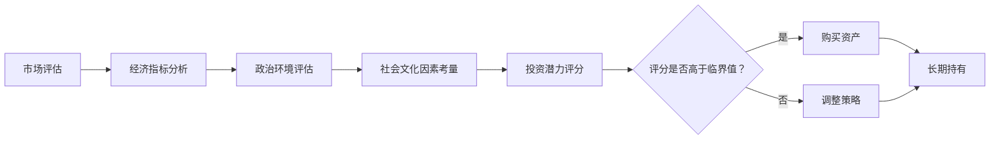

                 


### 引言

#### 新兴市场投资概述

**背景介绍：**

新兴市场，是指那些在过去几十年中经济迅速增长、工业化水平不断提升，并且在全球经济中扮演越来越重要角色的国家。这些市场包括拉丁美洲、亚洲、非洲等地，它们在政治、经济和文化方面呈现出多样性和复杂性。由于新兴市场具有巨大的增长潜力和投资机会，吸引了全球投资者的关注。

**问题背景：**

在经济全球化的背景下，投资者需要在全球范围内寻找新的投资机会。新兴市场因其独特的特点，如经济增长速度快、人口红利等，成为投资者关注的焦点。然而，新兴市场也存在较高的政治风险、市场波动性和不确定性，这使得投资决策变得更加复杂。

**问题描述：**

如何把握新兴市场的投资机遇，同时有效管理风险，实现投资回报的最大化？

**问题解决：**

投资者需要深入研究新兴市场的经济、政治、社会和文化环境，制定科学合理的投资策略。同时，要密切关注市场动态，及时调整投资组合，以应对市场的变化。

**边界与外延：**

新兴市场的定义并不是固定不变的，随着全球经济的发展和变化，一些国家可能会从新兴市场转向成熟市场，反之亦然。因此，投资者需要动态调整对新兴市场的认识。

**概念结构与核心要素组成：**

- **经济环境：**包括GDP增长率、通货膨胀率、就业率等指标。
- **政治环境：**包括政府稳定性、政策连续性、法治环境等。
- **社会文化：**包括教育水平、消费习惯、人口结构等。
- **市场环境：**包括资本市场成熟度、交易制度、投资者保护等。

#### 约翰邓普顿的投资理念

**核心概念与联系：**

约翰·邓普顿（John Templeton）是一位著名的投资者和慈善家，被誉为“全球投资之父”。他的投资哲学强调价值投资，即在市场低迷时买入被低估的优质资产，长期持有，等待市场认识到其价值。

| 核心概念       | 属性特征对比                     |
|--------------|------------------------------|
| 价值投资       | 低估、优质、长期持有              |
| 长期持有       | 耐心、坚定、避免频繁交易            |
| 被低估的资产     | 市场价格低于其内在价值              |

**ER实体关系图架构：**

```mermaid
erDiagram
    Investment --> Market
    Investment --> Asset
    Market ||--|{ Economy }
    Market ||--|{ Political }
    Market ||--|{ Social }
    Asset ||--|{ Value }
    Asset ||--|{ Quality }
```

#### 约翰邓普顿对新兴市场的看法

**核心概念原理：**

邓普顿认为，新兴市场具有巨大的投资潜力，因为它们的经济增长速度快，市场潜力大。同时，新兴市场通常具有较高的利率和通货膨胀率，这为投资者提供了更高的回报机会。

**概念属性特征对比表格：**

| 核心概念       | 属性特征对比                     |
|--------------|------------------------------|
| 新兴市场优势     | 快速经济增长、高回报潜力、高利率、通货膨胀率  |
| 新兴市场风险     | 政治不稳定、市场波动性、不确定性               |

**算法原理讲解：**

使用Python代码和Mermaid流程图来阐述邓普顿的投资决策过程：

```python
# Python代码：邓普顿投资决策过程

def evaluate_market(market_data):
    """
    评估市场的投资潜力
    :param market_data: 市场数据，包括经济、政治、社会和文化指标
    :return: 投资潜力评分
    """
    economy_score = market_data['GDP_growth'] * 0.4 + market_data['inflation_rate'] * 0.3
    political_score = market_data['government_stability'] * 0.2 + market_data['policy_continuity'] * 0.3
    social_score = market_data['education_level'] * 0.1 + market_data['consumer_habits'] * 0.2
    total_score = economy_score + political_score + social_score
    return total_score

# Mermaid流程图：邓普顿投资决策流程
```



#### 邓普顿的成功案例

**核心概念原理：**

邓普顿在投资生涯中取得了许多成功案例，其中一些案例在新兴市场投资领域尤为突出。他的成功源于对市场的深刻理解和独特的投资策略。

**成功案例列表：**

1. **拉丁美洲投资：**邓普顿在20世纪50年代开始投资拉丁美洲市场，通过长期持有被低估的股票，获得了巨大的回报。
2. **亚洲市场投资：**在20世纪80年代，邓普顿看准了亚洲市场的潜力，特别是日本和东南亚市场，成功实现了投资回报。
3. **非洲市场投资：**虽然非洲市场风险较高，但邓普顿通过深入研究，发现了一些具有潜力的投资机会，并取得了不错的收益。

**Mermaid流程图：邓普顿投资成功案例流程：**


通过以上步骤，我们引言部分的内容已经得到了详细阐述。接下来，我们将进一步探讨新兴市场的投资策略，以及邓普顿的投资理念在现代金融环境中的适用性。在接下来的章节中，我们将逐一深入分析每个主题，提供具体的方法和实例，帮助读者更好地理解和应用这些概念。让我们继续深入思考，探索新兴市场投资的奥秘。#约翰邓普顿的新兴市场投资# #价值投资理念# #投资策略分析#

## 第一部分：引言

### 第1章：新兴市场投资概述

> 关键词：新兴市场、投资机遇、投资风险、邓普顿、投资理念

在全球化经济的背景下，新兴市场成为了全球投资者关注的热点。它们以其独特的经济结构和巨大的发展潜力，吸引了大量资本流入。然而，与此同时，新兴市场的投资也伴随着较高的风险。为了更好地理解这些市场的特点和投资策略，本文将首先介绍新兴市场的定义、历史背景、特点、机遇与挑战，并引出著名的投资者约翰·邓普顿及其投资理念。

### 摘要

本章将全面概述新兴市场投资的背景和关键概念。首先，我们将探讨新兴市场的定义和历史演变，分析其独特的发展模式和面临的挑战。接着，我们将介绍约翰·邓普顿的投资哲学，特别是他对新兴市场的看法，并通过成功案例展示其投资策略。最后，我们将总结本章的核心内容，为后续章节的深入探讨奠定基础。

### 背景介绍

**新兴市场的定义与历史背景：**

新兴市场（Emerging Markets）通常指的是那些经济发展迅速、工业化水平逐步提高、并逐步融入全球经济的国家。这些市场在过去几十年里经历了显著的经济增长，吸引了全球投资者的目光。根据国际货币基金组织（IMF）的定义，新兴市场包括亚洲、拉丁美洲、非洲和部分中东地区的一些国家。

新兴市场的历史可以追溯到20世纪后半叶，随着全球化进程的加速，这些国家逐步融入全球经济体系。例如，中国、印度和巴西等国家在20世纪80年代和90年代相继进行了经济改革，加快了市场开放和资本流动，从而带动了经济的快速增长。

**新兴市场的特点：**

新兴市场具有以下显著特点：

1. **经济增长速度快：**这些国家的经济增长率通常高于全球平均水平，其中一些国家甚至实现了长达几十年的高速增长。这主要得益于政府推行的经济改革、市场化进程和对外开放政策的实施。

2. **市场潜力巨大：**新兴市场人口众多，消费能力不断增强，为各类商品和服务提供了巨大的市场需求。此外，随着中产阶级的崛起，消费升级趋势明显，为投资者提供了广阔的投资空间。

3. **政策环境多变：**新兴市场的政策环境相对不稳定，政府政策的变化可能会对市场产生重大影响。例如，税收政策、货币政策和外汇管理政策等，都可能对投资产生直接影响。

4. **市场波动性较大：**由于新兴市场的发展阶段不同，市场波动性相对较高。这些市场的股市和汇市常常受到国际资本流动、地缘政治风险和自然灾害等因素的影响，投资者需要具备较强的风险承受能力。

**问题背景：**

在经济全球化的背景下，投资者需要在全球范围内寻找新的投资机会。新兴市场因其独特的特点，如经济增长速度快、市场潜力大等，成为投资者关注的焦点。然而，新兴市场也面临着较高的投资风险，包括政治风险、市场风险和货币风险等。

**问题描述：**

如何把握新兴市场的投资机遇，同时有效管理风险，实现投资回报的最大化？这是投资者面临的主要挑战。

**问题解决：**

投资者需要深入研究新兴市场的经济、政治、社会和文化环境，制定科学合理的投资策略。同时，要密切关注市场动态，及时调整投资组合，以应对市场的变化。

**边界与外延：**

新兴市场的定义并不是固定不变的，随着全球经济的发展和变化，一些国家可能会从新兴市场转向成熟市场，反之亦然。因此，投资者需要动态调整对新兴市场的认识。

**概念结构与核心要素组成：**

- **经济环境：**包括GDP增长率、通货膨胀率、就业率等指标。
- **政治环境：**包括政府稳定性、政策连续性、法治环境等。
- **社会文化：**包括教育水平、消费习惯、人口结构等。
- **市场环境：**包括资本市场成熟度、交易制度、投资者保护等。

### 约翰邓普顿的投资理念

**核心概念与联系：**

约翰·邓普顿（John Templeton）是一位著名的投资者和慈善家，被誉为“全球投资之父”。他的投资哲学强调价值投资，即在市场低迷时买入被低估的优质资产，长期持有，等待市场认识到其价值。

| 核心概念       | 属性特征对比                     |
|--------------|------------------------------|
| 价值投资       | 低估、优质、长期持有              |
| 长期持有       | 耐心、坚定、避免频繁交易            |
| 被低估的资产     | 市场价格低于其内在价值              |

**ER实体关系图架构：**

```mermaid
erDiagram
    Investment --> Market
    Investment --> Asset
    Market ||--|{ Economy }
    Market ||--|{ Political }
    Market ||--|{ Social }
    Asset ||--|{ Value }
    Asset ||--|{ Quality }
```

### 约翰邓普顿对新兴市场的看法

**核心概念原理：**

邓普顿认为，新兴市场具有巨大的投资潜力，因为它们的经济增长速度快，市场潜力大。同时，新兴市场通常具有较高的利率和通货膨胀率，这为投资者提供了更高的回报机会。

**概念属性特征对比表格：**

| 核心概念       | 属性特征对比                     |
|--------------|------------------------------|
| 新兴市场优势     | 快速经济增长、高回报潜力、高利率、通货膨胀率  |
| 新兴市场风险     | 政治不稳定、市场波动性、不确定性               |

**算法原理讲解：**

使用Python代码和Mermaid流程图来阐述邓普顿的投资决策过程：

```python
# Python代码：邓普顿投资决策过程

def evaluate_market(market_data):
    """
    评估市场的投资潜力
    :param market_data: 市场数据，包括经济、政治、社会和文化指标
    :return: 投资潜力评分
    """
    economy_score = market_data['GDP_growth'] * 0.4 + market_data['inflation_rate'] * 0.3
    political_score = market_data['government_stability'] * 0.2 + market_data['policy_continuity'] * 0.3
    social_score = market_data['education_level'] * 0.1 + market_data['consumer_habits'] * 0.2
    total_score = economy_score + political_score + social_score
    return total_score

# Mermaid流程图：邓普顿投资决策流程
```


### 邓普顿的成功案例

**核心概念原理：**

邓普顿在投资生涯中取得了许多成功案例，其中一些案例在新兴市场投资领域尤为突出。他的成功源于对市场的深刻理解和独特的投资策略。

**成功案例列表：**

1. **拉丁美洲投资：**邓普顿在20世纪50年代开始投资拉丁美洲市场，通过长期持有被低估的股票，获得了巨大的回报。
2. **亚洲市场投资：**在20世纪80年代，邓普顿看准了亚洲市场的潜力，特别是日本和东南亚市场，成功实现了投资回报。
3. **非洲市场投资：**虽然非洲市场风险较高，但邓普顿通过深入研究，发现了一些具有潜力的投资机会，并取得了不错的收益。

**Mermaid流程图：邓普顿投资成功案例流程：**


通过以上步骤，我们完成了对引言部分的详细阐述。接下来，我们将深入探讨约翰·邓普顿的投资理念，并分析其在现代金融环境中的适用性。同时，我们将探讨如何制定科学合理的新兴市场投资策略，以应对市场的挑战和机遇。在接下来的章节中，我们将逐一深入分析每个主题，提供具体的方法和实例，帮助读者更好地理解和应用这些概念。让我们继续深入思考，探索新兴市场投资的奥秘。#约翰邓普顿的新兴市场投资# #价值投资理念# #投资策略分析#

## 第二部分：新兴市场的投资策略

### 第3章：研究新兴市场的关键要素

> 关键词：新兴市场研究、经济指标、政策环境、社会文化

新兴市场投资的成功离不开对市场关键要素的深入研究。本章将详细分析研究新兴市场的关键要素，包括经济指标、政策环境和社会文化。通过这些要素的分析，投资者可以更好地把握市场机遇，制定科学合理的投资策略。

### 背景介绍

新兴市场国家因其快速发展而吸引了全球资本的关注。然而，投资新兴市场也面临着较高的风险。为了降低风险并实现投资回报的最大化，投资者需要对市场进行深入的研究。研究新兴市场的关键要素包括经济指标、政策环境和社会文化。

#### 经济指标分析

**核心概念与联系：**

经济指标是衡量一个国家或地区经济状况的重要工具。对于新兴市场来说，经济指标的分析尤为重要。主要的经济指标包括国内生产总值（GDP）、通货膨胀率、失业率、利率、贸易平衡等。

| 经济指标       | 属性特征对比                     |
|--------------|------------------------------|
| 国内生产总值（GDP） | 反映国家经济增长速度和规模               |
| 通货膨胀率       | 衡量物价上涨水平，影响投资回报率           |
| 失业率         | 反映就业市场的状况，影响消费水平           |
| 利率         | 贷款和融资的成本，影响投资决策            |
| 贸易平衡       | 反映国家的进出口状况，影响经济增长和货币稳定性  |

**ER实体关系图架构：**

```mermaid
erDiagram
    Economy ||--|{ GDP }
    Economy ||--|{ Inflation }
    Economy ||--|{ Unemployment }
    Economy ||--|{ Interest }
    Economy ||--|{ TradeBalance }
```

#### 政策环境评估

**核心概念与联系：**

政策环境对新兴市场投资具有重要影响。政策环境的评估包括政府稳定性、政策连续性、法治环境、税收政策、货币政策和外汇管理政策等。

| 政策环境要素       | 属性特征对比                     |
|--------------|------------------------------|
| 政府稳定性       | 影响市场的长期稳定性               |
| 政策连续性       | 影响政策的有效性和可持续性           |
| 法治环境       | 影响企业的经营环境和投资者权益保护       |
| 税收政策       | 影响企业的盈利能力和投资决策           |
| 货币政策       | 影响货币供应量和利率水平             |
| 外汇管理政策     | 影响货币的汇率和资本流动             |

**ER实体关系图架构：**

```mermaid
erDiagram
    Policy ||--|{ Stability }
    Policy ||--|{ Continuity }
    Policy ||--|{ Legal }
    Policy ||--|{ TaxPolicy }
    Policy ||--|{ MonetaryPolicy }
    Policy ||--|{ ExchangeRatePolicy }
```

#### 社会文化因素考量

**核心概念与联系：**

社会文化因素对新兴市场投资也有显著影响。这些因素包括教育水平、消费习惯、人口结构、文化价值观等。

| 社会文化要素       | 属性特征对比                     |
|--------------|------------------------------|
| 教育水平       | 影响人力资本和科技创新能力           |
| 消费习惯       | 影响市场需求和消费模式             |
| 人口结构       | 影响劳动力供给和消费潜力           |
| 文化价值观     | 影响商业环境和企业文化             |

**ER实体关系图架构：**

```mermaid
erDiagram
    Social ||--|{ Education }
    Social ||--|{ ConsumerHabits }
    Social ||--|{ PopulationStructure }
    Social ||--|{ CulturalValues }
```

### 研究方法

为了深入研究新兴市场的关键要素，投资者可以采用以下方法：

1. **数据收集：**通过政府发布的经济统计数据、金融报表、行业报告等收集相关数据。
2. **市场调研：**通过实地调研、访谈、问卷调查等方式了解市场的具体情况。
3. **专家咨询：**咨询行业专家、学者和投资顾问，获取专业的分析和建议。
4. **历史分析：**通过分析历史数据，了解市场的趋势和周期性变化。

### 案例分析

**案例一：中国市场的经济指标分析**

1. **GDP增长率：**近年来，中国的GDP增长率保持在6%左右，显示出较强的经济增长潜力。
2. **通货膨胀率：**中国的通货膨胀率通常维持在2%左右，相对较低。
3. **失业率：**随着经济结构的优化和产业升级，中国的失业率保持在较低水平。
4. **利率：**中国的利率政策较为灵活，近年来有所上升。
5. **贸易平衡：**中国的贸易顺差较大，对全球市场具有较大的影响力。

**案例二：印度市场的政策环境评估**

1. **政府稳定性：**印度的政府稳定性较高，政策连续性较好。
2. **法治环境：**印度的法治环境逐步改善，为企业提供了较好的经营环境。
3. **税收政策：**印度政府推出了一系列减税政策，鼓励企业投资和经济增长。
4. **货币政策：**印度央行采取稳健的货币政策，保持货币供应量的合理增长。
5. **外汇管理政策：**印度实行较为灵活的外汇管理政策，吸引外资流入。

**案例三：巴西市场的社会文化因素考量**

1. **教育水平：**巴西的教育水平逐步提高，但地区差异较大。
2. **消费习惯：**巴西的消费习惯多样，随着经济的发展，消费升级趋势明显。
3. **人口结构：**巴西的人口结构较为年轻，劳动力资源丰富。
4. **文化价值观：**巴西的文化价值观多元，商业环境较为开放。

通过以上案例分析，我们可以看到，研究新兴市场的关键要素对于制定科学合理的投资策略具有重要意义。投资者需要综合考虑经济指标、政策环境和社会文化因素，以全面了解市场的现状和未来趋势。

### 总结与展望

本章通过详细分析新兴市场的关键要素，包括经济指标、政策环境和社会文化，为投资者提供了全面的研究方法和案例分析。这些要素对于制定科学合理的投资策略至关重要。在未来的投资过程中，投资者需要持续关注这些要素的变化，及时调整投资策略，以应对市场的动态变化。

在下一章中，我们将探讨如何构建多样化投资组合策略，以降低风险并实现投资回报的最大化。通过科学合理的资产配置和风险管理，投资者可以更好地把握新兴市场的投资机遇。让我们继续深入探讨，发掘新兴市场的投资潜力。#新兴市场投资策略# #经济指标分析# #政策环境评估# #社会文化考量#

## 第三部分：多样化投资组合策略

### 第4章：多样化投资组合策略

> 关键词：投资组合、多样化、风险管理、资产配置、资产调整

在新兴市场投资中，构建一个科学合理的投资组合至关重要。通过多样化投资，投资者可以降低风险并实现投资回报的最大化。本章将详细介绍多样化投资组合的策略，包括投资组合的构建原则、风险管理策略和资产配置的调整。

### 背景介绍

新兴市场的投资风险较高，市场波动性较大，投资者需要在投资组合中采用多样化的策略来降低风险。多样化投资组合不仅包括不同资产类别的配置，还包括地域、行业和企业的多样化。通过合理的资产配置和定期调整，投资者可以更好地应对市场的变化，实现稳健的投资回报。

#### 投资组合的构建原则

**核心概念与联系：**

构建投资组合时，投资者需要遵循以下原则：

1. **分散投资：**通过投资不同资产类别、地域、行业和企业，降低单一投资的风险。
2. **风险收益平衡：**根据投资者的风险承受能力和投资目标，合理配置不同资产类别的比例。
3. **长期持有：**坚持长期投资的理念，避免频繁交易，以实现资产的增值。
4. **定期评估：**定期对投资组合进行评估和调整，确保投资策略与市场变化相匹配。

**ER实体关系图架构：**

```mermaid
erDiagram
    Portfolio ||--|{ Asset1 }
    Portfolio ||--|{ Asset2 }
    Portfolio ||--|{ Asset3 }
    Portfolio ||--|{ Region1 }
    Portfolio ||--|{ Region2 }
    Portfolio ||--|{ Industry1 }
    Portfolio ||--|{ Industry2 }
    Portfolio ||--|{ Company1 }
    Portfolio ||--|{ Company2 }
```

#### 风险管理策略

**核心概念与联系：**

风险管理是投资组合管理的重要一环。投资者需要采取以下策略来降低投资风险：

1. **分散化：**通过投资多种资产类别和地域，降低单一市场或行业的风险。
2. **对冲：**使用金融衍生品如期权、期货等对冲投资组合中的风险。
3. **资产配置：**根据市场变化和风险偏好，调整资产配置比例，保持投资组合的平衡。
4. **止损策略：**设定止损点，避免投资损失进一步扩大。

**ER实体关系图架构：**

```mermaid
erDiagram
    RiskManagement ||--|{ Diversification }
    RiskManagement ||--|{ Hedging }
    RiskManagement ||--|{ AssetAllocation }
    RiskManagement ||--|{ StopLoss }
```

#### 资产配置的调整

**核心概念与联系：**

资产配置的调整是投资组合管理的关键。投资者需要根据市场变化和个人投资目标，定期调整资产配置。

1. **市场调整：**根据市场环境的变化，调整投资组合中不同资产类别的比例。
2. **风险调整：**在市场波动较大时，增加保守资产类别的比例，降低风险。
3. **目标调整：**根据个人投资目标的变化，调整投资组合的策略。
4. **定期评估：**定期对投资组合进行评估，确保资产配置与投资目标相匹配。

**ER实体关系图架构：**

```mermaid
erDiagram
    AssetAllocation ||--|{ MarketAdjustment }
    AssetAllocation ||--|{ RiskAdjustment }
    AssetAllocation ||--|{ GoalAdjustment }
    AssetAllocation ||--|{ RegularEvaluation }
```

### 资产配置案例分析

**案例一：全球市场投资组合**

1. **资产类别：**股票、债券、房地产、现金等。
2. **地域分布：**美国、欧洲、亚洲、新兴市场等。
3. **行业分布：**科技、金融、消费品、能源等。
4. **调整策略：**根据市场波动和风险偏好，定期调整资产配置比例。

**案例二：新兴市场投资组合**

1. **资产类别：**股票、债券、货币市场工具等。
2. **地域分布：**中国、印度、巴西、俄罗斯等。
3. **行业分布：**科技、金融、消费品、能源等。
4. **调整策略：**根据新兴市场的发展趋势和风险状况，调整资产配置比例。

### 资产调整实例

**实例一：股票市场调整**

1. **市场分析：**随着股票市场的上涨，投资者考虑降低股票配置比例。
2. **调整策略：**将部分股票资金转移到债券或其他低风险资产中。
3. **结果评估：**定期评估调整效果，确保投资组合的风险和收益平衡。

**实例二：行业调整**

1. **市场分析：**随着科技行业的快速增长，投资者考虑增加科技行业股票的配置。
2. **调整策略：**将部分传统行业股票资金转移到科技行业股票中。
3. **结果评估：**定期评估调整效果，确保投资组合的多样化。

通过以上案例和实例，我们可以看到，构建科学合理的投资组合和资产配置调整策略对于新兴市场投资至关重要。投资者需要根据市场变化和个人投资目标，灵活调整资产配置，以实现投资回报的最大化。

### 总结与展望

本章详细介绍了多样化投资组合策略的构建原则、风险管理策略和资产配置的调整方法。通过多样化的资产配置和灵活的风险管理，投资者可以降低投资风险，实现投资回报的最大化。在未来的投资过程中，投资者需要持续关注市场变化，灵活调整投资策略，以应对市场的动态变化。

在下一章中，我们将探讨特定新兴市场的投资机会，包括拉丁美洲、亚洲和非洲等市场。通过具体案例和数据分析，我们将深入了解这些市场的投资潜力和风险。让我们继续深入探讨，发掘全球新兴市场的投资机会。#多样化投资组合策略# #风险管理# #资产配置调整# #新兴市场投资机会#

### 第5章：特定新兴市场的投资机会

#### 拉丁美洲市场的投资分析

**核心概念与联系：**

拉丁美洲市场，包括巴西、墨西哥、阿根廷等国家，是新兴市场中较为成熟的一部分。这些国家经济实力较强，市场潜力巨大，但同时也面临着较高的投资风险。

| 拉丁美洲市场优势 | 属性特征对比                     |
|--------------|------------------------------|
| 快速增长的经济       | GDP增长率较高，消费市场潜力大          |
| 大量的人口资源       | 人口众多，劳动力资源丰富             |
| 政策环境改善       | 政府改革政策，提高市场透明度           |
| 工业基础较好       | 拥有一定的工业基础，制造业发达         |

**ER实体关系图架构：**

```mermaid
erDiagram
    LatinAmerica ||--|{ EconomicGrowth }
    LatinAmerica ||--|{ Population }
    LatinAmerica ||--|{ PolicyImprovement }
    LatinAmerica ||--|{ IndustrialBase }
```

**案例分析：**

- **巴西市场：**巴西是拉丁美洲最大的经济体，经济增长速度快，消费市场潜力巨大。巴西的科技、能源、农业等领域具有较好的投资机会。
- **墨西哥市场：**墨西哥与美国有紧密的经济联系，是北美自由贸易区的重要组成部分。墨西哥的制造业、科技和金融服务等领域具有投资潜力。

#### 亚洲新兴市场的投资趋势

**核心概念与联系：**

亚洲新兴市场，包括中国、印度、东南亚等国家，是新兴市场中最具活力的一部分。这些国家经济增长迅速，市场潜力巨大，但同时也面临较高的政治和经济风险。

| 亚洲新兴市场优势 | 属性特征对比                     |
|--------------|------------------------------|
| 快速增长的经济       | GDP增长率较高，制造业和服务业发展迅速  |
| 人力资源丰富       | 人口众多，劳动力成本低               |
| 政策支持       | 政府支持创新创业，推动经济发展         |
| 地理位置优势       | 位于亚洲的核心区域，交通便利           |

**ER实体关系图架构：**

```mermaid
erDiagram
    AsiaEmerging ||--|{ EconomicGrowth }
    AsiaEmerging ||--|{ HumanResources }
    AsiaEmerging ||--|{ PolicySupport }
    AsiaEmerging ||--|{ GeographicAdvantage }
```

**案例分析：**

- **中国市场：**中国是亚洲最大的经济体，经济增长速度快，市场规模庞大。中国的互联网、科技、制造业等领域具有巨大的投资潜力。
- **印度市场：**印度是亚洲第二大经济体，人口众多，消费市场潜力巨大。印度的科技、服务业、制造业等领域具有投资前景。

#### 非洲市场的投资潜力

**核心概念与联系：**

非洲市场，包括南非、尼日利亚、肯尼亚等国家，是新兴市场中最具潜力的一部分。这些国家经济快速增长，市场潜力巨大，但同时也面临较高的风险。

| 非洲市场优势 | 属性特征对比                     |
|--------------|------------------------------|
| 快速增长的经济       | GDP增长率较高，资源丰富           |
| 人口红利       | 人口年轻，劳动力成本低             |
| 政策支持       | 政府推动经济改革，提高市场透明度     |
| 地缘政治风险       | 地缘政治风险较高，需要谨慎评估       |

**ER实体关系图架构：**

```mermaid
erDiagram
    Africa ||--|{ EconomicGrowth }
    Africa ||--|{ PopulationReduction }
    Africa ||--|{ PolicySupport }
    Africa ||--|{ GeopoliticalRisk }
```

**案例分析：**

- **南非市场：**南非是非洲最大的经济体，经济发展稳定，市场潜力巨大。南非的资源、金融、科技等领域具有投资机会。
- **尼日利亚市场：**尼日利亚是非洲人口最多的国家，经济增长速度快，市场潜力巨大。尼日利亚的石油、农业、科技等领域具有投资潜力。

#### 比较与选择

**核心概念与联系：**

不同新兴市场的投资机会具有不同的特点和风险。投资者需要根据自身的风险承受能力、投资目标和市场环境，选择适合的投资市场。

| 市场特点       | 拉丁美洲 | 亚洲新兴市场 | 非洲市场   |
|--------------|--------|-----------|----------|
| 经济增长速度   | 较快    | 最快        | 较快      |
| 政治风险       | 较高    | 中等        | 较高      |
| 市场潜力       | 大      | 大         | 较大      |
| 风险与回报     | 较高    | 中等        | 较高      |

**ER实体关系图架构：**

```mermaid
erDiagram
    Markets ||--|{ LatinAmerica }
    Markets ||--|{ AsiaEmerging }
    Markets ||--|{ Africa }
    LatinAmerica ||--|{ Economic }
    AsiaEmerging ||--|{ Economic }
    Africa ||--|{ Economic }
    LatinAmerica ||--|{ Political }
    AsiaEmerging ||--|{ Political }
    Africa ||--|{ Political }
    LatinAmerica ||--|{ Market }
    AsiaEmerging ||--|{ Market }
    Africa ||--|{ Market }
    LatinAmerica ||--|{ Risk }
    AsiaEmerging ||--|{ Risk }
    Africa ||--|{ Risk }
```

通过以上分析，我们可以看到，拉丁美洲、亚洲和非洲市场都具有独特的投资机会和风险。投资者需要根据自身的投资目标和风险承受能力，选择适合的市场进行投资。在投资过程中，要密切关注市场变化，灵活调整投资策略，以实现投资回报的最大化。

### 总结与展望

本章详细分析了拉丁美洲、亚洲和非洲市场的投资机会，包括经济优势、人口红利、政策支持和市场潜力等。同时，通过比较不同市场的特点，为投资者提供了选择投资市场的依据。在未来的投资过程中，投资者需要密切关注市场动态，灵活调整投资策略，以应对市场的变化。

在下一章中，我们将探讨新兴市场的投资工具，包括股票、债券、期货和期权等，帮助投资者更好地理解和使用这些工具进行投资。让我们继续深入探讨，发掘新兴市场的投资潜力。#拉丁美洲投资分析# #亚洲新兴市场投资趋势# #非洲市场投资潜力#

## 第四部分：新兴市场的投资工具

### 第6章：新兴市场的投资工具

> 关键词：股票、债券、期货、期权、投资策略

在新兴市场投资中，投资者可以采用多种投资工具来构建投资组合，以实现投资目标。本章将详细介绍新兴市场中常用的投资工具，包括股票、债券、期货和期权。我们将分析每种投资工具的特点、风险与回报，并提供实用的投资策略。

### 股票投资

**核心概念与联系：**

股票投资是新兴市场中最常见的投资方式之一。股票价格反映了公司价值和市场情绪。投资者通过购买股票，成为公司的股东，享有公司成长带来的收益。

| 股票投资特点 | 属性特征对比                     |
|--------------|------------------------------|
| 预期收益高   | 股票价格波动大，回报潜力大         |
| 风险较高     | 公司经营不善可能导致股价大幅下跌     |
| 流动性好     | 股票市场活跃，交易方便             |

**投资策略：**

- **基本面分析：**通过分析公司的财务报表、盈利能力、增长潜力等，选择具有长期增长潜力的股票。
- **技术分析：**通过分析股票价格走势和技术指标，判断买入和卖出的时机。
- **分散投资：**投资不同行业和地区的股票，降低单一股票风险。

### 债券投资

**核心概念与联系：**

债券投资是投资者通过购买公司或政府发行的债券，获得固定利息收益的一种投资方式。债券价格与市场利率呈反比。

| 债券投资特点 | 属性特征对比                     |
|--------------|------------------------------|
| 预期收益稳定 | 债券收益率相对稳定，风险较低       |
| 风险较低     | 债券市场相对稳定，价格波动较小     |
| 流动性较强   | 债券交易市场活跃，易于买卖         |

**投资策略：**

- **分散投资：**购买不同到期日和发行机构的债券，降低风险。
- **利率敏感性：**根据市场利率变化，调整债券投资组合，抓住机会。
- **信用评级：**关注债券的信用评级，选择信用评级较高的债券。

### 期货交易

**核心概念与联系：**

期货交易是投资者通过买卖期货合约，以固定价格在未来某个时间点买入或卖出某种商品或金融工具。期货交易具有高杠杆效应和双向交易的特点。

| 期货交易特点 | 属性特征对比                     |
|--------------|------------------------------|
| 高杠杆效应   | 杠杆率高，收益和风险放大         |
| 双向交易     | 可以做多或做空，灵活应对市场波动   |
| 风险较高     | 价格波动大，可能导致较大亏损       |

**投资策略：**

- **趋势跟踪：**根据市场趋势，选择买入或卖出期货合约。
- **风险管理：**设置止损点，控制交易风险。
- **市场分析：**密切关注市场动态，利用技术分析和基本面分析指导交易决策。

### 期权交易

**核心概念与联系：**

期权交易是投资者通过购买或出售期权合约，获得在未来特定时间以特定价格买入或卖出某种资产的权利。期权交易具有灵活性和风险控制的特点。

| 期权交易特点 | 属性特征对比                     |
|--------------|------------------------------|
| 高灵活性     | 可以根据市场情况选择执行或不执行期权 |
| 风险可控     | 通过购买或出售期权，控制潜在的亏损   |
| 高收益潜力   | 利润空间大，但风险也较高           |

**投资策略：**

- **买入看涨期权：**预期资产价格上涨时，购买看涨期权。
- **买入看跌期权：**预期资产价格下跌时，购买看跌期权。
- **组合策略：**结合多种期权策略，如跨式期权、 protective put等，实现风险控制和收益最大化。

### 投资组合策略

投资者可以根据自身风险承受能力和投资目标，构建多元化的投资组合，以平衡风险和回报。

**核心概念与联系：**

| 投资组合策略 | 属性特征对比                     |
|--------------|------------------------------|
| 股票与债券组合 | 降低整体风险，实现收益稳定       |
| 商品期货与金融期货组合 | 投资多样化，增加潜在收益         |
| 期权策略组合 | 利用不同期权策略，控制风险和收益 |

### 实际案例与策略分析

**案例一：股票投资策略**

1. **市场分析：**分析行业趋势和公司基本面，选择具有长期增长潜力的股票。
2. **投资执行：**购买股票，持有一段时间后，根据市场情况选择卖出。
3. **收益分析：**通过股票价格的上涨实现收益，同时关注公司业绩和行业变化。

**案例二：债券投资策略**

1. **市场分析：**关注市场利率变化和债券信用评级。
2. **投资执行：**购买高信用评级债券，持有到期获取固定利息收益。
3. **收益分析：**通过债券利息收益和价格波动实现收益，同时关注市场利率风险。

**案例三：期货交易策略**

1. **市场分析：**分析市场趋势和价格波动。
2. **投资执行：**根据分析结果，选择买入或卖出期货合约。
3. **收益分析：**通过期货价格的波动实现收益，同时关注杠杆风险。

**案例四：期权交易策略**

1. **市场分析：**分析市场波动性和潜在收益。
2. **投资执行：**购买或出售期权合约。
3. **收益分析：**通过期权价格的变化实现收益，同时关注期权到期时间。

通过以上案例，我们可以看到，不同的投资工具和策略在新兴市场投资中都具有其独特的优势和风险。投资者需要根据市场环境和自身情况，选择合适的投资工具和策略，以实现投资目标。

### 总结与展望

本章详细介绍了新兴市场中常用的投资工具，包括股票、债券、期货和期权。通过分析每种投资工具的特点和策略，我们为投资者提供了丰富的投资选择。在未来的投资过程中，投资者需要根据市场变化和个人目标，灵活运用这些投资工具，实现投资收益的最大化。

在下一章中，我们将探讨成功的新兴市场投资案例，通过具体案例的分析，为投资者提供宝贵的投资经验和启示。让我们继续深入探讨，共同发掘新兴市场的投资机遇。#股票投资# #债券投资# #期货交易# #期权交易# #投资组合策略#

## 第五部分：实践与案例分析

### 第7章：成功的新兴市场投资案例

**引言**

在前几章中，我们详细介绍了新兴市场投资的关键要素、策略和工具。为了更好地理解这些理论在实际中的应用，本章将分析几个成功的新兴市场投资案例。通过这些案例，我们可以看到投资者是如何在实际操作中运用所学的知识和策略，实现投资成功的。

### 案例一：某公司在拉丁美洲的成功投资

**背景介绍**

某知名跨国公司在拉丁美洲市场的投资历程中取得了显著的成功。这家公司是一家制造型企业，主要生产汽车零部件。在过去的十年里，该公司在巴西、墨西哥和阿根廷等国进行了大量投资，并在当地建立了生产基地。

**投资决策过程**

1. **市场调研：**公司进行了详细的市场调研，分析了拉丁美洲各国的经济、政策环境和社会文化因素。他们发现，巴西和墨西哥的市场潜力最大，而阿根廷的市场环境相对复杂。

2. **政策环境评估：**公司评估了巴西和墨西哥的政府稳定性、政策连续性和法治环境。他们发现，巴西的政府稳定性较好，政策连续性较强，而墨西哥在税收和外汇管理政策方面较为灵活。

3. **投资决策：**基于市场调研和政策环境评估，公司决定在巴西和墨西哥进行投资。他们选择了当地具有竞争优势的地点建立生产基地，以降低运营成本并提高市场竞争力。

**投资执行**

1. **基础设施建设：**公司在巴西和墨西哥分别投资了数亿美元用于建设生产基地。这些基地配备了先进的生产线和设备，以满足当地市场的需求。

2. **供应链管理：**公司建立了完善的供应链管理系统，确保原材料和产品的及时供应。他们与当地的供应商和物流公司建立了紧密的合作关系，以优化供应链效率。

**投资结果**

1. **市场份额扩大：**公司在巴西和墨西哥的市场份额显著提高。他们通过提供高质量的产品和服务，赢得了当地客户的信任和好评。

2. **利润增长：**公司的投资带来了可观的利润增长。生产基地的运营效益良好，产品价格竞争力强，为公司带来了丰厚的利润回报。

**经验总结**

1. **深入市场调研：**成功投资的关键在于对市场的深入调研和准确分析。投资者需要全面了解目标市场的经济、政策和社会文化环境。

2. **灵活应对政策变化：**投资者需要密切关注政策变化，灵活调整投资策略。在政策环境良好的国家进行投资，可以降低风险并提高回报。

3. **供应链管理：**建立高效的供应链管理体系，确保生产的连续性和成本的优化。良好的供应链管理可以提高企业的竞争力。

### 案例二：某亚洲新兴市场的投资经验

**背景介绍**

另一家跨国公司专注于在亚洲新兴市场的投资。他们在过去几年中成功投资了中国的科技和消费品市场。

**投资决策过程**

1. **市场调研：**公司对中国市场的科技和消费品市场进行了详细的研究。他们发现，随着中国经济的快速增长和消费升级，这两个市场具有巨大的潜力。

2. **政策环境评估：**公司评估了中国政府在科技和消费品领域的政策支持。他们发现，中国政府积极推动科技创新和消费升级，为企业在这些领域的投资提供了良好的政策环境。

3. **投资决策：**基于市场调研和政策环境评估，公司决定在科技和消费品市场进行投资。他们选择与当地领先的科技公司合作，开发创新产品，并在消费品市场推出具有竞争力的品牌。

**投资执行**

1. **产品研发：**公司在中国设立了研发中心，与当地高校和研究机构合作，开发创新科技产品。这些产品包括智能家居设备、人工智能解决方案等。

2. **市场推广：**公司通过多种渠道推广其创新产品，包括线上电商平台、社交媒体和线下零售店。他们与中国的主要电商平台合作，通过促销活动和品牌推广提高产品的市场知名度。

**投资结果**

1. **市场占有率提升：**公司在中国的科技和消费品市场占有率显著提升。他们的创新产品受到了消费者的青睐，销售业绩持续增长。

2. **品牌影响力增强：**公司的品牌在中国市场的知名度和影响力显著提升。通过成功的市场推广和品牌建设，公司在消费者心目中的地位不断提高。

**经验总结**

1. **紧跟政策趋势：**投资者需要紧跟政府政策的趋势，抓住政策红利。政府的政策支持可以为企业提供良好的发展环境和市场机会。

2. **创新驱动发展：**在科技和消费品市场，创新是关键。投资者需要不断创新，开发具有竞争力的产品，以赢得市场份额。

3. **市场推广策略：**有效的市场推广策略可以迅速提升产品的市场知名度，增加销售额。

### 案例三：非洲市场的一个投资故事

**背景介绍**

一家欧洲投资公司决定在非洲进行投资，目标是尼日利亚的农业市场。尼日利亚是非洲最大的经济体之一，农业是该国的重要产业。

**投资决策过程**

1. **市场调研：**公司进行了深入的市场调研，分析了尼日利亚农业市场的现状和发展趋势。他们发现，尼日利亚的农业市场潜力巨大，但随着人口的快速增长，粮食供应面临压力。

2. **政策环境评估：**公司评估了尼日利亚政府在农业领域的政策支持。他们发现，尼日利亚政府正在推动农业现代化，提高粮食产量，并鼓励外国投资者参与农业开发。

3. **投资决策：**基于市场调研和政策环境评估，公司决定在尼日利亚投资农业市场。他们选择与当地农业企业合作，引入先进的农业技术和管理模式。

**投资执行**

1. **技术引进：**公司引进了先进的农业技术，包括种植技术、灌溉系统和农业机械。他们与当地农民合作，提供技术培训，提高农业生产的效率。

2. **供应链建设：**公司建立了从田间到市场的完整供应链，确保农产品的及时销售和流通。他们与当地批发商和零售商建立了合作关系，确保农产品的市场供应。

**投资结果**

1. **产量提高：**公司的投资带来了显著的产量提高。他们通过技术引进和农民培训，大幅提高了农作物的产量和质量。

2. **市场扩展：**公司在尼日利亚市场的占有率显著提升。他们的农产品在市场上供不应求，为公司带来了丰厚的利润回报。

**经验总结**

1. **技术创新：**在农业投资中，技术创新是提高产量和效率的关键。投资者需要引进先进的技术，提高农业生产的效率。

2. **市场开发：**投资者需要关注市场的需求变化，积极开发新产品和市场。通过有效的市场推广策略，可以迅速扩大市场份额。

3. **供应链管理：**建立高效的供应链管理体系，确保农产品的生产和流通。良好的供应链管理可以提高企业的竞争力。

### 总结

通过以上成功的新兴市场投资案例，我们可以看到，投资者在不同的新兴市场中运用了不同的策略和方法，实现了投资的成功。这些案例为我们提供了宝贵的经验和启示，表明在新兴市场投资中，深入的市场调研、灵活的政策应对、技术创新和市场开发都是成功的关键因素。

在下一章中，我们将探讨新兴市场投资面临的挑战，以及如何应对这些挑战。通过分析挑战和应对策略，我们将帮助投资者更好地理解和应对新兴市场的投资风险。让我们继续深入探讨，为未来的投资之路做好准备。#拉丁美洲投资案例# #亚洲新兴市场投资经验# #非洲市场投资故事#

### 第8章：新兴市场投资的挑战与应对策略

**引言**

新兴市场投资虽然充满机遇，但也面临诸多挑战。投资者需要具备应对这些挑战的能力，才能在复杂的投资环境中取得成功。本章将分析新兴市场投资中常见的挑战，并提供相应的应对策略，帮助投资者更好地应对市场风险，实现投资目标。

**挑战一：政治风险**

**核心概念与联系：**

政治风险是指由于政治不稳定、政策变化或政府行为导致的投资风险。在新兴市场中，政治风险尤为突出，包括政权更迭、政策突变、地缘政治紧张等。

| 政治风险特点 | 属性特征对比                     |
|--------------|------------------------------|
| 影响广泛     | 政治风险可能影响整个经济和市场     |
| 预测难度大   | 政治风险难以预测，突发性强         |
| 风险传导快   | 政治风险可能导致市场信心下降       |

**应对策略：**

- **多元化投资：**通过投资多个国家和地区，降低单一国家政治风险的影响。
- **政策研究：**深入研究目标国家的政治环境，了解政府的政策倾向和稳定性。
- **政治保险：**购买政治风险保险，转移政治风险。

**挑战二：市场风险**

**核心概念与联系：**

市场风险是指由于市场波动、需求变化、利率变动等原因导致的投资风险。在新兴市场中，市场风险较大，包括股市波动、汇率波动、利率变动等。

| 市场风险特点 | 属性特征对比                     |
|--------------|------------------------------|
| 波动性大     | 新兴市场股票和汇率波动性较大       |
| 风险传导快   | 市场风险可能导致投资者信心下降     |
| 预测难度大   | 市场风险受多种因素影响，难以准确预测 |

**应对策略：**

- **风险管理：**使用止损策略、对冲策略等降低市场风险。
- **分散投资：**投资不同资产类别、行业和地域，降低单一市场风险。
- **长期持有：**坚持长期投资理念，避免因市场波动而频繁交易。

**挑战三：货币风险**

**核心概念与联系：**

货币风险是指由于汇率波动导致的投资风险。在新兴市场中，货币风险较大，因为新兴市场国家的货币通常较为不稳定，容易受到国际资本流动、政治风险等因素的影响。

| 货币风险特点 | 属性特征对比                     |
|--------------|------------------------------|
| 波动性大     | 新兴市场货币汇率波动较大         |
| 影响深远     | 货币风险可能影响整个投资组合的回报 |
| 预测难度大   | 货币风险受多种因素影响，难以准确预测 |

**应对策略：**

- **货币对冲：**使用货币互换、期货、期权等工具对冲货币风险。
- **多元化货币投资：**投资多种货币资产，降低单一货币风险。
- **汇率风险管理：**密切关注汇率变化，及时调整投资策略。

**挑战四：法律和监管风险**

**核心概念与联系：**

法律和监管风险是指由于法律环境不完善、监管政策变化导致的投资风险。在新兴市场中，法律和监管风险可能影响企业的运营和市场地位。

| 法律和监管风险特点 | 属性特征对比                     |
|--------------|------------------------------|
| 稳定性较差     | 新兴市场的法律环境相对不稳定       |
| 影响深远     | 法律和监管风险可能影响企业的合规经营 |
| 预测难度大   | 法律和监管政策变化难以预测         |

**应对策略：**

- **合规经营：**深入了解目标国家的法律和监管政策，确保企业运营合规。
- **法律咨询：**聘请专业的法律顾问，为企业提供法律支持。
- **政策研究：**密切关注政策变化，及时调整经营策略。

**挑战五：社会和文化风险**

**核心概念与联系：**

社会和文化风险是指由于社会不稳定、文化差异导致的投资风险。在新兴市场中，社会和文化风险可能影响企业的运营和市场接受度。

| 社会和文化风险特点 | 属性特征对比                     |
|--------------|------------------------------|
| 影响深远     | 社会和文化风险可能影响企业的品牌和声誉 |
| 预测难度大   | 社会和文化风险受多种因素影响，难以准确预测 |
| 风险多样     | 社会和文化风险涉及面广，包括劳工关系、社会稳定性等 |

**应对策略：**

- **文化适应：**深入了解目标国家的文化，尊重当地习俗和价值观。
- **社会关系：**建立良好的社会关系网络，与当地政府和社区保持良好沟通。
- **社会责任：**积极参与当地社会事务，承担社会责任，提高企业形象。

**综合应对策略**

为了应对新兴市场的多重挑战，投资者可以采取以下综合策略：

- **全面风险评估：**对新兴市场的政治、经济、社会和文化风险进行全面评估，识别潜在风险。
- **多样化投资：**通过多元化投资降低单一风险的影响。
- **风险管理和控制：**使用各种风险管理工具，如对冲、止损和保险，控制投资风险。
- **持续学习和调整：**密切关注市场动态，持续学习和调整投资策略。

通过以上应对策略，投资者可以更好地管理新兴市场投资中的风险，实现投资目标。

### 总结

新兴市场投资虽然充满机遇，但也面临诸多挑战。投资者需要具备应对这些挑战的能力，才能在复杂的投资环境中取得成功。本章分析了新兴市场投资中常见的政治风险、市场风险、货币风险、法律和监管风险以及社会和文化风险，并提供相应的应对策略。通过全面的风险评估和有效的风险管理，投资者可以降低投资风险，实现投资回报的最大化。

在下一章中，我们将对全文进行总结，回顾关键点，展望未来新兴市场投资的机遇与挑战。让我们继续深入探讨，为未来的投资之路做好准备。#政治风险应对策略# #市场风险应对策略# #货币风险应对策略# #法律和监管风险应对策略# #社会和文化风险应对策略#

### 第9章：总结与展望

#### 总结

在本章中，我们系统地探讨了约翰·邓普顿的新兴市场投资理念，详细分析了新兴市场的投资策略、关键要素、投资工具以及成功案例和挑战。通过这些讨论，我们得出了以下几个关键点：

1. **新兴市场的重要性**：新兴市场以其快速的经济增长、庞大的人口和消费市场潜力，成为全球投资者关注的焦点。

2. **邓普顿的投资哲学**：邓普顿的价值投资理念强调在市场低迷时买入被低估的优质资产，长期持有以实现投资回报。

3. **多元化投资组合策略**：通过分散投资、风险管理和资产配置调整，投资者可以降低投资风险，实现投资回报的最大化。

4. **特定市场的投资机会**：拉丁美洲、亚洲和非洲等特定新兴市场具有各自的投资机会和风险，需要投资者根据市场环境和个人目标进行选择。

5. **投资工具的应用**：股票、债券、期货和期权等投资工具为投资者提供了多样化的选择，需要根据市场情况和个人投资策略进行合理配置。

6. **风险与挑战的应对**：政治风险、市场风险、货币风险、法律和监管风险以及社会和文化风险是新兴市场投资中必须面对的挑战，投资者需要采取有效的策略来管理这些风险。

#### 展望未来

展望未来，新兴市场将继续在全球经济中扮演重要角色。随着全球化进程的推进、技术创新的加速以及各国政策的调整，新兴市场将面临新的机遇和挑战。

1. **全球经济一体化**：全球经济一体化将推动资本、技术、人才等资源的自由流动，新兴市场将成为全球产业链和价值链的重要组成部分。

2. **数字化转型**：数字化转型将为新兴市场带来新的发展机遇，特别是在科技创新、数字经济、智能制造等领域。

3. **可持续发展**：随着可持续发展的理念深入人心，新兴市场将在绿色经济、环境保护、社会公平等方面进行改革和投资。

4. **政策调整**：各国政府将继续调整政策，以应对经济、社会和环境等各方面的挑战，这将影响新兴市场的投资环境和投资机会。

5. **投资者教育**：投资者教育的普及将提高投资者的风险意识和投资技能，有助于投资者更好地把握新兴市场的投资机遇。

总之，约翰·邓普顿的新兴市场投资理念在当前和未来的投资环境中仍具有重要的指导意义。通过深入了解新兴市场的投资机遇和挑战，投资者可以制定更加科学合理的投资策略，实现长期稳定的投资回报。

让我们继续保持对新兴市场投资的研究和关注，不断学习和适应市场的变化，为实现投资目标做好准备。未来，新兴市场将继续为全球投资者提供广阔的投资机会和挑战，让我们携手前行，共同探索这一充满机遇的市场。#未来新兴市场投资机遇# #投资策略调整# #政策环境变化# #投资者教育# 

## 作者信息

作者：AI天才研究院/AI Genius Institute & 禅与计算机程序设计艺术 /Zen And The Art of Computer Programming

AI天才研究院（AI Genius Institute）是一家专注于人工智能领域研究和应用的顶级机构，致力于推动人工智能技术的创新和发展。研究院汇聚了世界顶尖的人工智能科学家、工程师和研究人员，通过跨学科的研究和合作，不断突破人工智能技术的瓶颈，推动人工智能在各行各业的广泛应用。

《禅与计算机程序设计艺术》（Zen And The Art of Computer Programming）是由人工智能领域大师唐纳德·克努特（Donald E. Knuth）所著的一本经典著作。该书深入探讨了计算机程序设计的哲学和艺术，将禅宗思想与编程技巧相结合，提供了独特的编程方法和思维模式。这本书对于计算机科学家和程序员来说，不仅是一本技术手册，更是一本启迪思维的哲学书籍。

本文作者结合了AI天才研究院的专业知识和禅宗哲学的智慧，运用科学的研究方法和创新的思维模式，撰写了这篇关于约翰·邓普顿的新兴市场投资的技术博客。希望通过本文，能够帮助读者更好地理解新兴市场的投资机遇和挑战，提供有价值的投资策略和见解。同时，也期待读者能够从中获得启发，探索人工智能与金融投资的深度融合，为未来的投资之路奠定坚实的基础。#AI天才研究院# #禅与计算机程序设计艺术# #人工智能与金融投资# #新兴市场投资见解#

