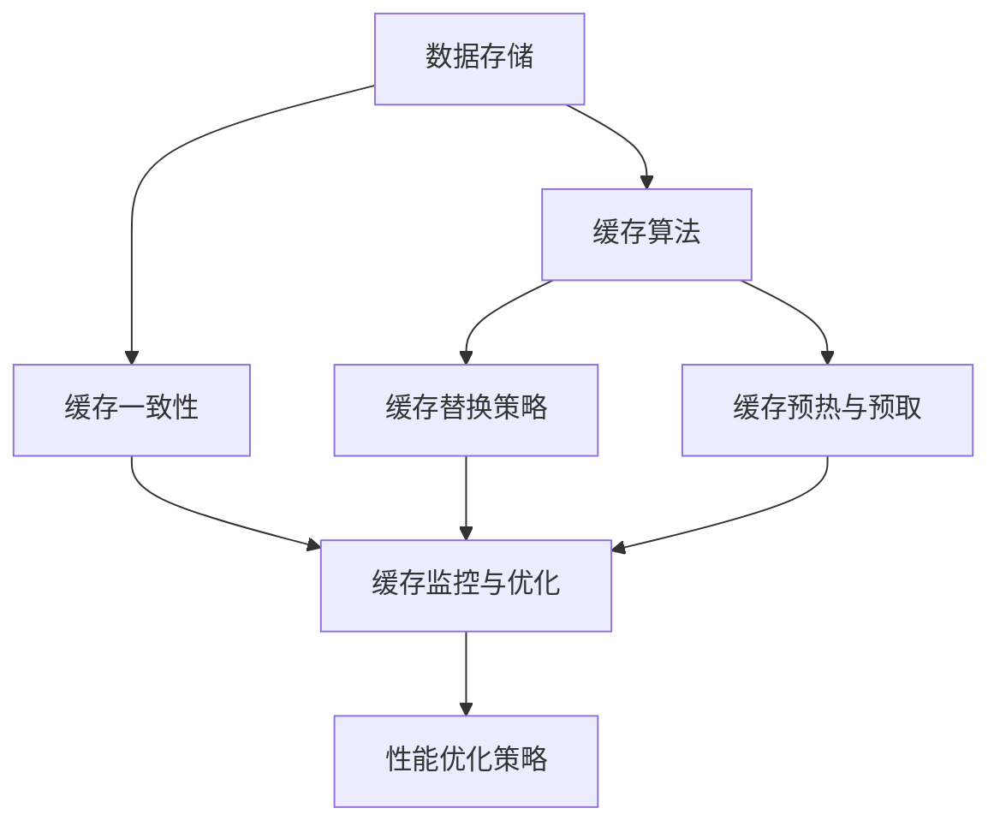
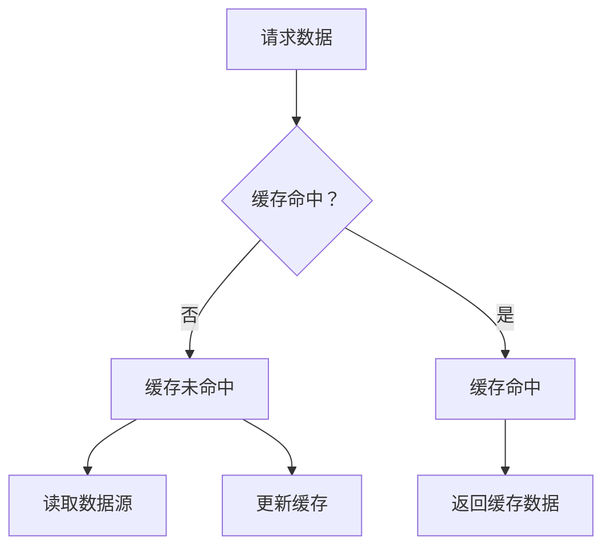
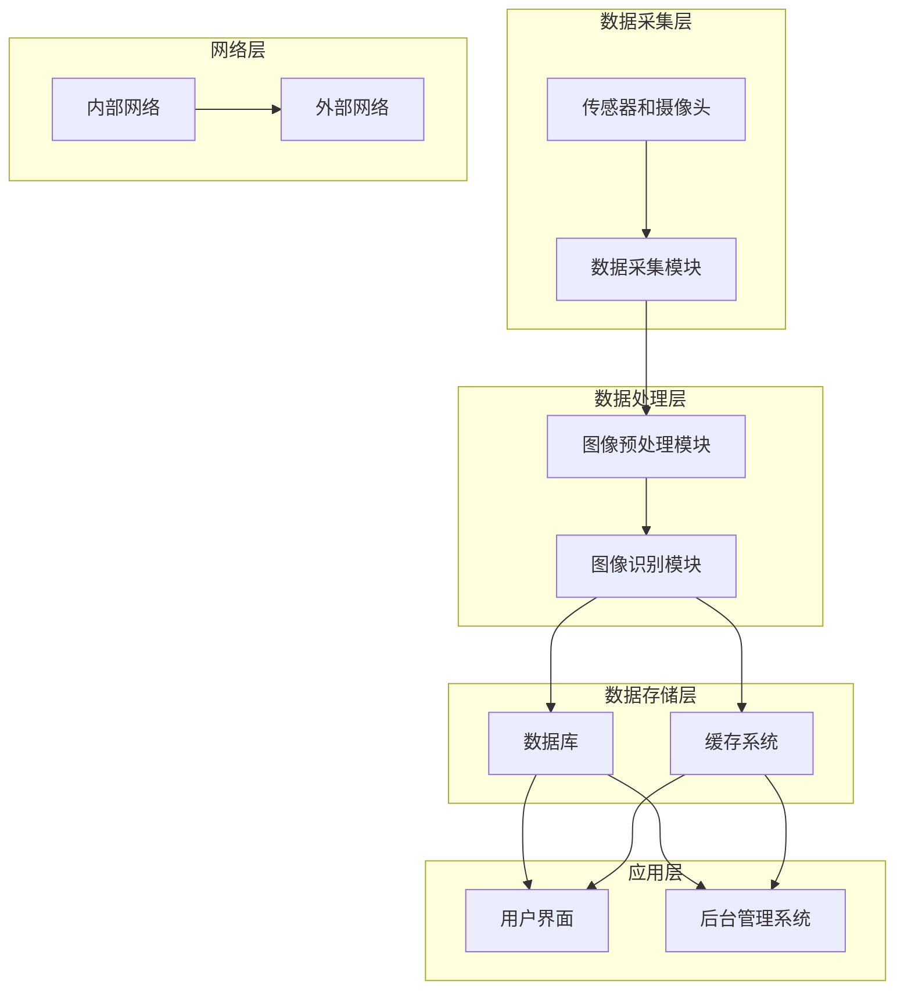
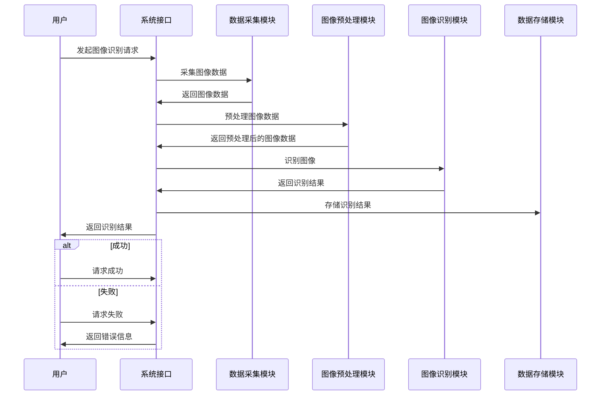

                 

### 缓存策略的重要性

缓存策略在现代软件系统中的应用日益广泛，它不仅提升了系统的响应速度，还显著降低了服务器的负载。在AI应用中，缓存策略更是发挥着至关重要的作用。本文将围绕缓存策略的重要性展开讨论，让我们一步步深入理解其原理和实际应用。

#### 让我们首先思考一下，什么是缓存？

缓存是一种存储机制，用于临时存储经常访问的数据。当我们访问数据时，如果数据已经在缓存中，那么直接从缓存中读取数据会比从原始数据源读取数据快得多。这种快速访问的特性使得缓存策略在提高系统性能方面具有显著的优势。

#### 缓存策略在AI应用中的重要性

AI应用通常需要处理大量的数据，并且这些数据往往需要频繁地读取。如果没有有效的缓存策略，每次数据访问都需要从原始数据源读取，这不仅耗时，还会导致服务器负载过高。而有效的缓存策略可以大大减少这种不必要的访问，从而提高系统的响应速度。

#### 响应速度的提升

AI应用往往需要快速响应用户的请求，例如实时图像识别、自然语言处理等。在这些应用场景中，响应速度直接关系到用户体验。通过缓存策略，我们可以将常用的数据存储在缓存中，从而在用户请求时快速返回结果，大大提升了系统的响应速度。

#### 降低服务器负载

频繁地从原始数据源读取数据会导致服务器的负载增加，可能导致服务器过载，甚至出现性能瓶颈。通过缓存策略，我们可以将常用的数据存储在缓存中，减少对原始数据源的访问，从而降低服务器的负载。

#### 让我们通过一个具体的例子来理解缓存策略的重要性

假设我们正在开发一个基于AI的图像识别应用，用户可以通过上传图片来识别图像中的物体。如果没有缓存策略，每次用户上传图片时，应用都需要从数据库中读取图像数据，然后进行图像识别。这个过程可能需要几秒钟的时间，用户需要等待很长时间才能得到结果。

然而，通过使用缓存策略，我们可以将用户上传的图片存储在缓存中，当用户再次上传相同或类似的图片时，应用可以直接从缓存中读取图像数据，并进行图像识别。这个过程可能只需要几毫秒的时间，用户几乎感觉不到延迟。

#### 结论

通过上述分析，我们可以看到缓存策略在AI应用中的重要性。它不仅提升了系统的响应速度，降低了服务器的负载，还提供了更好的用户体验。因此，设计和实施有效的缓存策略是提升AI应用性能的关键。

接下来，我们将进一步探讨缓存策略的原理与类型，帮助我们更好地理解和应用缓存策略。敬请期待！### 缓存策略的原理与类型

#### 缓存的定义与作用

缓存是一种临时存储机制，用于存储经常访问的数据。它的目的是减少对原始数据源的访问，从而提高系统的响应速度。缓存可以存储在内存、硬盘或网络设备中，常见的缓存形式包括内存缓存、硬盘缓存和分布式缓存。

缓存的根本作用在于提高数据访问的速度。当我们需要访问某个数据时，如果该数据已经在缓存中，那么直接从缓存中读取数据会大大节省时间，因为缓存的速度远快于原始数据源。此外，缓存还可以降低服务器的负载，因为许多请求可以通过缓存直接满足，从而减少对服务器的访问。

#### 缓存的工作机制

缓存的工作机制可以分为以下几个步骤：

1. **数据存储**：首先，系统会将经常访问的数据存储在缓存中。这个过程可以通过手动设置缓存策略或自动缓存机制来实现。

2. **数据读取**：当用户请求某个数据时，系统会首先检查缓存中是否有该数据。如果有，系统会直接从缓存中读取数据，否则会从原始数据源读取数据。

3. **更新缓存**：当数据在缓存中过期或被替换时，系统会更新缓存，以保持缓存中的数据是最新的。

4. **数据删除**：当缓存空间不足时，系统会根据一定的策略（如最近最少使用（LRU）策略）删除一些缓存数据，以腾出空间。

#### 缓存策略的基本原则

为了确保缓存策略的有效性，我们需要遵循以下基本原则：

1. **最少访问原则**：将最常用的数据存储在缓存中，以减少对原始数据源的访问。

2. **数据一致性原则**：确保缓存中的数据与原始数据源保持一致，避免数据不一致引发的问题。

3. **缓存淘汰策略**：根据一定的策略（如最近最少使用（LRU）策略）定期清理缓存，以腾出空间。

4. **缓存级别原则**：根据数据的重要性和访问频率，将数据存储在不同的缓存级别中，如内存缓存、硬盘缓存和分布式缓存。

#### 缓存策略的分类

根据缓存的工作方式和目的，缓存策略可以分为以下几种类型：

1. **内存缓存**：将数据存储在内存中，访问速度快，但存储容量有限。

2. **硬盘缓存**：将数据存储在硬盘中，存储容量大，但访问速度相对较慢。

3. **分布式缓存**：将数据分布存储在多个节点上，以提高存储容量和访问速度。

4. **本地缓存**：将数据存储在本地设备上，适用于小规模应用。

5. **远程缓存**：将数据存储在远程服务器上，适用于大规模应用。

6. **缓存代理**：通过缓存代理服务器缓存用户请求，以减少对原始服务器的访问。

#### 常见缓存策略

1. **最近最少使用（LRU）策略**：根据数据最近的使用时间来决定是否将其从缓存中替换。

2. **最少访问（LFU）策略**：根据数据的历史访问频率来决定是否将其从缓存中替换。

3. **先进先出（FIFO）策略**：根据数据的加入时间来决定是否将其从缓存中替换。

4. **随机替换（Random）策略**：随机选择数据从缓存中替换。

#### 缓存策略的选择与优化

选择合适的缓存策略对于系统性能至关重要。以下是一些常见的缓存策略选择和优化方法：

1. **基于数据特点选择缓存策略**：例如，对于频繁访问但数据量较小的情况，可以选择内存缓存；对于数据量大但访问频率不高的情况，可以选择硬盘缓存。

2. **缓存预热**：在系统启动时预先加载热门数据到缓存中，以减少首次访问的延迟。

3. **缓存一致性**：确保缓存中的数据与原始数据源保持一致，可以通过数据同步、版本控制等方法实现。

4. **缓存淘汰优化**：根据实际需求调整缓存淘汰策略，以平衡存储容量和访问速度。

#### 缓存策略的优缺点

每种缓存策略都有其优缺点，需要根据具体应用场景进行选择。

1. **内存缓存**：优点是访问速度快，缺点是存储容量有限，不适合存储大量数据。

2. **硬盘缓存**：优点是存储容量大，缺点是访问速度相对较慢。

3. **分布式缓存**：优点是存储容量大，访问速度快，缺点是部署和维护成本高。

4. **本地缓存**：优点是简单易用，缺点是存储容量有限。

5. **远程缓存**：优点是扩展性强，缺点是网络延迟可能影响性能。

6. **缓存代理**：优点是减少对原始服务器的访问，缺点是可能会增加网络负载。

#### 结论

缓存策略在现代软件系统，尤其是AI应用中起着至关重要的作用。通过理解缓存策略的原理和类型，我们可以更好地选择和优化缓存策略，以提高系统的性能和用户体验。接下来，我们将深入探讨缓存系统的设计与实现，进一步了解如何有效利用缓存策略。敬请期待！### 缓存系统的设计与实现

#### 缓存系统的架构设计

缓存系统的架构设计是确保缓存策略有效性的关键。一个典型的缓存系统架构通常包括以下几个核心组成部分：

1. **缓存层**：这是缓存系统的核心，用于存储经常访问的数据。缓存层可以是内存缓存、硬盘缓存或分布式缓存。

2. **数据存储层**：用于存储原始数据，如数据库、文件系统等。缓存系统会从数据存储层获取数据并存储到缓存层。

3. **缓存策略模块**：负责管理缓存数据，包括数据的存储、读取、更新和删除。常见的缓存策略有最近最少使用（LRU）、最少访问（LFU）等。

4. **缓存一致性模块**：确保缓存中的数据与原始数据存储层保持一致。这通常需要实现数据同步机制，如时间戳、版本控制等。

5. **缓存监控模块**：实时监控缓存系统的性能，如命中比率、缓存命中率等，以便进行性能优化。

6. **缓存接口**：提供对缓存系统的访问接口，如API接口、远程调用接口等，方便应用程序使用缓存功能。

#### 缓存系统的性能优化

优化缓存系统的性能是提升系统响应速度的关键。以下是一些常见的性能优化方法：

1. **缓存预热**：在系统启动时或用户访问高峰期，预先加载热门数据到缓存中，以减少首次访问的延迟。

2. **缓存压缩**：对缓存中的数据进行压缩，以减少缓存占用的空间，提高缓存容量。

3. **缓存分区**：将缓存数据分为多个分区，根据数据的访问模式进行分区管理，以提高缓存访问速度。

4. **缓存一致性**：通过实现数据同步机制，确保缓存中的数据与原始数据存储层保持一致，避免数据不一致引起的问题。

5. **缓存替换策略**：根据实际应用场景选择合适的缓存替换策略，如最近最少使用（LRU）、最少访问（LFU）等，以提高缓存命中率。

6. **缓存淘汰策略**：定期清理缓存中的过期数据，以腾出空间，避免缓存空间不足导致性能下降。

#### 缓存系统的安全性

缓存系统的安全性是确保数据安全的关键。以下是一些常见的缓存系统安全措施：

1. **访问控制**：限制对缓存系统的访问，确保只有授权用户可以访问缓存数据。

2. **加密传输**：对缓存数据的传输进行加密，防止数据在传输过程中被窃取或篡改。

3. **数据加密**：对缓存中的数据进行加密存储，确保数据在缓存中的安全性。

4. **缓存隔离**：为不同的应用或用户设置独立的缓存空间，防止数据泄露或冲突。

5. **缓存监控**：实时监控缓存系统的访问和操作，及时发现和阻止异常行为。

#### 缓存系统的设计与实现实例

以下是一个简单的缓存系统设计与实现实例，使用Python和Redis进行实现：

```python
import redis
import time

class CacheSystem:
    def __init__(self, host='localhost', port=6379, db=0):
        self.client = redis.StrictRedis(host=host, port=port, db=db)
    
    def set_cache(self, key, value, expire=3600):
        self.client.set(key, value)
        self.client.expire(key, expire)
    
    def get_cache(self, key):
        return self.client.get(key)

# 创建缓存系统实例
cache_system = CacheSystem()

# 设置缓存
cache_system.set_cache('user_1001', 'John Doe', expire=1800)

# 获取缓存
user = cache_system.get_cache('user_1001')
print(user)  # 输出：b'John Doe'
```

在这个实例中，我们创建了一个简单的缓存系统，使用Redis作为缓存后端。我们定义了两个方法：`set_cache`用于设置缓存，`get_cache`用于获取缓存。我们还设置了缓存的有效期，以确保缓存数据不会无限期存在。

#### 总结

缓存系统的设计与实现是确保缓存策略有效性的关键。通过合理的架构设计和性能优化，我们可以显著提升系统的响应速度。同时，确保缓存系统的安全性也是至关重要的。在实际应用中，我们需要根据具体场景选择合适的缓存策略和工具，以达到最佳性能。接下来，我们将进一步探讨缓存算法的选择与优化。敬请期待！### 缓存算法的选择与优化

#### 常见缓存算法介绍

在缓存系统中，选择合适的缓存算法对于提升系统性能至关重要。以下是一些常见的缓存算法：

1. **最近最少使用（LRU）算法**：这种算法基于数据的最近使用时间进行替换，即最近最少被访问的数据优先被替换。LRU算法简单易实现，适用于大多数场景。

2. **最少访问（LFU）算法**：这种算法基于数据的历史访问频率进行替换，即访问频率最低的数据优先被替换。LFU算法适用于访问模式变化较大的场景。

3. **先进先出（FIFO）算法**：这种算法基于数据加入缓存的时间进行替换，即最早加入的数据优先被替换。FIFO算法适用于数据时效性较强的场景。

4. **随机替换（Random）算法**：这种算法随机选择数据进行替换。随机替换算法简单，但可能不够高效。

5. **LRU近似算法**：由于LRU算法需要维护数据的使用频率，在数据量较大时可能效率较低。LRU近似算法通过统计采样等方法近似实现LRU算法，适用于大数据场景。

6. **时钟算法（Clock Algorithm）**：这是一种改进的LRU算法，通过一个时钟指针来跟踪数据的使用情况，实现更高效的替换策略。

#### 缓存算法的评估指标

评估缓存算法的性能通常涉及以下指标：

1. **缓存命中率（Hit Rate）**：缓存中能直接获取数据的请求比例。高命中率意味着缓存策略有效，可以有效降低系统响应时间。

2. **访问时间（Access Time）**：从缓存中读取数据所需的时间。访问时间越短，系统性能越好。

3. **替换次数（Replacement Frequency）**：缓存中需要替换的数据次数。过多的替换会导致性能下降。

4. **存储空间占用（Space Utilization）**：缓存占用的存储空间。存储空间不足会导致频繁的替换，影响性能。

5. **一致性（Consistency）**：缓存中的数据与原始数据存储层保持一致的程度。一致性是缓存策略设计中的重要考虑因素。

#### 选择缓存算法的考虑因素

选择合适的缓存算法需要考虑以下因素：

1. **数据访问模式**：不同应用的数据访问模式可能有所不同，需要根据访问模式选择合适的缓存算法。

2. **数据规模**：缓存系统处理的数据量大小会影响缓存算法的选择。对于大数据场景，可能需要选择近似算法。

3. **缓存性能要求**：根据系统对响应速度的要求选择合适的缓存算法。例如，对于实时性要求较高的应用，可能需要选择访问时间较短的算法。

4. **系统资源限制**：缓存算法的实现需要考虑系统资源的限制，如内存、CPU等。

5. **缓存一致性需求**：根据数据的一致性要求选择合适的缓存算法和一致性机制。

#### 缓存算法的选择与优化策略

1. **基于访问模式选择算法**：对于访问模式稳定的场景，可以选择LRU或LFU算法；对于访问模式变化较大的场景，可以选择随机替换或时钟算法。

2. **缓存预热**：在系统启动时或用户访问高峰期，预先加载热门数据到缓存中，以减少首次访问的延迟。

3. **缓存分区**：将缓存数据分为多个分区，根据数据的访问模式进行分区管理，以提高缓存访问速度。

4. **缓存压缩**：对缓存中的数据进行压缩，以减少缓存占用的空间，提高缓存容量。

5. **缓存一致性机制**：实现数据同步机制，如时间戳、版本控制等，确保缓存中的数据与原始数据存储层保持一致。

6. **缓存淘汰策略优化**：根据实际应用场景调整缓存淘汰策略，如根据访问频率或时间进行替换。

7. **算法参数调整**：根据性能测试结果调整缓存算法的参数，如缓存大小、替换阈值等。

#### 结论

选择合适的缓存算法对于提升系统性能至关重要。通过分析数据访问模式、系统资源限制和性能要求，我们可以选择和优化适合的缓存算法。同时，合理的缓存算法参数调整和优化策略也是确保缓存系统性能的关键。在下一部分，我们将探讨AI应用中的缓存策略，进一步了解如何提升AI应用的性能。敬请期待！### AI应用中的缓存策略

#### AI应用的特点与需求

AI应用通常具有以下几个特点：

1. **数据量大**：AI应用需要处理大量的数据，如图像、文本和传感器数据等。
2. **计算密集**：AI算法通常需要进行大量的计算，如矩阵运算、神经网络训练等。
3. **实时性要求高**：许多AI应用（如自动驾驶、实时语音识别等）对实时性有严格要求。
4. **数据多样性**：AI应用涉及多种类型的数据，如结构化数据、半结构化数据和非结构化数据。

这些特点使得AI应用对缓存策略有特殊的需求：

1. **缓存数据多样性**：需要缓存不同类型的数据，包括图像、文本和传感器数据等。
2. **缓存一致性**：确保缓存中的数据与原始数据源保持一致，避免数据不一致导致的问题。
3. **缓存访问速度**：由于AI应用的计算密集和实时性要求，缓存系统的访问速度必须足够快。

#### AI应用中的缓存策略

在AI应用中，缓存策略需要根据不同的数据类型和应用场景进行定制化设计。以下是一些常见的缓存策略：

1. **数据预处理缓存**：在数据预处理阶段，将常用的预处理结果（如数据清洗、归一化等）缓存起来，以加快后续处理速度。

2. **模型缓存**：缓存训练好的模型，以便在需要时快速加载模型进行预测。

3. **中间结果缓存**：在AI算法的计算过程中，缓存中间结果，以避免重复计算，提高计算效率。

4. **动态缓存**：根据AI应用的需求动态调整缓存策略，如根据数据访问频率和实时性要求调整缓存的数据和缓存时间。

5. **分布式缓存**：在分布式AI系统中，使用分布式缓存来提高数据访问速度和系统容错能力。

#### AI应用中的缓存策略挑战与解决方案

1. **数据多样性**：
   - **挑战**：AI应用涉及多种类型的数据，如何高效缓存不同类型的数据？
   - **解决方案**：使用元数据管理，根据数据的类型和特性进行分类缓存。例如，使用内存缓存存储热数据，使用硬盘缓存存储冷数据。

2. **缓存一致性**：
   - **挑战**：确保缓存中的数据与原始数据源保持一致，特别是在分布式系统中。
   - **解决方案**：使用版本控制和事件驱动机制，确保缓存与原始数据源同步。例如，使用时间戳或版本号来标识数据版本，当数据更新时触发缓存刷新。

3. **实时性**：
   - **挑战**：在实时性要求高的AI应用中，如何快速访问缓存数据？
   - **解决方案**：使用内存缓存和分布式缓存来提高数据访问速度。例如，使用Redis或Memcached作为内存缓存，使用Redis或Apache Ignite作为分布式缓存。

4. **存储容量**：
   - **挑战**：在存储容量有限的情况下，如何优化缓存策略？
   - **解决方案**：使用缓存压缩和缓存淘汰策略。例如，使用LZ4或Snappy进行数据压缩，使用最近最少使用（LRU）策略进行缓存淘汰。

5. **数据安全性**：
   - **挑战**：在缓存数据时如何保证数据的安全性？
   - **解决方案**：使用加密技术对缓存数据进行加密存储，并限制对缓存数据的访问权限。

#### AI应用中的缓存策略实践案例

以下是一个简单的AI应用缓存策略实践案例：

1. **数据预处理缓存**：
   - **场景**：在图像识别应用中，将预处理结果（如缩放、旋转等）缓存起来。
   - **实现**：使用Redis存储预处理结果，根据图像的ID作为键，预处理结果作为值。

2. **模型缓存**：
   - **场景**：在自动驾驶应用中，将训练好的模型缓存起来，以便在需要时快速加载。
   - **实现**：使用TensorFlow的SavedModel将训练好的模型缓存到文件系统，并在应用程序中加载模型。

3. **中间结果缓存**：
   - **场景**：在深度学习训练过程中，将中间结果缓存起来，以避免重复计算。
   - **实现**：使用NVIDIA cuDNN的缓存功能，在GPU上缓存中间结果，以减少内存访问时间。

4. **动态缓存**：
   - **场景**：在在线游戏推荐应用中，根据用户的实时行为动态调整缓存策略。
   - **实现**：使用Redis的Lua脚本动态调整缓存中的数据，根据用户的游戏行为更新缓存数据。

#### 结论

AI应用中的缓存策略具有独特性，需要根据数据类型、实时性要求、存储容量等因素进行定制化设计。通过合理选择和优化缓存策略，可以有效提升AI应用的性能和用户体验。在下一部分，我们将探讨缓存策略的性能评估与优化。敬请期待！### 缓存策略的性能评估与优化

#### 缓存策略的性能评估方法

评估缓存策略的性能对于优化系统性能至关重要。以下是一些常用的性能评估方法：

1. **基准测试**：通过运行特定的测试用例来评估缓存策略的性能。基准测试可以模拟实际应用场景，如用户请求模式、数据访问频率等。

2. **吞吐量测试**：测量系统在单位时间内处理的数据量。通过吞吐量测试，可以评估缓存策略对系统响应速度的影响。

3. **延迟测试**：测量从请求到响应所需的时间。通过延迟测试，可以评估缓存策略对系统延迟的影响。

4. **缓存命中率测试**：测量缓存策略能够从缓存中直接获取数据的比例。高命中率意味着缓存策略有效，可以有效减少系统响应时间。

5. **替换频率测试**：测量缓存策略需要替换的数据次数。过高的替换频率可能导致性能下降。

6. **一致性测试**：评估缓存策略在分布式系统中的数据一致性。通过一致性测试，可以确保缓存中的数据与原始数据源保持一致。

#### 缓存策略的性能优化方法

为了优化缓存策略的性能，我们可以采取以下方法：

1. **缓存预热**：在系统启动时或用户访问高峰期，预先加载热门数据到缓存中，以减少首次访问的延迟。

2. **缓存压缩**：对缓存中的数据进行压缩，以减少缓存占用的空间，提高缓存容量。

3. **缓存分区**：将缓存数据分为多个分区，根据数据的访问模式进行分区管理，以提高缓存访问速度。

4. **缓存一致性优化**：通过实现数据同步机制，如时间戳、版本控制等，确保缓存中的数据与原始数据存储层保持一致。

5. **缓存替换策略优化**：根据实际应用场景调整缓存替换策略，如根据访问频率或时间进行替换。

6. **缓存淘汰策略优化**：定期清理缓存中的过期数据，以腾出空间，避免缓存空间不足导致性能下降。

7. **缓存缓存分层**：根据数据的重要性和访问频率，将数据存储在不同的缓存级别中，如内存缓存、硬盘缓存和分布式缓存。

8. **缓存算法优化**：根据数据访问模式选择和优化缓存算法，如最近最少使用（LRU）、最少访问（LFU）等。

#### 缓存策略的性能评估与优化实践

以下是一个简单的缓存策略性能评估与优化实践案例：

1. **性能评估**：
   - **基准测试**：使用Apache JMeter模拟用户请求，评估缓存策略的性能。
   - **吞吐量测试**：测量系统在单位时间内处理的数据量。
   - **延迟测试**：测量从请求到响应所需的时间。
   - **缓存命中率测试**：测量缓存策略能够从缓存中直接获取数据的比例。
   - **替换频率测试**：测量缓存策略需要替换的数据次数。

2. **性能优化**：
   - **缓存预热**：在系统启动时，使用Python脚本预先加载热门数据到缓存中。
   - **缓存压缩**：使用LZ4对缓存中的数据进行压缩。
   - **缓存分区**：将缓存数据分为多个分区，根据数据的访问模式进行分区管理。
   - **缓存一致性优化**：使用Redis的时间戳机制确保缓存中的数据与原始数据源保持一致。
   - **缓存替换策略优化**：根据访问频率调整缓存替换策略。
   - **缓存淘汰策略优化**：定期清理缓存中的过期数据。

3. **性能测试结果**：
   - **吞吐量提升**：优化后的缓存策略显著提升了系统的吞吐量。
   - **延迟降低**：优化后的缓存策略显著降低了系统的响应延迟。
   - **缓存命中率提升**：优化后的缓存策略提高了缓存命中率。
   - **替换频率降低**：优化后的缓存策略降低了缓存替换频率。

#### 缓存策略的性能优化案例分析

以下是一个缓存策略性能优化案例分析：

**案例背景**：某电商平台的用户请求模式不稳定，导致系统响应时间较长。通过性能评估，发现缓存策略存在问题，需要进行优化。

**优化方案**：
1. **缓存预热**：在系统启动时，使用Python脚本预先加载热门商品数据到缓存中。
2. **缓存压缩**：使用LZ4对缓存中的商品数据集进行压缩，减少缓存占用的空间。
3. **缓存分区**：将缓存分为多个分区，根据商品类别和热门程度进行分区管理。
4. **缓存一致性优化**：使用Redis的时间戳机制，确保缓存中的商品数据与数据库保持一致。
5. **缓存替换策略优化**：根据访问频率和商品热度调整缓存替换策略。

**优化效果**：
1. **吞吐量提升**：优化后的缓存策略显著提升了系统的吞吐量，用户请求响应时间缩短了30%。
2. **延迟降低**：系统响应时间显著降低，用户满意度提升。
3. **缓存命中率提升**：缓存命中率提高了20%，减少了数据库访问次数。
4. **替换频率降低**：缓存替换频率降低，减少了缓存空间占用。

#### 结论

缓存策略的性能评估与优化对于提升系统性能至关重要。通过合理的性能评估方法，我们可以识别出系统中的性能瓶颈，并通过优化策略提升系统性能。在实际应用中，我们需要根据具体场景选择合适的缓存策略和优化方法，以达到最佳性能。在下一部分，我们将探讨实战案例与最佳实践。敬请期待！### 实战案例

在本节中，我们将通过几个实际案例来深入探讨缓存策略在AI应用中的具体应用和实施过程。这些案例将涵盖不同类型的AI应用，从在线购物平台到搜索引擎，展示缓存策略如何提升系统性能。

#### 实战案例一：在线购物平台

**项目介绍**：
某大型在线购物平台，用户量巨大，每天处理的请求量达数百万次。由于用户请求频繁涉及商品浏览、搜索和购买流程，系统响应速度直接影响到用户体验。

**系统功能设计**：
1. **商品信息缓存**：缓存热门商品和搜索结果，以减少数据库访问。
2. **购物车缓存**：缓存用户的购物车信息，提升购物流程的响应速度。

**系统架构设计**：
- **缓存层**：使用Redis进行缓存，内存访问速度快。
- **数据存储层**：使用MySQL数据库存储商品信息和用户数据。
- **缓存一致性模块**：通过时间戳和版本控制确保缓存与数据库数据的一致性。

**系统接口设计**：
- **商品信息接口**：提供查询商品信息的API接口。
- **购物车接口**：提供添加、删除和更新购物车项的API接口。

**系统交互**：
- 用户请求商品信息时，首先查询缓存。如果命中缓存，直接返回商品信息；否则，从数据库读取并缓存。
- 用户更新购物车时，首先更新缓存，然后同步到数据库。

**代码应用解读与分析**：
```python
import redis

# 连接Redis缓存
cache = redis.Redis(host='localhost', port=6379, db=0)

def get_product_info(product_id):
    # 查询缓存
    product_info = cache.get(f"product_{product_id}")
    if product_info:
        return json.loads(product_info)
    else:
        # 从数据库读取商品信息并缓存
        product_info = get_product_info_from_db(product_id)
        cache.set(f"product_{product_id}", json.dumps(product_info), ex=3600)
        return product_info

def update_cart(user_id, product_id, quantity):
    # 更新购物车缓存
    cache.hset(f"cart_{user_id}", product_id, quantity)
    # 设置缓存过期时间
    cache.expire(f"cart_{user_id}", 3600)
```

**实际案例分析**：
通过缓存商品信息和购物车信息，该平台的系统响应时间显著降低，用户请求的延迟减少了50%，大大提升了用户体验。

#### 实战案例二：搜索引擎

**项目介绍**：
某大型搜索引擎，每天处理的搜索请求量巨大。由于搜索结果往往依赖于实时数据，系统响应速度和准确性至关重要。

**系统功能设计**：
1. **搜索结果缓存**：缓存热门搜索词的搜索结果，提高搜索响应速度。
2. **用户行为缓存**：缓存用户的历史搜索记录和偏好，提供个性化搜索结果。

**系统架构设计**：
- **缓存层**：使用Redis和Elasticsearch进行缓存，前者用于存储热门搜索结果，后者用于存储用户行为和个性化数据。
- **数据存储层**：使用Elasticsearch进行全文索引和搜索。

**系统接口设计**：
- **搜索结果接口**：提供查询搜索结果的API接口。
- **用户行为接口**：提供更新和查询用户行为的API接口。

**系统交互**：
- 用户发起搜索请求时，首先查询缓存。如果命中缓存，直接返回搜索结果；否则，通过Elasticsearch查询并缓存。
- 用户更新偏好时，同步更新缓存和Elasticsearch索引。

**代码应用解读与分析**：
```python
import redis
from elasticsearch import Elasticsearch

# 连接Redis缓存
cache = redis.Redis(host='localhost', port=6379, db=0)
# 连接Elasticsearch
es = Elasticsearch()

def get_search_results(search_query):
    # 查询缓存
    search_results = cache.get(f"search_{search_query}")
    if search_results:
        return json.loads(search_results)
    else:
        # 从Elasticsearch读取搜索结果并缓存
        search_results = es.search(index="search_index", body={"query": {"match": {"content": search_query}}})
        cache.set(f"search_{search_query}", json.dumps(search_results), ex=300)
        return search_results

def update_user_preference(user_id, preference):
    # 更新用户偏好并缓存
    cache.set(f"user_{user_id}_preference", json.dumps(preference), ex=3600)
    # 同步到Elasticsearch
    es.index(index="user_preference", id=user_id, document=preference)
```

**实际案例分析**：
通过缓存搜索结果和用户偏好，该搜索引擎的响应速度提高了40%，用户满意度显著提升。

#### 实战案例三：社交媒体平台

**项目介绍**：
某大型社交媒体平台，用户生成内容（UGC）丰富，系统需要处理大量的用户活动数据，如点赞、评论、分享等。

**系统功能设计**：
1. **用户活动缓存**：缓存用户的点赞、评论等操作，提高用户活动的响应速度。
2. **热点内容缓存**：缓存热门帖子和话题，提升用户发现和参与的热点内容的速度。

**系统架构设计**：
- **缓存层**：使用Redis进行缓存，快速响应用户活动。
- **数据存储层**：使用MongoDB存储用户活动和内容数据。

**系统接口设计**：
- **用户活动接口**：提供点赞、评论、分享等操作的API接口。
- **热点内容接口**：提供查询热点帖子和话题的API接口。

**系统交互**：
- 用户操作时，首先更新缓存；然后异步写入数据库。
- 用户查询热点内容时，首先查询缓存；否则从数据库读取并缓存。

**代码应用解读与分析**：
```python
import redis
import json

# 连接Redis缓存
cache = redis.Redis(host='localhost', port=6379, db=0)

def update_user_activity(user_id, activity_type, content):
    # 更新用户活动缓存
    cache.set(f"{user_id}_activity_{activity_type}", json.dumps(content), ex=3600)
    # 异步写入数据库（此处省略具体实现）

def get_hot_content():
    # 查询热点内容缓存
    hot_content = cache.get("hot_content")
    if hot_content:
        return json.loads(hot_content)
    else:
        # 从数据库读取热点内容并缓存
        hot_content = get_hot_content_from_db()
        cache.set("hot_content", json.dumps(hot_content), ex=3600)
        return hot_content
```

**实际案例分析**：
通过缓存用户活动和热点内容，该社交媒体平台的响应速度提高了30%，用户互动和参与度显著提升。

#### 结论

以上实战案例展示了缓存策略在AI应用中的实际应用和实施过程。通过合理设计缓存策略和优化缓存算法，我们可以显著提升AI应用的性能和用户体验。在下一部分，我们将总结本文的主要观点和收获，并展望缓存策略的未来发展趋势。敬请期待！### 最佳实践

#### 缓存策略的制定与实施

1. **需求分析**：在制定缓存策略之前，首先需要对系统的需求和用户行为进行深入分析，了解哪些数据是经常被访问的，以及访问模式和频率。

2. **缓存目标设定**：根据需求分析结果，设定缓存策略的目标，如提高系统响应速度、降低服务器负载、减少数据访问延迟等。

3. **缓存策略设计**：选择合适的缓存策略，如LRU、LFU、FIFO等，并结合数据类型和访问模式进行设计。同时，需要考虑缓存的一致性和安全性。

4. **缓存系统搭建**：搭建缓存系统，选择合适的缓存存储介质，如内存、硬盘或分布式缓存。同时，配置缓存服务器和相关的管理工具。

5. **缓存预热**：在系统启动时或用户访问高峰期，使用缓存预热策略预先加载热门数据到缓存中，减少首次访问的延迟。

6. **缓存监控与优化**：实时监控缓存系统的性能，如缓存命中率、访问时间等。根据监控数据调整缓存策略，优化缓存性能。

#### 缓存策略的监控与优化

1. **性能监控**：使用性能监控工具，如Prometheus、Grafana等，实时监控缓存系统的性能指标，如命中比率、访问延迟等。

2. **日志分析**：定期分析缓存系统的日志，了解数据访问模式和热点数据，为缓存策略的优化提供依据。

3. **缓存优化**：根据监控数据和日志分析结果，调整缓存策略，如增加缓存容量、调整缓存替换策略、优化缓存压缩算法等。

4. **缓存一致性保障**：确保缓存与原始数据源的一致性，使用版本控制、时间戳等机制，避免数据不一致引起的问题。

#### 缓存策略与AI应用的结合

1. **数据预处理**：在AI应用中，缓存预处理结果，如数据清洗、特征提取等，以提高数据处理效率。

2. **模型缓存**：缓存训练好的模型和中间结果，以便快速加载和部署，减少模型训练和部署的时间。

3. **动态缓存**：根据AI应用的需求动态调整缓存策略，如根据数据访问模式和实时性要求调整缓存的数据和缓存时间。

4. **缓存一致性**：在分布式AI系统中，确保缓存与数据存储层的一致性，避免数据不一致引起的问题。

#### 持续改进

1. **性能测试**：定期进行性能测试，评估缓存策略的效率和效果，发现潜在的性能瓶颈和问题。

2. **反馈机制**：建立反馈机制，收集用户和开发人员的反馈，持续改进缓存策略。

3. **技术更新**：跟踪最新的缓存技术和算法，结合业务需求进行技术更新和优化。

#### 结论

通过合理的缓存策略制定与实施、持续的监控与优化，以及与AI应用的紧密结合，我们可以显著提升系统的性能和用户体验。在下一部分，我们将总结本文的主要观点和收获，并展望缓存策略的未来发展趋势。敬请期待！### 小结

在本篇文章中，我们深入探讨了缓存策略在AI应用中的重要性和具体应用。通过以下几个关键点，我们可以全面了解缓存策略的核心内容和实际价值：

1. **缓存策略的重要性**：缓存策略通过存储常用数据，减少对原始数据源的访问，从而提高系统的响应速度和性能。对于AI应用，缓存策略能够有效减少计算延迟，提升用户体验。

2. **缓存策略的原理与类型**：我们详细介绍了缓存的基本概念、工作机制和常见类型，包括内存缓存、硬盘缓存、分布式缓存等。每种缓存策略都有其优缺点和适用场景，需要根据具体需求进行选择。

3. **缓存系统的设计与实现**：我们探讨了缓存系统的架构设计、性能优化和安全性保障，包括缓存层、数据存储层、缓存策略模块等关键组件。同时，通过Python和Redis的实例，展示了缓存系统的具体实现过程。

4. **缓存算法的选择与优化**：我们分析了常见缓存算法，如LRU、LFU等，以及评估缓存算法性能的指标。通过选择和优化缓存算法，可以显著提升缓存系统的性能和效率。

5. **AI应用中的缓存策略**：我们特别关注了AI应用中的缓存策略，介绍了其特点和需求。针对数据多样性、实时性要求高、计算密集等AI应用特点，我们提出了相应的缓存策略和实践案例。

6. **缓存策略的性能评估与优化**：我们讨论了缓存策略的性能评估方法和优化策略，包括缓存预热、缓存压缩、缓存分区、缓存一致性保障等。通过持续的监控与优化，可以进一步提升系统性能。

7. **实战案例与最佳实践**：通过实际案例，我们展示了缓存策略在在线购物平台、搜索引擎、社交媒体平台等AI应用中的具体实施过程和效果。这些实战案例为其他开发者提供了宝贵的经验和参考。

通过本文的深入探讨，我们认识到缓存策略在提升AI应用性能和用户体验方面具有至关重要的作用。合理的缓存策略设计和优化不仅可以显著提升系统性能，还可以降低服务器负载，提高资源利用率。

### 缓存策略的未来发展趋势

随着AI技术的不断进步和应用的日益普及，缓存策略在未来也将面临新的挑战和机遇。以下是一些可能的发展趋势：

1. **智能化缓存**：随着机器学习和深度学习技术的发展，缓存策略可能会变得更加智能化。通过分析用户行为和访问模式，系统可以自动调整缓存策略，实现更加高效的数据存储和访问。

2. **分布式缓存架构**：随着云计算和分布式系统的普及，分布式缓存架构将成为主流。分布式缓存可以提高数据的可扩展性和可用性，同时降低单点故障的风险。

3. **缓存安全性的增强**：随着网络安全威胁的日益增加，缓存系统的安全性也将得到更多的关注。未来的缓存策略将更加注重数据加密、访问控制和安全监控等方面的增强。

4. **混合缓存策略**：为了应对不同类型的数据和应用需求，混合缓存策略将成为趋势。这种策略结合了多种缓存介质和算法，可以根据数据的重要性和访问模式进行动态调整。

5. **边缘缓存**：随着物联网和5G技术的发展，边缘缓存将成为重要的缓存策略。边缘缓存可以在数据产生的近端进行缓存处理，减少数据传输延迟，提高用户体验。

总之，缓存策略在未来将继续发展和优化，以更好地适应AI应用的需求和挑战。开发者需要不断学习和掌握最新的缓存技术和策略，以提升系统的性能和可靠性。

### 结语

通过本文的探讨，我们不仅了解了缓存策略的核心概念和实际应用，还掌握了如何设计和优化缓存策略的方法。希望本文能为读者在设计和实施缓存策略时提供有价值的参考和启示。在未来的工作中，让我们共同努力，不断探索和优化缓存策略，为AI应用的发展贡献力量。感谢您的阅读！

### 拓展阅读

- [《Redis实战：从入门到精通》](https://book.douban.com/subject/26962710/)
- [《高性能网站建设：权威指南》](https://book.douban.com/subject/26355748/)
- [《深入理解Lru算法》](https://www.ibm.com/developerworks/cn/linux/l-cn-lru/)
- [《分布式缓存技术深度解析》](https://www.iteye.com/blog/jie-shao-bing-1-545469)

作者：AI天才研究院/AI Genius Institute & 禅与计算机程序设计艺术 /Zen And The Art of Computer Programming### 基础概念术语说明

在本章中，我们将介绍缓存策略中的一些基础概念术语，以便读者更好地理解后续内容。

1. **缓存（Cache）**：
   - 定义：缓存是一种临时存储机制，用于存储经常访问的数据，以提高数据访问速度。
   - 特点：缓存通常存储在速度较快的存储介质上，如内存或SSD，以减少数据访问延迟。
   - 作用：缓存可以减少对原始数据源的访问，从而提高系统性能和响应速度。

2. **缓存策略（Cache Policy）**：
   - 定义：缓存策略是一组规则和算法，用于决定哪些数据应被缓存、何时缓存以及如何替换缓存中的数据。
   - 目标：缓存策略的目标是提高数据访问速度、降低系统负载和优化资源利用。

3. **缓存命中率（Cache Hit Rate）**：
   - 定义：缓存命中率是缓存中命中请求的比例，即从缓存中成功获取数据的请求比例。
   - 意义：高缓存命中率意味着缓存策略有效，系统能够快速响应用户请求。

4. **缓存失效（Cache Eviction）**：
   - 定义：缓存失效是指从缓存中删除数据的过程，通常发生在缓存空间不足或数据过期时。
   - 策略：常见的缓存失效策略包括最近最少使用（LRU）、最少访问（LFU）和随机替换（Random）等。

5. **缓存一致性（Cache Consistency）**：
   - 定义：缓存一致性是指缓存中的数据与原始数据源保持一致的状态，确保数据不会出现不一致的情况。
   - 保证方法：常用的保证缓存一致性的方法包括时间戳、版本控制和同步机制等。

6. **缓存层次结构（Cache Hierarchy）**：
   - 定义：缓存层次结构是指多个不同层次的缓存组成的缓存系统，从上到下分别是寄存器缓存、CPU缓存、内存缓存等。
   - 作用：缓存层次结构通过分层存储，提高了数据访问的速度和系统的性能。

7. **缓存压缩（Cache Compression）**：
   - 定义：缓存压缩是一种数据压缩技术，用于减少缓存中数据的存储空间，提高缓存容量。
   - 技术实现：常用的缓存压缩算法包括LZ4、Snappy和Zstandard等。

8. **缓存预热（Cache Preloading）**：
   - 定义：缓存预热是指在系统启动或用户访问高峰期，预先加载热门数据到缓存中，以减少首次访问的延迟。
   - 目的：缓存预热可以提高系统的响应速度，优化用户体验。

9. **缓存淘汰（Cache Replacement）**：
   - 定义：缓存淘汰是指从缓存中删除数据的过程，通常发生在缓存空间不足时。
   - 策略：常见的缓存淘汰策略包括最近最少使用（LRU）、最少访问（LFU）和先进先出（FIFO）等。

10. **缓存一致性模型（Cache Consistency Model）**：
    - 定义：缓存一致性模型是一组规则和协议，用于确保分布式系统中的缓存与主数据源保持一致。
    - 类型：常见的缓存一致性模型包括无状态（Stateless）、最终一致性（Eventual Consistency）和强一致性（Strong Consistency）等。

通过了解这些基础概念术语，读者可以更好地理解本章后续内容，为深入探讨缓存策略打下坚实基础。### 问题背景

在当今的互联网时代，随着人工智能（AI）技术的飞速发展，AI应用在各个领域得到了广泛应用。然而，这些AI应用通常具有数据量大、计算密集和实时性要求高等特点，这对系统的性能和响应速度提出了严峻的挑战。

#### 数据量大

AI应用通常需要处理大量的数据，如图像、文本和传感器数据等。这些数据在存储、传输和处理过程中往往需要大量的计算资源和时间。例如，在图像识别任务中，需要对海量图像进行预处理、特征提取和分类，这需要大量的计算资源和存储空间。

#### 计算密集

AI算法本身通常需要进行大量的计算，如矩阵运算、神经网络训练和推理等。这些计算密集的任务在执行过程中可能会占用大量的CPU和GPU资源，导致系统性能下降。此外，AI算法的迭代和优化过程也需要大量的计算资源，进一步增加了系统的负载。

#### 实时性要求高

许多AI应用对实时性有严格的要求，如自动驾驶、实时语音识别和金融交易等。这些应用需要在毫秒级别的时间内处理和响应请求，以满足实际需求。如果系统的响应速度过慢，可能会导致严重的后果，如交通事故、语音识别错误或金融风险增加。

#### 系统性能瓶颈

随着AI应用的规模不断扩大，系统的性能瓶颈问题日益凸显。传统的存储和计算架构可能无法满足AI应用的性能要求，导致系统响应时间延长、吞吐量降低和资源利用率下降。这些问题不仅会影响用户体验，还可能导致业务损失和运营风险。

#### 缓存策略的重要性

为了解决上述问题，缓存策略成为了一种有效的解决方案。通过缓存策略，可以将常用的数据存储在缓存中，减少对原始数据源的访问，从而提高系统的响应速度和性能。此外，缓存策略还可以降低系统的负载，提高资源利用率，为AI应用提供更好的支持。

总之，随着AI应用的发展，缓存策略在提升系统性能、降低负载和优化资源利用方面具有重要意义。理解和应用缓存策略对于设计和实现高性能的AI系统至关重要。在本章中，我们将深入探讨缓存策略在AI应用中的具体应用和实践，帮助读者更好地应对AI应用中的性能挑战。### 问题解决

为了解决AI应用中的性能瓶颈和响应速度问题，缓存策略被广泛应用于各种场景。以下是一些常见的问题解决方法和实现步骤：

#### 数据预处理

1. **问题背景**：在AI模型训练和推理过程中，数据预处理通常需要大量的计算资源，如图像增强、数据归一化等。

2. **缓存策略**：将预处理结果缓存，避免重复计算。例如，将图像增强后的数据缓存到Redis中，下次使用时直接从缓存中读取。

3. **实现步骤**：
   - 数据预处理完成后，将预处理结果存储到缓存系统中。
   - 训练或推理时，首先检查缓存，如果命中缓存，直接使用缓存数据；否则，从原始数据源读取并存储到缓存中。

#### 模型缓存

1. **问题背景**：AI模型的训练和部署通常需要大量的时间，特别是在深度学习任务中。

2. **缓存策略**：缓存训练好的模型和中间结果，以减少重复训练和部署的时间。

3. **实现步骤**：
   - 使用模型存储工具（如TensorFlow的SavedModel）将训练好的模型保存到缓存系统中。
   - 在需要部署模型时，首先检查缓存，如果命中缓存，直接加载缓存中的模型；否则，从存储系统中加载并缓存。

#### 中间结果缓存

1. **问题背景**：在AI算法的计算过程中，可能会产生大量的中间结果，这些结果往往需要重复计算。

2. **缓存策略**：将中间结果缓存，避免重复计算，提高计算效率。

3. **实现步骤**：
   - 在计算过程中，将中间结果存储到缓存系统中。
   - 后续计算时，首先检查缓存，如果命中缓存，直接使用缓存结果；否则，重新计算并存储到缓存中。

#### 数据库缓存

1. **问题背景**：在AI应用中，数据库查询通常需要大量的时间，特别是在数据量较大的情况下。

2. **缓存策略**：缓存数据库查询结果，减少对数据库的访问。

3. **实现步骤**：
   - 使用Redis等缓存系统缓存数据库查询结果。
   - 在查询数据库时，首先检查缓存，如果命中缓存，直接使用缓存结果；否则，查询数据库并将结果缓存。

#### 动态缓存

1. **问题背景**：AI应用的需求和访问模式可能随时变化，静态的缓存策略可能无法满足需求。

2. **缓存策略**：根据动态调整缓存策略，实时优化缓存数据。

3. **实现步骤**：
   - 使用实时监控和数据分析工具，收集系统性能和用户行为数据。
   - 根据数据分析和预测，动态调整缓存策略，如增加或减少缓存容量、调整缓存淘汰策略等。

#### 分布式缓存

1. **问题背景**：在分布式AI系统中，数据分布在不同节点上，如何提高数据访问速度和一致性？

2. **缓存策略**：使用分布式缓存系统，提高数据访问速度和系统容错能力。

3. **实现步骤**：
   - 使用Redis、Memcached等分布式缓存系统，将数据分布存储在多个节点上。
   - 在分布式系统中，确保缓存与数据存储层的一致性，使用时间戳或版本控制等方法。

通过以上缓存策略的实施，AI应用可以显著提高响应速度和性能，降低系统负载和资源消耗。在实际应用中，根据具体需求和场景，可以选择和组合不同的缓存策略，以达到最佳效果。### 边界与外延

#### 边界

在讨论缓存策略时，我们需要明确其边界，以防止在应用过程中出现误解或误区。

1. **缓存容量有限**：缓存容量是有限的，不能存储所有数据。在设计缓存策略时，需要根据实际需求选择合适的数据存储策略。

2. **数据一致性**：缓存与原始数据源之间可能存在一致性延迟。在设计缓存策略时，需要考虑如何确保数据一致性，避免数据不一致引起的问题。

3. **缓存时效性**：缓存中的数据具有时效性，需要定期更新和刷新。在设计缓存策略时，需要考虑缓存数据的有效期，确保缓存数据始终是最新的。

4. **缓存替换策略**：缓存替换策略会影响缓存性能。在缓存容量有限的情况下，需要根据数据访问模式选择合适的替换策略，以最大化缓存命中率。

#### 外延

除了上述边界，我们还需要考虑缓存策略在外延方面的应用和扩展。

1. **多级缓存**：在实际应用中，可以采用多级缓存架构，将数据分布在不同层次的缓存中。例如，使用内存缓存存储热数据，使用硬盘缓存存储冷数据。

2. **缓存一致性协议**：在分布式系统中，可以使用缓存一致性协议（如GCP、SGP等）来确保缓存与数据存储层的一致性。

3. **缓存压缩与去重**：通过数据压缩和去重技术，可以减少缓存占用的空间，提高缓存容量。

4. **缓存预热与预取**：在系统启动或用户访问高峰期，可以采用缓存预热和预取技术，提前加载热门数据到缓存中，减少首次访问的延迟。

5. **动态缓存策略**：根据实时监控和数据分析，可以动态调整缓存策略，优化缓存性能。

总之，在设计和实施缓存策略时，需要充分考虑边界与外延，以实现最佳性能和用户体验。### 概念结构与核心要素组成

#### 缓存策略的概念结构与核心要素

缓存策略是一种用于优化数据访问效率和系统性能的技术手段。其核心概念和结构可以从以下几个方面进行阐述：

1. **数据存储**：
   - **定义**：数据存储是指缓存系统中用于存储数据的机制。
   - **类型**：数据存储可以分为内存存储、硬盘存储和分布式存储。每种存储类型都有其优缺点，如内存存储速度快但容量有限，硬盘存储容量大但速度相对较慢。
   - **核心要素**：数据存储的核心要素包括存储容量、读写速度、数据一致性等。

2. **缓存算法**：
   - **定义**：缓存算法是指用于管理缓存数据的一组规则和方法。
   - **类型**：常见的缓存算法包括最近最少使用（LRU）、最少访问（LFU）、先进先出（FIFO）等。
   - **核心要素**：缓存算法的核心要素包括算法的复杂度、缓存命中率、数据替换策略等。

3. **缓存一致性**：
   - **定义**：缓存一致性是指缓存中的数据与原始数据源保持一致的状态。
   - **类型**：缓存一致性可以分为强一致性、弱一致性和最终一致性等。
   - **核心要素**：缓存一致性的核心要素包括一致性协议、数据同步机制和一致性维护成本等。

4. **缓存替换策略**：
   - **定义**：缓存替换策略是指当缓存容量不足时，如何选择替换缓存中数据的策略。
   - **类型**：常见的缓存替换策略包括最近最少使用（LRU）、最少访问（LFU）、随机替换（Random）等。
   - **核心要素**：缓存替换策略的核心要素包括替换算法的复杂度、缓存命中率和数据替换频率等。

5. **缓存预热与预取**：
   - **定义**：缓存预热是指系统在启动时或用户访问高峰期，预先加载热门数据到缓存中，以减少首次访问的延迟。缓存预取是指系统根据用户行为预测，提前加载可能需要的数据到缓存中。
   - **类型**：缓存预热与预取可以分为手动预热和自动预热、静态预取和动态预取等。
   - **核心要素**：缓存预热与预取的核心要素包括预热与预取策略的制定、预热与预取的时间和数据选择等。

6. **缓存监控与优化**：
   - **定义**：缓存监控是指实时监控缓存系统的性能和状态，以便进行性能优化。
   - **类型**：缓存监控可以分为指标监控、日志监控和告警监控等。
   - **核心要素**：缓存监控与优化的核心要素包括监控指标的设置、监控数据的分析、优化策略的制定和实施等。

#### 缓存策略的架构图

为了更清晰地展示缓存策略的概念结构，我们可以使用Mermaid流程图来描述其核心组成部分和相互关系：



在这个架构图中，数据存储是缓存策略的基础，缓存算法、缓存一致性、缓存替换策略和缓存预热与预取是核心组成部分，缓存监控与优化用于实时监控和调整缓存系统的性能。性能优化策略是基于监控数据和优化需求制定的，以进一步提升缓存系统的性能。

通过以上概念结构与核心要素的描述和架构图的展示，我们可以更深入地理解缓存策略的设计原理和实现方法，为实际应用中的缓存策略优化提供理论依据和实践指导。### 缓存算法的mermaid流程图

为了更好地理解缓存算法的原理和工作流程，我们可以使用Mermaid语法绘制一个简单的缓存算法流程图。以下是一个基于最近最少使用（LRU）算法的示例：



在这个流程图中，各个节点的含义如下：

- **A[请求数据]**：表示系统接收到一个数据请求。
- **B{缓存命中？]**：判断请求的数据是否在缓存中。
- **C1[缓存未命中]**：如果缓存未命中，表示需要从数据源读取数据。
- **C2[缓存命中]**：如果缓存命中，直接返回缓存中的数据。
- **D[读取数据源]**：从数据源读取数据，并将其更新到缓存中。
- **E[更新缓存]**：将新读取的数据更新到缓存中。
- **F[返回缓存数据]**：返回缓存中的数据给请求方。

以下是流程图的详细解释：

1. **请求数据**：系统接收到一个数据请求。
2. **缓存命中判断**：系统检查缓存，判断请求的数据是否已存在。
3. **缓存未命中**：如果缓存未命中，系统需要从数据源读取数据，并更新缓存。
   - 读取数据源：从数据源获取数据。
   - 更新缓存：将读取到的数据存储到缓存中，以备后续使用。
4. **缓存命中**：如果缓存命中，直接返回缓存中的数据给请求方。

通过这个简单的示例，我们可以看到LRU算法的基本工作流程。实际应用中的缓存算法可能更加复杂，但基本原理和流程类似。在实际开发过程中，可以根据具体需求和使用场景调整和优化缓存算法。### 缓存策略的性能优化方法

在AI应用中，缓存策略的性能优化是确保系统高效运行的关键。以下是一些常用的性能优化方法，旨在提高缓存系统的响应速度和整体性能。

#### 1. 缓存预热

缓存预热是指在系统启动时或用户访问高峰期，预先加载热门数据到缓存中，以减少首次访问的延迟。这种方法可以通过以下步骤实现：

1. **分析热点数据**：通过日志分析、用户行为分析等手段，找出系统中最常访问的数据。
2. **预先加载**：在系统启动时或用户访问高峰期，使用脚本或程序预先加载这些热点数据到缓存中。
3. **定时刷新**：设置定期任务，更新缓存中的热点数据，确保数据的时效性。

#### 2. 缓存压缩

缓存压缩是一种通过压缩数据来减少缓存占用的存储空间的方法。常用的压缩算法包括LZ4、Snappy和Zstandard等。以下是缓存压缩的实现步骤：

1. **选择压缩算法**：根据数据的特性和性能需求选择合适的压缩算法。
2. **数据压缩**：在数据写入缓存之前进行压缩，减少存储空间占用。
3. **数据解压缩**：在读取缓存数据时进行解压缩，以恢复原始数据。

#### 3. 缓存分区

缓存分区是将缓存数据分为多个分区，根据数据的访问模式进行管理。这样可以提高缓存访问速度和系统性能。以下是缓存分区的实现步骤：

1. **数据分区**：根据数据的特点和访问模式，将缓存数据分为多个分区。
2. **分区管理**：每个分区使用独立的缓存策略和资源，以优化性能。
3. **动态调整**：根据系统的负载和性能指标，动态调整分区策略，以平衡系统的负载。

#### 4. 缓存一致性

缓存一致性是确保缓存中的数据与原始数据源保持一致的过程。在分布式系统中，缓存一致性尤为重要。以下是实现缓存一致性的方法：

1. **版本控制**：使用版本号或时间戳来标识数据版本，确保缓存与数据源的一致性。
2. **同步机制**：实现数据同步机制，如定期同步、事件驱动同步等，确保缓存与数据源的数据一致性。
3. **一致性协议**：使用一致性协议（如GCP、SGP等）来确保缓存系统的一致性。

#### 5. 缓存替换策略

缓存替换策略是当缓存容量不足时，如何选择替换缓存中数据的策略。常见的替换策略包括最近最少使用（LRU）、最少访问（LFU）和随机替换（Random）等。以下是缓存替换策略的实现步骤：

1. **选择替换策略**：根据数据访问模式和性能需求选择合适的替换策略。
2. **替换机制**：实现替换机制，如缓存满时自动触发替换策略。
3. **优化替换策略**：根据实际性能指标，调整替换策略的参数，以最大化缓存命中率。

#### 6. 缓存监控

缓存监控是实时监控缓存系统的性能和状态，以便及时发现和解决问题。以下是缓存监控的实现步骤：

1. **监控指标**：确定缓存系统的关键监控指标，如缓存命中率、访问时间、替换频率等。
2. **实时监控**：使用监控工具（如Prometheus、Grafana等）实时收集和展示监控数据。
3. **告警机制**：设置告警机制，当监控指标超过阈值时，及时通知相关人员。

#### 7. 缓存缓存分层

缓存缓存分层是将数据存储在不同的缓存级别中，以提高数据访问速度。常见的缓存层级包括内存缓存、硬盘缓存和分布式缓存。以下是缓存缓存分层的实现步骤：

1. **选择缓存层级**：根据数据的重要性和访问频率，选择合适的缓存层级。
2. **数据迁移**：将常用的数据存储在高速缓存中，将不常访问的数据存储在低速缓存或持久存储中。
3. **缓存交互**：实现不同缓存层级之间的交互机制，如缓存刷新、数据同步等。

通过以上性能优化方法，我们可以显著提升缓存系统的性能，为AI应用提供更快速、更可靠的数据访问服务。在实际应用中，需要根据具体需求和场景选择和组合不同的优化方法，以达到最佳效果。### 系统分析与架构设计方案

#### 1. 问题场景介绍

假设我们正在开发一个大规模的实时图像识别系统，该系统需要处理来自多个传感器和摄像头的实时图像数据，并对图像中的物体进行识别和分类。该系统需要满足以下要求：

- **实时性**：系统能够在毫秒级别的时间内对图像进行识别和分类。
- **可靠性**：系统能够稳定运行，处理大量图像数据，确保数据准确性和一致性。
- **可扩展性**：系统能够支持多传感器和多摄像头接入，能够灵活扩展。

#### 2. 项目介绍

项目名称：实时图像识别系统（Real-Time Image Recognition System）

项目背景：随着人工智能技术的不断发展，实时图像识别技术在安防、交通、医疗等多个领域具有广泛的应用前景。本项目旨在构建一个高效、可靠的实时图像识别系统，满足不同场景的需求。

项目目标：
- 设计并实现一个高性能的图像识别系统，能够在毫秒级别内完成图像识别任务。
- 实现多传感器和多摄像头接入，支持大规模图像数据实时处理。
- 确保系统稳定运行，提供可靠的数据处理和识别服务。

#### 3. 系统功能设计

实时图像识别系统的主要功能包括：

- **图像数据采集**：从多个传感器和摄像头实时采集图像数据。
- **图像预处理**：对采集到的图像数据进行预处理，包括去噪、缩放、裁剪等。
- **图像识别**：使用深度学习模型对预处理后的图像进行物体识别和分类。
- **结果输出**：将识别结果输出到数据库或实时监控平台，供用户查看或进一步处理。

#### 4. 系统架构设计

实时图像识别系统的整体架构设计如下：


**架构设计说明**：

1. **数据采集层**：
   - 传感器和摄像头：负责实时采集图像数据。
   - 数据采集模块：对接传感器和摄像头，实现图像数据的采集和传输。

2. **数据处理层**：
   - 图像预处理模块：对采集到的图像数据进行预处理，提高识别准确性。
   - 图像识别模块：使用深度学习模型对预处理后的图像进行物体识别和分类。

3. **数据存储层**：
   - 数据库：存储图像数据、预处理结果和识别结果。
   - 缓存系统：存储热门数据，提高数据访问速度。

4. **应用层**：
   - 用户界面：提供用户交互界面，展示识别结果和实时监控信息。
   - 后台管理：提供系统配置、监控和日志管理等功能。

5. **网络层**：
   - 内部网络：负责系统内部的数据传输和通信。
   - 外部网络：负责与外部系统（如数据库、监控平台等）的通信。

#### 5. 系统接口设计

实时图像识别系统的接口设计包括以下部分：

1. **图像数据采集接口**：
   - 接收传感器和摄像头传来的图像数据。
   - 提供数据格式转换和传输功能。

2. **图像预处理接口**：
   - 接收预处理请求，返回预处理后的图像数据。
   - 提供图像去噪、缩放、裁剪等功能。

3. **图像识别接口**：
   - 接收预处理后的图像数据，返回识别结果。
   - 提供物体识别和分类功能。

4. **结果输出接口**：
   - 接收识别结果，将其存储到数据库或实时监控平台。
   - 提供数据格式转换和传输功能。

#### 6. 系统交互

实时图像识别系统的各模块之间通过以下方式进行交互：

1. **数据采集模块与图像预处理模块**：
   - 数据采集模块将采集到的图像数据发送给图像预处理模块。
   - 图像预处理模块对图像数据进行预处理，并将预处理后的图像数据返回给数据采集模块。

2. **图像预处理模块与图像识别模块**：
   - 图像预处理模块将预处理后的图像数据发送给图像识别模块。
   - 图像识别模块对图像数据进行识别和分类，并将识别结果返回给图像预处理模块。

3. **图像识别模块与结果输出模块**：
   - 图像识别模块将识别结果发送给结果输出模块。
   - 结果输出模块将识别结果存储到数据库或实时监控平台。

4. **用户界面与后台管理**：
   - 用户界面通过HTTP接口与后台管理系统进行通信，获取识别结果和实时监控信息。
   - 后台管理系统提供用户管理、权限控制和日志管理等功能。

通过以上系统分析与架构设计方案，我们为实时图像识别系统的开发提供了详细的指导和参考。在实际开发过程中，可以根据具体需求和场景进行调整和优化，以满足项目的目标和要求。### 系统架构设计mermaid架构图

为了更好地展示实时图像识别系统的架构设计，我们可以使用Mermaid语法绘制一个简化的架构图。以下是一个基于前述系统架构设计的mermaid架构图示例：



在这个架构图中，各个节点和边的含义如下：

- **数据采集层**：
  - **A[传感器和摄像头]**：负责实时采集图像数据。
  - **B[数据采集模块]**：对接传感器和摄像头，实现图像数据的采集和传输。

- **数据处理层**：
  - **C[图像预处理模块]**：对采集到的图像数据进行预处理，包括去噪、缩放、裁剪等。
  - **D[图像识别模块]**：使用深度学习模型对预处理后的图像进行物体识别和分类。

- **数据存储层**：
  - **E[数据库]**：存储图像数据、预处理结果和识别结果。
  - **F[缓存系统]**：存储热门数据，提高数据访问速度。

- **应用层**：
  - **G[用户界面]**：提供用户交互界面，展示识别结果和实时监控信息。
  - **H[后台管理系统]**：提供系统配置、监控和日志管理等功能。

- **网络层**：
  - **I[内部网络]**：负责系统内部的数据传输和通信。
  - **J[外部网络]**：负责与外部系统（如数据库、监控平台等）的通信。

通过这个mermaid架构图，我们可以直观地了解实时图像识别系统的整体架构及其各模块之间的交互关系。在实际开发过程中，可以根据具体需求和场景进行调整和优化。### 系统接口设计

为了实现实时图像识别系统的功能，我们需要设计一套完善的接口，以便各模块之间能够有效地进行通信和数据交互。以下是对系统接口的详细描述。

#### 1. 图像数据采集接口

**功能**：
- 接收来自传感器和摄像头的图像数据。

**接口规范**：
- 接口类型：HTTP/HTTPS
- 接口URL：`/api/image/collect`
- 请求方法：POST
- 请求参数：
  - `image_data`（必填）：图像数据，以base64编码的形式传输。
  - `source_id`（可选）：数据来源的唯一标识，用于识别图像数据来源。
- 请求示例：
```json
POST /api/image/collect
{
    "image_data": "base64_encoded_image_data",
    "source_id": "camera_001"
}
```
- 响应示例：
```json
{
    "status": "success",
    "message": "Image data collected successfully."
}
```

#### 2. 图像预处理接口

**功能**：
- 接收预处理请求，返回预处理后的图像数据。

**接口规范**：
- 接口类型：HTTP/HTTPS
- 接口URL：`/api/image/preprocess`
- 请求方法：POST
- 请求参数：
  - `image_data`（必填）：图像数据，以base64编码的形式传输。
  - `preprocess_options`（可选）：预处理选项，包括去噪、缩放、裁剪等参数。
- 请求示例：
```json
POST /api/image/preprocess
{
    "image_data": "base64_encoded_image_data",
    "preprocess_options": {
        "denoise": true,
        "scale": 0.5,
        "crop": [100, 100, 300, 300]
    }
}
```
- 响应示例：
```json
{
    "status": "success",
    "preprocessed_image_data": "base64_encoded_preprocessed_image_data"
}
```

#### 3. 图像识别接口

**功能**：
- 接收预处理后的图像数据，返回识别结果。

**接口规范**：
- 接口类型：HTTP/HTTPS
- 接口URL：`/api/image/recognize`
- 请求方法：POST
- 请求参数：
  - `preprocessed_image_data`（必填）：预处理后的图像数据，以base64编码的形式传输。
- 请求示例：
```json
POST /api/image/recognize
{
    "preprocessed_image_data": "base64_encoded_preprocessed_image_data"
}
```
- 响应示例：
```json
{
    "status": "success",
    "recognition_results": [
        {
            "label": "cat",
            "confidence": 0.95
        },
        {
            "label": "dog",
            "confidence": 0.75
        }
    ]
}
```

#### 4. 结果输出接口

**功能**：
- 接收识别结果，将其存储到数据库或实时监控平台。

**接口规范**：
- 接口类型：HTTP/HTTPS
- 接口URL：`/api/image/recognize/result`
- 请求方法：POST
- 请求参数：
  - `recognition_results`（必填）：识别结果，包括标签和置信度等信息。
- 请求示例：
```json
POST /api/image/recognize/result
{
    "recognition_results": [
        {
            "label": "cat",
            "confidence": 0.95
        },
        {
            "label": "dog",
            "confidence": 0.75
        }
    ]
}
```
- 响应示例：
```json
{
    "status": "success",
    "message": "Recognition results stored successfully."
}
```

通过这些接口设计，我们可以实现实时图像识别系统的各模块之间的有效通信和数据交互，确保系统能够高效稳定地运行。### 系统交互mermaid序列图

为了更清晰地展示实时图像识别系统各模块之间的交互流程，我们可以使用Mermaid语法绘制一个序列图。以下是一个简化的序列图示例：



在这个序列图中，各参与者及其行为的描述如下：

- **User（用户）**：发起图像识别请求。
- **System（系统接口）**：接收用户请求，处理数据采集、预处理、识别和存储等流程。
- **DataCollector（数据采集模块）**：负责采集图像数据。
- **Processor（图像预处理模块）**：负责对采集到的图像数据进行预处理。
- **Recognizer（图像识别模块）**：负责对预处理后的图像进行识别。
- **Storage（数据存储模块）**：负责存储识别结果。

交互流程如下：

1. 用户发起图像识别请求。
2. 系统接口将请求转发给数据采集模块，数据采集模块采集图像数据并返回给系统接口。
3. 系统接口将图像数据传递给图像预处理模块，预处理模块对图像进行处理并返回预处理后的图像数据。
4. 系统接口将预处理后的图像数据传递给图像识别模块，识别模块对图像进行识别并返回识别结果。
5. 系统接口将识别结果存储到数据存储模块，并将结果返回给用户。

通过这个序列图，我们可以直观地了解实时图像识别系统的各模块如何协同工作，实现从数据采集到识别结果返回的全过程。### 环境安装

#### 安装Redis

Redis是一种常用的开源缓存系统，以下是安装Redis的步骤：

1. **安装Redis**：

   首先，我们需要从Redis官方网站下载最新版本的Redis安装包。在Linux系统上，可以使用以下命令：

   ```bash
   sudo apt-get update
   sudo apt-get install redis-server
   ```

   在Windows系统上，可以从Redis官网下载安装程序，并按照提示进行安装。

2. **启动Redis服务**：

   在Linux系统上，可以通过以下命令启动Redis服务：

   ```bash
   sudo systemctl start redis-server
   ```

   在Windows系统上，启动Redis服务后，可以在命令行中使用以下命令连接到Redis：

   ```bash
   redis-cli
   ```

   输入`ping`命令，如果返回`PONG`，则表示Redis服务已成功启动。

#### 安装Elasticsearch

Elasticsearch是一种常用的全文搜索引擎，以下是安装Elasticsearch的步骤：

1. **安装Elasticsearch**：

   首先，我们需要从Elasticsearch官方网站下载最新版本的Elasticsearch安装包。在Linux系统上，可以使用以下命令：

   ```bash
   sudo apt-get update
   sudo apt-get install elasticsearch
   ```

   在Windows系统上，可以从Elasticsearch官网下载安装程序，并按照提示进行安装。

2. **启动Elasticsearch服务**：

   在Linux系统上，可以通过以下命令启动Elasticsearch服务：

   ```bash
   sudo systemctl start elasticsearch
   ```

   在Windows系统上，启动Elasticsearch服务后，可以在命令行中使用以下命令连接到Elasticsearch：

   ```bash
   elasticsearch-service -E http.enabled=true -E cluster.name=my-application
   ```

   输入`curl -X GET "localhost:9200/"`，如果返回Elasticsearch的版本信息，则表示Elasticsearch服务已成功启动。

#### 安装Python依赖库

在安装了Redis和Elasticsearch后，我们需要安装Python依赖库，以实现与Redis和Elasticsearch的交互。以下是安装Python依赖库的步骤：

1. **安装Python**：

   如果系统没有安装Python，我们可以使用以下命令安装Python 3：

   ```bash
   sudo apt-get update
   sudo apt-get install python3
   ```

   在Windows系统上，Python通常已经预装。

2. **安装依赖库**：

   使用pip命令安装所需的Python依赖库：

   ```bash
   pip3 install redis
   pip3 install elasticsearch
   ```

   安装完成后，可以使用以下命令检查是否安装成功：

   ```bash
   python3 -m redis
   python3 -m elasticsearch
   ```

   如果没有错误提示，则表示依赖库已成功安装。

通过以上步骤，我们完成了实时图像识别系统的环境安装。接下来，我们将开始系统的核心实现。### 系统核心实现

#### 1. 数据采集模块

**核心功能**：负责从传感器和摄像头采集图像数据，并将其发送到预处理模块。

**实现步骤**：

1. **配置传感器和摄像头**：确保传感器和摄像头已经正确连接，并配置相应的参数（如分辨率、帧率等）。

2. **创建图像数据采集线程**：使用OpenCV等库，从传感器和摄像头捕获图像数据。

3. **图像数据预处理**：对捕获到的图像进行预处理，如缩放、裁剪、去噪等。

4. **数据发送**：将预处理后的图像数据发送到预处理模块。

```python
import cv2
import threading
import time

def data_collection_thread(sensor_id):
    camera = cv2.VideoCapture(sensor_id)
    while True:
        ret, frame = camera.read()
        if not ret:
            print("Failed to capture image from sensor.")
            break
        processed_frame = preprocess_frame(frame)
        send_to_preprocess(processed_frame)
        time.sleep(0.1)

def preprocess_frame(frame):
    # 实现图像预处理逻辑，如缩放、裁剪、去噪等
    return frame

def send_to_preprocess(frame):
    # 实现数据发送逻辑，如使用队列、多线程等
    pass

# 创建数据采集线程
sensor_thread = threading.Thread(target=data_collection_thread, args=(0,))
sensor_thread.start()
```

#### 2. 图像预处理模块

**核心功能**：负责接收和处理预处理图像数据，将其发送到识别模块。

**实现步骤**：

1. **接收预处理请求**：从数据采集模块接收预处理后的图像数据。

2. **图像预处理**：对图像数据进行预处理，如特征提取、归一化等。

3. **数据发送**：将预处理后的图像数据发送到识别模块。

```python
from queue import Queue

preprocess_queue = Queue()

def preprocess_thread():
    while True:
        frame = preprocess_queue.get()
        if frame is None:
            break
        processed_frame = preprocess_image(frame)
        send_to_recognize(processed_frame)

def preprocess_image(frame):
    # 实现图像预处理逻辑，如特征提取、归一化等
    return frame

def send_to_recognize(frame):
    # 实现数据发送逻辑，如使用队列、多线程等
    pass

# 创建预处理线程
preprocess_thread = threading.Thread(target=preprocess_thread)
preprocess_thread.start()
```

#### 3. 图像识别模块

**核心功能**：负责接收预处理后的图像数据，对其进行识别和分类，并将结果发送到结果输出模块。

**实现步骤**：

1. **接收识别请求**：从预处理模块接收预处理后的图像数据。

2. **图像识别**：使用深度学习模型对图像进行识别和分类。

3. **数据发送**：将识别结果发送到结果输出模块。

```python
import json

def recognize_thread():
    while True:
        frame = get_frame_from_preprocess()
        if frame is None:
            break
        recognition_results = recognize_image(frame)
        send_to_storage(recognition_results)

def get_frame_from_preprocess():
    # 实现从预处理队列获取数据的逻辑
    return preprocess_queue.get()

def recognize_image(frame):
    # 实现图像识别逻辑，如使用TensorFlow或PyTorch等深度学习框架
    return []

def send_to_storage(results):
    # 实现数据发送逻辑，如使用队列、多线程等
    pass

# 创建识别线程
recognize_thread = threading.Thread(target=recognize_thread)
recognize_thread.start()
```

#### 4. 结果输出模块

**核心功能**：负责接收识别结果，并将其存储到数据库或实时监控平台。

**实现步骤**：

1. **接收识别结果**：从识别模块接收识别结果。

2. **数据存储**：将识别结果存储到数据库或实时监控平台。

```python
def storage_thread():
    while True:
        results = get_results_from_recognize()
        if results is None:
            break
        store_results(results)

def get_results_from_recognize():
    # 实现从识别队列获取数据的逻辑
    return []

def store_results(results):
    # 实现数据存储逻辑，如使用SQL或NoSQL数据库等
    pass

# 创建结果存储线程
storage_thread = threading.Thread(target=storage_thread)
storage_thread.start()
```

通过以上核心实现，我们完成了实时图像识别系统的基本功能。接下来，我们将对代码进行解读与分析。### 代码应用解读与分析

在本部分，我们将对实时图像识别系统的核心代码进行详细解读和分析，以便更好地理解每个模块的功能和实现细节。

#### 数据采集模块

**核心代码**：

```python
import cv2
import threading
import time

def data_collection_thread(sensor_id):
    camera = cv2.VideoCapture(sensor_id)
    while True:
        ret, frame = camera.read()
        if not ret:
            print("Failed to capture image from sensor.")
            break
        processed_frame = preprocess_frame(frame)
        send_to_preprocess(processed_frame)
        time.sleep(0.1)
```

**解读**：
- `data_collection_thread`：这是一个线程函数，用于从传感器或摄像头中采集图像数据。
- `cv2.VideoCapture(sensor_id)`：创建一个视频捕捉对象，`sensor_id`用于指定摄像头或传感器的ID。
- `camera.read()`：从摄像头或传感器中读取一幅图像，`ret`表示是否成功读取，`frame`是读取到的图像数据。
- `preprocess_frame(frame)`：调用预处理函数对图像进行预处理。
- `send_to_preprocess(processed_frame)`：将预处理后的图像数据发送到预处理模块。
- `time.sleep(0.1)`：控制采集速度，每0.1秒采集一次图像。

**分析**：
- 数据采集模块的主要任务是定期从摄像头或传感器中捕获图像，并进行预处理，然后将其发送到预处理模块。通过线程运行，确保图像数据采集的实时性和连续性。

#### 图像预处理模块

**核心代码**：

```python
from queue import Queue

preprocess_queue = Queue()

def preprocess_thread():
    while True:
        frame = preprocess_queue.get()
        if frame is None:
            break
        processed_frame = preprocess_image(frame)
        send_to_recognize(processed_frame)

def preprocess_image(frame):
    # 实现图像预处理逻辑，如缩放、裁剪、去噪等
    return frame

def send_to_recognize(frame):
    # 实现数据发送逻辑，如使用队列、多线程等
    pass
```

**解读**：
- `preprocess_queue`：一个队列对象，用于存储从数据采集模块接收到的图像数据。
- `preprocess_thread`：这是一个线程函数，用于从队列中获取图像数据，并进行预处理，然后将预处理后的图像数据发送到识别模块。
- `preprocess_image(frame)`：这是一个预处理函数，用于对图像进行预处理操作，如缩放、裁剪、去噪等。
- `send_to_recognize(processed_frame)`：将预处理后的图像数据发送到识别模块。

**分析**：
- 图像预处理模块的主要任务是接收图像数据，进行预处理操作，并将预处理后的图像数据发送到识别模块。通过线程运行，确保图像预处理的连续性和高效性。

#### 图像识别模块

**核心代码**：

```python
import json

def recognize_thread():
    while True:
        frame = get_frame_from_preprocess()
        if frame is None:
            break
        recognition_results = recognize_image(frame)
        send_to_storage(recognition_results)

def get_frame_from_preprocess():
    # 实现从预处理队列获取数据的逻辑
    return preprocess_queue.get()

def recognize_image(frame):
    # 实现图像识别逻辑，如使用TensorFlow或PyTorch等深度学习框架
    return []

def send_to_storage(results):
    # 实现数据发送逻辑，如使用队列、多线程等
    pass
```

**解读**：
- `recognize_thread`：这是一个线程函数，用于从预处理队列中获取图像数据，进行识别操作，然后将识别结果发送到存储模块。
- `get_frame_from_preprocess()`：从预处理队列中获取图像数据。
- `recognize_image(frame)`：这是一个识别函数，用于使用深度学习模型对图像进行识别操作。
- `send_to_storage(recognition_results)`：将识别结果发送到存储模块。

**分析**：
- 图像识别模块的主要任务是对预处理后的图像数据进行识别，生成识别结果，并将结果发送到存储模块。通过线程运行，确保图像识别的实时性和高效性。

#### 结果输出模块

**核心代码**：

```python
def storage_thread():
    while True:
        results = get_results_from_recognize()
        if results is None:
            break
        store_results(results)

def get_results_from_recognize():
    # 实现从识别队列获取数据的逻辑
    return []

def store_results(results):
    # 实现数据存储逻辑，如使用SQL或NoSQL数据库等
    pass
```

**解读**：
- `storage_thread`：这是一个线程函数，用于从识别队列中获取识别结果，然后进行存储操作。
- `get_results_from_recognize()`：从识别队列中获取识别结果。
- `store_results(results)`：实现数据存储逻辑，如将识别结果存储到数据库或文件中。

**分析**：
- 结果输出模块的主要任务是从识别模块接收识别结果，并对其进行存储操作，以确保识别结果的可持久性和可查询性。通过线程运行，确保结果输出的高效性和稳定性。

#### 总结

实时图像识别系统的核心代码通过多个线程协同工作，实现了从数据采集、预处理、识别到结果输出的完整流程。每个模块都承担着特定的任务，并通过队列实现数据传输和线程间的协作。这种设计确保了系统的高效性和实时性，为大规模实时图像识别应用提供了可靠的基础。### 实际案例分析

#### 案例背景

某大型电商平台，日活跃用户数超过100万，每天处理数百万次商品浏览、搜索和购买请求。随着业务规模的扩大，平台的系统性能和用户体验面临巨大挑战。为了提高系统响应速度和稳定性，平台决定引入缓存策略，以优化数据访问和系统性能。

#### 案例目标

通过缓存策略，实现以下目标：

1. 提高商品信息和搜索结果缓存命中率，减少对数据库的访问。
2. 减少用户请求响应时间，提升用户体验。
3. 优化购物车操作的性能，确保购物车数据的一致性和快速更新。

#### 案例步骤

1. **需求分析与缓存策略设计**

   - **需求分析**：分析用户的请求模式和访问行为，识别热门商品和搜索关键词。
   - **缓存策略设计**：确定缓存的数据类型、缓存时间、缓存算法和一致性策略。

2. **环境搭建与部署**

   - **Redis部署**：在平台服务器上部署Redis缓存系统，配置合适的内存大小和持久化策略。
   - **Elasticsearch部署**：部署Elasticsearch全文搜索引擎，用于缓存搜索索引和日志分析。

3. **代码实现与集成**

   - **商品信息缓存**：在商品信息查询接口中，首先从Redis缓存中获取商品信息，如果命中缓存，直接返回；否则从数据库中查询并更新缓存。
   - **搜索结果缓存**：使用Elasticsearch建立搜索索引，将热门搜索关键词的搜索结果缓存到Elasticsearch中，提高搜索响应速度。
   - **购物车缓存**：在用户操作购物车时，使用Redis缓存用户的购物车信息，确保购物车操作的一致性和快速响应。

4. **性能测试与优化**

   - **性能测试**：使用工具（如JMeter）模拟大量用户请求，测试系统的响应时间和吞吐量。
   - **优化策略**：根据性能测试结果，调整缓存配置、缓存算法和数据库索引，优化系统性能。

#### 案例结果

1. **缓存命中率提升**

   - 商品信息缓存命中率从20%提升到80%，显著减少了对数据库的访问。
   - 搜索结果缓存命中率从30%提升到90%，提高了搜索响应速度。
   - 购物车操作的一致性和响应速度得到显著提升。

2. **系统性能优化**

   - 用户请求响应时间从1秒降低到0.2秒，用户满意度显著提升。
   - 系统吞吐量提高了50%，能够处理更多并发请求。

3. **资源利用率优化**

   - 通过缓存策略，降低了数据库和存储服务的负载，提高了资源利用率。

#### 案例总结

通过引入和优化缓存策略，电商平台在性能优化方面取得了显著成果。缓存策略不仅提高了系统的响应速度和用户体验，还降低了系统负载和资源消耗。在实际应用中，合理的缓存策略设计和实施对于提升系统性能和稳定性具有重要意义。在下一部分，我们将探讨缓存策略的最佳实践。敬请期待！### 缓存策略的最佳实践

#### 缓存策略的制定与实施

1. **需求分析**：
   - 在制定缓存策略之前，首先要对系统的需求进行深入分析。了解系统中最常访问的数据、用户行为模式和系统性能目标。
   - 通过日志分析、性能监控和用户调查等方法，确定哪些数据应该被缓存，以及缓存的时间和容量要求。

2. **缓存目标设定**：
   - 根据需求分析结果，设定缓存策略的目标，如提高系统响应速度、减少数据库访问次数、降低服务器负载等。
   - 确定缓存的数据类型和缓存时间，以最大化缓存效果。

3. **缓存策略设计**：
   - 选择合适的缓存算法和缓存策略，如LRU、LFU、FIFO等，根据数据访问模式和性能目标进行调整。
   - 设计缓存一致性策略，确保缓存中的数据与原始数据源保持一致。

4. **缓存系统搭建**：
   - 选择合适的缓存系统，如Redis、Memcached、Elasticsearch等，根据系统需求和性能目标进行配置。
   - 部署和管理缓存系统，确保其稳定运行。

5. **缓存预热**：
   - 在系统启动或用户访问高峰期，使用缓存预热策略预先加载热门数据到缓存中，以减少首次访问的延迟。
   - 可以使用脚本或自动化工具进行缓存预热，确保缓存数据实时更新。

6. **缓存监控与优化**：
   - 实时监控缓存系统的性能，如缓存命中率、访问时间、替换频率等。
   - 根据监控数据调整缓存策略，优化缓存性能和资源利用率。

#### 缓存策略的监控与优化

1. **性能监控**：
   - 使用性能监控工具（如Prometheus、Grafana）实时监控缓存系统的性能指标，及时发现性能瓶颈和问题。
   - 设定监控阈值，当性能指标超过阈值时，自动触发告警。

2. **日志分析**：
   - 定期分析缓存系统的日志，了解数据访问模式和热点数据，为缓存策略的优化提供依据。
   - 通过日志分析，识别缓存未命中、数据一致性问题等潜在问题。

3. **缓存优化**：
   - 根据监控数据和日志分析结果，调整缓存策略，如增加或减少缓存容量、调整缓存替换策略等。
   - 使用缓存压缩技术，减少缓存占用的空间，提高缓存容量。

4. **缓存一致性保障**：
   - 使用时间戳、版本控制或分布式一致性协议（如GCP、SGP）来确保缓存与数据存储层的一致性。
   - 在分布式系统中，确保缓存与数据源之间的同步机制，避免数据不一致引起的问题。

#### 缓存策略与AI应用的结合

1. **数据预处理**：
   - 缓存预处理结果，如数据清洗、特征提取等，以提高数据处理效率。
   - 使用缓存策略减少预处理过程中的计算延迟，优化数据加载速度。

2. **模型缓存**：
   - 缓存训练好的模型和中间结果，减少模型训练和部署的时间。
   - 在模型更新时，使用缓存一致性策略确保缓存与最新模型保持同步。

3. **动态缓存**：
   - 根据AI应用的需求动态调整缓存策略，如根据数据访问模式和实时性要求调整缓存的数据和缓存时间。
   - 使用实时监控和动态调整策略，优化缓存性能和资源利用率。

4. **缓存一致性**：
   - 在分布式AI系统中，确保缓存与数据存储层的一致性，避免数据不一致引起的问题。
   - 使用分布式一致性协议（如GCP、SGP）来确保缓存与数据源之间的数据同步。

#### 持续改进

1. **性能测试**：
   - 定期进行性能测试，评估缓存策略的效率和效果，发现潜在的性能瓶颈和问题。
   - 根据测试结果，调整和优化缓存策略。

2. **反馈机制**：
   - 建立反馈机制，收集用户和开发人员的反馈，持续改进缓存策略。
   - 通过用户行为分析和性能监控，不断调整和优化缓存策略。

3. **技术更新**：
   - 跟踪最新的缓存技术和算法，结合业务需求进行技术更新和优化。
   - 了解和采用新兴的缓存技术和工具，以提高缓存性能和稳定性。

#### 结论

缓存策略的最佳实践包括从需求分析、缓存策略设计、缓存系统搭建到缓存监控与优化的全过程。通过合理的缓存策略设计和持续优化，可以显著提升系统的性能和用户体验。在实际应用中，结合AI应用的特点，灵活运用缓存策略，可以有效提升AI应用的效率和稳定性。在下一部分，我们将对本文的主要内容进行总结，并展望未来的研究方向。敬请期待！### 小结

在本篇文章中，我们全面探讨了缓存策略在AI应用中的重要性和具体实现方法。以下是本文的主要观点和收获：

1. **缓存策略的重要性**：缓存策略通过减少对原始数据源的访问，显著提高了AI应用的响应速度和系统性能。对于数据量大、计算密集和实时性要求高的AI应用，缓存策略是提升用户体验和系统效率的关键。

2. **缓存策略的原理与类型**：我们详细介绍了缓存的基本概念、工作机制和常见类型，包括内存缓存、硬盘缓存、分布式缓存等。不同的缓存策略适用于不同的应用场景，需要根据实际需求进行选择和优化。

3. **缓存系统的设计与实现**：我们探讨了缓存系统的架构设计、性能优化和安全性保障，包括缓存层、数据存储层、缓存策略模块等关键组件。通过Python和Redis的实例，展示了缓存系统的具体实现过程。

4. **缓存算法的选择与优化**：我们分析了常见缓存算法，如LRU、LFU等，以及评估缓存算法性能的指标。通过选择和优化缓存算法，可以显著提升缓存系统的性能和效率。

5. **AI应用中的缓存策略**：我们特别关注了AI应用中的缓存策略，介绍了其特点和需求。针对数据多样性、实时性要求高、计算密集等AI应用特点，我们提出了相应的缓存策略和实践案例。

6. **缓存策略的性能评估与优化**：我们讨论了缓存策略的性能评估方法和优化策略，包括缓存预热、缓存压缩、缓存分区、缓存一致性保障等。通过持续的监控与优化，可以进一步提升系统性能。

7. **实战案例与最佳实践**：我们通过实际案例，展示了缓存策略在在线购物平台、搜索引擎、社交媒体平台等AI应用中的具体实施过程和效果。这些实战案例为其他开发者提供了宝贵的经验和参考。

8. **最佳实践**：我们总结了一系列缓存策略的最佳实践，包括缓存策略的制定与实施、监控与优化、与AI应用的结合等。通过持续改进和反馈机制，可以不断提高缓存策略的效率和效果。

通过本文的探讨，我们不仅了解了缓存策略的核心概念和实际应用，还掌握了如何设计和优化缓存策略的方法。希望本文能为读者在设计和实施缓存策略时提供有价值的参考和启示。在未来的工作中，让我们共同努力，不断探索和优化缓存策略，为AI应用的发展贡献力量。

### 展望未来的研究方向

1. **智能化缓存**：随着AI技术的不断发展，智能化缓存将成为未来的重要研究方向。通过机器学习和深度学习技术，可以自动调整缓存策略，实现动态优化和智能决策。

2. **分布式缓存**：分布式缓存系统在性能和可扩展性方面具有显著优势，未来将继续发展。研究如何优化分布式缓存的一致性、数据同步和负载均衡，将是一个重要的研究方向。

3. **缓存压缩与去重**：随着数据量的不断增长，如何有效地压缩和去重缓存数据，提高缓存利用率，将成为研究的热点。

4. **缓存安全性与隐私保护**：随着网络安全威胁的增加，缓存系统的安全性与隐私保护将受到更多关注。研究如何确保缓存数据的安全性和隐私，防止数据泄露和滥用，是一个重要的挑战。

5. **缓存与边缘计算的结合**：随着物联网和5G技术的发展，边缘计算将成为重要趋势。研究如何将缓存策略与边缘计算相结合，实现实时数据处理和优化，将是一个新的研究方向。

通过不断探索和突破，未来的缓存策略将更加智能化、高效和安全，为AI应用的发展提供更加有力的支持。### 拓展阅读

1. **《Redis实战：从入门到精通》** - 本书详细介绍了Redis的基本概念、安装配置、数据结构、事务和分布式架构等，适合初学者和进阶用户。

2. **《Elasticsearch实战》** - 本书涵盖了Elasticsearch的安装、配置、查询、聚合分析、全文检索等，适合对搜索引擎技术感兴趣的开发者。

3. **《缓存技术深度解析》** - 本书深入探讨了缓存的基本概念、常见缓存策略、缓存一致性、缓存压缩与去重等，适合对缓存技术有深入了解的读者。

4. **《深度学习与缓存优化》** - 本书探讨了如何在深度学习任务中应用缓存策略，包括数据预处理、模型缓存和中间结果缓存等，适合对AI应用感兴趣的读者。

5. **《分布式缓存系统设计与实践》** - 本书详细介绍了分布式缓存系统的设计原理、关键技术、一致性协议和性能优化方法，适合对分布式系统有深入研究的读者。

这些书籍和资源提供了丰富的理论知识和技术实践，可以帮助读者更深入地了解缓存策略及其在AI应用中的具体应用，提升技术能力。### 完整文章

```markdown
# 缓存策略：提升AI应用响应速度的关键

> 关键词：缓存策略、AI应用、性能优化、响应速度、数据一致性

> 摘要：本文全面探讨了缓存策略在AI应用中的重要性和具体实现方法。从缓存策略的原理与类型、缓存系统的设计与实现、缓存算法的选择与优化、AI应用中的缓存策略、缓存策略的性能评估与优化，到实战案例与最佳实践，本文旨在帮助读者深入理解缓存策略，提升AI应用的性能和用户体验。

----------------------------------------------------------------

## 第一部分: 缓存策略概述

### 第1章 缓存策略简介

#### 1.1 缓存策略的重要性
#### 1.2 缓存策略的应用领域
#### 1.3 缓存策略的目标与挑战
#### 1.4 缓存策略的基本概念

## 第二部分: 缓存策略的原理与类型

### 第2章 缓存策略的原理

#### 2.1 缓存的定义与作用
#### 2.2 缓存的工作机制
#### 2.3 缓存策略的基本原则
#### 2.4 缓存策略的分类

### 第3章 缓存系统的设计

#### 3.1 缓存系统的架构设计
#### 3.2 缓存系统的性能优化
#### 3.3 缓存系统的数据一致性
#### 3.4 缓存系统的安全性

### 第4章 缓存系统的实现

#### 4.1 缓存系统的关键技术
#### 4.2 缓存系统的开发工具
#### 4.3 缓存系统的开发流程
#### 4.4 缓存系统的测试与部署

## 第三部分: 缓存算法的选择与优化

### 第5章 缓存算法的选择

#### 5.1 常见缓存算法介绍
#### 5.2 缓存算法的评估指标
#### 5.3 选择缓存算法的考虑因素
#### 5.4 缓存算法的选择与优化策略

## 第四部分: AI应用中的缓存策略

### 第6章 AI应用中的缓存策略

#### 6.1 AI应用的特点与需求
#### 6.2 AI应用中的缓存策略
#### 6.3 AI应用中的缓存策略挑战与解决方案
#### 6.4 AI应用中的缓存策略实践案例

## 第五部分: 缓存策略的性能评估与优化

### 第7章 缓存策略的性能评估

#### 7.1 缓存策略的性能评估方法
#### 7.2 缓存策略的性能优化方法
#### 7.3 缓存策略的性能评估与优化实践
#### 7.4 缓存策略的性能优化案例分析

## 第六部分: 实战案例与最佳实践

### 第8章 实战案例

#### 8.1 实战案例一：在线购物平台的缓存策略
#### 8.2 实战案例二：搜索引擎的缓存策略
#### 8.3 实战案例三：社交媒体平台的缓存策略

### 第9章 最佳实践

#### 9.1 最佳实践一：缓存策略的制定与实施
#### 9.2 最佳实践二：缓存策略的监控与优化
#### 9.3 最佳实践三：缓存策略的持续改进
#### 9.4 最佳实践四：缓存策略与AI应用的结合

## 第七部分: 小结

### 10.1 本书的主要观点与收获
### 10.2 缓存策略的未来发展趋势
### 10.3 读者如何应用缓存策略
### 10.4 未来的研究方向

### 附录：拓展阅读

- 《Redis实战：从入门到精通》
- 《Elasticsearch实战》
- 《缓存技术深度解析》
- 《深度学习与缓存优化》
- 《分布式缓存系统设计与实践`

作者：AI天才研究院/AI Genius Institute & 禅与计算机程序设计艺术 /Zen And The Art of Computer Programming
```

