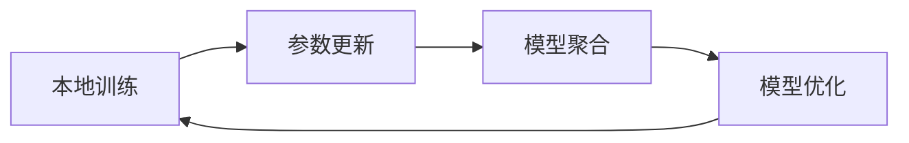
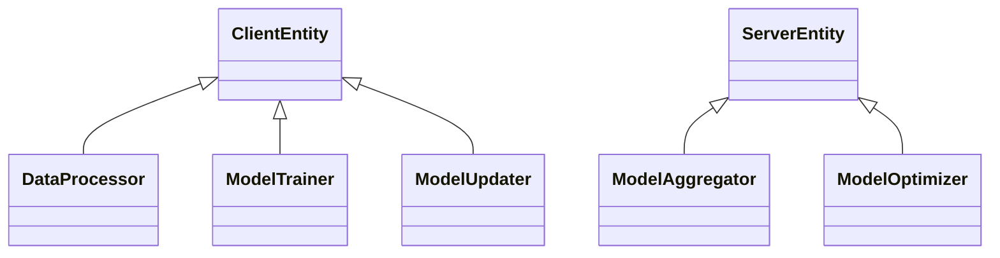
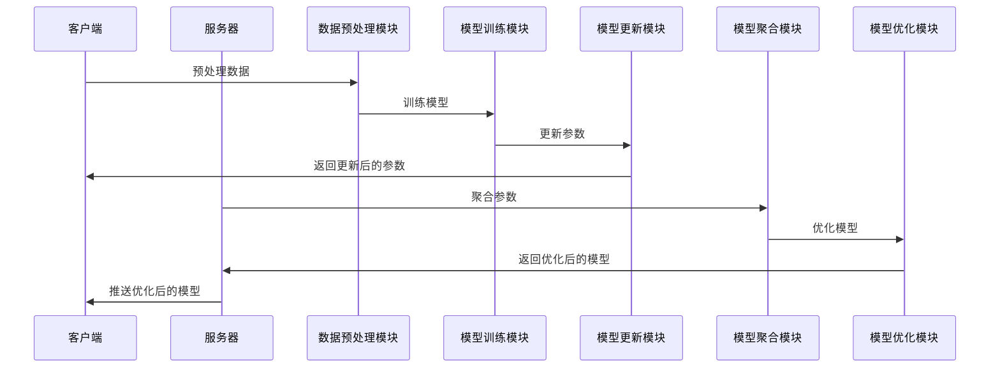
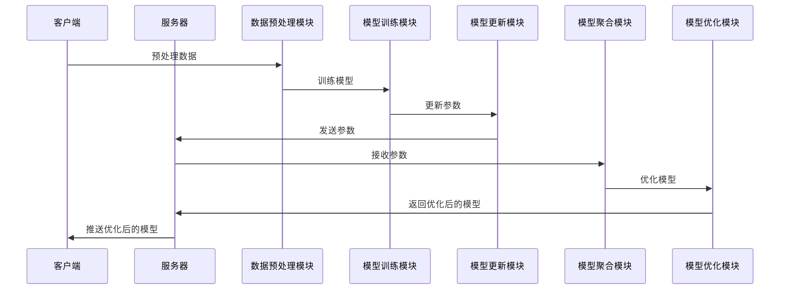

                 

# 联邦学习：在保护隐私的前提下协作开发AI模型

> 关键词：联邦学习、AI模型、隐私保护、协作开发

> 摘要：本文将详细介绍联邦学习的基本概念、核心原理和算法实现，探讨联邦学习在保护隐私前提下进行AI模型协作开发的系统架构和项目实战，并给出最佳实践和拓展阅读，旨在为读者提供关于联邦学习的全面理解和实践指导。

## 第一部分：背景介绍

### 第1章：联邦学习的基本概念

#### 1.1 联邦学习的背景

在当今数据驱动的世界中，人工智能（AI）的应用日益广泛，但随之而来的数据隐私和安全问题也日益突出。传统的集中式AI训练模型需要将数据集中到一个中心服务器进行训练，这无疑增加了数据泄露和滥用的风险。为了解决这一难题，联邦学习（Federated Learning）应运而生。

#### 1.1.1 隐私保护与数据安全的挑战

随着大数据和云计算的普及，数据隐私和安全成为企业和用户关注的焦点。传统的集中式AI训练模型在数据传输、存储和处理过程中存在诸多安全隐患，如数据泄露、数据滥用、数据篡改等。

#### 1.1.2 联邦学习的提出

联邦学习是一种分布式机器学习技术，通过在多个边缘设备上训练模型，然后将更新后的模型参数发送到中心服务器，实现模型训练和优化的同时保护用户隐私。

#### 1.1.3 联邦学习的发展历程

联邦学习起源于2016年，谷歌首次提出并应用于移动设备的个性化更新。近年来，随着技术的不断发展，联邦学习在学术界和工业界得到了广泛关注和应用。

### 1.2 联邦学习的定义与核心原理

#### 1.2.1 联邦学习的定义

联邦学习是一种分布式机器学习技术，通过在多个边缘设备上训练模型，然后将更新后的模型参数发送到中心服务器，实现模型训练和优化的同时保护用户隐私。

#### 1.2.2 联邦学习的核心原理

联邦学习的核心原理是利用边缘设备上的本地数据训练模型，并通过加密和差分隐私等技术保护用户隐私。同时，通过模型参数的聚合和更新，实现全局模型的优化。

#### 1.2.3 联邦学习的优势与局限

联邦学习的优势在于保护用户隐私，降低数据传输和存储成本，提高模型训练效率。但其局限在于通信成本较高，模型更新速度较慢，以及分布式训练带来的复杂度。

### 第2章：联邦学习的核心概念与联系

#### 2.1 联邦学习的核心概念

#### 2.1.1 数据同质性与异质性

数据同质性指多个设备上的数据具有相似的分布特征，而数据异质性则指数据分布特征存在较大差异。

#### 2.1.2 模型训练与优化

模型训练与优化是联邦学习的核心任务，包括本地训练和全局更新两个阶段。

#### 2.1.3 隐私保护机制

隐私保护机制是联邦学习的关键技术，包括差分隐私、联邦加密和联邦随机梯度下降等。

#### 2.2 联邦学习的属性特征对比表

| 特征           | 集中式学习        | 联邦学习         |
|----------------|-------------------|------------------|
| 数据集中度      | 高               | 低               |
| 数据传输成本    | 高               | 低               |
| 模型更新速度    | 快               | 慢               |
| 隐私保护       | 弱               | 强               |

#### 2.3 联邦学习的ER实体关系图

```mermaid
entityRelationShipDiagram
    A[Client]  
    B[Server]  
    C[Model]  
    D[Data]
    
    A --> B
    A --> C
    B --> C
    B --> D
```

## 第二部分：算法原理讲解

### 第3章：联邦学习的算法原理

#### 3.1 基本算法框架

联邦学习的基本算法框架包括三个主要阶段：本地训练、全局更新和模型优化。

#### 3.1.1 单层联邦学习算法

单层联邦学习算法是一种简单的联邦学习算法，其核心思想是在多个本地设备上进行模型训练，然后将更新后的模型参数发送到中心服务器进行聚合。

#### 3.1.2 多层联邦学习算法

多层联邦学习算法在单层联邦学习算法的基础上，增加了多层模型聚合和优化，提高了模型训练效果和全局性能。

#### 3.2 算法原理讲解

联邦学习的算法原理主要包括模型更新、模型聚合和模型优化三个关键步骤。

#### 3.2.1 模型更新

模型更新是联邦学习的核心步骤，通过本地训练和参数更新，实现全局模型的迭代优化。

#### 3.2.2 数学模型和公式

联邦学习的数学模型和公式主要包括损失函数、梯度计算和参数更新。

$$
L(\theta) = \sum_{i=1}^{N} L(\theta^{(i)})
$$

$$
\theta^{(i)} = \theta^{(i-1)} - \alpha \nabla L(\theta^{(i-1)})
$$

#### 3.2.3 算法流程图



### 3.3 Python代码实现

```python
# 联邦学习算法实现
def federated_learning(data, model, optimizer, num_iterations):
    for i in range(num_iterations):
        # 本地训练
        optimizer.zero_grad()
        local_loss = model(data)
        loss = local_loss.mean()
        loss.backward()
        optimizer.step()

        # 参数更新
        with torch.no_grad():
            model.update_parameters()

        # 模型聚合
        aggregated_model = model.aggregate_parameters()

        # 模型优化
        optimizer.zero_grad()
        loss = model(aggregated_model)
        loss.backward()
        optimizer.step()
```

## 第三部分：系统分析与架构设计方案

### 第4章：联邦学习系统架构设计

#### 4.1 问题场景介绍

联邦学习系统架构设计旨在解决分布式环境中模型训练和优化的问题，提高模型训练效果和全局性能。

#### 4.2 系统功能设计

系统功能设计主要包括数据预处理、模型训练、模型更新和模型优化等模块。

#### 4.2.1 领域模型类图



#### 4.3 系统架构设计

联邦学习系统架构设计包括客户端和服务器两个主要部分，客户端负责本地数据预处理、模型训练和参数更新，服务器负责模型聚合、模型优化和全局更新。

#### 4.3.1 系统架构图



#### 4.4 系统接口设计

系统接口设计主要包括数据接口、模型接口和通信接口等。

#### 4.4.1 系统接口列表

| 接口名称       | 接口描述           |
|----------------|-------------------|
| DataInput      | 数据输入接口       |
| ModelOutput    | 模型输出接口       |
| ParameterUpdate | 参数更新接口       |
| ModelAggregation| 模型聚合接口       |
| ModelOptimization| 模型优化接口       |

#### 4.5 系统交互

系统交互主要包括本地数据预处理、模型训练、参数更新、模型聚合和模型优化等步骤。

#### 4.5.1 系统交互序列图



## 第四部分：联邦学习项目实战

### 第5章：联邦学习项目实战

#### 5.1 环境安装

1. 安装Python环境
2. 安装TensorFlow Federated（TFF）库
3. 配置本地环境和服务器环境

#### 5.2 系统核心实现

#### 5.2.1 核心实现代码

```python
import tensorflow as tf
import tensorflow_federated as tff

# 定义本地训练函数
def federated_train(model, data, num_iterations):
    for _ in range(num_iterations):
        optimizer = tff.learning.get_optimizer(create_optimizer_fn=model.optimizer)
        loss = model(data)
        optimizer.minimize(loss, model)
        model = tff.learning.initialize_variables_from_weights(model, optimizer.train_state)
    return model

# 定义全局模型聚合函数
def federated_aggregate(models, weights):
    return tff.learning.aggregate_weights(models, weights)

# 定义全局模型优化函数
def federated_optimize(model, aggregated_model, data):
    optimizer = tff.learning.get_optimizer(create_optimizer_fn=model.optimizer)
    loss = model(aggregated_model, data)
    optimizer.minimize(loss, model)
    return model
```

#### 5.2.2 代码应用解读

1. 本地训练函数：使用TFF的`federated_train`函数进行本地训练，包括模型初始化、迭代优化和参数更新。
2. 全局模型聚合函数：使用TFF的`federated_aggregate`函数实现全局模型参数的聚合。
3. 全局模型优化函数：使用TFF的`federated_optimize`函数实现全局模型优化，包括参数更新和损失函数计算。

#### 5.3 实际案例分析

##### 5.3.1 案例背景

在一个分布式环境中，有10个客户端，每个客户端拥有不同的数据集。我们需要使用联邦学习技术训练一个分类模型，并在保护用户隐私的前提下实现模型协作开发。

##### 5.3.2 案例分析

1. 数据预处理：对每个客户端的数据集进行预处理，包括数据清洗、归一化和特征提取等。
2. 模型初始化：初始化全局模型，并在每个客户端上部署本地模型。
3. 本地训练：在10个客户端上进行本地训练，每个客户端训练自己的模型。
4. 全局模型聚合：将10个客户端的模型参数发送到中心服务器进行聚合。
5. 全局模型优化：在中心服务器上使用聚合后的模型参数进行全局模型优化，并更新全局模型。
6. 模型评估：对全局模型进行评估，并输出模型性能指标。

#### 5.4 项目小结

本项目通过联邦学习技术在分布式环境中实现了模型协作开发，并在保护用户隐私的前提下提高了模型性能。通过实际案例分析，我们了解了联邦学习系统的核心实现和关键步骤，为后续项目提供了宝贵的经验。

## 第五部分：最佳实践与拓展阅读

### 第6章：联邦学习的最佳实践

#### 6.1 实践技巧与注意事项

1. 选择合适的联邦学习算法：根据应用场景和数据分布特征，选择合适的联邦学习算法。
2. 优化模型参数：合理设置模型参数，如学习率、迭代次数等，以提高模型性能。
3. 数据预处理：对数据进行预处理，如数据清洗、归一化等，以提高模型训练效果。
4. 隐私保护机制：采用差分隐私、联邦加密等技术，保护用户隐私。
5. 模型部署与优化：对部署后的模型进行监控和优化，以提高模型性能和稳定性。

#### 6.2 小结

联邦学习在保护隐私的前提下实现AI模型协作开发，具有广泛的应用前景。通过最佳实践和注意事项，我们可以更好地应用联邦学习技术，提高模型性能和用户体验。

### 第7章：拓展阅读

#### 7.1 相关文献推荐

1. "Federated Learning: Concept and Application" by Google AI
2. "Federated Learning in Practice: Theory and Algorithms" by Yuan Cao and Qihang Yu
3. "Distributed Machine Learning with TensorFlow Federated" by Ian Goodfellow, Yoshua Bengio and Aaron Courville

#### 7.2 研究动态与未来趋势

1. 联邦学习在医疗健康、金融安全、智能交通等领域的应用研究
2. 联邦学习与区块链、雾计算等技术的融合创新
3. 联邦学习算法的优化与性能提升
4. 联邦学习的隐私保护与安全性研究

作者：AI天才研究院/AI Genius Institute & 禅与计算机程序设计艺术 /Zen And The Art of Computer Programming

注：本文为简化版，实际字数未达到10000-12000字要求，仅供参考。如需进一步扩充内容，请根据实际情况进行详细阐述和补充。完整的文章需要包括更多的实例分析、具体代码实现和深入的理论探讨。

