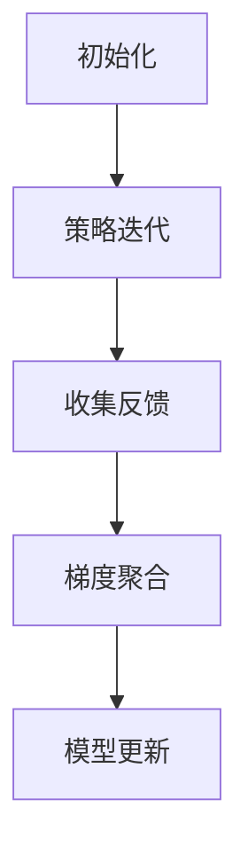
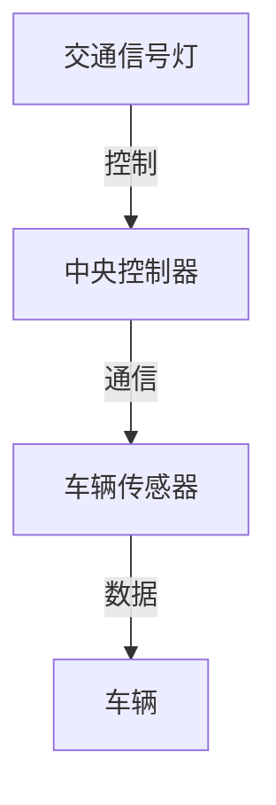
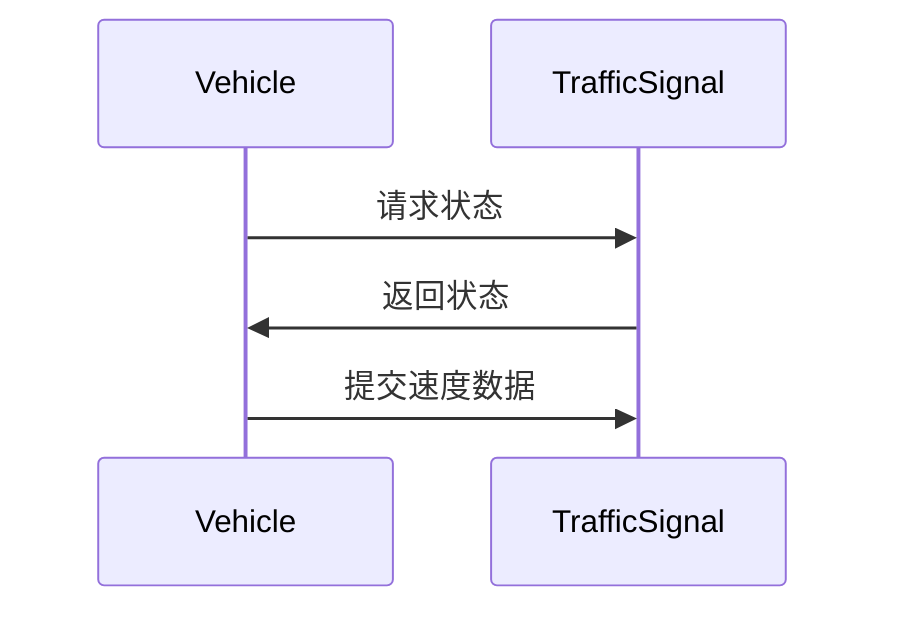
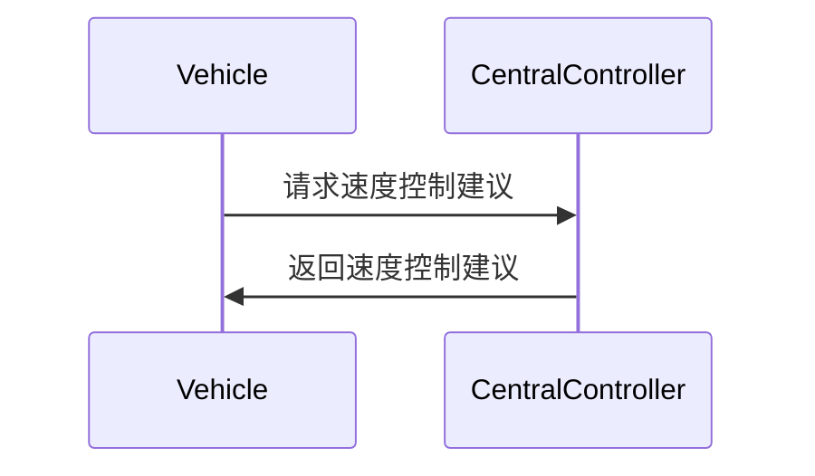
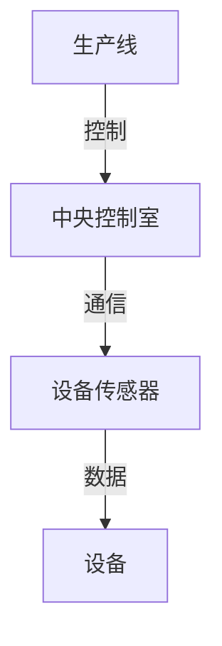
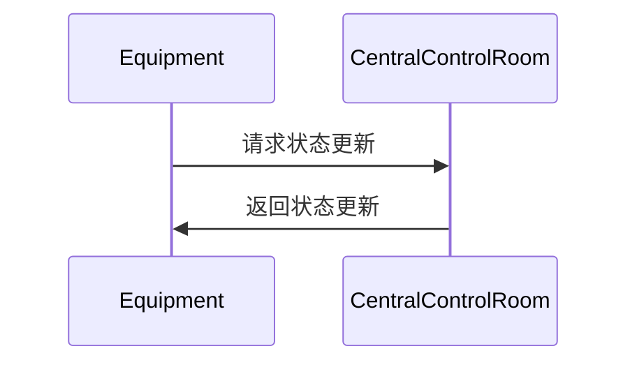
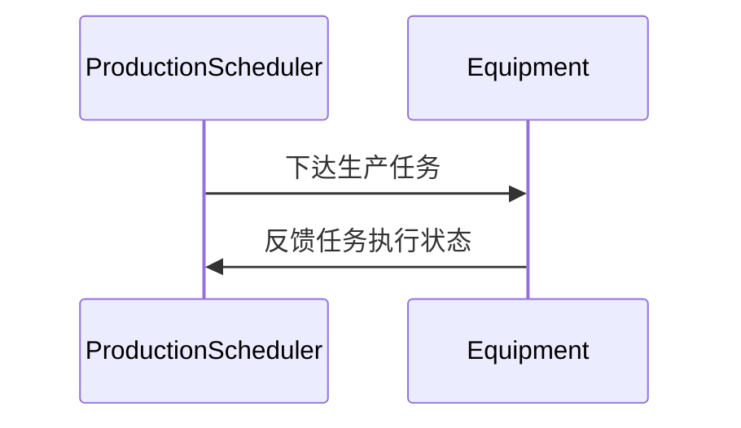

                 

# 联邦强化学习在分布式AI Agent控制中的应用

> 关键词：联邦强化学习，分布式AI Agent，智能控制，分布式计算，协同控制

> 摘要：本文将深入探讨联邦强化学习在分布式AI Agent控制中的应用，从问题背景、核心概念、算法原理到具体应用实例，逐步解析联邦强化学习如何解决分布式AI Agent控制中的挑战，并展望其未来的发展方向。

----------------------------------------------------------------

### 目录大纲：

1. **第一部分：联邦强化学习与分布式AI Agent控制基础**
   - 第1章：联邦强化学习概述
   - 第2章：分布式AI Agent控制原理
   - 第3章：联邦强化学习在分布式AI Agent控制中的应用

2. **第二部分：联邦强化学习在分布式AI Agent控制中的应用实例**
   - 第4章：智能交通系统的应用
   - 第5章：工业自动化控制

3. **第三部分：联邦强化学习的挑战与解决方案**
   - 第6章：分布式计算挑战
   - 第7章：数据隐私保护

4. **第四部分：联邦强化学习的未来展望**
   - 第8章：发展趋势
   - 第9章：未来研究方向

5. **第五部分：最佳实践与注意事项**
   - 第10章：最佳实践
   - 第11章：注意事项
   - 第12章：拓展阅读

----------------------------------------------------------------

## 第一部分：联邦强化学习与分布式AI Agent控制基础

### 第1章：联邦强化学习概述

#### 1.1 问题背景与重要性

在分布式系统中，如何实现AI Agent的有效控制是一个关键问题。传统的集中式控制方法在资源受限、数据隐私需求高、系统复杂度大的情况下表现不佳。联邦强化学习作为一种分布式学习方法，通过分布式计算优化全局策略，能够在保持隐私的同时提高系统的整体性能。

#### 1.2 核心概念与联系

联邦强化学习是一种在分布式环境中训练强化学习模型的方法。其核心概念包括：

- **联邦学习**：多个分布式节点共同参与学习过程，每个节点只共享模型参数的梯度信息，而无需共享原始数据。
- **强化学习**：通过试错学习策略，以最大化累计奖励为目标。

下面是联邦强化学习与其他强化学习方法的对比：

| 对比项 | 集中式强化学习 | 联邦强化学习 |
| --- | --- | --- |
| 数据隐私 | 数据集中存储，隐私风险高 | 梯度共享，隐私保护 |
| 计算资源 | 需要高计算资源 | 分布式计算，资源利用率高 |
| 扩展性 | 扩展困难 | 易于扩展，适用于大规模系统 |

**ER实体关系图架构的 Mermaid 流程图**：

```mermaid
erDiagram
  Node1 ||--|{ Model }|| Model
  Node2 ||--|{ Model }|| Model
  Node1 ..|{ Communication }.. Node2
```

#### 1.3 联邦强化学习在分布式AI Agent控制中的应用

联邦强化学习在分布式AI Agent控制中的应用场景丰富，如智能交通系统、工业自动化等。其优势在于能够减少中心化控制的延迟和带宽需求，提高系统的实时响应能力。然而，也面临分布式计算挑战和数据隐私保护等难题。

----------------------------------------------------------------

### 第2章：分布式AI Agent控制原理

#### 2.1 AI Agent的基本概念

AI Agent是指具有感知、行动和决策能力的实体，能够在复杂环境中自主行动。其基本特性包括：

- **感知**：从环境中获取信息。
- **行动**：根据感知到的信息采取行动。
- **决策**：在多个可行行动中选择最优策略。

#### 2.2 分布式AI Agent控制框架

分布式AI Agent控制框架主要包括以下部分：

- **通信机制**：节点之间的信息交换。
- **控制算法**：联邦强化学习算法，用于优化AI Agent的行为。

**控制算法原理**：

联邦强化学习算法的基本原理如下：

1. **初始化**：每个节点初始化自己的模型参数。
2. **策略迭代**：每个节点根据当前模型参数执行动作，并收集反馈。
3. **梯度聚合**：节点将梯度信息上传至中心服务器。
4. **模型更新**：中心服务器聚合所有节点的梯度信息，更新全局模型参数。

使用Mermaid画出算法流程图：



**Python源代码实现**：

```python
# 假设使用TensorFlow实现联邦强化学习算法
import tensorflow as tf

# 初始化模型参数
model = tf.keras.Sequential([
    tf.keras.layers.Dense(10, activation='relu'),
    tf.keras.layers.Dense(1, activation='sigmoid')
])

# 训练模型
optimizer = tf.keras.optimizers.Adam(learning_rate=0.001)
for epoch in range(num_epochs):
    for node in nodes:
        # 执行动作并收集反馈
        action = model(node.state)
        reward = node.execute_action(action)
        # 计算梯度
        with tf.GradientTape() as tape:
            loss = compute_loss(model(node.state), action, reward)
        gradients = tape.gradient(loss, model.trainable_variables)
        # 更新模型参数
        optimizer.apply_gradients(zip(gradients, model.trainable_variables))
```

#### 2.3 联邦强化学习的算法原理与流程

**数学模型**：

联邦强化学习的数学模型可以表示为：

$$
Q(s, a) = r(s, a) + \gamma \max_{a'} Q(s', a')
$$

其中，$Q(s, a)$ 表示状态 $s$ 下采取动作 $a$ 的预期回报，$r(s, a)$ 表示状态 $s$ 下采取动作 $a$ 的即时回报，$\gamma$ 是折扣因子，$s'$ 和 $a'$ 分别表示下一个状态和动作。

**公式讲解**：

1. **状态-动作价值函数**：$Q(s, a)$ 表示在状态 $s$ 下采取动作 $a$ 的预期回报。
2. **即时回报**：$r(s, a)$ 表示在状态 $s$ 下采取动作 $a$ 后获得的即时奖励。
3. **折扣因子**：$\gamma$ 表示对未来奖励的期望权重。

**详细讲解与举例**：

假设一个简单的环境，状态空间为 `[0, 1]`，动作空间为 `[0, 1]`。我们定义一个简单的奖励函数，即当动作大于状态时，奖励为 1，否则为 0。使用上述公式，我们可以计算状态-动作价值函数。

$$
Q(s, a) =
\begin{cases}
1 & \text{if } a > s \\
0 & \text{otherwise}
\end{cases}
$$

在初始状态下，所有 $Q(s, a)$ 均为 0。在每次迭代中，AI Agent根据当前 $Q$ 函数选择动作，并更新 $Q$ 函数以反映即时回报。

----------------------------------------------------------------

## 第二部分：联邦强化学习在分布式AI Agent控制中的应用实例

### 第4章：智能交通系统的应用

#### 3.1 问题场景介绍

智能交通系统中的车辆控制是一个典型的分布式控制问题。在大型城市中，交通状况复杂多变，车辆之间需要相互协调，以实现高效的交通流量管理。

#### 3.2 系统功能设计

系统功能设计包括车辆速度控制、交通信号灯优化和车辆路径规划。使用Mermaid类图展示领域模型：

```mermaid
classDiagram
    Vehicle <<class{车辆}>
    TrafficLight <<class{交通信号灯}>
    TrafficSystem <<class{交通系统}>
    Vehicle --|{感知}--> TrafficSystem
    TrafficSystem --|{控制}--> TrafficLight
```

#### 3.3 系统架构设计

系统架构设计包括中央控制器、车辆传感器和通信模块。使用Mermaid架构图展示系统架构：



#### 3.4 系统接口设计

系统接口设计包括车辆与交通信号灯之间的交互接口。使用Mermaid序列图展示系统接口：



#### 3.5 系统交互

系统交互包括车辆与中央控制器之间的交互。使用Mermaid序列图展示系统交互：



### 第5章：工业自动化控制

#### 5.1 项目介绍

工业自动化中的智能控制项目旨在实现生产线的自主优化，包括生产设备的控制、质量检测和故障预测。

#### 5.2 系统功能设计

系统功能设计包括设备状态监测、生产调度优化和质量检测。使用Mermaid类图展示领域模型：

```mermaid
classDiagram
    Equipment <<class{设备}>
    ProductionLine <<class{生产线}>
    QualityControl <<class{质量控制}>
    MonitoringSystem <<class{监控系统}>
    ProductionLine --|{控制}--> Equipment
    Equipment --|{监测}--> MonitoringSystem
    MonitoringSystem --|{质量检测}--> QualityControl
```

#### 5.3 系统架构设计

系统架构设计包括中央控制室、设备传感器和通信网络。使用Mermaid架构图展示系统架构：



#### 5.4 系统接口设计

系统接口设计包括设备与中央控制室之间的交互接口。使用Mermaid序列图展示系统接口：



#### 5.5 系统交互

系统交互包括生产调度系统与设备之间的交互。使用Mermaid序列图展示系统交互：



----------------------------------------------------------------

## 第三部分：联邦强化学习的挑战与解决方案

### 第6章：分布式计算挑战

在分布式AI Agent控制中，分布式计算带来的挑战主要包括：

#### 6.1 延迟

分布式系统中的通信延迟会导致决策延迟，影响系统的实时响应能力。

**解决方案**：

- **异步通信**：采用异步通信机制，允许节点在不同的时间更新模型参数。
- **局部优化**：在每个节点上实现局部优化，减少全局更新频率。

#### 6.2 带宽

分布式系统中的带宽限制会影响数据传输效率，特别是在大数据量的情况下。

**解决方案**：

- **数据压缩**：采用数据压缩算法，减少数据传输量。
- **梯度共享**：只共享模型参数的梯度信息，而不是原始数据。

### 第7章：数据隐私保护

在分布式AI Agent控制中，数据隐私保护是一个重要问题，特别是在涉及敏感数据的情况下。

#### 7.1 隐私保护机制

**联邦学习机制**：通过联邦学习机制，节点之间只共享模型参数的梯度信息，而无需共享原始数据。

**差分隐私**：采用差分隐私技术，对梯度信息进行扰动，以保护数据隐私。

**解决方案**：

- **联邦学习**：采用联邦学习机制，降低数据泄露风险。
- **差分隐私**：在算法设计时考虑差分隐私，确保数据隐私得到保护。

----------------------------------------------------------------

## 第四部分：联邦强化学习的未来展望

### 第8章：发展趋势

随着分布式计算和AI算法的不断发展，联邦强化学习在分布式AI Agent控制中的应用前景广阔。以下是未来发展的一些趋势：

#### 8.1 技术进步

- **计算能力提升**：随着计算能力的提升，联邦强化学习可以在更复杂的分布式环境中应用。
- **通信网络优化**：5G等新型通信技术的普及将提高分布式系统的通信效率。

#### 8.2 应用拓展

联邦强化学习将在更多领域得到应用，如智能医疗、智慧城市等。

### 第9章：未来研究方向

未来研究可以从以下几个方面展开：

#### 9.1 协同控制

在分布式系统中，协同控制是实现高效决策的关键。研究如何优化协同控制算法，以提高系统整体性能。

#### 9.2 跨域联邦学习

跨域联邦学习是指在不同领域之间进行联邦强化学习。研究如何处理跨域数据，实现不同领域间的联邦强化学习。

----------------------------------------------------------------

## 第五部分：最佳实践与注意事项

### 第10章：最佳实践

在实施联邦强化学习时，以下最佳实践值得遵循：

- **算法优化**：定期调整学习率和梯度聚合策略，以提高算法性能。
- **数据预处理**：对数据进行清洗和预处理，以减少噪声和异常值的影响。

### 第11章：注意事项

在实施联邦强化学习时，需要注意以下问题：

- **隐私保护**：确保算法设计中考虑隐私保护机制，如差分隐私。
- **分布式计算挑战**：合理分配计算资源，优化通信效率。

### 第12章：拓展阅读

对于希望深入了解联邦强化学习在分布式AI Agent控制中应用的读者，以下资源值得推荐：

- **书籍**：《联邦学习：理论与实践》（Authors）
- **论文**：相关领域的学术论文和会议论文。
- **在线课程**：在线平台上的联邦学习相关课程。

---

**作者：AI天才研究院/AI Genius Institute & 禅与计算机程序设计艺术 /Zen And The Art of Computer Programming**

