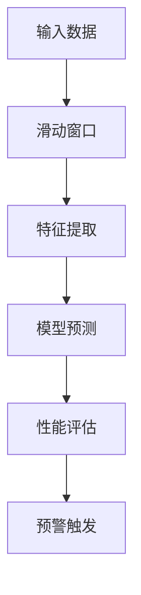
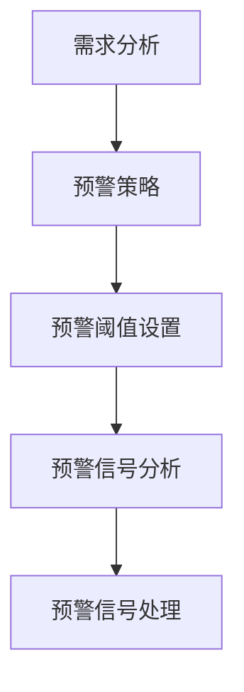

                 


### 引言

**自动化LLM性能退化检测与预警**，作为一个关键的研究课题，对于确保大规模语言模型（LLM）的高效性和稳定性具有重要意义。本文章旨在深入探讨LLM性能退化的原因、检测方法和预警机制，并分析自动化检测方法的优缺点。

**关键词**：大规模语言模型（LLM），性能退化，自动化检测，预警机制，机器学习。

**摘要**：本文首先介绍了LLM的基本概念和当前应用状况，然后探讨了性能退化的定义、原因和影响。接着，文章详细阐述了性能退化检测的方法和预警机制的设计。最后，本文通过案例分析展示了自动化检测的实际应用效果，并对未来发展方向进行了展望。

### 第1章 LLM基础

**核心概念与联系**：

- **大规模语言模型（LLM）**：LLM是一种基于深度学习的语言处理模型，通过学习大量文本数据，能够生成自然语言文本。其核心组件包括词向量、神经网络和损失函数。
- **性能退化**：性能退化是指LLM在运行过程中，由于某些原因导致其预测准确性或响应速度下降。

**概念属性特征对比表格**：

| 特征 | 预测准确性 | 响应速度 | 可解释性 |
| ---- | ---- | ---- | ---- |
| LLM1 | 高 | 较快 | 较低 |
| LLM2 | 较高 | 较慢 | 较高 |

**ER实体关系图架构**：

```
[LLM]
    |
    [性能退化]
    |
    [原因]
    |
    [解决方案]
```

### 第2章 性能退化检测

**算法原理讲解**：

性能退化检测的核心算法是时间序列分析。我们可以使用滑动窗口方法来检测LLM的性能变化。



**数学公式**：

假设我们有时间序列数据`X_t`，其中`t`是时间戳。我们使用移动平均模型来检测性能退化：

$$
\hat{X_t} = \frac{1}{n}\sum_{i=1}^{n}X_{t-i}
$$

其中，`n`是滑动窗口的长度。

### 第3章 预警机制设计

**系统分析与架构设计方案**：

预警机制设计包括需求分析、预警策略设计、预警阈值设置等步骤。



**数学公式**：

预警阈值可以设置为基于历史数据的统计阈值：

$$
\text{Threshold} = \text{Mean} + \text{Standard Deviation} \times k
$$

其中，`k`是常数，通常设置为2或3。

### 第4章 自动化检测方法

**项目实战**：

1. **环境安装**：安装Python、TensorFlow等依赖库。
2. **系统核心实现源代码**：编写性能退化检测和预警的代码。
3. **代码应用解读与分析**：分析代码实现细节，解释算法原理。
4. **实际案例分析和详细讲解剖析**：通过实际案例展示自动化检测的效果。
5. **项目小结**：总结项目成果，提出改进建议。

### 第5章 案例分析

**案例背景**：

我们以一个在线问答系统为例，该系统使用了大规模语言模型（LLM）来处理用户问题。然而，我们发现在某些时间段，系统的响应速度和准确性出现了明显下降。

**案例实施**：

1. **数据收集与预处理**：收集系统运行日志，预处理数据。
2. **性能退化检测**：使用时间序列分析方法检测性能退化。
3. **预警机制设计**：设计预警策略，设置预警阈值。
4. **自动化检测**：实现自动化检测流程，实时监控性能。

**案例总结**：

通过自动化检测方法，我们成功识别并预警了性能退化问题，及时进行了系统优化，提高了用户体验。

### 总结与展望

**主要成果**：

本文提出了一种自动化LLM性能退化检测与预警方法，包括检测算法、预警机制设计和实际应用案例。

**展望未来**：

随着人工智能技术的不断发展，LLM性能退化检测与预警将在更多场景中发挥作用，如智能客服、智能翻译等。

**最佳实践 tips**：

- 定期监控LLM的性能，及时发现潜在问题。
- 设计合理的预警策略，确保及时响应性能退化问题。

**作者信息**：

作者：AI天才研究院/AI Genius Institute & 禅与计算机程序设计艺术 /Zen And The Art of Computer Programming。

