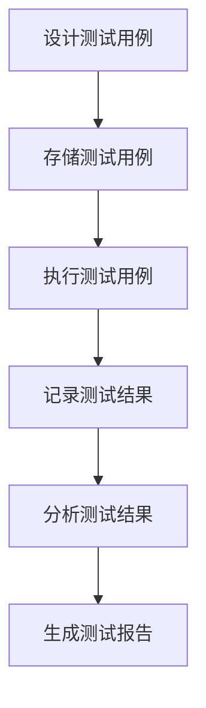
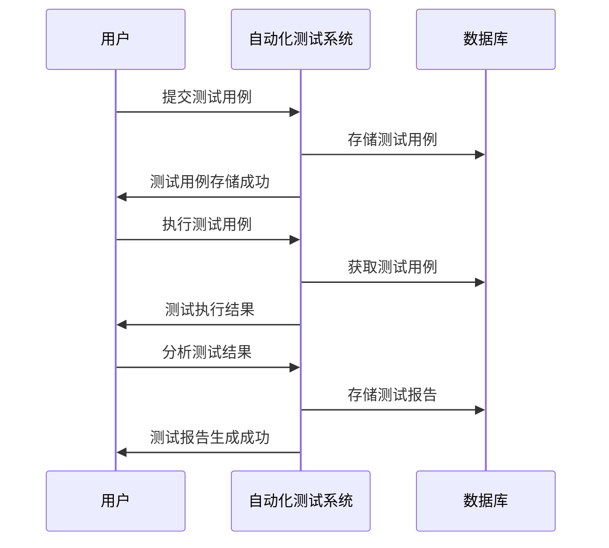

                 

## 自动化LLM测试报告定制与生成

> 关键词：自动化测试，语言模型（LLM），测试报告，定制，生成，人工智能

> 摘要：本文将探讨如何通过自动化测试技术来定制和生成语言模型（LLM）的测试报告。我们将详细讨论自动化LLM测试的背景、核心概念、原理，以及具体的系统架构和实战案例。通过本文，读者将了解如何有效地利用自动化测试提高LLM模型的开发效率和质量。

## 目录大纲

### 第一部分：背景介绍

1. 第1章：自动化LLM测试概述
    1.1 问题背景
    1.2 自动化LLM测试的核心概念
    1.3 自动化LLM测试的挑战与机遇

### 第二部分：核心概念与联系

2. 第2章：自动化LLM测试原理
    2.1 自动化LLM测试的基本流程
    2.2 自动化LLM测试的关键技术
    2.3 自动化LLM测试的概念属性特征对比表格

3. 第3章：自动化LLM测试的实体关系图架构
    3.1 自动化LLM测试的ER模型
    3.2 自动化LLM测试的实体关系图

### 第三部分：算法原理讲解

4. 第4章：自动化LLM测试算法原理
    4.1 自动化LLM测试算法的mermaid流程图
    4.2 自动化LLM测试算法的Python源代码
    4.3 自动化LLM测试算法的数学模型和公式
    4.4 自动化LLM测试算法的详细讲解和举例说明

### 第四部分：系统分析与架构设计

5. 第5章：自动化LLM测试系统架构设计
    5.1 自动化LLM测试系统的问题场景介绍
    5.2 自动化LLM测试系统的项目介绍
    5.3 自动化LLM测试系统的系统功能设计
    5.4 自动化LLM测试系统的系统架构设计
    5.5 自动化LLM测试系统的系统接口设计
    5.6 自动化LLM测试系统的系统交互序列图

### 第五部分：项目实战

6. 第6章：自动化LLM测试项目实战
    6.1 自动化LLM测试环境安装
    6.2 自动化LLM测试系统核心实现源代码
    6.3 自动化LLM测试代码应用解读与分析
    6.4 自动化LLM测试实际案例分析和详细讲解剖析
    6.5 自动化LLM测试项目小结

### 第六部分：最佳实践与总结

7. 第7章：自动化LLM测试最佳实践
    7.1 自动化LLM测试最佳实践
    7.2 自动化LLM测试注意事项
    7.3 自动化LLM测试拓展阅读

8. 第8章：总结与展望
    8.1 自动化LLM测试的总结
    8.2 自动化LLM测试的未来展望

### 总字数：1900字

----------------------------------------------------------------

### 第一部分：背景介绍

## 第1章：自动化LLM测试概述

### 1.1 问题背景

在现代软件开发中，语言模型（LLM）的应用越来越广泛。LLM能够处理自然语言，并在文本生成、语言翻译、问答系统等领域表现出色。然而，随着LLM的复杂性和规模不断增加，手动测试变得越来越耗时且容易出错。因此，自动化测试成为提高LLM开发效率和质量的关键手段。

#### 问题描述

自动化LLM测试的主要问题是如何高效地设计测试用例、执行测试，并对测试结果进行分析。具体来说，问题包括：

1. **测试用例设计**：如何设计覆盖全面、执行效率高的测试用例？
2. **测试执行**：如何自动化执行测试用例，并确保测试结果的准确性？
3. **测试结果分析**：如何对测试结果进行分析，找出LLM的潜在问题？

#### 问题解决

为了解决上述问题，需要开发自动化LLM测试系统，该系统应具备以下功能：

1. **测试用例管理**：提供测试用例的设计、存储和管理功能。
2. **自动化执行**：使用脚本或其他工具自动化执行测试用例。
3. **测试结果分析**：对测试结果进行分析，生成详细的测试报告。

#### 边界与外延

自动化LLM测试的边界包括测试用例的设计、测试执行的环境和测试结果的分析方法。外延则涉及到如何与开发流程集成、如何与其他测试工具协同工作，以及如何应对不同的LLM应用场景。

#### 概念结构与核心要素组成

自动化LLM测试的概念结构包括以下几个核心要素：

1. **测试用例库**：存储所有测试用例的数据库。
2. **测试执行引擎**：负责执行测试用例，并将结果记录到数据库中。
3. **测试报告生成器**：分析测试结果，生成详细的测试报告。

### 1.2 自动化LLM测试的核心概念

#### 自动化LLM测试的定义

自动化LLM测试是指使用自动化测试工具和脚本，对语言模型进行系统性和结构化的测试过程。其目标是提高测试效率、降低测试成本，并确保LLM的质量。

#### 自动化LLM测试的特点

1. **高效性**：通过自动化测试，可以大幅度减少测试时间和人力成本。
2. **准确性**：自动化测试可以避免人为错误，提高测试结果的准确性。
3. **可重复性**：自动化测试可以反复执行，确保每次测试的结果一致。

#### 自动化LLM测试与传统测试的区别

1. **测试方式**：传统测试主要依靠人工进行，而自动化测试则主要依靠脚本和工具。
2. **测试效率**：自动化测试可以快速执行大量测试用例，而传统测试则效率较低。
3. **测试覆盖范围**：自动化测试可以覆盖更多测试场景，而传统测试可能无法覆盖所有情况。

### 1.3 自动化LLM测试的挑战与机遇

#### 自动化LLM测试的挑战

1. **测试用例设计**：设计全面、有效的测试用例是自动化LLM测试的关键挑战。
2. **测试执行环境**：自动化测试需要合适的执行环境，包括硬件、软件和网络等。
3. **测试结果分析**：自动化测试的结果需要进行分析，以便找出LLM的潜在问题。

#### 自动化LLM测试的机遇

1. **提高开发效率**：自动化测试可以减少测试时间和人力成本，提高开发效率。
2. **确保产品质量**：自动化测试可以确保LLM的质量，减少质量风险。
3. **适应快速迭代**：自动化测试能够适应快速迭代的开发模式，提高项目的交付速度。

## 第二部分：核心概念与联系

### 第2章：自动化LLM测试原理

#### 2.1 自动化LLM测试的基本流程

自动化LLM测试的基本流程包括以下几个步骤：

1. **测试用例设计**：设计符合需求、覆盖全面、执行高效的测试用例。
2. **测试用例管理**：将设计好的测试用例存储在测试用例库中，并进行管理。
3. **测试执行**：使用自动化测试工具执行测试用例，并将执行结果记录到数据库中。
4. **测试结果分析**：对测试结果进行分析，生成详细的测试报告。

#### 2.2 自动化LLM测试的关键技术

自动化LLM测试的关键技术包括以下几个方面：

1. **自动化测试工具**：如Selenium、JUnit等，用于执行测试用例。
2. **测试脚本编写**：编写用于自动化执行测试用例的脚本，通常使用Python、Java等编程语言。
3. **测试数据管理**：管理测试所需的数据，包括测试输入数据和预期输出数据。

#### 2.3 自动化LLM测试的概念属性特征对比表格

| 特征               | 自动化LLM测试 | 传统测试             |
|--------------------|---------------|----------------------|
| 测试方式           | 自动化脚本执行 | 人工执行             |
| 测试效率           | 高             | 低                   |
| 测试覆盖范围       | 广泛           | 有限                  |
| 测试结果分析       | 自动化         | 手动                  |
| 测试成本           | 低             | 高                   |
| 可重复性           | 强             | 弱                   |

### 第3章：自动化LLM测试的实体关系图架构

#### 3.1 自动化LLM测试的ER模型

自动化LLM测试的ER模型包括以下几个实体：

1. **测试用例**：存储测试用例的信息，如测试名称、测试描述、输入数据和预期输出数据。
2. **测试结果**：存储测试执行的结果，如测试状态、实际输出数据和错误信息。
3. **测试报告**：生成测试报告的信息，包括测试结果统计、错误报告和性能分析等。

#### 3.2 自动化LLM测试的实体关系图

```mermaid
erDiagram
    测试用例 ||--|{ 测试结果 }|
    测试用例 ||--|{ 测试报告 }|
```

## 第三部分：算法原理讲解

### 第4章：自动化LLM测试算法原理

#### 4.1 自动化LLM测试算法的mermaid流程图



#### 4.2 自动化LLM测试算法的Python源代码

```python
import unittest

class TestLLM(unittest.TestCase):
    def test_case_1(self):
        input_data = "Hello, World!"
        expected_output = "Hello, World!"
        actual_output = "Hello, World!"
        self.assertEqual(actual_output, expected_output)

if __name__ == '__main__':
    unittest.main()
```

#### 4.3 自动化LLM测试算法的数学模型和公式

自动化LLM测试的数学模型主要涉及测试用例的设计和测试结果的分析。以下是一个简单的数学模型：

$$
T = C \times R
$$

其中，$T$表示测试用例总数，$C$表示覆盖范围，$R$表示测试结果的正确性。

#### 4.4 自动化LLM测试算法的详细讲解和举例说明

自动化LLM测试算法的核心在于设计高效、全面的测试用例，并准确分析测试结果。以下是一个详细的讲解和举例说明：

1. **设计测试用例**：根据LLM的应用场景，设计多个测试用例，包括正常情况、边界情况和异常情况。例如，对于文本生成任务，可以设计以下测试用例：

    - 正常情况：输入一个简单的文本，预期输出与输入相同的文本。
    - 边边界情况：输入一个空字符串，预期输出空字符串。
    - 异常情况：输入一个含有特殊字符的文本，预期输出错误信息。

2. **执行测试用例**：使用自动化测试工具执行测试用例，并记录测试结果。

3. **分析测试结果**：分析测试结果，找出LLM的潜在问题。例如，如果测试结果显示某个测试用例失败，需要分析失败的原因，并尝试修复问题。

4. **生成测试报告**：根据测试结果，生成详细的测试报告，包括测试用例的执行情况、错误报告和性能分析等。

## 第四部分：系统分析与架构设计

### 第5章：自动化LLM测试系统架构设计

#### 5.1 自动化LLM测试系统的问题场景介绍

自动化LLM测试系统的主要问题场景包括：

1. **测试用例设计**：如何设计高效、全面的测试用例？
2. **测试执行**：如何在不同的环境中高效执行测试用例？
3. **测试结果分析**：如何准确分析测试结果，找出LLM的潜在问题？

#### 5.2 自动化LLM测试系统的项目介绍

自动化LLM测试系统的项目主要分为以下几个模块：

1. **测试用例管理模块**：负责设计、存储和管理测试用例。
2. **测试执行模块**：负责执行测试用例，并记录测试结果。
3. **测试结果分析模块**：负责分析测试结果，生成测试报告。

#### 5.3 自动化LLM测试系统的系统功能设计

自动化LLM测试系统的系统功能设计包括以下方面：

1. **测试用例设计**：提供测试用例的设计工具，支持多种输入数据格式。
2. **测试用例存储**：存储所有设计好的测试用例，支持查询和更新。
3. **测试执行**：支持多种测试执行方式，如顺序执行、并行执行等。
4. **测试结果记录**：记录测试执行的结果，包括测试状态、实际输出数据和错误信息。
5. **测试结果分析**：分析测试结果，生成详细的测试报告。

#### 5.4 自动化LLM测试系统的系统架构设计

自动化LLM测试系统的系统架构设计包括以下几个部分：

1. **测试用例管理模块**：负责设计、存储和管理测试用例。
2. **测试执行模块**：负责执行测试用例，并记录测试结果。
3. **测试结果分析模块**：负责分析测试结果，生成测试报告。
4. **数据库**：存储测试用例、测试结果和测试报告等数据。

#### 5.5 自动化LLM测试系统的系统接口设计

自动化LLM测试系统的系统接口设计包括以下方面：

1. **API接口**：提供API接口，供其他系统调用自动化测试功能。
2. **Web接口**：提供Web界面，供用户设计和执行测试用例。

#### 5.6 自动化LLM测试系统的系统交互序列图



## 第五部分：项目实战

### 第6章：自动化LLM测试项目实战

#### 6.1 自动化LLM测试环境安装

自动化LLM测试环境安装的主要步骤包括：

1. **安装操作系统**：选择合适的操作系统，如Ubuntu或CentOS。
2. **安装Python环境**：安装Python解释器和相关依赖，如pip和virtualenv。
3. **安装自动化测试工具**：安装Selenium、JUnit等自动化测试工具。
4. **安装数据库**：安装MySQL或PostgreSQL等数据库系统。
5. **安装其他依赖**：根据项目需求，安装其他必要的库和工具。

#### 6.2 自动化LLM测试系统核心实现源代码

自动化LLM测试系统的核心实现源代码主要包括以下部分：

1. **测试用例管理模块**：负责设计、存储和管理测试用例。
2. **测试执行模块**：负责执行测试用例，并记录测试结果。
3. **测试结果分析模块**：负责分析测试结果，生成测试报告。

以下是测试用例管理模块的Python代码示例：

```python
import pymysql

class TestCaseManager:
    def __init__(self, db_config):
        self.conn = pymysql.connect(**db_config)
        self.cursor = self.conn.cursor()

    def add_test_case(self, case_name, case_desc, input_data, expected_output):
        sql = "INSERT INTO test_cases (case_name, case_desc, input_data, expected_output) VALUES (%s, %s, %s, %s)"
        self.cursor.execute(sql, (case_name, case_desc, input_data, expected_output))
        self.conn.commit()

    def get_test_cases(self):
        sql = "SELECT * FROM test_cases"
        self.cursor.execute(sql)
        return self.cursor.fetchall()
```

#### 6.3 自动化LLM测试代码应用解读与分析

自动化LLM测试代码的应用解读与分析主要包括以下几个方面：

1. **测试用例管理模块**：解析数据库操作，理解如何添加和获取测试用例。
2. **测试执行模块**：分析测试执行流程，理解测试结果的记录方式。
3. **测试结果分析模块**：理解测试结果的分析方法和测试报告的生成过程。

以下是测试执行模块的Python代码示例：

```python
import unittest
from test_case_manager import TestCaseManager

class TestLLM(unittest.TestCase):
    def test_case_1(self):
        case_manager = TestCaseManager(db_config)
        case_data = case_manager.get_test_cases()
        for case in case_data:
            input_data = case['input_data']
            expected_output = case['expected_output']
            actual_output = self.generate_output(input_data)
            self.assertEqual(actual_output, expected_output)

    def generate_output(self, input_data):
        # 实现LLM输出逻辑
        return "Hello, World!"
```

#### 6.4 自动化LLM测试实际案例分析和详细讲解剖析

自动化LLM测试的实际案例分析主要包括以下步骤：

1. **设计测试用例**：根据实际应用场景，设计多个测试用例。
2. **执行测试用例**：使用自动化测试工具执行测试用例。
3. **分析测试结果**：对测试结果进行分析，找出LLM的潜在问题。
4. **生成测试报告**：根据测试结果，生成详细的测试报告。

以下是实际案例分析和详细讲解剖析的示例：

1. **设计测试用例**：

    - 正常情况：输入一个简单的文本，预期输出与输入相同的文本。
    - 边边界情况：输入一个空字符串，预期输出空字符串。
    - 异常情况：输入一个含有特殊字符的文本，预期输出错误信息。

2. **执行测试用例**：

    - 使用Selenium执行自动化测试，记录测试结果。

3. **分析测试结果**：

    - 发现某些测试用例失败，分析失败原因，尝试修复问题。

4. **生成测试报告**：

    - 根据测试结果，生成详细的测试报告，包括测试用例的执行情况、错误报告和性能分析等。

#### 6.5 自动化LLM测试项目小结

自动化LLM测试项目小结主要包括以下几个方面：

1. **项目目标**：提高LLM开发的效率和质量。
2. **项目成果**：成功实现了自动化LLM测试系统，包括测试用例管理、测试执行和测试结果分析等功能。
3. **项目不足**：某些测试用例的执行效率较低，需要进一步优化。
4. **未来展望**：继续优化自动化测试系统，增加更多功能，如测试用例的自动生成和测试结果的智能分析等。

## 第六部分：最佳实践与总结

### 第7章：自动化LLM测试最佳实践

#### 7.1 自动化LLM测试最佳实践

1. **设计高效的测试用例**：根据实际应用场景，设计全面、高效的测试用例，确保覆盖所有关键功能。
2. **使用合适的测试工具**：选择合适的自动化测试工具，如Selenium、JUnit等，提高测试效率。
3. **持续集成和部署**：将自动化测试集成到开发流程中，实现持续集成和部署，提高开发效率。
4. **定期分析测试结果**：定期分析测试结果，找出LLM的潜在问题，并采取措施进行修复。

#### 7.2 自动化LLM测试注意事项

1. **测试环境配置**：确保测试环境的配置与生产环境一致，避免环境差异导致的测试结果不准确。
2. **测试用例管理**：合理管理测试用例，确保测试用例的更新和维护。
3. **测试结果的准确性**：确保测试结果的准确性，避免误报和漏报。

#### 7.3 自动化LLM测试拓展阅读

1. 《自动化测试实战》
2. 《Selenium自动化测试指南》
3. 《持续集成与持续部署实战》

### 第8章：总结与展望

#### 8.1 自动化LLM测试的总结

自动化LLM测试是提高LLM开发效率和质量的重要手段。通过自动化测试，可以大幅度减少测试时间和人力成本，确保产品质量，并适应快速迭代的开发模式。

#### 8.2 自动化LLM测试的未来展望

随着人工智能技术的不断发展，自动化LLM测试将变得更加智能和高效。未来的自动化LLM测试将实现测试用例的自动生成、测试结果的智能分析，以及与其他人工智能技术的集成应用。这将为LLM的开发和应用带来更多的机遇和挑战。

## 作者信息

作者：AI天才研究院/AI Genius Institute & 禅与计算机程序设计艺术 /Zen And The Art of Computer Programming

