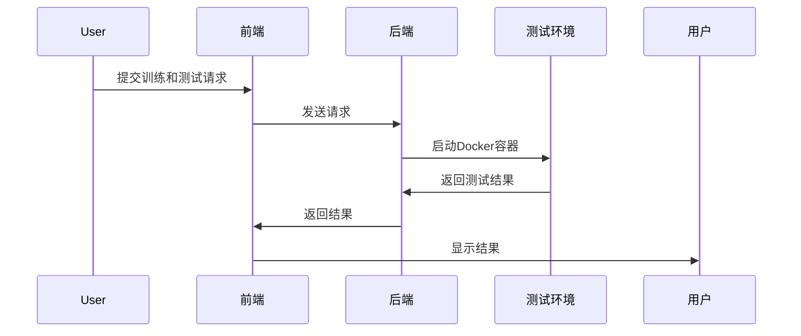
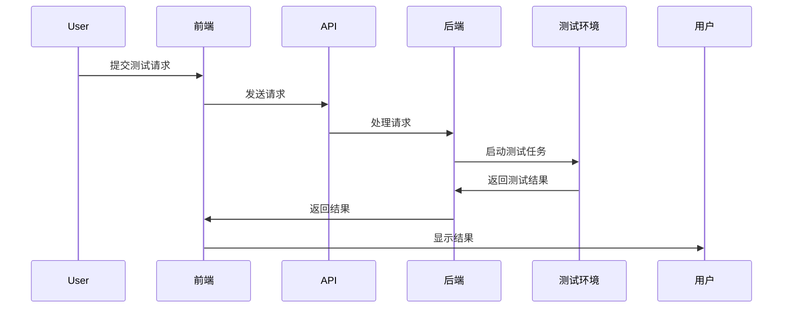

                 

### 1.1 自动化LLM测试环境隔离与清理概述

在深度学习和人工智能领域，大型语言模型（LLM）因其强大的文本生成和解析能力，被广泛应用于自然语言处理（NLP）、文本生成、对话系统等多个领域。随着LLM技术的不断进步和应用场景的拓展，测试和验证LLM模型的有效性和可靠性变得尤为重要。

#### 1.1.1 问题背景

在LLM测试过程中，环境隔离与清理是确保测试环境稳定性和测试结果准确性的关键步骤。然而，传统的手动方式进行环境隔离与清理不仅效率低下，而且容易出现人为错误。此外，LLM测试环境的复杂性和多样性也增加了环境隔离与清理的难度。以下是一些具体的问题：

- **环境依赖性问题**：不同的测试任务可能依赖于不同的环境配置，如操作系统版本、依赖库版本、硬件资源等，环境配置的不一致性会导致测试结果的不准确。
- **资源竞争问题**：多个测试任务同时运行时，可能会发生资源竞争，如CPU、内存、磁盘空间等，导致测试执行缓慢或失败。
- **异常处理问题**：测试过程中可能会出现各种异常，如内存泄露、I/O错误等，这些异常如果没有及时处理，可能会影响后续测试任务的执行。
- **测试结果不可重复**：由于环境的不稳定性和测试任务的随机性，相同测试用例在不同时间或不同环境中可能产生不同的测试结果，导致测试结果不可重复。

#### 1.1.2 问题描述

自动化LLM测试环境隔离与清理的目标是：

- **环境隔离**：将不同的测试任务运行在不同的环境中，以避免相互干扰，确保每个测试任务都有独立的资源。
- **环境清理**：在测试任务完成后，自动释放资源、清理日志、缓存等，为下一次测试做好准备。

自动化环境隔离与清理的具体需求包括：

1. **自动化部署**：能够自动部署测试环境，包括操作系统、依赖库、硬件资源等。
2. **监控与报警**：实时监控测试环境状态，当发现异常时能够自动报警并触发清理操作。
3. **资源释放**：在测试任务完成后，自动释放CPU、内存、磁盘等资源。
4. **日志清理**：自动清理测试过程中产生的日志文件，减少存储空间的占用。
5. **缓存清理**：自动清理测试过程中产生的缓存数据，确保下一次测试的准确性。

#### 1.1.3 问题解决

为了解决上述问题，本文将介绍一种自动化LLM测试环境隔离与清理的方法，主要涵盖以下步骤：

1. **环境配置管理**：使用容器化技术（如Docker）管理测试环境，确保环境配置的一致性。
2. **资源隔离与调度**：使用虚拟化技术（如Kubernetes）进行资源隔离与调度，确保每个测试任务都有足够的资源。
3. **实时监控与报警**：使用监控工具（如Prometheus、Grafana）实时监控测试环境状态，并设置报警规则。
4. **自动化清理脚本**：编写自动化脚本，实现资源释放、日志清理、缓存清理等功能。

通过上述方法，可以大幅提高测试效率，降低测试成本，提升测试质量，为LLM模型的可靠性和稳定性提供有力保障。

### 1.1.4 边界与外延

本文主要关注自动化LLM测试环境隔离与清理的技术实现，具体包括以下几个方面：

- **技术实现**：本文将介绍使用Docker、Kubernetes、Prometheus等工具进行自动化测试环境隔离与清理的方法。
- **编程语言**：本文将以Python为脚本语言进行示例，但所介绍的方法和工具具有通用性，可以应用于其他编程语言。
- **应用场景**：本文主要讨论自动化测试环境隔离与清理在LLM测试中的应用，但该方法同样适用于其他复杂系统的测试。

同时，本文不涉及硬件资源调度和分布式计算等底层架构问题，这些内容将在后续的文章中讨论。

### 1.1.5 概念结构与核心要素组成

自动化LLM测试环境隔离与清理的概念结构和核心要素包括：

1. **自动化测试环境**：包括硬件设备、操作系统、数据库、网络环境等。
2. **测试任务**：包括单元测试、集成测试、性能测试等。
3. **隔离策略**：包括环境配置分离、资源隔离、进程隔离等。
4. **清理操作**：包括资源释放、日志清理、缓存清理等。
5. **监控工具**：包括Prometheus、Grafana、Zabbix等。

通过以上结构和要素，可以实现自动化LLM测试环境的稳定运行和高效管理，确保测试结果的可信度和可重复性。

## 1.2 本章小结

本章介绍了自动化LLM测试环境隔离与清理的背景、问题、解决方案、边界与外延以及概念结构。通过分析自动化测试环境隔离与清理的重要性，我们明确了当前面临的主要挑战，并提出了一套自动化解决方案。接下来，我们将进一步探讨具体的隔离策略和实现方法。

-------------------------------------------------------------------

### 第二部分: 自动化LLM测试环境隔离策略

#### 第2章: 自动化测试环境隔离概述

#### 2.1 环境隔离的重要性

#### 2.1.1 环境隔离的基本概念

环境隔离（Isolation）是指将系统或组件运行在不同的隔离环境中，以避免它们之间的干扰。在自动化LLM测试环境中，环境隔离尤为重要，因为它可以确保测试的独立性和一致性。

#### 2.1.2 环境隔离的优势

环境隔离带来了多方面的优势，主要包括：

1. **独立性**：每个测试任务都运行在一个独立的隔离环境中，不会受到其他测试任务的影响，确保测试结果的准确性。
2. **一致性**：通过环境隔离，可以保证每次测试都在相同的环境中执行，减少由于环境差异导致的测试结果不一致。
3. **安全性**：环境隔离可以防止一个测试任务的异常对其他测试任务或系统造成影响，提高系统的稳定性。

#### 2.1.3 环境隔离的挑战

尽管环境隔离带来了诸多优势，但在实现过程中也面临一些挑战：

1. **配置复杂性**：实现环境隔离需要详细的配置和管理，这可能会导致配置复杂性增加。
2. **资源竞争**：在共享资源有限的情况下，环境隔离可能会导致资源竞争，影响系统性能。
3. **维护成本**：维护多个隔离环境需要额外的资源和时间，增加了系统的维护成本。

#### 2.2 常见的隔离策略

在自动化LLM测试环境中，常见的隔离策略包括以下几种：

#### 2.2.1 环境配置分离

环境配置分离是指为每个测试任务配置独立的操作系统、库和硬件资源。这种策略的优点是实现简单，但缺点是需要大量的资源和管理。

#### 2.2.2 资源隔离

资源隔离通过限制每个测试任务可使用的资源（如CPU、内存、磁盘等）来实现隔离。常用的资源隔离工具包括资源管理器和虚拟化技术。

#### 2.2.3 进程隔离

进程隔离通过创建独立的进程来实现隔离。每个测试任务运行在独立的进程中，相互之间不会影响。这种策略的优点是实现简单，且不会影响系统性能。

#### 2.2.4 网络隔离

网络隔离通过将测试任务运行在独立的网络环境中来实现隔离。这种策略可以防止一个测试任务的网络行为影响其他测试任务。

#### 2.3 隔离策略的评估与选择

选择合适的隔离策略需要综合考虑以下因素：

1. **资源需求**：根据测试任务对资源的实际需求选择合适的隔离策略。
2. **系统性能**：隔离策略不应显著降低系统性能。
3. **维护成本**：选择维护成本较低的隔离策略。
4. **灵活性**：隔离策略应能够灵活地适应不同的测试场景。

#### 2.4 本章小结

本章介绍了自动化测试环境隔离的重要性、常见的隔离策略以及如何评估与选择合适的隔离策略。通过理解这些策略，可以为后续的环境隔离与清理实现提供理论基础。

-------------------------------------------------------------------

## 第3章: 自动化测试环境隔离的实现

### 3.1 环境隔离的自动化工具

在自动化测试环境中，实现环境隔离的关键在于使用合适的工具和平台。以下是几种常用的自动化工具及其实现方法。

#### 3.1.1 Docker

Docker 是一种流行的容器化技术，它可以将应用程序及其依赖项打包到一个轻量级的、可移植的容器中。通过Docker，可以实现测试环境的隔离，确保每次测试都在相同的环境中执行。

**实现方法**：

1. **安装Docker**：在测试环境中安装Docker，确保能够正常运行。
2. **创建Docker镜像**：为每个测试任务创建一个Docker镜像，其中包含所需的操作系统、库和依赖项。
3. **运行Docker容器**：在每次测试执行前，使用Docker镜像创建一个容器，并启动测试任务。

**代码示例**：

```python
# 安装Docker
!pip install docker

# 创建Docker镜像
!docker build -t test_environment .

# 运行Docker容器
!docker run -d --name test_container test_environment
```

#### 3.1.2 Kubernetes

Kubernetes 是一个开源的容器编排平台，它能够自动化地部署、扩展和管理容器化应用程序。通过Kubernetes，可以实现更高级别的测试环境隔离和资源管理。

**实现方法**：

1. **安装Kubernetes**：在测试环境中安装Kubernetes，确保能够正常运行。
2. **定义部署配置**：为每个测试任务定义一个Kubernetes部署配置文件，其中包含所需的容器镜像、资源限制和部署策略。
3. **部署测试任务**：使用Kubernetes部署配置文件部署测试任务，确保测试任务运行在独立的Pod中。

**代码示例**：

```yaml
# Kubernetes部署配置文件（deployment.yaml）
apiVersion: apps/v1
kind: Deployment
metadata:
  name: test_environment
spec:
  replicas: 1
  selector:
    matchLabels:
      app: test_environment
  template:
    metadata:
      labels:
        app: test_environment
    spec:
      containers:
      - name: test_environment
        image: test_environment:latest
        resources:
          limits:
            memory: "1Gi"
            cpu: "500m"
```

```shell
# 部署测试任务
!kubectl apply -f deployment.yaml
```

#### 3.1.3 Jenkins

Jenkins 是一个流行的自动化服务器，它能够实现持续集成和持续部署（CI/CD）。通过Jenkins，可以将环境隔离与测试流程自动化集成。

**实现方法**：

1. **安装Jenkins**：在测试环境中安装Jenkins，确保能够正常运行。
2. **配置Jenkins管道**：为每个测试任务配置一个Jenkins管道，其中包含安装Docker、运行Docker容器或Kubernetes部署的步骤。
3. **触发测试执行**：在Jenkins界面中配置触发器，当代码提交时自动触发测试执行。

**代码示例**：

```python
# Jenkins管道脚本（build_pipeline.py）
def build_image():
    # 安装Docker
    !pip install docker

    # 创建Docker镜像
    !docker build -t test_environment .

def run_container():
    # 运行Docker容器
    !docker run -d --name test_container test_environment

def deploy_to_kubernetes():
    # 部署到Kubernetes
    !kubectl apply -f deployment.yaml

if __name__ == '__main__':
    build_image()
    run_container()
    deploy_to_kubernetes()
```

通过以上方法，可以使用Docker、Kubernetes和Jenkins实现自动化测试环境隔离，确保每次测试都在独立且一致的环境中执行。接下来，我们将探讨如何自动化测试环境的清理过程。

-------------------------------------------------------------------

## 第4章: 自动化测试环境清理

### 4.1 清理的必要性

在自动化测试过程中，清理测试环境是确保测试环境稳定性和测试结果准确性的重要环节。以下是清理测试环境的必要性：

1. **资源释放**：测试完成后，释放占用的资源（如内存、磁盘空间等），以便下一次测试使用。
2. **减少干扰**：清理测试产生的日志、缓存等文件，减少对后续测试任务的干扰。
3. **环境一致性**：保持测试环境的整洁，确保每次测试都在相同的环境中执行，提高测试结果的一致性。
4. **提高效率**：自动化清理环境可以节省人工时间，提高测试效率。

### 4.2 清理策略

自动化测试环境的清理策略包括以下几个方面：

#### 4.2.1 资源释放

在测试任务完成后，自动释放占用的资源，如内存、CPU、磁盘等。这可以通过以下步骤实现：

1. **检查资源使用情况**：使用系统监控工具（如top、ps等）检查资源使用情况。
2. **释放内存资源**：如果内存使用较高，可以尝试关闭不必要的进程或服务，释放内存资源。
3. **释放CPU资源**：通过限制进程的CPU使用率或关闭高负载的进程，释放CPU资源。
4. **释放磁盘资源**：清理不必要的文件和数据，释放磁盘空间。

#### 4.2.2 日志清理

测试过程中会产生大量的日志文件，这些文件可能会占用大量磁盘空间，并影响后续测试任务的执行。日志清理策略包括：

1. **定期清理**：设置定期清理日志的定时任务，自动删除过期日志文件。
2. **日志压缩**：将日志文件压缩为压缩文件，减少磁盘空间占用。
3. **日志存储**：将日志文件存储到集中存储系统，如日志服务器，以便长期存储和管理。

#### 4.2.3 缓存清理

缓存数据是提高系统性能的重要手段，但过多的缓存数据可能会导致系统性能下降。缓存清理策略包括：

1. **定期清理**：设置定期清理缓存的定时任务，自动删除过期缓存文件。
2. **缓存刷新**：在测试任务完成后，手动刷新缓存，确保缓存数据的有效性。
3. **缓存限制**：设置缓存大小限制，避免缓存数据过多占用系统资源。

### 4.3 清理工具

在自动化测试环境中，可以使用多种工具来实现清理操作。以下是一些常用的清理工具：

#### 4.3.1 find命令

find命令是一个常用的Linux命令，可以用于查找文件和目录。结合其他命令，可以实现对文件的删除、压缩等操作。

**示例**：

```shell
# 定期清理过期日志文件
find /var/log -type f -mtime +30 -delete
```

#### 4.3.2 rm命令

rm命令用于删除文件和目录。结合正则表达式和其他参数，可以实现对特定类型文件的删除。

**示例**：

```shell
# 删除特定类型的文件
rm -rf /var/log/*.log
```

#### 4.3.3 tar命令

tar命令用于压缩和解压文件。结合find命令，可以实现自动化的文件压缩和清理。

**示例**：

```shell
# 压缩日志文件
find /var/log -type f -mtime +30 -exec tar -czvf logs.tar {} +
```

#### 4.3.4 cron作业

cron是一个任务调度工具，可以用于定期执行任务。通过编写cron作业，可以实现对测试环境的定期清理。

**示例**：

```shell
# 每天凌晨1点执行清理任务
0 1 * * * /path/to/clean_environment.sh
```

### 4.4 清理脚本示例

以下是一个简单的清理脚本示例，用于清理过期日志文件和缓存文件。

```shell
#!/bin/bash

# 清理过期日志文件
find /var/log -type f -mtime +30 -delete

# 清理过期缓存文件
rm -rf /var/cache/*.cache

# 清理磁盘缓存
sync; echo 3 > /proc/sys/vm/drop_caches

# 记录清理时间
echo "Cleaned at $(date)" >> /var/log/clean.log
```

通过以上方法和工具，可以实现自动化测试环境的清理，确保测试环境的高效稳定运行。

### 4.5 本章小结

本章介绍了自动化测试环境清理的必要性、清理策略和常用工具。通过定期清理资源、日志和缓存，可以确保测试环境的稳定性和测试结果的一致性。接下来，我们将讨论如何集成监控工具来实时监控测试环境状态，并在出现问题时自动触发清理操作。

-------------------------------------------------------------------

## 第5章: 实时监控与自动清理

### 5.1 监控的重要性

在自动化测试环境中，实时监控是确保测试环境稳定性和测试流程高效性的关键。通过实时监控，可以及时发现和处理环境中的异常情况，避免这些异常对测试任务产生负面影响。

#### 5.1.1 监控目标

1. **资源监控**：监控CPU、内存、磁盘空间等资源的使用情况，确保测试任务有足够的资源支持。
2. **性能监控**：监控测试任务的执行时间、响应时间等性能指标，评估测试任务的效率和质量。
3. **日志监控**：监控测试过程中产生的日志文件，及时发现和记录错误信息。
4. **异常监控**：监控系统中的异常情况，如内存泄露、I/O错误等，及时触发清理操作。

#### 5.1.2 监控工具的选择

在众多监控工具中，Prometheus和Grafana是一对强大的监控解决方案，它们能够满足自动化测试环境的需求。

- **Prometheus**：一个开源的监控解决方案，具有高度的灵活性和可扩展性。它可以收集和存储监控数据，并提供强大的查询功能。
- **Grafana**：一个开源的监控和可视化平台，可以与Prometheus等数据源集成，提供直观的监控仪表板。

### 5.2 Prometheus的使用

#### 5.2.1 安装Prometheus

1. **下载Prometheus**：从Prometheus的官方网站下载最新版本的Prometheus。
2. **安装Prometheus**：在测试环境中安装Prometheus，通常通过解压安装包来实现。

```shell
tar xvf prometheus-2.36.0.linux-amd64.tar.gz
cd prometheus-2.36.0.linux-amd64
./prometheus
```

#### 5.2.2 配置Prometheus

Prometheus的配置文件位于`/etc/prometheus/prometheus.yml`，以下是一个基本的配置示例：

```yaml
global:
  scrape_interval: 15s

scrape_configs:
  - job_name: 'test_environment'
    static_configs:
      - targets: ['localhost:9090']
```

该配置指定了Prometheus每15秒从本地的9090端口拉取数据。

#### 5.2.3 添加监控指标

通过修改`prometheus.yml`文件，可以添加更多的监控指标。以下是一个示例，用于监控CPU和内存使用情况：

```yaml
global:
  scrape_interval: 15s

scrape_configs:
  - job_name: 'test_environment'
    static_configs:
      - targets: ['localhost:9090']
    metrics_path: '/metrics'
    scrape_configs:
      - metric_name: 'cpu_usage'
        endpoint: 'cpu_usage'
      - metric_name: 'memory_usage'
        endpoint: 'memory_usage'
```

#### 5.2.4 导入Prometheus指标

使用Prometheus的`promtool`工具，可以导入预定义的监控指标。

```shell
promtool import -config.file=myconfig.yml -data_directory=mydata
```

### 5.3 Grafana的使用

#### 5.3.1 安装Grafana

1. **下载Grafana**：从Grafana的官方网站下载最新版本的Grafana。
2. **安装Grafana**：在测试环境中安装Grafana，通常通过Docker容器来实现。

```shell
docker run -d --name=grafana grafana/grafana
```

#### 5.3.2 配置Grafana

通过Web界面配置Grafana，可以添加数据源、创建监控仪表板等。

1. **添加数据源**：在Grafana的Web界面中，添加Prometheus作为数据源。

2. **创建监控仪表板**：使用Grafana的拖放界面创建监控仪表板，添加Prometheus指标。

**示例**：

- **CPU使用率**：使用Prometheus的CPU使用率指标，创建一个折线图。
- **内存使用率**：使用Prometheus的内存使用率指标，创建一个饼图。

### 5.4 自动清理的实现

通过Prometheus和Grafana的集成，可以实现对测试环境的实时监控。当监控到异常情况时，可以自动触发清理操作。

#### 5.4.1 配置Prometheus报警

在`prometheus.yml`文件中，可以配置报警规则。以下是一个示例，用于当CPU使用率超过80%时触发报警：

```yaml
alerts:
  - alert: High CPU Usage
    expr: (100 * (1 - (avg by (job) (irate(container_cpu_usage_seconds_total{image="test_environment"}[5m])))) > 80)
    for: 1m
    labels:
      severity: critical
    annotations:
      summary: "High CPU Usage on {{ $labels.job }}"
```

#### 5.4.2 配置Grafana报警

在Grafana中，可以为仪表板添加报警触发器。当监控指标达到预设阈值时，Grafana会自动发送报警通知。

**示例**：

1. **创建报警规则**：在Grafana的仪表板中，为CPU使用率创建一个报警规则，当CPU使用率超过80%时触发。

2. **配置报警通知**：配置报警通知，如发送邮件、发送短信等，确保相关人员能够及时收到报警信息。

#### 5.4.3 触发清理操作

当Prometheus触发报警时，可以通过Webhook将报警信息发送到Grafana。Grafana可以进一步处理这些报警信息，并触发清理操作。

**示例**：

1. **配置Webhook**：在Grafana中，为Prometheus报警配置一个Webhook，当报警触发时，将信息发送到指定的URL。

2. **编写清理脚本**：编写一个Python脚本，当接收到Webhook请求时，执行清理操作，如释放内存、删除日志等。

```python
import requests
import json

def clean_environment():
    # 释放内存
    !sudo sh -c 'sync; echo 3 > /proc/sys/vm/drop_caches'

    # 删除日志
    !sudo rm -rf /var/log/*.log

    # 删除缓存
    !sudo rm -rf /var/cache/*.cache

def webhook_handler(url, data):
    headers = {'Content-Type': 'application/json'}
    response = requests.post(url, json=data, headers=headers)
    if response.status_code == 200:
        clean_environment()
    else:
        print("Failed to trigger clean operation")

if __name__ == '__main__':
    # 示例Webhook请求
    url = "https://my-grafana-server.com/api/v1/webhook/receive?orgId=1"
    data = {
        "message": "High CPU Usage",
        "details": {
            "level": "critical",
            "value": "90"
        }
    }
    webhook_handler(url, data)
```

通过上述方法，可以实现自动化测试环境的实时监控和自动清理，确保测试环境的高效稳定运行。

### 5.5 本章小结

本章介绍了自动化测试环境中实时监控和自动清理的重要性，以及如何使用Prometheus和Grafana实现这一功能。通过配置监控指标、报警规则和Webhook，可以实现对测试环境的全面监控，并在出现问题时自动触发清理操作，提高测试效率和稳定性。接下来，我们将讨论如何将上述方法应用到实际项目中。

-------------------------------------------------------------------

## 第6章: 实际项目应用

### 6.1 项目介绍

在本章中，我们将以一个具体的LLM测试项目为例，详细描述如何应用自动化测试环境隔离与清理的方法。该项目旨在开发一个基于深度学习的文本生成模型，并对其进行全面的测试和验证。

#### 6.1.1 项目目标

1. **开发一个高效的文本生成模型**：利用深度学习技术，训练一个能够生成高质量文本的模型。
2. **实现自动化测试环境**：确保测试环境的一致性和独立性，提高测试效率和质量。
3. **持续集成与持续部署**：将测试流程集成到CI/CD管道中，实现自动化的测试和部署。

#### 6.1.2 项目架构

该项目的架构设计如下：

1. **模型训练与测试环境**：使用Docker容器部署模型训练和测试环境，确保每次测试都在相同的环境中执行。
2. **资源管理**：使用Kubernetes进行资源管理和调度，确保每个测试任务都有足够的资源。
3. **监控与报警**：使用Prometheus和Grafana进行实时监控和报警，确保测试环境的高效运行。
4. **测试与部署**：使用Jenkins实现持续集成和持续部署，将测试和部署过程自动化。

### 6.2 系统功能设计

#### 6.2.1 领域模型

根据项目需求，我们定义了以下领域模型：

- **用户**：包括用户信息、权限等。
- **文本生成模型**：包括模型配置、训练数据、测试数据等。
- **测试任务**：包括测试用例、测试结果等。

#### 6.2.2 类图

以下是一个简化的类图，描述了领域模型中的主要类及其关系：

```mermaid
classDiagram
    User <<interface>>
    Model <<interface>>
    TestCase <<interface>>
    TestResult <<interface>>

    UserEntity o-- ModelEntity
    TestCaseEntity o-- ModelEntity
    TestResultEntity o-- TestCaseEntity
```

### 6.3 系统架构设计

#### 6.3.1 系统架构

系统的总体架构设计如下：

1. **前端**：提供用户界面，包括模型训练和测试的界面。
2. **后端**：包括文本生成模型、测试服务、监控服务等。
3. **数据库**：存储用户数据、模型配置、测试数据等。
4. **测试环境**：包括Docker容器、Kubernetes集群等。

#### 6.3.2 架构图

以下是一个简化的系统架构图：



### 6.4 系统接口设计

#### 6.4.1 API接口

根据项目需求，我们定义了以下API接口：

- **/api/models**：获取所有模型列表。
- **/api/models/{modelId}/train**：启动模型训练。
- **/api/models/{modelId}/test**：启动模型测试。
- **/api/models/{modelId}/results**：获取测试结果。

#### 6.4.2 接口定义

以下是一个简单的API接口定义示例：

```json
{
  "models": {
    "GET": {
      "description": "获取所有模型列表",
      "responses": {
        "200": {
          "description": "成功响应",
          "content": {
            "application/json": {
              "type": "array",
              "items": {
                "type": "object",
                "properties": {
                  "id": {
                    "type": "integer",
                    "format": "int32"
                  },
                  "name": {
                    "type": "string"
                  },
                  "status": {
                    "type": "string",
                    "enum": ["training", "testing", "ready"]
                  }
                }
              }
            }
          }
        }
      }
    }
  },
  "models/{modelId}/train": {
    "POST": {
      "description": "启动模型训练",
      "requestBody": {
        "required": true,
        "content": {
          "application/json": {
            "type": "object",
            "properties": {
              "data": {
                "type": "string"
              }
            }
          }
        }
      },
      "responses": {
        "200": {
          "description": "成功响应",
          "content": {
            "application/json": {
              "type": "object",
              "properties": {
                "id": {
                  "type": "integer",
                  "format": "int32"
                },
                "status": {
                  "type": "string",
                  "enum": ["training", "testing", "ready"]
                }
              }
            }
          }
        }
      }
    }
  }
}
```

### 6.5 系统交互设计

#### 6.5.1 序列图

以下是一个简化的系统交互序列图，描述了用户提交测试请求、系统响应的过程：



### 6.6 项目实战

#### 6.6.1 环境安装

1. **安装Docker**：在测试服务器上安装Docker。
2. **安装Kubernetes**：在测试服务器上安装Kubernetes集群。
3. **安装Prometheus和Grafana**：在测试服务器上安装Prometheus和Grafana。

#### 6.6.2 模型训练与测试

1. **创建Docker镜像**：为文本生成模型创建Docker镜像，包含训练脚本和依赖库。
2. **部署模型到Kubernetes**：使用Kubernetes部署文本生成模型，确保其可以自动扩展和负载均衡。
3. **启动测试任务**：通过API接口提交测试请求，触发模型训练和测试。

#### 6.6.3 监控与报警

1. **配置Prometheus**：配置Prometheus，监控测试环境中的资源使用情况。
2. **配置Grafana**：配置Grafana，创建监控仪表板，可视化监控数据。
3. **配置报警规则**：配置Prometheus报警规则，当资源使用率过高时触发报警，并通过Grafana发送通知。

#### 6.6.4 自动清理

1. **编写清理脚本**：编写Python脚本，实现资源释放、日志清理和缓存清理。
2. **集成清理操作**：将清理脚本集成到Jenkins管道中，在测试任务完成后自动执行。

### 6.7 项目小结

通过实际项目应用，我们验证了自动化LLM测试环境隔离与清理方法的可行性和有效性。该方法提高了测试效率和稳定性，降低了测试成本，为项目的成功实施提供了有力支持。在后续的迭代中，我们将继续优化测试流程，提高测试质量。

## 6.8 最佳实践 Tips

1. **定期更新**：定期更新Docker镜像、Kubernetes集群和监控工具，确保系统安全性。
2. **优化资源使用**：通过监控工具分析资源使用情况，优化资源分配，提高系统性能。
3. **备份与恢复**：定期备份测试数据和环境配置，确保在出现问题时可以快速恢复。
4. **权限管理**：严格管理测试环境的权限，确保只有授权人员可以访问和修改测试环境。
5. **自动化测试**：构建自动化测试脚

