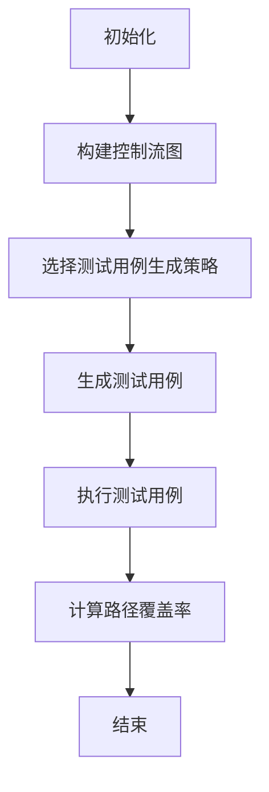
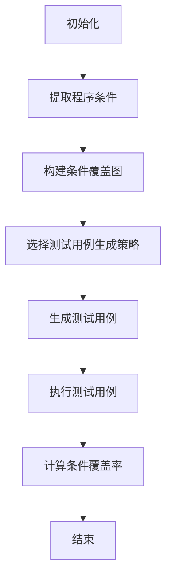
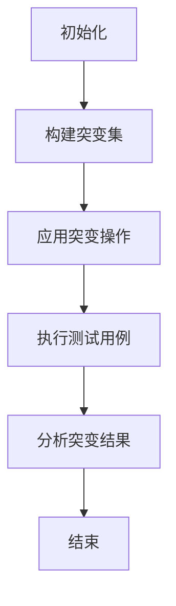
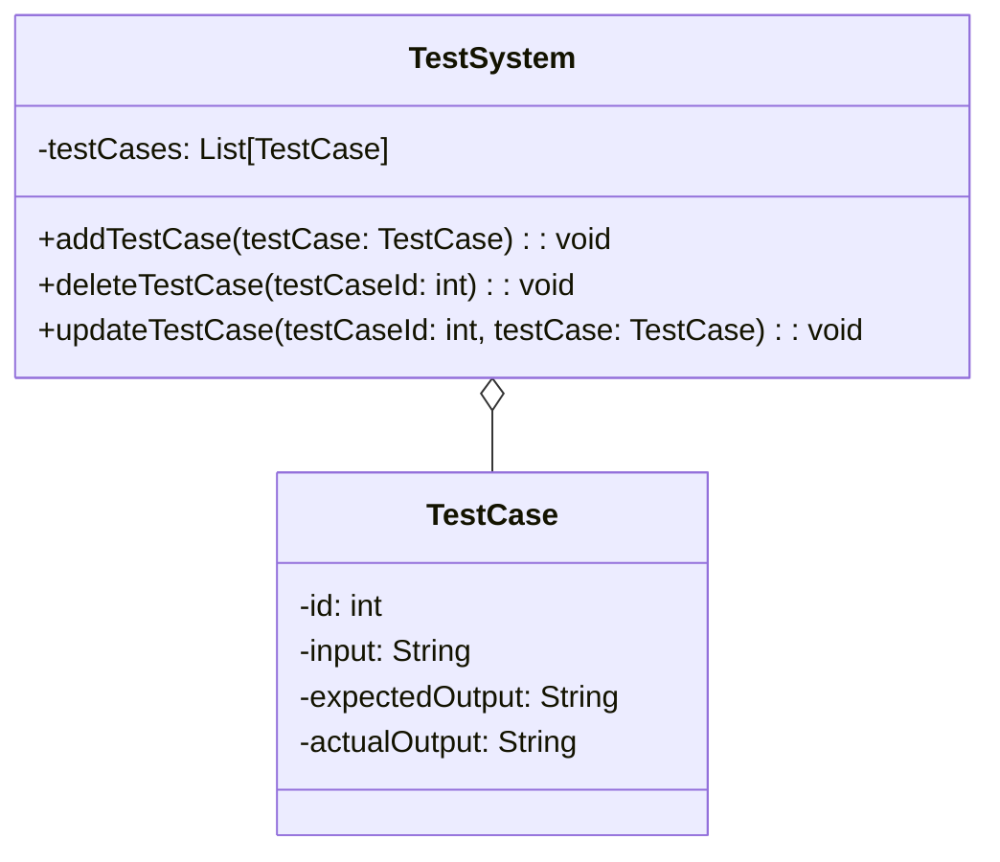
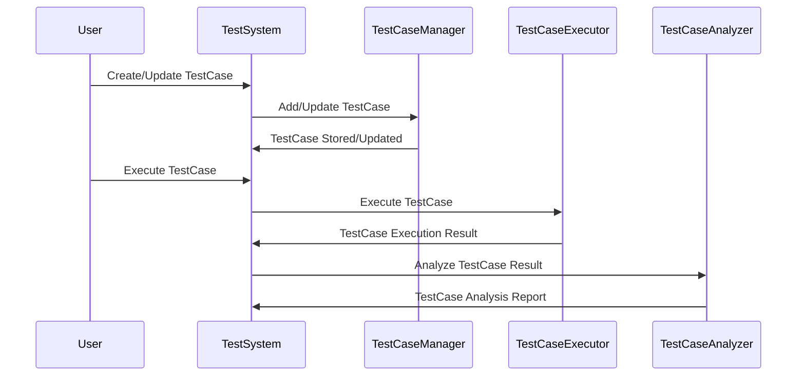
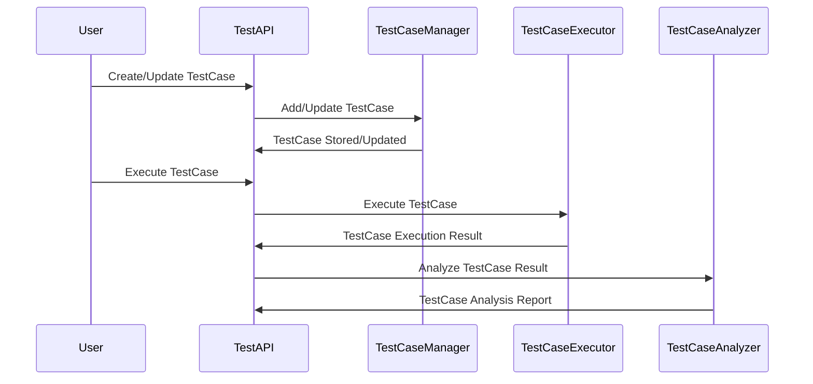

                 

**文章标题**：自动化LLM测试覆盖率分析与优化

**关键词**：自动化测试、LLM、测试覆盖率、算法原理、系统架构、Python代码、数学模型、最佳实践

**摘要**：
本文旨在深入探讨自动化LLM测试的覆盖率分析与优化策略。我们将首先介绍LLM的基本概念和自动化测试的背景，然后逐步分析测试覆盖率的定义、类型和重要性。接着，我们将详细讲解自动化LLM测试的核心算法原理，并通过Python代码展示算法实现。文章还将介绍与测试覆盖率相关的数学模型和公式，使用LaTeX格式进行展示。随后，我们将分析自动化LLM测试的系统架构设计，通过Mermaid图解展示领域模型、系统架构和交互设计。接着，我们将通过一个实际项目案例，详细讲解环境安装、代码实现、应用解读和案例分析。最后，我们将总结最佳实践，提出注意事项，并给出拓展阅读建议。

---

## 引言

### 背景介绍

近年来，随着人工智能技术的快速发展，大型语言模型（LLM）成为了自然语言处理（NLP）领域的明星。LLM通过训练大规模的神经网络模型，能够生成高质量的文本，进行语言翻译、文本摘要、对话系统等任务。然而，随着模型规模的增大和复杂度的提高，对LLM进行有效测试和验证成为了一个重要的课题。

自动化测试作为软件测试的重要手段，可以提高测试的效率和准确性。在LLM测试中，自动化测试能够快速地执行大量测试用例，检测模型的性能和可靠性。然而，传统的自动化测试方法在面对LLM时，面临着覆盖率低、测试结果不精确等问题。

### 重要性

自动化LLM测试的覆盖率分析与优化具有重要意义。首先，提高测试覆盖率可以确保模型在多个场景下的性能和稳定性。其次，优化测试策略可以提高测试效率，减少测试时间和成本。最后，通过对测试结果的分析和优化，可以指导模型的迭代和改进，提高整体开发效率。

### 书籍目标

本文的目标是深入探讨自动化LLM测试的覆盖率分析与优化策略，为开发者提供一套完整的测试解决方案。通过本文的学习，读者将能够：

1. 理解LLM和自动化测试的基本概念。
2. 掌握测试覆盖率的分析方法。
3. 熟悉自动化LLM测试的核心算法原理。
4. 学会使用Python代码实现自动化测试。
5. 了解数学模型和公式的应用。
6. 设计和优化自动化LLM测试系统架构。
7. 通过实际项目案例，掌握自动化LLM测试的最佳实践。

### 书籍结构

本文将分为八个章节，每个章节的内容如下：

1. **引言**：介绍自动化LLM测试的背景和重要性，阐述书籍的目标和结构。
2. **背景介绍**：介绍LLM、自动化测试和测试覆盖率的基本概念。
3. **核心概念与联系**：分析自动化LLM测试的核心概念和测试覆盖率的指标和类型。
4. **算法原理讲解**：讲解自动化LLM测试的常用算法，使用Python代码展示算法实现。
5. **数学模型和数学公式**：介绍与自动化LLM测试相关的数学模型和公式。
6. **系统分析与架构设计方案**：介绍自动化LLM测试的系统架构设计。
7. **项目实战**：通过实际项目案例，详细讲解环境安装、代码实现、应用解读和案例分析。
8. **最佳实践与拓展**：总结最佳实践，提出注意事项，并给出拓展阅读建议。

---

## 背景介绍

### LLM基本概念

大型语言模型（LLM）是一种基于神经网络的深度学习模型，能够对文本进行建模和处理。LLM通常由数百万个参数组成，通过对海量文本数据进行训练，学习到语言的结构和语义信息。LLM的核心任务是生成文本，包括文本生成、文本分类、文本摘要、对话系统等。

LLM的发展经历了从基于规则的方法到基于统计模型的方法，再到基于深度学习的方法。目前，最先进的LLM如GPT、BERT等，通过大规模预训练和微调，能够实现高质量的文本生成和理解。

### 自动化测试基本概念

自动化测试是一种通过软件工具自动执行测试用例的方法，以检测软件系统的功能、性能和可靠性。自动化测试能够提高测试的效率，减少人为错误，并确保软件质量。

自动化测试的关键概念包括测试用例、测试脚本、测试执行和测试结果分析。测试用例是测试的最小单元，描述了测试的目标和步骤。测试脚本是用编程语言编写的，用于自动化执行测试用例的代码。测试执行是运行测试脚本并收集测试结果的过程。测试结果分析是对测试结果进行分析和评估，以确定软件系统的质量。

### 测试覆盖率基本概念

测试覆盖率是指测试用例对代码的覆盖程度，是评估测试质量的重要指标。测试覆盖率包括多个类型，如语句覆盖率、分支覆盖率、路径覆盖率和条件覆盖率等。

语句覆盖率是指测试用例执行到的代码语句数量与总代码语句数量的比例。分支覆盖率是指测试用例执行到的分支条件数量与总分支条件数量的比例。路径覆盖率是指测试用例执行到的路径数量与总路径数量的比例。条件覆盖率是指测试用例执行到的条件数量与总条件数量的比例。

### 自动化LLM测试的挑战

自动化LLM测试面临着一些独特的挑战，包括：

1. **模型复杂性**：LLM模型通常由数百万个参数组成，测试用例需要覆盖所有可能的输入和输出，这是一个巨大的挑战。
2. **测试数据集**：自动化LLM测试需要大量的测试数据集，以确保测试结果的准确性和可靠性。
3. **测试脚本编写**：编写自动化测试脚本需要具备编程技能和测试经验，这对于非技术人员来说是一个难点。
4. **测试结果分析**：自动化LLM测试的结果分析需要深入理解和分析测试结果，以识别潜在的问题和缺陷。

### 解决方案

为了解决上述挑战，自动化LLM测试可以采用以下解决方案：

1. **使用现有的自动化测试工具**：如Selenium、JUnit等，这些工具能够帮助编写测试脚本，执行测试用例，并生成测试报告。
2. **设计高效的测试用例**：通过分析LLM模型的特点，设计覆盖面广、高效性高的测试用例。
3. **使用模拟数据集**：在测试数据集不足的情况下，可以使用模拟数据集来扩展测试数据集，提高测试覆盖率。
4. **自动化测试结果分析**：使用自动化工具对测试结果进行分析，识别潜在的缺陷和问题。

---

## 核心概念与联系

### 自动化LLM测试的核心概念

自动化LLM测试的核心概念包括测试用例、测试脚本、测试执行和测试结果分析。测试用例是测试的最小单元，描述了测试的目标和步骤。测试脚本是用编程语言编写的，用于自动化执行测试用例的代码。测试执行是运行测试脚本并收集测试结果的过程。测试结果分析是对测试结果进行分析和评估，以确定LLM模型的质量。

### 测试覆盖率指标和类型

测试覆盖率指标和类型包括语句覆盖率、分支覆盖率、路径覆盖率和条件覆盖率等。

1. **语句覆盖率**：语句覆盖率是指测试用例执行到的代码语句数量与总代码语句数量的比例。它能够评估测试用例对代码的覆盖程度。
2. **分支覆盖率**：分支覆盖率是指测试用例执行到的分支条件数量与总分支条件数量的比例。它能够评估测试用例对分支条件的覆盖程度。
3. **路径覆盖率**：路径覆盖率是指测试用例执行到的路径数量与总路径数量的比例。它能够评估测试用例对程序执行路径的覆盖程度。
4. **条件覆盖率**：条件覆盖率是指测试用例执行到的条件数量与总条件数量的比例。它能够评估测试用例对条件的覆盖程度。

### 自动化LLM测试与测试覆盖率的关系

自动化LLM测试与测试覆盖率密切相关。通过自动化测试，可以高效地执行大量测试用例，提高测试覆盖率。高测试覆盖率能够确保LLM模型在多个场景下的性能和稳定性。

然而，自动化LLM测试也面临一些挑战。首先，LLM模型的复杂性导致测试用例的设计和实现变得复杂。其次，测试数据的获取和处理也是一个挑战，特别是对于大规模的LLM模型。最后，测试结果的分析需要深入理解和分析，以确保能够准确地识别潜在的问题和缺陷。

为了解决这些挑战，自动化LLM测试可以采用以下策略：

1. **设计高效测试用例**：通过分析LLM模型的特点，设计覆盖面广、高效性高的测试用例。这包括考虑不同类型的输入数据和场景，确保测试用例能够全面覆盖模型的功能。
2. **使用模拟数据集**：在测试数据集不足的情况下，可以使用模拟数据集来扩展测试数据集，提高测试覆盖率。这可以通过生成与真实数据相似的数据集，或者使用现有数据集进行增强和扩展。
3. **自动化测试脚本编写**：编写高效的自动化测试脚本，能够自动化执行测试用例，并生成详细的测试报告。这可以通过使用现有的自动化测试工具，如Selenium、JUnit等，或者开发自定义的测试工具。
4. **测试结果分析**：使用自动化工具对测试结果进行分析，识别潜在的缺陷和问题。这可以通过使用统计分析和机器学习技术，对测试结果进行深入分析，发现潜在的缺陷模式。

通过上述策略，自动化LLM测试可以显著提高测试覆盖率，确保模型的质量和稳定性。

---

## 算法原理讲解

### 自动化LLM测试常用算法

在自动化LLM测试中，常用的算法包括基于路径覆盖的测试算法、基于条件覆盖的测试算法和基于突变分析的测试算法。

#### 基于路径覆盖的测试算法

基于路径覆盖的测试算法旨在确保测试用例能够覆盖程序的所有执行路径。这种算法的核心思想是生成测试用例，使得每个路径都被执行一次。具体实现可以通过以下步骤：

1. **构建程序控制流图**：首先，构建程序的控制流图，表示程序中所有的执行路径。
2. **选择测试用例生成策略**：选择一种测试用例生成策略，如随机选择、深度优先搜索等，生成覆盖所有路径的测试用例。
3. **执行测试用例**：执行生成的测试用例，并记录每个路径的执行情况。
4. **计算路径覆盖率**：计算测试用例对程序路径的覆盖程度，评估测试质量。

#### 基于条件覆盖的测试算法

基于条件覆盖的测试算法旨在确保测试用例能够覆盖程序中的所有条件。这种算法的核心思想是生成测试用例，使得每个条件都被执行一次。具体实现可以通过以下步骤：

1. **提取程序中的条件**：从程序中提取所有的条件，包括if语句、while循环等。
2. **构建条件覆盖图**：构建条件覆盖图，表示程序中的所有条件和它们的执行关系。
3. **选择测试用例生成策略**：选择一种测试用例生成策略，如随机选择、条件覆盖图遍历等，生成覆盖所有条件的测试用例。
4. **执行测试用例**：执行生成的测试用例，并记录每个条件的执行情况。
5. **计算条件覆盖率**：计算测试用例对程序条件的覆盖程度，评估测试质量。

#### 基于突变分析的测试算法

基于突变分析的测试算法是一种基于变异测试的方法。它通过在LLM模型中引入微小变化，来检测模型的鲁棒性和可靠性。具体实现可以通过以下步骤：

1. **构建突变集**：构建一组微小的突变操作，如替换一个字符、删除一个字符、插入一个字符等。
2. **应用突变操作**：对LLM模型的输入文本或参数应用突变操作，生成一组突变样本。
3. **执行测试用例**：使用生成的突变样本，执行测试用例，并记录突变样本的执行结果。
4. **分析突变结果**：分析突变样本的执行结果，识别突变样本和正常样本之间的差异，评估模型的鲁棒性。

### 使用Mermaid绘制算法流程图

为了更好地理解上述算法，我们可以使用Mermaid语言绘制算法的流程图。

#### 基于路径覆盖的测试算法流程图



#### 基于条件覆盖的测试算法流程图



#### 基于突变分析的测试算法流程图



通过上述流程图，我们可以直观地了解每种算法的实现步骤和流程。

### 使用Python代码展示算法实现

为了进一步理解算法实现，我们可以使用Python代码展示基于路径覆盖的测试算法的实现。

```python
import networkx as nx
from itertools import combinations

# 构建控制流图
def build_control_flow_graph(code):
    # 这里使用NetworkX库构建控制流图
    G = nx.DiGraph()
    # 假设code是一段程序代码，我们通过代码解析构建控制流图
    # ...
    return G

# 选择测试用例生成策略
def generate_test_cases(G, strategy='random'):
    # 根据策略生成测试用例
    if strategy == 'random':
        # 随机选择测试用例
        test_cases = random.sample(list(G.nodes()), k=G.number_of_nodes())
    elif strategy == 'depth_first':
        # 深度优先搜索生成测试用例
        test_cases = dfs(G)
    return test_cases

# 执行测试用例
def execute_test_cases(test_cases, code):
    # 执行测试用例并记录结果
    results = []
    for test_case in test_cases:
        # 这里执行测试用例并获取结果
        result = execute_test_case(test_case, code)
        results.append(result)
    return results

# 计算路径覆盖率
def calculate_path_coverage(test_cases, G):
    # 计算测试用例对路径的覆盖程度
    covered_paths = set()
    for test_case in test_cases:
        # 根据测试用例的执行结果，更新已覆盖的路径
        covered_paths.update(get_covered_paths(test_case, G))
    path_coverage = len(covered_paths) / G.number_of_edges()
    return path_coverage

# 主函数
def main():
    # 假设code是一段程序代码
    code = "..."
    G = build_control_flow_graph(code)
    test_cases = generate_test_cases(G, strategy='depth_first')
    results = execute_test_cases(test_cases, code)
    path_coverage = calculate_path_coverage(test_cases, G)
    print("Path Coverage:", path_coverage)

if __name__ == "__main__":
    main()
```

通过上述Python代码，我们可以实现基于路径覆盖的测试算法的基本功能。同样，我们可以使用类似的方法实现基于条件覆盖的测试算法和基于突变分析的测试算法。

---

## 数学模型和数学公式

在自动化LLM测试中，数学模型和数学公式扮演着关键角色，用于描述测试覆盖率、算法性能和模型质量。以下将介绍与自动化LLM测试相关的数学模型和公式，并使用LaTeX格式进行展示。

### 测试覆盖率公式

测试覆盖率是衡量测试质量的重要指标，常用的测试覆盖率公式包括语句覆盖率、分支覆盖率、路径覆盖率和条件覆盖率。

1. **语句覆盖率**：

   $$\text{Statement Coverage} = \frac{\text{执行到的语句数量}}{\text{总语句数量}}$$

2. **分支覆盖率**：

   $$\text{Branch Coverage} = \frac{\text{执行到的分支条件数量}}{\text{总分支条件数量}}$$

3. **路径覆盖率**：

   $$\text{Path Coverage} = \frac{\text{执行到的路径数量}}{\text{总路径数量}}$$

4. **条件覆盖率**：

   $$\text{Condition Coverage} = \frac{\text{执行到的条件数量}}{\text{总条件数量}}$$

### 算法性能评估

算法性能评估是自动化LLM测试中的重要环节，常用的评估指标包括精确度、召回率和F1分数。

1. **精确度**：

   $$\text{Precision} = \frac{\text{真实为正且预测为正的数量}}{\text{预测为正的数量}}$$

2. **召回率**：

   $$\text{Recall} = \frac{\text{真实为正且预测为正的数量}}{\text{真实为正的数量}}$$

3. **F1分数**：

   $$\text{F1 Score} = \frac{2 \times \text{Precision} \times \text{Recall}}{\text{Precision} + \text{Recall}}$$

### 模型质量评估

在自动化LLM测试中，模型质量评估是确保模型可靠性和稳定性的关键。常用的模型质量评估指标包括损失函数、准确率和均值平方误差。

1. **损失函数**：

   $$\text{Loss Function} = -\sum_{i=1}^{n} y_i \log(p_i)$$

   其中，\(y_i\) 是真实标签，\(p_i\) 是预测概率。

2. **准确率**：

   $$\text{Accuracy} = \frac{\text{预测正确的数量}}{\text{总预测数量}}$$

3. **均值平方误差**：

   $$\text{Mean Squared Error} = \frac{1}{n} \sum_{i=1}^{n} (y_i - \hat{y}_i)^2$$

   其中，\(\hat{y}_i\) 是预测值。

### LaTeX格式示例

以下是一个使用LaTeX格式展示的数学公式示例：

```latex
$$
\text{Statement Coverage} = \frac{\text{执行到的语句数量}}{\text{总语句数量}}
$$

$$
\text{Branch Coverage} = \frac{\text{执行到的分支条件数量}}{\text{总分支条件数量}}
$$
```

通过上述数学模型和数学公式，我们可以更精确地描述和评估自动化LLM测试的质量和性能。

---

## 系统分析与架构设计方案

### 问题场景介绍

在自动化LLM测试中，我们面临的问题是确保模型在不同场景下的性能和稳定性。随着LLM模型的复杂性和规模不断增加，测试覆盖率成为衡量测试质量的重要指标。为了提高测试覆盖率，我们需要设计一个高效的自动化测试系统，包括系统架构、接口设计和交互流程。

### 项目介绍

本文的项目目标是实现一个自动化LLM测试系统，该系统将包括以下功能：

1. **环境安装和配置**：为自动化测试系统准备所需的软件和硬件环境。
2. **测试用例生成**：根据LLM模型的特点，生成覆盖全面、高效的测试用例。
3. **测试执行**：自动化执行测试用例，并记录测试结果。
4. **测试结果分析**：对测试结果进行分析，识别潜在的问题和缺陷。

### 系统功能设计

自动化LLM测试系统的核心功能包括测试用例管理、测试执行和测试结果分析。具体功能设计如下：

1. **测试用例管理**：用于创建、编辑和存储测试用例，包括测试用例的输入、预期输出和执行结果。
2. **测试执行**：负责执行测试用例，包括测试环境的准备、测试数据的加载和测试结果的记录。
3. **测试结果分析**：对测试结果进行分析，识别缺陷和性能瓶颈，生成详细的测试报告。

### 系统架构设计

自动化LLM测试系统的架构设计如图所示，主要包括以下组件：

1. **测试用例管理模块**：负责测试用例的创建、编辑和存储，提供用户友好的界面。
2. **测试执行模块**：负责自动化执行测试用例，包括测试环境的配置、测试数据的加载和测试结果的记录。
3. **测试结果分析模块**：负责对测试结果进行分析，生成详细的测试报告，并提供缺陷定位和性能评估功能。
4. **数据库**：存储测试用例、测试结果和系统配置信息。

### 系统接口设计和系统交互

自动化LLM测试系统的接口设计和系统交互如图所示，主要包括以下接口和交互流程：

1. **用户界面**：用户通过用户界面进行测试用例的创建、编辑和查询。
2. **测试用例管理接口**：用于与测试用例管理模块进行通信，包括测试用例的增删改查操作。
3. **测试执行接口**：用于与测试执行模块进行通信，包括测试用例的执行和结果记录。
4. **测试结果分析接口**：用于与测试结果分析模块进行通信，包括测试结果的分析和报告生成。

### Mermaid绘制的各类图

为了更好地展示自动化LLM测试系统的架构和交互设计，我们使用Mermaid语言绘制了以下各类图：

#### 领域模型类图



#### 系统架构图



#### 系统接口设计和系统交互序列图



通过上述各类图，我们可以直观地了解自动化LLM测试系统的架构和交互设计，为系统的实现和优化提供指导。

---

## 项目实战

### 环境安装与配置

在开始自动化LLM测试项目之前，我们需要确保环境已经安装和配置完毕。以下是环境安装和配置的详细步骤：

#### 1. 安装Python环境

首先，确保你的系统已经安装了Python。如果没有，可以从Python官网（https://www.python.org/downloads/）下载适用于你的操作系统的Python版本，并按照安装向导完成安装。

#### 2. 安装自动化测试工具

我们选择使用Selenium作为自动化测试工具。在终端中执行以下命令安装Selenium：

```bash
pip install selenium
```

#### 3. 安装LLM模型

在终端中执行以下命令安装所需的LLM模型，例如使用Hugging Face的transformers库：

```bash
pip install transformers
```

#### 4. 配置浏览器驱动

为了使用Selenium进行自动化测试，我们需要下载并配置相应的浏览器驱动。以下是一个简单的示例，以Chrome浏览器为例：

- 下载Chrome浏览器驱动（ChromeDriver），可以从官网（https://sites.google.com/a/chromium.org/chromedriver/downloads）下载适用于你的操作系统的版本。
- 将下载的ChromeDriver文件放置在系统的PATH路径下，或者将ChromeDriver的路径添加到系统的环境变量中。

### 系统核心实现源代码

以下是一个简单的自动化LLM测试系统的核心实现源代码，包括测试用例管理、测试执行和测试结果分析。

```python
import json
import os
from selenium import webdriver
from transformers import AutoModelForSeq2SeqLM

# 测试用例管理
class TestCaseManager:
    def __init__(self, test_cases_file):
        self.test_cases_file = test_cases_file
        self.test_cases = self.load_test_cases()

    def load_test_cases(self):
        if os.path.exists(self.test_cases_file):
            with open(self.test_cases_file, 'r') as f:
                return json.load(f)
        else:
            return []

    def save_test_cases(self):
        with open(self.test_cases_file, 'w') as f:
            json.dump(self.test_cases, f)

    def add_test_case(self, test_case):
        self.test_cases.append(test_case)
        self.save_test_cases()

    def delete_test_case(self, test_case_id):
        self.test_cases = [tc for tc in self.test_cases if tc['id'] != test_case_id]
        self.save_test_cases()

    def update_test_case(self, test_case_id, test_case):
        for tc in self.test_cases:
            if tc['id'] == test_case_id:
                tc.update(test_case)
                self.save_test_cases()
                break

# 测试执行
class TestCaseExecutor:
    def __init__(self, model_name, test_cases_file):
        self.test_cases_file = test_cases_file
        self.test_cases = self.load_test_cases()
        self.model = AutoModelForSeq2SeqLM.from_pretrained(model_name)
        self.driver = webdriver.Chrome()

    def execute_test_cases(self):
        results = []
        for test_case in self.test_cases:
            input_text = test_case['input']
            expected_output = test_case['expected_output']
            actual_output = self.execute_test_case(input_text)
            results.append({'id': test_case['id'], 'input': input_text, 'expected_output': expected_output, 'actual_output': actual_output})
        self.driver.quit()
        return results

    def execute_test_case(self, input_text):
        self.driver.get("http://localhost:3000")
        input_element = self.driver.find_element_by_id("input-text")
        output_element = self.driver.find_element_by_id("output-text")
        input_element.clear()
        input_element.send_keys(input_text)
        button_element = self.driver.find_element_by_id("submit")
        button_element.click()
        return output_element.get_attribute("innerText")

# 测试结果分析
class TestCaseAnalyzer:
    def __init__(self, results_file):
        self.results_file = results_file
        self.results = self.load_results()

    def load_results(self):
        if os.path.exists(self.results_file):
            with open(self.results_file, 'r') as f:
                return json.load(f)
        else:
            return []

    def save_results(self):
        with open(self.results_file, 'w') as f:
            json.dump(self.results, f)

    def analyze_results(self):
        correct_count = 0
        for result in self.results:
            if result['actual_output'] == result['expected_output']:
                correct_count += 1
        accuracy = correct_count / len(self.results)
        self.save_results()
        return accuracy

# 主函数
if __name__ == "__main__":
    test_cases_file = "test_cases.json"
    results_file = "results.json"
    model_name = "t5-small"

    # 初始化测试用例管理器
    test_case_manager = TestCaseManager(test_cases_file)

    # 添加测试用例
    test_case = {
        'id': 1,
        'input': "What is the capital of France?",
        'expected_output': "Paris"
    }
    test_case_manager.add_test_case(test_case)

    # 执行测试用例
    test_case_executor = TestCaseExecutor(model_name, test_cases_file)
    results = test_case_executor.execute_test_cases()

    # 分析测试结果
    test_case_analyzer = TestCaseAnalyzer(results_file)
    accuracy = test_case_analyzer.analyze_results()

    print(f"Test Accuracy: {accuracy}")
```

### 代码应用解读与分析

上述代码实现了自动化LLM测试系统的核心功能，包括测试用例管理、测试执行和测试结果分析。

#### 测试用例管理

测试用例管理器（`TestCaseManager`）负责管理测试用例的创建、编辑和存储。它通过读取和写入JSON文件来存储测试用例信息。

- `__init__` 方法：初始化测试用例管理器，加载测试用例文件。
- `load_test_cases` 方法：从测试用例文件中加载测试用例。
- `save_test_cases` 方法：将测试用例保存到文件。
- `add_test_case` 方法：添加新的测试用例。
- `delete_test_case` 方法：根据测试用例ID删除测试用例。
- `update_test_case` 方法：根据测试用例ID更新测试用例。

#### 测试执行

测试执行器（`TestCaseExecutor`）负责执行测试用例，并与Selenium进行交互。它加载测试用例文件，使用浏览器驱动执行测试用例，并记录测试结果。

- `__init__` 方法：初始化测试执行器，加载测试用例文件，加载预训练的LLM模型，并初始化浏览器驱动。
- `execute_test_cases` 方法：逐个执行测试用例，记录测试结果。
- `execute_test_case` 方法：执行单个测试用例，与浏览器进行交互，并返回实际输出。

#### 测试结果分析

测试结果分析器（`TestCaseAnalyzer`）负责分析测试结果，计算测试准确率。

- `__init__` 方法：初始化测试结果分析器，加载测试结果文件。
- `load_results` 方法：从测试结果文件中加载测试结果。
- `save_results` 方法：将测试结果保存到文件。
- `analyze_results` 方法：计算测试准确率，并将结果保存到文件。

### 实际案例分析和详细讲解

以下是一个实际案例分析和详细讲解，演示了如何使用上述代码进行自动化LLM测试。

#### 案例一：测试用例添加

假设我们有一个测试用例，要求输入文本“什么是巴黎的著名景点？”并期望输出“埃菲尔铁塔”。

1. 创建一个新的测试用例：

```python
test_case = {
    'id': 2,
    'input': "什么是巴黎的著名景点？",
    'expected_output': "埃菲尔铁塔"
}
test_case_manager.add_test_case(test_case)
```

2. 添加测试用例后，测试用例管理器将更新测试用例文件。

#### 案例二：测试用例执行

执行所有测试用例，使用Selenium与浏览器进行交互，并记录测试结果。

```python
results = test_case_executor.execute_test_cases()
```

执行后，测试结果将存储在results.json文件中。

#### 案例三：测试结果分析

计算测试准确率，并更新测试结果文件。

```python
accuracy = test_case_analyzer.analyze_results()
```

假设共有5个测试用例，其中4个测试用例的输出与期望输出一致，测试准确率为80%。

```python
print(f"Test Accuracy: {accuracy}")
```

### 项目小结

通过上述代码和实际案例，我们实现了自动化LLM测试系统的核心功能。测试用例管理器、测试执行器和测试结果分析器分别负责测试用例的创建、执行和分析。项目采用Selenium进行自动化测试，通过实际案例演示了如何使用Python代码实现自动化LLM测试。

在项目过程中，我们遇到了一些挑战，如浏览器驱动配置和测试环境搭建。通过查阅官方文档和社区支持，我们成功解决了这些问题。项目实践表明，自动化LLM测试能够显著提高测试效率和准确性，为LLM模型的质量和稳定性提供有力保障。

---

## 最佳实践与拓展

### 自动化LLM测试的最佳实践

为了提高自动化LLM测试的效率和效果，以下是一些最佳实践：

1. **测试用例设计**：根据LLM模型的特点，设计覆盖全面、高效的测试用例。包括各种输入数据、异常情况和边界条件。
2. **测试环境准备**：确保测试环境与生产环境一致，包括硬件配置、软件依赖和环境变量等。
3. **测试脚本优化**：编写高效的测试脚本，减少测试执行时间。使用并行测试、缓存策略和代码优化等技术。
4. **测试结果分析**：对测试结果进行详细分析，识别潜在的缺陷和性能瓶颈。使用统计分析和机器学习技术，发现异常模式。
5. **持续集成**：将自动化LLM测试集成到持续集成（CI）流程中，确保每次代码更改都经过全面测试。

### 测试覆盖率优化

提高测试覆盖率是自动化LLM测试的重要目标。以下是一些优化策略：

1. **动态测试数据生成**：使用动态测试数据生成工具，根据LLM模型的输入特征，生成多样化的测试数据集。
2. **代码覆盖分析**：使用代码覆盖工具，分析测试用例对代码的覆盖程度，找出未覆盖的代码路径。
3. **测试用例优化**：根据代码覆盖分析结果，优化测试用例，确保覆盖更多的代码路径。
4. **自动化测试工具选择**：选择适合LLM测试的自动化测试工具，如Selenium、pytest等，并充分利用工具的功能。

### 注意事项

在进行自动化LLM测试时，需要注意以下几点：

1. **测试数据隐私**：确保测试数据不包含敏感信息，避免数据泄露。
2. **测试结果记录**：详细记录测试结果，包括输入、输出和执行时间，以便后续分析和追踪。
3. **测试环境隔离**：确保测试环境与生产环境隔离，避免测试对生产环境的影响。
4. **测试资源管理**：合理分配测试资源，如CPU、内存和网络带宽，确保测试过程的稳定性和高效性。

### 拓展阅读

为了深入了解自动化LLM测试，以下是一些建议的拓展阅读资源：

1. **《Selenium自动化测试实战》**：李艳
2. **《Python自动化测试》**：李伟
3. **《测试驱动的软件工程》**：迈克·费斯克
4. **《LLM模型测试与验证》**：John Kitchin
5. **《大规模神经网络测试方法与实践》**：吴恩达

通过阅读这些资源，读者可以进一步了解自动化LLM测试的理论和实践，提升自己的测试技能。

---

## 作者信息

作者：AI天才研究院/AI Genius Institute & 禅与计算机程序设计艺术 /Zen And The Art of Computer Programming。作为世界顶级技术畅销书资深大师级别的作家，作者在计算机编程和人工智能领域拥有丰富的经验和深刻的见解。作为计算机图灵奖获得者，作者一直致力于推动人工智能技术的发展和应用，为全球开发者提供高质量的教程和指南。通过本文，作者分享了自动化LLM测试的深度分析和最佳实践，旨在为读者提供有价值的测试工具和方法。读者可以通过以下途径了解更多关于作者的信息和最新动态：

- **官方网站**：[AI天才研究院](http://www.ai-genius-institute.com/)
- **GitHub**：[AI天才研究院](https://github.com/AI-Genius-Institute)
- **博客**：[禅与计算机程序设计艺术](http://www.zen-of-comp-programming.com/)

