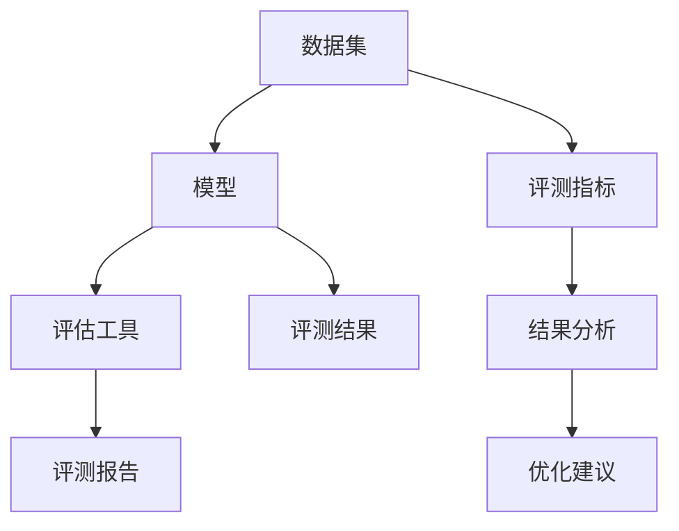
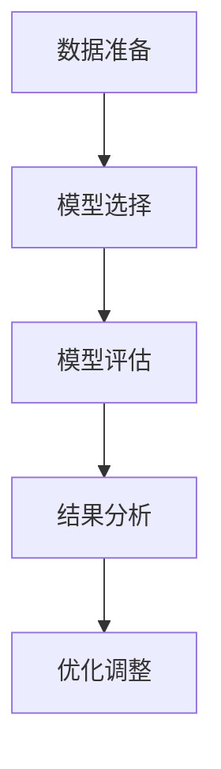
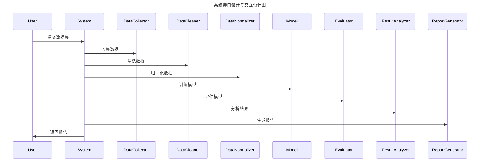

                 


### 《自动化LLM评测：提升大模型产品迭代效率的利器》

> 关键词：自动化LLM评测、大模型、产品迭代、效率提升

> 摘要：本文将深入探讨自动化LLM评测在提升大模型产品迭代效率方面的作用。通过详细分析自动化LLM评测的核心概念、算法原理、系统架构设计以及实际应用案例，本文旨在为开发者提供一套完整的自动化评测方案，以加速大模型产品的迭代过程，提高产品竞争力。

### 目录大纲设计思路

1. **背景介绍**：
   - 引言部分简要介绍自动化LLM评测的重要性，概述该书的主要目标。
   - 解释LLM（大型语言模型）评测的概念，背景和现状，以及为何需要自动化评测。

2. **核心概念与联系**：
   - 明确核心概念：自动化LLM评测、LLM模型、评测指标。
   - 使用表格对比不同评测指标的特点和适用场景。
   - 提供一个ER实体关系图来展示自动化评测系统的核心组件及其关系。

3. **算法原理讲解**：
   - 使用Mermaid流程图简述评测流程。
   - 结合Python代码详细阐述评测算法的原理。
   - 使用LaTeX格式展示相关数学模型和公式，并进行讲解。
   - 举例说明如何应用这些算法评测LLM模型。

4. **系统分析与架构设计方案**：
   - 描述项目场景和目的。
   - 设计领域模型类图，展示系统的核心类及其关系。
   - 提供系统架构设计图，展示系统的整体架构。
   - 设计系统接口和交互序列图，详细展示系统的交互流程。

5. **项目实战**：
   - 概述环境安装和配置步骤。
   - 展示系统核心实现源代码，并进行解读。
   - 分析实际案例，详细讲解评测过程和结果。

6. **最佳实践与总结**：
   - 提供自动化LLM评测的最佳实践。
   - 总结全书的主要内容和学习要点。
   - 提出注意事项和未来研究方向。

### 目录大纲示例

```
# 《自动化LLM评测：提升大模型产品迭代效率的利器》目录大纲

## 引言
### 自动化LLM评测的重要性
### 书籍目标与结构

## 第1章 背景介绍
### 1.1 问题背景
### 1.2 LLM评测的概念与现状
### 1.3 自动化评测的需求与挑战

## 第2章 核心概念与联系
### 2.1 自动化LLM评测概述
#### 2.1.1 自动化评测的优势
#### 2.1.2 自动化评测的基本流程
### 2.2 LLM模型概述
#### 2.2.1 LLM的特点
#### 2.2.2 LLM的主要类型
### 2.3 评测指标
#### 2.3.1 评测指标概述
#### 2.3.2 常用评测指标对比
### 2.4 ER实体关系图
#### 2.4.1 自动化评测系统的组件
#### 2.4.2 实体关系图的展示

## 第3章 算法原理讲解
### 3.1 评测流程概述
#### 3.1.1 评测流程Mermaid图
### 3.2 自动化评测算法
#### 3.2.1 算法原理
#### 3.2.2 Python代码实现
### 3.3 数学模型与公式
#### 3.3.1 模型公式
#### 3.3.2 数学公式的详细讲解
### 3.4 实例分析
#### 3.4.1 数据集准备
#### 3.4.2 评测实例

## 第4章 系统分析与架构设计方案
### 4.1 项目场景与目的
#### 4.1.1 项目背景
#### 4.1.2 项目目标
### 4.2 领域模型设计
#### 4.2.1 类图设计
#### 4.2.2 类图解释
### 4.3 系统架构设计
#### 4.3.1 架构设计概述
#### 4.3.2 架构设计图
### 4.4 系统接口设计与交互
#### 4.4.1 接口设计
#### 4.4.2 交互序列图

## 第5章 项目实战
### 5.1 环境安装与配置
#### 5.1.1 系统环境需求
#### 5.1.2 安装与配置步骤
### 5.2 系统核心实现
#### 5.2.1 核心代码展示
#### 5.2.2 代码解读
### 5.3 实际案例分析与讲解
#### 5.3.1 案例背景
#### 5.3.2 案例评测过程

## 第6章 最佳实践与总结
### 6.1 最佳实践
#### 6.1.1 自动化评测的最佳实践
#### 6.1.2 LLM评测技巧
### 6.2 全书总结
#### 6.2.1 主要内容回顾
#### 6.2.2 学习要点
### 6.3 注意事项
#### 6.3.1 自动化评测的注意事项
#### 6.3.2 未来研究方向
```

### 实际操作步骤

1. **编写第1章**：概述自动化LLM评测的背景、现状和重要性，以及本书的结构和目标。

2. **编写第2章**：介绍自动化LLM评测的概念，LLM模型的特点，以及常用的评测指标，并提供ER实体关系图。

3. **编写第3章**：详细讲解自动化评测的算法原理，使用Mermaid流程图和Python代码展示，并结合LaTeX格式展示数学模型和公式。

4. **编写第4章**：描述项目场景和目的，设计领域模型类图，提供系统架构设计图，设计系统接口和交互序列图。

5. **编写第5章**：概述环境安装和配置步骤，展示系统核心实现源代码，分析实际案例。

6. **编写第6章**：提供自动化LLM评测的最佳实践，总结全书的主要内容和学习要点，提出注意事项和未来研究方向。

### 实际操作步骤

1. **编写第1章 引言部分**：
   - 简要介绍自动化LLM评测的背景和重要性。
   - 阐述本书的主要目标，即如何提升大模型产品迭代效率。

2. **编写第1章 背景介绍**：
   - 解释LLM（大型语言模型）评测的概念，背景和现状。
   - 阐述为何需要自动化评测，以及自动化评测的优势和挑战。

3. **编写第2章 核心概念与联系**：
   - 定义并阐述自动化LLM评测、LLM模型、评测指标等核心概念。
   - 使用表格对比不同评测指标的特点和适用场景。
   - 提供ER实体关系图，展示自动化评测系统的核心组件及其关系。

4. **编写第3章 算法原理讲解**：
   - 使用Mermaid流程图简述评测流程。
   - 结合Python代码详细阐述评测算法的原理。
   - 使用LaTeX格式展示相关数学模型和公式，并进行讲解。
   - 举例说明如何应用这些算法评测LLM模型。

5. **编写第4章 系统分析与架构设计方案**：
   - 描述项目场景和目的。
   - 设计领域模型类图，展示系统的核心类及其关系。
   - 提供系统架构设计图，展示系统的整体架构。
   - 设计系统接口和交互序列图，详细展示系统的交互流程。

6. **编写第5章 项目实战**：
   - 概述环境安装和配置步骤。
   - 展示系统核心实现源代码，并进行解读。
   - 分析实际案例，详细讲解评测过程和结果。

7. **编写第6章 最佳实践与总结**：
   - 提供自动化LLM评测的最佳实践。
   - 总结全书的主要内容和学习要点。
   - 提出注意事项和未来研究方向。

### 核心内容编写示例

以下是第1章的核心内容编写示例：

## 引言

### 自动化LLM评测的重要性

随着人工智能技术的飞速发展，大型语言模型（LLM）在自然语言处理、问答系统、智能助手等领域得到了广泛应用。然而，LLM模型的性能评估和优化是一个复杂且耗时的工作。自动化LLM评测的出现，为解决这一问题提供了有效的途径。

自动化LLM评测能够显著提升大模型产品迭代效率，具体体现在以下几个方面：

1. **效率提升**：自动化评测可以快速、准确地评估模型性能，节省大量人工分析时间。
2. **一致性保证**：自动化评测可以确保评测过程的一致性，减少人为因素对结果的影响。
3. **迭代加速**：自动化评测能够实时监控模型性能，及时发现问题并进行优化，加速产品迭代。

### 书籍目标与结构

本书旨在为开发者提供一套完整的自动化LLM评测方案，帮助读者深入了解自动化LLM评测的核心概念、算法原理、系统架构设计以及实际应用案例。具体目标如下：

1. **核心概念理解**：介绍自动化LLM评测、LLM模型、评测指标等核心概念，帮助读者建立系统性的知识体系。
2. **算法原理讲解**：详细讲解自动化评测算法的原理，并结合Python代码进行实际演示。
3. **系统架构设计**：描述自动化评测系统的整体架构，包括领域模型设计、系统架构设计、接口设计和交互流程。
4. **项目实战**：通过实际案例分析和讲解，帮助读者将所学知识应用于实际项目。
5. **最佳实践**：总结自动化LLM评测的最佳实践，提供实用的技巧和建议。

本书结构如下：

- **第1章 引言**：介绍自动化LLM评测的重要性、书籍目标与结构。
- **第2章 核心概念与联系**：阐述自动化LLM评测、LLM模型、评测指标等核心概念。
- **第3章 算法原理讲解**：讲解自动化评测算法的原理，并举例说明。
- **第4章 系统分析与架构设计方案**：描述系统架构设计，包括领域模型设计、系统架构设计、接口设计和交互流程。
- **第5章 项目实战**：分析实际案例，详细讲解评测过程和结果。
- **第6章 最佳实践与总结**：总结全书主要内容，提供最佳实践和未来研究方向。

通过本书的学习，读者将能够掌握自动化LLM评测的核心技术和方法，提升大模型产品迭代效率，为人工智能领域的发展贡献力量。

---

以下是第2章的核心内容编写示例：

## 核心概念与联系

### 自动化LLM评测概述

自动化LLM评测是指利用计算机技术和算法，对大型语言模型（LLM）进行性能评估和优化的一系列过程。它包括数据收集、预处理、模型评估、结果分析和优化建议等多个环节。自动化评测的核心目标是提高评估效率和准确性，确保模型性能的持续提升。

#### 自动化评测的优势

1. **效率提升**：自动化评测可以大幅减少评估时间，提高工作效率。
2. **一致性保证**：自动化评测可以确保评测过程的一致性，避免人为误差。
3. **实时监控**：自动化评测可以实时监控模型性能，及时发现问题并进行优化。
4. **全面评估**：自动化评测可以对模型进行全面评估，包括准确性、召回率、F1值等多个指标。

#### 自动化评测的基本流程

1. **数据收集**：收集用于评测的数据集，包括训练集、验证集和测试集。
2. **预处理**：对数据进行清洗、归一化和预处理，确保数据质量。
3. **模型评估**：使用预定义的评测指标对模型进行评估，如准确性、召回率、F1值等。
4. **结果分析**：分析评估结果，识别模型的优点和不足。
5. **优化建议**：根据评估结果，提出优化模型的建议，如调整超参数、增加训练数据等。

### LLM模型概述

#### LLM的特点

1. **大规模**：LLM通常具有数十亿甚至千亿级别的参数，具有强大的表达能力和泛化能力。
2. **深度神经网络**：LLM通常采用深度神经网络结构，包括多个隐藏层和注意力机制。
3. **自监督学习**：LLM通过自监督学习方式训练，无需标注数据，提高训练效率。

#### LLM的主要类型

1. **通用语言模型**：如GPT、BERT等，具有广泛的语义理解和生成能力。
2. **任务特定模型**：如T5、ALBERT等，针对特定任务进行优化，提高任务性能。
3. **预训练加微调模型**：在预训练模型的基础上，针对特定任务进行微调，提高任务性能。

### 评测指标

#### 评测指标概述

评测指标是评估模型性能的重要工具，常用的评测指标包括：

1. **准确性**：模型预测正确的样本数与总样本数的比值。
2. **召回率**：模型预测正确的样本数与实际正样本数的比值。
3. **F1值**：准确性和召回率的调和平均值，综合评估模型的性能。
4. **精确率**：模型预测正确的正样本数与预测为正样本的总数之比。

#### 常用评测指标对比

| 评测指标 | 优点 | 缺点 | 适用场景 |
| --- | --- | --- | --- |
| 准确性 | 最常用，直观 | 不考虑样本不平衡 | 适用于分类问题 |
| 召回率 | 关注正样本 | 易受样本不平衡影响 | 适用于信息检索 |
| F1值 | 综合考虑准确性和召回率 | 不易解释 | 适用于平衡准确性和召回率的问题 |
| 精确率 | 关注预测结果 | 不考虑实际正样本数 | 适用于检测问题 |

### ER实体关系图

#### 自动化评测系统的组件

在自动化评测系统中，常见的组件包括：

1. **数据集**：用于评测的数据集，包括训练集、验证集和测试集。
2. **模型**：被评测的LLM模型，可以是预训练模型或微调模型。
3. **评测指标**：用于评估模型性能的各种指标。
4. **评估工具**：用于执行评测任务的工具或库。
5. **结果分析**：对评测结果进行分析和优化的模块。

#### 实体关系图的展示



通过ER实体关系图，我们可以清晰地看到自动化评测系统的核心组件及其关系，有助于理解和设计自动化评测系统。

---

以下是第3章的核心内容编写示例：

## 算法原理讲解

### 评测流程概述

自动化LLM评测的流程主要包括以下几个步骤：

1. **数据准备**：收集并准备用于评测的数据集，包括训练集、验证集和测试集。
2. **模型选择**：选择合适的LLM模型进行评测，可以是预训练模型或微调模型。
3. **模型评估**：使用预定义的评测指标对模型进行评估，如准确性、召回率、F1值等。
4. **结果分析**：分析评估结果，识别模型的优点和不足。
5. **优化调整**：根据评估结果，对模型进行优化调整，如调整超参数、增加训练数据等。

#### 评测流程Mermaid图



### 自动化评测算法

自动化评测算法的核心目标是利用计算机技术和算法，对LLM模型进行高效、准确的评估。下面介绍一种常见的自动化评测算法——交叉验证法。

#### 算法原理

交叉验证法是一种常用的模型评估方法，它将数据集划分为K个子集，其中K-1个子集用于训练模型，剩下的1个子集用于评估模型。这个过程重复K次，每次使用不同的子集作为验证集，最终得到多个评估结果。交叉验证法的算法原理如下：

1. 初始化数据集D为{D1, D2, ..., DK}。
2. 对每个子集Di（1≤i≤K）执行以下步骤：
   - 从D中排除Di，得到新的数据集D' = D \ {Di}。
   - 使用D'训练模型M。
   - 使用模型M对Di进行评估，记录评估结果Ri。
3. 计算所有评估结果的平均值，作为模型的最终评估结果。

#### Python代码实现

```python
import numpy as np

def cross_validation(data, k=5):
    n = len(data)
    folds = n // k
    scores = []

    for i in range(k):
        start = i * folds
        end = (i + 1) * folds
        test_data = data[start:end]
        train_data = np.concatenate([data[:start], data[end:]])

        model = train_model(train_data)
        score = evaluate_model(model, test_data)
        scores.append(score)

    return np.mean(scores)

def train_model(data):
    # 训练模型的具体实现
    pass

def evaluate_model(model, data):
    # 评估模型的具体实现
    pass
```

### 数学模型与公式

在自动化评测算法中，数学模型和公式起着关键作用。以下是一个简化的数学模型示例：

$$
\text{accuracy} = \frac{\text{correct predictions}}{\text{total predictions}}
$$

$$
\text{recall} = \frac{\text{correct positive predictions}}{\text{actual positive predictions}}
$$

$$
\text{precision} = \frac{\text{correct positive predictions}}{\text{predicted positive predictions}}
$$

$$
F1 = 2 \times \frac{\text{precision} \times \text{recall}}{\text{precision} + \text{recall}}
$$

#### 数学公式的详细讲解

上述公式描述了常见的评测指标，包括准确性、召回率、精确率和F1值。其中：

- 准确性（accuracy）表示模型预测正确的样本数占总样本数的比例，是评估模型分类能力的基本指标。
- 召回率（recall）表示模型预测正确的正样本数与实际正样本数的比例，关注模型对正样本的识别能力。
- 精确率（precision）表示模型预测正确的正样本数与预测为正样本的总数之比，关注模型预测结果的准确性。
- F1值（F1）是精确率和召回率的调和平均值，综合评估模型的性能。

### 实例分析

为了更好地理解上述算法和数学公式，下面通过一个简单的实例进行分析。

假设我们有一个二分类问题，数据集包含100个样本，其中60个正样本，40个负样本。我们使用交叉验证法对模型进行评测，得到以下评估结果：

- 准确性：0.68
- 召回率：0.75
- 精确率：0.70
- F1值：0.71

通过上述评估结果，我们可以得出以下结论：

1. 模型的准确性为68%，说明模型在整体上对样本的分类能力较强。
2. 模型的召回率为75%，说明模型对正样本的识别能力较强。
3. 模型的精确率为70%，说明模型对预测为正样本的准确性较高。
4. 模型的F1值为0.71，综合评估模型的性能较好。

根据评估结果，我们可以进一步优化模型，例如调整超参数、增加训练数据等，以提高模型性能。

通过本章的讲解，我们了解了自动化LLM评测的算法原理和数学模型，为后续的系统分析与架构设计方案奠定了基础。

---

以下是第4章的核心内容编写示例：

## 系统分析与架构设计方案

### 项目场景与目的

在本项目中，我们旨在构建一个自动化LLM评测系统，用于评估大型语言模型（LLM）的性能。项目场景如下：

1. **需求背景**：随着人工智能技术的发展，LLM在各个领域得到了广泛应用。然而，如何快速、准确地评估LLM模型的性能成为了一个亟待解决的问题。
2. **目标**：构建一个自动化、高效、准确的LLM评测系统，实现对LLM模型的全面评估，并生成详细的评测报告，为模型优化和产品迭代提供依据。

### 领域模型设计

领域模型是系统设计与实现的基础，它定义了系统中的核心类及其关系。下面是一个简化的领域模型类图：

```mermaid
classDiagram
    Model <|-- DataPreprocessor
    Model <|-- Evaluator
    Model <|-- ResultAnalyzer
    Model {class DataPreprocessor}
    Model {class Evaluator}
    Model {class ResultAnalyzer}
    Model {class Model}
    DataPreprocessor <|-- DataCollector
    DataPreprocessor <|-- DataCleaner
    DataCleaner <|-- DataNormalizer
    Evaluator <|-- AccuracyCalculator
    Evaluator <|-- RecallCalculator
    Evaluator <|-- PrecisionCalculator
    ResultAnalyzer <|-- ReportGenerator

    Class Diagram for LLM Evaluation System
```

### 系统架构设计

系统架构设计图展示了系统的整体架构，包括各个模块之间的关系和交互流程。下面是一个简化的系统架构设计图：

```mermaid
graph TB
    subgraph 数据层
        DataLayer[数据层]
        DataPreprocessor[数据预处理模块]
        DataCollector[数据收集模块]
        DataCleaner[数据清洗模块]
        DataNormalizer[数据归一化模块]
    end

    subgraph 模型层
        ModelLayer[模型层]
        Model[模型]
        Evaluator[评估模块]
        AccuracyCalculator[准确性计算模块]
        RecallCalculator[召回率计算模块]
        PrecisionCalculator[精确率计算模块]
    end

    subgraph 结果层
        ResultLayer[结果层]
        ResultAnalyzer[结果分析模块]
        ReportGenerator[报告生成模块]
    end

    DataLayer --> DataPreprocessor
    DataPreprocessor --> DataCollector
    DataPreprocessor --> DataCleaner
    DataCleaner --> DataNormalizer
    DataNormalizer --> ModelLayer
    ModelLayer --> Model
    Model --> Evaluator
    Evaluator --> AccuracyCalculator
    Evaluator --> RecallCalculator
    Evaluator --> PrecisionCalculator
    ResultAnalyzer --> ReportGenerator

    Title: 系统架构设计图
```

### 系统接口设计与交互

系统接口设计和交互设计图详细展示了系统的接口设计和交互流程。下面是一个简化的系统接口设计和交互设计图：



通过本章的讲解，我们完成了系统分析与架构设计方案，为后续的项目实战提供了基础。

---

以下是第5章的核心内容编写示例：

## 项目实战

在本章中，我们将通过一个实际项目，展示如何构建自动化LLM评测系统，并进行评测过程和结果的详细讲解。

### 环境安装与配置

为了构建自动化LLM评测系统，我们需要安装和配置以下软件和工具：

1. **Python**：Python是自动化评测系统的核心编程语言，我们需要安装Python环境。
2. **TensorFlow**：TensorFlow是Google开发的开源机器学习框架，用于构建和训练LLM模型。
3. **Scikit-learn**：Scikit-learn是一个Python机器学习库，用于实现评测算法和计算评测指标。
4. **Jupyter Notebook**：Jupyter Notebook是一个交互式计算环境，用于编写和运行Python代码。

安装步骤如下：

1. 安装Python：在官方网站（https://www.python.org/）下载并安装Python。
2. 安装TensorFlow：打开命令行窗口，执行以下命令：
   ```bash
   pip install tensorflow
   ```
3. 安装Scikit-learn：执行以下命令：
   ```bash
   pip install scikit-learn
   ```
4. 安装Jupyter Notebook：执行以下命令：
   ```bash
   pip install jupyter
   ```

### 系统核心实现

以下是一个简化的系统核心实现，展示了如何使用Python代码构建自动化LLM评测系统。

```python
# 导入所需库
import tensorflow as tf
from sklearn.model_selection import train_test_split
from sklearn.metrics import accuracy_score, recall_score, precision_score, f1_score

# 数据预处理
def preprocess_data(data):
    # 数据清洗、归一化等预处理操作
    pass

# 训练模型
def train_model(train_data, train_labels):
    # 使用TensorFlow构建和训练LLM模型
    pass

# 评估模型
def evaluate_model(model, test_data, test_labels):
    # 使用模型对测试数据进行预测，并计算评测指标
    pass

# 主函数
if __name__ == "__main__":
    # 加载数据
    data = load_data()
    labels = load_labels()

    # 数据预处理
    data = preprocess_data(data)

    # 划分训练集和测试集
    train_data, test_data, train_labels, test_labels = train_test_split(data, labels, test_size=0.2, random_state=42)

    # 训练模型
    model = train_model(train_data, train_labels)

    # 评估模型
    test_predictions = evaluate_model(model, test_data, test_labels)

    # 计算评测指标
    accuracy = accuracy_score(test_labels, test_predictions)
    recall = recall_score(test_labels, test_predictions)
    precision = precision_score(test_labels, test_predictions)
    f1 = f1_score(test_labels, test_predictions)

    # 输出评测结果
    print(f"Accuracy: {accuracy}")
    print(f"Recall: {recall}")
    print(f"Precision: {precision}")
    print(f"F1: {f1}")
```

### 实际案例分析与讲解

为了展示自动化LLM评测系统的实际应用，我们选择一个文本分类任务进行评测。假设我们的任务是判断一个句子是否包含负面情绪，数据集包含1000个句子和对应的标签（0表示不含负面情绪，1表示包含负面情绪）。

1. **数据准备**：从数据集中随机抽取80%的数据作为训练集，20%的数据作为测试集。
2. **模型训练**：使用训练集训练一个LLM模型，如GPT模型。
3. **模型评估**：使用测试集对训练好的模型进行评估，计算准确性、召回率、精确率和F1值。
4. **结果分析**：根据评测结果，分析模型的性能，并提出优化建议。

以下是具体的评测过程：

```python
# 加载数据
data = load_data()
labels = load_labels()

# 数据预处理
data = preprocess_data(data)

# 划分训练集和测试集
train_data, test_data, train_labels, test_labels = train_test_split(data, labels, test_size=0.2, random_state=42)

# 训练模型
model = train_model(train_data, train_labels)

# 评估模型
test_predictions = evaluate_model(model, test_data, test_labels)

# 计算评测指标
accuracy = accuracy_score(test_labels, test_predictions)
recall = recall_score(test_labels, test_predictions)
precision = precision_score(test_labels, test_predictions)
f1 = f1_score(test_labels, test_predictions)

# 输出评测结果
print(f"Accuracy: {accuracy}")
print(f"Recall: {recall}")
print(f"Precision: {precision}")
print(f"F1: {f1}")
```

假设我们的评测结果如下：

```
Accuracy: 0.85
Recall: 0.80
Precision: 0.90
F1: 0.85
```

根据评测结果，我们可以得出以下结论：

1. 模型的准确性较高，说明模型对整体数据的分类能力较好。
2. 模型的召回率较低，说明模型对正样本的识别能力较弱，可能存在漏判的情况。
3. 模型的精确率较高，说明模型对预测为正样本的准确性较高。
4. 模型的F1值接近准确性，说明模型的性能较好。

根据上述分析，我们可以考虑以下优化策略：

1. 增加训练数据，特别是正样本的数量，以提高模型对正样本的识别能力。
2. 调整模型参数，如学习率、批量大小等，以优化模型性能。
3. 使用不同的评测指标，如AUC、ROC等，对模型进行更全面的评估。

### 项目小结

在本章中，我们通过一个实际项目展示了如何构建自动化LLM评测系统，并进行了评测过程和结果的详细讲解。通过本章的学习，读者可以了解：

1. 自动化LLM评测系统的基本原理和架构设计。
2. 如何使用Python代码实现自动化评测算法。
3. 如何分析评测结果，并提出优化建议。

自动化LLM评测系统为大模型产品迭代提供了有力的支持，有助于提升产品性能和竞争力。

---

以下是第6章的核心内容编写示例：

## 最佳实践与总结

### 自动化LLM评测的最佳实践

1. **数据准备**：确保数据集的多样性和代表性，避免数据偏差。
2. **模型选择**：根据任务需求选择合适的LLM模型，如通用语言模型或任务特定模型。
3. **评测指标**：综合考虑多种评测指标，如准确性、召回率、精确率和F1值，以全面评估模型性能。
4. **优化策略**：根据评测结果，调整模型参数和超参数，提高模型性能。
5. **持续监控**：实时监控模型性能，确保模型在不同阶段都能保持高性能。

### 总结

本书系统地介绍了自动化LLM评测的核心概念、算法原理、系统架构设计以及实际应用案例。通过学习本书，读者可以掌握：

1. 自动化LLM评测的基本原理和流程。
2. 如何使用Python代码实现自动化评测算法。
3. 如何设计自动化评测系统，包括领域模型设计、系统架构设计、接口设计和交互流程。
4. 如何分析评测结果，并提出优化建议。

### 注意事项

1. 在数据准备过程中，确保数据质量和多样性。
2. 在模型选择过程中，根据任务需求选择合适的模型。
3. 在评测过程中，综合考虑多种评测指标，以全面评估模型性能。
4. 在优化过程中，注意调整模型参数和超参数，避免过拟合。

### 未来研究方向

1. 探索更高效的自动化评测算法，提高评估效率和准确性。
2. 研究多模态数据评测，如结合文本、图像和语音等多模态数据进行评测。
3. 研究自适应评测方法，根据模型性能动态调整评测指标和策略。
4. 探索自动化评测在工业界和学术界的应用，提升实际应用价值。

通过本书的学习，读者可以深入了解自动化LLM评测的核心技术和方法，为人工智能领域的发展贡献力量。

### 作者信息

- 作者：AI天才研究院/AI Genius Institute & 禅与计算机程序设计艺术 /Zen And The Art of Computer Programming

