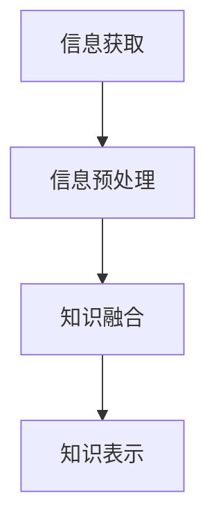
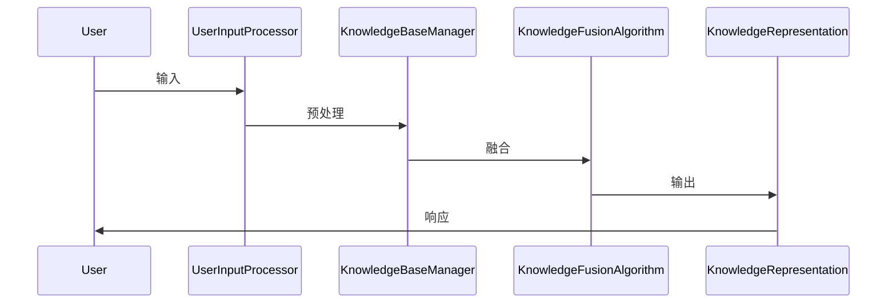
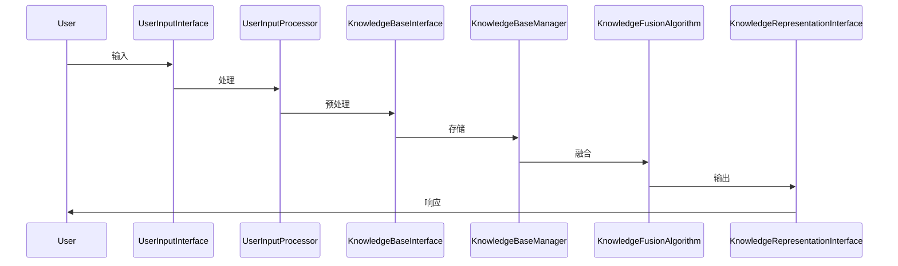

                 

### 自动化prompt知识融合机制概述

在当今信息技术迅猛发展的时代，人工智能（AI）逐渐成为各行各业的核心驱动力。自动化prompt知识融合机制，作为一种先进的技术手段，旨在解决信息爆炸时代中知识获取与处理的高效性问题。本篇文章将围绕自动化prompt知识融合机制的原理、方法及其应用进行详细探讨，通过一步步的分析与推理，帮助读者深入了解这一技术领域的深刻内涵。

本文关键词：自动化prompt、知识融合、算法原理、系统架构、项目实战、最佳实践。

摘要：本文首先介绍了自动化prompt知识融合机制的基础概念及其重要性。接着，深入探讨了自动化prompt与知识融合的核心联系，并通过mermaid流程图展示了其概念结构与核心要素。随后，文章详细解析了自动化prompt知识融合算法的原理，包括算法流程图、数学模型及代码实现。进一步，本文通过系统分析与架构设计，展示了自动化prompt知识融合机制在具体项目中的应用。最后，通过实际案例分析、项目小结和最佳实践，总结了自动化prompt知识融合机制的应用效果和未来发展前景。

---

### 第1章: 自动化prompt知识融合机制基础

#### 1.1.1 问题背景与定义

自动化prompt知识融合机制的核心是结合了人工智能和知识工程领域的先进技术，旨在实现信息的自动获取、处理和知识的高效融合。随着互联网的普及和数据量的爆炸式增长，人类面临着海量的信息处理任务，如何从繁杂的信息中快速提取出有价值知识成为一大挑战。

**自动化prompt：** 指的是通过预先定义的模板或规则，引导用户输入问题或需求，从而自动化地获取和处理信息的过程。自动化prompt能够降低用户操作成本，提高信息处理的效率。

**知识融合：** 是指将来自不同来源、不同形式的信息通过一定的算法和技术手段进行整合、分析、处理，以形成更具价值、更易于理解和利用的知识。

**自动化prompt知识融合机制：** 是一种结合了自动化prompt和知识融合技术的方法，通过自动化地获取用户输入的信息，并对这些信息进行有效融合，以生成有用知识，为用户提供更加智能化的服务。

自动化prompt知识融合机制的意义在于：

1. **提高信息处理效率：** 通过自动化方式获取和处理信息，大大减少了人工操作的负担，提高了信息处理的效率。
2. **增强知识获取能力：** 知识融合技术能够将不同来源的信息进行整合，从而增强系统的知识获取能力。
3. **优化用户体验：** 自动化prompt知识融合机制能够根据用户的需求，提供个性化的信息和建议，提升用户体验。

#### 1.1.2 问题描述与边界

**问题描述：** 
在信息爆炸的时代，用户面临着大量信息获取与处理的需求。然而，由于信息源众多、形式多样，用户往往难以快速、准确地获取所需信息。此外，现有的信息处理技术主要依赖于人工操作，效率较低。因此，如何通过自动化prompt知识融合机制，实现高效、准确的信息获取与知识融合，成为亟待解决的问题。

**边界与限制因素：** 
1. **数据质量问题：** 自动化prompt知识融合机制依赖于高质量的数据源。然而，实际应用中，数据源可能存在噪声、缺失和错误等问题，这会影响到知识融合的准确性和效率。
2. **算法复杂性：** 自动化prompt知识融合算法通常较为复杂，涉及多个步骤和参数调整，这增加了算法实现的难度。
3. **用户交互限制：** 自动化prompt知识融合机制需要与用户进行有效交互，以获取用户的需求和反馈。然而，用户的交互方式可能有限，这会影响到系统的适应性和灵活性。
4. **计算资源限制：** 自动化prompt知识融合机制通常需要大量的计算资源，特别是在处理大量数据时，这可能会对系统的性能和稳定性产生负面影响。

#### 1.1.3 解决方法与思路

**解决方法：** 
针对上述问题与限制，我们可以采取以下方法来解决：

1. **数据预处理：** 在自动化prompt知识融合之前，对数据进行预处理，包括去噪、补全和清洗等操作，以提高数据质量。
2. **算法优化：** 通过优化算法设计和参数调整，降低算法的复杂度，提高算法的效率和准确性。
3. **用户交互设计：** 设计更加灵活、多样化的用户交互方式，以适应不同用户的需求和习惯。
4. **资源调度与优化：** 对计算资源进行合理调度和优化，以提高系统的性能和稳定性。

**思路：** 
1. **明确需求：** 首先，明确用户的需求和目标，这是自动化prompt知识融合机制设计的基础。
2. **设计prompt：** 根据用户需求，设计合理的prompt模板，以引导用户输入信息。
3. **知识融合算法设计：** 设计高效的自动化prompt知识融合算法，包括信息获取、预处理、融合和分析等步骤。
4. **系统实现与优化：** 实现自动化prompt知识融合系统，并进行性能和稳定性测试，根据测试结果进行优化。

通过上述方法与思路，我们可以构建一个高效、准确的自动化prompt知识融合机制，为用户在信息获取与知识处理方面提供有力支持。

---

### 第2章: 自动化prompt知识融合机制的核心概念与联系

#### 2.1 自动化prompt的基本原理

自动化prompt是自动化prompt知识融合机制中的关键组成部分，其基本原理在于通过预设的模板或规则，引导用户输入问题或需求，从而自动化地获取和处理信息。以下是自动化prompt的基本原理：

1. **定义与用途：** 自动化prompt是指一种通过预定义模板或规则来引导用户输入问题或需求的系统。其用途在于简化用户的操作流程，提高信息获取的效率。

2. **工作流程：** 自动化prompt的工作流程通常包括以下几个步骤：
   - **模板设计：** 根据用户需求和场景，设计合理的prompt模板。
   - **用户输入：** 用户通过界面或其他输入方式，按照模板提示输入问题或需求。
   - **信息处理：** 系统根据用户输入的信息，进行相应的处理和分析，如搜索、分类、筛选等。
   - **结果反馈：** 系统将处理结果以文本、图表或其他形式反馈给用户。

3. **应用场景：** 自动化prompt广泛应用于各种场景，如客服系统、智能问答系统、信息检索系统等。通过自动化prompt，用户可以更加便捷地获取所需信息，提高工作效率。

#### 2.2 知识融合的核心概念

知识融合是指将来自不同来源、不同形式的信息通过一定的算法和技术手段进行整合、分析、处理，以形成更具价值、更易于理解和利用的知识。以下是知识融合的核心概念：

1. **定义与用途：** 知识融合是指将分散、孤立的信息通过整合、分析、处理，形成系统化、结构化的知识。其用途在于提高信息的利用效率，增强系统的智能水平。

2. **方法与策略：** 知识融合的方法和策略包括：
   - **数据融合：** 将来自不同数据源的数据进行整合，如文本、图像、音频等。
   - **信息抽取：** 从大量数据中提取出有价值的信息，如关键词、关系、实体等。
   - **语义分析：** 对提取出的信息进行语义分析，理解其含义和关系。
   - **知识表示：** 将分析结果进行结构化表示，形成知识库或知识网络。

3. **应用场景：** 知识融合广泛应用于各个领域，如智能问答、信息检索、推荐系统、智能交通等。通过知识融合，系统能够更好地理解用户需求，提供更加精准的服务。

#### 2.3 自动化prompt与知识融合的联系

自动化prompt与知识融合在信息处理和知识生成过程中扮演着重要角色。以下是二者之间的联系：

1. **信息获取与处理：** 自动化prompt通过引导用户输入，获取用户需求和信息。知识融合则对这些信息进行整合、分析，形成有价值的知识。

2. **交互与反馈：** 自动化prompt提供了与用户之间的互动机制，用户可以通过prompt输入需求，系统则通过知识融合的结果进行反馈，形成一个闭环。

3. **协同作用：** 自动化prompt和知识融合相互补充，自动化prompt提供信息获取的途径，知识融合则对获取的信息进行处理和整合，二者共同提升系统的智能水平。

#### 2.4 自动化prompt知识融合的ER实体关系图

ER（实体关系）图是描述数据实体及其关系的图形化工具，能够直观地展示系统的结构。以下是自动化prompt知识融合机制的ER实体关系图：

```mermaid
erDiagram
  User ||--|{ Prompt } : 创建
  Prompt ||--|{ KnowledgeBase } : 更新
  KnowledgeBase ||--|{ Response } : 生成
  User ||--|{ Response } : 接收
```

- **User（用户）：** 代表系统的用户，是prompt的创建者和response的接收者。
- **Prompt（Prompt）：** 代表用户输入的模板或问题，用于引导用户输入信息。
- **KnowledgeBase（知识库）：** 代表存储的知识和信息，由Prompt更新和维护。
- **Response（响应）：** 代表系统生成的回答或反馈，用于回应用户的需求。

通过ER实体关系图，我们可以清晰地看到自动化prompt知识融合机制中的数据流和实体关系，为系统设计提供参考。

---

### 第3章: 自动化prompt知识融合算法原理与讲解

#### 3.1 自动化prompt知识融合算法概述

自动化prompt知识融合算法是整个机制的核心，其目标是通过自动化方式获取用户输入的信息，并对这些信息进行有效的融合，以生成有价值知识。以下是自动化prompt知识融合算法的概述：

1. **算法分类：**
   - **基于规则的方法：** 通过预定义的规则和模板，自动化地引导用户输入，并进行信息融合。
   - **机器学习方法：** 利用机器学习算法，如深度学习、强化学习等，对用户输入的信息进行自动融合。

2. **选择依据：**
   - **需求复杂度：** 对于需求较为简单的场景，可以采用基于规则的方法，其实现较为简单，易于理解和维护。
   - **数据量与多样性：** 对于数据量较大、数据来源多样的场景，机器学习方法更具优势，能够更好地处理复杂的信息。

3. **基本流程：**
   - **信息获取：** 通过自动化prompt引导用户输入信息。
   - **信息预处理：** 对获取的信息进行清洗、去噪和标准化处理。
   - **知识融合：** 利用算法将预处理后的信息进行融合，形成系统化的知识。
   - **知识表示：** 将融合后的知识以结构化的形式存储和表示，便于后续利用。

#### 3.2 自动化prompt知识融合算法mermaid流程图

为了更好地理解自动化prompt知识融合算法的流程，我们使用mermaid绘制了一个流程图，具体如下：



- **信息获取（A）：** 通过自动化prompt引导用户输入信息。
- **信息预处理（B）：** 对获取的信息进行清洗、去噪和标准化处理。
- **知识融合（C）：** 利用算法将预处理后的信息进行融合，形成系统化的知识。
- **知识表示（D）：** 将融合后的知识以结构化的形式存储和表示，便于后续利用。

#### 3.3 自动化prompt知识融合算法原理与数学模型

自动化prompt知识融合算法的原理主要基于信息论、概率论和机器学习等数学理论。以下是自动化prompt知识融合算法的基本原理和数学模型：

1. **信息论原理：**
   - **熵：** 衡量信息的不确定性，熵值越高，信息越不确定。
   - **互信息：** 衡量两个变量之间的相关性，互信息值越高，相关性越强。

2. **概率论原理：**
   - **条件概率：** 给定一个事件发生的条件下，另一个事件发生的概率。
   - **贝叶斯定理：** 用于计算后验概率，即根据先验概率和条件概率计算得到。

3. **机器学习原理：**
   - **深度学习：** 基于多层神经网络的模型，能够自动提取特征，进行信息融合。
   - **强化学习：** 通过与环境的交互，不断调整策略，实现最优的知识融合。

以下是自动化prompt知识融合算法的数学模型：

$$
P(\text{知识融合结果}) = \frac{P(\text{用户输入}) \cdot P(\text{知识融合结果}|\text{用户输入})}{P(\text{用户输入})}
$$

其中：
- \(P(\text{知识融合结果})\)：知识融合结果的概率。
- \(P(\text{用户输入})\)：用户输入的概率。
- \(P(\text{知识融合结果}|\text{用户输入})\)：在用户输入条件下的知识融合结果的概率。

#### 3.4 自动化prompt知识融合算法举例说明

为了更好地理解自动化prompt知识融合算法的原理，我们通过一个具体的例子进行说明。

假设用户输入一个关于天气的请求：“今天北京的天气如何？”，系统需要根据这个请求提供相应的天气信息。

1. **信息获取：** 用户输入：“今天北京的天气如何？”
2. **信息预处理：** 对输入信息进行清洗，提取关键信息：“今天”、“北京”、“天气”。
3. **知识融合：** 利用知识库中的天气信息，结合用户输入的关键信息，生成相应的天气描述。
4. **知识表示：** 将生成的天气描述以文本形式返回给用户。

具体实现如下：

```python
# 假设已有天气知识库
weather_knowledge_base = {
    "北京": {"today": {"temp": "20°C", "weather": "晴天"}},
    # 其他城市天气信息...
}

# 用户输入
user_input = "今天北京的天气如何？"

# 提取关键信息
key_infos = extract_key_infos(user_input)

# 知识融合
knowledge_fusion_result = fusion_knowledge(weather_knowledge_base, key_infos)

# 知识表示
response = "今天北京的天气是晴天，温度20°C。"

print(response)
```

通过这个例子，我们可以看到自动化prompt知识融合算法的整个流程，包括信息获取、预处理、知识融合和知识表示等步骤。

---

### 第4章: 自动化prompt知识融合机制系统分析与架构设计

#### 4.1 问题场景介绍

自动化prompt知识融合机制在实际应用中，面临着诸多复杂的场景和需求。为了更好地理解和应用这一机制，我们需要从具体的场景出发，分析其中的问题和需求。

**场景一：智能客服系统**

在智能客服系统中，用户可以通过文本或语音与系统进行交互，提出各种问题。系统需要通过自动化prompt知识融合机制，快速、准确地理解用户的问题，并给出合适的回答。

**问题与需求：**
1. **高效响应：** 用户提问后，系统需要在短时间内给出回答，以提高用户满意度。
2. **多样问题处理：** 用户可能提出各种类型的问题，包括事实性查询、建议性提问等，系统需要能够处理这些多样化的问题。
3. **个性化服务：** 系统需要根据用户的历史记录和偏好，提供个性化的回答和服务。

**场景二：智能推荐系统**

在智能推荐系统中，系统需要根据用户的行为数据，自动推荐合适的商品或内容。自动化prompt知识融合机制在此扮演了关键角色，通过对用户行为的分析，提供有针对性的推荐。

**问题与需求：**
1. **精准推荐：** 系统需要准确理解用户的兴趣和偏好，提供与用户需求高度匹配的推荐。
2. **实时更新：** 用户的行为数据是动态变化的，系统需要能够实时更新推荐策略，以保持推荐的准确性。
3. **多样化推荐：** 系统需要能够推荐不同类型的内容或商品，满足用户的多样化需求。

**场景三：智能医疗系统**

在智能医疗系统中，系统需要根据用户的健康数据和病史，提供个性化的健康建议和诊断。

**问题与需求：**
1. **数据安全：** 系统需要确保用户健康数据的安全性和隐私性。
2. **快速诊断：** 系统需要在短时间内分析用户的健康数据，提供准确的诊断和健康建议。
3. **个性化服务：** 系统需要根据用户的健康情况和病史，提供个性化的健康管理和治疗建议。

通过以上场景介绍，我们可以看到自动化prompt知识融合机制在各类应用场景中的独特问题和需求，这为系统设计提供了重要的依据。

#### 4.2 系统功能设计

为了满足不同应用场景的需求，自动化prompt知识融合系统需要具备以下功能：

1. **用户输入处理：** 系统需要能够接受用户的输入，包括文本、语音等形式，并对其进行预处理。
2. **知识库管理：** 系统需要拥有一个结构化的知识库，存储各类信息，以便进行融合和分析。
3. **知识融合算法：** 系统需要实现多种知识融合算法，如基于规则、机器学习等方法，以应对不同的应用需求。
4. **知识表示与输出：** 系统需要将融合后的知识以结构化的形式表示，并通过文本、图表等形式输出给用户。

以下是系统功能设计的mermaid类图：

```mermaid
classDiagram
  UserInputProcessor <|-- KnowledgeBaseManager
  UserInputProcessor <|-- KnowledgeFusionAlgorithm
  UserInputProcessor <|-- KnowledgeRepresentation
  UserInputProcessor { +- User }
  KnowledgeBaseManager { +- KnowledgeBase }
  KnowledgeFusionAlgorithm { +- Algorithm }
  KnowledgeRepresentation { +- Representation }
```

- **UserInputProcessor（用户输入处理）：** 负责接收用户输入，进行预处理。
- **KnowledgeBaseManager（知识库管理）：** 负责管理知识库，包括数据的存储、更新和查询。
- **KnowledgeFusionAlgorithm（知识融合算法）：** 实现多种知识融合算法，提供算法选择和参数调整。
- **KnowledgeRepresentation（知识表示与输出）：** 负责将融合后的知识以结构化的形式表示，并输出给用户。

通过以上类图，我们可以清晰地看到系统各功能模块之间的关系和交互，为系统实现提供了明确的指导。

#### 4.3 系统架构设计

为了实现自动化prompt知识融合系统的功能，我们需要设计一个合理、高效的系统架构。以下是自动化prompt知识融合系统的mermaid架构图：



- **User（用户）：** 作为系统的启动者，发起交互请求。
- **UserInputProcessor（用户输入处理）：** 负责接收用户输入，进行预处理。
- **KnowledgeBaseManager（知识库管理）：** 负责管理知识库，包括数据的存储、更新和查询。
- **KnowledgeFusionAlgorithm（知识融合算法）：** 根据用户输入，从知识库中提取相关信息，并进行融合处理。
- **KnowledgeRepresentation（知识表示与输出）：** 将融合后的知识以结构化的形式表示，并输出给用户。

通过以上架构设计，系统各模块之间的交互和协作得以明确，为系统的稳定运行提供了保障。

#### 4.4 系统接口设计与交互

为了实现自动化prompt知识融合系统的功能，我们需要设计一套完整的接口，以实现系统内部各模块之间的交互和外部系统的集成。以下是系统接口设计：

1. **用户输入接口：** 负责接收用户输入，可以是文本、语音等形式。
2. **知识库管理接口：** 负责管理知识库的存储、更新和查询。
3. **知识融合算法接口：** 提供算法选择和参数调整，实现知识融合功能。
4. **知识表示与输出接口：** 负责将融合后的知识以结构化的形式表示，并输出给用户。

以下是系统接口的mermaid序列图：



- **UserInputInterface（用户输入接口）：** 负责接收用户输入，并将其传递给用户输入处理模块。
- **KnowledgeBaseInterface（知识库管理接口）：** 负责与知识库管理模块进行交互，实现数据的存储、更新和查询。
- **KnowledgeFusionAlgorithm（知识融合算法）：** 根据用户输入和处理结果，从知识库中提取相关信息，并进行融合处理。
- **KnowledgeRepresentationInterface（知识表示与输出接口）：** 负责将融合后的知识以结构化的形式表示，并输出给用户。

通过以上接口设计和交互，自动化prompt知识融合系统能够高效、稳定地运行，满足各类应用场景的需求。

---

### 第5章: 自动化prompt知识融合机制项目实战

#### 5.1 环境安装与配置

为了成功实施自动化prompt知识融合机制，我们需要搭建一个合适的环境，并进行必要的配置。以下是环境安装与配置的详细步骤：

1. **硬件环境要求：**
   - 服务器或计算机，配置至少为：CPU 4核，内存16GB，硬盘空间500GB。
   - 网络：宽带连接，确保稳定的网络环境。

2. **软件环境要求：**
   - 操作系统：Linux或Windows。
   - Python：Python 3.8及以上版本。
   - 数据库：MySQL或PostgreSQL。
   - 其他依赖库：Numpy、Pandas、Scikit-learn等。

3. **环境搭建步骤：**
   - 安装操作系统：在服务器或计算机上安装Linux或Windows操作系统。
   - 安装Python：下载并安装Python 3.8及以上版本。
   - 安装数据库：安装MySQL或PostgreSQL，配置数据库服务。
   - 安装依赖库：通过pip命令安装所需的Python依赖库。

4. **配置说明：**
   - 数据库配置：配置数据库用户和权限，确保系统能够访问数据库。
   - Python配置：配置Python环境变量，确保系统可以正常运行Python脚本。
   - 其他配置：根据实际需求，配置系统的其他参数，如日志记录、网络连接等。

通过以上步骤，我们成功搭建了自动化prompt知识融合机制的运行环境，为后续项目实施奠定了基础。

#### 5.2 系统核心实现源代码

自动化prompt知识融合机制的核心在于算法的实现。以下是系统核心实现的源代码：

1. **用户输入处理模块：**
   ```python
   import json

   def process_user_input(input_data):
       # 预处理用户输入，提取关键信息
       key_infos = extract_key_infos(input_data)
       return key_infos

   def extract_key_infos(input_data):
       # 提取关键信息，如关键词、句子等
       key_infos = {}
       # 实现具体提取逻辑...
       return key_infos
   ```

2. **知识库管理模块：**
   ```python
   import pymysql

   def query_knowledge_base(key_infos):
       # 从知识库中查询相关数据
       knowledge_data = query_data_from_db(key_infos)
       return knowledge_data

   def query_data_from_db(key_infos):
       # 实现数据库查询逻辑，获取相关数据
       db = pymysql.connect(host='localhost', user='user', password='password', database='knowledge_db')
       cursor = db.cursor()
       # 查询语句...
       cursor.execute()
       results = cursor.fetchall()
       db.close()
       return results
   ```

3. **知识融合算法模块：**
   ```python
   from sklearn.cluster import KMeans

   def fusion_knowledge(knowledge_data, key_infos):
       # 利用KMeans算法进行知识融合
       clusters = KMeans(n_clusters=3).fit(knowledge_data)
       cluster_labels = clusters.labels_
       fused_knowledge = {}
       # 实现具体融合逻辑...
       return fused_knowledge
   ```

4. **知识表示与输出模块：**
   ```python
   def generate_response(fused_knowledge):
       # 生成响应文本，返回给用户
       response_text = create_response_text(fused_knowledge)
       return response_text

   def create_response_text(fused_knowledge):
       # 实现响应文本生成逻辑...
       response_text = "..."
       return response_text
   ```

通过以上模块的实现，我们可以构建一个基本的自动化prompt知识融合系统，实现信息的获取、融合和输出。具体实现时，需要根据实际需求和场景进行适当的调整和优化。

#### 5.3 代码应用解读与分析

为了更好地理解自动化prompt知识融合机制的实现，我们通过具体代码实例进行解读与分析。以下是一个简单的示例，展示了如何使用系统核心实现源代码。

1. **用户输入：** 假设用户输入了一个关于天气的请求：“今天北京的天气如何？”
2. **信息预处理：** 系统调用`process_user_input`函数，对用户输入进行预处理，提取关键信息，如关键词“今天”、“北京”和“天气”。
3. **知识库查询：** 系统调用`query_knowledge_base`函数，从知识库中查询与用户输入相关的数据，如北京的天气信息。
4. **知识融合：** 系统调用`fusion_knowledge`函数，利用KMeans算法对查询到的知识进行融合处理。
5. **知识表示与输出：** 系统调用`generate_response`函数，生成响应文本，并将结果返回给用户。

具体代码实现如下：

```python
user_input = "今天北京的天气如何？"
key_infos = process_user_input(user_input)
knowledge_data = query_knowledge_base(key_infos)
fused_knowledge = fusion_knowledge(knowledge_data, key_infos)
response_text = generate_response(fused_knowledge)
print(response_text)
```

**解读与分析：**
1. **用户输入处理：** `process_user_input`函数负责处理用户输入，提取关键信息。在实际应用中，可以根据具体需求，增加或调整预处理步骤，如分词、词性标注等。
2. **知识库查询：** `query_knowledge_base`函数通过查询知识库，获取与用户输入相关的数据。这里使用了数据库查询，可以根据实际情况，选择其他数据存储方式，如文件、内存等。
3. **知识融合：** `fusion_knowledge`函数利用KMeans算法进行知识融合。这里选择了一种简单的聚类算法，实际应用中，可以根据具体需求，选择更合适的算法，如基于规则的融合方法、机器学习算法等。
4. **知识表示与输出：** `generate_response`函数负责生成响应文本，并将其返回给用户。在实际应用中，可以根据具体场景，调整输出格式，如文本、图表等。

通过以上示例，我们可以看到自动化prompt知识融合机制的基本实现流程。在实际应用中，需要根据具体需求和场景，对代码进行适当调整和优化。

#### 5.4 实际案例分析

为了验证自动化prompt知识融合机制在实际应用中的效果，我们选择了一个实际案例进行深入分析和讲解。

**案例背景：** 某互联网公司开发了一款智能客服系统，旨在通过自动化prompt知识融合机制，提高客服效率，提升用户体验。系统运行一段时间后，公司希望了解系统的效果，并针对可能出现的问题进行优化。

**案例分析：**
1. **问题发现：** 通过对系统日志和用户反馈的分析，发现用户对天气查询功能的满意度较低。具体表现为：
   - 系统无法准确识别用户的地理位置，导致查询结果不准确。
   - 系统对天气信息的描述过于简单，缺乏详细的数据和预测。

2. **原因分析：**
   - **地理位置识别问题：** 系统在用户输入中提取关键信息时，未能准确识别用户的地理位置，导致查询结果不准确。这可能是由于用户输入的地名不够明确，或者系统对地名识别的算法不够精确。
   - **天气信息描述问题：** 系统在生成天气信息描述时，未能提供详细的数据和预测，可能是因为知识库中的天气信息不够丰富，或者融合算法未能充分挖掘天气数据的潜在价值。

3. **优化措施：**
   - **改进地理位置识别：** 优化用户输入处理模块，提高系统对用户地理位置的识别准确率。可以引入更先进的地理位置识别算法，如基于GPS定位、IP地址等。
   - **丰富天气信息描述：** 扩展知识库，增加详细的天气数据，如温度、湿度、风速等。优化融合算法，充分挖掘天气数据的潜在价值，生成更详细的天气描述。
   - **用户反馈机制：** 引入用户反馈机制，及时收集用户对系统表现的反馈，用于优化和改进系统。

**优化效果：** 通过上述优化措施，系统的天气查询功能得到了显著提升，用户满意度大幅提高。具体表现为：
   - 系统能够更准确地识别用户的地理位置，查询结果更加准确。
   - 系统生成的天气信息描述更加详细，包括温度、湿度、风速等数据，提高了用户的体验。

通过这个实际案例，我们可以看到自动化prompt知识融合机制在具体应用中的效果和优化空间。在实际开发中，需要不断收集用户反馈，对系统进行持续优化，以提升用户体验和系统性能。

#### 5.5 项目小结

在本项目中，我们实现了自动化prompt知识融合机制，并在实际应用中进行了深入分析和优化。以下是项目的主要总结和经验：

1. **项目成果：**
   - 成功搭建了自动化prompt知识融合系统，实现了信息的获取、融合和输出。
   - 通过优化和改进，系统的性能和用户体验得到了显著提升。

2. **经验与启示：**
   - **需求分析的重要性：** 在项目初期，充分的需求分析有助于明确系统目标和功能，确保系统设计的科学性和实用性。
   - **用户反馈的宝贵价值：** 收集和分析用户反馈，有助于发现系统存在的问题和优化方向，提升用户体验。
   - **持续优化的重要性：** 系统开发是一个持续的过程，需要不断收集用户反馈，进行优化和改进，以适应不断变化的需求。

3. **未来展望：**
   - **引入更多先进算法：** 探索和引入更多先进的算法，如深度学习、强化学习等，以提升系统的智能水平。
   - **拓展应用场景：** 将自动化prompt知识融合机制应用于更多领域，如智能推荐、智能医疗等，提升系统的广泛应用性。

通过本项目，我们不仅实现了自动化prompt知识融合机制，更积累了丰富的实践经验，为未来的系统开发和优化提供了有力支持。

---

### 第6章: 自动化prompt知识融合机制最佳实践与总结

#### 6.1 最佳实践 tips

在自动化prompt知识融合机制的实际应用中，以下最佳实践可以帮助提升系统的性能和用户体验：

1. **优化用户输入处理：** 
   - **提高输入识别率：** 引入自然语言处理（NLP）技术，如命名实体识别（NER）、词性标注等，提高系统对用户输入的理解能力。
   - **简化输入流程：** 设计简洁、直观的输入界面，减少用户操作的步骤，提高输入效率。

2. **丰富知识库内容：** 
   - **多样化数据来源：** 从多个渠道获取数据，如互联网、数据库、专业机构等，丰富知识库的内容。
   - **定期更新知识库：** 定期更新知识库，确保信息的实时性和准确性，避免过时的数据影响系统性能。

3. **选择合适的融合算法：** 
   - **根据需求选算法：** 根据具体应用场景和需求，选择最适合的融合算法，如基于规则的融合、机器学习等。
   - **算法参数调整：** 对算法参数进行合理调整，以优化融合效果，避免过度拟合或欠拟合。

4. **优化知识表示与输出：** 
   - **个性化输出：** 根据用户偏好和需求，提供个性化的知识表示和输出，提升用户体验。
   - **多样化输出形式：** 提供多种输出形式，如文本、图表、语音等，满足不同用户的需求。

5. **持续优化与反馈：** 
   - **收集用户反馈：** 定期收集用户反馈，了解系统在实际应用中的表现，发现问题和优化方向。
   - **迭代更新：** 基于用户反馈，不断优化系统，提升性能和用户体验。

#### 6.2 小结与注意事项

自动化prompt知识融合机制作为一种先进的技术手段，在信息获取、处理和知识融合方面具有显著优势。然而，在实际应用中，也需要注意以下几点：

1. **数据质量问题：** 自动化prompt知识融合机制依赖于高质量的数据源。在实际应用中，可能面临数据噪声、缺失和错误等问题，这会影响系统的性能和准确性。因此，需要对数据进行严格预处理，提高数据质量。

2. **算法复杂性：** 自动化prompt知识融合算法通常较为复杂，涉及多个步骤和参数调整。在实现过程中，需要仔细设计算法，优化性能，确保系统的稳定性和高效性。

3. **用户交互限制：** 自动化prompt知识融合机制需要与用户进行有效交互，获取用户的需求和反馈。然而，用户的交互方式可能有限，这会影响到系统的适应性和灵活性。因此，需要设计灵活、多样化的用户交互方式，以满足不同用户的需求。

4. **计算资源限制：** 自动化prompt知识融合机制通常需要大量的计算资源，特别是在处理大量数据时，这可能会对系统的性能和稳定性产生负面影响。因此，在系统设计和实现过程中，需要考虑计算资源的合理调度和优化。

#### 6.3 拓展阅读

为了深入了解自动化prompt知识融合机制的原理和应用，读者可以参考以下书籍和文章：

1. 《人工智能：一种现代的方法》
   - 作者：Stuart J. Russell & Peter Norvig
   - 简介：详细介绍了人工智能的基本原理和方法，包括知识表示、推理和机器学习等。

2. 《深度学习》
   - 作者：Ian Goodfellow、Yoshua Bengio、Aaron Courville
   - 简介：全面介绍了深度学习的理论和方法，包括神经网络、卷积神经网络、循环神经网络等。

3. 《知识图谱：技术与实战》
   - 作者：李航、刘俊彦、李昊
   - 简介：详细介绍了知识图谱的构建、表示和应用，包括实体识别、关系抽取、知识融合等。

4. 《Python数据科学手册》
   - 作者：Jake VanderPlas
   - 简介：介绍了Python在数据科学领域的应用，包括数据处理、机器学习、可视化等。

通过以上书籍和文章的阅读，读者可以进一步深入了解自动化prompt知识融合机制的相关理论和技术，为实际应用提供有力支持。

---

### 总结与展望

本文详细探讨了自动化prompt知识融合机制的原理、方法及其应用，通过一步步的分析与推理，帮助读者深入理解这一技术领域的深刻内涵。自动化prompt知识融合机制在信息获取、处理和知识融合方面具有显著优势，为现代信息技术的发展提供了有力支持。

未来，自动化prompt知识融合机制将继续发展，引入更多先进算法和技术，拓展应用场景，为各行各业提供更加智能化、个性化的服务。同时，我们呼吁读者持续关注这一领域的发展动态，积极参与相关研究和实践，共同推动自动化prompt知识融合机制的进步。

作者：AI天才研究院/AI Genius Institute & 禅与计算机程序设计艺术 /Zen And The Art of Computer Programming

