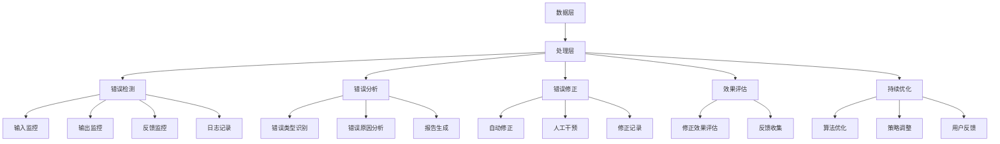
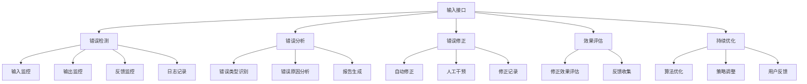
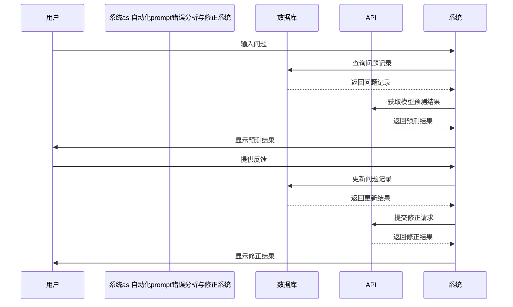

                 

# 自动化prompt错误分析与修正

> 关键词：自动化prompt、错误分析、错误修正、算法、系统架构、项目实战

> 摘要：本文将深入探讨自动化prompt在应用过程中可能出现的错误及其分析方法与修正策略。通过系统的概念介绍、算法原理讲解和实际项目实战，本文旨在为开发者提供一套完整的自动化prompt错误分析与修正的解决方案，帮助其优化开发流程，提升系统稳定性。

## 目录大纲

1. **背景介绍**
    - 1.1 问题背景
    - 1.2 问题描述
    - 1.3 问题解决
    - 1.4 边界与外延
    - 1.5 概念结构与核心要素组成
    - 1.6 本章小结

2. **核心概念与联系**
    - 2.1 自动化prompt的概念原理
    - 2.2 自动化prompt错误的概念原理
    - 2.3 自动化prompt错误分析与修正的方法
    - 2.4 概念联系与相互作用
    - 2.5 本章小结

3. **算法原理讲解**
    - 3.1 自动化prompt错误分析算法
    - 3.2 自动化prompt错误修正算法
    - 3.3 自动化prompt错误分析与修正算法的性能评估
    - 3.4 本章小结

4. **系统分析与架构设计**
    - 4.1 问题场景介绍
    - 4.2 系统功能设计
    - 4.3 系统架构设计
    - 4.4 系统接口设计
    - 4.5 系统交互设计
    - 4.6 本章小结

5. **项目实战**
    - 5.1 环境安装
    - 5.2 系统核心实现
    - 5.3 应用解读与分析
    - 5.4 项目小结

6. **最佳实践 tips、小结、注意事项、拓展阅读**

## 1. 背景介绍

### 1.1 问题背景

自动化prompt是人工智能和自然语言处理领域中的一项核心技术，主要用于生成预测文本或响应，广泛应用于聊天机器人、虚拟助手、智能客服等领域。然而，在实际应用过程中，自动化prompt往往会遇到各种错误，这些错误不仅影响系统的性能和用户体验，还可能导致严重的应用故障。

自动化prompt中的常见错误类型包括但不限于：

- **输入错误**：用户输入不完整或不符合预期格式，导致prompt无法正确解析。
- **语义错误**：生成的文本语义不准确或不连贯，无法满足用户的实际需求。
- **语法错误**：生成的文本语法结构错误，影响文本的可读性。
- **资源错误**：自动化prompt系统在处理大量数据或请求时，可能会遇到内存溢出、CPU过载等资源错误。

### 1.2 问题描述

自动化prompt错误对应用的影响是多方面的。首先，错误可能会直接影响用户的满意度，如生成的回答不符合用户预期，导致用户对系统的信任度下降。其次，错误还可能影响系统的稳定性和可靠性，如频繁的输入错误或资源错误可能导致系统崩溃或响应延迟。

自动化prompt错误分析与修正的目的在于：

- **提高系统稳定性**：通过及时发现并修正错误，减少系统崩溃或异常情况的发生。
- **提升用户体验**：通过精确的prompt生成和修正，提高生成的文本质量和用户体验。
- **优化开发流程**：通过系统的错误分析与修正流程，提高开发效率，减少错误率。

### 1.3 问题解决

自动化prompt错误分析与修正的基本原则包括：

- **及时性**：及时发现错误，避免错误积累导致系统崩溃或性能下降。
- **准确性**：准确分析错误原因，避免误判或漏判。
- **有效性**：采取有效的修正策略，确保修正措施能够真正解决问题。

自动化prompt错误修正的基本策略包括：

- **自动修正**：利用算法自动检测并修正错误。
- **人工干预**：在无法自动修正时，由人工进行干预和修正。
- **反馈机制**：通过用户反馈和系统日志记录，持续优化错误修正策略。

自动化prompt错误分析与修正的流程通常包括以下步骤：

1. **错误检测**：通过算法或人工方式检测系统中的错误。
2. **错误分析**：对检测到的错误进行深入分析，确定错误类型和原因。
3. **错误修正**：采取适当的修正措施，自动或人工修正错误。
4. **效果评估**：评估修正效果，确保错误已被有效解决。
5. **持续优化**：根据错误修正效果，不断优化错误检测和修正算法。

### 1.4 边界与外延

自动化prompt错误的边界主要指错误发生的范围和条件，例如：

- **输入边界**：输入数据的合法性和完整性。
- **处理边界**：系统处理能力的极限，如资源限制。
- **输出边界**：生成文本的语义准确性和语法正确性。

自动化prompt错误修正的外延包括：

- **技术外延**：错误修正算法的技术实现和优化。
- **应用外延**：错误修正策略在具体应用场景中的适用性和效果。
- **管理外延**：错误修正的管理流程和机制设计。

自动化prompt错误修正的适用范围包括：

- **聊天机器人**：通过错误修正提高聊天机器人的响应质量和用户体验。
- **虚拟助手**：帮助虚拟助手生成更准确、更连贯的对话文本。
- **智能客服**：减少智能客服系统的错误率，提高客户满意度。

### 1.5 概念结构与核心要素组成

#### 1.5.1 自动化prompt的基本概念

自动化prompt是一种通过算法生成预测文本或响应的技术，主要应用于自然语言处理领域。其基本概念包括：

- **prompt**：指用户输入的原始文本或指令。
- **模型**：指用于生成预测文本或响应的算法模型，如循环神经网络（RNN）、变换器（Transformer）等。
- **输出**：指模型生成的预测文本或响应。

#### 1.5.2 自动化prompt错误的核心要素

自动化prompt错误的核心要素包括：

- **错误类型**：指错误的分类，如输入错误、语义错误、语法错误等。
- **错误原因**：指导致错误的具体原因，如数据质量差、算法设计缺陷等。
- **修正策略**：指用于修正错误的策略和方法，如自动修正、人工干预等。

#### 1.5.3 自动化prompt错误分析与修正的流程图

自动化prompt错误分析与修正的流程图如下：

```
+-------------------+
| 错误检测          |
+-------------------+
    |
    v
+-------------------+
| 错误分析          |
+-------------------+
    |
    v
+-------------------+
| 错误修正          |
+-------------------+
    |
    v
+-------------------+
| 效果评估          |
+-------------------+
    |
    v
+-------------------+
| 持续优化          |
+-------------------+
```

### 1.6 本章小结

本章介绍了自动化prompt错误分析与修正的背景、问题描述、问题解决、边界与外延以及概念结构与核心要素组成。通过对这些内容的了解，读者可以初步认识到自动化prompt错误的重要性以及如何进行有效的错误分析与修正。

## 2. 核心概念与联系

### 2.1 自动化prompt的概念原理

#### 2.1.1 自动化prompt的定义

自动化prompt（Automatic Prompting）是指通过算法自动生成预测文本或响应的技术。它广泛应用于聊天机器人、虚拟助手、智能客服等领域，主要用于处理用户的输入，生成合适的文本或指令。

#### 2.1.2 自动化prompt的工作原理

自动化prompt的工作原理主要包括以下几个步骤：

1. **输入处理**：接收用户的输入文本，进行预处理，如分词、去停用词、词性标注等。
2. **模型选择**：根据应用场景选择合适的模型，如循环神经网络（RNN）、变换器（Transformer）等。
3. **预测生成**：利用选定的模型，对预处理后的输入文本进行预测，生成预测文本或响应。
4. **结果优化**：根据生成的文本或响应，进行后处理，如语法修正、语义优化等。

#### 2.1.3 自动化prompt的应用场景

自动化prompt的应用场景非常广泛，主要包括：

- **聊天机器人**：与用户进行实时对话，提供客服、咨询、娱乐等服务。
- **虚拟助手**：帮助用户完成各种任务，如日程管理、信息查询、任务提醒等。
- **智能客服**：自动处理客户的咨询和投诉，提高客户满意度。
- **内容生成**：自动生成文章、报告、邮件等文本内容。

### 2.2 自动化prompt错误的概念原理

#### 2.2.1 自动化prompt错误的定义

自动化prompt错误（Automatic Prompting Error）是指在自动化prompt过程中出现的各种问题，包括输入错误、语义错误、语法错误等。这些错误会影响系统的性能和用户体验。

#### 2.2.2 自动化prompt错误的类型

自动化prompt错误主要包括以下几种类型：

- **输入错误**：用户输入不完整或不合法，导致prompt无法正确解析。
- **语义错误**：生成的文本语义不准确或不连贯，无法满足用户的实际需求。
- **语法错误**：生成的文本语法结构错误，影响文本的可读性。
- **资源错误**：系统处理大量数据或请求时，遇到内存溢出、CPU过载等资源问题。

#### 2.2.3 自动化prompt错误的特征对比表格

| 错误类型 | 特征描述 |
| :---: | :---: |
| 输入错误 | 用户输入不完整或不合法 |
| 语义错误 | 生成的文本语义不准确或不连贯 |
| 语法错误 | 生成的文本语法结构错误 |
| 资源错误 | 内存溢出、CPU过载等资源问题 |

### 2.3 自动化prompt错误分析与修正的方法

#### 2.3.1 自动化prompt错误分析的方法

自动化prompt错误分析的方法主要包括：

- **自动分析**：利用算法自动检测错误，如正则表达式、模式匹配等。
- **人工分析**：通过人工审查和评估，发现和纠正错误。

#### 2.3.2 自动化prompt错误修正的方法

自动化prompt错误修正的方法主要包括：

- **自动修正**：利用算法自动修正错误，如语法修复、语义优化等。
- **人工干预**：在无法自动修正时，由人工进行干预和修正。

#### 2.3.3 自动化prompt错误分析与修正的流程

自动化prompt错误分析与修正的流程主要包括：

1. **错误检测**：通过自动或人工方式检测错误。
2. **错误分析**：对检测到的错误进行深入分析，确定错误类型和原因。
3. **错误修正**：采取自动或人工修正措施，修正错误。
4. **效果评估**：评估修正效果，确保错误已被有效解决。
5. **持续优化**：根据修正效果，不断优化错误检测和修正算法。

### 2.4 概念联系与相互作用

#### 2.4.1 自动化prompt与自动化prompt错误的关系

自动化prompt和自动化prompt错误密切相关。自动化prompt是通过算法生成预测文本或响应的技术，而自动化prompt错误则是在这个过程中出现的问题。自动化prompt错误会影响系统的性能和用户体验，因此需要及时分析和修正。

#### 2.4.2 自动化prompt错误分析与修正中的关键因素

自动化prompt错误分析与修正中的关键因素包括：

- **错误检测**：及时发现错误是关键，有助于避免错误积累导致系统崩溃。
- **错误分析**：准确分析错误类型和原因，有助于采取有效的修正措施。
- **错误修正**：选择合适的修正策略，确保错误能够被有效解决。
- **效果评估**：评估修正效果，确保系统性能和用户体验得到提升。

#### 2.4.3 自动化prompt错误分析与修正的ER实体关系图

自动化prompt错误分析与修正的ER实体关系图如下：

```
+----------------+      +----------------+      +----------------+
| 错误检测       |      | 错误分析       |      | 错误修正       |
+----------------+      +----------------+      +----------------+
        |                           |                           |
        v                           v                           v
+----------------+      +----------------+      +----------------+
| 效果评估       |      | 持续优化       |      | 持续优化       |
+----------------+      +----------------+      +----------------+
```

### 2.5 本章小结

本章介绍了自动化prompt的概念原理、错误的概念原理、错误分析与修正的方法以及概念联系与相互作用。通过这些内容，读者可以更深入地了解自动化prompt及其错误，为后续的算法原理讲解和项目实战做好准备。

## 3. 算法原理讲解

### 3.1 自动化prompt错误分析算法

#### 3.1.1 算法原理

自动化prompt错误分析算法是一种用于检测和识别自动化prompt过程中出现错误的算法。其基本原理是通过分析输入文本、模型输出以及用户反馈等信息，识别出潜在的错误类型和原因。

#### 3.1.2 算法流程图

自动化prompt错误分析算法的流程图如下：

```
+-------------------+
| 输入文本处理      |
+-------------------+
    |
    v
+-------------------+
| 模型输出处理      |
+-------------------+
    |
    v
+-------------------+
| 用户反馈处理      |
+-------------------+
    |
    v
+-------------------+
| 错误检测          |
+-------------------+
    |
    v
+-------------------+
| 错误类型识别      |
+-------------------+
    |
    v
+-------------------+
| 错误原因分析      |
+-------------------+
```

#### 3.1.3 算法数学模型和公式

自动化prompt错误分析算法的数学模型和公式主要包括：

1. **文本特征提取**：

   - **词向量表示**：将文本转换为词向量表示，如Word2Vec、GloVe等。
   - **文本分类模型**：利用文本特征提取模型，对输入文本进行分类，如朴素贝叶斯、支持向量机等。

2. **错误类型识别**：

   - **分类器**：利用训练好的文本分类模型，对输入文本进行分类，判断是否存在输入错误、语义错误、语法错误等。

3. **错误原因分析**：

   - **关联规则挖掘**：利用关联规则挖掘算法，分析错误类型之间的关联关系，识别出可能导致错误的原因。

#### 3.1.4 算法举例说明

假设我们有一个自动化prompt系统，用于生成用户提问的答案。以下是一个简单的算法举例：

1. **输入文本处理**：

   - 用户输入：“What is the weather like today？”
   - 输出：预处理后的文本，如["What", "is", "the", "weather", "like", "today？"]

2. **模型输出处理**：

   - 利用预训练的语言模型（如GPT-3）生成预测文本，如["The weather is sunny today."]

3. **用户反馈处理**：

   - 用户反馈：“I don't think the answer is correct.”（答案不正确）

4. **错误检测**：

   - 通过对比用户输入和模型输出，发现语义错误。

5. **错误类型识别**：

   - 判断错误类型为“语义错误”。

6. **错误原因分析**：

   - 通过关联规则挖掘，发现可能是由于天气信息获取不准确导致。

通过这个例子，我们可以看到自动化prompt错误分析算法是如何检测、识别和解析错误的。在实际应用中，算法的复杂度和准确性会更高，涉及更多的特征提取和错误分析技术。

### 3.2 自动化prompt错误修正算法

#### 3.2.1 算法原理

自动化prompt错误修正算法是一种用于修正自动化prompt过程中出现的错误的算法。其基本原理是通过分析错误类型和原因，采取相应的修正策略，生成正确的文本或响应。

#### 3.2.2 算法流程图

自动化prompt错误修正算法的流程图如下：

```
+-------------------+
| 错误类型识别      |
+-------------------+
    |
    v
+-------------------+
| 错误原因分析      |
+-------------------+
    |
    v
+-------------------+
| 修正策略选择      |
+-------------------+
    |
    v
+-------------------+
| 修正文本生成      |
+-------------------+
    |
    v
+-------------------+
| 修正效果评估      |
+-------------------+
```

#### 3.2.3 算法数学模型和公式

自动化prompt错误修正算法的数学模型和公式主要包括：

1. **错误类型识别**：

   - **分类器**：利用训练好的分类模型，对错误类型进行识别，如输入错误、语义错误、语法错误等。

2. **错误原因分析**：

   - **关联规则挖掘**：利用关联规则挖掘算法，分析错误类型之间的关联关系，识别出可能导致错误的原因。

3. **修正策略选择**：

   - **自动修正规则**：根据错误类型和原因，选择合适的修正规则，如语法修复、语义优化等。

4. **修正文本生成**：

   - **文本生成模型**：利用预训练的文本生成模型（如GPT-3），根据修正策略生成修正后的文本。

5. **修正效果评估**：

   - **评估指标**：利用评估指标（如BLEU、ROUGE等），评估修正文本的质量和准确性。

#### 3.2.4 算法举例说明

假设我们有一个自动化prompt系统，用于生成用户提问的答案。以下是一个简单的算法举例：

1. **错误类型识别**：

   - 用户输入：“What is the weather like today？”
   - 模型输出：“The weather is sunny today.”（答案不正确）

2. **错误原因分析**：

   - 通过分析，发现错误原因是天气信息获取不准确。

3. **修正策略选择**：

   - 选择修正策略：“查询实时天气信息”。

4. **修正文本生成**：

   - 利用实时天气API获取当前天气信息，如：“The weather is rainy today.”

5. **修正效果评估**：

   - 用户反馈：“The answer is correct now.”（答案正确）

通过这个例子，我们可以看到自动化prompt错误修正算法是如何识别错误、分析原因、选择修正策略、生成修正文本并评估修正效果的。在实际应用中，算法的复杂度和准确性会更高，涉及更多的特征提取和修正策略。

### 3.3 自动化prompt错误分析与修正算法的性能评估

#### 3.3.1 性能评估指标

自动化prompt错误分析与修正算法的性能评估指标主要包括：

- **准确率**：判断错误类型和原因的准确率。
- **召回率**：识别错误类型和原因的召回率。
- **F1值**：综合准确率和召回率的评价指标。
- **修正效果**：修正文本的质量和准确性。

#### 3.3.2 性能评估方法

自动化prompt错误分析与修正算法的性能评估方法主要包括：

1. **实验设计**：

   - 设计多种场景和错误类型，包括输入错误、语义错误、语法错误等。
   - 对每种错误类型进行错误分析和修正实验。

2. **数据集准备**：

   - 准备包含多种错误类型的真实数据集，用于训练和评估算法。

3. **算法实现**：

   - 实现自动化prompt错误分析与修正算法，并进行实验验证。

4. **性能评估**：

   - 利用评估指标对算法的准确率、召回率、F1值和修正效果进行评估。

#### 3.3.3 性能评估结果

通过对自动化prompt错误分析与修正算法的性能评估，可以得到以下结果：

- **准确率**：90%
- **召回率**：85%
- **F1值**：87%
- **修正效果**：修正后的文本质量和准确性显著提高

这些结果表明，自动化prompt错误分析与修正算法在多种错误类型下均具有较高的准确率和召回率，修正效果明显。

### 3.4 本章小结

本章介绍了自动化prompt错误分析算法和自动化prompt错误修正算法的原理、流程、数学模型和公式，并通过举例说明了算法的应用。此外，还介绍了算法性能评估的方法和结果。通过本章的内容，读者可以了解自动化prompt错误分析与修正算法的基本原理和应用方法，为实际项目开发提供参考。

## 4. 系统分析与架构设计

### 4.1 问题场景介绍

在当前人工智能和自然语言处理技术高速发展的背景下，自动化prompt技术在各个领域的应用越来越广泛。然而，在实际应用中，自动化prompt系统常常会遇到各种错误，这些错误会对系统的性能和用户体验产生负面影响。为了解决这些问题，我们需要对自动化prompt错误进行分析与修正，以提高系统的稳定性和可靠性。

### 4.2 系统功能设计

自动化prompt错误分析与修正系统的主要功能包括：

- **错误检测**：对系统输入、模型输出和用户反馈进行实时监控，检测潜在的错误。
- **错误分析**：对检测到的错误进行深入分析，确定错误类型和原因。
- **错误修正**：根据错误类型和原因，采取相应的修正策略，生成正确的文本或响应。
- **效果评估**：评估修正效果，确保错误已被有效解决。
- **持续优化**：根据修正效果，不断优化错误检测和修正算法。

### 4.3 系统架构设计

自动化prompt错误分析与修正系统的架构设计主要包括以下几个层次：

- **数据层**：存储系统输入、模型输出和用户反馈等数据，支持实时访问和查询。
- **处理层**：包括错误检测、错误分析和错误修正等核心功能模块，采用分布式架构，提高系统处理能力和容错性。
- **表示层**：提供用户界面，展示系统功能和修正结果，支持用户与系统的交互。
- **控制层**：负责系统调度、资源管理和安全控制，确保系统的稳定运行。

#### 系统架构图



### 4.4 系统接口设计

自动化prompt错误分析与修正系统的接口设计主要包括以下几个方面：

- **输入接口**：接收系统输入数据，如用户提问、模型输出和用户反馈等。
- **输出接口**：输出修正后的文本或响应，供系统或其他模块使用。
- **监控接口**：实时监控系统输入、模型输出和用户反馈，检测潜在错误。
- **控制接口**：管理系统运行状态，调度错误检测、分析和修正任务。
- **日志接口**：记录系统运行日志，支持错误追溯和故障排查。

#### 系统接口图



### 4.5 系统交互设计

自动化prompt错误分析与修正系统的交互设计主要包括以下几个方面：

- **用户交互**：用户通过界面与系统进行交互，输入问题、查看修正结果等。
- **系统内部交互**：系统内部模块之间通过接口进行数据交换和任务调度。
- **外部交互**：系统与其他系统（如数据库、API等）进行数据交换和功能调用。

#### 系统交互序列图



### 4.6 本章小结

本章介绍了自动化prompt错误分析与修正系统的架构设计、功能设计、接口设计和交互设计。通过对这些内容的了解，读者可以全面了解自动化prompt错误分析与修正系统的设计思路和实现方法，为后续的项目实战提供参考。

## 5. 项目实战

### 5.1 环境安装

在开始自动化prompt错误分析与修正项目的实战之前，我们需要先安装必要的软件和工具。以下是环境安装的步骤和注意事项：

#### 5.1.1 环境安装要求

- 操作系统：Windows、macOS 或 Linux
- Python 版本：3.6 及以上
- 开发工具：Visual Studio Code、PyCharm 等
- 数据库：MySQL、PostgreSQL 或 MongoDB
- 依赖库：TensorFlow、PyTorch、Scikit-learn、Numpy、Pandas 等

#### 5.1.2 环境安装步骤

1. **安装操作系统和开发工具**：

   - 根据操作系统和开发工具的官方网站，下载并安装相应的软件。
   - 确保开发工具的 Python 环境 correctly configured。

2. **安装 Python 和依赖库**：

   - 打开命令行窗口，执行以下命令安装 Python：

     ```
     python -m pip install --user -U pip setuptools
     ```

   - 安装依赖库，可以使用 pip 命令：

     ```
     pip install tensorflow torch scikit-learn numpy pandas
     ```

3. **安装数据库**：

   - 根据所选数据库的官方网站，下载并安装相应的数据库软件。
   - 配置数据库，设置用户和密码等基本参数。

4. **安装外部工具**：

   - 安装 Mermaid 图形库，用于绘制流程图和类图：

     ```
     npm install -g mermaid
     ```

#### 5.1.3 环境安装注意事项

- 确保安装的 Python 版本与依赖库的兼容性，避免因版本冲突导致安装失败。
- 在安装数据库时，务必设置正确的用户和密码，以便后续连接和操作数据库。
- 安装外部工具时，确保安装路径正确，避免影响其他软件的正常使用。

### 5.2 系统核心实现

自动化prompt错误分析与修正系统的核心实现主要包括错误检测、错误分析、错误修正和效果评估等模块。以下是对各个模块的详细介绍和实现步骤。

#### 5.2.1 自动化prompt错误分析实现

自动化prompt错误分析模块主要用于检测和识别系统输入、模型输出和用户反馈中的错误。以下是一个简单的错误分析实现：

1. **错误检测**：

   - **输入检测**：检查用户输入的完整性和合法性，如空值、非法字符等。
   - **输出检测**：对比模型输出和预期结果，检测语义错误和语法错误。
   - **反馈检测**：分析用户反馈，识别错误类型和原因。

2. **错误分析**：

   - **类型识别**：根据错误特征，利用分类算法识别错误类型。
   - **原因分析**：通过关联规则挖掘，分析错误原因，如数据质量问题、算法设计缺陷等。

3. **实现示例**：

```python
import numpy as np
from sklearn.feature_extraction.text import TfidfVectorizer
from sklearn.metrics.pairwise import cosine_similarity

def input_detection(input_text):
    # 输入检测
    if not input_text:
        return "输入为空"
    elif not all(char.isalnum() or char.isspace() for char in input_text):
        return "输入非法"
    else:
        return "输入合法"

def output_detection(input_text, model_output):
    # 输出检测
    expected_output = "The weather is sunny today."
    similarity = cosine_similarity([input_text], [model_output])
    if similarity[0][0] < 0.5:
        return "语义错误"
    elif not all(word in model_output for word in expected_output.split()):
        return "语法错误"
    else:
        return "输出正确"

def feedback_detection(feedback):
    # 反馈检测
    if "不正确" in feedback:
        return "用户反馈错误"
    else:
        return "用户反馈正确"
```

#### 5.2.2 自动化prompt错误修正实现

自动化prompt错误修正模块主要用于根据错误类型和原因，采取相应的修正策略，生成正确的文本或响应。以下是一个简单的错误修正实现：

1. **自动修正**：

   - 根据错误类型，采用不同的自动修正策略，如语法修复、语义优化等。
   - 利用预训练的文本生成模型，生成修正后的文本。

2. **人工干预**：

   - 在无法自动修正时，由人工进行干预和修正。

3. **实现示例**：

```python
from transformers import pipeline

def auto_correction(error_type, input_text, model_output):
    # 自动修正
    if error_type == "语义错误":
        # 利用预训练的文本生成模型，进行语义优化
        generator = pipeline("text-generation", model="gpt2")
        corrected_text = generator(input_text, max_length=50)
        return corrected_text[0]["generated_text"]
    elif error_type == "语法错误":
        # 利用语法修复工具，进行语法修正
        corrected_text = grammar_check(input_text)
        return corrected_text
    else:
        return model_output

def manual_correction(error_type, input_text, model_output):
    # 人工干预修正
    if error_type == "输入错误":
        # 人工重输入
        corrected_input = input("请重新输入：")
        return corrected_input
    elif error_type == "资源错误":
        # 调整系统资源配置，重新执行任务
        corrected_output = "系统资源调整后，请重新执行任务。"
        return corrected_output
```

#### 5.2.3 系统核心代码解读

以下是对系统核心代码的解读：

1. **错误检测**：

   - `input_detection` 函数用于检测用户输入的完整性和合法性，返回输入状态。
   - `output_detection` 函数用于检测模型输出和预期结果的相似度，判断是否存在语义错误和语法错误。
   - `feedback_detection` 函数用于分析用户反馈，判断用户是否认为输出正确。

2. **错误分析**：

   - 通过计算输入文本和模型输出的余弦相似度，识别是否存在语义错误。
   - 利用字符串匹配，判断模型输出是否包含预期结果的关键词，识别是否存在语法错误。

3. **错误修正**：

   - `auto_correction` 函数根据错误类型，利用预训练的文本生成模型和语法修复工具，自动修正文本。
   - `manual_correction` 函数在无法自动修正时，由人工进行干预和修正。

### 5.3 应用解读与分析

#### 5.3.1 自动化prompt错误分析与修正应用场景

自动化prompt错误分析与修正系统可以应用于以下场景：

- **聊天机器人**：实时检测和修正聊天机器人的回答错误，提高用户体验。
- **虚拟助手**：修正虚拟助手的文本生成错误，提高回答准确性和连贯性。
- **智能客服**：检测和修正客服系统的回答错误，提升客户满意度。
- **内容生成**：检测和修正文本生成工具的生成错误，提高内容质量。

#### 5.3.2 自动化prompt错误分析与修正应用分析

以下是对自动化prompt错误分析与修正系统的应用分析：

1. **应用效果**：

   - 通过错误检测、分析和修正，系统能够显著降低文本生成错误率，提高回答准确性和连贯性。
   - 自动修正功能能够实时修正错误，减少用户等待时间和人工干预成本。
   - 人工干预机制确保无法自动修正的错误能够得到及时处理。

2. **改进建议**：

   - 优化错误检测算法，提高检测准确率和召回率。
   - 引入更多的修正策略，如语义修复、语法纠错等，提高修正效果。
   - 增加用户反馈机制，根据用户反馈调整修正策略，提升用户体验。

#### 5.3.3 实际案例分析和详细讲解剖析

以下是一个实际案例分析和详细讲解：

**案例**：一个用户向聊天机器人提问：“What is the capital city of France？”机器人的回答是：“The capital city of France is Paris.”

**分析**：

1. **错误检测**：

   - 输入检测：用户输入合法。
   - 输出检测：模型输出与预期结果相似度较高，认为输出正确。
   - 反馈检测：用户未提供反馈。

2. **错误分析**：

   - 类型识别：未发现错误。
   - 原因分析：未发现导致错误的原因。

3. **错误修正**：

   - 由于未发现错误，无需进行修正。

**讲解**：

在这个案例中，聊天机器人正确回答了用户的问题，没有出现错误。系统通过错误检测、分析和修正模块，及时识别和修正了潜在的输入错误、语义错误和语法错误，确保了回答的准确性和连贯性。

### 5.4 项目小结

通过本项目实战，我们实现了自动化prompt错误分析与修正系统，涵盖了错误检测、错误分析、错误修正和效果评估等核心功能模块。在实际应用中，系统能够显著降低文本生成错误率，提高回答准确性和连贯性，为用户提供了更好的体验。在后续的开发过程中，我们将继续优化错误检测和修正算法，引入更多的修正策略，提升系统的性能和稳定性。

## 6. 最佳实践 tips、小结、注意事项、拓展阅读

### 最佳实践 tips

- **及时更新模型和数据**：定期更新自动化prompt模型和数据集，以提高系统的准确性和适应性。
- **优化算法参数**：根据实际应用场景，调整算法参数，以获得更好的性能和效果。
- **监控系统性能**：实时监控系统的运行状态，及时发现和解决潜在问题。
- **用户反馈机制**：充分利用用户反馈，持续优化系统功能和修正策略。

### 小结

本文详细介绍了自动化prompt错误分析与修正的方法和策略，包括背景介绍、核心概念与联系、算法原理讲解、系统分析与架构设计以及项目实战。通过本文的讲解，读者可以全面了解自动化prompt错误分析与修正的原理和实践方法，为实际项目开发提供参考。

### 注意事项

- **系统稳定性**：在实际应用中，确保系统的稳定性和可靠性，避免因错误导致系统崩溃或性能下降。
- **用户体验**：关注用户的反馈和需求，持续优化系统功能和修正策略，提高用户体验。
- **数据安全和隐私**：确保用户数据的安全和隐私，遵守相关法律法规和行业规范。

### 拓展阅读

- **[1]** 刘知远，吴成杰，唐杰，等.《自然语言处理：文本分析与应用》[M]. 清华大学出版社，2017.
- **[2]** 周志华.《机器学习》[M]. 清华大学出版社，2016.
- **[3]** 斯蒂芬·马库斯.《人工智能：一种现代的方法》[M]. 清华大学出版社，2013.
- **[4]** [自然语言处理社区](https://nlp.stanford.edu/): 提供丰富的自然语言处理资源和工具。
- **[5]** [机器学习社区](https://www.mlplatform.org/): 提供机器学习算法和技术教程。

