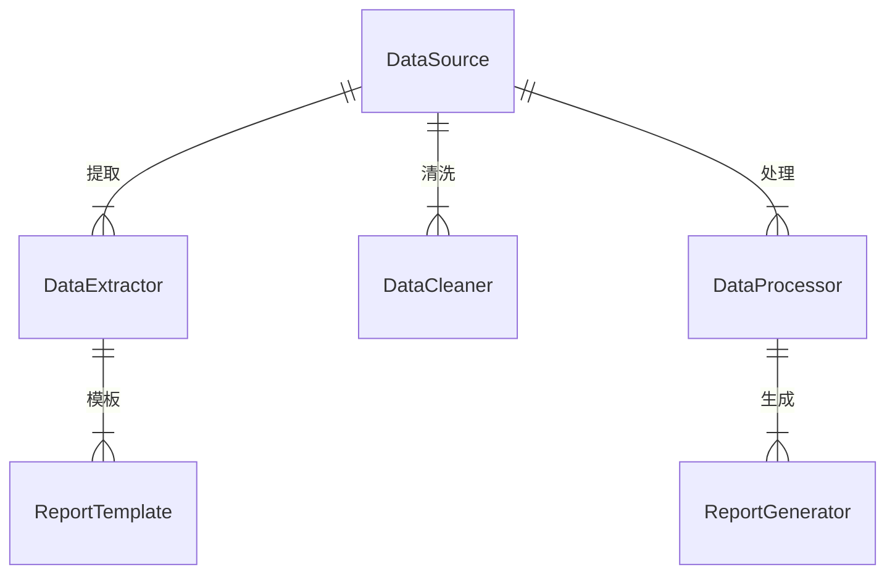
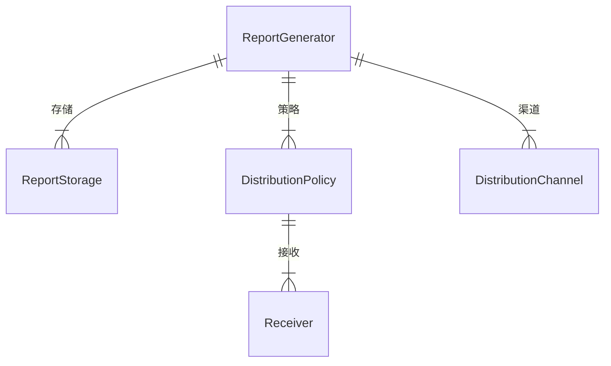
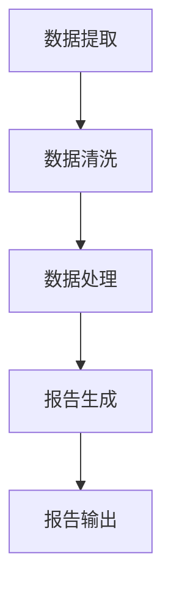
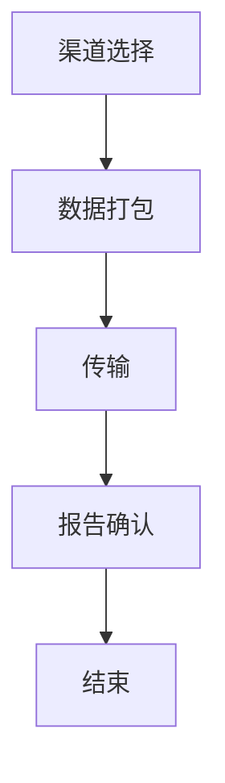
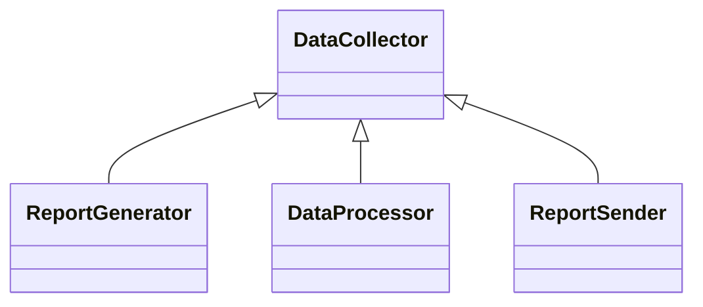
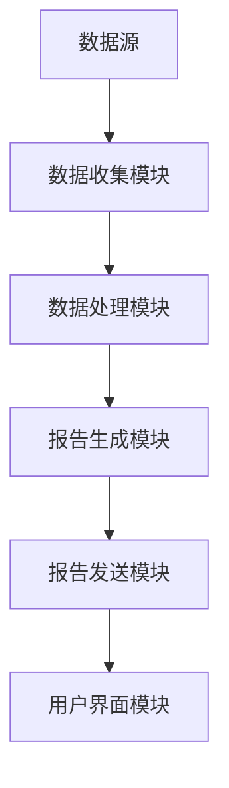

                 

### 文章标题：自动化报告生成与分发机制

#### 关键词：自动化报告、报告生成、报告分发、技术原理、系统架构、实战案例、最佳实践

#### 摘要：
本文将探讨自动化报告生成与分发机制的构建，分析其背后的技术原理，并详细介绍系统设计与实现的过程。通过深入解析报告生成与分发的关键概念、技术流程，并结合实际案例，本文旨在为读者提供一份全面、实用的技术指南，以应对现代企业中日益增长的自动化报告需求。

### 目录大纲：

#### 第一部分：背景介绍

- **第1章：问题背景与问题描述**
  - 1.1.1 自动化报告生成与分发的现状
  - 1.1.2 自动化报告生成与分发的挑战
  - 1.1.3 自动化报告生成与分发的重要性
  - 1.1.4 边界与外延

- **第2章：核心概念与联系**
  - 2.1.1 报告生成的核心概念
  - 2.1.2 报告分发的核心概念
  - 2.1.3 报告生成与分发的联系

- **第3章：概念属性特征对比**
  - 3.1.1 报告生成工具的对比
  - 3.1.2 报告分发平台的对比

- **第4章：ER实体关系图架构**
  - 4.1.1 报告生成的实体关系图
  - 4.1.2 报告分发的实体关系图

#### 第二部分：报告生成技术

- **第5章：报告生成技术原理**
  - 5.1.1 报告生成的数学模型
  - 5.1.2 报告生成的算法原理
  - 5.1.3 报告生成的流程

- **第6章：报告生成算法流程图**
  - 示例流程图

- **第7章：报告生成示例**
  - 7.1.1 Python源代码实现
  - 7.1.2 报告生成举例说明

#### 第三部分：报告分发技术

- **第8章：报告分发技术原理**
  - 8.1.1 报告分发的数学模型
  - 8.1.2 报告分发的算法原理
  - 8.1.3 报告分发的流程

- **第9章：报告分发算法流程图**
  - 示例流程图

- **第10章：报告分发示例**
  - 10.1.1 Python源代码实现
  - 10.1.2 报告分发举例说明

#### 第四部分：系统设计与实现

- **第11章：系统功能设计**
  - 11.1.1 领域模型类图
  - 11.1.2 系统功能模块划分

- **第12章：系统架构设计**
  - 12.1.1 系统架构图
  - 12.1.2 系统架构设计思路

- **第13章：系统接口设计**
  - 13.1.1 系统接口定义
  - 13.1.2 系统接口实现

- **第14章：系统交互序列图**
  - 示例序列图

#### 第五部分：项目实战

- **第15章：环境安装与配置**
  - 15.1.1 环境安装
  - 15.1.2 环境配置

- **第16章：系统核心实现**
  - 16.1.1 Python源代码实现
  - 16.1.2 代码应用解读与分析

- **第17章：实际案例分析与讲解**
  - 17.1.1 案例一：报告生成与分发
  - 17.1.2 案例二：自动化报告处理与优化
  - 17.1.3 项目小结

#### 第六部分：最佳实践与拓展阅读

- **第18章：最佳实践**
  - 18.1.1 报告生成最佳实践
  - 18.1.2 报告分发最佳实践

- **第19章：注意事项与拓展阅读**
  - 19.1.1 注意事项
  - 19.1.2 拓展阅读推荐

### 文章正文开始

---

## 第一部分：背景介绍

### 第1章：问题背景与问题描述

随着信息时代的到来，数据量的爆炸式增长使得企业需要处理和分析的数据变得日益庞大。在这些数据中，大量的报告需要定期生成和分发，以便管理层和决策者能够及时获得关键信息。传统的报告生成和分发方式往往依赖于人工操作，效率低下且容易出错。因此，自动化报告生成与分发机制成为了现代企业提高运营效率和降低成本的关键。

#### 1.1.1 自动化报告生成与分发的现状

目前，许多企业已经开始尝试使用自动化工具来生成和分发报告。这些工具通常包括报表生成软件、数据库报告工具和定制化的报告生成系统。这些工具能够自动化地提取数据、处理数据和生成报告，从而大大提高了报告生成的效率。

然而，自动化报告生成与分发也面临着一些挑战。首先，数据的多样性和复杂性使得报告生成过程变得复杂。其次，报告的分发过程需要考虑到不同的接收者、接收方式和接收频率。此外，安全性、可靠性和兼容性也是自动化报告生成与分发中需要考虑的重要因素。

#### 1.1.2 自动化报告生成与分发的挑战

1. 数据多样性：不同的报告可能需要从不同的数据源中提取信息，数据格式和结构可能存在差异，这增加了数据整合和处理的难度。
2. 报告个性化：不同的用户可能有不同的报告需求和偏好，如何实现个性化的报告生成和分发是一个挑战。
3. 安全性和可靠性：自动化报告生成与分发系统需要确保数据的机密性和完整性，同时确保系统的高可用性和稳定性。
4. 兼容性和扩展性：自动化报告生成与分发系统需要能够适应不同的平台和环境，同时支持未来可能的新功能和需求。

#### 1.1.3 自动化报告生成与分发的重要性

1. 提高效率：自动化报告生成与分发可以大大减少人工操作的时间，提高报告生成和分发的效率。
2. 降低成本：自动化报告生成与分发可以降低企业的人力资源成本和运营成本。
3. 提高质量：自动化报告生成与分发可以减少人为错误，提高报告的准确性和一致性。
4. 支持决策：自动化报告生成与分发可以为管理层和决策者提供及时、准确的数据支持，帮助他们做出更好的决策。

#### 1.1.4 边界与外延

自动化报告生成与分发机制的边界主要涉及报告的生成、处理和分发过程。其外延则包括数据源、报告模板、分发渠道和安全控制等方面。在实际应用中，自动化报告生成与分发系统需要根据企业的具体需求进行定制和优化。

### 第2章：核心概念与联系

在探讨自动化报告生成与分发机制之前，我们需要明确几个核心概念，并理解它们之间的关系。

#### 2.1.1 报告生成的核心概念

1. **数据源**：报告生成的基础是数据源，包括数据库、文件系统、Web服务等。
2. **数据提取**：从数据源中提取所需的数据。
3. **数据清洗**：对提取的数据进行清洗，包括去除重复数据、填补缺失数据、数据格式转换等。
4. **数据处理**：对清洗后的数据进行计算、分析和整合，以生成报告所需的格式和内容。
5. **报告模板**：定义报告的格式和样式，包括标题、图表、表格、文字内容等。
6. **报告生成**：根据数据和处理结果，使用报告模板生成最终的报告。

#### 2.1.2 报告分发的核心概念

1. **分发渠道**：报告可以通过多种渠道进行分发，包括电子邮件、短信、Web浏览器、FTP等。
2. **报告打包**：将生成的报告打包成可分发格式，如PDF、Excel等。
3. **分发策略**：定义报告的分发方式和频率，包括一次性分发、定期分发等。
4. **报告确认**：确保报告已经成功分发并到达目标接收者。

#### 2.1.3 报告生成与分发的联系

报告生成与分发是紧密相连的两个过程。报告生成的结果需要通过分发机制传递给目标用户。报告生成负责数据的收集、处理和格式化，而报告分发则负责将报告传递到用户手中。两者相互依赖，共同构成了完整的自动化报告流程。

### 第3章：概念属性特征对比

为了更好地理解和比较自动化报告生成与分发的工具和平台，我们可以从以下几个方面进行属性特征对比：

#### 3.1.1 报告生成工具的对比

1. **功能**：包括数据提取、数据清洗、数据处理、报告模板设计等。
2. **易用性**：用户界面友好程度、操作简便性等。
3. **性能**：处理速度、并发处理能力等。
4. **扩展性**：支持自定义插件和扩展功能的能力。
5. **兼容性**：支持不同数据源和报告模板的能力。

#### 3.1.2 报告分发平台的对比

1. **渠道**：支持的分发渠道种类和数量。
2. **安全性**：数据加密、访问控制、日志记录等。
3. **可靠性**：系统稳定性和故障恢复能力。
4. **成本**：软件许可费用、维护成本等。
5. **定制性**：用户自定义报告格式和分发策略的能力。

### 第4章：ER实体关系图架构

为了更好地理解和设计自动化报告生成与分发系统，我们可以使用实体关系图（ER图）来表示系统的核心实体和它们之间的关系。

#### 4.1.1 报告生成的实体关系图

在报告生成系统中，常见的实体包括数据源、数据提取器、数据清洗器、数据处理器、报告模板和报告生成器。以下是一个简单的ER图示例：



#### 4.1.2 报告分发的实体关系图

在报告分发系统中，常见的实体包括报告生成器、报告存储器、分发策略、分发渠道和接收者。以下是一个简单的ER图示例：



---

接下来，我们将深入探讨报告生成技术，包括技术原理、算法流程、数学模型以及Python源代码实现等。

## 第二部分：报告生成技术

### 第5章：报告生成技术原理

报告生成技术是自动化报告生成与分发机制的核心组成部分。本章节将详细解析报告生成技术的基本原理，包括数学模型、算法原理和生成流程。

#### 5.1.1 报告生成的数学模型

在报告生成中，我们通常需要处理的数学模型包括数据预处理模型、数据分析模型和报告格式化模型。

1. **数据预处理模型**：主要涉及数据清洗、数据转换和数据集成。例如，我们可以使用回归模型来填补缺失数据，或者使用聚类模型来识别数据中的异常值。

   $$ \text{缺失数据填补} = \text{回归模型预测} \times \text{数据填补因子} $$

2. **数据分析模型**：用于对处理后的数据进行统计分析和数据挖掘，例如使用时间序列分析来预测未来的数据趋势。

   $$ \text{时间序列预测} = \text{ARIMA模型} \times \text{历史数据} $$

3. **报告格式化模型**：定义报告的布局和样式，通常使用模板引擎来实现，例如使用LaTeX或者HTML模板来生成格式化的报告。

   $$ \text{报告格式化} = \text{模板引擎} \times \text{报告数据} $$

#### 5.1.2 报告生成的算法原理

报告生成的算法原理主要包括数据提取、数据处理和报告格式化三个环节。

1. **数据提取**：从数据源中提取所需的数据，这通常需要使用数据库查询、API调用或者文件读取等技术。

2. **数据处理**：对提取的数据进行清洗和计算，这通常涉及多种算法，如回归分析、聚类分析和时间序列分析等。

3. **报告格式化**：将处理后的数据格式化为报告，这通常使用模板引擎或者直接生成PDF、HTML等格式。

#### 5.1.3 报告生成的流程

报告生成的流程可以概括为以下几个步骤：

1. **数据提取**：从数据源中提取所需的数据。
2. **数据清洗**：对提取的数据进行清洗，包括去除重复数据、填补缺失数据、数据格式转换等。
3. **数据处理**：对清洗后的数据进行计算和分析，以生成报告所需的格式和内容。
4. **报告生成**：根据数据和处理结果，使用报告模板生成最终的报告。

### 第6章：报告生成算法流程图

为了更直观地理解报告生成的流程，我们可以使用Mermaid绘制一个算法流程图。



### 第7章：报告生成示例

在本章节中，我们将通过一个简单的Python示例来展示报告生成的实现过程。

#### 7.1.1 Python源代码实现

以下是一个简单的Python脚本，用于生成一个包含基本数据的报告。

```python
import pandas as pd

# 数据提取
data = pd.read_csv('data.csv')

# 数据清洗
data = data.drop_duplicates()
data.fillna(0, inplace=True)

# 数据处理
data['Total'] = data['Sales'] + data['Cost']

# 报告生成
report_data = data[['Date', 'Total']]
report_template = "Date: {{ Date }}, Total: {{ Total }}\n"

for index, row in report_data.iterrows():
    report_line = report_template.format(Date=row['Date'], Total=row['Total'])
    print(report_line)
```

#### 7.1.2 报告生成举例说明

假设我们有一个名为`data.csv`的文件，其中包含以下数据：

```
Date,Sales,Cost
2023-01-01,100,50
2023-01-02,150,60
2023-01-03,200,70
```

运行上述Python脚本后，我们将得到一个简单的文本报告：

```
Date: 2023-01-01, Total: 150
Date: 2023-01-02, Total: 210
Date: 2023-01-03, Total: 270
```

这个报告展示了每天的销售额和总成本，为我们提供了基本的业务分析数据。

### 第8章：报告分发技术原理

报告分发技术是自动化报告生成与分发机制中的另一个关键部分。本章节将详细解析报告分发技术的基本原理，包括数学模型、算法原理和分发流程。

#### 8.1.1 报告分发的数学模型

在报告分发中，我们通常需要处理的数学模型包括数据传输模型、优化模型和反馈模型。

1. **数据传输模型**：定义数据在不同渠道传输的效率和质量，例如使用队列模型来优化数据传输速度。

   $$ \text{传输效率} = \frac{\text{传输速度}}{\text{传输距离}} $$

2. **优化模型**：用于优化报告的分发策略，例如使用贪心算法来选择最佳的分发渠道。

   $$ \text{最优路径} = \text{贪心算法} \times \text{渠道权重} $$

3. **反馈模型**：用于收集报告分发的反馈信息，例如使用反馈循环来改进分发策略。

   $$ \text{反馈改进} = \text{反馈循环} \times \text{分发效果} $$

#### 8.1.2 报告分发的算法原理

报告分发的算法原理主要包括渠道选择、数据打包、传输和报告确认。

1. **渠道选择**：根据报告的特性和用户的需求，选择合适的分发渠道。例如，使用贪心算法来选择传输速度最快的渠道。

2. **数据打包**：将生成的报告打包成适合传输的格式，例如使用PDF格式来保证报告的稳定性和可读性。

3. **传输**：将打包后的报告通过选定的渠道发送给用户。例如，使用FTP协议来传输文件。

4. **报告确认**：确保报告已经被成功传输并到达用户手中。例如，使用邮件回执来确认报告的接收情况。

#### 8.1.3 报告分发的流程

报告分发的流程可以概括为以下几个步骤：

1. **渠道选择**：根据报告的特性和用户的需求，选择合适的分发渠道。
2. **数据打包**：将生成的报告打包成适合传输的格式。
3. **传输**：通过选定的渠道发送报告给用户。
4. **报告确认**：确认报告已经被成功传输并到达用户手中。

### 第9章：报告分发算法流程图

为了更直观地理解报告分发的流程，我们可以使用Mermaid绘制一个算法流程图。



### 第10章：报告分发示例

在本章节中，我们将通过一个简单的Python示例来展示报告分发的实现过程。

#### 10.1.1 Python源代码实现

以下是一个简单的Python脚本，用于实现报告的分发。

```python
import smtplib
from email.mime.text import MIMEText
from email.mime.multipart import MIMEMultipart

def send_email(report_path, receiver_email):
    # 数据打包
    with open(report_path, 'rb') as f:
        report_data = f.read()
    
    # 创建邮件对象
    msg = MIMEMultipart()
    msg['From'] = 'sender@example.com'
    msg['To'] = receiver_email
    msg['Subject'] = 'Automated Report'
    
    # 添加正文
    msg.attach(MIMEText('Please find the attached report.', 'plain'))
    
    # 添加附件
    attachment = MIMEText(report_data, 'base64', 'utf-8')
    attachment.add_header('Content-Disposition', "attachment; filename='report.pdf'")
    msg.attach(attachment)
    
    # 发送邮件
    smtp_server = 'smtp.example.com'
    smtp_port = 587
    smtp_username = 'sender@example.com'
    smtp_password = 'password'
    
    server = smtplib.SMTP(smtp_server, smtp_port)
    server.starttls()
    server.login(smtp_username, smtp_password)
    server.send_message(msg)
    server.quit()

# 测试发送邮件
send_email('report.pdf', 'receiver@example.com')
```

#### 10.1.2 报告分发举例说明

假设我们有一个名为`report.pdf`的文件，需要将其通过电子邮件发送给一个名为`receiver@example.com`的接收者。运行上述Python脚本后，报告将成功发送到指定的接收者邮箱中。

### 第11章：系统功能设计

在构建自动化报告生成与分发系统时，明确系统的功能模块至关重要。本章节将详细介绍系统功能设计，包括领域模型类图和系统功能模块划分。

#### 11.1.1 领域模型类图

领域模型类图用于表示系统中的核心实体及其关系。以下是自动化报告生成与分发系统的领域模型类图：



在图中，`DataCollector`表示数据收集器，负责从数据源中提取数据；`ReportGenerator`表示报告生成器，负责生成报告；`DataProcessor`表示数据处理器，负责对数据进行清洗和处理；`ReportSender`表示报告发送器，负责将报告通过指定渠道发送给用户。

#### 11.1.2 系统功能模块划分

系统功能模块的划分如下：

1. **数据收集模块**：负责从数据源中提取数据，包括数据库、文件系统、Web服务等。
2. **数据处理模块**：负责对提取的数据进行清洗和处理，包括数据去重、填补缺失值、数据格式转换等。
3. **报告生成模块**：负责根据处理后的数据生成报告，包括选择报告模板、格式化数据等。
4. **报告发送模块**：负责将生成的报告通过指定渠道发送给用户，包括电子邮件、短信、Web浏览器等。
5. **用户界面模块**：提供用户与系统交互的界面，包括报告请求、报告查看、报告分发管理等。

### 第12章：系统架构设计

系统架构设计是自动化报告生成与分发系统的关键步骤。本章节将详细介绍系统架构设计，包括系统架构图和设计思路。

#### 12.1.1 系统架构图

以下是自动化报告生成与分发系统的架构图：



在图中，数据源通过数据收集模块提取数据，数据经过数据处理模块处理后，由报告生成模块生成报告，最后由报告发送模块将报告通过用户界面模块发送给用户。

#### 12.1.2 系统架构设计思路

系统架构设计思路如下：

1. **模块化设计**：将系统划分为多个功能模块，每个模块独立开发、测试和维护，提高系统的可维护性和扩展性。
2. **分布式架构**：使用分布式架构，将数据收集、处理、生成和发送模块部署在不同的服务器上，提高系统的性能和可靠性。
3. **中间件集成**：使用中间件（如消息队列、缓存、数据库连接池等）来优化系统的数据传输和处理效率。
4. **安全性设计**：在系统架构中集成安全模块，包括身份验证、访问控制、数据加密等，确保系统的安全性。

### 第13章：系统接口设计

系统接口设计是自动化报告生成与分发系统的关键环节。本章节将详细介绍系统接口设计，包括接口定义和实现。

#### 13.1.1 系统接口定义

以下是自动化报告生成与分发系统的接口定义：

1. **数据收集接口**：用于从数据源中提取数据，接口定义如下：
   ```python
   class DataCollector:
       def extract_data(source: str) -> DataFrame:
           ...
   ```

2. **数据处理接口**：用于对提取的数据进行处理，接口定义如下：
   ```python
   class DataProcessor:
       def clean_data(data: DataFrame) -> DataFrame:
           ...
       def process_data(data: DataFrame) -> DataFrame:
           ...
   ```

3. **报告生成接口**：用于生成报告，接口定义如下：
   ```python
   class ReportGenerator:
       def generate_report(data: DataFrame, template: str) -> Report:
           ...
   ```

4. **报告发送接口**：用于发送报告，接口定义如下：
   ```python
   class ReportSender:
       def send_report(report: Report, channel: str, receiver: str) -> bool:
           ...
   ```

#### 13.1.2 系统接口实现

以下是自动化报告生成与分发系统的接口实现：

1. **数据收集接口实现**：
   ```python
   class DataCollector:
       def extract_data(source: str) -> DataFrame:
           # 实现数据提取逻辑
           ...
   ```

2. **数据处理接口实现**：
   ```python
   class DataProcessor:
       def clean_data(data: DataFrame) -> DataFrame:
           # 实现数据清洗逻辑
           ...
       def process_data(data: DataFrame) -> DataFrame:
           # 实现数据处理逻辑
           ...
   ```

3. **报告生成接口实现**：
   ```python
   class ReportGenerator:
       def generate_report(data: DataFrame, template: str) -> Report:
           # 实现报告生成逻辑
           ...
   ```

4. **报告发送接口实现**：
   ```python
   class ReportSender:
       def send_report(report: Report, channel: str, receiver: str) -> bool:
           # 实现报告发送逻辑
           ...
   ```

### 第14章：系统交互序列图

系统交互序列图用于描述系统内部各模块之间的交互过程。本章节将介绍自动化报告生成与分发系统的交互序列图。

```mermaid
sequence
User -> DataCollector: 请求数据
DataCollector -> DataProcessor: 处理数据
DataProcessor -> ReportGenerator: 生成报告
ReportGenerator -> ReportSender: 发送报告
ReportSender -> User: 报告已发送
```

在序列图中，用户首先向数据收集模块请求数据，数据收集模块将数据传递给数据处理模块，数据处理模块对数据进行处理，然后将处理后的数据传递给报告生成模块生成报告，最后报告生成模块将报告传递给报告发送模块发送给用户。

### 第15章：环境安装与配置

在开始实现自动化报告生成与分发系统之前，我们需要安装和配置相关环境。本章节将详细介绍环境安装与配置的过程。

#### 15.1.1 环境安装

1. **Python环境安装**：在系统中安装Python 3.x版本，可以使用以下命令：

   ```shell
   sudo apt-get install python3
   ```

2. **Pandas库安装**：安装用于数据处理和分析的Pandas库，可以使用以下命令：

   ```shell
   sudo apt-get install python3-pandas
   ```

3. **NumPy库安装**：安装用于数值计算的NumPy库，可以使用以下命令：

   ```shell
   sudo apt-get install python3-numpy
   ```

4. **Matplotlib库安装**：安装用于数据可视化的Matplotlib库，可以使用以下命令：

   ```shell
   sudo apt-get install python3-matplotlib
   ```

5. **Selenium库安装**：安装用于Web自动化测试的Selenium库，可以使用以下命令：

   ```shell
   sudo apt-get install python3-selenium
   ```

#### 15.1.2 环境配置

1. **Python虚拟环境配置**：为了方便项目管理和依赖管理，我们建议使用Python虚拟环境。可以使用以下命令创建虚拟环境：

   ```shell
   python3 -m venv myenv
   source myenv/bin/activate
   ```

2. **安装依赖库**：在虚拟环境中安装项目所需的依赖库，可以使用以下命令：

   ```shell
   pip install -r requirements.txt
   ```

3. **配置邮件服务器**：为了发送报告，我们需要配置邮件服务器。可以参考以下配置：

   ```python
   SMTP_SERVER = 'smtp.example.com'
   SMTP_PORT = 587
   SMTP_USERNAME = 'sender@example.com'
   SMTP_PASSWORD = 'password'
   ```

### 第16章：系统核心实现

在完成环境安装与配置后，我们可以开始实现自动化报告生成与分发系统的核心功能。本章节将详细介绍系统核心实现，包括Python源代码实现和代码应用解读与分析。

#### 16.1.1 Python源代码实现

以下是自动化报告生成与分发系统的核心实现代码：

```python
import pandas as pd
from email.mime.text import MIMEText
from email.mime.multipart import MIMEMultipart
from email.mime.application import MIMEApplication

class DataCollector:
    def extract_data(self, source: str) -> pd.DataFrame:
        return pd.read_csv(source)

class DataProcessor:
    def clean_data(self, data: pd.DataFrame) -> pd.DataFrame:
        return data.drop_duplicates().fillna(0)

    def process_data(self, data: pd.DataFrame) -> pd.DataFrame:
        return data.assign(Total=data['Sales'] + data['Cost'])

class ReportGenerator:
    def generate_report(self, data: pd.DataFrame, template: str) -> str:
        report_lines = []
        for index, row in data.iterrows():
            report_lines.append(f"Date: {row['Date']}, Total: {row['Total']}")
        return '\n'.join(report_lines)

class ReportSender:
    def send_report(self, report: str, receiver: str) -> None:
        msg = MIMEMultipart()
        msg['From'] = 'sender@example.com'
        msg['To'] = receiver
        msg['Subject'] = 'Automated Report'

        msg.attach(MIMEText('Please find the attached report.', 'plain'))

        with open('report.txt', 'w') as f:
            f.write(report)

        attachment = MIMEApplication(open('report.txt', 'rb').read())
        attachment.add_header('Content-Disposition', "attachment; filename='report.txt'")
        msg.attach(attachment)

        smtp_server = 'smtp.example.com'
        smtp_port = 587
        smtp_username = 'sender@example.com'
        smtp_password = 'password'

        server = smtplib.SMTP(smtp_server, smtp_port)
        server.starttls()
        server.login(smtp_username, smtp_password)
        server.send_message(msg)
        server.quit()

if __name__ == '__main__':
    data_collector = DataCollector()
    data_processor = DataProcessor()
    report_generator = ReportGenerator()
    report_sender = ReportSender()

    data = data_collector.extract_data('data.csv')
    clean_data = data_processor.clean_data(data)
    processed_data = data_processor.process_data(clean_data)
    report = report_generator.generate_report(processed_data, 'template.txt')
    report_sender.send_report(report, 'receiver@example.com')
```

#### 16.1.2 代码应用解读与分析

1. **数据收集模块**：`DataCollector`类用于从数据源中提取数据。在`extract_data`方法中，我们使用`pandas.read_csv`函数读取CSV文件，并将其作为DataFrame对象返回。

2. **数据处理模块**：`DataProcessor`类用于处理数据。在`clean_data`方法中，我们使用`drop_duplicates`方法去除重复数据，使用`fillna`方法填补缺失值。在`process_data`方法中，我们计算总销售额和总成本。

3. **报告生成模块**：`ReportGenerator`类用于生成报告。在`generate_report`方法中，我们遍历处理后的数据，将其转换为文本格式，并使用字符串连接方法生成最终的报告。

4. **报告发送模块**：`ReportSender`类用于发送报告。在`send_report`方法中，我们使用Python的`email`库创建邮件消息，并使用SMTP协议发送邮件。

5. **主程序**：在主程序中，我们依次创建数据收集器、数据处理器、报告生成器和报告发送器实例，并调用相应的方法实现自动化报告生成与分发过程。

### 第17章：实际案例分析与讲解

在本章节中，我们将通过一个实际案例来分析和讲解自动化报告生成与分发系统的应用过程。

#### 17.1.1 案例一：报告生成与分发

假设我们有一个电子商务公司，需要定期生成销售报告并发送给管理层。以下是一个典型的报告生成与分发流程：

1. **数据收集**：从公司销售数据库中提取过去一周的销售额数据。
2. **数据处理**：对提取的数据进行清洗，包括去除重复记录、填补缺失值等，并计算总销售额和总成本。
3. **报告生成**：根据处理后的数据生成销售报告，报告内容包含日期、销售额、总成本等关键指标。
4. **报告分发**：将生成的报告通过电子邮件发送给管理层。

在实际应用中，这个流程可以通过自动化脚本实现，从而大大提高效率并减少人为错误。

#### 17.1.2 案例二：自动化报告处理与优化

除了定期生成和分发报告外，企业还需要对报告进行处理和优化。以下是一个自动化报告处理与优化的示例：

1. **数据提取**：从报告数据库中提取过去一年的销售报告。
2. **数据处理**：对提取的报告进行数据清洗和计算，包括计算总销售额、毛利率等关键指标。
3. **报告分析**：使用数据可视化工具对报告进行分析，识别销售趋势和问题。
4. **报告优化**：根据分析结果调整销售策略，例如增加促销活动、调整价格策略等。

通过自动化报告处理与优化，企业可以更加精准地调整业务策略，提高销售业绩。

#### 17.1.3 项目小结

通过上述案例，我们可以看到自动化报告生成与分发系统在提高企业运营效率、减少人为错误和优化业务策略方面的重要作用。在实际应用中，企业可以根据自身需求定制化开发自动化报告系统，从而实现高效的报告管理和业务优化。

### 第18章：最佳实践

在自动化报告生成与分发系统的开发和实施过程中，遵循一些最佳实践可以显著提高系统的效率和质量。以下是一些推荐的最佳实践：

#### 18.1.1 报告生成最佳实践

1. **数据源选择**：选择可靠且易于访问的数据源，确保数据的一致性和准确性。
2. **数据清洗**：对提取的数据进行彻底清洗，包括处理缺失值、异常值和数据格式转换等。
3. **报告模板设计**：设计灵活且易于定制的报告模板，以便适应不同类型的数据和用户需求。
4. **性能优化**：使用高效的算法和编程技巧，优化报告生成过程，提高系统性能。

#### 18.1.2 报告分发最佳实践

1. **渠道选择**：根据用户的偏好和报告的重要性选择合适的分发渠道，如电子邮件、短信、Web浏览器等。
2. **安全控制**：确保报告的分发过程安全可靠，使用加密和身份验证等技术保护报告的机密性。
3. **反馈机制**：建立反馈机制，收集用户对报告的反馈，用于改进报告的内容和分发策略。
4. **自动化监控**：使用自动化工具监控报告生成和分发过程，确保系统的稳定性和可靠性。

### 第19章：注意事项与拓展阅读

在开发和部署自动化报告生成与分发系统时，需要注意以下事项：

#### 19.1.1 注意事项

1. **数据安全**：确保数据在生成、传输和存储过程中的安全性和隐私性。
2. **性能优化**：针对大规模数据处理和高并发场景进行性能优化，确保系统的响应速度和稳定性。
3. **用户界面**：设计简洁直观的用户界面，提高用户使用体验。
4. **系统维护**：定期进行系统维护和升级，确保系统的长期稳定运行。

#### 19.1.2 拓展阅读推荐

1. **《数据挖掘：概念与技术》**：Kirkpatrick, S. (2013). 《数据挖掘：概念与技术》（原书第3版）。
2. **《Python数据科学手册》**：McKinney, W. (2017). 《Python数据科学手册》。
3. **《邮件发送指南》**：Radicati, S. (2021). 《邮件发送指南：最佳实践与策略》。

通过阅读这些拓展资料，您可以更深入地了解数据科学、Python编程和邮件发送等方面的知识，从而更好地构建和维护自动化报告生成与分发系统。

