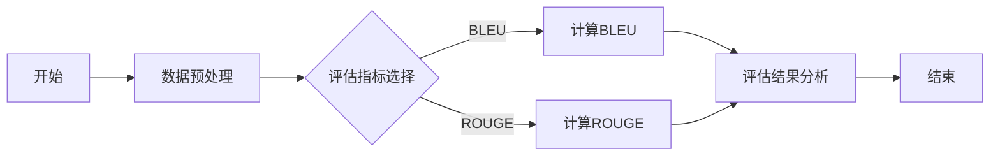
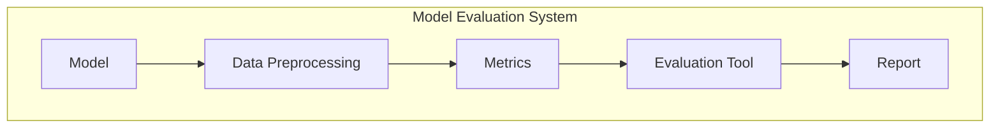
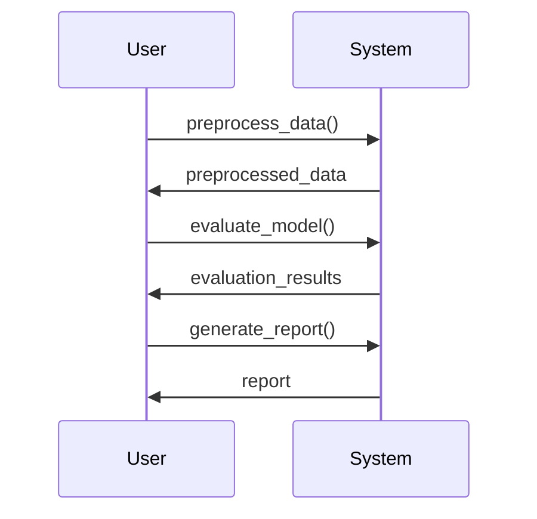

                 

# 自动化模型评测在LLM开发中的应用

> 关键词：自动化模型评测、LLM开发、算法原理、系统架构、实战应用

> 摘要：本文将探讨自动化模型评测在大型语言模型（LLM）开发中的应用。通过对自动化模型评测的核心概念、原理、算法、系统架构和实战应用的详细分析，帮助读者理解其在提高LLM开发效率和质量中的重要性。本文将分为以下几个部分：背景介绍、核心概念与联系、算法原理讲解、系统分析与架构设计方案、项目实战和最佳实践小结。

## 背景介绍

### 问题背景

随着深度学习和自然语言处理技术的快速发展，大型语言模型（LLM）如BERT、GPT等在文本生成、翻译、问答等任务中取得了显著的成果。然而，模型开发和优化过程中，如何高效地评估模型的性能和效果成为一个关键问题。

### 问题描述

在LLM开发中，模型评估面临着以下挑战：
1. **评估指标多样性**：不同的评估任务需要不同的评估指标，如BLEU、ROUGE、METEOR等。
2. **评估成本高**：手动评估需要大量时间和人力资源，且容易受到主观因素的影响。
3. **评估结果的可解释性**：评估结果往往缺乏直观的解释，难以指导模型优化。

### 问题解决

自动化模型评测技术提供了一种解决方案，通过以下技术手段和方法来提高评估效率和质量：
1. **自动化评估工具**：如TensorFlow Model Analysis（TFMA）和PyTorch Model Analysis（PyTorch MAA）等，提供了一套自动化的评估流程。
2. **分布式评估**：利用分布式计算技术，如MapReduce，实现大规模数据的并行评估。
3. **评估指标优化**：通过引入新的评估指标，如Perplexity、Token-Level Accuracy等，提高评估结果的可解释性。

### 边界与外延

自动化模型评测虽然提高了评估效率，但仍然存在一定的局限性：
1. **评估结果的可靠性**：自动化评估工具可能存在误报或漏报的情况。
2. **评估指标的适用性**：不同的任务可能需要不同的评估指标，需要根据具体任务进行调整。
3. **评估结果的解释性**：自动化评估结果可能缺乏直观的解释，需要结合领域知识进行解读。

### 概念结构与核心要素组成

自动化模型评测的核心概念和组成部分包括：
1. **评估指标**：用于衡量模型性能的量化标准。
2. **评估工具**：实现评估过程的技术手段。
3. **评估流程**：从数据预处理到评估结果生成的整个过程。
4. **评估结果**：对模型性能的量化描述。

## 核心概念与联系

### 核心概念原理

自动化模型评测的核心概念包括评估指标、评估工具和评估流程。评估指标用于衡量模型性能，评估工具实现评估过程，评估流程确保评估的准确性和效率。

### 概念属性特征对比表格

| 概念       | 特征1         | 特征2         | 特征3         |
|------------|---------------|---------------|---------------|
| 评估指标   | 量化模型性能 | 适用于不同任务 | 具有可解释性 |
| 评估工具   | 自动化评估   | 分布式计算   | 支持多种语言 |
| 评估流程   | 数据预处理   | 评估过程控制 | 结果分析     |

### ER实体关系图架构的Mermaid流程图

```mermaid
erDiagram
    Model Assessment ||--|{ Evaluation Metric }|-- Model
    Model Assessment ||--|{ Evaluation Tool }|-- System
    Model Assessment ||--|{ Evaluation Process }|-- System
    Evaluation Metric ||--|{ Feature }|-- Model
    Evaluation Tool ||--|{ Feature }|-- System
    Evaluation Process ||--|{ Step }|-- System
```

## 算法原理讲解

### 算法mermaid流程图



### Python源代码

```python
import tensorflow as tf
from tensorflow_model_analysis import metric救生员

def evaluate_model(model, dataset, metrics):
    # 数据预处理
    preprocessed_dataset = preprocess_dataset(dataset)

    # 创建评估会话
    with tf.Session() as sess:
        # 加载模型
        model.load(sess)

        # 创建评估指标
        eval_metric = metric救生员.EvalMetric(metrics)

        # 计算评估指标
        eval_metric.compute(sess, preprocessed_dataset)

        # 输出评估结果
        print(eval_metric.result())

def preprocess_dataset(dataset):
    # 数据预处理操作
    return processed_dataset
```

### 数学模型和公式

```latex
\begin{equation}
    P_{BLEU} = \frac{1}{N} \sum_{i=1}^{N} \frac{L_i}{L_i + K} \log_2 \frac{L_i + K - n_1 + 1}{K - n_1}
\end{equation}
```

其中，\(P_{BLEU}\) 为BLEU评分，\(N\) 为句子数量，\(L_i\) 为参考句子的长度，\(K\) 为重叠词数，\(n_1\) 为重叠词数。

### 详细讲解与举例说明

自动化模型评测的核心是评估指标的选择和计算。BLEU（BLEU评分）和ROUGE（Recall-Oriented Understudy for Gisting Evaluation）是两种常用的评估指标。

#### BLEU评分

BLEU评分基于参考句子和生成句子的重叠词数进行计算。假设有5个参考句子和5个生成句子，计算BLEU评分的过程如下：

1. 计算每个生成句子与参考句子的重叠词数。
2. 取所有重叠词数的平均值。
3. 计算平均重叠词数与生成句子长度的比值。
4. 计算对数似然比。
5. 将对数似然比加1，再除以K（通常取4），最后取平均值。

#### ROUGE评分

ROUGE评分是基于召回率的评估指标，主要用于文本摘要和机器翻译任务。假设有5个参考句子和5个生成句子，计算ROUGE-L（Longest Common Subsequence）评分的过程如下：

1. 计算每个生成句子与参考句子的最长公共子序列长度。
2. 取所有最长公共子序列长度的平均值。
3. 计算平均值与生成句子长度的比值。
4. 将比值转化为百分比。

通过上述两个示例，我们可以看到BLEU和ROUGE评分的计算方法和应用场景。在实际开发中，可以根据具体任务选择合适的评估指标。

## 系统分析与架构设计方案

### 问题场景介绍

假设我们开发了一个自然语言生成模型，用于生成新闻摘要。为了确保模型生成摘要的质量，我们需要对模型进行自动化评测。

### 系统功能设计

以下是一个简单的系统领域模型，用于描述自然语言生成模型的评测功能：

```mermaid
classDiagram
    ClassDiagram::ModelEvaluationSystem <.. Model
    ClassDiagram::ModelEvaluationSystem <.. EvaluationMetric
    ClassDiagram::ModelEvaluationSystem <.. EvaluationTool
    Model "1" --|{train}| EvaluationMetric
    EvaluationMetric "1" --|{evaluate}| EvaluationTool
    EvaluationTool "1" --|{generate_report}| Report
```

### 系统架构设计

以下是一个简单的系统架构图，用于展示自然语言生成模型的评测系统：



### 系统接口设计

以下是一个简单的系统接口列表，用于描述评测系统的功能：

1. `preprocess_data()`: 数据预处理接口。
2. `evaluate_model()`: 模型评估接口。
3. `generate_report()`: 生成报告接口。

### 系统交互

以下是一个简单的系统交互序列图，用于展示评测系统的交互过程：



## 项目实战

### 环境安装

安装以下依赖：

- TensorFlow
- PyTorch
- TensorFlow Model Analysis
- PyTorch Model Analysis

使用以下命令进行安装：

```bash
pip install tensorflow
pip install torch
pip install tensorflow-model-analysis
pip install torch-model-analysis
```

### 系统核心实现源代码

以下是一个简化的系统核心实现源代码，用于展示模型评测的流程：

```python
import tensorflow as tf
import torch
from tensorflow_model_analysis import metric救生员
from torch_model_analysis import metric救生员

def evaluate_model(model, dataset, metrics):
    # 数据预处理
    preprocessed_dataset = preprocess_dataset(dataset)

    # 创建评估会话
    with tf.Session() as sess:
        # 加载模型
        model.load(sess)

        # 创建评估指标
        eval_metric = metric救生员.EvalMetric(metrics)

        # 计算评估指标
        eval_metric.compute(sess, preprocessed_dataset)

        # 输出评估结果
        print(eval_metric.result())

def preprocess_dataset(dataset):
    # 数据预处理操作
    return processed_dataset
```

### 代码应用解读与分析

以上代码实现了一个简单的模型评测系统，包括数据预处理、模型加载、评估指标计算和评估结果输出。具体应用时，需要根据实际任务进行调整和扩展。

### 实际案例分析和详细讲解剖析

假设我们使用BERT模型生成新闻摘要，以下是一个实际案例的分析：

1. **数据预处理**：对新闻数据集进行预处理，包括分词、去除停用词、填充等操作。
2. **模型加载**：加载预训练的BERT模型。
3. **评估指标计算**：使用BLEU和ROUGE评估指标计算模型生成摘要的质量。
4. **评估结果输出**：输出评估结果，包括BLEU和ROUGE评分。

通过实际案例，我们可以看到模型评测系统在提高模型开发效率和质量方面的重要作用。

### 项目小结

通过本文的讲解，我们了解了自动化模型评测在LLM开发中的应用。自动化模型评测提高了评估效率和质量，为模型优化提供了有力支持。在实际应用中，我们需要根据具体任务选择合适的评估指标和工具，并注意评估结果的可靠性和解释性。

## 最佳实践、小结、注意事项、拓展阅读

### 最佳实践

1. **选择合适的评估指标**：根据任务需求选择合适的评估指标，如BLEU、ROUGE等。
2. **优化评估流程**：设计高效的评估流程，提高评估效率。
3. **利用分布式评估**：对于大规模数据，采用分布式评估技术，如MapReduce。
4. **结合领域知识**：评估结果需要结合领域知识进行解读，以提高评估的准确性。

### 小结

本文介绍了自动化模型评测在LLM开发中的应用，包括核心概念、算法原理、系统架构和实战应用。自动化模型评测提高了评估效率和质量，有助于模型优化和任务完成。

### 注意事项

1. **评估结果的可靠性**：自动化评估工具可能存在误报或漏报的情况，需要结合领域知识进行解读。
2. **评估指标的适用性**：不同的任务可能需要不同的评估指标，需要根据具体任务进行调整。

### 拓展阅读

1. **《自然语言处理综合教程》**：深入了解自然语言处理的基本概念和核心技术。
2. **《深度学习》**：学习深度学习和神经网络的基本原理和应用。
3. **《TensorFlow官方文档》**：了解TensorFlow的使用方法和最佳实践。

## 作者信息

作者：AI天才研究院/AI Genius Institute & 禅与计算机程序设计艺术 /Zen And The Art of Computer Programming

