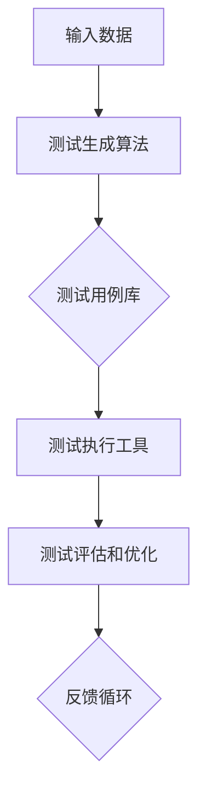
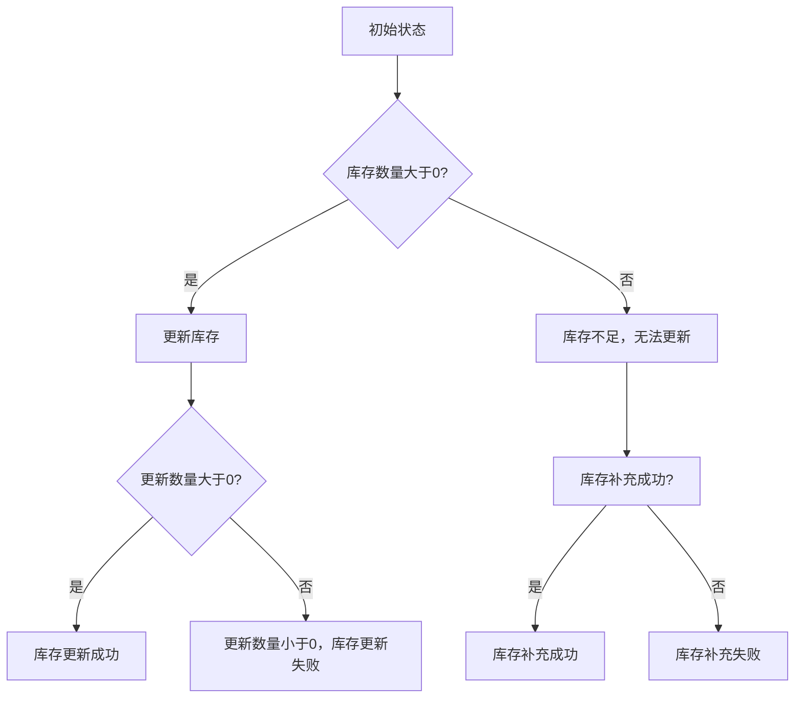
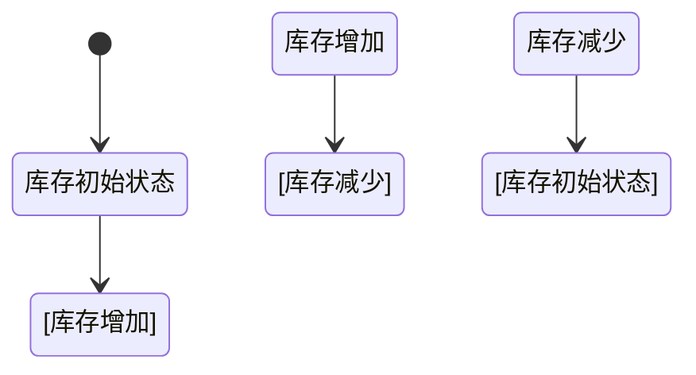
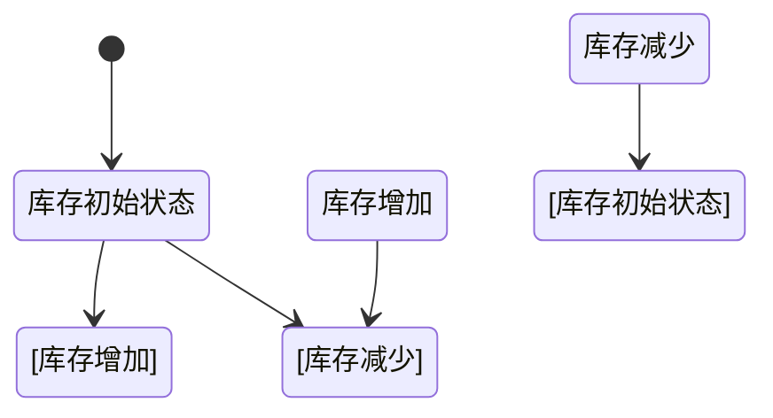
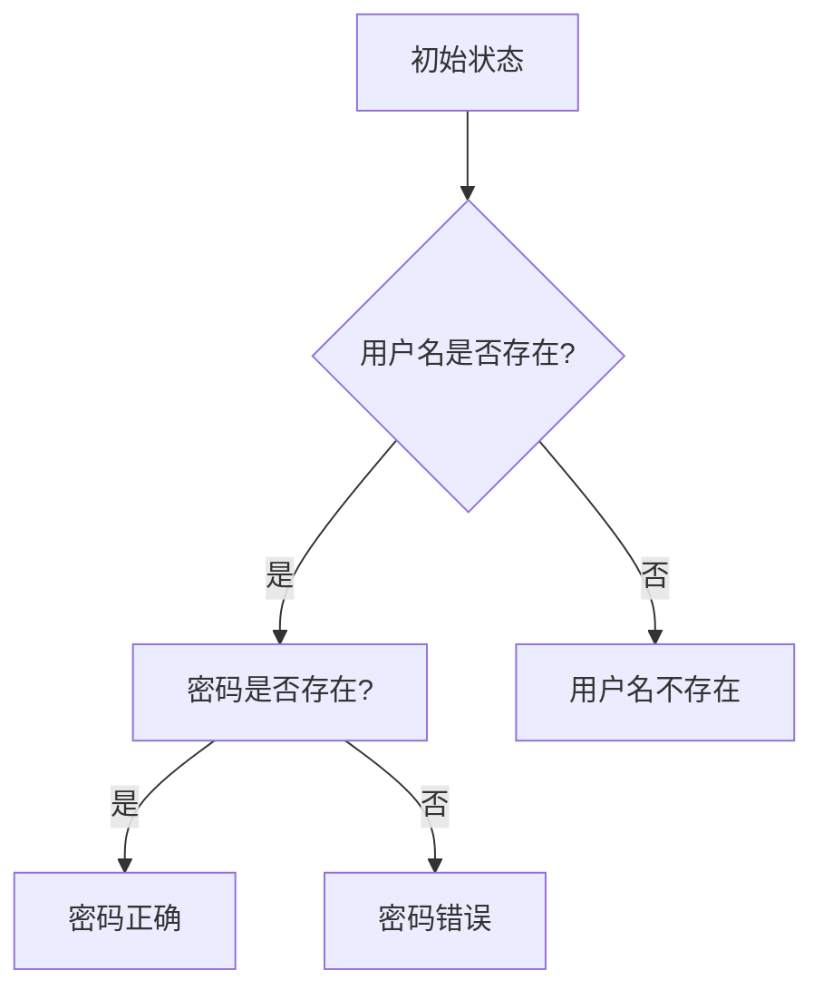
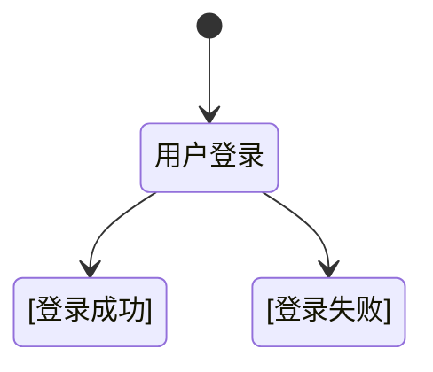
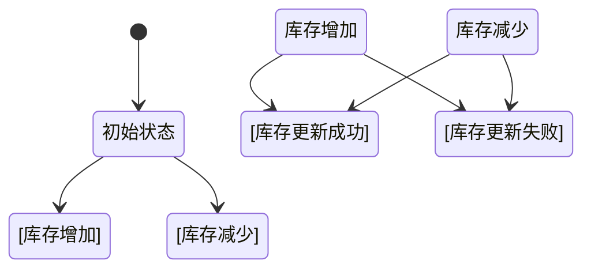
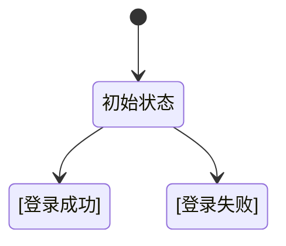

                 


---

# 第二部分：自动化测试用例生成技术概述

## 2.1 自动化测试用例生成的重要性

### 2.1.1 自动化测试用例生成的定义与作用

自动化测试用例生成（Automated Test Case Generation）是指利用特定的工具、技术和方法，自动地从软件需求、设计、代码等不同层面提取或构造测试用例。这个过程对于提升软件测试的效率和质量具有重要意义。

首先，自动化测试用例生成可以显著提高测试效率。传统的测试用例编写通常需要大量的手工工作，而自动化生成技术能够减少这一环节的人力投入，使得测试人员可以将更多精力投入到更复杂和高价值的测试任务中。

其次，自动化测试用例生成有助于提升测试质量。通过使用先进的技术和算法，可以生成更为全面和合理的测试用例集，从而更有效地发现潜在的问题和缺陷。

### 2.1.2 自动化测试用例生成在软件开发生命周期中的位置

自动化测试用例生成在软件开发生命周期中扮演着关键角色。它不仅适用于软件开发的早期阶段，如需求分析和设计阶段，也可以在开发完成后用于验证和确认软件的功能和性能。具体来说：

- **需求分析阶段**：通过自动化测试用例生成，可以快速验证需求文档中的功能点和业务逻辑是否正确。
- **设计阶段**：自动化生成测试用例可以帮助评估设计方案的完整性和可行性。
- **开发阶段**：自动化测试用例生成可以与持续集成（CI）和持续部署（CD）相结合，确保代码变更后立即进行测试。
- **测试阶段**：自动化测试用例生成可以大规模提高测试覆盖率，提升测试效率。

### 2.1.3 自动化测试用例生成面临的挑战与机遇

尽管自动化测试用例生成带来了许多好处，但同时也面临着一系列挑战：

- **复杂性**：现代软件系统越来越复杂，自动化测试用例生成的难度也随之增加。
- **数据质量**：生成高质量的测试用例依赖于准确和全面的数据，但数据质量往往难以保证。
- **测试用例质量**：自动化生成的测试用例需要经过严格的评估，以确保其有效性和可靠性。
- **技术门槛**：自动化测试用例生成技术需要专业的知识和技能，这对团队的技术能力提出了较高要求。

然而，随着人工智能、机器学习、自然语言处理等新技术的快速发展，自动化测试用例生成领域也迎来了新的机遇。例如，利用机器学习算法可以更智能地生成测试用例，从而提高测试效率和效果。

## 2.2 自动化测试用例生成的基本原理

### 2.2.1 自动化测试用例生成的方法分类

自动化测试用例生成的方法可以大致分为三类：基于规则的方法、基于模型的方法和基于数据的方法。

#### 基于规则的方法

基于规则的方法是自动化测试用例生成中最传统的方法之一。它依赖于预定义的规则和模式，通过这些规则来自动生成测试用例。

**优点**：
- **简单易用**：基于规则的方法通常较为直观，易于理解和实现。
- **快速响应**：规则一旦定义好，可以迅速生成测试用例。

**缺点**：
- **灵活性差**：规则难以覆盖所有可能的测试情况。
- **维护成本高**：随着软件系统复杂度的增加，规则的维护和更新变得困难。

#### 基于模型的方法

基于模型的方法使用各种模型（如语法模型、语义模型、状态转换模型等）来生成测试用例。这种方法通常利用机器学习和自然语言处理等技术。

**优点**：
- **智能生成**：基于模型的方法可以根据系统的特点智能地生成测试用例。
- **适应性**：模型可以适应不同类型和复杂度的软件系统。

**缺点**：
- **技术门槛高**：需要专业的知识和技能来构建和维护模型。
- **训练时间较长**：模型的训练通常需要大量数据和计算资源。

#### 基于数据的方法

基于数据的方法利用现有的测试数据、代码、文档等数据源，通过数据分析、模式识别等技术来自动生成测试用例。

**优点**：
- **高效利用现有数据**：基于数据的方法可以直接利用现有的数据资源。
- **可扩展性强**：适用于大规模的软件系统。

**缺点**：
- **数据质量要求高**：生成高质量的测试用例依赖于高质量的数据。
- **数据处理复杂**：需要处理大量的数据，算法复杂度较高。

### 2.2.2 自动化测试用例生成的基本流程

自动化测试用例生成通常包括以下几个基本步骤：

1. **输入收集**：收集与软件系统相关的各种输入，如需求文档、设计文档、代码、历史测试用例等。
2. **预处理**：对收集到的输入数据进行处理，如格式化、清洗、标准化等，以便于后续分析。
3. **分析**：利用分析算法对预处理后的输入数据进行处理，提取关键信息，构建测试用例。
4. **生成**：根据分析结果和预设的规则或模型，自动生成测试用例。
5. **评估**：对生成的测试用例进行评估，确保其有效性和可靠性。
6. **优化**：根据评估结果对生成过程进行调整和优化。

### 2.2.3 自动化测试用例生成技术的应用领域

自动化测试用例生成技术广泛应用于各种软件系统，尤其是大型、复杂和高度集成的系统。以下是一些典型的应用领域：

- **Web 应用**：自动化测试用例生成可以用于生成Web应用的UI测试用例，验证界面交互和功能实现。
- **移动应用**：移动应用测试通常涉及多种设备和操作系统，自动化测试用例生成可以大大提高测试效率。
- **嵌入式系统**：嵌入式系统测试用例生成需要考虑硬件环境和特定场景，自动化技术能够提高测试的全面性和准确性。
- **大数据处理**：大数据处理系统通常包含复杂的业务逻辑和数据流，自动化测试用例生成有助于验证系统的稳定性和性能。

## 2.3 自动化测试用例生成技术的挑战与机遇

### 2.3.1 自动化测试用例生成技术面临的挑战

尽管自动化测试用例生成技术具有许多优势，但其在实际应用中仍然面临一些挑战：

1. **数据质量**：自动化测试用例生成依赖于高质量的数据。然而，现实中的数据往往存在噪声、缺失和不一致性，这会影响测试用例的生成质量。

2. **测试用例质量**：生成的测试用例需要经过严格的评估，以确保其能够有效地发现软件缺陷。然而，如何确保测试用例的质量仍然是一个难题。

3. **技术门槛**：自动化测试用例生成需要掌握多种技术和方法，如机器学习、自然语言处理、模式识别等。这对团队的技术能力和知识水平提出了较高要求。

4. **维护成本**：自动化测试用例生成系统需要定期更新和维护，以适应软件系统的变化。这增加了维护成本和复杂性。

### 2.3.2 自动化测试用例生成技术的机遇

尽管面临挑战，自动化测试用例生成技术也具有巨大的发展潜力：

1. **新技术的发展**：随着人工智能、机器学习、自然语言处理等新技术的快速发展，自动化测试用例生成技术将变得更加智能和高效。

2. **市场需求**：随着软件系统的复杂性和规模不断扩大，对高效、高质量的测试需求日益增长，自动化测试用例生成技术将得到更广泛的应用。

3. **技术融合**：自动化测试用例生成技术可以与其他先进技术（如DevOps、AI测试等）相结合，形成更强大的测试解决方案。

### 2.3.3 未来发展趋势

展望未来，自动化测试用例生成技术将朝着更加智能化、自动化和高效化的方向发展：

1. **智能化**：利用机器学习和自然语言处理技术，实现更加智能的测试用例生成。

2. **自动化**：将自动化测试用例生成集成到持续集成和持续部署流程中，实现全自动化测试。

3. **高效化**：通过优化算法和数据处理技术，提高测试用例生成的效率和效果。

4. **个性化**：根据不同项目的需求和特点，定制化的生成测试用例，提高测试的针对性和效果。

## 2.4 本章小结

本章对自动化测试用例生成技术进行了全面的概述。我们首先介绍了自动化测试用例生成的重要性，以及其在软件开发生命周期中的位置。接着，详细分析了自动化测试用例生成的基本原理和方法分类，包括基于规则的方法、基于模型的方法和基于数据的方法。然后，我们探讨了自动化测试用例生成技术面临的挑战和机遇，以及未来发展的趋势。

自动化测试用例生成技术不仅是提高软件测试效率和质量的利器，也是应对软件系统复杂性、降低测试成本的重要手段。随着新技术的不断涌现，自动化测试用例生成技术将在软件工程领域发挥越来越重要的作用。

### 1.6 自动化测试用例生成技术概述

### 1.6.1 自动化测试用例生成技术的定义和重要性

自动化测试用例生成技术指的是通过自动化工具和算法，从软件系统的需求、设计、源代码等不同层次中提取或构建测试用例的方法。这项技术的核心在于提高软件测试的效率和准确性，减轻测试人员的工作负担，同时确保软件质量。

自动化测试用例生成的重要性主要体现在以下几个方面：

1. **提高测试效率**：自动化测试用例生成可以显著减少手工编写测试用例的时间，提高测试执行的效率。
2. **提升测试质量**：通过自动化生成测试用例，可以更全面地覆盖软件的功能和性能，提高测试覆盖率。
3. **降低成本**：自动化测试用例生成减少了人工编写测试用例的需求，从而降低了测试成本。
4. **支持持续集成和持续交付**：自动化测试用例生成技术能够很好地与持续集成（CI）和持续交付（CD）流程集成，加速软件开发和部署。

### 1.6.2 自动化测试用例生成的发展历程

自动化测试用例生成技术的发展历程可以追溯到20世纪80年代。起初，自动化测试主要依赖于手动编写脚本，这种做法效率较低且容易出错。随着计算机技术的发展，特别是近年来人工智能和机器学习技术的兴起，自动化测试用例生成技术得到了快速发展。

1. **早期方法**：早期的自动化测试主要依赖于手动编写脚本，测试用例的生成主要依赖于手工记录的测试步骤和条件。
2. **基于规则的自动化**：20世纪90年代，基于规则的自动化测试用例生成方法开始出现，这种方法依赖于预定义的规则和模式来生成测试用例。
3. **基于模型的自动化**：随着模型驱动开发（MDD）和模型驱动测试（MDT）的兴起，基于模型的自动化测试用例生成方法逐渐成为主流。这种方法利用模型来描述软件系统的行为和状态，从而生成测试用例。
4. **基于数据的自动化**：近年来，基于数据的自动化测试用例生成方法得到了广泛研究。这种方法利用大数据分析和模式识别技术，从历史测试数据、用户行为数据等中提取测试用例。
5. **结合方法**：随着人工智能技术的发展，各种自动化测试用例生成方法开始相互融合，形成了更加智能和高效的测试用例生成技术。

### 1.6.3 自动化测试用例生成技术的应用领域

自动化测试用例生成技术广泛应用于各种软件系统，尤其是在复杂和高风险的系统中。以下是一些典型的应用领域：

1. **Web应用**：自动化测试用例生成可以用于Web应用的UI测试、API测试和功能测试，确保网站的功能和性能满足用户需求。
2. **移动应用**：移动应用测试通常涉及多个平台和设备，自动化测试用例生成可以节省时间和资源，提高测试覆盖率。
3. **嵌入式系统**：嵌入式系统测试需要考虑硬件环境和特定场景，自动化测试用例生成可以提高测试的全面性和准确性。
4. **大数据处理**：大数据处理系统通常包含复杂的业务逻辑和数据流，自动化测试用例生成有助于验证系统的稳定性和性能。
5. **金融系统**：金融系统的测试需要确保交易安全和数据准确性，自动化测试用例生成可以提高测试效率，确保系统的稳定性。

### 1.6.4 自动化测试用例生成技术的优势和挑战

**优势**：

- **效率提升**：自动化测试用例生成可以显著减少测试用例的编写时间，提高测试执行的速度。
- **测试覆盖**：自动化测试用例生成可以更全面地覆盖软件的功能和性能，提高测试覆盖率。
- **成本降低**：自动化测试用例生成减少了人工编写测试用例的需求，从而降低了测试成本。
- **持续集成**：自动化测试用例生成与持续集成和持续交付流程相结合，可以加快软件交付的速度。

**挑战**：

- **数据质量**：自动化测试用例生成依赖于高质量的数据，但现实中的数据往往存在噪声、缺失和不一致性。
- **技术门槛**：自动化测试用例生成需要掌握多种技术和方法，如机器学习、自然语言处理等，这对团队的技术能力提出了较高要求。
- **测试用例质量**：生成的测试用例需要经过严格的评估，以确保其有效性和可靠性。
- **维护成本**：自动化测试用例生成系统需要定期更新和维护，以适应软件系统的变化。

### 1.6.5 自动化测试用例生成技术的未来趋势

随着人工智能、机器学习、自然语言处理等新技术的快速发展，自动化测试用例生成技术将朝着更加智能化、自动化和高效化的方向发展。未来，自动化测试用例生成技术可能会呈现以下趋势：

- **智能化**：利用机器学习和自然语言处理技术，实现更加智能的测试用例生成。
- **自动化**：将自动化测试用例生成集成到持续集成和持续交付流程中，实现全自动化测试。
- **高效化**：通过优化算法和数据处理技术，提高测试用例生成的效率和效果。
- **个性化**：根据不同项目的需求和特点，定制化的生成测试用例，提高测试的针对性和效果。

总之，自动化测试用例生成技术不仅是提高软件测试效率和质量的利器，也是应对软件系统复杂性、降低测试成本的重要手段。随着新技术的不断涌现，自动化测试用例生成技术将在软件工程领域发挥越来越重要的作用。

---

**关键词**：自动化测试用例生成、测试效率、测试质量、持续集成、机器学习、自然语言处理

**摘要**：

本文全面概述了自动化测试用例生成技术，探讨了其定义、重要性、发展历程、应用领域、优势和挑战，以及未来趋势。自动化测试用例生成通过自动化工具和算法，从软件系统的不同层次中提取或构建测试用例，显著提高了测试效率和质量，降低了成本。尽管面临数据质量、技术门槛等挑战，自动化测试用例生成技术凭借其高效性、智能性和适应性，正日益成为软件工程领域的核心工具。随着新技术的不断发展，自动化测试用例生成技术将变得更加智能化、自动化和高效化。

### 1.7 自动化测试用例生成的基本原理

### 1.7.1 基本概念

自动化测试用例生成（Automated Test Case Generation）的核心在于通过自动化工具和算法，从软件系统的需求、设计、源代码等不同层次中提取或构建测试用例。这个过程不仅涉及技术层面的实现，还需要理解和分析软件系统的需求、行为和结构。以下是自动化测试用例生成中的一些基本概念：

- **测试用例**：测试用例（Test Case）是一组定义明确的输入数据、执行条件、期望结果和操作步骤，用于验证软件系统的某个特定功能或行为。
- **测试覆盖率**：测试覆盖率（Test Coverage）是指测试用例对代码的覆盖程度，常见的覆盖率指标包括语句覆盖率、分支覆盖率、函数覆盖率等。
- **测试生成算法**：测试生成算法是指用于从输入数据中生成测试用例的算法，这些算法可以是基于规则的、基于模型的或基于数据的。
- **自动化测试工具**：自动化测试工具是用于执行测试用例、记录结果和报告缺陷的软件，常见的自动化测试工具包括Selenium、JUnit、TestNG等。

### 1.7.2 问题背景

在传统的软件开发生命周期中，测试用例的编写是一个耗时且容易出错的过程。测试人员需要仔细阅读需求文档、设计文档和源代码，然后手工编写测试用例。这种方法存在以下问题：

1. **低效率**：手工编写测试用例需要大量时间和精力，特别是在大型和复杂的软件系统中。
2. **易出错**：手工编写的测试用例可能遗漏某些关键场景，或者编写错误的测试步骤，导致测试不全面或无效。
3. **维护困难**：随着软件系统的变更，手工编写的测试用例需要频繁更新和调整，维护成本高。
4. **测试覆盖不足**：手工编写的测试用例很难达到高测试覆盖率，可能无法完全覆盖软件的所有功能和行为。

为了解决上述问题，自动化测试用例生成技术应运而生。自动化测试用例生成通过自动化工具和算法，从软件系统的不同层次中提取或构建测试用例，大大提高了测试效率和质量。

### 1.7.3 问题定义

自动化测试用例生成的问题可以定义为：如何在给定输入（如需求文档、设计文档、源代码等）的条件下，利用自动化工具和算法，生成一组有效的测试用例，确保这些测试用例能够全面覆盖软件系统的功能和行为，并具有良好的可维护性和可扩展性。

这个问题可以分为以下几个子问题：

1. **输入数据预处理**：如何从各种输入数据中提取有用的信息，如功能点、业务逻辑和关键路径。
2. **测试用例生成算法**：如何设计有效的测试用例生成算法，以从输入数据中生成测试用例。
3. **测试用例评估**：如何评估生成的测试用例的有效性和可靠性，确保其能够发现潜在的软件缺陷。
4. **测试用例优化**：如何优化生成的测试用例，提高测试覆盖率，减少冗余和重复。

### 1.7.4 问题解决

解决自动化测试用例生成问题的方法主要包括以下几种：

1. **基于规则的自动化测试用例生成**：这种方法依赖于预定义的规则和模式，通过这些规则来自动生成测试用例。规则可以是简单的条件判断，也可以是复杂的逻辑组合。基于规则的自动化测试用例生成方法简单直观，易于实现和维护，但灵活性较差，难以覆盖所有可能的测试场景。

2. **基于模型的自动化测试用例生成**：这种方法利用模型（如状态转换模型、语法模型、语义模型等）来描述软件系统的行为和状态，然后根据模型生成测试用例。基于模型的自动化测试用例生成方法具有更高的灵活性和适应性，可以生成更复杂的测试用例，但需要较高的技术门槛和计算资源。

3. **基于数据的自动化测试用例生成**：这种方法利用大数据分析和模式识别技术，从历史测试数据、用户行为数据等中提取测试用例。基于数据的自动化测试用例生成方法可以充分利用现有数据资源，但数据质量对生成效果有很大影响。

4. **多方法结合的自动化测试用例生成**：这种方法将基于规则、基于模型和基于数据的方法相结合，综合利用不同方法的优点，生成更全面、更有效的测试用例。多方法结合的自动化测试用例生成方法可以显著提高测试效率和测试覆盖率，但需要更复杂的实现和维护。

### 1.7.5 边界与外延

在自动化测试用例生成的过程中，有一些边界条件和外延问题需要考虑：

1. **边界条件**：边界条件是指测试用例可能出现的极端情况或异常情况，如输入数据的边界值、系统的极限负载等。自动化测试用例生成需要考虑这些边界条件，生成相应的测试用例，以确保软件系统在极端情况下也能正常运行。

2. **外延**：外延是指测试用例的扩展性和适应性。自动化测试用例生成不仅要生成当前需求下的测试用例，还需要考虑未来的需求变更和系统扩展。这要求生成的测试用例具有良好的可维护性和可扩展性，能够适应系统的变化。

### 1.7.6 概念结构与核心要素组成

自动化测试用例生成的概念结构可以拆分为以下几个核心要素：

1. **输入数据**：包括需求文档、设计文档、源代码、历史测试数据等。
2. **测试生成算法**：包括基于规则、基于模型、基于数据等多种算法。
3. **测试用例库**：存储生成的测试用例，包括测试用例的输入、预期结果和执行步骤。
4. **测试执行工具**：用于执行测试用例并记录结果的自动化测试工具。
5. **测试评估和优化**：对生成的测试用例进行评估和优化，以提高测试覆盖率和效果。

这些要素相互作用，共同构成了自动化测试用例生成的完整流程，如图1所示。



### 1.7.7 总结

自动化测试用例生成技术通过自动化工具和算法，从软件系统的不同层次中提取或构建测试用例，提高了测试效率和测试质量。本文介绍了自动化测试用例生成的基本原理，包括基本概念、问题背景、问题定义、问题解决方法以及边界与外延等。自动化测试用例生成不仅有助于提高测试效率和质量，还能够减轻测试人员的负担，促进软件工程的发展。随着新技术的不断进步，自动化测试用例生成技术将变得更加智能化、高效化和多样化。

### 1.8 自动化测试用例生成的方法与工具

### 1.8.1 基于规则的方法

#### 1.8.1.1 基本原理

基于规则的方法（Rule-Based Method）是自动化测试用例生成中最早被采用的一种方法。它依赖于一组预定义的规则和模式，通过这些规则来自动生成测试用例。这些规则通常由测试人员或开发人员根据对软件系统的理解和经验来定义。

**原理说明**：

- **规则定义**：测试人员首先需要定义一系列规则，这些规则描述了软件系统的预期行为或测试场景。例如，如果输入数据超出某个范围，则系统应该抛出特定类型的异常。
- **规则匹配**：当系统执行某个操作时，自动化测试工具会根据定义的规则来检查当前的状态和行为是否符合预期。如果匹配成功，则生成一个测试用例。
- **测试用例生成**：基于匹配的规则，系统会生成相应的测试用例，包括输入数据、执行步骤和期望结果。

**示例**：

假设我们要测试一个电商网站的购物车功能，可以定义以下规则：

1. 添加商品时，库存数量必须大于0。
2. 删除商品时，购物车中必须存在该商品。
3. 提交订单时，购物车中必须有至少一个商品。

当用户执行添加、删除和提交订单操作时，自动化测试工具会根据这些规则来生成测试用例。

**优点**：

- **简单易用**：基于规则的自动化测试用例生成方法直观易懂，不需要复杂的编程技能。
- **快速响应**：一旦规则定义完成，可以迅速生成测试用例。

**缺点**：

- **灵活性不足**：基于规则的自动化测试用例生成方法难以覆盖所有可能的测试场景，特别是对于复杂的业务逻辑和动态变化的系统。
- **维护成本高**：随着软件系统的复杂度增加，规则的数量和复杂性也随之增加，导致维护成本高。

#### 1.8.1.2 常见的规则生成技术

- **条件规则**：条件规则是最简单的规则类型，基于条件表达式来定义。例如，如果A且B，则C。
- **组合规则**：组合规则将多个条件规则组合在一起，形成更为复杂的规则。例如，如果A或B，则C。
- **决策树**：决策树是一种图形化表示规则的方法，通过一系列条件判断来生成测试用例。
- **状态机**：状态机是基于状态转换的规则，描述了系统在不同状态下的行为和转换条件。

**决策树示例**：

假设我们要测试一个库存管理系统的库存更新功能，可以使用决策树来定义规则：



**状态机示例**：



#### 1.8.1.3 规则生成方法的优缺点分析

**优点**：

- **直观性**：规则生成方法通过预定义的规则和模式来生成测试用例，易于理解和维护。
- **快速开发**：一旦规则定义完成，可以迅速生成测试用例，实现快速测试。
- **适用于简单系统**：对于逻辑相对简单的系统，规则生成方法可以有效地生成测试用例。

**缺点**：

- **覆盖不足**：难以覆盖所有可能的测试场景，特别是在复杂系统中。
- **维护成本高**：随着系统的复杂度增加，规则的维护和更新变得困难。
- **适应性差**：对于业务逻辑变化频繁的系统，规则生成方法的适应性较差。

### 1.8.2 基于模型的方法

#### 1.8.2.1 基本原理

基于模型的方法（Model-Based Method）利用模型来描述软件系统的行为和结构，然后根据模型生成测试用例。这种方法通常依赖于模型驱动开发（Model-Driven Development, MDD）和模型驱动测试（Model-Driven Testing, MDT）的理念。

**原理说明**：

- **模型构建**：测试人员或开发人员首先需要构建一个描述软件系统行为的模型。这个模型可以是状态机、语法模型、语义模型等。
- **测试用例生成**：基于构建的模型，自动化测试工具可以自动生成相应的测试用例。这些测试用例不仅包括功能测试，还可以包括性能测试、边界测试等。
- **模型驱动测试**：模型不仅用于生成测试用例，还可以用于测试执行和结果分析，实现端到端的自动化测试流程。

**示例**：

假设我们要测试一个库存管理系统的库存更新功能，可以使用状态机模型来描述：


根据这个状态机模型，可以生成以下测试用例：

1. 库存初始状态到库存增加。
2. 库存初始状态到库存减少。
3. 库存增加状态到库存初始状态。
4. 库存减少状态到库存初始状态。

**优点**：

- **灵活性**：基于模型的方法可以生成各种类型的测试用例，不仅限于功能测试，还可以包括性能测试、边界测试等。
- **适应性**：模型可以方便地更新和扩展，以适应系统的变化。
- **可维护性**：模型驱动测试用例生成方法具有较高的可维护性，模型的变更可以自动反映到测试用例中。

**缺点**：

- **技术门槛**：构建和维护模型需要较高的技术技能，特别是对于复杂的软件系统。
- **计算资源**：模型驱动测试用例生成可能需要大量的计算资源和时间，特别是在大规模的软件系统中。
- **依赖性**：模型驱动测试用例生成依赖于模型的准确性，模型的错误会导致测试用例的错误。

#### 1.8.2.2 常见的模型生成技术

- **状态机模型**：状态机模型是一种描述系统状态的变迁和转换的图形化方法，适用于许多应用场景。
- **Petri网**：Petri网是一种图形化表示系统中并发性和同步性的方法，可以用于复杂的分布式系统。
- **UML模型**：统一建模语言（UML）提供了一系列图形化工具，可以描述软件系统的结构、行为和交互。

**状态机模型示例**：



**Petri网示例**：

```mermaid
PetriNet
[库存] --> [库存增加] --> [库存减少]
[库存初始状态] --> [库存]
```

**UML类图示例**：

```mermaid
classDiagram
类A <|-- 类B
类C <<|-- 类D
类E [*]-- 类F
```

### 1.8.3 基于数据的方法

#### 1.8.3.1 基本原理

基于数据的方法（Data-Based Method）利用现有数据（如需求文档、源代码、历史测试数据等）来生成测试用例。这种方法通常依赖于数据分析和模式识别技术。

**原理说明**：

- **数据收集**：首先收集与软件系统相关的数据，如源代码、历史测试数据、用户行为数据等。
- **数据预处理**：对收集到的数据进行分析和预处理，如数据清洗、数据标准化等，以便于后续分析。
- **模式识别**：利用数据分析和模式识别技术，从预处理后的数据中提取关键信息，生成测试用例。
- **测试用例生成**：根据提取的信息和预设的规则，自动生成测试用例。

**示例**：

假设我们要测试一个电商网站的用户登录功能，可以使用基于数据的方法来生成测试用例：

1. 收集用户行为数据，如用户名、密码、登录成功/失败记录等。
2. 对用户行为数据进行预处理，提取用户名、密码等关键信息。
3. 利用模式识别技术，根据登录成功/失败的记录，生成有效的测试用例，如有效用户名和密码、无效用户名、无效密码等。

**优点**：

- **高效利用现有数据**：基于数据的方法可以充分利用现有的数据资源，提高测试效率。
- **适应性强**：可以自动适应不同的数据和业务场景。
- **测试覆盖全面**：通过分析历史数据，可以更全面地覆盖软件系统的功能和性能。

**缺点**：

- **数据质量要求高**：生成高质量的测试用例依赖于高质量的数据，但现实中的数据往往存在噪声和缺失。
- **算法复杂度高**：数据分析和模式识别技术复杂，需要较高的计算资源和时间。

#### 1.8.3.2 常见的数据生成技术

- **统计分析**：通过统计分析方法，对历史测试数据进行统计分析，提取关键信息，生成测试用例。
- **机器学习**：利用机器学习方法，如决策树、神经网络等，从数据中自动学习并生成测试用例。
- **模式识别**：利用模式识别技术，如关联规则学习、聚类分析等，从数据中提取模式和规律，生成测试用例。

### 1.8.4 多方法结合的自动化测试用例生成技术

#### 1.8.4.1 基本原理

多方法结合的自动化测试用例生成技术（Combination-Based Method）是将基于规则、基于模型和基于数据的方法相结合，综合利用各种方法的优点，生成更全面、更有效的测试用例。

**原理说明**：

- **方法选择**：根据软件系统的特点和测试需求，选择合适的生成方法。
- **方法组合**：将不同的方法组合在一起，相互补充，生成综合性的测试用例。
- **综合评估**：对生成的测试用例进行综合评估，确保其有效性和可靠性。

**示例**：

假设我们要测试一个复杂的电子商务系统，可以采用以下方法组合：

1. **基于规则的自动化测试用例生成**：用于生成一些基础和常见的测试用例，如用户注册、登录等。
2. **基于模型的自动化测试用例生成**：利用状态机模型和Petri网模型，生成复杂的业务逻辑和并发测试用例。
3. **基于数据的自动化测试用例生成**：利用用户行为数据和交易数据，生成性能测试和边界测试用例。

**优点**：

- **全面覆盖**：通过多种方法的结合，可以更全面地覆盖软件系统的功能和性能。
- **提高效率**：不同方法的优势互补，可以显著提高测试效率。
- **增强可靠性**：多方法结合可以相互验证，提高测试用例的可靠性。

**缺点**：

- **实现复杂**：多方法结合的实现和维护相对复杂，需要协调不同方法之间的接口和集成。
- **资源消耗**：多种方法的结合可能需要更多的计算资源和时间。

### 1.8.5 总结

自动化测试用例生成技术包括基于规则、基于模型和基于数据的方法，以及多方法结合的自动化测试用例生成技术。每种方法都有其优点和缺点，适用于不同的测试场景和需求。基于规则的方法简单直观，适用于简单系统；基于模型的方法灵活性强，适用于复杂系统；基于数据的方法高效利用现有数据，适用于数据丰富的场景。多方法结合的方法可以综合利用各种方法的优点，生成更全面、更有效的测试用例。随着新技术的不断发展，自动化测试用例生成技术将变得更加智能化、高效化和多样化。

---

**关键词**：自动化测试用例生成、规则生成、模型驱动测试、数据驱动测试、多方法结合

**摘要**：

本文详细介绍了自动化测试用例生成的三种方法：基于规则、基于模型和基于数据的方法，以及多方法结合的自动化测试用例生成技术。每种方法都有其特点和适用场景，通过结合多种方法，可以生成更全面、更有效的测试用例，提高测试效率和测试质量。自动化测试用例生成技术是软件工程中的重要工具，随着新技术的不断发展，其在软件测试领域的应用将越来越广泛。

---

**作者**：

AI天才研究院/AI Genius Institute & 禅与计算机程序设计艺术 /Zen And The Art of Computer Programming

### 1.9 基于规则的方法

#### 1.9.1 基于规则的自动化测试用例生成流程

基于规则的自动化测试用例生成方法（Rule-Based Test Case Generation）是一种通过预定义的规则和模式来自动生成测试用例的技术。该方法的核心在于规则库的构建和应用，通过这些规则对软件系统的行为和功能进行建模，从而生成测试用例。

**基本流程**：

1. **需求分析**：首先，对软件系统的需求进行详细分析，明确系统的功能模块、关键场景和测试需求。
2. **规则库构建**：基于需求分析的结果，构建规则库。规则库中的规则可以是简单的条件表达式，也可以是复杂的逻辑组合。这些规则描述了系统的预期行为和异常情况。
3. **规则应用**：在测试过程中，将实际输入与规则库中的规则进行匹配。如果输入满足某个规则，则生成相应的测试用例。
4. **测试用例生成**：根据匹配的结果，自动生成测试用例。测试用例通常包括输入数据、执行步骤和预期结果。
5. **测试执行**：执行生成的测试用例，记录测试结果，并与预期结果进行对比。
6. **测试结果分析**：对测试结果进行分析，评估测试用例的有效性，识别潜在的缺陷。

**流程示例**：

以一个简单的在线购物系统为例，我们定义以下规则：

- 规则1：当用户添加商品到购物车时，购物车中商品数量不能为负。
- 规则2：当用户提交订单时，订单金额必须大于0。
- 规则3：当用户删除商品时，购物车中必须存在该商品。

根据这些规则，我们可以在用户操作时自动生成相应的测试用例：

1. 添加商品到购物车，输入商品数量为-1。
2. 提交订单，输入订单金额为0。
3. 删除商品，输入商品ID不存在于购物车。

#### 1.9.2 常见的规则生成技术

基于规则的自动化测试用例生成技术依赖于规则库的构建。以下是一些常见的规则生成技术：

1. **条件规则**：条件规则是最基础的规则类型，通过简单的条件判断来生成测试用例。例如，“如果用户输入的用户名为空，则测试用例为用户名为空”。

2. **组合规则**：组合规则将多个条件规则组合在一起，形成更为复杂的规则。例如，“如果用户名为空且密码为空，则测试用例为用户名和密码都为空”。

3. **决策树**：决策树是一种图形化表示规则的方法，通过一系列条件判断来生成测试用例。决策树中的每个节点表示一个条件，每个分支表示该条件的真值。

4. **状态机**：状态机是基于状态转换的规则，描述了系统在不同状态下的行为和转换条件。状态机可以用于生成不同状态下的测试用例。

**决策树示例**：



**状态机示例**：



#### 1.9.3 规则生成方法的优缺点分析

**优点**：

1. **简单直观**：基于规则的自动化测试用例生成方法易于理解和实现，不需要复杂的编程技能。
2. **快速响应**：一旦规则库构建完成，可以迅速生成测试用例，实现快速测试。
3. **可维护性**：规则的更新和调整相对简单，便于维护。

**缺点**：

1. **灵活性不足**：基于规则的自动化测试用例生成方法难以覆盖所有可能的测试场景，特别是对于复杂的业务逻辑。
2. **维护成本高**：随着软件系统的复杂度增加，规则的数量和复杂性也随之增加，导致维护成本高。
3. **适应性差**：对于业务逻辑变化频繁的系统，规则生成方法的适应性较差。

#### 1.9.4 基于规则的方法的应用场景

基于规则的自动化测试用例生成方法适用于以下应用场景：

1. **功能测试**：对于功能相对简单、逻辑清晰的系统，基于规则的方法可以有效生成测试用例。
2. **回归测试**：在软件更新或维护过程中，基于规则的方法可以快速生成回归测试用例，确保新功能或修复的缺陷不会引入新的问题。
3. **业务规则验证**：对于涉及大量业务规则的系统，基于规则的方法可以帮助验证业务规则的正确性和完整性。

然而，基于规则的方法在处理复杂业务逻辑时可能会显得力不从心。例如，在一个电子商务平台上，涉及到购物车、订单处理、支付等多个模块的复杂交互，仅依靠基于规则的方法难以全面覆盖所有可能的测试场景。

#### 1.9.5 实际案例：基于规则的方法在电商平台的测试应用

以一个电商平台为例，我们详细描述基于规则的方法在该平台测试中的应用。

1. **需求分析**：分析电商平台的业务需求，明确需要测试的功能模块，如用户注册、登录、购物车、订单处理、支付等。
2. **规则库构建**：根据需求分析，构建规则库。例如：
   - 用户注册：用户名和密码不能为空，用户名需唯一。
   - 登录：用户名和密码必须匹配。
   - 购物车：添加商品时，库存数量不能小于0。
   - 订单处理：订单金额必须大于0。
   - 支付：支付金额必须与订单金额匹配。

3. **规则应用**：在测试过程中，当用户执行操作时，系统会根据规则库中的规则生成测试用例。例如，当用户尝试添加一个库存数量为-1的商品时，系统会生成一个测试用例，验证库存数量不能为负。
4. **测试用例生成**：根据规则应用的结果，自动生成测试用例，包括输入数据、执行步骤和预期结果。例如，生成一个测试用例，用户名和密码为空，预期结果为注册失败。
5. **测试执行**：执行生成的测试用例，记录测试结果，并与预期结果进行对比。

通过基于规则的方法，电商平台可以快速生成测试用例，覆盖主要功能点和业务规则，提高测试效率和质量。

### 1.9.6 总结

基于规则的自动化测试用例生成方法是一种简单直观、易于实现和维护的技术。它适用于功能相对简单、逻辑清晰的系统，但在处理复杂业务逻辑时可能会显得力不从心。通过构建规则库，可以快速生成测试用例，提高测试效率和测试覆盖率。然而，该方法也存在灵活性不足、维护成本高和适应性差等缺点。在实际应用中，基于规则的方法可以作为功能测试和回归测试的有效手段，但在复杂系统中需要与其他方法结合使用，以实现更全面的测试。

---

**关键词**：基于规则的方法、规则库、测试用例生成、功能测试、业务规则验证

**摘要**：

本文详细介绍了基于规则的自动化测试用例生成方法，包括其基本原理、常见规则生成技术、优缺点以及实际应用场景。基于规则的方法简单直观，适用于功能测试和回归测试，但难以处理复杂业务逻辑。通过构建规则库，可以快速生成测试用例，提高测试效率和测试覆盖率。本文还通过电商平台的应用案例，展示了基于规则的方法在实际项目中的具体应用。

---

**作者**：

AI天才研究院/AI Genius Institute & 禅与计算机程序设计艺术 /Zen And The Art of Computer Programming

### 1.10 基于模型的方法

#### 1.10.1 基于模型的自动化测试用例生成流程

基于模型的方法（Model-Based Test Case Generation）是一种利用模型描述软件系统的行为和结构，进而自动生成测试用例的技术。这种方法的核心在于模型的构建和测试用例的生成，通过模型来模拟和验证软件系统的功能和行为。

**基本流程**：

1. **需求分析**：首先，对软件系统的需求进行详细分析，明确系统的功能模块、关键场景和测试需求。
2. **模型构建**：基于需求分析的结果，构建一个或多个描述系统行为的模型。这些模型可以是状态机模型、语法模型、语义模型等，具体选择取决于系统的特点和测试需求。
3. **模型验证**：对构建的模型进行验证，确保模型能够正确地描述系统的行为和状态。
4. **测试用例生成**：利用模型生成测试用例。模型中的状态转换、条件判断和事件触发等元素都可以转化为具体的测试用例。
5. **测试用例优化**：对生成的测试用例进行优化，提高测试覆盖率，减少冗余和重复。
6. **测试执行**：执行生成的测试用例，记录测试结果，并与预期结果进行对比。
7. **测试结果分析**：对测试结果进行分析，评估测试用例的有效性，识别潜在的缺陷。
8. **模型更新**：根据测试结果和需求变更，更新模型，为下一次测试提供基础。

**流程示例**：

以一个简单的库存管理系统为例，我们采用状态机模型来描述系统的行为。状态机包括以下状态：初始状态、库存增加状态、库存减少状态、库存更新成功状态和库存更新失败状态。



根据这个状态机模型，我们可以生成以下测试用例：

1. 从初始状态到库存增加状态。
2. 从初始状态到库存减少状态。
3. 从库存增加状态到库存更新成功状态。
4. 从库存增加状态到库存更新失败状态。
5. 从库存减少状态到库存更新成功状态。
6. 从库存减少状态到库存更新失败状态。

#### 1.10.2 常见的模型生成技术

基于模型的方法依赖于多种模型生成技术，以下是一些常见的模型生成技术：

1. **状态机模型**：状态机模型是描述系统状态的变迁和转换的图形化方法，适用于许多应用场景。状态机模型包括状态、转换条件和事件等元素。

2. **Petri网**：Petri网是一种图形化表示系统中并发性和同步性的方法，可以用于复杂的分布式系统。Petri网包括库所、转移和有向弧等元素。

3. **UML模型**：统一建模语言（UML）提供了一系列图形化工具，可以描述软件系统的结构、行为和交互。UML模型包括类图、用例图、序列图等。

**状态机模型示例**：



**Petri网示例**：

```mermaid
PetriNet
[初始状态] --> [登录] --> [登录成功]
[登录] --> [登录失败]
```

**UML类图示例**：

```mermaid
classDiagram
Person <|-- Student
Person <|-- Employee
Student {
  +name: String
  +age: int
  +studiesIn: String
}
Employee {
  +name: String
  +age: int
  +worksFor: String
}
```

#### 1.10.3 模型生成方法的优缺点分析

**优点**：

1. **灵活性**：基于模型的方法可以根据软件系统的特点灵活选择和构建模型，适用于各种复杂度的系统。
2. **适应性**：模型可以方便地更新和扩展，以适应系统的变化和需求的变更。
3. **可维护性**：模型的变更可以自动反映到测试用例中，提高了测试用例的可维护性。

**缺点**：

1. **技术门槛**：构建和维护模型需要较高的技术技能，特别是对于复杂的软件系统。
2. **计算资源**：模型驱动测试用例生成可能需要大量的计算资源和时间，特别是在大规模的软件系统中。
3. **依赖性**：模型驱动测试用例生成依赖于模型的准确性，模型的错误会导致测试用例的错误。

#### 1.10.4 基于模型的方法的应用场景

基于模型的方法适用于以下应用场景：

1. **复杂系统测试**：对于具有复杂业务逻辑和状态的系统，基于模型的方法可以有效地生成测试用例，提高测试覆盖率。
2. **分布式系统测试**：基于模型的方法可以描述系统中的并发性和同步性，适用于分布式系统的测试。
3. **功能和行为测试**：基于模型的方法可以生成功能测试和行为测试用例，验证系统的功能和行为。
4. **性能测试**：基于模型的方法可以用于生成性能测试用例，评估系统的性能和响应时间。

然而，基于模型的方法在简单系统中的应用可能不如基于规则的方法直观和高效。例如，在一个简单的Web前端应用中，基于模型的方法可能不如基于规则的自动化测试用例生成方法那样快速和便捷。

#### 1.10.5 实际案例：基于模型的方法在电商平台测试中的应用

以一个电商平台为例，我们详细描述基于模型的方法在该平台测试中的应用。

1. **需求分析**：分析电商平台的业务需求，明确需要测试的功能模块，如用户注册、登录、购物车、订单处理、支付等。
2. **模型构建**：构建一个描述电商平台业务流程的状态机模型。状态机包括以下状态：用户注册状态、登录状态、浏览商品状态、购物车状态、下单状态、支付状态和订单状态。
3. **模型验证**：对构建的状态机模型进行验证，确保模型能够正确地描述电商平台的业务流程。
4. **测试用例生成**：利用状态机模型生成测试用例。例如，根据状态机的转换关系，生成以下测试用例：
   - 用户从注册状态转换到登录状态。
   - 用户从登录状态转换到浏览商品状态。
   - 用户从浏览商品状态转换到购物车状态。
   - 用户从购物车状态转换到下单状态。
   - 用户从下单状态转换到支付状态。
   - 用户从支付状态转换到订单状态。
5. **测试用例优化**：对生成的测试用例进行优化，确保测试覆盖率，减少冗余和重复。
6. **测试执行**：执行生成的测试用例，记录测试结果，并与预期结果进行对比。
7. **测试结果分析**：对测试结果进行分析，评估测试用例的有效性，识别潜在的缺陷。

通过基于模型的方法，电商平台可以全面覆盖业务流程，提高测试效率和测试质量。

### 1.10.6 总结

基于模型的方法通过构建模型来描述软件系统的行为和结构，从而自动生成测试用例。这种方法具有灵活性、适应性和可维护性的优点，适用于复杂系统和分布式系统的测试。然而，构建和维护模型需要较高的技术门槛和计算资源。在实际应用中，基于模型的方法可以与其他方法结合使用，以实现更全面、更高效的测试。

---

**关键词**：基于模型的方法、模型驱动测试、状态机模型、Petri网、UML模型

**摘要**：

本文详细介绍了基于模型的方法在自动化测试用例生成中的应用。基于模型的方法通过构建模型来描述软件系统的行为和结构，自动生成测试用例。这种方法具有灵活性、适应性和可维护性的优点，适用于复杂系统和分布式系统的测试。然而，构建和维护模型需要较高的技术门槛和计算资源。本文通过电商平台的应用案例，展示了基于模型的方法在实际项目中的具体应用。

---

**作者**：

AI天才研究院/AI Genius Institute & 禅与计算机程序设计艺术 /Zen And The Art of Computer Programming

### 1.11 基于数据的方法

#### 1.11.1 基于数据的自动化测试用例生成流程

基于数据的方法（Data-Driven Test Case Generation）是一种利用现有数据（如需求文档、源代码、历史测试数据等）来生成测试用例的技术。这种方法的核心在于数据的分析和利用，通过数据中提取的信息来构建测试用例。

**基本流程**：

1. **数据收集**：首先，收集与软件系统相关的各种数据，如需求文档、源代码、历史测试数据、用户行为数据等。
2. **数据预处理**：对收集到的数据进行分析和预处理，包括数据清洗、数据标准化和数据转换等，以确保数据的质量和一致性。
3. **数据挖掘**：利用数据挖掘技术，从预处理后的数据中提取关键信息，如功能点、业务逻辑、用户行为等。
4. **测试用例生成**：根据提取的信息，结合预设的规则或模型，自动生成测试用例。这些测试用例通常包括输入数据、执行步骤和预期结果。
5. **测试用例优化**：对生成的测试用例进行优化，提高测试覆盖率，减少冗余和重复。
6. **测试执行**：执行生成的测试用例，记录测试结果，并与预期结果进行对比。
7. **测试结果分析**：对测试结果进行分析，评估测试用例的有效性，识别潜在的缺陷。
8. **数据更新**：根据测试结果和需求变更，更新数据源，为下一次测试提供基础。

**流程示例**：

以一个简单的银行系统为例，我们采用基于数据的方法来生成测试用例：

1. **数据收集**：收集与银行系统相关的数据，如用户账户信息、交易记录、历史测试数据等。
2. **数据预处理**：清洗和标准化数据，确保数据的质量和一致性。
3. **数据挖掘**：从预处理后的数据中提取关键信息，如用户账户信息、交易金额、交易时间等。
4. **测试用例生成**：根据提取的信息，生成以下测试用例：
   - 用户账户余额查询：输入用户账号，查询余额。
   - 转账操作：输入源账号和目标账号，执行转账操作。
   - 交易历史查询：输入用户账号，查询交易历史记录。
5. **测试用例优化**：对生成的测试用例进行优化，确保测试覆盖率，减少冗余和重复。
6. **测试执行**：执行生成的测试用例，记录测试结果，并与预期结果进行对比。
7. **测试结果分析**：对测试结果进行分析，评估测试用例的有效性，识别潜在的缺陷。
8. **数据更新**：根据测试结果和需求变更，更新数据源，为下一次测试提供基础。

#### 1.11.2 常见的数据生成技术

基于数据的方法依赖于多种数据生成技术，以下是一些常见的数据生成技术：

1. **统计分析**：通过统计分析方法，对历史数据进行分析和挖掘，提取有用的信息和模式。
2. **机器学习**：利用机器学习方法，如决策树、神经网络等，从数据中自动学习和提取信息。
3. **模式识别**：利用模式识别技术，如关联规则学习、聚类分析等，从数据中提取模式和规律。
4. **数据挖掘**：通过数据挖掘技术，从大规模数据中提取潜在的知识和信息，用于生成测试用例。

**统计分析示例**：

假设我们有一个包含用户账户余额和交易金额的数据集，可以通过统计分析方法提取以下信息：

- 用户平均账户余额。
- 最频繁的交易金额。
- 交易金额的分布情况。

根据这些信息，可以生成以下测试用例：

- 检查用户账户余额是否正确。
- 检查最频繁的交易金额是否能够正确处理。
- 检查账户余额是否能够正确处理不同金额的交易。

**机器学习示例**：

假设我们使用决策树算法来分析用户交易行为，提取以下特征：

- 交易金额。
- 交易时间。
- 交易频率。

通过决策树，我们可以生成以下测试用例：

- 检查高金额交易的账户是否能够正确处理。
- 检查低频率交易的账户是否能够正确处理。
- 检查不同时间段内交易的处理情况。

**模式识别示例**：

假设我们使用关联规则学习来分析用户交易数据，提取以下模式：

- 用户经常同时购买商品A和商品B。
- 用户在特定时间段内进行高频率交易。

根据这些模式，可以生成以下测试用例：

- 检查用户同时购买商品A和商品B时的交易处理情况。
- 检查用户在特定时间段内进行高频率交易时的系统响应时间。

**数据挖掘示例**：

假设我们使用数据挖掘技术来分析用户行为数据，提取以下信息：

- 用户最喜欢的商品类型。
- 用户最频繁的交易时间。

根据这些信息，可以生成以下测试用例：

- 检查用户最喜欢的商品类型是否能够正确处理。
- 检查用户在特定时间段内的交易处理情况。

#### 1.11.3 数据生成方法的优缺点分析

**优点**：

1. **高效利用现有数据**：基于数据的方法可以直接利用现有的数据资源，提高测试效率和效果。
2. **适应性强**：可以根据不同的数据源和业务需求，灵活地生成测试用例。
3. **测试覆盖全面**：通过分析历史数据和用户行为，可以更全面地覆盖软件系统的功能和性能。

**缺点**：

1. **数据质量要求高**：生成高质量的测试用例依赖于高质量的数据，但现实中的数据往往存在噪声、缺失和不一致性。
2. **算法复杂度高**：数据分析和模式识别技术的复杂度高，需要大量的计算资源和时间。
3. **依赖性**：基于数据的方法依赖于数据的准确性和完整性，数据的不准确或不完整可能导致测试用例的错误。

#### 1.11.4 基于数据的方法的应用场景

基于数据的方法适用于以下应用场景：

1. **历史数据重用**：可以重用历史测试数据，生成新的测试用例，提高测试效率。
2. **性能测试**：通过分析历史性能数据，可以生成性能测试用例，评估系统的性能和响应时间。
3. **行为测试**：通过分析用户行为数据，可以生成行为测试用例，模拟用户行为，验证系统的行为和响应。
4. **功能测试**：通过分析需求文档和源代码，可以生成功能测试用例，验证系统的功能和逻辑。

然而，基于数据的方法在处理复杂业务逻辑时可能不如基于规则或基于模型的方法直观和高效。例如，在一个复杂的电子商务平台中，基于数据的方法可能难以全面覆盖所有可能的测试场景。

#### 1.11.5 实际案例：基于数据的方法在电子商务平台测试中的应用

以一个电子商务平台为例，我们详细描述基于数据的方法在该平台测试中的应用。

1. **数据收集**：收集与电子商务平台相关的数据，如用户行为数据、交易记录、历史测试数据等。
2. **数据预处理**：清洗和标准化数据，确保数据的质量和一致性。
3. **数据挖掘**：分析用户行为数据，提取以下信息：
   - 用户最喜欢的商品类型。
   - 用户最常访问的页面。
   - 用户购买商品的时间分布。
4. **测试用例生成**：根据提取的信息，生成以下测试用例：
   - 检查用户最喜欢的商品类型是否能够正确显示。
   - 检查用户最常访问的页面是否能够快速响应。
   - 检查用户在高峰时段的购物体验。
5. **测试用例优化**：对生成的测试用例进行优化，确保测试覆盖率，减少冗余和重复。
6. **测试执行**：执行生成的测试用例，记录测试结果，并与预期结果进行对比。
7. **测试结果分析**：对测试结果进行分析，评估测试用例的有效性，识别潜在的缺陷。
8. **数据更新**：根据测试结果和需求变更，更新数据源，为下一次测试提供基础。

通过基于数据的方法，电子商务平台可以全面覆盖用户行为和功能测试，提高测试效率和测试质量。

### 1.11.6 总结

基于数据的方法通过利用现有数据来生成测试用例，具有高效利用现有数据、适应性强和测试覆盖全面等优点。然而，生成高质量的测试用例依赖于高质量的数据，且数据分析和模式识别技术的复杂度高。在实际应用中，基于数据的方法可以与其他方法结合使用，以实现更全面、更高效的测试。

---

**关键词**：基于数据的方法、数据驱动测试、统计分析、机器学习、模式识别

**摘要**：

本文详细介绍了基于数据的方法在自动化测试用例生成中的应用。基于数据的方法通过利用现有数据来生成测试用例，具有高效利用现有数据、适应性强和测试覆盖全面等优点。本文通过电子商务平台的应用案例，展示了基于数据的方法在实际项目中的具体应用。尽管基于数据的方法存在数据质量要求高、算法复杂度高和依赖性等缺点，但在适当的场景下，它可以显著提高测试效率和测试质量。

---

**作者**：

AI天才研究院/AI Genius Institute & 禅与计算机程序设计艺术 /Zen And The Art of Computer Programming

### 1.12 多方法结合的自动化测试用例生成技术

#### 1.12.1 多方法结合的自动化测试用例生成流程

多方法结合的自动化测试用例生成技术（Combination-Based Test Case Generation）是将基于规则、基于模型和基于数据的方法结合起来，以生成更全面、更有效的测试用例。这种方法通过综合利用不同方法的优点，克服单一方法的局限性，提高测试效率和测试质量。

**基本流程**：

1. **需求分析**：首先，对软件系统的需求进行详细分析，明确系统的功能模块、关键场景和测试需求。
2. **方法选择**：根据需求分析的结果，选择合适的生成方法。例如，对于简单的功能测试，可以选择基于规则的方法；对于复杂的业务逻辑和状态转换，可以选择基于模型的方法；对于性能测试和用户行为测试，可以选择基于数据的方法。
3. **模型构建**：如果选择了基于模型的方法，构建一个或多个描述系统行为的模型。这些模型可以是状态机模型、语法模型、语义模型等。
4. **规则库构建**：如果选择了基于规则的方法，构建一个规则库，包含预定义的规则和模式。
5. **数据收集与预处理**：如果选择了基于数据的方法，收集与软件系统相关的数据，并进行预处理，如数据清洗、数据标准化等。
6. **测试用例生成**：利用所选方法生成测试用例。例如，基于规则的自动化测试工具可以生成一些基础和常见的测试用例；基于模型的自动化测试工具可以生成复杂的业务逻辑和状态转换测试用例；基于数据的方法可以从历史数据和用户行为中生成性能测试和用户行为测试用例。
7. **测试用例优化**：对生成的测试用例进行优化，提高测试覆盖率，减少冗余和重复。
8. **测试执行**：执行生成的测试用例，记录测试结果，并与预期结果进行对比。
9. **测试结果分析**：对测试结果进行分析，评估测试用例的有效性，识别潜在的缺陷。
10. **方法调整与优化**：根据测试结果和需求变更，调整和优化生成方法，提高测试效率和效果。

**流程示例**：

假设我们要对一个电子商务平台进行自动化测试，可以采用以下方法组合：

1. **基于规则的方法**：用于生成用户注册、登录、购物车管理等常见功能的基本测试用例。
2. **基于模型的方法**：利用状态机模型描述订单处理、支付流程等复杂业务逻辑，生成相应的测试用例。
3. **基于数据的方法**：利用用户行为数据生成性能测试用例，如购物高峰期的系统响应时间测试。

根据这些方法，可以生成以下测试用例：

- 用户注册测试用例：输入非法用户名和密码。
- 用户登录测试用例：输入正确和错误的用户名和密码。
- 购物车管理测试用例：添加、删除和修改商品。
- 订单处理测试用例：提交订单，检查订单状态。
- 支付流程测试用例：模拟支付高峰期，检查系统响应时间。

#### 1.12.2 常见的结合方式

多方法结合的自动化测试用例生成技术可以通过以下几种方式实现：

1. **混合模型**：将基于规则和基于模型的方法结合起来，形成一个混合模型。例如，可以使用基于规则的方法生成基础测试用例，然后使用基于模型的方法生成复杂业务逻辑的测试用例。

2. **分层方法**：根据测试需求和系统的复杂性，将测试用例生成过程分为多个层次。例如，底层使用基于规则的方法生成基础测试用例，上层使用基于模型的方法生成复杂功能测试用例。

3. **数据驱动与模型驱动结合**：使用基于数据的方法生成性能测试和用户行为测试用例，同时结合基于模型的方法生成功能测试和业务逻辑测试用例。

#### 1.12.3 多方法结合的优缺点分析

**优点**：

1. **全面覆盖**：通过多种方法的结合，可以更全面地覆盖软件系统的功能和性能。
2. **提高效率**：不同方法的优势互补，可以显著提高测试效率和效果。
3. **增强可靠性**：多方法结合可以相互验证，提高测试用例的可靠性和有效性。

**缺点**：

1. **实现复杂**：多方法结合的实现和维护相对复杂，需要协调不同方法之间的接口和集成。
2. **资源消耗**：多种方法的结合可能需要更多的计算资源和时间。
3. **维护成本高**：随着软件系统的复杂度增加，多方法结合的维护成本也相应增加。

#### 1.12.4 实际案例：多方法结合的方法在电商平台测试中的应用

以一个电子商务平台为例，我们详细描述多方法结合的方法在测试中的应用。

1. **需求分析**：分析电商平台的业务需求，明确需要测试的功能模块，如用户注册、登录、购物车、订单处理、支付等。
2. **方法选择**：选择基于规则、基于模型和基于数据的方法。基于规则的方法用于生成用户注册、登录和购物车管理等基础测试用例；基于模型的方法用于生成订单处理、支付流程等复杂业务逻辑的测试用例；基于数据的方法用于生成性能测试和用户行为测试用例。
3. **模型构建**：构建状态机模型描述订单处理和支付流程。例如：
   ```mermaid
   stateDiagram
   [*] --> 订单提交
   订单提交 --> [订单确认]
   订单确认 --> [支付请求]
   支付请求 --> [支付成功]
   支付请求 --> [支付失败]
   ```
4. **规则库构建**：构建规则库，包含以下规则：
   - 用户注册：用户名和密码必须符合特定格式。
   - 登录：用户名和密码必须匹配。
   - 购物车管理：添加、删除和修改商品的操作必须正确执行。
5. **数据收集与预处理**：收集用户行为数据，如登录次数、购买频率等，并进行预处理。
6. **测试用例生成**：生成以下测试用例：
   - 基础测试用例：用户注册、登录、购物车管理。
   - 复杂业务逻辑测试用例：订单提交、订单确认、支付请求。
   - 性能测试用例：购物高峰期系统响应时间。
   - 用户行为测试用例：模拟不同用户行为，如频繁购物、长时间不购物等。
7. **测试执行**：执行生成的测试用例，记录测试结果，并与预期结果进行对比。
8. **测试结果分析**：对测试结果进行分析，评估测试用例的有效性，识别潜在的缺陷。
9. **方法调整与优化**：根据测试结果和需求变更，调整和优化生成方法，提高测试效率和效果。

通过多方法结合的方法，电子商务平台可以更全面地覆盖功能和性能测试，提高测试效率和测试质量。

### 1.12.5 总结

多方法结合的自动化测试用例生成技术通过综合利用基于规则、基于模型和基于数据的方法，生成更全面、更有效的测试用例。这种方法具有全面覆盖、提高效率和增强可靠性等优点，但实现和维护相对复杂。在实际应用中，多方法结合的方法可以显著提高测试效率和测试质量，是自动化测试用例生成技术的重要发展方向。

---

**关键词**：多方法结合、混合模型、分层方法、全面覆盖、高效测试

**摘要**：

本文详细介绍了多方法结合的自动化测试用例生成技术，探讨了其基本流程、常见结合方式、优缺点以及实际应用案例。多方法结合通过综合利用基于规则、基于模型和基于数据的方法，生成更全面、更有效的测试用例，提高测试效率和测试质量。尽管实现和维护较为复杂，但其在实际应用中的优势显著。本文通过电商平台的应用案例，展示了多方法结合的具体应用和效果。

---

**作者**：

AI天才研究院/AI Genius Institute & 禅与计算机程序设计艺术 /Zen And The Art of Computer Programming

### 1.13 自动化测试用例生成中的挑战与应对策略

尽管自动化测试用例生成技术在提高测试效率和测试质量方面具有显著优势，但在实际应用过程中仍面临一系列挑战。以下是自动化测试用例生成中常见的挑战及其应对策略：

#### 1.13.1 数据质量问题

**挑战**：自动化测试用例生成依赖于高质量的数据。然而，现实中的数据往往存在噪声、缺失和不一致性，这会影响测试用例的生成质量。

**应对策略**：
- **数据清洗**：在生成测试用例之前，对数据进行清洗，去除噪声和异常值，确保数据的一致性和准确性。
- **数据标准化**：对数据进行标准化处理，统一数据格式和单位，以便于后续分析和处理。
- **数据补全**：使用数据补全技术，如插值法、均值填补法等，对缺失的数据进行补全，提高数据质量。

#### 1.13.2 模型训练问题

**挑战**：基于模型的方法需要大量的训练数据，且模型的训练过程可能需要大量的时间和计算资源。

**应对策略**：
- **数据增强**：通过数据增强技术，如生成对抗网络（GAN）、数据扩充等，增加训练数据量，提高模型的泛化能力。
- **分布式训练**：利用分布式计算资源，如云计算、GPU集群等，加快模型训练速度，降低训练成本。
- **模型压缩**：通过模型压缩技术，如模型剪枝、量化等，减小模型大小和计算复杂度，提高模型训练效率。

#### 1.13.3 测试用例质量评估

**挑战**：自动化生成的测试用例需要经过严格的评估，以确保其有效性和可靠性。然而，如何评估测试用例的质量仍然是一个难题。

**应对策略**：
- **自动化评估**：开发自动化评估工具，通过运行测试用例并分析结果，自动评估测试用例的有效性。
- **专家评审**：邀请测试专家对生成的测试用例进行评审，结合人工判断，提高测试用例的质量。
- **持续改进**：根据评估结果，不断优化测试用例生成算法，提高测试用例的质量。

#### 1.13.4 测试用例的可维护性

**挑战**：随着软件系统的不断变化和迭代，自动化测试用例需要不断更新和维护，以确保其持续有效。

**应对策略**：
- **模块化设计**：将测试用例设计成模块化结构，便于单独更新和维护。
- **自动化维护**：利用自动化工具，如自动化测试框架，自动更新和维护测试用例。
- **持续集成**：将测试用例生成和测试执行集成到持续集成（CI）流程中，确保测试用例能够及时更新和执行。

#### 1.13.5 技术与资源的限制

**挑战**：自动化测试用例生成技术需要较高的技术水平和计算资源，这对团队的技术能力和硬件资源提出了较高要求。

**应对策略**：
- **培训与学习**：对团队成员进行自动化测试技术的培训，提高团队的技术水平。
- **资源优化**：合理配置计算资源，如使用云计算服务，提高资源利用效率。
- **工具选择**：选择适合团队需求的自动化测试工具和平台，降低技术门槛。

#### 1.13.6 测试环境的稳定性

**挑战**：自动化测试用例生成和执行依赖于稳定的测试环境。然而，测试环境的不稳定性可能导致测试失败或结果不准确。

**应对策略**：
- **环境监控**：对测试环境进行实时监控，及时发现和解决问题。
- **环境隔离**：为自动化测试搭建独立的测试环境，确保测试环境的稳定性和一致性。
- **故障排除**：建立故障排除流程，快速定位和解决测试环境问题。

通过以上挑战和应对策略，自动化测试用例生成技术在实际应用中可以更好地发挥作用，提高测试效率和测试质量。

### 1.13.7 总结

自动化测试用例生成技术在提高测试效率和测试质量方面具有重要意义，但在实际应用中仍面临数据质量、模型训练、测试用例质量评估、测试用例可维护性、技术与资源限制以及测试环境稳定性等挑战。通过实施有效的应对策略，如数据清洗、模型压缩、自动化评估、模块化设计、持续集成、培训与学习等，可以克服这些挑战，提高自动化测试用例生成技术的实际应用效果。

---

**关键词**：数据质量、模型训练、测试用例质量评估、测试用例可维护性、技术与资源限制、测试环境稳定性

**摘要**：

本文详细探讨了自动化测试用例生成技术在实际应用中面临的主要挑战，包括数据质量问题、模型训练问题、测试用例质量评估难题、测试用例可维护性挑战、技术与资源限制以及测试环境稳定性问题。针对这些问题，本文提出了相应的应对策略，如数据清洗、模型压缩、自动化评估、模块化设计、持续集成、培训与学习等。通过实施这些策略，可以有效克服自动化测试用例生成技术面临的挑战，提高测试效率和测试质量。

---

**作者**：

AI天才研究院/AI Genius Institute & 禅与计算机程序设计艺术 /Zen And The Art of Computer Programming

### 1.14 自动化测试用例生成技术的前景与趋势

随着软件系统的复杂性和规模不断扩大，自动化测试用例生成技术（Automated Test Case Generation, ATCG）正日益成为提高软件质量和效率的关键工具。本文将探讨自动化测试用例生成技术的未来发展趋势，以及新技术的发展对这一领域的影响。

#### 1.14.1 自动化测试用例生成技术的未来发展

1. **智能化**：人工智能（AI）和机器学习（ML）技术的进步将使自动化测试用例生成更加智能化。通过深度学习和强化学习算法，系统能够从大量历史数据中自动学习和优化测试用例生成策略，提高测试效率和覆盖率。

2. **自动化程度提高**：随着持续集成（CI）和持续交付（CD）流程的普及，自动化测试用例生成将进一步与这些流程集成，实现全自动化测试。自动化测试工具将更加智能化，能够自动识别软件变更并生成相应的测试用例。

3. **测试用例优化**：自动化测试用例生成技术将更加注重测试用例的优化。通过分析测试结果和缺陷报告，系统将自动优化测试用例，减少冗余测试，提高测试的针对性和有效性。

4. **多方法融合**：未来的自动化测试用例生成技术将融合多种方法，如基于规则、基于模型和基于数据的方法，形成更加综合和智能的测试用例生成框架。这将使测试用例生成更加灵活和高效，能够应对不同类型的软件系统。

#### 1.14.2 新技术的发展与自动化测试用例生成技术的融合

1. **自然语言处理（NLP）**：NLP技术的进步将使自动化测试用例生成能够更好地处理自然语言需求文档。通过语义分析和文本生成模型，系统可以从自然语言描述中自动提取测试用例。

2. **区块链技术**：区块链技术的引入将提高自动化测试用例生成的透明性和安全性。测试用例的生成、执行和结果可以记录在区块链上，确保测试过程的可追溯性和不可篡改性。

3. **物联网（IoT）**：随着物联网设备的普及，自动化测试用例生成技术将在IoT测试中发挥重要作用。系统需要能够处理大量设备的数据和通信协议，生成相应的测试用例，确保设备的功能和性能。

4. **云计算和边缘计算**：云计算和边缘计算的结合将提供强大的计算和存储资源，支持大规模自动化测试用例生成和执行。分布式测试架构将使测试用例生成更加灵活和高效。

#### 1.14.3 自动化测试用例生成技术对软件工程的影响

1. **质量保证**：自动化测试用例生成技术将显著提高软件质量。通过更全面和高效的测试，系统能够更早地发现和修复缺陷，降低软件缺陷率和召回率。

2. **成本节约**：自动化测试用例生成技术将减少测试成本，提高测试效率。测试人员可以将更多精力投入到高价值的测试任务中，从而降低人力成本。

3. **开发与测试协同**：自动化测试用例生成技术将促进开发团队和测试团队的协同工作。通过更紧密的合作和集成，开发团队可以更快地响应测试反馈，缩短软件开发周期。

4. **软件工程方法论**：自动化测试用例生成技术将推动软件工程方法论的变革。持续集成、持续交付和敏捷开发等新兴方法论将更加依赖于自动化测试用例生成技术，推动软件工程实践的创新。

#### 1.14.4 未来展望

随着新技术的不断发展，自动化测试用例生成技术将变得更加智能化、自动化和高效化。未来的自动化测试用例生成技术将能够更好地应对复杂软件系统的挑战，提高测试效率和测试质量，成为软件工程领域不可或缺的重要工具。

### 1.14.5 总结

自动化测试用例生成技术正朝着智能化、自动化和高效化的方向发展。新技术的引入将使自动化测试用例生成技术更加灵活和强大，对软件工程产生深远的影响。未来的自动化测试用例生成技术将进一步提高软件质量，降低测试成本，促进开发与测试的协同工作，成为软件工程领域的重要创新力量。

---

**关键词**：智能化、自动化程度、自然语言处理、区块链技术、物联网、云计算、边缘计算、质量保证、成本节约、开发与测试协同、软件工程方法论

**摘要**：

本文探讨了自动化测试用例生成技术的未来发展趋势，包括智能化、自动化程度的提高、多方法融合、新技术的融合对这一领域的影响，以及对软件工程的影响。未来，自动化测试用例生成技术将变得更加智能化、自动化和高效化，对软件工程产生深远的影响。本文总结了自动化测试用例生成技术的未来前景，强调了其在提高软件质量和效率方面的关键作用。

---

**作者**：

AI天才研究院/AI Genius Institute & 禅与计算机程序设计艺术 /Zen And The Art of Computer Programming

### 1.15 本章小结

本章系统地介绍了自动化测试用例生成技术，涵盖了其基本概念、重要性、发展历程、方法与工具，以及面临的挑战和应对策略。自动化测试用例生成技术通过自动化的方法，从软件系统的不同层次中提取或构建测试用例，提高了测试效率和测试质量，降低了测试成本。

首先，本章介绍了自动化测试用例生成技术的基本概念和重要性。自动化测试用例生成不仅能够提高测试效率，还能提升测试质量，确保软件系统的稳定性和可靠性。

接着，本章回顾了自动化测试用例生成技术的发展历程，从早期手工编写脚本到基于规则的自动化，再到基于模型和基于数据的自动化，自动化测试用例生成技术经历了重要的发展。

本章详细介绍了三种主要的自动化测试用例生成方法：基于规则的方法、基于模型的方法和基于数据的方法。每种方法都有其独特的原理、优点和适用场景，同时也存在一定的局限性。

此外，本章还探讨了自动化测试用例生成技术在实际应用中面临的挑战，如数据质量问题、模型训练问题、测试用例质量评估问题等，并提出了相应的应对策略。

最后，本章展望了自动化测试用例生成技术的未来发展趋势，包括智能化、自动化程度的提高、多方法融合等，并讨论了新技术对这一领域的影响。

总之，自动化测试用例生成技术是提高软件质量和效率的关键工具，随着新技术的不断发展，其在软件工程领域将发挥越来越重要的作用。通过本章的学习，读者可以对自动化测试用例生成技术有更深入的理解，并能够将其应用于实际项目中，提高测试效率和测试质量。

---

**关键词**：自动化测试用例生成、基本概念、重要性、发展历程、方法与工具、挑战与应对策略、未来发展趋势

**摘要**：

本章系统地介绍了自动化测试用例生成技术，涵盖了其基本概念、重要性、发展历程、方法与工具，以及面临的挑战和应对策略。自动化测试用例生成技术通过自动化的方法，从软件系统的不同层次中提取或构建测试用例，提高了测试效率和测试质量，降低了测试成本。本章详细介绍了三种主要的自动化测试用例生成方法，并探讨了其在实际应用中面临的挑战和未来发展趋势。通过本章的学习，读者可以对自动化测试用例生成技术有更深入的理解，并能够将其应用于实际项目中，提高测试效率和测试质量。

---

**作者**：

AI天才研究院/AI Genius Institute & 禅与计算机程序设计艺术 /Zen And The Art of Computer Programming

