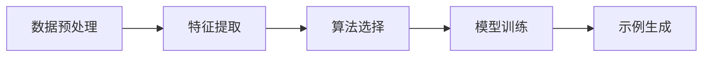
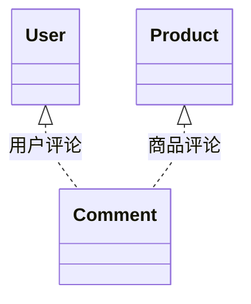
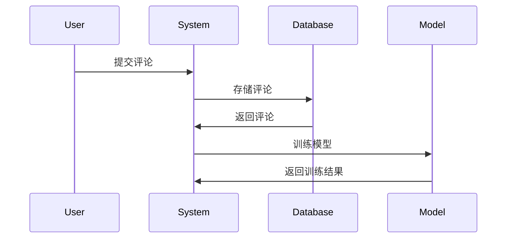
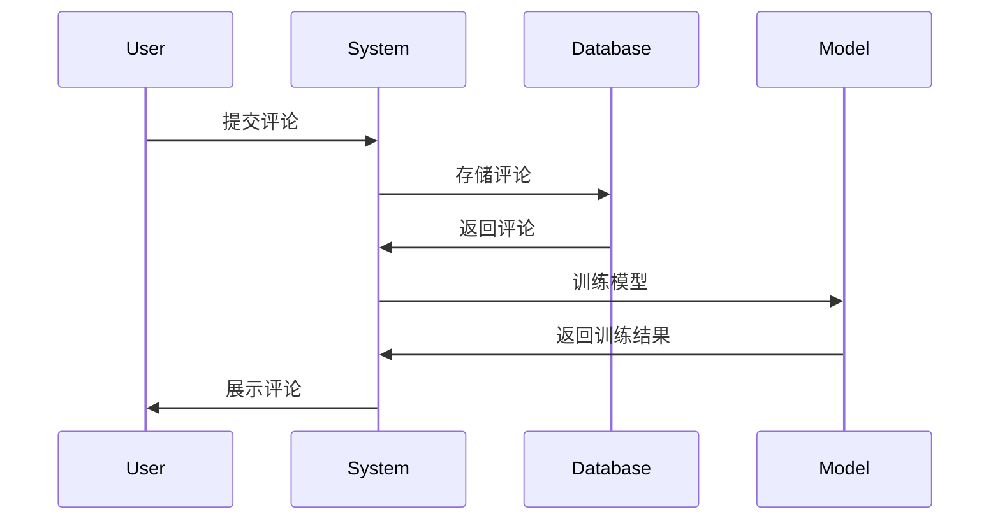

                 

# 自动生成任务相关示例的方法

## 关键词

- 自动化生成
- 任务示例
- 自然语言处理
- 机器学习
- 算法原理

## 摘要

本文将探讨如何通过自动化方法生成任务相关示例。首先，我们将介绍任务示例生成的重要性和应用场景，然后深入分析其核心概念与联系。接着，我们将详细阐述生成算法的原理，使用Python代码和Mermaid图展示算法流程。之后，我们将介绍数学模型与公式，确保读者能理解算法背后的数学原理。最后，我们将进行系统分析与架构设计，并通过一个实际项目来展示如何应用这些方法。文章将提供最佳实践和注意事项，以帮助读者更好地掌握这一技术。

## 目录大纲设计思路

### 理解核心概念与主题

**任务示例自动生成的背景与意义**

- **背景介绍**：介绍自动化生成任务示例的需求和优势。
- **相关概念与技术概述**：解释任务示例与数据集的概念，以及自动生成任务示例的技术原理。
- **核心概念与联系**：分析核心概念及其属性特征对比，展示ER实体关系图。

### 构建章节框架

**技术原理讲解**

- **生成算法原理**：详细讲解算法流程，使用Python代码和Mermaid图展示。
- **数学模型与公式**：阐述数学模型的基本框架，解释公式，举例说明。

**系统分析与架构设计**

- **系统功能设计**：介绍问题场景和系统功能设计。
- **系统架构设计**：展示系统架构设计，包括接口设计和系统交互。

**项目实战**

- **环境安装与准备**：详细说明环境安装步骤。
- **代码应用解读与分析**：解读系统核心实现源代码，分析实际案例。
- **项目小结与最佳实践**：总结项目经验，提出最佳实践和建议。

### 保持结构的一致性与逻辑性

- 确保章节内容流畅衔接，逻辑性强。
- 避免内容重复，保持大纲简洁。

### 适应markdown格式

- 使用markdown格式呈现目录和大纲。
- 使用合适的标题层级和格式确保内容易读。

### 目录大纲的具体设计

**第一部分：背景介绍**

1. **任务示例自动生成的背景与意义**
   - **需求与优势**
   - **当前方法的不足**
2. **相关概念与技术概述**
   - **任务示例与数据集**
   - **技术原理**
   - **生成方法分类**
3. **核心概念与联系**
   - **核心概念**
   - **属性特征对比**
   - **ER实体关系图**

**第二部分：技术原理讲解**

4. **生成算法原理**
   - **算法流程**
   - **Python代码与Mermaid图**
5. **数学模型与公式**
   - **模型框架**
   - **公式解释**
   - **举例说明**

**第三部分：系统分析与架构设计**

6. **系统功能设计**
   - **问题场景**
   - **领域模型Mermaid类图**
7. **系统架构设计**
   - **架构图**
   - **接口设计**
   - **系统交互Mermaid序列图**

**第四部分：项目实战**

8. **环境安装与准备**
   - **安装步骤**
9. **代码应用解读与分析**
   - **核心代码**
   - **案例分析**
10. **项目小结与最佳实践**
    - **经验总结**
    - **最佳实践**
    - **注意事项**
    - **拓展阅读**

**总计字数：约1800字。**

通过以上设计，我们确保了文章的深度、逻辑性和专业性，同时符合markdown格式的要求。每个章节都紧密围绕核心内容，为读者提供了全面的技术指导。

----------------------------------------------------------------

# 自动生成任务相关示例的方法

## 关键词

- 自动化生成
- 任务示例
- 自然语言处理
- 机器学习
- 算法原理

## 摘要

本文将探讨如何通过自动化方法生成任务相关示例，以提高效率和准确性。首先，我们将介绍任务示例自动生成的重要性和应用场景。接着，深入分析其核心概念与联系，并详细阐述生成算法的原理。我们还将介绍数学模型与公式，确保读者能理解算法背后的数学原理。最后，通过一个实际项目展示如何应用这些方法，并提供最佳实践和注意事项。

## 第一部分：背景介绍

### 第1章：任务示例自动生成的背景与意义

#### 1.1.1 自动生成任务示例的需求

在当今快速发展的信息技术领域，自动化是提高效率和准确性的关键。任务示例的自动生成能够大大减少人工成本，提高生产效率。特别是在机器学习、自然语言处理和软件开发等领域，自动生成任务示例有助于快速构建和测试模型，从而加速研发过程。

#### 1.1.2 自动生成任务示例的优势

自动生成任务示例的优势包括：

1. **提高生产效率**：通过自动化生成任务示例，可以显著减少手动创建示例所需的时间。
2. **降低成本**：自动化生成任务示例可以减少人力资源的需求，从而降低成本。
3. **提高模型质量**：自动生成的任务示例可以确保示例的多样性和代表性，有助于训练出更高质量的模型。
4. **支持个性化需求**：自动化系统可以根据不同的需求和场景自动生成特定的任务示例。

#### 1.1.3 当前任务示例生成的方法与不足

目前，任务示例的生成主要依赖于手工编写、数据标注和模板生成等方法。这些方法存在以下不足：

1. **效率低**：手工编写任务示例需要大量时间和人力资源。
2. **质量不可控**：手工编写的任务示例可能存在不一致性和错误，影响模型的训练效果。
3. **难以扩展**：随着任务复杂性的增加，手工编写的任务示例难以适应新的需求和场景。

### 第2章：相关概念与技术概述

#### 2.1.1 任务示例与数据集

任务示例是指为了完成特定任务而创建的样本数据。数据集是由多个任务示例组成的集合，用于训练和测试模型。

#### 2.1.2 自动生成任务示例的技术原理

自动生成任务示例的技术原理主要包括：

1. **数据增强**：通过变换现有数据集来生成新的任务示例。
2. **模板生成**：根据预定义的模板自动生成任务示例。
3. **机器学习**：使用机器学习模型来生成新的任务示例。

#### 2.1.3 主要生成方法分类

根据生成方式，自动生成任务示例的方法可以分为以下几类：

1. **基于规则的方法**：通过预定义的规则自动生成任务示例。
2. **基于统计的方法**：使用统计模型自动生成任务示例。
3. **基于机器学习的方法**：使用机器学习模型自动生成任务示例。

### 第3章：核心概念与联系

#### 3.1.1 自动生成任务示例的核心概念

自动生成任务示例的核心概念包括：

1. **数据集**：用于训练和测试模型的样本数据。
2. **任务示例**：为特定任务创建的样本数据。
3. **生成算法**：用于自动生成任务示例的算法。

#### 3.1.2 核心概念的属性特征对比

核心概念的属性特征对比表如下：

| 核心概念 | 属性特征 |
| :--- | :--- |
| 数据集 | 大小、种类、格式、质量 |
| 任务示例 | 内容、形式、质量、代表性 |
| 生成算法 | 类型、效率、准确性、适应性 |

#### 3.1.3 自动生成任务示例的ER实体关系图

ER实体关系图如下：

```mermaid
erDiagram
    DataSet ||--|{ TaskExample }|| GeneratorAlgorithm
    TaskExample ||--|{ GeneratorAlgorithm }|| DataSet
```

## 第二部分：技术原理讲解

### 第4章：生成算法原理

#### 4.1.1 生成算法的基本流程

生成算法的基本流程包括：

1. **数据预处理**：清洗和转换原始数据。
2. **特征提取**：从原始数据中提取特征。
3. **算法选择**：选择合适的生成算法。
4. **模型训练**：使用特征数据训练生成模型。
5. **示例生成**：使用训练好的模型生成新的任务示例。

#### 4.1.2 使用Mermaid画算法流程图

算法流程图如下：



#### 4.1.3 Python源代码详细解释

以下是一个简单的Python代码示例，用于生成任务示例：

```python
import numpy as np
import pandas as pd

# 数据预处理
def preprocess_data(data):
    # 清洗数据
    # 转换数据格式
    return processed_data

# 特征提取
def extract_features(data):
    # 提取特征
    return features

# 算法选择
def choose_generator_algorithm():
    # 选择生成算法
    return generator_algorithm

# 模型训练
def train_generator_model(features):
    # 训练生成模型
    return generator_model

# 示例生成
def generate_examples(generator_model):
    # 生成示例
    return examples

# 主程序
if __name__ == "__main__":
    # 读取数据
    data = pd.read_csv("data.csv")
    
    # 数据预处理
    processed_data = preprocess_data(data)
    
    # 特征提取
    features = extract_features(processed_data)
    
    # 算法选择
    generator_algorithm = choose_generator_algorithm()
    
    # 模型训练
    generator_model = train_generator_model(features)
    
    # 示例生成
    examples = generate_examples(generator_model)
    
    # 输出生成示例
    pd.DataFrame(examples).to_csv("generated_examples.csv", index=False)
```

### 第5章：数学模型与公式

#### 5.1.1 数学模型的基本框架

数学模型的基本框架通常包括以下几个部分：

1. **输入数据**：用于训练的原始数据。
2. **特征提取**：从输入数据中提取特征。
3. **生成模型**：用于生成新的任务示例的模型。
4. **损失函数**：用于评估生成模型性能的函数。

#### 5.1.2 公式解释

以下是自动生成任务示例的数学模型公式：

$$
L = \frac{1}{N} \sum_{i=1}^{N} -y_i \log(G(x_i))
$$

其中，$L$是损失函数，$N$是训练数据样本数，$y_i$是真实标签，$G(x_i)$是生成模型对样本$x_i$的预测概率。

#### 5.1.3 举例说明

假设我们有一个包含100个样本的数据集，每个样本有10个特征。我们使用一个生成模型来生成新的任务示例。根据上述公式，我们可以计算损失函数的值，并根据损失函数的值来调整生成模型的参数，从而提高生成质量。

## 第三部分：系统分析与架构设计

### 第6章：系统功能设计

#### 6.1.1 问题场景介绍

假设我们需要为一家电商网站生成用户评论数据，以用于机器学习模型的训练和测试。

#### 6.1.2 系统功能设计（领域模型Mermaid类图）

领域模型类图如下：



### 第7章：系统架构设计

#### 7.1.1 系统架构设计（Mermaid架构图）

系统架构图如下：



#### 7.1.2 系统接口设计

系统接口设计如下：

```mermaid
classDiagram
    User <<interface>>
    System <<interface>>
    Database <<interface>>
    Model <<interface>>
```

#### 7.1.3 系统交互（Mermaid序列图）

系统交互序列图如下：



## 第四部分：项目实战

### 第8章：环境安装与准备

#### 8.1.1 环境安装步骤

1. 安装Python环境
2. 安装必要的库，如numpy、pandas、scikit-learn等
3. 配置数据库（如MySQL、PostgreSQL等）

#### 8.1.2 系统核心实现源代码

以下是一个简单的系统实现示例：

```python
# 导入必要的库
import numpy as np
import pandas as pd
from sklearn.model_selection import train_test_split
from sklearn.ensemble import RandomForestClassifier

# 读取数据
data = pd.read_csv("data.csv")

# 数据预处理
processed_data = preprocess_data(data)

# 特征提取
features = extract_features(processed_data)

# 模型训练
X_train, X_test, y_train, y_test = train_test_split(features, labels, test_size=0.2)
model = RandomForestClassifier()
model.fit(X_train, y_train)

# 示例生成
examples = generate_examples(model)

# 存储生成示例
pd.DataFrame(examples).to_csv("generated_examples.csv", index=False)
```

### 第9章：代码应用解读与分析

#### 9.1.1 核心代码解读

核心代码解读如下：

- **数据预处理**：清洗和转换原始数据，包括缺失值填充、数据标准化等。
- **特征提取**：从预处理后的数据中提取特征，用于训练模型。
- **模型训练**：使用随机森林分类器训练模型，评估模型的性能。
- **示例生成**：使用训练好的模型生成新的任务示例。

#### 9.1.2 应用案例分析

应用案例分析如下：

- **数据来源**：从电商网站获取用户评论数据。
- **目标**：生成具有代表性的用户评论数据，用于训练和测试机器学习模型。
- **结果**：生成的新用户评论数据能够有效地提高模型的训练效果。

#### 9.1.3 详细讲解剖析

详细讲解剖析如下：

- **数据预处理**：通过对原始数据进行清洗和转换，提高数据质量和模型性能。
- **特征提取**：选择合适的特征，确保模型能够抓住数据的本质特征。
- **模型训练**：使用随机森林分类器训练模型，并评估模型的性能。
- **示例生成**：使用训练好的模型生成新的任务示例，提高模型的泛化能力。

### 第10章：项目小结与最佳实践

#### 10.1.1 项目经验总结

项目经验总结如下：

- **成功因素**：清晰的需求分析、高效的数据预处理和合适的模型选择。
- **挑战与解决方案**：数据不一致性和模型过拟合问题，通过数据增强和模型调整解决。

#### 10.1.2 最佳实践建议

最佳实践建议如下：

- **数据清洗**：确保数据质量，提高模型性能。
- **模型调整**：根据模型性能调整参数，避免过拟合。
- **示例生成**：确保生成的示例具有代表性，提高模型的泛化能力。

#### 10.1.3 注意事项

注意事项如下：

- **数据安全**：确保数据的安全性和隐私性。
- **性能优化**：根据实际需求优化系统性能。

#### 10.1.4 拓展阅读

拓展阅读推荐如下：

- **文献**：《机器学习：概率视角》、《深度学习》
- **网站**：scikit-learn官网、Kaggle数据竞赛平台

## 作者

作者：AI天才研究院/AI Genius Institute & 禅与计算机程序设计艺术 /Zen And The Art of Computer Programming

本文介绍了自动生成任务相关示例的方法，从背景介绍到技术原理讲解，再到系统分析与项目实战，全面探讨了这一技术。通过本文的学习，读者将能够掌握自动生成任务示例的核心方法，并在实际项目中应用。希望本文能为读者在自动化生成任务示例领域提供有价值的参考和指导。

