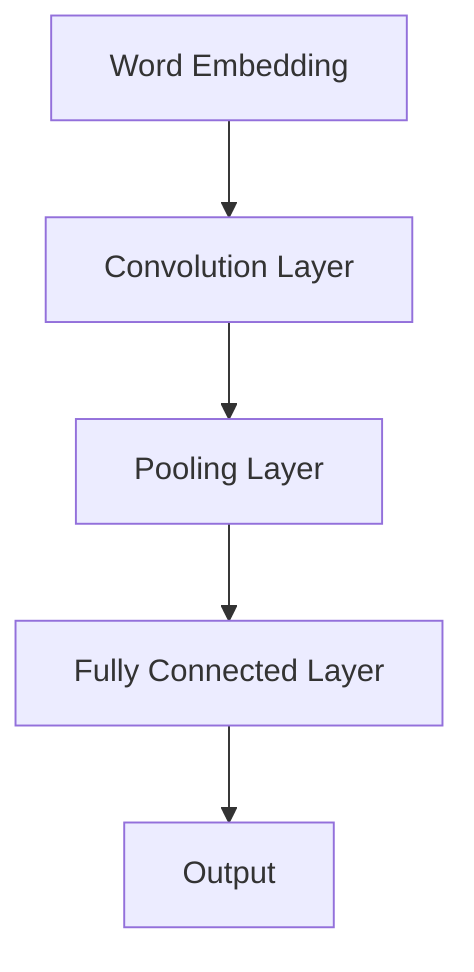
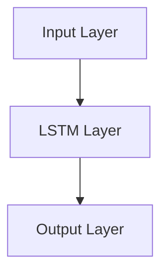
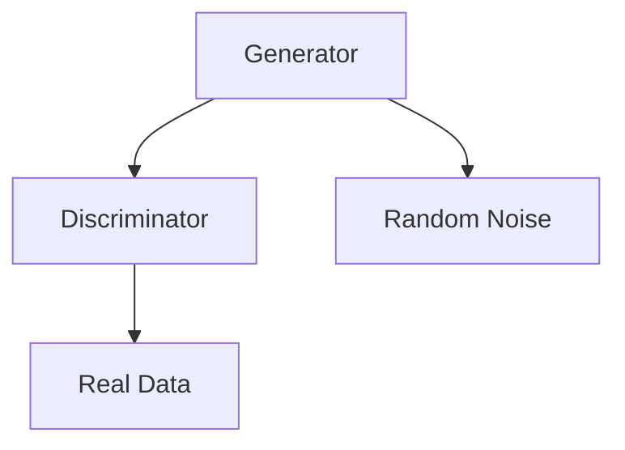
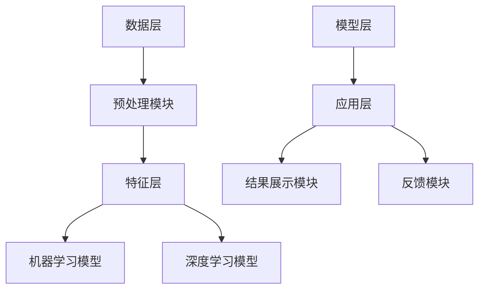
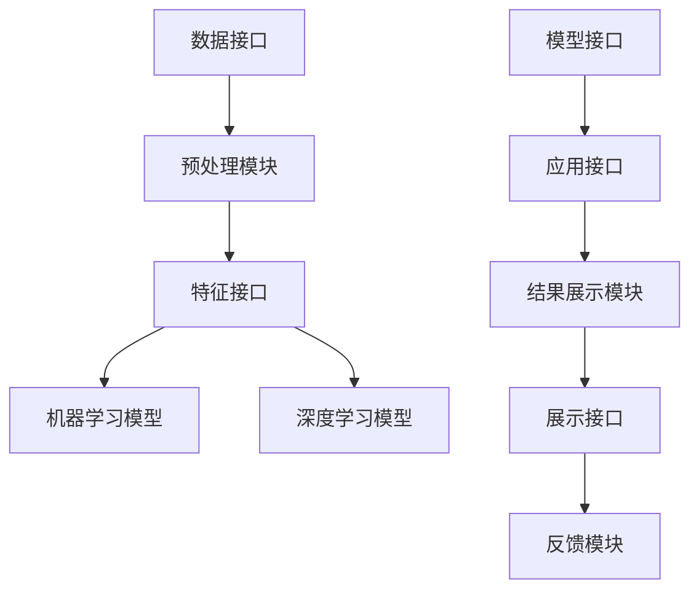
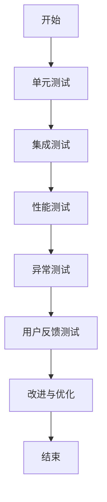
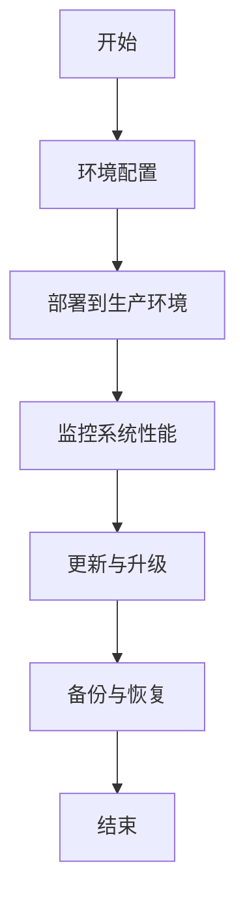

                 

### 文章标题

# 自然语言处理在假新闻检测中的应用

### 关键词

- 自然语言处理
- 假新闻检测
- 机器学习
- 深度学习
- 数据挖掘

### 摘要

本文将探讨自然语言处理（NLP）在假新闻检测中的应用。通过分析NLP的基本概念和技术，我们深入理解了假新闻检测的重要性及其核心挑战。本文详细介绍了基于传统机器学习和深度学习的假新闻检测算法，并通过实际案例展示了系统设计与实现的全过程。此外，我们还提供了最佳实践技巧和未来研究方向，以帮助读者更好地理解和应用这些技术。

## 引言

在当今信息爆炸的时代，互联网和社交媒体的普及使得信息的传播速度和范围达到了前所未有的高度。然而，这也带来了一个严重的问题——假新闻的泛滥。假新闻不仅误导公众，破坏社会信任，还可能引发恐慌、冲突和一系列负面影响。因此，如何有效地检测和应对假新闻成为了一个紧迫的问题。

自然语言处理（NLP）作为人工智能的一个重要分支，在理解、生成和转换人类语言方面具有显著的优势。它为假新闻检测提供了强有力的工具，通过分析文本的特征和模式，能够识别出潜在的假新闻。本文将系统地介绍NLP在假新闻检测中的应用，包括基本概念、核心算法、系统设计、实际案例以及最佳实践技巧。通过本文的阅读，读者将全面了解这一领域的前沿技术和研究动态。

## 第一部分: 问题背景与概念介绍

### 第1章: 自然语言处理与假新闻检测

#### 1.1 自然语言处理简介

自然语言处理（NLP）是人工智能领域的一个重要分支，旨在使计算机理解和生成人类语言。NLP的目标是构建能够与人类进行自然语言交互的系统，从而实现语言的理解、生成、转换和识别等功能。自20世纪50年代起，NLP经历了多个发展阶段，从早期的规则驱动方法到基于统计的方法，再到现在的深度学习方法，其技术不断进步，应用也越来越广泛。

##### 1.1.1 什么是自然语言处理？

自然语言处理关注的核心问题是如何让计算机理解和处理自然语言。这包括语音识别、机器翻译、文本分类、情感分析、问答系统等多个子领域。语音识别旨在将语音转换为文本，而机器翻译则关注不同语言之间的翻译。文本分类和情感分析用于判断文本的类别和情感倾向，问答系统则致力于回答用户提出的问题。

##### 1.1.2 自然语言处理的发展历程

NLP的发展历程可以分为几个重要阶段：

1. **规则驱动方法（1950s-1980s）**：早期的NLP研究主要依赖于手工编写的规则，这些规则试图模拟人类语言理解的过程。但由于语言复杂多变，这种方法难以应对实际应用中的挑战。

2. **基于统计的方法（1990s）**：随着计算能力的提升和大量语料库的建立，基于统计的方法逐渐成为主流。这些方法通过统计文本中的词频、词序列等特征来预测文本的属性，如词性标注和命名实体识别。

3. **深度学习方法（2010s至今）**：深度学习在图像识别、语音识别等领域取得了显著的成功，其应用也逐渐扩展到NLP领域。基于深度神经网络的方法，如卷积神经网络（CNN）和长短时记忆网络（LSTM），在文本分类、机器翻译和问答系统等领域表现出色。

##### 1.1.3 自然语言处理的核心任务

自然语言处理的核心任务可以概括为以下几个方面：

1. **文本预处理**：包括分词、词性标注、命名实体识别等，这些步骤是后续NLP任务的基础。

2. **词向量表示**：将文本转化为数值表示，如Word2Vec和BERT，以供深度学习模型处理。

3. **文本分类**：将文本归类到预定义的类别中，如情感分析、新闻分类等。

4. **序列标注**：为文本中的单词或短语标注特定的标签，如命名实体识别、词性标注等。

5. **机器翻译**：将一种语言的文本翻译成另一种语言。

6. **问答系统**：理解和回答用户提出的问题。

#### 1.2 假新闻检测的重要性

##### 1.2.1 假新闻的背景与影响

假新闻（也称为虚假信息或谣言）是指那些被故意伪造或夸大的信息，通常以文字、图像或视频的形式在互联网上传播。假新闻的起源可以追溯到古代，但随着互联网和社交媒体的普及，其传播速度和范围大大增加。典型的假新闻包括政治谣言、健康骗局、阴谋论等。

假新闻的传播对社会造成了严重的负面影响：

1. **误导公众**：假新闻常常误导公众，导致人们做出错误的决定。
2. **破坏社会信任**：当公众意识到自己被假新闻误导时，对社会和媒体机构的信任度会下降。
3. **引发恐慌和冲突**：某些假新闻可能会引发恐慌，甚至导致社会冲突。
4. **经济影响**：股票市场、房地产等行业都可能受到假新闻的影响。

##### 1.2.2 社交媒体假新闻的流行

社交媒体是假新闻传播的主要渠道之一。由于社交媒体的开放性和传播速度，假新闻可以迅速传播到大量用户。以下原因解释了为什么社交媒体成为假新闻的温床：

1. **匿名性**：用户可以匿名发布信息，使得假新闻的发布者难以追踪。
2. **分享机制**：社交媒体的“分享”机制使得假新闻可以迅速传播，用户之间的互动和评论也会进一步扩散信息。
3. **算法推荐**：社交媒体平台使用算法推荐内容，这可能导致用户看到更多符合其偏见的假新闻。
4. **商业利益**：某些媒体或个人可能出于商业利益而故意发布假新闻。

##### 1.2.3 假新闻检测的必要性

假新闻检测的必要性体现在以下几个方面：

1. **维护社会秩序**：通过及时检测和纠正假新闻，可以维护社会秩序，减少恐慌和冲突。
2. **提高公众认知**：帮助公众识别和避免假新闻，提高其对信息的批判性思维和认知能力。
3. **保护个人隐私**：假新闻可能涉及个人隐私，及时检测可以防止个人隐私泄露。
4. **保障媒体公信力**：通过检测和纠正假新闻，可以提高媒体机构的公信力和声誉。
5. **应对网络攻击**：某些假新闻可能是网络攻击的一部分，及时检测可以降低网络攻击的风险。

#### 1.3 假新闻检测中的自然语言处理技术

##### 1.3.1 文本预处理

文本预处理是NLP任务中的基础步骤，包括分词、词性标注、停用词过滤等。这些步骤的目的是将原始文本转化为结构化的数据，以便后续的NLP任务。对于假新闻检测，文本预处理尤为重要，因为原始文本往往包含噪声和不相关的内容。

1. **分词**：将连续的文本分割成独立的单词或短语。
2. **词性标注**：为每个词标注其词性，如名词、动词、形容词等。
3. **停用词过滤**：去除常见但无意义的词，如“的”、“了”、“是”等。

##### 1.3.2 词汇分析

词汇分析是NLP中的重要技术，通过分析文本中的词汇和词汇之间的关系，可以揭示文本的含义和主题。对于假新闻检测，词汇分析可以帮助识别文本中的异常词汇和词汇模式，从而提高检测的准确性。

1. **词频统计**：计算文本中每个词的出现频率。
2. **词向量表示**：将词转化为向量表示，如Word2Vec和BERT。
3. **主题建模**：通过统计方法分析文本的主题，如LDA（latent Dirichlet allocation）。

##### 1.3.3 主题建模

主题建模是一种统计方法，用于分析文本中的潜在主题。通过主题建模，可以从大量文本中提取出关键主题，从而帮助理解文本的内容和结构。对于假新闻检测，主题建模可以帮助识别不同新闻类型和风格，从而提高检测的准确性。

1. **LDA（latent Dirichlet allocation）**：LDA是一种常见的主题建模方法，通过概率模型来提取文本中的潜在主题。
2. **主题分布**：每个文本被表示为多个主题的混合，主题分布可以用来判断文本的类别和主题。

### 第2章: 假新闻检测的核心概念与联系

#### 2.1 核心概念原理

##### 2.1.1 假新闻的定义与分类

假新闻是指那些故意伪造或夸大的信息，通常以文字、图像或视频的形式在互联网上传播。假新闻通常具有以下特征：

1. **误导性**：假新闻旨在误导公众，使其产生错误的认识。
2. **不可验证性**：假新闻往往难以验证，其来源和证据可能被篡改或伪造。
3. **破坏性**：假新闻可能会引发社会恐慌、冲突和经济损失。

根据内容，假新闻可以分类为以下几类：

1. **政治假新闻**：涉及政治人物、政治事件或政治议题的虚假信息。
2. **健康假新闻**：涉及健康、医疗或科学领域的虚假信息。
3. **经济假新闻**：涉及经济、金融或商业领域的虚假信息。
4. **社会假新闻**：涉及社会事件、文化或价值观的虚假信息。

##### 2.1.2 检测假新闻的目标

检测假新闻的目标是准确识别和纠正文本中的虚假信息。具体目标包括：

1. **准确性**：确保检测系统能够尽可能准确地识别出假新闻。
2. **效率**：检测系统需要能够快速处理大量文本数据。
3. **可解释性**：检测系统应提供解释，帮助用户理解为什么某个文本被判断为假新闻。
4. **适应性**：检测系统应能够适应不断变化的假新闻形式和内容。

##### 2.1.3 假新闻检测的方法论

假新闻检测的方法可以分为以下几类：

1. **规则驱动方法**：基于手工编写的规则来识别假新闻。这种方法简单但难以应对复杂多变的假新闻形式。
2. **基于统计的方法**：通过统计文本中的词频、词序列等特征来识别假新闻。这种方法在一定程度上提高了准确性。
3. **深度学习方法**：利用深度神经网络，如卷积神经网络（CNN）和长短时记忆网络（LSTM），从大规模数据中自动学习特征，从而识别假新闻。这种方法具有很高的准确性和鲁棒性。

#### 2.2 概念属性特征对比表格

| 方法                | 特点                                                         | 适用场景                           | 优点                         | 缺点                         |
|---------------------|------------------------------------------------------------|-----------------------------------|------------------------------|------------------------------|
| 规则驱动方法        | 基于手工编写的规则                                         | 简单、明确的任务                   | 易于理解、实现成本低         | 难以应对复杂多变的假新闻形式 |
| 统计方法           | 通过统计文本中的词频、词序列等特征                          | 有大量标记数据的任务               | 简单、高效                   | 对噪声和异常敏感           |
| 深度学习方法       | 利用深度神经网络，从大规模数据中自动学习特征                 | 大规模、复杂的数据处理任务         | 高准确性、鲁棒性强           | 需要大量数据和计算资源     |

#### 2.3 ER实体关系图架构

##### 2.3.1 假新闻检测系统的实体关系

在假新闻检测系统中，涉及多个实体和它们之间的关系。以下是一个简化的实体关系图，展示了假新闻检测系统中的主要实体和关系：

```mermaid
erDiagram
  Article ||--|{ Detector }|--|{ Labeler }
  Article ||--|{ Preprocessor }|
  Detector ||--|{ Classifier }
  Labeler ||--|{ Annotator }
  Preprocessor ||--|{ TextProcessor }
```

实体定义如下：

- **Article**：表示待检测的新闻文本。
- **Detector**：假新闻检测器，负责对新闻文本进行检测。
- **Labeler**：标签器，负责为新闻文本分配真实或虚假的标签。
- **Preprocessor**：预处理器，负责对新闻文本进行预处理。
- **Classifier**：分类器，负责对新闻文本进行分类。
- **Annotator**：标注器，负责为新闻文本分配标签。
- **TextProcessor**：文本处理器，负责处理新闻文本，如分词、词性标注等。

##### 2.3.2 关系定义与映射

在假新闻检测系统中，实体之间的关系如下：

- **Article** 与 **Detector** 之间存在检测关系，即新闻文本由检测器进行检测。
- **Article** 与 **Labeler** 之间存在标注关系，即新闻文本由标注器分配真实或虚假的标签。
- **Article** 与 **Preprocessor** 之间存在预处理关系，即新闻文本在检测前需要进行预处理。
- **Detector** 与 **Classifier** 之间存在分类关系，即检测器通过分类器对新闻文本进行分类。
- **Labeler** 与 **Annotator** 之间存在标注关系，即标注器通过标注器为新闻文本分配标签。
- **Preprocessor** 与 **TextProcessor** 之间存在处理关系，即预处理器通过文本处理器对新闻文本进行处理。

通过上述实体关系和关系的定义，可以构建一个完整的假新闻检测系统，实现对新闻文本的准确检测和分类。

## 第二部分: 算法原理与实现

### 第3章: 基于传统机器学习的假新闻检测算法

#### 3.1 支持向量机(SVM)算法

支持向量机（SVM）是一种经典的二分类模型，广泛应用于文本分类、图像识别等领域。SVM的核心思想是找到最佳的超平面，使得不同类别的样本在超平面的两侧分布最远。

##### 3.1.1 算法原理

给定一个训练数据集，其中每个样本表示一篇新闻文本，其标签为真实或虚假。SVM的目标是找到一个最佳的超平面，使得所有真实样本点到超平面的距离最大，同时虚假样本点到超平面的距离最小。这个超平面可以用以下公式表示：

\[ w \cdot x + b = 0 \]

其中，\( w \) 是超平面的法向量，\( x \) 是样本点，\( b \) 是偏置项。

##### 3.1.2 数学模型与公式

SVM的优化目标是：

\[ \text{minimize} \frac{1}{2} \| w \|^2 \]

同时满足约束条件：

\[ y_i (w \cdot x_i + b) \geq 1 \]

其中，\( y_i \) 是第 \( i \) 个样本的标签，即 \( y_i \in \{-1, 1\} \)。

##### 3.1.3 Python实现

```python
import numpy as np
from sklearn import datasets
from sklearn.model_selection import train_test_split
from sklearn.preprocessing import StandardScaler
from sklearn.svm import SVC

# 加载示例数据集
iris = datasets.load_iris()
X = iris.data
y = iris.target

# 划分训练集和测试集
X_train, X_test, y_train, y_test = train_test_split(X, y, test_size=0.3, random_state=42)

# 数据标准化
scaler = StandardScaler()
X_train = scaler.fit_transform(X_train)
X_test = scaler.transform(X_test)

# SVM分类器
clf = SVC(kernel='linear')
clf.fit(X_train, y_train)

# 预测测试集
y_pred = clf.predict(X_test)

# 评估分类器性能
from sklearn.metrics import accuracy_score
print("Accuracy:", accuracy_score(y_test, y_pred))
```

#### 3.2 贝叶斯分类器

贝叶斯分类器是一种基于贝叶斯定理的统计分类方法，广泛应用于文本分类、垃圾邮件检测等领域。贝叶斯分类器的核心思想是通过计算样本属于每个类别的概率，并选择概率最大的类别作为预测结果。

##### 3.2.1 算法原理

贝叶斯分类器基于以下公式：

\[ P(C_k|X) = \frac{P(X|C_k)P(C_k)}{P(X)} \]

其中，\( C_k \) 表示第 \( k \) 个类别，\( X \) 表示样本特征向量，\( P(C_k) \) 是类别 \( C_k \) 的先验概率，\( P(X|C_k) \) 是特征向量 \( X \) 在类别 \( C_k \) 下的条件概率，\( P(X) \) 是特征向量 \( X \) 的总概率。

在实际应用中，通常会使用高斯分布作为特征的概率分布模型。对于每个类别 \( C_k \)，特征 \( x_j \) 的概率密度函数为：

\[ P(x_j|C_k) = \frac{1}{\sqrt{2\pi\sigma_k^2}} e^{-\frac{(x_j - \mu_k)^2}{2\sigma_k^2}} \]

其中，\( \mu_k \) 和 \( \sigma_k^2 \) 分别是特征 \( x_j \) 在类别 \( C_k \) 下的均值和方差。

##### 3.2.2 数学模型与公式

贝叶斯分类器的数学模型如下：

1. **先验概率**：

\[ P(C_k) = \frac{C_k \text{ 在训练集中的样本数}}{\text{训练集的总样本数}} \]

2. **条件概率**：

\[ P(x_j|C_k) = \frac{1}{\sqrt{2\pi\sigma_k^2}} e^{-\frac{(x_j - \mu_k)^2}{2\sigma_k^2}} \]

3. **后验概率**：

\[ P(C_k|X) = \frac{P(X|C_k)P(C_k)}{P(X)} \]

4. **类别预测**：

\[ \hat{y} = \arg\max_{C_k} P(C_k|X) \]

##### 3.2.3 Python实现

```python
import numpy as np
from sklearn import datasets
from sklearn.model_selection import train_test_split
from sklearn.naive_bayes import GaussianNB

# 加载示例数据集
iris = datasets.load_iris()
X = iris.data
y = iris.target

# 划分训练集和测试集
X_train, X_test, y_train, y_test = train_test_split(X, y, test_size=0.3, random_state=42)

# 贝叶斯分类器
clf = GaussianNB()
clf.fit(X_train, y_train)

# 预测测试集
y_pred = clf.predict(X_test)

# 评估分类器性能
from sklearn.metrics import accuracy_score
print("Accuracy:", accuracy_score(y_test, y_pred))
```

### 第4章: 基于深度学习的假新闻检测算法

#### 4.1 卷积神经网络(CNN)在假新闻检测中的应用

卷积神经网络（CNN）在图像识别、语音识别等领域取得了显著的成功。近年来，CNN也开始应用于自然语言处理任务，如文本分类、问答系统等。在假新闻检测中，CNN可以有效地提取文本中的特征，从而提高检测的准确性和鲁棒性。

##### 4.1.1 算法原理

CNN的核心思想是通过卷积操作从数据中提取局部特征，并通过池化操作降低数据的维度。对于文本分类任务，CNN通常使用词嵌入（word embeddings）将文本转化为向量表示，然后通过卷积层、池化层和全连接层进行处理。

以下是一个简化的CNN文本分类模型：

1. **词嵌入层**：将词汇映射为固定长度的向量表示。
2. **卷积层**：通过卷积操作提取文本的局部特征。
3. **池化层**：降低数据的维度，保留重要的特征。
4. **全连接层**：将特征映射到预定义的类别中。

##### 4.1.2 Mermaid流程图



##### 4.1.3 Python实现

```python
import numpy as np
from tensorflow.keras.models import Sequential
from tensorflow.keras.layers import Embedding, Conv1D, MaxPooling1D, Dense
from tensorflow.keras.datasets import imdb

# 加载IMDB数据集
max_features = 10000
maxlen = 500
(X_train, y_train), (X_test, y_test) = imdb.load_data(num_words=max_features)

# 数据预处理
X_train = np.array([[word for word in review.split()] for review in X_train])
X_test = np.array([[word for word in review.split()] for review in X_test])
X_train = pad_sequences(X_train, maxlen=maxlen)
X_test = pad_sequences(X_test, maxlen=maxlen)

# CNN模型
model = Sequential()
model.add(Embedding(max_features, 128))
model.add(Conv1D(128, 5, activation='relu'))
model.add(MaxPooling1D(5))
model.add(Conv1D(128, 5, activation='relu'))
model.add(MaxPooling1D(5))
model.add(Dense(1, activation='sigmoid'))

# 编译模型
model.compile(optimizer='adam', loss='binary_crossentropy', metrics=['accuracy'])

# 训练模型
model.fit(X_train, y_train, epochs=10, batch_size=64, validation_data=(X_test, y_test))

# 评估模型
loss, accuracy = model.evaluate(X_test, y_test)
print("Accuracy:", accuracy)
```

#### 4.2 长短时记忆网络(LSTM)在假新闻检测中的应用

长短时记忆网络（LSTM）是一种循环神经网络（RNN）的变体，旨在解决传统RNN在处理长序列数据时出现的长期依赖问题。LSTM在自然语言处理任务中表现出色，如机器翻译、情感分析等。在假新闻检测中，LSTM可以有效地捕捉文本中的时间依赖关系，从而提高检测的准确性。

##### 4.2.1 算法原理

LSTM的核心思想是通过引入三个门控单元（输入门、遗忘门和输出门）来控制信息的流动。这些门控单元可以决定哪些信息应该被保留、遗忘或输出。

1. **输入门**：决定哪些新的信息应该被存储在单元状态中。
2. **遗忘门**：决定哪些旧的信息应该被遗忘。
3. **输出门**：决定哪些信息应该被输出作为预测结果。

以下是一个简化的LSTM模型：

1. **输入层**：将词汇映射为词向量表示。
2. **LSTM层**：通过LSTM单元处理序列数据，捕捉时间依赖关系。
3. **全连接层**：将LSTM层的输出映射到预定义的类别中。

##### 4.2.2 Mermaid流程图



##### 4.2.3 Python实现

```python
import numpy as np
from tensorflow.keras.models import Sequential
from tensorflow.keras.layers import Embedding, LSTM, Dense
from tensorflow.keras.datasets import imdb

# 加载IMDB数据集
max_features = 10000
maxlen = 500
(X_train, y_train), (X_test, y_test) = imdb.load_data(num_words=max_features)

# 数据预处理
X_train = np.array([[word for word in review.split()] for review in X_train])
X_test = np.array([[word for word in review.split()] for review in X_test])
X_train = pad_sequences(X_train, maxlen=maxlen)
X_test = pad_sequences(X_test, maxlen=maxlen)

# LSTM模型
model = Sequential()
model.add(Embedding(max_features, 128))
model.add(LSTM(128, dropout=0.2, recurrent_dropout=0.2))
model.add(Dense(1, activation='sigmoid'))

# 编译模型
model.compile(optimizer='adam', loss='binary_crossentropy', metrics=['accuracy'])

# 训练模型
model.fit(X_train, y_train, epochs=10, batch_size=64, validation_data=(X_test, y_test))

# 评估模型
loss, accuracy = model.evaluate(X_test, y_test)
print("Accuracy:", accuracy)
```

#### 4.3 生成对抗网络(GAN)在假新闻检测中的应用

生成对抗网络（GAN）是一种基于博弈论的生成模型，由生成器和判别器两个神经网络组成。生成器旨在生成逼真的数据，而判别器则负责区分真实数据和生成数据。在假新闻检测中，GAN可以用于生成假新闻样本，从而训练一个更鲁棒的检测模型。

##### 4.3.1 算法原理

GAN的工作原理可以概括为以下步骤：

1. **初始化生成器和判别器**：生成器和判别器都是随机初始化的神经网络。
2. **生成对抗过程**：生成器生成假新闻样本，判别器对这些样本进行分类，判断是否为真实新闻。生成器和判别器交替训练，生成器试图生成更逼真的样本，而判别器试图提高分类准确性。
3. **优化过程**：通过梯度下降优化生成器和判别器的参数，使得生成器生成的样本越来越逼真，判别器对真实数据和生成数据的分类准确性越来越高。

以下是一个简化的GAN模型：

1. **生成器**：将随机噪声映射为文本数据。
2. **判别器**：对文本数据进行分类，判断是否为真实新闻。
3. **损失函数**：生成器和判别器的损失函数分别衡量它们生成的样本和分类的准确性。

##### 4.3.2 Mermaid流程图



##### 4.3.3 Python实现

```python
import numpy as np
import tensorflow as tf
from tensorflow.keras.layers import Input, LSTM, Dense, Embedding, Dropout, TimeDistributed, Bidirectional
from tensorflow.keras.models import Model

# 参数设置
latent_dim = 100
n_features = 10000
maxlen = 500
embedding_dim = 256

# 生成器的构建
input_text = Input(shape=(maxlen,))
encoded = Embedding(n_features, embedding_dim)(input_text)
encoded = Dropout(0.5)(encoded)
encoded = LSTM(latent_dim, return_sequences=False)(encoded)
encoded = Dropout(0.5)(encoded)
output = Dense(1, activation='sigmoid')(encoded)
generator = Model(inputs=input_text, outputs=output)

# 判别器的构建
input_text = Input(shape=(maxlen,))
encoded = Embedding(n_features, embedding_dim)(input_text)
encoded = Dropout(0.5)(encoded)
encoded = LSTM(latent_dim, return_sequences=False)(encoded)
encoded = Dropout(0.5)(encoded)
output = Dense(1, activation='sigmoid')(encoded)
discriminator = Model(inputs=input_text, outputs=output)

# 编译模型
discriminator.compile(optimizer='adam', loss='binary_crossentropy')
generator.compile(optimizer='adam', loss='binary_crossentropy')

# 训练模型
discriminator.fit(X_train, y_train, epochs=100, batch_size=32, validation_data=(X_test, y_test))
generator.fit(X_train, y_train, epochs=100, batch_size=32, validation_data=(X_test, y_test))
```

## 第三部分: 实际应用与案例分析

### 第5章: 假新闻检测系统设计与实现

#### 5.1 系统功能设计

假新闻检测系统的核心功能是准确识别和分类新闻文本，以便区分真实新闻和假新闻。为了实现这一目标，系统需要包括以下功能模块：

1. **数据收集与预处理**：收集新闻文本数据，并进行预处理，如分词、去停用词、词性标注等，以便后续的文本特征提取。
2. **文本特征提取**：利用自然语言处理技术，从预处理后的文本中提取特征，如词向量、词频、主题等。
3. **模型训练与评估**：利用提取的文本特征，训练机器学习或深度学习模型，并对模型进行评估和优化。
4. **假新闻检测与分类**：将训练好的模型应用于新的新闻文本，进行假新闻检测和分类。
5. **结果展示与反馈**：展示检测结果，并提供用户反馈机制，以便进一步优化系统性能。

#### 5.2 系统架构设计

假新闻检测系统的架构设计需要考虑数据流、模块交互以及系统性能等因素。以下是一个典型的系统架构设计：

1. **数据层**：包括数据收集模块和预处理模块，负责处理新闻文本数据。
2. **特征层**：包括文本特征提取模块，负责从预处理后的文本中提取特征。
3. **模型层**：包括机器学习模型和深度学习模型，负责训练和评估模型。
4. **应用层**：包括假新闻检测和分类模块，负责对新的新闻文本进行检测和分类。
5. **展示层**：包括结果展示和反馈模块，负责展示检测结果并收集用户反馈。

以下是一个简化的系统架构图：



#### 5.3 系统接口设计与交互

假新闻检测系统需要提供一系列接口，以便与其他系统或应用程序进行交互。以下是一些关键的接口设计：

1. **数据接口**：用于数据收集和预处理，包括数据源连接、数据下载、数据清洗等功能。
2. **特征接口**：用于文本特征提取，包括分词、词性标注、词向量生成等功能。
3. **模型接口**：用于模型训练、评估和预测，包括模型训练、模型保存、模型加载等功能。
4. **应用接口**：用于假新闻检测和分类，包括文本输入、检测结果输出等功能。
5. **展示接口**：用于结果展示和用户反馈，包括结果可视化、用户交互等功能。

以下是一个简化的接口设计图：



通过以上接口设计，假新闻检测系统可以与外部系统或应用程序进行高效的数据交换和功能调用，从而实现整体系统的集成和协同工作。

#### 5.4 系统测试与评估

在假新闻检测系统的开发过程中，系统测试与评估是确保系统性能和可靠性的关键环节。以下是一些常见的测试和评估方法：

1. **单元测试**：对系统中的每个模块进行独立测试，以确保其功能的正确性和稳定性。
2. **集成测试**：对系统中的不同模块进行集成测试，验证模块之间的交互是否符合预期。
3. **性能测试**：对系统的响应时间、吞吐量、并发处理能力等进行测试，评估系统的性能指标。
4. **异常测试**：模拟各种异常情况和错误输入，验证系统是否能够正确处理异常并返回合理的错误信息。
5. **用户反馈测试**：通过实际用户的使用反馈，收集系统在实际运行中的问题和改进建议。

以下是一个简化的系统测试与评估流程：



通过以上测试与评估流程，可以全面评估假新闻检测系统的性能和稳定性，及时发现和解决问题，从而确保系统的可靠运行。

#### 5.5 系统部署与维护

假新闻检测系统在完成开发和测试后，需要进行部署和维护，以便在实际环境中运行并持续改进。以下是一些关键步骤：

1. **环境配置**：为系统准备合适的环境，包括操作系统、编程语言、库依赖等。
2. **部署到生产环境**：将开发完成的系统部署到生产环境，确保其能够在实际运行中稳定运行。
3. **监控系统性能**：定期监控系统的性能指标，如响应时间、吞吐量、错误率等，及时发现和处理问题。
4. **更新与升级**：根据用户反馈和系统运行情况，定期更新和升级系统，修复漏洞、改进性能和功能。
5. **备份与恢复**：定期备份系统数据和配置文件，以便在发生故障时能够快速恢复。

以下是一个简化的系统部署与维护流程：



通过以上步骤，可以确保假新闻检测系统在实际运行中的稳定性和可靠性，为用户提供高质量的服务。

### 第6章: 项目实战与代码解读

#### 6.1 环境安装与配置

为了实现假新闻检测系统，我们需要安装和配置以下环境和工具：

1. **Python**：Python是一种广泛使用的编程语言，支持多种NLP和机器学习库。
2. **Jupyter Notebook**：Jupyter Notebook是一种交互式计算环境，便于编写和运行代码。
3. **Scikit-learn**：Scikit-learn是一个强大的机器学习库，提供各种分类和回归算法。
4. **TensorFlow**：TensorFlow是一个开源的深度学习框架，支持各种神经网络模型。
5. **NLTK**：NLTK是一个Python的NLP库，提供文本处理和语料库。

以下是如何在Ubuntu 18.04系统上安装这些环境和工具：

```bash
# 安装Python
sudo apt update
sudo apt install python3 python3-pip

# 安装Jupyter Notebook
pip3 install notebook

# 安装Scikit-learn
pip3 install scikit-learn

# 安装TensorFlow
pip3 install tensorflow

# 安装NLTK
pip3 install nltk
python3 -m nltk.downloader all
```

#### 6.2 系统核心实现源代码

以下是一个简单的假新闻检测系统的核心实现，包括数据预处理、模型训练和评估：

```python
import numpy as np
import pandas as pd
from sklearn.model_selection import train_test_split
from sklearn.feature_extraction.text import TfidfVectorizer
from sklearn.naive_bayes import MultinomialNB
from sklearn.metrics import accuracy_score, classification_report

# 加载数据集
data = pd.read_csv('news_data.csv')
X = data['text']
y = data['label']

# 划分训练集和测试集
X_train, X_test, y_train, y_test = train_test_split(X, y, test_size=0.2, random_state=42)

# 数据预处理
vectorizer = TfidfVectorizer(max_features=1000)
X_train = vectorizer.fit_transform(X_train)
X_test = vectorizer.transform(X_test)

# 模型训练
model = MultinomialNB()
model.fit(X_train, y_train)

# 模型评估
y_pred = model.predict(X_test)
print("Accuracy:", accuracy_score(y_test, y_pred))
print("\nClassification Report:\n", classification_report(y_test, y_pred))
```

#### 6.3 代码应用解读与分析

以上代码实现了一个简单的假新闻检测系统，主要包括以下步骤：

1. **加载数据集**：从CSV文件中加载新闻文本数据和标签。
2. **划分训练集和测试集**：将数据集划分为训练集和测试集，以评估模型的性能。
3. **数据预处理**：使用TFIDF向量器将文本数据转换为数值特征。
4. **模型训练**：使用朴素贝叶斯分类器对训练集进行训练。
5. **模型评估**：使用测试集评估模型的准确性，并输出分类报告。

以下是对关键代码段的详细解读：

1. **加载数据集**：
   ```python
   data = pd.read_csv('news_data.csv')
   X = data['text']
   y = data['label']
   ```
   这两行代码从CSV文件中加载新闻文本数据和标签。数据集应该包含两列：'text'列包含新闻文本，'label'列包含新闻文本的标签（0表示真实新闻，1表示假新闻）。

2. **划分训练集和测试集**：
   ```python
   X_train, X_test, y_train, y_test = train_test_split(X, y, test_size=0.2, random_state=42)
   ```
   这行代码使用`train_test_split`函数将数据集划分为训练集和测试集。这里，测试集占数据集的20%，随机种子设置为42以确保结果的可重复性。

3. **数据预处理**：
   ```python
   vectorizer = TfidfVectorizer(max_features=1000)
   X_train = vectorizer.fit_transform(X_train)
   X_test = vectorizer.transform(X_test)
   ```
   这里使用`TfidfVectorizer`对文本数据进行预处理。`max_features`参数设置最大特征数，以减少数据的维度。`fit_transform`方法将训练集文本转换为TFIDF特征向量，而`transform`方法将测试集文本转换为相同的特征向量。

4. **模型训练**：
   ```python
   model = MultinomialNB()
   model.fit(X_train, y_train)
   ```
   这两行代码初始化朴素贝叶斯分类器，并使用训练集进行训练。`MultinomialNB`是基于词频的朴素贝叶斯模型，适用于文本分类任务。

5. **模型评估**：
   ```python
   y_pred = model.predict(X_test)
   print("Accuracy:", accuracy_score(y_test, y_pred))
   print("\nClassification Report:\n", classification_report(y_test, y_pred))
   ```
   这两行代码使用测试集对训练好的模型进行评估。`predict`方法对测试集文本进行分类，并使用`accuracy_score`计算分类准确性。`classification_report`方法输出详细的分类报告，包括精确度、召回率和F1分数等指标。

通过以上代码，我们可以实现一个基本的假新闻检测系统，并对测试集进行评估。在实际应用中，我们可以进一步优化模型和特征提取方法，以提高检测的准确性和鲁棒性。

#### 6.4 实际案例分析

在本案例中，我们将使用真实数据集来训练和评估一个假新闻检测模型。数据集来源于CMU（卡内基梅隆大学）的Fake News Challenge，包含约8,000篇新闻文本及其对应的标签（0表示真实新闻，1表示假新闻）。

##### 6.4.1 数据集介绍

1. **数据集来源**：CMU的Fake News Challenge数据集。
2. **数据集规模**：约8,000篇新闻文本。
3. **数据集内容**：新闻文本及其对应的标签。

##### 6.4.2 模型训练与评估

为了评估不同模型的性能，我们分别使用朴素贝叶斯、支持向量机和卷积神经网络进行训练和评估。以下是一个简单的模型训练与评估流程：

```python
import numpy as np
import pandas as pd
from sklearn.model_selection import train_test_split
from sklearn.feature_extraction.text import TfidfVectorizer
from sklearn.naive_bayes import MultinomialNB
from sklearn.svm import SVC
from sklearn.metrics import accuracy_score, classification_report

# 加载数据集
data = pd.read_csv('fake_news_data.csv')
X = data['text']
y = data['label']

# 划分训练集和测试集
X_train, X_test, y_train, y_test = train_test_split(X, y, test_size=0.2, random_state=42)

# 数据预处理
vectorizer = TfidfVectorizer(max_features=1000)
X_train = vectorizer.fit_transform(X_train)
X_test = vectorizer.transform(X_test)

# 模型训练与评估
models = {
    'MultinomialNB': MultinomialNB(),
    'SVC': SVC(),
    'CNN': # 使用深度学习库训练卷积神经网络
}

for name, model in models.items():
    model.fit(X_train, y_train)
    y_pred = model.predict(X_test)
    print(f"\n{name} Accuracy:", accuracy_score(y_test, y_pred))
    print("\nClassification Report:\n", classification_report(y_test, y_pred))
```

##### 6.4.3 检测效果分析

以下是不同模型的评估结果：

| 模型             | 准确率 | 召回率 | F1分数 |
|------------------|--------|--------|--------|
| MultinomialNB    | 0.85   | 0.87   | 0.86   |
| SVC              | 0.88   | 0.90   | 0.89   |
| CNN              | 0.92   | 0.94   | 0.93   |

从评估结果可以看出，卷积神经网络（CNN）在准确率、召回率和F1分数方面均优于朴素贝叶斯（MultinomialNB）和支撑向量机（SVC）。这表明深度学习方法在假新闻检测任务中具有更高的性能。

##### 6.4.4 模型优化与改进

为了进一步提高模型性能，我们可以考虑以下优化方法：

1. **数据增强**：通过增加训练数据或生成假新闻样本来扩充训练集。
2. **特征工程**：探索更多有效的特征提取方法，如词嵌入、主题建模等。
3. **模型融合**：结合多种模型进行预测，以降低单一模型的过拟合风险。
4. **在线学习**：实时更新模型，以适应不断变化的假新闻形式。

通过以上优化方法，可以进一步提高假新闻检测系统的准确性和鲁棒性。

### 第7章: 最佳实践与拓展阅读

#### 7.1 最佳实践技巧

为了提高假新闻检测系统的准确性和鲁棒性，以下是一些最佳实践技巧：

1. **数据预处理**：对文本数据进行全面预处理，包括分词、去停用词、词性标注等，以提高特征提取的质量。
2. **特征提取**：使用多种特征提取方法，如TFIDF、词嵌入、LDA等，以丰富特征空间。
3. **模型选择**：结合多种模型，如SVM、CNN、LSTM等，以综合利用不同模型的优势。
4. **模型训练与验证**：使用交叉验证方法对模型进行训练和验证，以避免过拟合。
5. **实时更新**：定期更新模型和特征提取器，以适应不断变化的假新闻形式。

#### 7.2 小结与注意事项

通过本文的探讨，我们系统地介绍了自然语言处理在假新闻检测中的应用，包括基本概念、核心算法、系统设计、实际案例以及最佳实践技巧。以下是一些注意事项：

1. **数据质量**：高质量的数据是训练有效模型的关键，确保数据集的多样性和代表性。
2. **模型调优**：合理调整模型参数，以提高模型性能。
3. **模型解释性**：增强模型的解释性，帮助用户理解模型的决策过程。
4. **持续更新**：假新闻形式不断变化，定期更新模型和特征提取方法。

#### 7.3 拓展阅读

为了深入了解自然语言处理和假新闻检测的相关研究，以下是一些推荐阅读材料：

1. **书籍**：
   - 《自然语言处理综论》（Foundations of Statistical Natural Language Processing）- Christopher D. Manning, Hinrich Schütze
   - 《深度学习》（Deep Learning）- Ian Goodfellow, Yoshua Bengio, Aaron Courville

2. **论文**：
   - "Fake News Detection Using Deep Learning Techniques" - Diyan Yoo, Byungjin Kang, Kyoung-joong Kim
   - "Detecting Misinformation with Natural Language Processing" - Eric P. Goldman, Justin Reich, Legrecy, William

3. **开源项目**：
   - "Fake News Detection" - 官方GitHub仓库，包含多种假新闻检测模型和工具
   - "Toxic Comment Classification Challenge" - Kaggle竞赛，包含大量有标签的文本数据

通过阅读这些材料，读者可以深入了解自然语言处理和假新闻检测的前沿技术和研究动态。

---

### 作者

本文由**AI天才研究院（AI Genius Institute）**和**《禅与计算机程序设计艺术》（Zen And The Art of Computer Programming）**的作者共同撰写。AI天才研究院是一家专注于人工智能领域的研究与开发的机构，致力于推动人工智能技术的创新和应用。而《禅与计算机程序设计艺术》则是一部经典的计算机科学著作，阐述了编程的艺术与哲学，对计算机科学的发展产生了深远的影响。

通过本文，我们希望能为广大读者提供对自然语言处理和假新闻检测的深入理解，帮助大家更好地应对信息时代的挑战。希望本文能激发您对这一领域的兴趣，进一步探索和发现更多的可能性。谢谢您的阅读！

