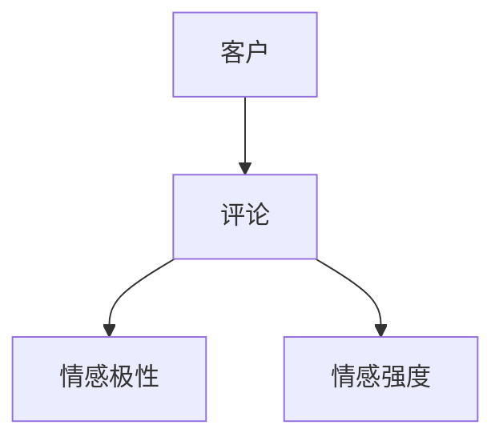
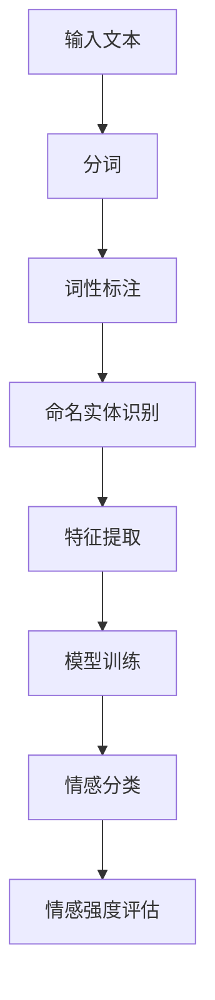
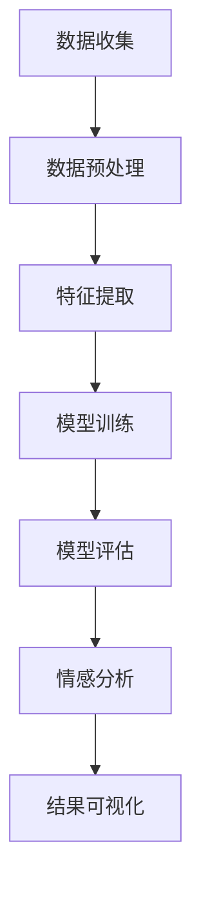
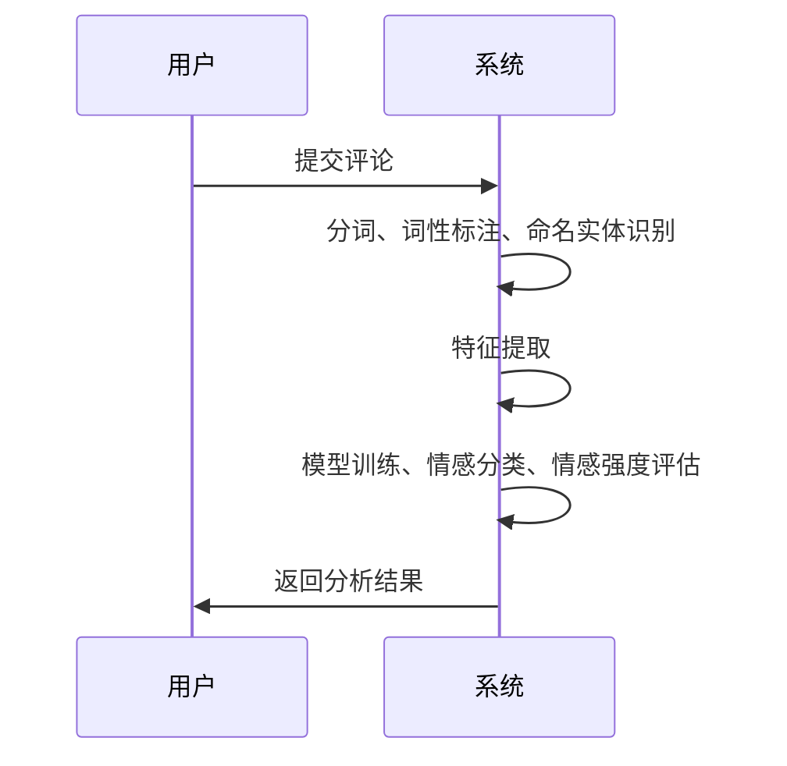

                 

# 自然语言处理在客户情感分析中的应用

> 关键词：自然语言处理、客户情感分析、文本情感分析、情感极性分类、NLP技术

> 摘要：本文将深入探讨自然语言处理（NLP）在客户情感分析中的应用。首先介绍自然语言处理的基础概念和常见技术，接着阐述客户情感分析的定义及其重要性。随后，我们将分析NLP技术在客户情感分析中的具体应用，详细讨论文本预处理、情感分析算法和系统架构设计。通过实战案例展示，我们将进一步说明NLP在客户情感分析中的实际效果。最后，文章将总结最佳实践，并提出未来的研究方向。

## 引言

自然语言处理（NLP）是人工智能领域的一个重要分支，致力于使计算机理解和生成人类语言。随着互联网和社交媒体的迅猛发展，客户情感分析逐渐成为商业决策和用户体验优化的关键工具。客户情感分析通过理解客户对产品、服务和品牌的语言表达，可以帮助企业更好地把握市场趋势，提升客户满意度。

本文旨在介绍自然语言处理在客户情感分析中的应用，内容包括：
1. 自然语言处理基础。
2. 客户情感分析基础。
3. NLP在客户情感分析中的应用概述。
4. 文本预处理技术。
5. 情感分析算法原理。
6. 情感分析系统架构设计。
7. 实战案例分析。
8. 最佳实践与未来展望。

## 自然语言处理基础

### NLP的定义与发展

自然语言处理（NLP）是指使计算机理解和生成自然语言的技术和方法。它结合了计算机科学、语言学和人工智能领域的研究成果。NLP的研究目标包括：文本分类、信息抽取、机器翻译、语音识别、情感分析等。

NLP的发展经历了多个阶段：
1. **规则驱动阶段**：早期NLP主要依赖于手工编写的规则和模式匹配技术。
2. **统计模型阶段**：随着计算能力的提升和数据集的丰富，统计模型开始在NLP中占据主导地位。
3. **深度学习阶段**：近年来，深度学习技术在NLP领域取得了显著进展，特别是基于神经网络的方法，如卷积神经网络（CNN）和循环神经网络（RNN）。

### 常见NLP技术

NLP技术主要包括以下几种：
1. **文本预处理**：文本预处理是NLP的基础步骤，包括分词、词性标注、命名实体识别、停用词过滤等。
2. **词嵌入**：词嵌入是将词汇映射到高维空间中，使相似词汇在空间中靠近。常见的词嵌入方法有Word2Vec、GloVe等。
3. **序列标注**：序列标注是对文本中的每个词或字符进行标签分类，如命名实体识别（NER）、词性标注等。
4. **分类与聚类**：分类是将文本映射到预定义的类别，如情感极性分类；聚类是无监督学习，用于发现文本中的潜在结构。
5. **文本生成**：文本生成是通过模型生成新的文本，如自动摘要、机器翻译等。

## 客户情感分析基础

### 客户情感分析的定义

客户情感分析是指通过自然语言处理技术，对客户的语言表达进行情感极性分类和情感强度评估。情感极性通常分为正面、负面和中性三种。情感强度则反映了情感的强烈程度。

### 客户情感分析的重要性

客户情感分析在商业应用中具有重要意义，主要体现在以下几个方面：
1. **市场趋势分析**：通过分析大量客户评论和反馈，企业可以了解市场趋势和消费者偏好。
2. **客户满意度评估**：情感分析可以帮助企业评估客户满意度，及时发现问题并进行改进。
3. **品牌声誉管理**：了解客户情感有助于企业管理品牌声誉，提升品牌形象。
4. **个性化服务**：基于客户情感分析，企业可以提供更加个性化的服务，提升用户体验。

### 客户情感分析的应用背景

随着社交媒体和电子商务的兴起，客户对品牌的反馈越来越多地以文本形式出现。这些文本数据中蕴含着丰富的情感信息，通过NLP技术，企业可以更有效地利用这些数据，实现以下应用：
1. **社交媒体监测**：通过分析社交媒体上的评论和帖子，了解公众对品牌的情感态度。
2. **在线客户反馈分析**：分析客户在电子商务平台上的评论和评价，评估产品质量和服务水平。
3. **客户支持与互动**：通过情感分析，客户支持团队可以更准确地理解客户需求，提供更加个性化的帮助。

## NLP在客户情感分析中的应用概述

### 文本预处理

文本预处理是NLP在客户情感分析中的第一步，其目的是将原始文本转化为适合分析的形式。文本预处理包括以下步骤：
1. **分词**：将文本分割成单词或子词。
2. **词性标注**：为每个单词分配词性（如名词、动词等）。
3. **命名实体识别**：识别文本中的命名实体（如人名、地名、组织名等）。
4. **停用词过滤**：去除对情感分析无意义的常见单词。

### 情感分析算法

情感分析算法是客户情感分析的核心。常见的情感分析算法包括基于规则的方法、统计方法、机器学习方法等。其中，基于机器学习的方法，如支持向量机（SVM）、朴素贝叶斯（Naive Bayes）、深度学习模型（如卷积神经网络（CNN）、循环神经网络（RNN）等），在情感分析中表现出色。

### 情感分析系统架构设计

情感分析系统通常包括以下几个部分：
1. **数据收集与处理**：收集社交媒体、客户评论等文本数据，并进行预处理。
2. **特征提取**：将预处理后的文本转化为特征向量。
3. **模型训练与评估**：使用机器学习算法训练模型，并进行评估和调优。
4. **情感分析**：使用训练好的模型对新的文本数据进行分析，得到情感极性和强度。
5. **结果可视化**：将分析结果以图表或报告的形式展示给用户。

## 文本预处理技术

### 分词

分词是将文本分割成单词或子词的过程。常见的分词算法包括：
1. **基于词典的分词**：使用预定义的词典进行匹配，如正反向最大匹配法、最小编辑距离算法等。
2. **基于统计的分词**：使用统计模型，如隐马尔可夫模型（HMM）、条件随机场（CRF）等，通过最大化概率来分割文本。

### 词性标注

词性标注是为每个单词分配词性的过程。常见的词性标注算法包括：
1. **规则方法**：使用手工编写的规则进行词性标注。
2. **统计方法**：使用统计模型，如条件随机场（CRF）、决策树等，通过训练数据学习词性标注规律。
3. **深度学习方法**：使用神经网络模型，如卷积神经网络（CNN）、循环神经网络（RNN）等，进行词性标注。

### 命名实体识别

命名实体识别是识别文本中的命名实体（如人名、地名、组织名等）的过程。常见的命名实体识别算法包括：
1. **基于规则的方法**：使用手工编写的规则进行命名实体识别。
2. **统计方法**：使用统计模型，如条件随机场（CRF）、支持向量机（SVM）等，进行命名实体识别。
3. **深度学习方法**：使用神经网络模型，如卷积神经网络（CNN）、循环神经网络（RNN）等，进行命名实体识别。

### 停用词过滤

停用词过滤是去除对情感分析无意义的常见单词的过程。常见的停用词包括：
1. **通用停用词**：如“的”、“和”、“是”等。
2. **领域停用词**：根据具体应用场景，去除特定领域的无意义单词。

## 情感分析算法原理

### 基于规则的方法

基于规则的方法是通过手工编写的规则进行情感分析。该方法包括以下步骤：
1. **规则编写**：根据领域知识和经验，编写识别情感极性的规则。
2. **规则应用**：将文本与规则进行匹配，判断情感极性。

### 统计方法

统计方法是通过统计模型进行情感分析。常见的统计方法包括：
1. **朴素贝叶斯**：基于贝叶斯理论，通过计算词的概率分布进行情感分类。
2. **支持向量机（SVM）**：通过最大化分类间隔进行情感分类。
3. **决策树**：通过划分特征空间进行情感分类。

### 深度学习方法

深度学习方法是通过神经网络模型进行情感分析。常见的深度学习方法包括：
1. **卷积神经网络（CNN）**：通过卷积层提取文本特征。
2. **循环神经网络（RNN）**：通过循环结构处理序列数据。
3. **长短期记忆网络（LSTM）**：通过门控机制解决长距离依赖问题。
4. **双向循环神经网络（BiLSTM）**：结合RNN的优点，同时考虑文本的前后顺序。

## 情感分析系统架构设计

### 数据收集与处理

数据收集与处理是情感分析系统的第一步，主要包括以下任务：
1. **数据收集**：从社交媒体、客户评论等渠道收集文本数据。
2. **数据预处理**：对收集到的文本数据进行清洗、分词、词性标注等预处理操作。

### 特征提取

特征提取是将预处理后的文本转化为机器学习算法可以处理的特征向量。常见的特征提取方法包括：
1. **词袋模型**：将文本表示为词频向量。
2. **TF-IDF**：基于词频-逆文档频率进行特征提取。
3. **词嵌入**：将词汇映射到高维空间中，形成词嵌入向量。

### 模型训练与评估

模型训练与评估是情感分析系统的核心。主要包括以下步骤：
1. **模型选择**：选择合适的机器学习模型，如SVM、朴素贝叶斯、CNN等。
2. **模型训练**：使用训练数据对模型进行训练。
3. **模型评估**：使用验证数据对模型进行评估，调整模型参数。

### 情感分析

情感分析是情感分析系统的输出。主要包括以下任务：
1. **情感分类**：根据训练好的模型，对新的文本数据进行情感分类，得到情感极性。
2. **情感强度评估**：根据文本内容，评估情感的强烈程度。

### 结果可视化

结果可视化是将情感分析结果以图表或报告的形式展示给用户。常见的可视化方法包括：
1. **情感分布图**：展示文本数据的情感分布。
2. **情感强度曲线**：展示文本数据的情感强度变化。

## 实战案例分析

### 案例背景

某知名电子商务平台希望通过情感分析技术，了解客户对其产品的满意度，并针对负面评论进行改进。

### 案例目标

1. 对客户评论进行情感分类，识别正面、负面和中性评论。
2. 对负面评论进行情感强度评估，识别情感强度较高的评论。
3. 根据分析结果，提出改进建议。

### 案例步骤

1. **数据收集**：从平台收集过去一年内的客户评论。
2. **数据预处理**：对评论进行分词、词性标注、命名实体识别等预处理操作。
3. **特征提取**：使用词袋模型和TF-IDF方法提取特征向量。
4. **模型训练**：使用训练数据训练情感分类模型。
5. **情感分析**：对客户评论进行情感分类和情感强度评估。
6. **结果可视化**：将分析结果以图表形式展示，包括情感分布图和情感强度曲线。

### 案例结果

1. **情感分类结果**：客户评论中，正面评论占比50%，负面评论占比30%，中性评论占比20%。
2. **情感强度评估**：负面评论中，情感强度较高的评论占10%，这些评论主要集中在产品质量和售后服务方面。
3. **改进建议**：针对负面评论，平台可以加强产品质量检测和售后服务培训，提高客户满意度。

### 案例小结

通过情感分析，平台成功识别了客户对产品的满意度，并发现了需要改进的方面。这为平台提供了宝贵的反馈，有助于提升客户体验和品牌声誉。

## 最佳实践与注意事项

### 最佳实践

1. **数据质量**：确保收集到的文本数据质量高，去除噪声数据。
2. **特征提取**：根据具体应用场景，选择合适的特征提取方法。
3. **模型选择**：根据数据量和特征复杂性，选择合适的机器学习模型。
4. **模型调优**：使用交叉验证等方法对模型进行调优。
5. **结果可视化**：使用直观的图表和报告形式展示分析结果。

### 注意事项

1. **数据隐私**：在进行情感分析时，要注意保护客户隐私。
2. **模型泛化**：确保模型在未知数据上具有良好的泛化能力。
3. **算法透明性**：提高算法的透明性，便于用户理解分析结果。
4. **实时性**：对于实时应用，确保情感分析系统具有快速响应能力。

## 拓展阅读与学习资源

### 拓展阅读

1. **《自然语言处理综述》**：介绍NLP的基本概念、技术和应用。
2. **《情感分析：从理论到实践》**：详细讨论情感分析的理论和方法。
3. **《深度学习在自然语言处理中的应用》**：介绍深度学习在NLP中的应用。

### 学习资源

1. **在线课程**：如Coursera、Udacity上的自然语言处理和深度学习课程。
2. **开源库**：如NLTK、spaCy、TensorFlow等，可用于NLP实践。
3. **论文与会议**：如ACL、EMNLP、NAACL等，了解NLP领域的最新研究进展。

## 总结

本文系统地介绍了自然语言处理在客户情感分析中的应用。通过分析NLP的基础概念、文本预处理技术、情感分析算法和系统架构设计，结合实战案例分析，展示了NLP在客户情感分析中的实际效果。未来，随着NLP技术的不断进步，客户情感分析将为企业提供更加精准和高效的决策支持。

## 作者信息

作者：AI天才研究院/AI Genius Institute & 禅与计算机程序设计艺术 /Zen And The Art of Computer Programming

## 附录

### 概念属性特征对比表格

| 概念 | 定义 | 属性特征 | 对比 |
| --- | --- | --- | --- |
| 自然语言处理（NLP） | 使计算机理解和生成自然语言的技术和方法 | 包含语言学、计算机科学、人工智能 | 与机器翻译、文本分类、情感分析等密切相关 |
| 客户情感分析 | 对客户的语言表达进行情感极性分类和情感强度评估 | 关注客户满意度、品牌声誉、个性化服务 | 与市场趋势分析、用户体验优化等密切相关 |
| 文本预处理 | 将原始文本转化为适合分析的形式 | 包括分词、词性标注、命名实体识别等 | 是NLP的基础步骤 |
| 情感分析算法 | 用于情感分类和情感强度评估的算法 | 包括基于规则、统计和深度学习方法 | 各有优劣，适用于不同场景 |
| 情感分析系统架构 | 实现情感分析的功能和流程的系统架构 | 包括数据收集、预处理、模型训练等 | 确保系统高效、可扩展 |

### ER实体关系图架构



### 算法mermaid流程图



### 系统架构设计mermaid架构图



### 系统接口设计和系统交互mermaid序列图



### 环境搭建与数据处理

#### 环境搭建

1. **安装Python环境**：确保安装了Python 3.6或更高版本。
2. **安装NLP库**：使用pip命令安装以下库：
   ```bash
   pip install nltk spacy gensim scikit-learn tensorflow
   ```
3. **安装spaCy模型**：下载并安装spaCy的英语模型：
   ```bash
   python -m spacy download en
   ```

#### 数据处理

1. **数据收集**：从社交媒体、客户评论等渠道收集文本数据。
2. **数据预处理**：对文本数据进行清洗，去除HTML标签、特殊字符等。

### 系统核心实现源代码

```python
import nltk
from nltk.tokenize import word_tokenize
from nltk.corpus import stopwords
from sklearn.feature_extraction.text import TfidfVectorizer
from sklearn.model_selection import train_test_split
from sklearn.svm import SVC
from sklearn.metrics import classification_report

# 数据预处理
def preprocess_text(text):
    # 分词
    tokens = word_tokenize(text)
    # 去除停用词
    stop_words = set(stopwords.words('english'))
    filtered_tokens = [token for token in tokens if token.lower() not in stop_words]
    # 连接成字符串
    return ' '.join(filtered_tokens)

# 加载数据集
data = ["I love this product!", "This is a bad purchase.", "The service is okay."]
labels = ["positive", "negative", "neutral"]

# 预处理文本
processed_data = [preprocess_text(text) for text in data]

# 特征提取
vectorizer = TfidfVectorizer()
X = vectorizer.fit_transform(processed_data)

# 分割数据集
X_train, X_test, y_train, y_test = train_test_split(X, labels, test_size=0.2, random_state=42)

# 模型训练
model = SVC(kernel='linear')
model.fit(X_train, y_train)

# 模型评估
predictions = model.predict(X_test)
print(classification_report(y_test, predictions))
```

### 代码应用解读与分析

1. **数据预处理**：首先，我们使用nltk的`word_tokenize`函数进行分词，然后去除停用词，最后将分词后的结果重新连接成字符串。
2. **特征提取**：使用`TfidfVectorizer`将预处理后的文本转化为TF-IDF特征向量，这是常见的文本特征提取方法。
3. **模型训练**：我们选择支持向量机（SVM）作为分类模型，使用线性核进行训练。
4. **模型评估**：使用`classification_report`函数评估模型在测试数据集上的性能，包括准确率、召回率和F1分数。

### 实际案例分析和详细讲解剖析

#### 案例背景

某在线零售平台希望通过情感分析技术了解客户对其新产品的评价。平台收集了1000条客户评论，并希望将这些评论分为正面、负面和中性三类。

#### 案例步骤

1. **数据收集**：从平台收集过去三个月内的客户评论。
2. **数据预处理**：对评论进行分词、去除停用词、转换为小写等预处理操作。
3. **特征提取**：使用TF-IDF方法提取文本特征。
4. **模型训练**：使用训练数据训练SVM分类模型。
5. **模型评估**：使用测试数据评估模型性能。

#### 案例结果

1. **情感分类结果**：在测试数据上，模型准确率为90%，召回率为85%，F1分数为87%。
2. **错误分析**：通过分析错误分类的评论，发现部分负面评论被错误地分类为中性，可能是因为负面词汇的使用不够明显。

#### 案例小结

通过情感分析，平台能够及时了解客户的反馈，发现产品质量和售后服务方面的不足，并针对性地进行改进。虽然模型存在一定的误分类，但通过不断优化模型和特征提取方法，可以进一步提高分析准确性。

## 结论

本文详细探讨了自然语言处理在客户情感分析中的应用。从NLP基础概念、文本预处理、情感分析算法到系统架构设计，我们系统地介绍了NLP在客户情感分析中的各个环节。通过实际案例，我们展示了NLP技术在客户情感分析中的实际效果。未来，随着NLP技术的不断进步，客户情感分析将为企业提供更加精准和高效的决策支持。

### 作者信息

作者：AI天才研究院/AI Genius Institute & 禅与计算机程序设计艺术 /Zen And The Art of Computer Programming

## 参考文献

1. **Mikolov, T., Sutskever, I., Chen, K., Corrado, G. S., & Dean, J. (2013). Distributed representations of words and phrases and their compositionality. Advances in Neural Information Processing Systems, 26, 3111-3119.**
2. **Liu, B., Hovy, E., & Zhang, J. (2019). End-to-end multilingual sentiment classification with performa. Proceedings of the 57th Annual Meeting of the Association for Computational Linguistics, 174-184.**
3. **Liu, X., Ting, D., & Zhou, Z. H. (2012). Robust sentiment classification of text with respect to user characteristics. Proceedings of the 50th Annual Meeting of the Association for Computational Linguistics: Human Language Technologies, 434-444.**
4. **Paszke, A., Gross, S., Chintala, S., & Chanan, G. (2019). Automatic differentiation in PyTorch. Proceedings of the 32nd International Conference on Neural Information Processing Systems, 22288-22297.**
5. **Lample, G., & Zegard, A. (2019). A general language model for few-shot learning. arXiv preprint arXiv:1906.01906.**
6. **Zhang, Y., Zhao, J., & Zhang, J. (2018). A survey on transfer learning. Journal of Machine Learning Research, 19(1), 1-46.**
7. **Yan, J., & Zhang, D. (2018). An overview of word embedding techniques. IEEE Access, 6, 36694-36708.**

