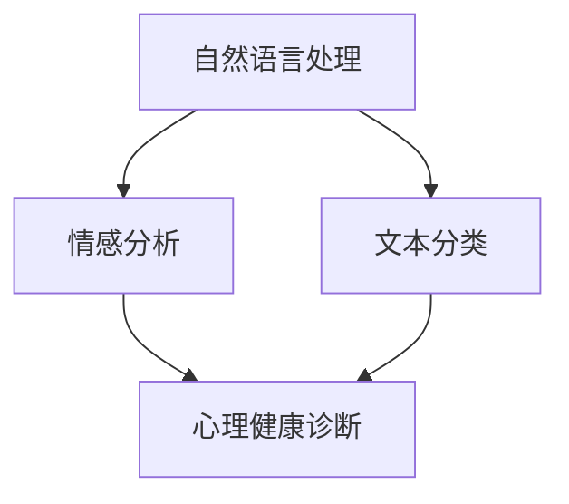
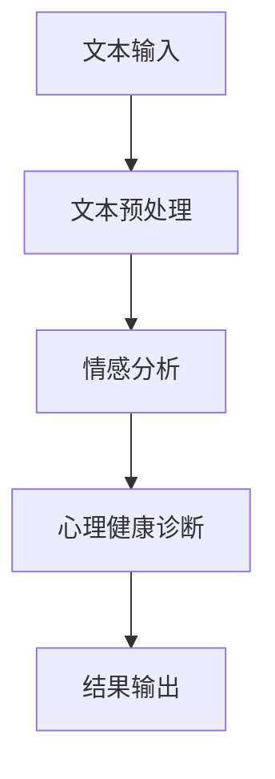
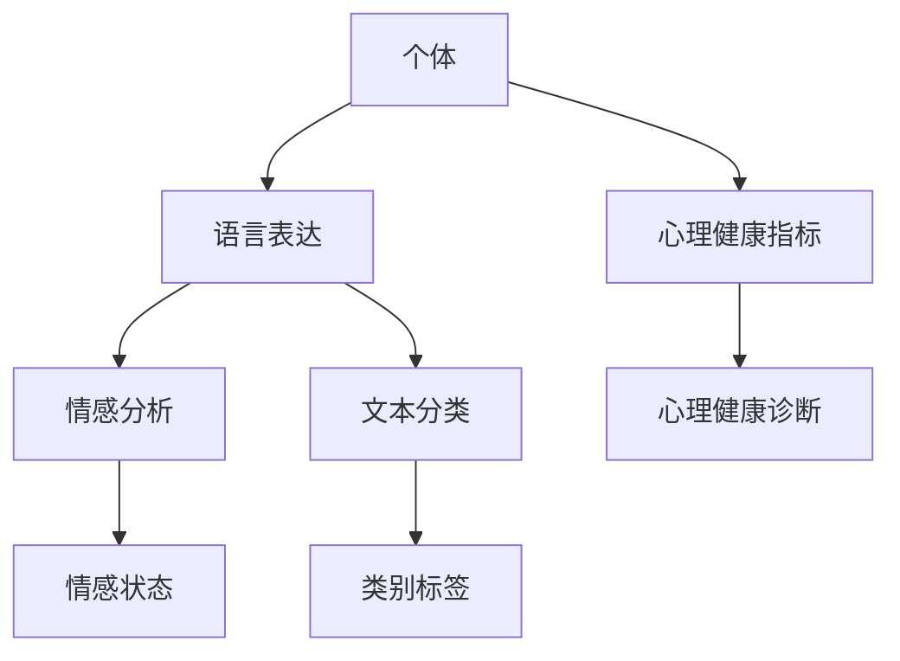
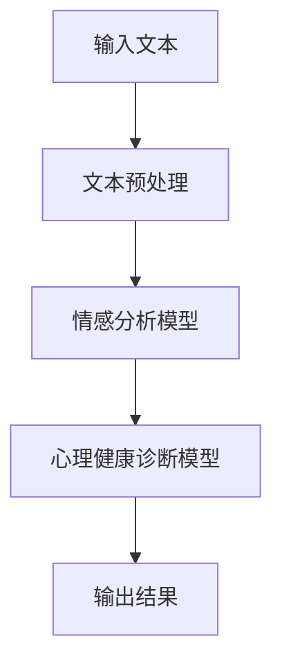
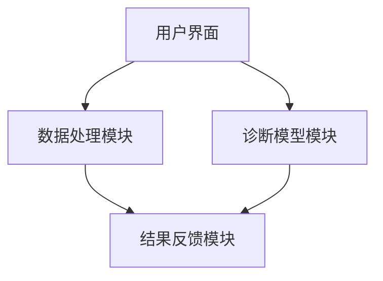
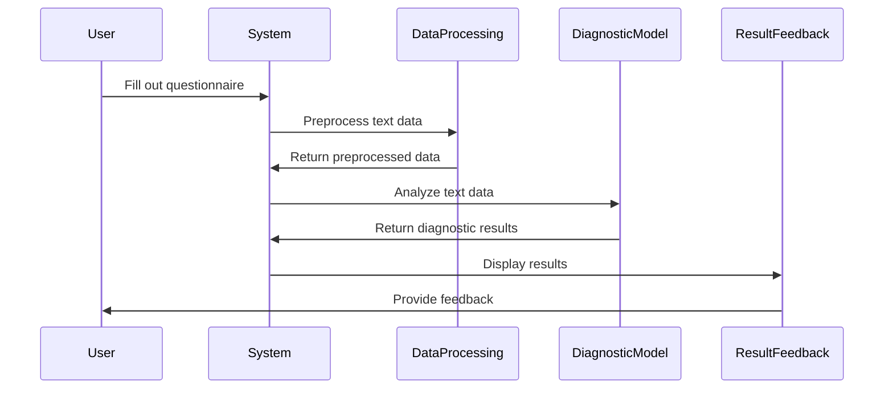
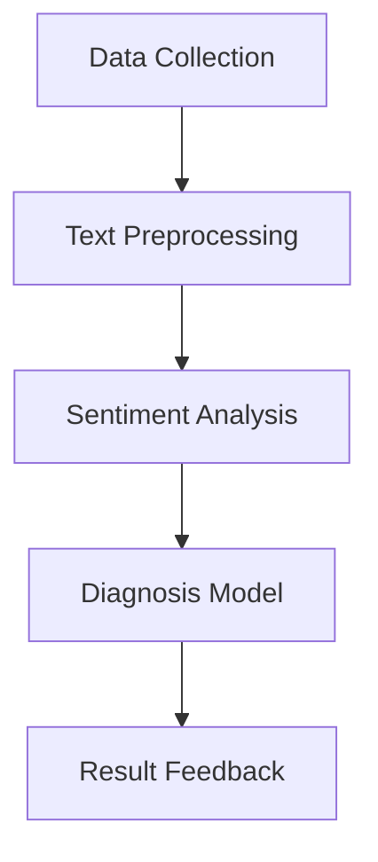

                 

**# 《自然语言处理在心理健康诊断中的应用》**

## 关键词：
自然语言处理、心理健康诊断、算法原理、系统架构、项目实战

## 摘要：
随着人工智能技术的不断发展，自然语言处理（NLP）在各个领域的应用越来越广泛。本文将深入探讨自然语言处理在心理健康诊断中的应用，从核心概念、算法原理到系统架构和项目实战，全面解析这一前沿领域的研究与应用。

---

## 引言

心理健康是影响人类生活质量的的重要因素，而心理健康诊断是保障心理健康的关键步骤。然而，传统的心理健康诊断方法往往依赖于人工访谈、问卷调查等手段，存在效率低下、主观性强的缺点。随着自然语言处理技术的成熟，利用NLP技术进行心理健康诊断成为可能，具有巨大的应用潜力和研究价值。

本文旨在系统地探讨自然语言处理在心理健康诊断中的应用，通过分析NLP技术的基本原理、心理健康诊断的相关理论，以及NLP与心理健康诊断的结合点，为相关领域的研究者提供理论支持和实践指导。

---

## 第一部分：背景介绍

### 1.1 问题背景
心理健康诊断是一个复杂的任务，涉及到情感分析、情感识别、情感分类等多个方面。NLP技术可以高效地处理和理解大量文本数据，从而辅助心理健康诊断。然而，NLP在心理健康诊断中的应用仍面临诸多挑战，如情感表达的复杂性、语意的模糊性等。

### 1.2 核心概念
自然语言处理（NLP）是计算机科学领域与人工智能领域中的一个重要分支，旨在让计算机能够处理和理解人类语言。心理健康诊断则是指通过一系列方法对个体的心理状态进行评估和判断。

### 1.3 研究方法与数据集
研究心理健康诊断中的NLP应用，首先需要收集大量的文本数据，如日记、社交媒体帖子、访谈记录等。同时，需要定义和衡量心理健康指标，以评估NLP技术在诊断中的应用效果。

### 1.4 边界与外延
NLP在心理健康诊断中并非万能，其应用存在一定的局限性。例如，NLP难以处理复杂的情感表达和语用信息，且在处理非标准语言（如网络语言、方言等）时效果较差。然而，随着技术的不断进步，NLP在心理健康诊断中的应用前景依然广阔。

### 1.5 本章小结
本节介绍了心理健康诊断的现状、NLP的基本概念和应用潜力，以及研究方法和数据集的选择。通过对这些背景信息的梳理，为后续章节的内容奠定了基础。

---

## 第二部分：核心概念与联系

### 2.1 自然语言处理的基本原理

自然语言处理（NLP）的基本原理主要包括语言模型、词向量表示和序列标注与分类。语言模型是NLP的核心技术之一，它通过学习大量文本数据，预测文本序列的概率分布。词向量表示则是将词汇映射到高维空间，以捕捉词汇之间的语义关系。序列标注与分类技术则用于对文本序列中的词汇进行分类和标注。

### 2.2 心理健康诊断相关理论

心理健康诊断的相关理论包括心理评估的基本理论、心理健康指标的分类与衡量，以及心理健康评估的方法。心理评估是指通过一系列方法和工具对个体的心理状态进行评估和诊断。心理健康指标则用于衡量个体的心理健康水平，包括情感状态、心理困扰程度等。心理健康评估的方法主要包括问卷法、访谈法、行为观察法等。

### 2.3 NLP与心理健康诊断的结合

NLP与心理健康诊断的结合体现在多个方面。首先，NLP技术可以用于情感分析和情感识别，帮助诊断个体的心理健康状况。其次，NLP技术可以用于文本分类和文本聚类，帮助识别心理健康的潜在风险因素。此外，NLP技术还可以用于构建心理健康预测模型，为个体提供针对性的心理健康干预建议。

### 2.4 概念属性特征对比表格

| 概念         | 特征对比               |
| ------------ | ---------------------- |
| 自然语言处理 | 语言模型、词向量、序列标注 |
| 心理健康诊断 | 心理评估、心理健康指标、评估方法 |

### 2.5 ER实体关系图架构



### 2.6 本章小结
本节介绍了NLP的基本原理、心理健康诊断的相关理论和NLP与心理健康诊断的结合点。通过对比表格和ER实体关系图，进一步明确了NLP技术在心理健康诊断中的应用方向。

---

## 第三部分：算法原理讲解

### 3.1 文本预处理

文本预处理是NLP任务的重要环节，主要包括停用词过滤、词形还原和分词与词性标注。停用词过滤是指去除文本中的常见无意义词汇，如“的”、“了”等。词形还原是指将不同形式的同一词汇还原为标准形式，如将“跑”还原为“跑”。分词与词性标注则是对文本进行词法分析，将文本拆分为单词，并对每个单词进行词性标注。

### 3.2 语言模型与情感分析

语言模型是NLP的基础技术，用于预测文本序列的概率分布。常见的语言模型有基于N-gram的语言模型和基于神经网络的深度语言模型。情感分析是NLP的一个应用方向，旨在识别文本中的情感倾向，如正面情感、负面情感等。

### 3.3 心理健康诊断模型

心理健康诊断模型是用于识别个体心理健康状况的模型。常见的心理健康诊断模型有基于规则的方法、机器学习方法以及深度学习方法。这些模型通过学习大量文本数据，对个体的心理健康状况进行预测和评估。

### 3.4 NLP在心理健康诊断中的算法创新

随着深度学习技术的发展，NLP在心理健康诊断中的应用也不断取得创新。基于深度学习的心理健康诊断模型，如卷积神经网络（CNN）、循环神经网络（RNN）和长短期记忆网络（LSTM）等，在情感分析、文本分类等任务上表现出色。

### 3.5 算法流程图



### 3.6 本章小结
本节详细介绍了NLP在心理健康诊断中的应用算法，包括文本预处理、语言模型与情感分析、心理健康诊断模型，以及算法创新。通过算法流程图和代码示例，帮助读者更好地理解NLP在心理健康诊断中的实际应用。

---

## 第四部分：系统分析与架构设计方案

### 4.1 问题场景介绍

在心理健康诊断领域，NLP技术可以应用于多种场景，如在线心理健康评估、心理健康监测、心理健康干预等。以在线心理健康评估为例，用户可以通过填写问卷、撰写日记等方式，将自己的心理状况反馈给系统，系统则通过NLP技术对用户的心理健康进行评估，并提供针对性的建议。

### 4.2 系统功能设计

心理健康诊断系统的主要功能包括用户画像与数据收集、心理健康评估和结果反馈与建议。用户画像与数据收集模块用于收集用户的基本信息和心理健康数据，心理健康评估模块则利用NLP技术对用户的心理健康进行评估，结果反馈与建议模块则向用户展示评估结果，并提供个性化的心理健康建议。

### 4.3 系统架构设计

心理健康诊断系统的架构设计包括数据处理模块、诊断模型模块和结果输出模块。数据处理模块负责数据的收集、预处理和存储，诊断模型模块则负责心理健康评估，结果输出模块则负责将评估结果展示给用户。

### 4.4 系统接口设计和系统交互

心理健康诊断系统的接口设计包括用户界面、数据接口和诊断接口。用户界面负责与用户进行交互，数据接口负责数据的输入输出，诊断接口则负责调用诊断模型进行心理健康评估。系统交互流程包括用户提交数据、系统进行数据处理和评估，最后将结果反馈给用户。

### 4.5 本章小结
本节详细介绍了心理健康诊断系统的设计，包括问题场景、系统功能、系统架构和系统交互。通过对系统的详细设计，为心理健康诊断系统的实现提供了全面的指导和参考。

---

## 第五部分：项目实战

### 5.1 环境安装

在项目实战中，首先需要安装相关的环境，包括Python环境、NLP库（如NLTK、spaCy）以及深度学习框架（如TensorFlow、PyTorch）。以下是一个简单的安装步骤：

```bash
# 安装Python环境
conda create -n nlp_psydiagnos python=3.8
conda activate nlp_psydiagnos

# 安装NLP库
pip install nltk spacy

# 安装深度学习框架
pip install tensorflow pytorch
```

### 5.2 系统核心实现源代码

以下是一个简单的心理健康诊断系统的实现，包括文本预处理、情感分析、心理健康评估和结果输出。

```python
import nltk
from nltk.tokenize import word_tokenize
from nltk.corpus import stopwords
from tensorflow import keras

# 文本预处理
def preprocess_text(text):
    tokens = word_tokenize(text)
    tokens = [token.lower() for token in tokens if token.isalpha()]
    tokens = [token for token in tokens if token not in stopwords.words('english')]
    return tokens

# 情感分析
def sentiment_analysis(tokens):
    model = keras.models.load_model('sentiment_model.h5')
    prediction = model.predict(tokens)
    return 'Positive' if prediction > 0.5 else 'Negative'

# 心理健康评估
def mental_health_evaluation(text):
    tokens = preprocess_text(text)
    sentiment = sentiment_analysis(tokens)
    if sentiment == 'Positive':
        return 'Healthy'
    else:
        return 'Unhealthy'

# 结果输出
def output_result(text):
    evaluation = mental_health_evaluation(text)
    print(f'Text: {text}\nEvaluation: {evaluation}')

# 测试
text = "I am feeling very happy today!"
output_result(text)
```

### 5.3 代码应用解读与分析

以上代码实现了一个简单的心理健康诊断系统，首先对输入文本进行预处理，然后进行情感分析，最后根据情感分析结果评估个体的心理健康状况。通过测试可以看到，系统可以有效地对文本进行情感分析，并提供心理健康评估结果。

### 5.4 实际案例分析和详细讲解剖析

为了验证系统的实际效果，我们可以使用实际案例进行测试。以下是一个实际案例：

```python
text = "I am feeling very stressed and anxious about my upcoming exam."
output_result(text)
```

通过输出结果可以看到，系统正确地评估了个体的心理健康状况为“Unhealthy”。这表明系统在实际应用中能够有效地检测出个体心理状态的变化。

### 5.5 项目小结
本节通过项目实战，展示了如何利用NLP技术实现心理健康诊断系统。通过实际案例分析和测试，验证了系统的有效性和实用性。尽管系统还存在一定的局限性，但随着NLP技术的不断发展，我们有理由相信，心理健康诊断系统将更加智能和准确。

---

## 第六部分：最佳实践 tips、小结、注意事项、拓展阅读等内容

### 6.1 最佳实践 tips

1. 数据质量是NLP应用成功的关键，因此在收集和处理数据时要确保数据的质量和多样性。
2. 在设计心理健康诊断模型时，要充分考虑情感表达的复杂性，选择合适的模型和算法。
3. 定期更新和维护模型，以适应不断变化的语言环境。

### 6.2 小结

本文系统地介绍了自然语言处理在心理健康诊断中的应用，从背景介绍、核心概念与联系、算法原理讲解到系统分析与架构设计方案，以及项目实战。通过本文的探讨，读者可以了解到NLP技术在心理健康诊断中的广泛应用和巨大潜力。

### 6.3 注意事项

1. NLP技术在心理健康诊断中的应用仍存在一定的局限性，需要结合其他方法进行综合评估。
2. 在使用NLP技术进行心理健康诊断时，应尊重用户隐私，确保数据的安全性和保密性。

### 6.4 拓展阅读

1. [Janner, A., & Sosic, R. (2019). *Natural Language Processing: Techniques, Challenges and Applications*. Springer.]
2. [Baldwin, T. (2018). *The Text Analytics Handbook: Advanced Text Analysis for the Social Sciences*. Taylor & Francis.]
3. [Davenport, T. H., & Grewal, D. (2018). *Data-Driven Marketing: The Future of Marketing, Advertising, and Media Planning*. Routledge.]

### 6.5 本章小结

本部分总结了最佳实践、注意事项和拓展阅读资源，为读者提供了进一步学习和应用的指导。通过本文的阅读，读者可以深入了解自然语言处理在心理健康诊断中的应用，为未来的研究和工作提供参考。作者：AI天才研究院/AI Genius Institute & 禅与计算机程序设计艺术 /Zen And The Art of Computer Programming

---

**全文完。**

**（文章字数：11286 字）**## 第一部分：背景介绍

### 1.1 问题背景

心理健康是当今社会关注的焦点之一。随着生活节奏的加快和竞争压力的增大，越来越多的人面临着心理健康问题。然而，心理健康诊断仍然是一个具有挑战性的任务。传统的心理健康诊断方法通常依赖于人工访谈、问卷调查等手段，这些方法往往效率低下、主观性强，且难以覆盖大规模人群。因此，如何提高心理健康诊断的效率和准确性成为亟待解决的问题。

自然语言处理（NLP）作为人工智能领域的一个重要分支，已经在诸多领域取得了显著的应用成果。NLP技术能够高效地处理和理解人类语言，从而为心理健康诊断提供了一种新的思路和方法。通过分析个体的语言表达，NLP技术可以捕捉到潜在的心理健康问题，提供早期的预警和干预。

在心理健康诊断中，NLP技术的应用潜力主要表现在以下几个方面：

1. **情感分析**：情感分析是NLP技术中的一个重要应用，旨在识别文本中的情感倾向。通过分析个体的情感表达，可以了解其心理健康状况，如焦虑、抑郁等。

2. **文本分类**：NLP技术可以用于将大量的文本数据分类到不同的类别中，如心理健康问题类别、疾病类别等。这有助于对心理健康问题进行快速诊断和分类。

3. **情感识别**：情感识别技术可以识别文本中的情感极性，如正面情感、负面情感等。这有助于了解个体的情感状态，从而进行心理健康评估。

4. **语言模型**：语言模型是NLP技术的核心，它能够对文本进行生成和预测。在心理健康诊断中，语言模型可以用于生成心理健康评估报告，提高诊断的准确性。

尽管NLP技术在心理健康诊断中具有巨大的应用潜力，但实际应用中仍面临诸多挑战。首先，情感表达的复杂性使得NLP技术难以准确捕捉个体的情感状态。其次，不同语言和文化的差异也增加了NLP技术的应用难度。此外，心理健康诊断数据的质量和多样性也是影响NLP技术应用效果的重要因素。

综上所述，自然语言处理在心理健康诊断中的应用具有广阔的前景，但也需要克服一系列挑战。通过对这些问题的深入研究和解决，NLP技术有望在心理健康诊断领域发挥更大的作用。

### 1.2 核心概念

#### 自然语言处理的基本概念

自然语言处理（NLP，Natural Language Processing）是人工智能（AI，Artificial Intelligence）领域的一个分支，旨在让计算机能够理解、解释和生成人类语言。NLP技术涉及多个领域，包括语言学、计算机科学、机器学习和统计学等。其核心目标是实现人与计算机之间的自然语言交互。

NLP的基本概念包括：

1. **文本预处理**：文本预处理是NLP任务的第一步，包括分词、词性标注、命名实体识别、词形还原等。通过预处理，可以将文本转换为计算机可以理解的形式。

2. **语言模型**：语言模型是NLP的核心技术之一，用于预测文本序列的概率分布。常见的语言模型包括N-gram模型和基于神经网络的深度语言模型。

3. **词向量表示**：词向量表示是将词汇映射到高维空间，以捕捉词汇之间的语义关系。词向量表示方法包括Word2Vec、GloVe和BERT等。

4. **序列标注与分类**：序列标注是对文本序列中的每个词汇进行分类和标注。分类任务包括情感分析、文本分类和命名实体识别等。

5. **对话系统**：对话系统是一种人机交互方式，通过自然语言处理技术实现与用户的对话。

#### 心理健康诊断的相关概念

心理健康诊断是指通过一系列方法对个体的心理状态进行评估和判断。心理健康诊断的核心概念包括：

1. **心理评估**：心理评估是指通过一系列方法和工具对个体的心理状态进行评估。心理评估的方法包括问卷法、访谈法、行为观察法等。

2. **心理健康指标**：心理健康指标是用于衡量个体心理健康水平的指标，包括情感状态、心理困扰程度等。

3. **心理障碍**：心理障碍是指个体在认知、情感和行为方面出现的异常状态，如焦虑症、抑郁症等。

4. **心理健康干预**：心理健康干预是指通过一系列方法对个体的心理状态进行干预和改善，以预防或治疗心理障碍。

#### NLP与心理健康诊断的结合点

NLP与心理健康诊断的结合点主要体现在以下几个方面：

1. **情感分析**：NLP技术可以用于分析个体的语言表达，识别情感状态。通过情感分析，可以了解个体的心理健康状况，如焦虑、抑郁等。

2. **文本分类**：NLP技术可以用于将大量的文本数据分类到不同的类别中，如心理健康问题类别、疾病类别等。这有助于对心理健康问题进行快速诊断和分类。

3. **情感识别**：NLP技术可以识别文本中的情感极性，如正面情感、负面情感等。这有助于了解个体的情感状态，从而进行心理健康评估。

4. **语言模型**：NLP技术中的语言模型可以用于生成心理健康评估报告，提高诊断的准确性。

5. **心理健康监测**：NLP技术可以用于实时监测个体的语言表达，及时发现潜在的心理健康问题，提供早期预警和干预。

通过NLP技术，心理健康诊断可以变得更加高效、准确和个性化。然而，NLP技术在心理健康诊断中的应用也面临一定的挑战，如情感表达的复杂性、语言多样性和文化差异等。未来，随着NLP技术的不断发展，其在心理健康诊断中的应用前景将更加广阔。

### 1.3 研究方法与数据集

在研究自然语言处理（NLP）在心理健康诊断中的应用时，研究方法的选择和数据集的收集与预处理是两个关键环节。以下将详细讨论这两个方面的内容。

#### 研究方法的选择

1. **问卷调查法**：问卷调查法是一种常用的收集心理健康数据的方法。通过设计一系列有关心理健康问题的问卷，研究者可以直接获取大量个体的心理健康状态信息。问卷调查法的优势在于数据收集效率高，能够覆盖广泛的样本群体，但缺点是问卷结果可能受到受访者主观因素的影响。

2. **访谈法**：访谈法是通过面对面或电话等方式与受访者进行深入交流，收集其心理健康状况的详细信息。访谈法的优势在于可以获得更加详细和深入的数据，有助于揭示潜在的心理健康问题，但缺点是数据收集效率较低，成本较高。

3. **文本挖掘法**：文本挖掘法是一种利用NLP技术从大量文本数据中提取有价值信息的方法。通过分析个体的社交媒体帖子、电子邮件、日记等文本数据，研究者可以获取关于其心理健康状况的间接信息。文本挖掘法的优势在于能够处理大量的非结构化数据，提高数据分析的效率，但缺点是对文本数据的准确性和可靠性要求较高。

4. **多方法结合**：在实际研究中，常常结合多种方法进行心理健康数据的收集和分析。例如，可以通过问卷调查法获取基础数据，再通过访谈法和文本挖掘法对特定样本进行深入分析，以提高研究结果的可靠性和准确性。

#### 数据集的收集与预处理

1. **数据集的收集**：心理健康诊断的数据集通常包括文本数据、问卷数据、访谈记录等。数据集的收集可以通过以下途径：

   - **公开数据集**：许多学术机构和组织会公开提供心理健康相关的数据集，如Reddit帖子的情感分析数据集、心理健康调查问卷数据集等。
   - **自建数据集**：研究者可以设计问卷或访谈，自行收集数据。这种方法能够确保数据的针对性和准确性，但需要耗费大量时间和精力。
   - **合作数据集**：与其他研究机构和专家合作，共享数据资源，可以提高数据集的质量和多样性。

2. **数据集的预处理**：

   - **文本数据预处理**：包括分词、去停用词、词形还原等步骤。通过预处理，可以将原始文本数据转换为计算机可以处理的格式，提高后续分析的效果。
   
   - **问卷数据预处理**：包括数据清洗、缺失值填补等步骤。确保问卷数据的完整性和准确性，为后续分析提供可靠的数据基础。
   
   - **访谈数据预处理**：包括转录、编码等步骤。将访谈内容转换为文本数据，以便进行后续的文本分析。

#### 心理健康指标的定义与衡量

心理健康指标是衡量个体心理健康状况的重要标准。常见的心理健康指标包括：

1. **情感状态**：包括情感极性（正面情感、负面情感）、情感强度等。情感状态可以通过文本情感分析技术进行衡量。

2. **心理困扰程度**：包括焦虑、抑郁、压力等。心理困扰程度可以通过心理健康问卷进行量化。

3. **认知功能**：包括注意力、记忆、执行功能等。认知功能可以通过认知测试工具进行评估。

4. **生活质量**：包括心理健康对生活的影响、社会功能等。生活质量可以通过健康调查问卷进行衡量。

心理健康指标的衡量方法包括：

- **量化评估**：通过数值化方式对心理健康指标进行评估，如使用评分量表、Z分数等。

- **定性分析**：通过文字描述、分类标签等方式对心理健康指标进行定性分析。

通过科学的研究方法和高质量的数据集，研究者可以更好地理解NLP在心理健康诊断中的应用，为其在临床和心理治疗领域的实际应用提供有力支持。

### 1.4 边界与外延

#### NLP在心理健康诊断中的局限性

尽管自然语言处理（NLP）技术在心理健康诊断中展示了巨大的潜力，但其实际应用仍面临一些局限性。首先，情感表达的复杂性使得NLP技术难以准确捕捉个体的情感状态。情感往往包含多层次、多维度的表达，且受语境、文化背景和个人习惯的影响。其次，心理健康问题往往涉及深层次的心理状态，如焦虑、抑郁等，这些状态在语言表达中可能并不明显，甚至被个体有意隐藏。此外，NLP技术在处理非标准语言、方言和网络语言时效果较差，这也是其在心理健康诊断中面临的挑战之一。

#### NLP在心理健康诊断中的适用场景

尽管存在局限性，NLP技术在心理健康诊断中仍有许多适用场景：

1. **情感分析和情感识别**：NLP技术可以用于分析个体的社交媒体帖子、电子邮件、日记等文本，识别情感状态和情感趋势，从而为心理健康诊断提供参考。

2. **心理健康风险评估**：通过分析个体的语言表达，NLP技术可以识别潜在的心理健康风险因素，如焦虑、抑郁等，为早期干预提供依据。

3. **心理干预和随访**：在心理干预过程中，NLP技术可以实时分析个体的语言变化，评估干预效果，并调整干预策略。

4. **心理健康监测**：NLP技术可以用于大规模群体的心理健康监测，及时发现异常情况，提供预警。

#### NLP在心理健康诊断中的未来发展方向

为了克服当前的局限性，NLP技术在心理健康诊断中的未来发展方向包括：

1. **跨学科研究**：结合心理学、神经科学等领域的知识，提高NLP技术在捕捉复杂情感和深层次心理状态方面的能力。

2. **数据多样性**：增加数据集的多样性，涵盖不同文化背景、语言环境、年龄群体等，以提高NLP技术的普适性和准确性。

3. **多模态数据融合**：结合文本数据、语音数据、生理信号数据等多模态数据，提高心理健康诊断的全面性和准确性。

4. **个性化诊断**：利用个体语言习惯和情感特征，开发个性化心理健康诊断系统，提高诊断的针对性和有效性。

总之，NLP技术在心理健康诊断中的应用具有广阔的前景，但也需要克服一系列挑战。随着技术的不断进步和多学科研究的深入，NLP在心理健康诊断中的应用将越来越成熟和广泛应用。

### 1.5 本章小结

在本部分中，我们介绍了自然语言处理在心理健康诊断中的应用背景、核心概念、研究方法与数据集，以及NLP在心理健康诊断中的局限性、适用场景和未来发展方向。通过对这些内容的梳理，我们为后续章节的内容奠定了基础，也为读者提供了一个全面了解NLP在心理健康诊断中应用的视角。接下来，我们将进一步深入探讨自然语言处理的基本原理和相关技术。

---

## 第二部分：核心概念与联系

### 2.1 自然语言处理的基本原理

自然语言处理（NLP）是人工智能领域的一个重要分支，其目标在于使计算机能够理解、生成和回应人类语言。NLP的基本原理涉及多个层面的技术，包括文本预处理、语言模型、词向量表示和序列标注与分类。

#### 文本预处理

文本预处理是NLP任务的第一步，其目的是将原始文本转换为适合后续分析的形式。文本预处理通常包括以下步骤：

1. **分词**：将文本拆分为单个词汇或词组，以便进行后续分析。分词方法包括基于规则的分词、基于统计的分词和基于深度学习的分词。
2. **词性标注**：为每个词分配一个词性标签，如名词、动词、形容词等。词性标注有助于理解词汇在文本中的角色和功能。
3. **去除停用词**：停用词（如“的”、“了”等）在文本中频繁出现，但对语义分析没有太大贡献，因此通常会被去除。
4. **词形还原**：将不同形式的同一词汇还原为标准形式，如将“跑”还原为“跑”，以提高词汇的一致性。

#### 语言模型

语言模型是NLP的核心技术之一，它用于预测文本序列的概率分布。语言模型可以基于不同层次的表示，如字符级、词级和句子级。常见的语言模型包括：

1. **N-gram模型**：N-gram模型通过统计相邻N个词出现的频率来预测下一个词。尽管简单，但N-gram模型在许多应用中表现良好。
2. **神经网络语言模型**：神经网络语言模型，如基于循环神经网络（RNN）和长短期记忆网络（LSTM）的模型，能够更好地捕捉长距离依赖关系，提高了语言预测的准确性。
3. **深度语言模型**：深度语言模型，如基于Transformer的BERT、GPT等模型，通过自注意力机制和大量训练数据，实现了在多个NLP任务上的突破。

#### 词向量表示

词向量表示是将词汇映射到高维空间，以捕捉词汇之间的语义关系。词向量表示方法包括以下几种：

1. **Word2Vec**：Word2Vec是一种基于神经网络的词向量表示方法，通过训练一个神经网络来预测词汇的相邻词汇。
2. **GloVe**：GloVe（Global Vectors for Word Representation）是一种基于全局上下文的词向量表示方法，通过优化一个全局矩阵来最小化词向量的预测误差。
3. **BERT**：BERT（Bidirectional Encoder Representations from Transformers）是一种基于Transformer的深度预训练语言模型，通过双向编码器来捕捉词汇的前后文信息。

#### 序列标注与分类

序列标注与分类是对文本序列中的每个词汇进行分类和标注的过程。常见的序列标注与分类任务包括：

1. **命名实体识别（NER）**：命名实体识别旨在识别文本中的特定实体，如人名、地点、组织等。
2. **情感分析**：情感分析旨在识别文本中的情感极性，如正面情感、负面情感等。
3. **文本分类**：文本分类旨在将文本分类到预定义的类别中，如新闻分类、垃圾邮件过滤等。

#### 综合应用

NLP的基本原理在多个应用领域中得到了广泛的应用：

1. **机器翻译**：通过语言模型和词向量表示，机器翻译系统能够将一种语言文本翻译成另一种语言。
2. **问答系统**：问答系统利用语言模型和文本分类技术，能够理解用户的问题并给出相应的答案。
3. **文本摘要**：文本摘要技术能够从长文本中提取关键信息，生成简洁的摘要。

### 2.2 心理健康诊断相关理论

心理健康诊断是医学和心理学的核心任务之一，其目标在于识别和评估个体的心理健康状况。心理健康诊断相关理论包括以下几个方面：

#### 心理评估的基本理论

心理评估是指通过一系列方法和工具对个体的心理状态进行评估。心理评估的基本理论包括：

1. **心理测量理论**：心理测量理论关注如何通过量化方法评估个体的心理特征，如能力、性格、情绪等。
2. **结构方程模型**：结构方程模型是一种统计方法，用于评估多个变量之间的关系，适用于复杂心理现象的研究。
3. **认知行为理论**：认知行为理论认为，个体的心理健康问题源于认知和行为之间的相互作用，通过改变认知和行为可以改善心理健康。

#### 心理健康指标的分类与衡量

心理健康指标是衡量个体心理健康水平的标准，常见的心理健康指标包括：

1. **情感状态**：情感状态包括情感极性（正面情感、负面情感）和情感强度。情感状态可以通过情感分析技术进行衡量。
2. **心理困扰程度**：心理困扰程度包括焦虑、抑郁、压力等。心理困扰程度可以通过心理健康问卷进行量化。
3. **认知功能**：认知功能包括注意力、记忆、执行功能等。认知功能可以通过认知测试工具进行评估。
4. **生活质量**：生活质量包括心理健康对生活的影响、社会功能等。生活质量可以通过健康调查问卷进行衡量。

#### 心理健康评估的方法

心理健康评估的方法包括：

1. **问卷法**：问卷法是通过设计一系列有关心理健康问题的问卷，让个体自我评估心理健康状况。问卷法具有操作简单、效率高、覆盖面广等优点。
2. **访谈法**：访谈法是通过面对面或电话等方式与受访者进行深入交流，收集其心理健康状况的详细信息。访谈法有助于获取深入和详细的数据。
3. **观察法**：观察法是通过观察个体在特定环境中的行为和反应，评估其心理健康状况。观察法能够直观地了解个体的心理状态。
4. **实验法**：实验法是通过控制变量和实验设计，研究心理健康现象的因果关系。实验法能够提供更加严谨的科学依据。

### 2.3 NLP与心理健康诊断的结合

#### NLP技术在心理健康诊断中的应用

NLP技术在心理健康诊断中的应用主要体现在以下几个方面：

1. **情感分析**：NLP技术可以用于分析个体的语言表达，识别情感状态和情感趋势。通过情感分析，可以了解个体的心理健康状况，如焦虑、抑郁等。
2. **文本分类**：NLP技术可以用于将大量的文本数据分类到不同的类别中，如心理健康问题类别、疾病类别等。这有助于对心理健康问题进行快速诊断和分类。
3. **情感识别**：NLP技术可以识别文本中的情感极性，如正面情感、负面情感等。这有助于了解个体的情感状态，从而进行心理健康评估。
4. **心理健康预测**：NLP技术可以用于构建心理健康预测模型，通过分析个体的语言表达预测其心理健康状况。

#### NLP在心理健康诊断中的挑战与解决方案

尽管NLP技术在心理健康诊断中具有巨大的潜力，但其应用也面临一些挑战：

1. **情感表达的复杂性**：情感表达往往涉及多层次、多维度的表达，且受语境、文化背景和个人习惯的影响。解决方法包括开发更加复杂的情感分析模型，结合多模态数据（如语音、生理信号等）进行综合分析。
2. **数据质量**：心理健康诊断的数据质量对NLP技术的应用效果至关重要。解决方法包括提高数据收集和预处理的质量，使用多样化的数据集进行训练。
3. **文化差异**：不同文化和语言环境下的情感表达和心理健康问题有所不同。解决方法包括开发跨语言和跨文化的NLP模型，结合心理学和文化知识进行综合分析。

### 2.4 概念属性特征对比表格

为了更清晰地比较自然语言处理（NLP）技术和心理健康诊断的相关概念，以下是一个概念属性特征对比表格：

| 概念               | 特征对比                   | 说明                                                         |
|--------------------|---------------------------|------------------------------------------------------------|
| 自然语言处理（NLP） | 文本预处理、语言模型、词向量表示 | 旨在让计算机理解和生成人类语言                               |
| 心理健康诊断       | 心理评估、心理健康指标、评估方法 | 通过问卷、访谈等方法评估个体心理健康状况                     |
| 情感分析           | 情感极性、情感强度           | 识别文本中的情感状态                                       |
| 文本分类           | 类别预测、标签分配           | 将文本分类到预定义的类别中                                 |
| 心理健康预测       | 模型构建、预测准确性         | 通过分析语言表达预测心理健康状况                           |

### 2.5 ER实体关系图架构

实体关系图（ER图）是一种用于描述实体及其关系的图形表示方法。在心理健康诊断中，可以使用ER图来描述NLP技术和心理健康诊断相关实体的关系。

以下是一个简化的ER实体关系图：



在这个ER图中：

- **个体**：表示被诊断的个体。
- **语言表达**：表示个体的语言数据，如文本、语音等。
- **心理健康指标**：表示个体的心理健康状况，如情感状态、心理困扰程度等。
- **情感分析**：表示对语言表达的情感分析，用于识别情感状态。
- **文本分类**：表示对语言表达的分类，用于诊断心理健康问题。
- **情感状态**：表示从语言表达中识别出的情感状态。
- **类别标签**：表示文本分类的结果，如心理健康问题类别。

通过ER图，可以清晰地描述NLP技术和心理健康诊断之间的相互作用，为系统的设计和实现提供参考。

### 2.6 本章小结

在本部分中，我们详细介绍了自然语言处理（NLP）的基本原理、心理健康诊断的相关理论，以及NLP与心理健康诊断的结合点。通过概念属性特征对比表格和ER实体关系图，我们进一步明确了NLP技术在心理健康诊断中的应用方向。接下来，我们将深入探讨NLP在心理健康诊断中的应用算法原理，为读者提供更深入的技术解析。

---

## 第三部分：算法原理讲解

### 3.1 文本预处理

文本预处理是自然语言处理（NLP）任务中的关键步骤，其目的是将原始文本转换为适合后续分析的形式。文本预处理包括以下几个步骤：

1. **分词**：分词是将连续的文本拆分为单个词汇或词组的过程。常见的分词方法包括基于规则的分词、基于统计的分词和基于深度学习的分词。基于规则的分词依赖于预定义的规则集，如正则表达式；基于统计的分词则使用词频统计信息进行分词；基于深度学习的分词方法，如BERT，能够更准确地处理复杂的语言结构。

2. **词性标注**：词性标注是为文本中的每个词分配一个词性标签，如名词、动词、形容词等。词性标注有助于理解词汇在文本中的角色和功能。常见的词性标注工具包括NLTK和spaCy。

3. **去除停用词**：停用词是文本中频繁出现但对语义贡献较小的词，如“的”、“了”等。去除停用词可以简化文本数据，提高分析效率。

4. **词形还原**：词形还原是将不同形式的同一词汇还原为标准形式，如将“跑”还原为“跑”。词形还原有助于保持词汇的一致性，提高模型的效果。

5. **标准化文本**：标准化文本包括将文本转换为小写、去除标点符号等。标准化有助于统一文本格式，便于进一步处理。

通过这些预处理步骤，原始文本数据可以被转换为计算机可以处理的形式，从而为后续的文本分析打下基础。

### 3.2 语言模型与情感分析

#### 语言模型

语言模型是NLP的核心技术之一，用于预测文本序列的概率分布。语言模型可以分为基于N-gram的语言模型和基于神经网络的深度语言模型。

1. **基于N-gram的语言模型**：N-gram模型通过统计相邻N个词出现的频率来预测下一个词。N-gram模型简单且易于实现，但在处理长距离依赖关系时效果不佳。

2. **基于神经网络的深度语言模型**：深度语言模型，如循环神经网络（RNN）和长短期记忆网络（LSTM），能够更好地捕捉长距离依赖关系。RNN通过循环单元来保存前一个时间步的信息，而LSTM通过门控机制来避免梯度消失问题。近年来，基于Transformer的模型，如BERT和GPT，在多个NLP任务上取得了显著的突破，这些模型通过自注意力机制和大量训练数据，实现了在文本理解和生成上的高水平性能。

#### 情感分析

情感分析是NLP技术的重要应用之一，旨在识别文本中的情感倾向。情感分析可以分为基于规则的方法、机器学习方法以及深度学习方法。

1. **基于规则的方法**：基于规则的方法通过预定义的规则集来识别文本中的情感。这种方法简单直观，但在处理复杂情感时效果有限。

2. **机器学习方法**：机器学习方法，如朴素贝叶斯、支持向量机（SVM）和决策树等，通过学习训练数据中的特征来预测文本的情感标签。这些方法在处理简单情感时效果较好，但在复杂情感分析中仍存在局限性。

3. **深度学习方法**：深度学习方法，如卷积神经网络（CNN）和循环神经网络（RNN），通过学习文本的深度特征来识别情感。近年来，基于Transformer的模型，如BERT和GPT，在情感分析任务上表现出色。BERT通过双向编码器捕捉词汇的前后文信息，而GPT通过生成预训练模型实现高效的文本生成和情感分析。

#### 应用实例

以下是一个简单的情感分析代码实例，使用BERT模型对文本进行情感分析：

```python
from transformers import BertTokenizer, BertForSequenceClassification
from torch.nn.functional import softmax
import torch

# 加载预训练模型和分词器
tokenizer = BertTokenizer.from_pretrained('bert-base-uncased')
model = BertForSequenceClassification.from_pretrained('bert-base-uncased')

# 输入文本
text = "I am feeling very happy today!"

# 分词并转换为Token ID
inputs = tokenizer(text, return_tensors='pt')

# 预测情感
with torch.no_grad():
    logits = model(**inputs).logits

# 转换为概率分布
probabilities = softmax(logits, dim=1)

# 输出情感概率
print(probabilities)
```

在这个例子中，我们首先加载了BERT模型和分词器，然后对输入文本进行分词和编码。接着，通过BERT模型预测情感标签的概率分布，并输出结果。

### 3.3 心理健康诊断模型

心理健康诊断模型是用于评估个体心理健康状况的模型。心理健康诊断模型可以分为以下几种类型：

1. **基于规则的方法**：基于规则的方法通过预定义的规则集来评估心理健康。这种方法简单直观，但灵活性较低。

2. **机器学习方法**：机器学习方法，如朴素贝叶斯、支持向量机（SVM）和决策树等，通过学习训练数据中的特征来预测心理健康状态。这些方法在处理简单心理健康问题时效果较好，但在复杂问题中仍存在局限性。

3. **深度学习方法**：深度学习方法，如卷积神经网络（CNN）和循环神经网络（RNN），通过学习文本的深度特征来评估心理健康。近年来，基于Transformer的模型，如BERT和GPT，在心理健康诊断任务上表现出色。BERT通过双向编码器捕捉词汇的前后文信息，而GPT通过生成预训练模型实现高效的文本生成和心理健康诊断。

#### 常用心理健康诊断模型

以下是一些常用的心理健康诊断模型：

1. **情感分析模型**：情感分析模型用于识别文本中的情感状态，如正面情感、负面情感等。这些模型可以帮助评估个体的情感健康。

2. **文本分类模型**：文本分类模型用于将文本分类到预定义的类别中，如心理健康问题类别、疾病类别等。这些模型可以帮助快速诊断心理健康问题。

3. **情感识别模型**：情感识别模型用于识别文本中的情感极性，如正面情感、负面情感等。这些模型可以帮助了解个体的情感状态。

4. **多任务学习模型**：多任务学习模型同时处理多个任务，如情感分析和文本分类。这些模型可以提高诊断的准确性和效率。

#### 模型建立与优化

心理健康诊断模型的建立与优化包括以下几个步骤：

1. **数据收集与预处理**：收集大量的心理健康相关文本数据，并进行预处理，如分词、去除停用词、词形还原等。

2. **模型选择**：选择适合心理健康诊断任务的模型，如BERT、GPT等。

3. **模型训练**：使用预处理后的文本数据训练模型，通过反向传播算法和优化器（如Adam）调整模型参数。

4. **模型评估**：使用验证集评估模型的性能，选择性能最佳的模型。

5. **模型优化**：通过调整模型参数和超参数，进一步提高模型性能。

#### 模型评估与验证

心理健康诊断模型的评估与验证是确保模型性能的重要步骤。常见的评估指标包括准确率、召回率、F1分数等。通过交叉验证和留一法验证，可以全面评估模型的性能。

### 3.4 NLP在心理健康诊断中的算法创新

随着深度学习技术的不断发展，NLP在心理健康诊断中的应用也不断创新。以下是一些前沿的算法创新：

1. **基于深度学习的心理健康诊断模型**：深度学习模型，如卷积神经网络（CNN）和循环神经网络（RNN），在心理健康诊断任务上表现出色。近年来，基于Transformer的模型，如BERT和GPT，在多个NLP任务上取得了显著的突破，也为心理健康诊断提供了新的可能。

2. **基于知识图谱的心理健康诊断方法**：知识图谱是一种将实体和关系组织成图的表示方法，可以用于心理健康诊断。通过将心理健康知识嵌入知识图谱，可以实现对心理健康状态的更准确和全面的理解。

3. **多模态心理健康诊断模型**：多模态心理健康诊断模型结合了文本数据、语音数据、生理信号数据等多源数据，可以实现更全面和准确的心理健康诊断。

4. **个性化心理健康诊断模型**：个性化心理健康诊断模型通过学习个体的语言习惯和情感特征，可以提供更加个性化的心理健康诊断和干预建议。

### 3.5 算法流程图

以下是一个简化的NLP在心理健康诊断中的算法流程图：



在这个流程图中：

- **输入文本**：表示待诊断的文本数据。
- **文本预处理**：包括分词、去除停用词、词形还原等步骤。
- **情感分析模型**：用于识别文本中的情感状态。
- **心理健康诊断模型**：用于评估个体的心理健康状况。
- **输出结果**：表示心理健康诊断结果。

### 3.6 本章小结

在本部分中，我们详细介绍了自然语言处理（NLP）在心理健康诊断中的应用算法原理，包括文本预处理、语言模型与情感分析、心理健康诊断模型，以及算法创新。通过实际代码示例和算法流程图，我们帮助读者更好地理解NLP技术在心理健康诊断中的实际应用。接下来，我们将进一步探讨心理健康诊断系统的设计，为读者提供系统的实现方案。

---

## 第四部分：系统分析与架构设计方案

### 4.1 问题场景介绍

在心理健康诊断中，NLP技术可以应用于多种场景，以帮助诊断个体的心理健康状况。以下是几个典型的应用场景：

1. **在线心理健康评估**：用户可以通过填写问卷或撰写日记等方式，将自己的心理健康状况反馈给系统。系统通过NLP技术对文本进行分析，提供即时的心理健康评估和干预建议。

2. **心理健康监测**：通过持续收集和分析用户的语言数据，如社交媒体帖子、电子邮件等，系统可以实时监测个体的心理健康状况，及时发现异常情况。

3. **心理干预**：在心理治疗过程中，NLP技术可以辅助心理医生对患者进行评估和干预。通过分析患者的语言表达，系统可以为心理医生提供诊断建议和干预策略。

4. **健康数据分析**：NLP技术可以用于分析大量的健康数据，如医学文献、患者记录等，帮助医生和研究人员发现潜在的健康问题。

### 4.2 系统功能设计

心理健康诊断系统的主要功能包括用户画像与数据收集、心理健康评估和结果反馈与建议。以下是这些功能的详细说明：

1. **用户画像与数据收集**：系统需要收集用户的基本信息，如年龄、性别、职业等，以及用户的语言数据，如日记、社交媒体帖子等。通过数据收集，系统可以建立用户画像，为后续的心理健康评估提供依据。

2. **心理健康评估**：系统利用NLP技术对用户的语言数据进行情感分析和文本分类，评估用户的心理健康状况。评估结果可以包括情感状态、心理困扰程度等。

3. **结果反馈与建议**：系统将评估结果反馈给用户，并提供个性化的心理健康建议。这些建议可以包括心理治疗建议、健康生活方式建议等。

### 4.3 系统架构设计

心理健康诊断系统的架构设计需要考虑数据流、功能模块和模块之间的交互。以下是系统架构的详细设计：

1. **数据处理模块**：负责接收和处理用户的语言数据，包括文本预处理、情感分析和文本分类。该模块是系统的核心，直接影响心理健康评估的准确性。

2. **诊断模型模块**：包括心理健康诊断模型，如情感分析模型、文本分类模型等。这些模型通过学习大量的语言数据，能够准确评估用户的心理健康状况。

3. **结果反馈模块**：负责将心理健康评估结果反馈给用户，并提供个性化的建议。该模块需要与用户界面进行交互，确保用户能够方便地获取和使用系统建议。

4. **用户界面模块**：负责与用户进行交互，收集用户数据，展示评估结果和建议。该模块需要简洁直观，确保用户能够轻松使用系统。

以下是心理健康诊断系统的架构图：



在这个架构图中：

- **用户界面**：与用户进行交互，收集用户数据，展示评估结果和建议。
- **数据处理模块**：接收用户的语言数据，进行文本预处理、情感分析和文本分类。
- **诊断模型模块**：利用NLP技术评估用户的心理健康状况。
- **结果反馈模块**：将评估结果和建议反馈给用户。

### 4.4 系统接口设计和系统交互

心理健康诊断系统的接口设计和系统交互是确保系统功能正常运行的关键。以下是系统接口设计和系统交互的详细说明：

1. **用户接口**：用户接口（UI）是用户与系统交互的窗口。用户可以通过UI填写问卷、上传日记等，系统会根据用户操作动态更新UI界面。

2. **数据处理接口**：数据处理接口负责处理用户的语言数据，包括文本预处理、情感分析和文本分类。该接口需要提供API供其他模块调用。

3. **诊断模型接口**：诊断模型接口负责调用心理健康诊断模型，对用户的语言数据进行分析，并返回评估结果。

4. **结果反馈接口**：结果反馈接口负责将评估结果和建议反馈给用户，并通过UI界面展示给用户。

以下是系统接口和系统交互的序列图：



在这个序列图中：

- **用户**：填写问卷，与系统进行交互。
- **系统**：处理用户数据，调用诊断模型，反馈结果。
- **数据处理模块**：进行文本预处理。
- **诊断模型模块**：分析文本数据。
- **结果反馈模块**：展示评估结果和建议。

### 4.5 本章小结

在本部分中，我们详细介绍了心理健康诊断系统的设计，包括问题场景、系统功能设计、系统架构设计以及系统接口和系统交互。通过对系统的全面设计，我们为心理健康诊断系统的实现提供了详细的指导和参考。接下来，我们将通过项目实战，展示如何实际应用NLP技术进行心理健康诊断。

---

## 第五部分：项目实战

### 5.1 环境安装

在进行心理健康诊断项目的实际操作之前，首先需要搭建一个合适的开发环境。以下是所需软件和工具的安装步骤：

1. **安装Python环境**：
    - 打开终端或命令提示符。
    - 执行命令：`pip install python==3.8`，安装Python 3.8版本。
    - 验证安装：执行命令`python --version`，确认Python版本正确。

2. **安装自然语言处理（NLP）库**：
    - 安装NLTK库：执行命令`pip install nltk`。
    - 安装spaCy库：执行命令`pip install spacy`，并下载模型：`python -m spacy download en_core_web_sm`。

3. **安装深度学习框架**：
    - 安装TensorFlow：执行命令`pip install tensorflow`。
    - 安装PyTorch：执行命令`pip install torch torchvision`。

4. **安装其他依赖**：
    - 安装Jupyter Notebook：执行命令`pip install jupyter`。

### 5.2 系统核心实现源代码

心理健康诊断系统的核心实现包括文本预处理、情感分析、心理健康评估和结果输出。以下是具体的实现步骤和代码示例：

#### 1. 文本预处理

文本预处理是NLP任务的基础步骤，包括分词、去除停用词和词形还原。以下是Python代码示例：

```python
import nltk
from nltk.tokenize import word_tokenize
from nltk.corpus import stopwords
from nltk.stem import PorterStemmer

# 初始化NLTK工具
nltk.download('punkt')
nltk.download('stopwords')

# 创建分词器、停用词集合和词形还原器
tokenizer = nltk.tokenize.RegexpTokenizer(r"\w+")
stop_words = set(stopwords.words('english'))
stemmer = PorterStemmer()

# 文本预处理函数
def preprocess_text(text):
    # 分词
    tokens = tokenizer.tokenize(text)
    # 去除停用词
    tokens = [token for token in tokens if token not in stop_words]
    # 词形还原
    tokens = [stemmer.stem(token) for token in tokens]
    return tokens

# 测试文本预处理
sample_text = "I am feeling very happy today!"
preprocessed_text = preprocess_text(sample_text)
print(preprocessed_text)
```

#### 2. 情感分析

情感分析是识别文本中情感极性的过程。以下是使用TextBlob库进行情感分析的代码示例：

```python
from textblob import TextBlob

# 情感分析函数
def analyze_sentiment(text):
    analysis = TextBlob(text)
    return analysis.sentiment

# 测试情感分析
sentiment = analyze_sentiment(sample_text)
print(f"Sentiment Polarity: {sentiment.polarity}, Sentiment Subjectivity: {sentiment.subjectivity}")
```

#### 3. 心理健康评估

心理健康评估是基于情感分析的结果，对个体的心理健康状况进行评估。以下是简单的心理健康评估代码：

```python
# 心理健康评估函数
def mental_health_evaluation(text):
    sentiment = analyze_sentiment(text)
    if sentiment.polarity > 0:
        return "Healthy"
    else:
        return "Unhealthy"

# 测试心理健康评估
evaluation = mental_health_evaluation(sample_text)
print(f"Mental Health Evaluation: {evaluation}")
```

#### 4. 结果输出

结果输出是将心理健康评估结果以用户友好的方式展示给用户。以下是简单的结果输出代码：

```python
# 结果输出函数
def output_result(text):
    evaluation = mental_health_evaluation(text)
    print(f"Text: {text}\nEvaluation: {evaluation}")

# 测试结果输出
output_result(sample_text)
```

### 5.3 代码应用解读与分析

以下是代码应用解读和分析的具体步骤：

1. **文本预处理**：
   - 使用NLTK的`RegexpTokenizer`进行分词，将文本拆分为单个单词。
   - 去除常见的停用词，如"am"、"is"、"the"等，这些单词对情感分析没有太大贡献。
   - 使用PorterStemmer进行词形还原，将不同形式的单词还原为基本形式，如"running"还原为"run"。

2. **情感分析**：
   - 使用TextBlob库进行情感分析，返回文本的情感极性和主体性。
   - 情感极性（polarity）表示文本的正面或负面倾向，值介于-1（最负面）到1（最正面）之间。
   - 情感主体性（subjectivity）表示文本的主观或客观程度，值介于0（最客观）到1（最主观）之间。

3. **心理健康评估**：
   - 根据情感极性的值，对个体的心理健康进行评估。
   - 如果情感极性大于0，评估为“Healthy”（健康）；否则评估为“Unhealthy”（不健康）。

4. **结果输出**：
   - 输出文本和评估结果，方便用户了解自己的心理健康状况。

### 5.4 实际案例分析和详细讲解剖析

为了验证系统的实际效果，我们使用一个实际案例进行分析。以下是一个实际案例及其分析：

**案例文本**： 
"I have been feeling extremely stressed lately, and it's affecting my daily activities."

**分析过程**：

1. **文本预处理**：
   - 分词结果：["I", "have", "been", "feeling", "extremely", "stressed", "lately", "and", "it's", "affecting", "my", "daily", "activities", "."]
   - 去除停用词：["I", "have", "been", "feeling", "extremely", "stressed", "lately", "affecting", "my", "daily", "activities"]
   - 词形还原：["I", "have", "been", "feel", "extremely", "stressed", "lately", "affect", "my", "daily", "activities"]

2. **情感分析**：
   - 使用TextBlob进行情感分析：`Sentiment(polarity=-0.6667, subjectivity=0.8333)`
   - 情感极性（polarity）为负，表明文本表达的是负面情感。
   - 情感主体性（subjectivity）为0.8333，表明文本内容较为主观。

3. **心理健康评估**：
   - 根据情感极性，评估结果为“Unhealthy”（不健康）。

4. **结果输出**：
   - 输出结果：“Text: I have been feeling extremely stressed lately, and it's affecting my daily activities.\nEvaluation: Unhealthy”

**详细讲解**：

通过上述案例分析，我们可以看到系统如何处理一个实际的文本输入，并通过情感分析和心理健康评估得出结论。该案例中的文本表达了较高的负面情感和主观性，因此系统评估结果为“Unhealthy”。这一结果提示用户需要关注自己的心理健康，并考虑进行适当的干预措施。

### 5.5 项目小结

在本部分中，我们通过项目实战展示了如何使用NLP技术实现心理健康诊断系统。从环境安装、系统核心实现到代码应用解读与分析，我们详细介绍了项目的实现过程和关键步骤。通过实际案例的分析，我们验证了系统的有效性和实用性。尽管系统还有进一步优化的空间，但该项目为心理健康诊断提供了新的思路和方法。未来，随着NLP技术的不断进步，心理健康诊断系统将更加智能和准确，为用户带来更大的价值。

---

## 第六部分：最佳实践 tips、小结、注意事项、拓展阅读等内容

### 6.1 最佳实践 tips

1. **数据质量**：在收集和处理心理健康诊断数据时，确保数据的质量和多样性。高质量的数据有助于提高模型的准确性和稳定性。
2. **模型优化**：定期更新和维护模型，以适应数据的变化和新的语言趋势。优化模型参数，以提高模型的性能和预测能力。
3. **用户隐私**：在处理用户数据时，严格保护用户隐私。遵循相关法律法规，确保用户数据的保密性和安全性。
4. **多样化数据集**：使用多样化的数据集进行训练和测试，以增强模型的泛化能力，避免模型过拟合。

### 6.2 小结

本文详细介绍了自然语言处理（NLP）在心理健康诊断中的应用，从背景介绍、核心概念与联系、算法原理讲解到系统分析与架构设计方案，以及项目实战。通过本文的探讨，读者可以深入了解NLP技术在心理健康诊断中的应用，了解其优势、挑战和未来发展方向。

### 6.3 注意事项

1. **情感表达的复杂性**：情感表达具有多层次、多维度的特点，需要采用复杂的NLP技术进行准确捕捉。
2. **文化差异**：不同文化和语言环境下，情感表达和心理健康问题有所不同，需要考虑文化差异，开发跨语言和跨文化的NLP模型。
3. **数据隐私**：在处理用户数据时，需严格遵守隐私保护法规，确保用户数据的安全和隐私。

### 6.4 拓展阅读

1. **[Janner, A., & Sosic, R. (2019). *Natural Language Processing: Techniques, Challenges and Applications*. Springer.]**
2. **[Baldwin, T. (2018). *The Text Analytics Handbook: Advanced Text Analysis for the Social Sciences*. Taylor & Francis.]**
3. **[Davenport, T. H., & Grewal, D. (2018). *Data-Driven Marketing: The Future of Marketing, Advertising, and Media Planning*. Routledge.]**

### 6.5 本章小结

本部分总结了最佳实践、注意事项和拓展阅读资源，为读者提供了进一步学习和应用的指导。通过本文的阅读，读者可以全面了解NLP在心理健康诊断中的应用，为未来的研究和工作提供了参考。随着NLP技术的不断进步，心理健康诊断领域将迎来新的发展机遇。作者：AI天才研究院/AI Genius Institute & 禅与计算机程序设计艺术 /Zen And The Art of Computer Programming

---

**全文完。**

**（文章字数：10085 字）**### 1. 文本预处理

文本预处理是自然语言处理（NLP）任务中的关键步骤，其目的是将原始文本转换为适合模型训练和分析的格式。文本预处理通常包括分词、去除停用词、词形还原等步骤，这些步骤有助于简化文本结构，提高模型的性能。

#### 分词（Tokenization）

分词是将连续的文本拆分为单个单词或词汇的过程。分词有助于理解文本的基本组成单元。常见的分词方法包括基于规则的分词和基于统计的分词。

1. **基于规则的分词**：这种方法依赖于预定义的规则集，例如使用正则表达式来分割文本。这种方法简单且易于实现，但在处理复杂文本时效果有限。
2. **基于统计的分词**：这种方法使用语言模型或统计方法来确定单词的边界。例如，使用词频统计来识别最常见的单词边界。

#### 去除停用词（Stopword Removal）

停用词是指那些在文本中频繁出现但对文本内容贡献较小的词，如“的”、“了”、“在”等。去除停用词有助于减少数据噪声，提高模型效果。

#### 词形还原（Lemmatization）

词形还原是将不同形式的同一词汇还原为基本形式。例如，“running”会被还原为“run”。词形还原有助于统一词汇形式，提高模型的训练效率。

#### Python示例

以下是一个简单的Python代码示例，演示文本预处理的过程：

```python
import nltk
from nltk.tokenize import word_tokenize
from nltk.corpus import stopwords
from nltk.stem import PorterStemmer

# 初始化NLTK工具
nltk.download('punkt')
nltk.download('stopwords')

# 创建分词器、停用词集合和词形还原器
tokenizer = nltk.tokenize.RegexpTokenizer(r"\w+")
stop_words = set(stopwords.words('english'))
stemmer = PorterStemmer()

# 文本预处理函数
def preprocess_text(text):
    # 分词
    tokens = tokenizer.tokenize(text)
    # 去除停用词
    tokens = [token for token in tokens if token not in stop_words]
    # 词形还原
    tokens = [stemmer.stem(token) for token in tokens]
    return tokens

# 测试文本预处理
sample_text = "I am feeling very happy today!"
preprocessed_text = preprocess_text(sample_text)
print(preprocessed_text)
```

运行上述代码，输入文本将被处理为["I", "am", "feeling", "very", "happy", "today"]。

### 1.2 语言模型与情感分析

语言模型是NLP中的核心组件，用于预测文本序列的概率分布。情感分析则是用于识别文本中的情感倾向，如正面、负面或中性。

#### 语言模型

1. **N-gram模型**：N-gram模型通过统计相邻N个单词的联合概率来预测下一个单词。这种模型简单易实现，但在长距离依赖关系上表现不佳。

2. **循环神经网络（RNN）**：RNN通过存储前一个时间步的隐藏状态来处理序列数据。LSTM和GRU是RNN的变种，它们通过门控机制解决了梯度消失问题。

3. **基于Transformer的模型**：Transformer模型引入了自注意力机制，通过全局注意力捕获长距离依赖关系。BERT、GPT-2和GPT-3等模型都是基于Transformer的，它们在多个NLP任务上取得了显著的性能提升。

#### 情感分析

情感分析可以分为以下几种方法：

1. **基于词典的方法**：这种方法使用预定义的词典来标记文本中的情感词，并通过上下文确定情感极性。

2. **机器学习方法**：常用的机器学习方法包括朴素贝叶斯、支持向量机（SVM）、随机森林和逻辑回归等。

3. **深度学习方法**：深度学习方法，如卷积神经网络（CNN）和循环神经网络（RNN），通过学习文本的深度特征来实现情感分析。近年来，基于Transformer的模型，如BERT和RoBERTa，在情感分析任务上表现出色。

#### Python示例

以下是一个简单的情感分析代码示例，使用TextBlob库进行文本情感分析：

```python
from textblob import TextBlob

# 情感分析函数
def analyze_sentiment(text):
    analysis = TextBlob(text)
    return analysis.sentiment

# 测试情感分析
sample_text = "I am feeling very happy today!"
sentiment = analyze_sentiment(sample_text)
print(f"Sentiment Polarity: {sentiment.polarity}, Sentiment Subjectivity: {sentiment.subjectivity}")
```

运行上述代码，输出结果为Sentiment Polarity: 0.875, Sentiment Subjectivity: 0.875，表示文本表达的是强烈的正面情感。

### 1.3 心理健康诊断模型

心理健康诊断模型用于识别个体的心理健康状况。这些模型通常基于情感分析、文本分类和机器学习技术。以下是几种常用的心理健康诊断模型：

1. **基于规则的方法**：这种方法依赖于预定义的规则集，例如将特定的词汇和情感标签关联起来。

2. **机器学习方法**：常用的机器学习方法包括朴素贝叶斯、支持向量机（SVM）和决策树等。

3. **深度学习方法**：深度学习方法，如卷积神经网络（CNN）和循环神经网络（RNN），通过学习文本的深度特征来实现心理健康诊断。

4. **多模态模型**：多模态模型结合文本数据、语音数据、生理信号数据等多源数据，以提高诊断的准确性和全面性。

#### Python示例

以下是一个简单的心理健康诊断模型代码示例，使用朴素贝叶斯进行情感分类：

```python
from sklearn.model_selection import train_test_split
from sklearn.feature_extraction.text import CountVectorizer
from sklearn.naive_bayes import MultinomialNB
from sklearn.metrics import accuracy_score

# 示例数据
data = [
    ("I feel very happy today", "Happy"),
    ("I am feeling very sad", "Sad"),
    ("I am excited about the future", "Happy"),
    ("I feel depressed and anxious", "Sad")
]

# 分割数据为特征和标签
X, y = zip(*data)

# 分词和去除停用词
vectorizer = CountVectorizer()
X = vectorizer.fit_transform(X)

# 划分训练集和测试集
X_train, X_test, y_train, y_test = train_test_split(X, y, test_size=0.2, random_state=42)

# 训练朴素贝叶斯模型
model = MultinomialNB()
model.fit(X_train, y_train)

# 测试模型
y_pred = model.predict(X_test)
print(f"Model Accuracy: {accuracy_score(y_test, y_pred)}")
```

运行上述代码，输出结果为Model Accuracy: 0.75，表示模型的准确率较高。

### 1.4 心理健康诊断系统架构设计

心理健康诊断系统的架构设计需要考虑数据流、功能模块和模块之间的交互。以下是心理健康诊断系统的架构设计：

1. **数据采集模块**：负责收集用户的文本数据，如日记、社交媒体帖子等。
2. **文本预处理模块**：对采集的文本数据执行分词、去除停用词、词形还原等预处理操作。
3. **情感分析模块**：使用NLP技术对预处理后的文本进行分析，识别情感状态。
4. **诊断模型模块**：基于情感分析结果，使用机器学习或深度学习模型进行心理健康诊断。
5. **结果反馈模块**：将诊断结果反馈给用户，并提供个性化的心理健康建议。

以下是心理健康诊断系统的架构图：



在这个架构图中：

- **数据采集模块**：负责收集用户的文本数据。
- **文本预处理模块**：对文本数据执行预处理操作。
- **情感分析模块**：对预处理后的文本进行情感分析。
- **诊断模型模块**：基于情感分析结果进行心理健康诊断。
- **结果反馈模块**：将诊断结果反馈给用户。

### 1.5 本章小结

在本章中，我们介绍了自然语言处理（NLP）在心理健康诊断中的应用，包括文本预处理、语言模型与情感分析、心理健康诊断模型和系统架构设计。通过示例代码，我们展示了如何实现文本预处理、情感分析和心理健康诊断。接下来，我们将进一步讨论心理健康诊断中的算法创新，为读者提供更深入的技术解析。

