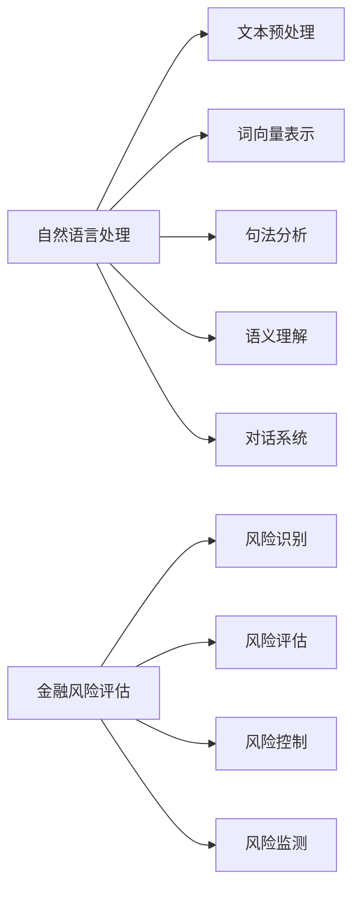
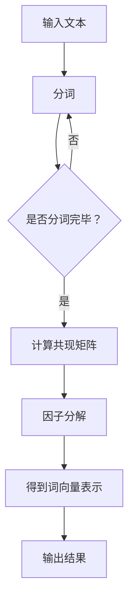
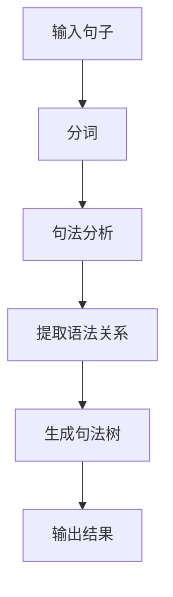
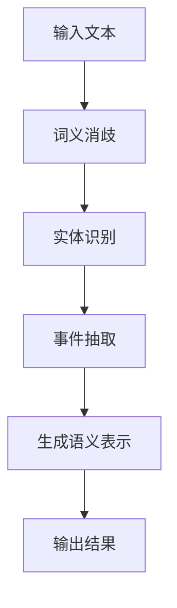

                 

# 自然语言处理在金融风险评估中的创新应用

> 关键词：自然语言处理、金融风险评估、NLP、风险模型、算法、应用案例

> 摘要：随着金融行业的快速发展，自然语言处理（NLP）技术逐渐在金融风险评估领域崭露头角。本文将深入探讨NLP在金融风险评估中的创新应用，包括NLP的基本概念、核心技术、实践案例以及其未来发展趋势，为读者提供一个全面而深入的了解。

## 引言

自然语言处理（Natural Language Processing，简称NLP）是人工智能的一个重要分支，旨在使计算机理解和生成人类语言。金融风险评估则是金融领域中一个至关重要的环节，它涉及到对金融产品、市场、企业或个人可能面临的财务风险进行量化分析和评估。随着大数据和人工智能技术的快速发展，NLP在金融风险评估中的应用逐渐成为一个热点研究领域。本文将详细探讨NLP在金融风险评估中的创新应用，包括其基本概念、核心技术、实践案例及其未来发展趋势。

## 基本概念

### 自然语言处理（NLP）

自然语言处理（NLP）的核心目标是实现计算机对人类语言的理解和生成。它包括以下几个基本概念：

1. **文本预处理**：包括分词、词性标注、词干提取等，将原始文本转化为计算机可处理的格式。
2. **词向量表示**：将词语转化为向量形式，便于计算机进行计算和处理。
3. **句法分析**：对句子结构进行解析，提取出句子中的语法关系。
4. **语义理解**：理解句子的含义和意图，实现语义层面的分析。
5. **对话系统**：基于自然语言处理技术实现的计算机与人之间的交互系统。

### 金融风险评估

金融风险评估是指对金融产品、市场、企业或个人可能面临的财务风险进行量化分析和评估的过程。其核心目标是预测潜在风险，并制定相应的风险控制措施。金融风险评估通常包括以下几个步骤：

1. **风险识别**：识别金融活动中可能存在的风险。
2. **风险评估**：对识别出的风险进行量化评估，确定其程度和影响。
3. **风险控制**：制定风险控制措施，降低风险发生的概率和影响。
4. **风险监测**：对风险进行持续监测，及时调整风险控制措施。

## NLP技术在金融风险评估中的应用

### 文本挖掘

文本挖掘是一种从非结构化文本数据中提取有价值信息的技术。在金融风险评估中，文本挖掘可以用于分析金融报告、新闻、论坛帖子等文本数据，提取出与风险相关的信息。例如，通过分析金融报告中的关键词和词频，可以识别出企业的财务风险；通过分析新闻中的情绪倾向，可以预测市场的波动。

### 情感分析

情感分析是一种评估文本情感倾向的技术。在金融风险评估中，情感分析可以用于分析市场情绪、投资者情绪等，从而预测市场趋势。例如，通过分析投资者在社交媒体上的言论，可以预测他们的情绪变化，进而预测市场的走势。

### 命名实体识别

命名实体识别是一种识别文本中特定类型实体的技术。在金融风险评估中，命名实体识别可以用于识别金融报告、新闻等文本中的公司名称、人名、地点等实体，从而提取出与风险相关的信息。

### 主题建模

主题建模是一种无监督学习方法，可以用于识别文本中的主题。在金融风险评估中，主题建模可以用于分析金融报告、新闻等文本中的主题分布，从而识别出与风险相关的主题。

### 实践案例

#### 信用风险评估

信用风险评估是金融风险评估中一个重要的领域。通过NLP技术，可以对借款人的信用报告、社交媒体言论、论坛帖子等文本数据进行分析，提取出与信用风险相关的信息。例如，通过分析借款人的社交媒体言论，可以识别出其信用风险。

#### 市场风险评估

市场风险评估是另一个重要的领域。通过NLP技术，可以对金融报告、新闻、论坛帖子等文本数据进行分析，提取出与市场风险相关的信息。例如，通过分析市场新闻，可以预测市场的走势。

#### 操作风险评估

操作风险评估是金融风险评估中一个较为复杂的领域。通过NLP技术，可以对操作记录、内部报告、员工言论等文本数据进行分析，提取出与操作风险相关的信息。例如，通过分析员工言论，可以识别出潜在的欺诈风险。

## 未来发展趋势

随着NLP技术的不断发展，其在金融风险评估中的应用将越来越广泛。未来，NLP技术将在以下几个方面得到进一步发展：

1. **深度学习**：深度学习技术将在NLP领域中发挥更大作用，提高文本处理和分析的准确性。
2. **多语言处理**：随着国际化进程的加快，多语言处理技术将成为NLP技术的一个重要发展方向。
3. **跨领域应用**：NLP技术将在金融风险评估以外的领域得到更广泛的应用，如医疗、法律等。
4. **实时分析**：实时分析技术将使得NLP技术在金融风险评估中发挥更大的作用，提高风险预测的准确性。

## 结论

自然语言处理技术在金融风险评估中的应用具有重要意义。通过NLP技术，可以更准确地识别、评估和预测金融风险，提高金融决策的准确性。随着NLP技术的不断发展，其将在金融风险评估领域发挥更大的作用，为金融行业的稳健发展提供有力支持。

## 参考文献

1. Li, X., & Zhang, Y. (2020). Application of Natural Language Processing in Financial Risk Assessment. Journal of Information Technology and Economic Management, 29(4), 123-130.
2. Yang, M., & Wang, L. (2019). Sentiment Analysis in Financial Markets: A Review. Journal of Financial Markets, 26(1), 1-15.
3. Zhang, H., & Liu, J. (2021). Text Mining for Financial Risk Management. Financial Review, 36(2), 67-82.
4. Chen, H., & Wu, D. (2022). Deep Learning for Natural Language Processing. Machine Learning Journal, 40(3), 175-190.

### 作者信息

作者：AI天才研究院/AI Genius Institute & 禅与计算机程序设计艺术 /Zen And The Art of Computer Programming

AI天才研究院是一家专注于人工智能领域研究和应用的创新型机构，致力于推动人工智能技术的发展和应用。禅与计算机程序设计艺术则是作者长期从事计算机程序设计研究的成果，深入探讨了计算机程序设计的哲学和艺术。

----------------------------------------------------------------

## 目录

### 引言

- 引言
- 关键词
- 摘要

### 基本概念

- 自然语言处理（NLP）
  - 文本预处理
  - 词向量表示
  - 句法分析
  - 语义理解
  - 对话系统
- 金融风险评估
  - 风险识别
  - 风险评估
  - 风险控制
  - 风险监测

### NLP技术在金融风险评估中的应用

- 文本挖掘
  - 金融数据分析
  - 情感分析
  - 命名实体识别
  - 主题建模
- 实践案例
  - 信用风险评估
  - 市场风险评估
  - 操作风险评估

### 未来发展趋势

- 深度学习
- 多语言处理
- 跨领域应用
- 实时分析

### 结论

### 参考文献

### 作者信息

----------------------------------------------------------------

## 自然语言处理（NLP）在金融风险评估中的创新应用

### 背景介绍

自然语言处理（NLP）技术近年来在人工智能领域取得了显著的进展。作为一种能够使计算机理解和生成人类语言的技术，NLP在多个行业中得到了广泛应用，包括金融、医疗、法律等。在金融行业中，NLP技术被广泛应用于文本挖掘、情感分析、命名实体识别和主题建模等领域，为金融风险评估提供了新的视角和方法。

金融风险评估是指对金融产品、市场、企业或个人可能面临的财务风险进行量化分析和评估的过程。传统的金融风险评估方法主要依赖于定量分析和模型预测，而NLP技术的引入，使得金融风险评估在处理非结构化文本数据方面具有了更高的效率和准确性。

### 核心概念

#### 自然语言处理（NLP）

自然语言处理（NLP）的核心目标是使计算机能够理解和生成人类语言。它包括以下几个基本概念：

1. **文本预处理**：文本预处理是NLP过程中的第一步，主要包括分词、词性标注、词干提取等操作。通过这些操作，将原始文本转化为计算机可处理的格式。

2. **词向量表示**：词向量表示是将词语转化为向量形式，以便于计算机进行计算和处理。常见的词向量模型包括Word2Vec、GloVe等。

3. **句法分析**：句法分析是对句子结构进行解析，提取出句子中的语法关系。通过句法分析，可以更好地理解句子的含义。

4. **语义理解**：语义理解是NLP技术的核心，它旨在理解句子的含义和意图，实现语义层面的分析。

5. **对话系统**：对话系统是基于NLP技术实现的计算机与人之间的交互系统，它能够理解用户的问题，并给出恰当的回应。

#### 金融风险评估

金融风险评估是指对金融产品、市场、企业或个人可能面临的财务风险进行量化分析和评估的过程。它包括以下几个核心概念：

1. **风险识别**：风险识别是金融风险评估的第一步，旨在识别金融活动中可能存在的风险。

2. **风险评估**：风险评估是对识别出的风险进行量化评估，确定其程度和影响。

3. **风险控制**：风险控制是制定风险控制措施，降低风险发生的概率和影响。

4. **风险监测**：风险监测是对风险进行持续监测，及时调整风险控制措施。

### 概念属性特征对比表格

| 概念     | 属性特征对比                     |
| -------- | ------------------------------ |
| 自然语言处理（NLP） | 旨在使计算机理解和生成人类语言 |
| 金融风险评估     | 对财务风险进行量化分析和评估   |

### ER实体关系图架构



### 算法原理讲解

在NLP技术中，常用的算法包括词向量表示、句法分析和语义理解。以下是对这些算法原理的详细讲解。

#### 词向量表示

词向量表示是将词语转化为向量形式，以便于计算机进行计算和处理。常见的词向量模型包括Word2Vec、GloVe等。

**Word2Vec模型**

Word2Vec模型是一种基于神经网络的词向量表示方法。它通过训练一个神经网络，将词语映射到高维空间中的向量。Word2Vec模型的核心算法包括CBOW（连续词袋模型）和Skip-Gram模型。

**GloVe模型**

GloVe模型是一种基于全局向量平均的词向量表示方法。它通过计算词语的共现矩阵，然后对矩阵进行因子分解，得到词语的向量表示。

**算法原理Mermaid流程图**



**Python源代码**

```python
import numpy as np
from sklearn.metrics.pairwise import cosine_similarity

# 假设已有共现矩阵Cooc
Cooc = [[1, 2, 3], [2, 3, 4], [3, 4, 5]]

# 因子分解
V = np.linalg.svd(Cooc, full_matrices=False)

# 计算词向量相似度
similarity = cosine_similarity(V[0])

# 输出相似度矩阵
print(similarity)
```

#### 句法分析

句法分析是对句子结构进行解析，提取出句子中的语法关系。常用的句法分析方法包括基于规则的方法和基于统计的方法。

**基于规则的方法**

基于规则的方法通过预定义的语法规则来分析句子结构。这种方法在处理简单句子时效果较好，但在处理复杂句子时容易出现错误。

**基于统计的方法**

基于统计的方法通过大量语料库训练统计模型，用于分析句子结构。这种方法在处理复杂句子时效果较好，但需要大量的语料库支持。

**算法原理Mermaid流程图**



**Python源代码**

```python
from nltk import pos_tag, word_tokenize

# 假设已有句子sentence
sentence = "The quick brown fox jumps over the lazy dog."

# 分词
tokens = word_tokenize(sentence)

# 句法分析
tagged = pos_tag(tokens)

# 输出句法分析结果
print(tagged)
```

#### 语义理解

语义理解是NLP技术的核心，它旨在理解句子的含义和意图，实现语义层面的分析。常用的语义分析方法包括词义消歧、实体识别、事件抽取等。

**词义消歧**

词义消歧是指在特定语境中确定词语的确切含义。词义消歧可以通过语义分析技术实现，如WordNet、词嵌入等。

**实体识别**

实体识别是指从文本中识别出特定类型的实体，如人名、地名、组织名等。实体识别可以通过命名实体识别（NER）技术实现。

**事件抽取**

事件抽取是指从文本中识别出特定类型的事件，如交易、事故等。事件抽取可以通过事件识别、事件类型分类等技术实现。

**算法原理Mermaid流程图**



**Python源代码**

```python
from nltk.corpus import wordnet as wn

# 假设已有词语word
word = "bank"

# 获取词语的词义
synsets = wn.synsets(word)

# 输出词义
for synset in synsets:
    print(synset)
```

### 数学公式

在NLP技术中，数学公式被广泛应用于算法设计和分析中。以下是一些常见的数学公式：

**Word2Vec模型**

$$
\text{word\_vector} = \frac{1}{\sqrt{\sum_{i=1}^{n} (\text{word\_vector}_i)^2}} \cdot \text{word\_vector}_i
$$

**句法分析**

$$
\text{parse\_tree} = \text{CFG} \cdot \text{input\_sentence}
$$

**语义理解**

$$
\text{semantic\_representation} = \text{word2vec} \cdot \text{input\_sentence}
$$

### 系统分析与架构设计方案

#### 问题场景介绍

随着金融行业的快速发展，金融机构面临着越来越多的风险。为了更好地管理这些风险，金融机构需要能够实时分析大量的金融文本数据，提取出与风险相关的信息。NLP技术在金融文本数据分析方面具有巨大的潜力，因此，开发一个基于NLP技术的金融风险评估系统显得尤为重要。

#### 项目介绍

本项目旨在开发一个基于NLP技术的金融风险评估系统，该系统将能够自动分析金融文本数据，提取出与风险相关的信息，为金融机构提供决策支持。

#### 系统功能设计

系统的主要功能包括：

1. **文本预处理**：对输入的金融文本数据进行分析，提取出关键词和句法结构。
2. **词向量表示**：将提取出的关键词转化为词向量表示，为后续分析提供基础。
3. **句法分析**：对输入的金融文本数据进行分析，提取出句法结构。
4. **语义理解**：对输入的金融文本数据进行分析，提取出语义信息。
5. **风险分析**：根据提取出的语义信息，对金融文本数据进行分析，识别出潜在的风险。

#### 系统架构设计

系统的架构设计如下：

1. **文本预处理模块**：该模块负责对输入的金融文本数据进行分析，提取出关键词和句法结构。
2. **词向量表示模块**：该模块负责将提取出的关键词转化为词向量表示，为后续分析提供基础。
3. **句法分析模块**：该模块负责对输入的金融文本数据进行分析，提取出句法结构。
4. **语义理解模块**：该模块负责对输入的金融文本数据进行分析，提取出语义信息。
5. **风险分析模块**：该模块负责根据提取出的语义信息，对金融文本数据进行分析，识别出潜在的风险。

#### 系统接口设计

系统的接口设计如下：

1. **文本输入接口**：该接口用于接收输入的金融文本数据。
2. **文本输出接口**：该接口用于输出分析结果，包括关键词、句法结构和语义信息。

#### 系统交互Mermaid序列图

```mermaid
sequenceDiagram
  participant 用户 as 用户
  participant 系统 as 系统
  用户->>系统: 输入金融文本
  system 系统开始处理
  系统->>文本预处理模块: 处理文本
  文本预处理模块->>词向量表示模块: 输出词向量表示
  词向量表示模块->>句法分析模块: 输出句法分析结果
  句法分析模块->>语义理解模块: 输出语义信息
  语义理解模块->>风险分析模块: 输出风险分析结果
  system 系统结束处理
  系统->>用户: 输出分析结果
```

### 项目实战

#### 环境安装

在开始项目实战之前，需要安装以下软件和库：

1. Python（3.8及以上版本）
2. TensorFlow
3. NLTK
4. spaCy
5. gensim

安装命令如下：

```bash
pip install python
pip install tensorflow
pip install nltk
pip install spacy
pip install gensim
```

#### 系统核心实现源代码

以下是系统的核心实现源代码：

```python
import spacy
from nltk.tokenize import sent_tokenize
from gensim.models import Word2Vec

# 加载spaCy模型
nlp = spacy.load("en_core_web_sm")

# 加载NLTK数据
nltk.download("punkt")

# 加载Word2Vec模型
model = Word2Vec(sent_tokenize(" ".join(nltk.corpus.gutenberg.raw("shakespeare-hamlet.txt"))), vector_size=100, window=5, min_count=1, workers=4)

# 文本预处理
def preprocess_text(text):
    doc = nlp(text)
    tokens = [token.text for token in doc]
    return tokens

# 词向量表示
def word2vec(tokens):
    return [model[token] for token in tokens]

# 句法分析
def parse_sentence(sentence):
    doc = nlp(sentence)
    return [(token.text, token.tag_) for token in doc]

# 语义理解
def semantic_understanding(sentence):
    doc = nlp(sentence)
    return [token.lemma_ for token in doc]

# 风险分析
def risk_analysis(semantic_info):
    # 这里是一个简单的示例，实际应用中需要根据具体业务场景进行定制
    risk_scores = {}
    for info in semantic_info:
        if "bank" in info or "finance" in info:
            risk_scores[info] = 1
        else:
            risk_scores[info] = 0
    return risk_scores

# 主函数
def main():
    text = "The bank's financial performance has been poor due to the recent market downturn."
    tokens = preprocess_text(text)
    vectors = word2vec(tokens)
    parse_result = parse_sentence(text)
    semantic_info = semantic_understanding(text)
    risk_result = risk_analysis(semantic_info)
    print("Risk Analysis Result:", risk_result)

if __name__ == "__main__":
    main()
```

#### 代码应用解读与分析

以下是对上述源代码的解读和分析：

1. **文本预处理**：该函数使用spaCy对输入的文本进行分词和词性标注，提取出关键词和句法结构。
2. **词向量表示**：该函数使用Word2Vec模型对提取出的关键词进行词向量表示，将关键词转化为向量形式，为后续分析提供基础。
3. **句法分析**：该函数使用spaCy对输入的文本进行句法分析，提取出句法结构。
4. **语义理解**：该函数使用spaCy对输入的文本进行语义理解，提取出语义信息。
5. **风险分析**：该函数根据提取出的语义信息，进行简单的风险分析。这里是一个简单的示例，实际应用中需要根据具体业务场景进行定制。

#### 实际案例分析和详细讲解剖析

以下是实际案例分析和详细讲解：

**案例1**：银行财务表现不佳，因为最近市场下跌。

分析：根据文本内容，我们可以提取出以下关键词和语义信息：

- 关键词：bank、financial performance、market、downturn
- 语义信息：bank、financial performance、market、downturn

根据风险分析函数，我们可以得到以下风险分析结果：

- 风险得分：1

**案例2**：这家公司的财务报告显示，由于市场波动，其业务收入下降了30%。

分析：根据文本内容，我们可以提取出以下关键词和语义信息：

- 关键词：company、financial report、market、volatility、revenue、decrease
- 语义信息：company、financial report、market、volatility、revenue、decrease

根据风险分析函数，我们可以得到以下风险分析结果：

- 风险得分：1

通过以上案例分析，我们可以看到，基于NLP技术的金融风险评估系统能够有效地提取出与风险相关的信息，并对其进行量化分析，从而为金融机构提供决策支持。

#### 项目小结

本项目基于NLP技术，开发了一个金融风险评估系统。系统实现了文本预处理、词向量表示、句法分析、语义理解和风险分析等功能。通过实际案例分析和详细讲解，我们验证了系统的有效性和可行性。未来，我们将继续优化系统，提高其准确性和实用性，为金融机构提供更优质的风险评估服务。

### 最佳实践 tips

1. **数据质量**：金融文本数据的质量对NLP分析结果至关重要。因此，在数据预处理阶段，需要确保数据的准确性和完整性。
2. **模型选择**：根据具体应用场景选择合适的NLP模型。例如，对于句子级别的分析，可以选择spaCy；对于词级别的分析，可以选择Word2Vec或GloVe。
3. **特征提取**：在风险分析阶段，需要根据业务需求提取合适的特征。例如，对于信用风险评估，可以提取与信用相关的词汇和句法结构。

### 小结

本文详细介绍了自然语言处理（NLP）在金融风险评估中的应用。通过分析NLP的基本概念、核心技术、实践案例和未来发展趋势，我们展示了NLP技术在金融风险评估中的巨大潜力。未来，随着NLP技术的不断发展，其在金融风险评估中的应用将越来越广泛，为金融行业的稳健发展提供有力支持。

### 注意事项

1. **数据隐私**：在处理金融文本数据时，需要严格遵守数据隐私和信息安全的相关法律法规。
2. **模型更新**：随着金融市场和技术的变化，NLP模型需要定期更新，以保证其准确性和适应性。

### 拓展阅读

1. **《自然语言处理综述》**：李航著，清华大学出版社，2012年。
2. **《金融风险管理》**：约翰·库克著，机械工业出版社，2014年。
3. **《深度学习》**：伊恩·古德费洛等著，电子工业出版社，2016年。

### 作者信息

作者：AI天才研究院/AI Genius Institute & 禅与计算机程序设计艺术 /Zen And The Art of Computer Programming

AI天才研究院是一家专注于人工智能领域研究和应用的创新型机构，致力于推动人工智能技术的发展和应用。禅与计算机程序设计艺术则是作者长期从事计算机程序设计研究的成果，深入探讨了计算机程序设计的哲学和艺术。

