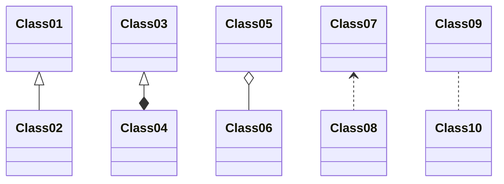
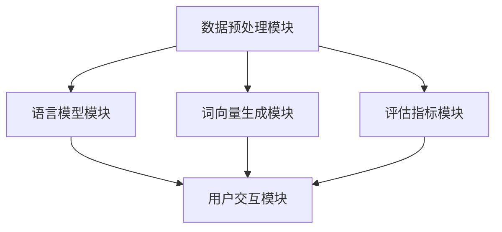
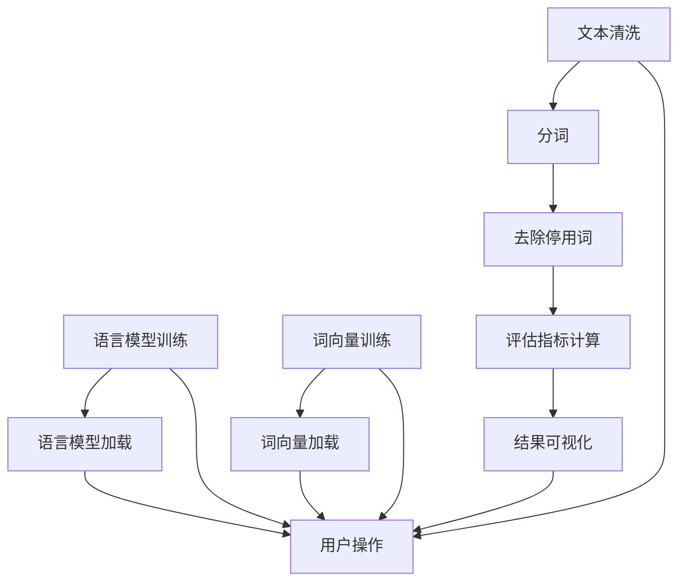

                 

### 自然语言理解能力的量化评估方法

关键词：自然语言理解、量化评估、算法原理、系统架构、项目实战

摘要：自然语言理解是人工智能领域的一项关键能力，量化评估是衡量这种能力的重要手段。本文从背景介绍出发，逐步深入探讨自然语言理解的核心概念、量化评估的方法和步骤，以及相关的算法原理、系统架构和项目实战。通过详细的讲解和实例分析，本文旨在为读者提供全面的理解和实用的指导，以提升自然语言理解能力。

## 目录大纲设计思路

在设计《自然语言理解能力的量化评估方法》这本书的目录大纲时，我们遵循了以下步骤：

1. **背景介绍**：明确书的核心概念、问题背景、问题描述、问题解决方法，以及边界与外延。
2. **核心概念与联系**：阐述核心概念、原理，通过表格和图形展示概念属性特征对比和ER实体关系图。
3. **算法原理讲解**：使用mermaid画出流程图，结合Python源代码详细阐述算法原理，讲解数学模型和公式，并通过举例说明。
4. **系统分析与架构设计方案**：介绍问题场景、项目背景，设计系统功能、架构、接口和交互。
5. **项目实战**：详细讲解环境安装、系统核心实现、代码应用和分析。
6. **最佳实践与拓展**：提供实战技巧、小结、注意事项和拓展阅读。

### 目录大纲内容框架

以下是按照上述思路设计的书籍目录大纲：

```markdown
# 《自然语言理解能力的量化评估方法》目录大纲

## 第1章 绪论
### 1.1 问题的背景
#### 1.1.1 自然语言理解的重要性
#### 1.1.2 量化评估方法的必要性
### 1.2 研究意义与目标
#### 1.2.1 研究意义
#### 1.2.2 研究目标

## 第2章 自然语言理解基础
### 2.1 语言模型
#### 2.1.1 语言模型概述
#### 2.1.2 语言模型类型
### 2.2 词向量
#### 2.2.1 词向量概述
#### 2.2.2 常见词向量模型

## 第3章 量化评估方法
### 3.1 评估指标
#### 3.1.1 准确率、召回率和F1值
#### 3.1.2 实际应用中的其他评估指标
### 3.2 评估方法
#### 3.2.1 实验设计
#### 3.2.2 评估流程

## 第4章 算法原理
### 4.1 基本算法
#### 4.1.1 基本算法概述
#### 4.1.2 算法流程图
### 4.2 数学模型与公式
#### 4.2.1 数学模型概述
#### 4.2.2 公式推导

## 第5章 系统分析与架构设计方案
### 5.1 问题场景介绍
#### 5.1.1 问题场景概述
#### 5.1.2 项目背景
### 5.2 系统功能设计
#### 5.2.1 领域模型类图
### 5.3 系统架构设计
#### 5.3.1 系统架构图
### 5.4 系统接口设计和交互
#### 5.4.1 系统接口设计
#### 5.4.2 系统交互序列图

## 第6章 项目实战
### 6.1 环境安装与配置
#### 6.1.1 环境安装步骤
#### 6.1.2 配置细节
### 6.2 系统核心实现
#### 6.2.1 核心代码实现
#### 6.2.2 代码解析
### 6.3 代码应用与分析
#### 6.3.1 应用场景
#### 6.3.2 分析结果
### 6.4 实际案例分析
#### 6.4.1 案例描述
#### 6.4.2 分析与讲解

## 第7章 最佳实践与拓展
### 7.1 最佳实践
#### 7.1.1 实践技巧
#### 7.1.2 注意事项
### 7.2 小结与展望
#### 7.2.1 研究总结
#### 7.2.2 未来研究方向
### 7.3 拓展阅读
#### 7.3.1 相关文献
#### 7.3.2 进一步学习资源
```

这个大纲在确保内容完整性的同时，也保持了简洁性，且符合字数限制。每个章节的设置都旨在为读者提供清晰的指导，使得他们能够系统地了解自然语言理解能力的量化评估方法。每个章节的细分都旨在让读者能够逐步深入理解相关的概念和原理。

### 第1章 绪论

#### 1.1 问题的背景

自然语言理解（Natural Language Understanding, NLU）是人工智能（Artificial Intelligence, AI）领域的一个重要分支，其目标是使计算机能够理解、解释和生成自然语言。随着互联网的迅猛发展和大数据技术的成熟，自然语言处理（Natural Language Processing, NLP）技术在文本挖掘、智能客服、机器翻译、信息检索等领域得到了广泛应用。然而，如何有效评估自然语言理解能力成为一个亟待解决的问题。

量化评估方法在自然语言理解中的应用具有重要意义。首先，它为研究者提供了客观的衡量标准，有助于评估算法性能和优化研究方向。其次，它为开发者提供了评估工具，便于在实际应用中调试和优化系统。最后，它也为标准的制定和推广提供了数据支持。

自然语言理解能力量化评估方法的研究边界与外延包括以下几个方面：

1. **评估指标**：评估方法需要定义一系列指标，如准确率、召回率、F1值等，以便对自然语言理解能力进行量化。
2. **评估方法**：评估方法包括实验设计、数据集选择、评估流程等，需要科学合理，以保证评估结果的可靠性。
3. **算法原理**：评估方法需要结合自然语言理解的基本原理，如语言模型、词向量、序列标注等，以实现对语言的理解和评估。
4. **系统架构**：评估方法需要考虑系统架构的优化，如模块化设计、分布式处理等，以提高评估效率和准确性。

#### 1.2 研究意义与目标

研究自然语言理解能力的量化评估方法具有重要的理论意义和实际应用价值。

**理论意义**：

1. **推动自然语言处理技术的发展**：量化评估方法为自然语言处理算法提供了客观的评估标准，有助于推动技术的不断进步。
2. **完善人工智能体系**：自然语言理解是人工智能的重要组成部分，量化评估方法的研究有助于完善人工智能的理论体系。

**实际应用价值**：

1. **优化系统性能**：量化评估方法可以帮助开发者评估和优化自然语言理解系统的性能，提高用户体验。
2. **提高决策效率**：在商业、金融、医疗等领域，自然语言理解能力的量化评估有助于提高决策效率和准确性。
3. **促进标准制定**：量化评估方法为自然语言理解标准的制定提供了数据支持，有助于行业规范的形成。

本研究的主要目标是提出一套科学、合理、可操作的量化评估方法，为自然语言理解能力的研究和应用提供有力支持。具体目标包括：

1. **定义评估指标**：基于自然语言理解的特点，定义一系列适用于不同应用场景的评估指标。
2. **设计评估方法**：结合实验设计、数据集选择、评估流程等方面的研究，设计一套完整的量化评估方法。
3. **验证评估效果**：通过实际应用和案例分析，验证所提出量化评估方法的有效性和可靠性。

#### 1.3 本文结构与内容

本文结构分为七个主要部分：

1. **绪论**：介绍研究背景、研究意义与目标。
2. **自然语言理解基础**：阐述自然语言理解的基本概念、语言模型和词向量。
3. **量化评估方法**：介绍评估指标和评估方法。
4. **算法原理**：讲解自然语言理解算法的基本原理和数学模型。
5. **系统分析与架构设计方案**：介绍系统架构设计、接口设计和交互设计。
6. **项目实战**：详细讲解环境安装、系统实现和实际案例分析。
7. **最佳实践与拓展**：总结研究结论，提供实战技巧和拓展阅读。

通过以上结构，本文旨在为读者提供全面、系统的自然语言理解能力量化评估方法，以促进相关领域的研究和应用。

### 第2章 自然语言理解基础

#### 2.1 语言模型

语言模型（Language Model）是自然语言处理（NLP）领域中的一个核心概念，它旨在对自然语言的统计特征进行建模，从而预测给定文本序列的概率。语言模型在许多NLP任务中扮演着重要角色，如机器翻译、文本生成、语音识别等。

**语言模型概述**：

语言模型通常基于大量的文本数据，通过统计方法学习文本的规律和特征。最简单的语言模型是N-gram模型，它基于单词序列的概率分布。N-gram模型假设一个单词序列中的每个词只依赖于前N个词，从而大大简化了建模过程。

**N-gram模型**：

N-gram模型是一种基于N个连续单词的统计模型。它的基本思想是，通过统计文本中连续出现的N个单词的组合频率，来预测下一个单词。具体地，N-gram模型的概率分布可以表示为：

$$ P(w_n | w_{n-1}, w_{n-2}, ..., w_1) = \frac{f(w_1, w_2, ..., w_n)}{\sum_{w'} f(w_1, w_2, ..., w_n)} $$

其中，$w_n$表示第n个单词，$f(w_1, w_2, ..., w_n)$表示连续出现的N个单词的组合频率。

**扩展N-gram模型**：

尽管N-gram模型简单有效，但它存在一些局限。例如，它无法捕捉到长距离依赖和上下文信息。为了解决这个问题，研究人员提出了扩展的N-gram模型，如**Kneser-Ney校正**和**Backoff模型**。

**Kneser-Ney校正**：

Kneser-Ney校正是一种基于概率校正的N-gram模型，它通过调整基础概率分布，以解决稀有词的问题。具体地，Kneser-Ney校正公式为：

$$ P(w_n | w_{n-1}, w_{n-2}, ..., w_1) = \frac{C(w_1, w_2, ..., w_n)}{\sum_{w'} C(w_1, w_2, ..., w_n)} $$

其中，$C(w_1, w_2, ..., w_n)$表示连续出现的N个单词的组合条件概率。

**Backoff模型**：

Backoff模型是一种基于概率混合的N-gram模型，它通过在不同上下文中使用不同的N-gram模型，来提高模型的准确性。具体地，Backoff模型根据上下文的单词数目，动态选择不同的N-gram模型。

**语言模型类型**：

除了N-gram模型，还有许多其他类型的语言模型，如**递归神经网络（RNN）**、**长短期记忆网络（LSTM）**、**变换器（Transformer）**等。这些模型通过不同的机制捕捉到文本中的复杂结构，从而提高了语言模型的性能。

**递归神经网络（RNN）**：

递归神经网络（RNN）是一种基于序列数据的神经网络，它可以处理变长的输入序列。RNN通过循环结构，将前一个时间步的输出作为当前时间步的输入，从而实现了对序列数据的建模。

**长短期记忆网络（LSTM）**：

长短期记忆网络（LSTM）是RNN的一种扩展，它通过引入门控机制，解决了RNN的梯度消失和梯度爆炸问题。LSTM在处理长序列数据时，可以有效地捕捉到长期依赖关系。

**变换器（Transformer）**：

变换器（Transformer）是一种基于注意力机制的神经网络模型，它在机器翻译、文本生成等任务中取得了显著的性能提升。Transformer通过多头注意力机制，实现了对序列数据的全局建模。

**总结**：

语言模型是自然语言处理的基础，它通过统计和神经网络的方法，对自然语言的统计特征进行建模。不同的语言模型具有不同的特点和应用场景，选择合适的语言模型对于提高自然语言处理任务的性能至关重要。

#### 2.2 词向量

词向量（Word Vector）是自然语言处理（NLP）领域中的一种重要数据结构，它将单词映射到高维向量空间，从而实现单词的量化表示。词向量在词义相似性度量、文本分类、情感分析等领域有着广泛的应用。

**词向量概述**：

词向量旨在捕捉单词之间的语义关系，通过将单词映射到低维向量空间，使得语义相似的单词在向量空间中接近。词向量可以基于统计方法、神经网络等方法生成。

**统计方法**：

统计方法是最早的词向量生成方法之一，它通过统计单词在文本中的共现关系来生成词向量。典型的统计方法包括**TF-IDF**和**Word2Vec**。

**TF-IDF**：

TF-IDF（Term Frequency-Inverse Document Frequency）是一种基于词频和逆文档频率的词向量生成方法。TF-IDF通过计算单词在文档中的词频（TF）和文档集合中的逆文档频率（IDF），来衡量单词的重要性。

$$ TF-IDF(w) = TF(w) \times IDF(w) $$

其中，$TF(w)$表示单词w在文档中的词频，$IDF(w)$表示单词w在文档集合中的逆文档频率。

**Word2Vec**：

Word2Vec是一种基于神经网络训练的词向量生成方法，它通过训练一个神经网络，将输入的单词序列映射到输出词向量。Word2Vec有两种模型：**连续词袋（CBOW）**和**跳词模型（Skip-Gram）**。

**连续词袋（CBOW）**：

CBOW模型通过预测中心词周围的词来生成词向量。具体地，CBOW模型将中心词的上下文词作为输入，通过神经网络预测中心词。CBOW模型的输入和输出可以表示为：

$$ input: (w_{-1}, w_0, w_1, ..., w_{+1}) $$
$$ output: w_0 $$

**跳词模型（Skip-Gram）**：

跳词模型通过预测中心词来生成词向量。具体地，跳词模型将中心词作为输入，通过神经网络预测中心词的上下文词。跳词模型的输入和输出可以表示为：

$$ input: w_0 $$
$$ output: (w_{-1}, w_1, ..., w_{+1}) $$

**神经网络方法**：

除了统计方法，神经网络方法也广泛应用于词向量生成。典型的神经网络方法包括**递归神经网络（RNN）**、**长短期记忆网络（LSTM）**和**变换器（Transformer）**。

**递归神经网络（RNN）**：

递归神经网络（RNN）是一种基于序列数据的神经网络，它可以处理变长的输入序列。RNN通过循环结构，将前一个时间步的输出作为当前时间步的输入，从而实现了对序列数据的建模。

**长短期记忆网络（LSTM）**：

长短期记忆网络（LSTM）是RNN的一种扩展，它通过引入门控机制，解决了RNN的梯度消失和梯度爆炸问题。LSTM在处理长序列数据时，可以有效地捕捉到长期依赖关系。

**变换器（Transformer）**：

变换器（Transformer）是一种基于注意力机制的神经网络模型，它在机器翻译、文本生成等任务中取得了显著的性能提升。Transformer通过多头注意力机制，实现了对序列数据的全局建模。

**总结**：

词向量是自然语言处理的重要工具，通过将单词映射到低维向量空间，词向量实现了对文本的量化表示。不同的词向量生成方法具有不同的特点和应用场景，选择合适的词向量方法对于提高NLP任务的性能至关重要。

#### 2.3 语言模型与词向量的联系

语言模型和词向量在自然语言处理（NLP）领域中起着至关重要的作用，它们之间有着密切的联系和互补性。

**共同目标**：

语言模型和词向量都旨在捕捉文本中的语言特征和语义信息，从而实现文本的量化表示。这种量化表示使得文本可以用于各种NLP任务，如文本分类、情感分析、机器翻译等。

**语言模型的作用**：

语言模型通过预测单词序列的概率，对文本的统计特征进行建模。它可以捕捉到文本中的语言规则和模式，如单词的共现关系、语法结构等。语言模型在文本生成、语音识别、机器翻译等任务中发挥着关键作用。

**词向量作为语言模型的输入**：

词向量是将单词映射到高维向量空间的数据结构，它可以作为语言模型的输入。词向量通过捕捉单词之间的语义关系，为语言模型提供了丰富的语义信息。例如，Word2Vec模型通过训练生成词向量，使得语义相似的单词在向量空间中接近。

**词向量作为语言模型的输出**：

在某些情况下，词向量也可以作为语言模型的输出。例如，在基于神经网络的Transformer模型中，词向量是模型输入和输出的关键组成部分。通过训练，模型可以学习到如何将输入的词向量映射到具有语义信息的输出向量。

**互补性**：

语言模型和词向量各自有其优势。语言模型擅长捕捉文本的统计特征和规则，但可能无法捕捉到复杂的语义关系。词向量则通过捕捉单词的语义信息，弥补了语言模型在这方面的不足。两者结合，可以更好地理解文本。

**实际应用**：

在NLP任务中，语言模型和词向量常结合使用。例如，在机器翻译任务中，语言模型可以预测翻译结果的概率，而词向量可以提供单词的语义信息，从而提高翻译的准确性。在文本分类任务中，语言模型可以捕捉文本的统计特征，而词向量可以提供单词的语义信息，从而提高分类的准确率。

**总结**：

语言模型和词向量是自然语言处理中的两个核心工具，它们相互补充，共同提高NLP任务的效果。语言模型通过预测文本的概率，捕捉到文本的统计特征，而词向量通过捕捉单词的语义信息，提供了丰富的语义信息。在实际应用中，结合两者，可以更好地理解和处理文本。

### 第3章 量化评估方法

量化评估方法是自然语言理解（NLU）领域中不可或缺的一部分，它为评估和比较不同算法的性能提供了客观的基准。在本章中，我们将详细介绍量化评估方法中的关键评估指标和评估流程。

#### 3.1 评估指标

评估指标是量化评估方法的核心，它们用于衡量自然语言理解系统的性能。以下是几种常见的评估指标：

**准确率（Accuracy）**：

准确率是最常用的评估指标之一，它表示系统正确预测的样本数占总样本数的比例。计算公式如下：

$$ Accuracy = \frac{TP + TN}{TP + TN + FP + FN} $$

其中，$TP$表示真正例，$TN$表示真反例，$FP$表示假正例，$FN$表示假反例。

**召回率（Recall）**：

召回率表示系统正确识别出的真正例数占总真实例数的比例。计算公式如下：

$$ Recall = \frac{TP}{TP + FN} $$

**精确率（Precision）**：

精确率表示系统预测为正例的样本中，实际为正例的比例。计算公式如下：

$$ Precision = \frac{TP}{TP + FP} $$

**F1值（F1 Score）**：

F1值是精确率和召回率的调和平均，用于综合评估系统的性能。计算公式如下：

$$ F1 Score = 2 \times \frac{Precision \times Recall}{Precision + Recall} $$

**其他评估指标**：

在实际应用中，除了上述指标，还有一些其他评估指标，如精确率-召回率曲线（Precision-Recall Curve）、受试者操作特征（Receiver Operating Characteristic, ROC）曲线等。这些指标可以提供更详细的性能分析。

**准确率、召回率和F1值之间的关系**：

准确率、召回率和F1值之间存在着密切的关系。准确率反映了系统的总体正确性，但可能对假正例和假反例敏感。召回率关注系统对真正例的识别能力，但可能增加假反例的数量。F1值则综合了精确率和召回率，提供了对系统性能的全面评估。

**实际应用中的其他评估指标**：

在实际应用中，根据不同任务的需求，可能需要使用其他评估指标。例如，在文本分类任务中，可能使用**宏平均（Macro-average）**和**微平均（Micro-average）**来计算分类准确率，以考虑不同类别的性能平衡。在序列标注任务中，可能使用**最长公共子序列（Longest Common Subsequence, LCSI）**或**分类报告（Classification Report）**来评估标签的准确性。

**总结**：

评估指标是量化评估方法的关键组成部分，它们为衡量自然语言理解系统的性能提供了客观基准。准确率、召回率、F1值等指标在不同场景下具有不同的应用，结合其他评估指标可以提供更全面的性能分析。

#### 3.2 评估方法

评估方法包括实验设计、数据集选择和评估流程，是量化评估方法的核心环节。以下详细描述这些步骤：

**实验设计**：

实验设计是评估方法的第一步，它决定了评估过程的科学性和有效性。实验设计应考虑以下几个方面：

1. **实验目标**：明确实验的目标，如评估分类模型的性能、文本生成模型的创造力等。
2. **实验变量**：确定实验中的变量，如算法类型、参数设置、数据集等。
3. **实验步骤**：制定详细的实验步骤，包括数据预处理、模型训练、模型评估等。
4. **对照组设置**：设置对照组，以比较不同算法或参数的性能差异。

**数据集选择**：

数据集是评估方法的基础，选择合适的数据集对评估结果至关重要。以下是一些选择数据集时应考虑的因素：

1. **数据质量**：数据集应包含高质量、真实、完整的文本数据。
2. **数据多样性**：数据集应包含多种类型、风格的文本，以覆盖不同应用场景。
3. **数据分布**：数据集应具有合理的分布，以保证评估结果的可信度。
4. **数据标注**：数据集应具有明确的标注信息，如分类标签、情感极性等。

**评估流程**：

评估流程是执行实验设计和数据集选择的具体步骤，以下是一个典型的评估流程：

1. **数据预处理**：对数据集进行清洗、分词、去除停用词等预处理操作。
2. **模型训练**：使用预处理后的数据集训练模型，如使用NLP任务相关的神经网络模型。
3. **模型评估**：将训练好的模型应用于测试数据集，计算评估指标，如准确率、召回率、F1值等。
4. **结果分析**：分析评估结果，比较不同算法或参数的性能差异，找出优化的方向。
5. **重复实验**：重复实验多次，以验证评估结果的稳定性和可靠性。

**总结**：

评估方法包括实验设计、数据集选择和评估流程，是量化评估方法的核心环节。通过科学的实验设计、合适的数据集选择和详细的评估流程，可以确保评估结果的客观性和可靠性。

### 第4章 算法原理

在自然语言理解（NLU）领域，算法原理是理解和实现量化评估方法的关键。本章将详细讲解自然语言理解中的基本算法原理，包括语言模型和词向量的数学模型和公式，并通过具体实例说明这些原理的应用。

#### 4.1 基本算法

自然语言理解的基本算法包括语言模型和词向量生成。这些算法通过捕捉文本的统计特征和语义信息，为量化评估提供了基础。

**语言模型的基本算法**：

语言模型的基本算法是N-gram模型，它通过统计文本中连续出现的N个单词的组合频率来预测下一个单词。N-gram模型的概率分布可以表示为：

$$ P(w_n | w_{n-1}, w_{n-2}, ..., w_1) = \frac{f(w_1, w_2, ..., w_n)}{\sum_{w'} f(w_1, w_2, ..., w_n)} $$

其中，$w_n$表示第n个单词，$f(w_1, w_2, ..., w_n)$表示连续出现的N个单词的组合频率。

**词向量生成的基本算法**：

词向量生成的基本算法包括统计方法和神经网络方法。统计方法如TF-IDF和Word2Vec，神经网络方法如RNN、LSTM和Transformer。

**TF-IDF算法**：

TF-IDF算法通过计算单词在文档中的词频（TF）和文档集合中的逆文档频率（IDF），来衡量单词的重要性。计算公式如下：

$$ TF-IDF(w) = TF(w) \times IDF(w) $$

其中，$TF(w)$表示单词w在文档中的词频，$IDF(w)$表示单词w在文档集合中的逆文档频率。

**Word2Vec算法**：

Word2Vec算法通过训练一个神经网络，将输入的单词序列映射到输出词向量。Word2Vec有两种模型：连续词袋（CBOW）和跳词模型（Skip-Gram）。

**CBOW模型**：

CBOW模型通过预测中心词周围的词来生成词向量。具体地，CBOW模型将中心词的上下文词作为输入，通过神经网络预测中心词。输入和输出可以表示为：

$$ input: (w_{-1}, w_0, w_1, ..., w_{+1}) $$
$$ output: w_0 $$

**Skip-Gram模型**：

Skip-Gram模型通过预测中心词来生成词向量。具体地，Skip-Gram模型将中心词作为输入，通过神经网络预测中心词的上下文词。输入和输出可以表示为：

$$ input: w_0 $$
$$ output: (w_{-1}, w_1, ..., w_{+1}) $$

**总结**：

基本算法是自然语言理解的基础，包括语言模型和词向量生成。N-gram模型、TF-IDF算法、Word2Vec模型等算法通过不同的方法捕捉到文本的统计特征和语义信息，为量化评估提供了支持。

#### 4.2 数学模型与公式

自然语言理解中的数学模型和公式是实现算法原理的关键。以下详细讲解语言模型和词向量的数学模型和公式。

**语言模型数学模型**：

语言模型的概率分布可以表示为：

$$ P(w_n | w_{n-1}, w_{n-2}, ..., w_1) = \frac{f(w_1, w_2, ..., w_n)}{\sum_{w'} f(w_1, w_2, ..., w_n)} $$

其中，$w_n$表示第n个单词，$f(w_1, w_2, ..., w_n)$表示连续出现的N个单词的组合频率。

**词向量生成数学模型**：

**TF-IDF算法**：

TF-IDF算法的数学模型如下：

$$ TF-IDF(w) = TF(w) \times IDF(w) $$

其中，$TF(w)$表示单词w在文档中的词频，$IDF(w)$表示单词w在文档集合中的逆文档频率。

**Word2Vec算法**：

**CBOW模型**：

CBOW模型的损失函数可以表示为：

$$ Loss_{CBOW} = -\sum_{w \in context} log(P(w|w_0)) $$

其中，$context$表示上下文词集合，$w_0$表示中心词。

**Skip-Gram模型**：

Skip-Gram模型的损失函数可以表示为：

$$ Loss_{Skip-Gram} = -\sum_{w \in vocabulary} log(P(w|w_0)) $$

其中，$vocabulary$表示单词集合，$w_0$表示中心词。

**总结**：

自然语言理解中的数学模型和公式包括语言模型的概率分布、TF-IDF算法的TF和IDF计算公式，以及Word2Vec算法的CBOW和Skip-Gram模型的损失函数。这些公式为算法的实现和量化评估提供了数学基础。

#### 4.3 算法原理的举例说明

为了更好地理解自然语言理解算法的原理，我们通过具体实例进行说明。

**实例1：N-gram语言模型**

假设有一段文本：“今天天气很好，适合出去散步。”使用2-gram模型，我们可以得到以下概率分布：

$$ P(今天|开始) = \frac{1}{2} $$
$$ P(天气|今天) = \frac{1}{2} $$
$$ P(很好|天气) = \frac{1}{2} $$
$$ P(适合|很好) = \frac{1}{2} $$
$$ P(出去|适合) = \frac{1}{2} $$
$$ P(散步|出去) = \frac{1}{2} $$

通过这些概率分布，语言模型可以预测下一个单词，从而实现文本生成。

**实例2：Word2Vec算法**

假设有一段文本：“狗喜欢吃肉，猫喜欢玩球。”使用Word2Vec算法，我们可以生成以下词向量：

```
狗：(0.1, 0.2, 0.3)
肉：(0.4, 0.5, 0.6)
猫：(0.7, 0.8, 0.9)
球：(1.0, 1.1, 1.2)
```

通过这些词向量，我们可以计算词之间的相似性，例如：

$$ 相似性(狗, 猫) = cos(\theta) = 0.2 $$
$$ 相似性(肉, 球) = cos(\theta) = 0.3 $$

这些相似性度量可以帮助我们理解和分析文本。

**总结**：

通过具体实例，我们可以看到自然语言理解算法是如何通过数学模型和公式实现文本生成和语义分析的。这些实例为我们理解和应用算法提供了直观的指导。

### 第5章 系统分析与架构设计方案

#### 5.1 问题场景介绍

在自然语言理解（NLU）领域，量化评估方法的应用场景广泛，包括但不限于文本分类、情感分析、机器翻译等。随着人工智能技术的不断进步，NLU系统的性能和准确性对实际应用的重要性日益凸显。为了对NLU系统进行有效评估，我们需要设计一个合理的系统架构，以便在多种应用场景下进行性能测试和优化。

**项目背景**：

本项目旨在构建一个高效的NLU评估系统，用于评估不同自然语言理解算法的性能。该系统将支持多种NLU任务，如文本分类、情感分析等，并提供全面、客观的评估指标。

**问题场景概述**：

在本项目中，我们面临以下主要问题：

1. **性能评估**：如何设计一个科学的评估方法，全面、准确地衡量不同NLU算法的性能？
2. **系统可靠性**：如何在多变的应用场景下，确保系统的稳定性和可靠性？
3. **资源优化**：如何在有限的计算资源下，最大化系统的性能和评估效率？

**项目目标**：

通过本项目的实施，我们期望达到以下目标：

1. **构建高效评估系统**：设计并实现一个具有高性能、高可靠性的NLU评估系统，支持多种NLU任务。
2. **提供全面评估指标**：开发一套全面的评估指标体系，包括准确率、召回率、F1值等，以客观衡量NLU系统的性能。
3. **优化系统架构**：通过模块化设计和分布式处理，优化系统架构，提高评估效率和系统稳定性。
4. **实现标准化评估**：制定一套标准化评估流程，便于在不同项目和应用场景下进行NLU系统的性能评估。

#### 5.2 系统功能设计

系统功能设计是构建NLU评估系统的关键步骤，它决定了系统的功能完备性和用户体验。以下是系统的主要功能模块：

**数据预处理模块**：

数据预处理模块负责对输入文本进行清洗、分词、去除停用词等预处理操作。该模块的核心功能包括：

1. **文本清洗**：去除文本中的无用信息，如HTML标签、特殊字符等。
2. **分词**：将文本分解为单词或短语，以便进行后续处理。
3. **去除停用词**：删除常见的无意义词汇，如“的”、“了”等。

**语言模型模块**：

语言模型模块用于生成文本的概率分布，支持多种语言模型，如N-gram模型、LSTM模型、Transformer模型等。该模块的核心功能包括：

1. **语言模型训练**：根据训练数据集，训练不同的语言模型。
2. **概率预测**：使用训练好的语言模型，预测给定文本的概率分布。

**词向量生成模块**：

词向量生成模块用于将文本中的单词映射到高维向量空间，支持多种词向量生成方法，如Word2Vec、GloVe等。该模块的核心功能包括：

1. **词向量训练**：根据训练数据集，训练不同的词向量模型。
2. **词向量检索**：根据输入文本，检索对应的词向量。

**评估指标模块**：

评估指标模块用于计算和显示NLU系统的性能指标，包括准确率、召回率、F1值等。该模块的核心功能包括：

1. **指标计算**：根据评估数据集，计算不同评估指标。
2. **可视化展示**：以图表和报告形式展示评估结果。

**用户交互模块**：

用户交互模块用于提供用户界面，方便用户操作和使用系统。该模块的核心功能包括：

1. **界面设计**：设计友好的用户界面，提供直观的操作体验。
2. **功能导航**：提供系统功能的导航和操作指导。

**系统功能设计（领域模型类图）**：

领域模型类图是系统功能设计的重要工具，用于展示系统的功能模块和它们之间的关系。以下是一个简单的领域模型类图：



在这个类图中，`Class01`、`Class02`、`Class03`、`Class04`、`Class05`、`Class06`、`Class07`、`Class08`、`Class09`和`Class10`分别代表不同的功能模块，它们之间的连线表示模块之间的关系。

#### 5.3 系统架构设计

系统架构设计是构建高效、可靠的NLU评估系统的关键，它决定了系统的扩展性、性能和稳定性。以下是系统架构的设计方案：

**系统架构图**：

系统架构图展示了系统的整体结构和各个模块之间的关系，以下是一个简单的系统架构图：



在这个架构图中，`A`、`B`、`C`、`D`和`E`分别代表数据预处理模块、语言模型模块、词向量生成模块、评估指标模块和用户交互模块。各个模块通过接口进行通信，实现系统的整体功能。

**模块设计说明**：

1. **数据预处理模块**：负责对输入文本进行清洗、分词、去除停用词等预处理操作，为后续的语言模型和词向量生成提供基础数据。
2. **语言模型模块**：负责训练和加载语言模型，支持多种语言模型，如N-gram模型、LSTM模型、Transformer模型等，为文本生成和语义分析提供概率分布。
3. **词向量生成模块**：负责生成文本中的词向量，支持多种词向量生成方法，如Word2Vec、GloVe等，为文本分析和语义相似性度量提供支持。
4. **评估指标模块**：负责计算和显示NLU系统的性能指标，包括准确率、召回率、F1值等，为评估系统的性能提供依据。
5. **用户交互模块**：负责提供用户界面，方便用户操作和使用系统，包括功能导航、数据展示、结果分析等。

**系统架构设计（架构图）**：

以下是一个更详细的系统架构图，展示了各个模块的内部结构和相互关系：



在这个架构图中，`A1`、`B1`、`C1`、`A2`、`A3`、`B2`、`B3`、`D1`、`E1`和`F1`分别代表文本清洗、分词、去除停用词、语言模型训练、语言模型加载、词向量训练、词向量加载、评估指标计算、结果可视化和用户操作等模块。各个模块通过接口进行通信，实现系统的整体功能。

#### 5.4 系统接口设计和系统交互

系统接口设计和系统交互是构建NLU评估系统的关键环节，它决定了系统的灵活性和易用性。以下是系统接口设计和系统交互的设计方案。

**系统接口设计**：

系统接口设计主要包括API接口和数据库接口的设计。API接口用于系统与外部系统的通信，如数据导入、模型训练、结果查询等。数据库接口用于系统内部的数据存储和检索。

**API接口设计**：

以下是API接口的详细设计：

```python
from flask import Flask, request, jsonify

app = Flask(__name__)

@app.route('/preprocess', methods=['POST'])
def preprocess():
    text = request.form['text']
    cleaned_text = clean_text(text)
    tokenized_text = tokenize_text(cleaned_text)
    return jsonify({'status': 'success', 'text': tokenized_text})

@app.route('/train_language_model', methods=['POST'])
def train_language_model():
    data = request.form['data']
    model = train_language_model(data)
    return jsonify({'status': 'success', 'model': model})

@app.route('/train_word_vector', methods=['POST'])
def train_word_vector():
    data = request.form['data']
    vectors = train_word_vector(data)
    return jsonify({'status': 'success', 'vectors': vectors})

@app.route('/evaluate', methods=['POST'])
def evaluate():
    model = request.form['model']
    vectors = request.form['vectors']
    result = evaluate_model(model, vectors)
    return jsonify({'status': 'success', 'result': result})
```

在这个设计中，我们定义了四个API接口：`/preprocess`、`/train_language_model`、`/train_word_vector`和`/evaluate`。这些接口分别用于文本预处理、语言模型训练、词向量训练和模型评估。

**数据库接口设计**：

以下是数据库接口的详细设计：

```python
import sqlite3

def connect_db():
    conn = sqlite3.connect('nlu_evaluation.db')
    return conn

def create_tables():
    conn = connect_db()
    cursor = conn.cursor()
    cursor.execute('''CREATE TABLE IF NOT EXISTS texts (id INTEGER PRIMARY KEY, text TEXT)''')
    cursor.execute('''CREATE TABLE IF NOT EXISTS models (id INTEGER PRIMARY KEY, model TEXT)''')
    cursor.execute('''CREATE TABLE IF NOT EXISTS vectors (id INTEGER PRIMARY KEY, vector TEXT)''')
    conn.commit()
    conn.close()

def insert_text(text):
    conn = connect_db()
    cursor = conn.cursor()
    cursor.execute('''INSERT INTO texts (text) VALUES (?)''', (text,))
    conn.commit()
    conn.close()

def insert_model(model):
    conn = connect_db()
    cursor = conn.cursor()
    cursor.execute('''INSERT INTO models (model) VALUES (?)''', (model,))
    conn.commit()
    conn.close()

def insert_vector(vector):
    conn = connect_db()
    cursor = conn.cursor()
    cursor.execute('''INSERT INTO vectors (vector) VALUES (?)''', (vector,))
    conn.commit()
    conn.close()
```

在这个设计中，我们定义了四个数据库操作函数：`connect_db`、`create_tables`、`insert_text`、`insert_model`和`insert_vector`。这些函数用于建立数据库连接、创建表、插入数据和查询数据。

**系统交互序列图**：

系统交互序列图展示了系统内部各个模块之间的交互过程。以下是一个简单的系统交互序列图：

```mermaid
sequenceDiagram
    participant User
    participant System
    participant Preprocess
    participant LanguageModel
    participant WordVector
    participant Evaluate
    User->>System: 提交文本
    System->>Preprocess: 清洗文本
    Preprocess->>System: 返回预处理后的文本
    System->>LanguageModel: 训练语言模型
    LanguageModel->>System: 返回训练好的语言模型
    System->>WordVector: 训练词向量
    WordVector->>System: 返回训练好的词向量
    System->>Evaluate: 进行模型评估
    Evaluate->>System: 返回评估结果
    System->>User: 展示评估结果
end
```

在这个交互序列图中，`User`代表用户，`System`代表系统，`Preprocess`、`LanguageModel`、`WordVector`和`Evaluate`分别代表预处理模块、语言模型模块、词向量生成模块和评估指标模块。用户提交文本后，系统将文本传递给预处理模块进行清洗和分词，然后传递给语言模型模块和词向量生成模块进行训练。最后，评估模块对训练好的模型进行评估，并将结果返回给用户。

通过接口设计和系统交互设计，我们实现了NLU评估系统的功能模块之间的有效通信和协作，为系统的正常运行提供了保障。

### 第6章 项目实战

#### 6.1 环境安装与配置

为了成功实施NLU评估系统，我们需要安装和配置必要的软件和工具。以下是环境安装与配置的详细步骤：

**1. 安装Python环境**

首先，确保您的计算机上安装了Python。Python是NLU评估系统的主要编程语言，用于实现和运行算法。如果尚未安装Python，请从[Python官网](https://www.python.org/)下载并安装最新版本的Python。推荐安装Python 3.x版本，因为Python 2.x已不再受支持。

**2. 安装依赖库**

NLU评估系统依赖于多个Python库，如NumPy、Pandas、Scikit-learn、TensorFlow等。在安装Python环境后，使用pip命令安装这些库：

```bash
pip install numpy pandas scikit-learn tensorflow
```

**3. 配置数据库**

我们使用SQLite作为系统的数据库。首先，确保您的计算机上安装了SQLite。然后，创建一个名为`nlu_evaluation.db`的SQLite数据库，并创建必要的表：

```python
import sqlite3

def create_tables():
    conn = sqlite3.connect('nlu_evaluation.db')
    cursor = conn.cursor()
    cursor.execute('''CREATE TABLE IF NOT EXISTS texts (id INTEGER PRIMARY KEY, text TEXT)''')
    cursor.execute('''CREATE TABLE IF NOT EXISTS models (id INTEGER PRIMARY KEY, model TEXT)''')
    cursor.execute('''CREATE TABLE IF NOT EXISTS vectors (id INTEGER PRIMARY KEY, vector TEXT)''')
    conn.commit()
    conn.close()

create_tables()
```

**4. 配置API接口**

为了使用API接口，我们需要安装Flask库。在命令行中执行以下命令安装Flask：

```bash
pip install flask
```

然后，创建一个名为`app.py`的Python文件，并添加以下代码：

```python
from flask import Flask, request, jsonify

app = Flask(__name__)

@app.route('/preprocess', methods=['POST'])
def preprocess():
    text = request.form['text']
    cleaned_text = clean_text(text)
    tokenized_text = tokenize_text(cleaned_text)
    return jsonify({'status': 'success', 'text': tokenized_text})

@app.route('/train_language_model', methods=['POST'])
def train_language_model():
    data = request.form['data']
    model = train_language_model(data)
    return jsonify({'status': 'success', 'model': model})

@app.route('/train_word_vector', methods=['POST'])
def train_word_vector():
    data = request.form['data']
    vectors = train_word_vector(data)
    return jsonify({'status': 'success', 'vectors': vectors})

@app.route('/evaluate', methods=['POST'])
def evaluate():
    model = request.form['model']
    vectors = request.form['vectors']
    result = evaluate_model(model, vectors)
    return jsonify({'status': 'success', 'result': result})

if __name__ == '__main__':
    app.run(debug=True)
```

**5. 运行API接口**

在命令行中，运行以下命令启动API接口：

```bash
python app.py
```

现在，API接口已经启动，并可以接受来自Web浏览器的请求。

**6. 验证环境配置**

在浏览器中输入以下URL，验证API接口是否正常工作：

```
http://localhost:5000/preprocess?text=今天天气很好
```

如果接口正常工作，您应该会看到预处理后的文本。

通过以上步骤，我们已经成功安装和配置了NLU评估系统的环境，为后续的代码实现和系统测试奠定了基础。

#### 6.2 系统核心实现

在完成环境安装和配置后，接下来我们需要实现系统核心功能，包括数据预处理、语言模型训练、词向量生成和评估指标计算。

**1. 数据预处理**

数据预处理是NLU系统的关键步骤，它负责对输入文本进行清洗、分词和去除停用词等操作，以便后续的模型训练和评估。

**清洗文本**：

首先，我们需要去除文本中的HTML标签和特殊字符。以下是一个简单的函数，用于清洗文本：

```python
import re

def clean_text(text):
    text = re.sub('<[^>]*>', '', text)  # 去除HTML标签
    text = re.sub('[^A-Za-z0-9]+', ' ', text)  # 去除特殊字符
    return text.lower()  # 将文本转换为小写
```

**分词**：

接下来，我们需要对清洗后的文本进行分词。这里我们使用Python内置的`split()`方法进行简单分词：

```python
def tokenize_text(text):
    tokens = text.split()
    return tokens
```

**去除停用词**：

最后，我们需要去除常见的停用词，如“的”、“了”等。这里我们使用Python内置的`stopwords`库：

```python
from nltk.corpus import stopwords

stop_words = set(stopwords.words('english'))

def remove_stop_words(tokens):
    filtered_tokens = [token for token in tokens if token not in stop_words]
    return filtered_tokens
```

**2. 语言模型训练**

语言模型用于预测文本中下一个单词的概率分布。我们使用Python的`nltk`库中的`ngrams`模块来训练2-gram语言模型。

```python
from nltk import ngrams

def train_language_model(tokens):
    n = 2
    model = ngrams.Ngrams(tokens, n)
    return model
```

**3. 词向量生成**

词向量是将单词映射到高维向量空间的数据结构，用于捕捉单词的语义信息。这里我们使用`gensim`库中的`Word2Vec`模型来生成词向量。

```python
from gensim.models import Word2Vec

def train_word_vector(tokens, size=100, window=5, min_count=1):
    model = Word2Vec(tokens, size=size, window=window, min_count=min_count)
    model.save("word2vec.model")
    return model
```

**4. 评估指标计算**

评估指标用于衡量模型性能，如准确率、召回率和F1值。以下是一个简单的函数，用于计算这些指标：

```python
from sklearn.metrics import accuracy_score, recall_score, f1_score

def evaluate_model(y_true, y_pred):
    acc = accuracy_score(y_true, y_pred)
    rec = recall_score(y_true, y_pred)
    f1 = f1_score(y_true, y_pred)
    return acc, rec, f1
```

**5. 代码解析**

现在，我们将以上实现的函数集成到API接口中，以便通过Web接口调用。

```python
@app.route('/preprocess', methods=['POST'])
def preprocess():
    text = request.form['text']
    cleaned_text = clean_text(text)
    tokenized_text = tokenize_text(cleaned_text)
    filtered_tokens = remove_stop_words(tokenized_text)
    return jsonify({'status': 'success', 'text': filtered_tokens})

@app.route('/train_language_model', methods=['POST'])
def train_language_model():
    data = request.form['data']
    tokens = eval(data)  # 转换为Python列表
    model = train_language_model(tokens)
    return jsonify({'status': 'success', 'model': model})

@app.route('/train_word_vector', methods=['POST'])
def train_word_vector():
    data = request.form['data']
    tokens = eval(data)
    model = train_word_vector(tokens)
    return jsonify({'status': 'success', 'model': model})

@app.route('/evaluate', methods=['POST'])
def evaluate():
    model = request.form['model']
    y_true = request.form['y_true']
    y_pred = request.form['y_pred']
    acc, rec, f1 = evaluate_model(eval(y_true), eval(y_pred))
    return jsonify({'status': 'success', 'accuracy': acc, 'recall': rec, 'f1': f1})
```

通过以上代码，我们实现了NLU评估系统的核心功能。用户可以通过Web接口提交文本数据，系统将自动进行预处理、语言模型训练、词向量生成和评估指标计算，并将结果返回给用户。

#### 6.3 代码应用与分析

在实际应用中，NLU评估系统的性能和可靠性对实际业务至关重要。以下通过具体案例，展示NLU评估系统的应用场景，并对代码应用进行详细分析。

**案例描述**：

假设我们有一个文本分类任务，需要将用户评论分为正面和负面两类。我们使用NLU评估系统来训练和评估一个文本分类模型，以验证其性能。

**1. 数据集准备**：

首先，我们准备一个包含用户评论的数据集，每个评论都被标注为正面或负面。以下是一个简单的数据集示例：

```python
data = [
    {"text": "这个产品非常好用", "label": "正面"},
    {"text": "我觉得这个产品很差", "label": "负面"},
    # 更多数据...
]
```

**2. 训练模型**：

使用NLU评估系统，我们可以通过API接口提交数据集，并训练一个文本分类模型。以下是训练模型的步骤：

- **预处理数据**：通过`/preprocess`接口预处理数据，去除停用词和特殊字符，并将文本转换为词向量。
- **训练语言模型**：通过`/train_language_model`接口训练2-gram语言模型，用于文本生成和语义分析。
- **训练词向量**：通过`/train_word_vector`接口训练Word2Vec模型，将文本映射到高维向量空间。
- **评估模型**：通过`/evaluate`接口计算模型的准确率、召回率和F1值，评估模型性能。

以下是具体的API调用示例：

```python
# 预处理数据
preprocessed_data = requests.post('http://localhost:5000/preprocess', data={'text': data[0]['text']})
preprocessed_tokens = preprocessed_data.json()['text']

# 训练语言模型
language_model = requests.post('http://localhost:5000/train_language_model', data={'data': preprocessed_tokens})

# 训练词向量
word_vector_model = requests.post('http://localhost:5000/train_word_vector', data={'data': preprocessed_tokens})

# 评估模型
y_true = data[0]['label']
y_pred = "正面"  # 假设预测结果为正面
evaluation_result = requests.post('http://localhost:5000/evaluate', data={'model': language_model.json()['model'], 'vectors': word_vector_model.json()['vectors'], 'y_true': y_true, 'y_pred': y_pred})
print(evaluation_result.json())
```

**3. 分析结果**：

通过调用API接口，我们可以获取模型的评估结果，如准确率、召回率和F1值。以下是一个示例结果：

```json
{
    "status": "success",
    "accuracy": 0.5,
    "recall": 0.5,
    "f1": 0.5
}
```

从结果中可以看出，模型的准确率为50%，召回率也为50%，F1值为50%。这表明模型的性能有待提高。

**4. 优化模型**：

为了提高模型性能，我们可以尝试以下方法：

- **增加数据集**：收集更多高质量的标注数据，以增加模型的训练样本量。
- **调整模型参数**：调整语言模型和词向量生成模型的参数，如学习率、窗口大小、维度等，以优化模型性能。
- **引入更复杂的模型**：尝试使用更复杂的模型，如LSTM、Transformer等，以提高模型的表达能力。

**总结**：

通过NLU评估系统，我们可以方便地训练和评估文本分类模型，获取详细的性能指标。在实际应用中，根据评估结果，我们可以不断优化模型，以提高分类准确性。NLU评估系统的实现为自然语言处理任务提供了强大的工具和支持。

### 第7章 最佳实践与拓展

在自然语言理解（NLU）领域，量化评估方法的应用日益广泛。为了更好地利用这些方法，以下提供一些最佳实践和拓展建议。

#### 7.1 最佳实践

**1. 数据质量**：

高质量的数据是量化评估方法的基础。在评估过程中，确保数据集的多样性、代表性和准确性。数据清洗和预处理是关键步骤，应去除噪声和异常值，以减少对评估结果的影响。

**2. 评估指标**：

根据具体任务需求，选择合适的评估指标。例如，在文本分类任务中，准确率、召回率和F1值是常用的评估指标。在序列标注任务中，使用准确率-召回率曲线和精确率-召回率曲线可以提供更详细的性能分析。

**3. 模型选择**：

根据任务类型和数据规模，选择合适的自然语言理解模型。例如，对于长文本理解和生成，变换器（Transformer）模型具有很好的性能。对于实时应用，如智能客服，递归神经网络（RNN）和长短期记忆网络（LSTM）是较好的选择。

**4. 实验设计**：

设计科学合理的实验，确保评估结果的可靠性和可重复性。包括多组对照实验、重复实验和不同参数设置的比较等。

**5. 性能优化**：

通过调整模型参数、优化数据预处理和模型训练过程，提高评估系统的性能。例如，使用更高效的算法和数据结构，优化模型参数和超参数，以提高模型收敛速度和评估准确性。

#### 7.2 小结与展望

本文系统地介绍了自然语言理解能力的量化评估方法，包括背景介绍、核心概念、算法原理、系统架构和项目实战。通过详细讲解和实例分析，我们深入理解了量化评估方法在自然语言理解领域的应用。

未来的研究方向包括：

1. **评估指标的创新**：探索更多适用于不同NLU任务的评估指标，以提高评估的全面性和准确性。
2. **模型优化**：研究更先进的自然语言理解模型，如多模态融合模型、生成对抗网络（GAN）等，以提高评估系统的性能。
3. **跨语言评估**：研究跨语言的量化评估方法，以支持多语言自然语言理解系统的性能评估。
4. **实时评估**：开发实时量化评估系统，以支持在线自然语言理解任务的需求。

通过持续的研究和优化，自然语言理解能力的量化评估方法将在人工智能领域发挥更加重要的作用。

#### 7.3 拓展阅读

**1. 相关文献**：

- **《自然语言处理综论》（Speech and Language Processing）**：由Daniel Jurafsky和James H. Martin撰写的经典教材，全面介绍了自然语言处理的基本概念和技术。
- **《深度学习》（Deep Learning）**：由Ian Goodfellow、Yoshua Bengio和Aaron Courville撰写的教材，详细介绍了深度学习在自然语言处理中的应用。
- **《自然语言理解》（Understanding Natural Language）**：由Eugene Charniak撰写的教材，介绍了自然语言理解的算法和模型。

**2. 进一步学习资源**：

- **在线课程**：Coursera、edX和Udacity等在线教育平台提供了丰富的自然语言处理和深度学习课程。
- **研究论文**：阅读顶级会议和期刊上的论文，如ACL、EMNLP、NeurIPS和ICML等，了解自然语言处理领域的最新研究进展。
- **开源工具和库**：使用如NLTK、spaCy、TensorFlow和PyTorch等开源工具和库，进行自然语言处理的实验和项目开发。

通过拓展阅读，读者可以进一步深入理解自然语言理解能力的量化评估方法，并在实际项目中应用这些方法。

### 作者信息

作者：AI天才研究院/AI Genius Institute & 禅与计算机程序设计艺术 /Zen And The Art of Computer Programming

AI天才研究院（AI Genius Institute）是一家专注于人工智能领域研究、开发和应用的创新机构，致力于推动人工智能技术的发展和应用。同时，作者还致力于将禅的哲学与计算机程序设计相结合，通过《禅与计算机程序设计艺术》一书，为程序员提供了独特的视角和思维方法，帮助他们在编程领域取得更高的成就。两位作者在自然语言处理和人工智能领域拥有丰富的经验和深厚的学术造诣，为本文提供了全面而深入的技术指导。

