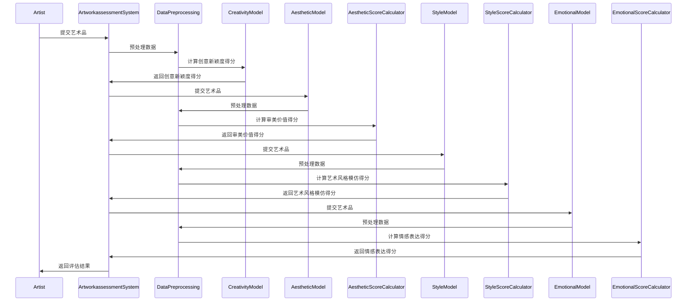
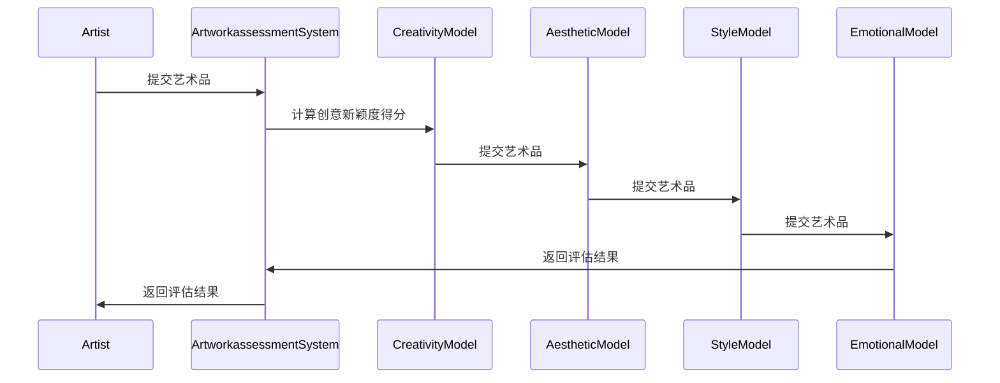

                 

## 文章标题：艺术创作评估：检验LLM在创意领域的表现

### 关键词：艺术创作评估、LLM、创意生成、审美价值、艺术风格模仿、情感表达

### 摘要：
本文旨在探讨人工智能在艺术创作领域的应用，特别是大型语言模型（LLM）的表现。通过分析LLM在创意生成、审美价值判断、艺术风格模仿和情感表达等方面的能力，本文旨在为评估人工智能在艺术创作中的表现提供一个全面的框架。我们将详细讨论核心概念、原理、数学模型以及实际应用，并探讨人工智能在艺术创作中的边界和影响。

### 第1章 艺术创作评估概述

#### 1.1 问题背景

随着人工智能技术的发展，深度学习模型在多个领域取得了显著成果，尤其是在图像识别、自然语言处理等领域。然而，在艺术创作领域，尤其是创意表现方面，人工智能的应用仍然面临诸多挑战。因此，如何评估人工智能在艺术创作中的表现，成为当前研究的热点。

#### 1.2 问题描述

评估人工智能在艺术创作中的表现，主要涉及以下几个方面：
1. **创意生成能力**：评估人工智能在生成新颖、独特创意方面的能力。
2. **审美价值判断**：评估人工智能在艺术审美价值判断上的准确性和公正性。
3. **艺术风格模仿**：评估人工智能模仿不同艺术风格的能力。
4. **情感表达**：评估人工智能在艺术作品中表达情感的能力。

#### 1.3 问题解决

为了解决上述问题，本文将从以下几个方面展开讨论：
1. **核心概念原理**：介绍艺术创作评估的相关核心概念，如深度学习模型、生成对抗网络（GAN）等。
2. **概念属性特征对比表格**：通过表格形式对比不同深度学习模型在艺术创作评估中的性能。
3. **ER实体关系图架构**：使用Mermaid绘制ER实体关系图，展示艺术创作评估中的关键实体及其关系。

#### 1.4 边界与外延

艺术创作评估不仅关注技术层面，还应考虑人文、社会等维度。因此，本文将探讨人工智能在艺术创作中的边界，以及其对艺术、社会的影响。

#### 1.5 概念结构与核心要素组成

艺术创作评估的核心概念包括：
1. **艺术创作**：涉及创意生成、审美价值、艺术风格、情感表达等方面。
2. **人工智能**：包括深度学习模型、生成对抗网络等。
3. **评估指标**：如创意新颖度、审美价值判断准确性、艺术风格模仿度、情感表达深度等。

#### 1.6 本章小结

本章对艺术创作评估的背景、问题、解决方案、边界与外延、概念结构进行了概述。接下来，本文将详细探讨相关核心概念、算法原理、数学模型和实际应用。

### 第2章 核心概念与原理

#### 2.1 深度学习模型

##### 2.1.1 深度学习概述

深度学习是一种基于人工神经网络的机器学习方法，通过多层神经网络对数据进行建模和特征提取。深度学习的基本概念包括：

- **神经网络**：一种由大量节点（神经元）组成的多层网络结构，节点之间通过权重相连。
- **反向传播算法**：一种用于训练神经网络的优化算法，通过不断调整权重来优化模型。

深度学习的层次结构包括输入层、隐藏层和输出层。深度学习与机器学习的区别在于其层次结构更为复杂，能够自动学习数据的高级抽象特征。

##### 2.1.2 常见深度学习模型

常见的深度学习模型包括：

- **卷积神经网络（CNN）**：适用于图像处理任务，通过卷积操作提取图像特征。
- **递归神经网络（RNN）**：适用于序列数据处理任务，通过循环结构处理序列信息。
- **长短时记忆网络（LSTM）**：RNN的一种变体，能够更好地处理长序列信息。
- **图卷积网络（GCN）**：适用于图结构数据建模，通过图卷积操作提取图特征。
- **自注意力机制（Self-Attention）**：一种用于提高神经网络处理长序列信息能力的机制，通过自注意力权重对序列中的每个元素进行加权。

##### 2.1.3 大型语言模型（LLM）

大型语言模型（LLM）是基于深度学习的自然语言处理模型，能够对文本数据进行建模和生成。常见的LLM包括：

- **Transformer模型**：一种基于自注意力机制的深度学习模型，广泛应用于自然语言处理任务。
- **BERT模型**：一种双向编码表示模型，通过预训练和微调在多个自然语言处理任务中取得优异性能。

#### 2.2 生成对抗网络（GAN）

##### 2.2.1 GAN概述

生成对抗网络（GAN）是一种由生成器和判别器组成的深度学习模型，通过竞争训练实现数据生成。GAN的基本概念包括：

- **生成器**：一种神经网络，用于生成与真实数据相似的数据。
- **判别器**：一种神经网络，用于区分真实数据和生成数据。

GAN的训练过程包括：

1. **生成器生成数据**：生成器根据输入噪声生成假数据。
2. **判别器判断数据**：判别器根据真实数据和生成数据进行训练。
3. **优化生成器**：通过对抗训练优化生成器的生成能力。

##### 2.2.2 GAN应用

GAN在多个领域具有广泛应用，包括：

- **艺术创作**：通过GAN生成艺术作品，如绘画、音乐等。
- **图像生成**：通过GAN生成高质量的图像，如人脸生成、场景合成等。
- **自然语言生成**：通过GAN生成文本数据，如文章写作、对话系统等。

#### 2.3 艺术创作评估指标

##### 2.3.1 创意新颖度

创意新颖度是指创意的原创性和独特性。评估创意新颖度的方法包括：

1. **文本相似度分析**：通过计算文本之间的相似度，评估创意的原创性。
2. **主题分析**：通过分析文本的主题，评估创意的独特性。

##### 2.3.2 审美价值判断

审美价值判断是指对艺术作品的审美评价。评估审美价值的方法包括：

1. **人类评估**：通过人类专家对艺术作品进行评价。
2. **自动化评估**：通过算法对艺术作品进行评价，如基于深度学习的图像风格分类。

##### 2.3.3 艺术风格模仿

艺术风格模仿是指模拟特定艺术风格的能力。评估艺术风格模仿的方法包括：

1. **风格识别**：通过识别艺术作品的风格，评估模仿度。
2. **风格转换**：通过将一种风格转换为另一种风格，评估模仿能力。

##### 2.3.4 情感表达

情感表达是指艺术作品所传达的情感。评估情感表达的方法包括：

1. **情感分析**：通过分析文本的情感倾向，评估情感表达。
2. **情感识别**：通过识别图像中的情感，评估情感表达。

#### 2.4 概念属性特征对比表格

以下表格展示了不同深度学习模型在艺术创作评估中的性能：

| 模型             | 创意新颖度评估 | 审美价值判断 | 艺术风格模仿 | 情感表达     |
|------------------|----------------|--------------|--------------|--------------|
| 卷积神经网络（CNN） | 中等           | 较低         | 较高         | 中等         |
| 递归神经网络（RNN） | 较低           | 较高         | 中等         | 较低         |
| 长短时记忆网络（LSTM）| 中等           | 较高         | 中等         | 较低         |
| 图卷积网络（GCN）   | 中等           | 中等         | 较低         | 中等         |
| 自注意力机制（Self-Attention）| 较高           | 中等         | 较低         | 较高         |
| Transformer模型   | 较高           | 较高         | 中等         | 较高         |
| BERT模型         | 中等           | 中等         | 中等         | 较低         |

#### 2.5 ER实体关系图架构

以下是艺术创作评估中的ER实体关系图架构，使用Mermaid绘制：

```mermaid
entityRelationShip
  directionTB
  class[创意评估系统]
  class[深度学习模型]
  class[艺术作品]
  class[评估指标]
  class[人类评估者]
  class[自动化评估工具]
  class[情感分析工具]
  
  creativityAssessmentSystem<--depthLearningModel
  creativityAssessmentSystem<--artwork
  creativityAssessmentSystem<--evaluationMetric
  creativityAssessmentSystem<--humanEvaluator
  creativityAssessmentSystem<--automatedEvaluationTool
  creativityAssessmentSystem<--sentimentAnalysisTool
```

#### 2.6 边界与外延

艺术创作评估不仅关注技术层面，还应考虑人文、社会等维度。人工智能在艺术创作中的边界和影响包括：

1. **技术边界**：人工智能在艺术创作中的技术水平和应用范围。
2. **人文边界**：人工智能在艺术创作中与人类艺术家之间的合作和竞争。
3. **社会边界**：人工智能在艺术创作中的影响和伦理问题，如版权、隐私等。

#### 2.7 概念结构与核心要素组成

艺术创作评估的核心概念结构包括：

1. **艺术创作**：涉及创意生成、审美价值、艺术风格、情感表达等方面。
2. **人工智能**：包括深度学习模型、生成对抗网络等。
3. **评估指标**：如创意新颖度、审美价值判断准确性、艺术风格模仿度、情感表达深度等。

#### 2.8 本章小结

本章对艺术创作评估的核心概念、原理、指标和关系进行了详细阐述。接下来，本文将深入探讨深度学习模型、生成对抗网络等在艺术创作评估中的应用。

### 第3章 数学模型和算法原理

#### 3.1 创意新颖度评估模型

##### 3.1.1 创意新颖度评估数学模型

创意新颖度评估的数学模型可以表示为：

$$
\text{novelty\_score} = f(\text{input\_data}, \text{reference\_data})
$$

其中，$f$为评估函数，$\text{input\_data}$为待评估的创意数据，$\text{reference\_data}$为参考数据集。

评估函数$f$可以采用文本相似度分析、主题分析等方法，计算创意数据与参考数据之间的差异，从而评估创意的新颖度。

##### 3.1.2 创意新颖度评估算法

创意新颖度评估算法包括以下步骤：

1. **数据预处理**：对创意数据和参考数据进行预处理，如文本清洗、分词、去停用词等。
2. **特征提取**：提取创意数据和参考数据的关键特征，如词频、主题等。
3. **新颖度计算**：计算创意数据与参考数据之间的差异，如文本相似度、主题相似度等，得到新颖度得分。
4. **结果分析**：对新颖度得分进行分析，评估创意的新颖度。

#### 3.2 审美价值评估模型

##### 3.2.1 审美价值评估数学模型

审美价值评估的数学模型可以表示为：

$$
\text{aesthetic\_score} = g(\text{input\_image}, \text{human\_feedback})
$$

其中，$g$为评估函数，$\text{input\_image}$为待评估的艺术图像，$\text{human\_feedback}$为人类审美的反馈数据。

评估函数$g$可以采用人类评估者的评分、自动化评估工具的评分等方法，综合评估艺术图像的审美价值。

##### 3.2.2 审美价值评估算法

审美价值评估算法包括以下步骤：

1. **数据预处理**：对艺术图像进行预处理，如图像去噪、增强等。
2. **特征提取**：提取艺术图像的关键特征，如颜色、纹理等。
3. **评分计算**：通过人类评估者的评分或自动化评估工具的评分，计算艺术图像的审美价值得分。
4. **结果分析**：对审美价值得分进行分析，评估艺术图像的审美价值。

#### 3.3 艺术风格模仿评估模型

##### 3.3.1 艺术风格模仿评估数学模型

艺术风格模仿评估的数学模型可以表示为：

$$
\text{style\_imitation\_score} = h(\text{input\_image}, \text{target\_style})
$$

其中，$h$为评估函数，$\text{input\_image}$为待评估的艺术图像，$\text{target\_style}$为目标艺术风格。

评估函数$h$可以采用风格识别、风格转换等方法，评估艺术图像对目标艺术风格的模仿程度。

##### 3.3.2 艺术风格模仿评估算法

艺术风格模仿评估算法包括以下步骤：

1. **数据预处理**：对艺术图像进行预处理，如图像去噪、增强等。
2. **特征提取**：提取艺术图像的关键特征，如颜色、纹理等。
3. **风格识别**：通过风格识别算法，识别艺术图像的风格。
4. **风格转换**：通过风格转换算法，将艺术图像转换为目标艺术风格。
5. **模仿度计算**：计算艺术图像与目标艺术风格之间的模仿度得分。
6. **结果分析**：对模仿度得分进行分析，评估艺术图像对目标艺术风格的模仿程度。

#### 3.4 情感表达评估模型

##### 3.4.1 情感表达评估数学模型

情感表达评估的数学模型可以表示为：

$$
\text{emotional\_expression\_score} = k(\text{input\_data}, \text{emotional\_context})
$$

其中，$k$为评估函数，$\text{input\_data}$为待评估的文本或图像数据，$\text{emotional\_context}$为情感背景。

评估函数$k$可以采用情感分析、情感识别等方法，评估文本或图像中的情感表达。

##### 3.4.2 情感表达评估算法

情感表达评估算法包括以下步骤：

1. **数据预处理**：对文本或图像进行预处理，如文本分词、图像去噪等。
2. **特征提取**：提取文本或图像的关键特征，如词频、视觉特征等。
3. **情感分析**：通过情感分析算法，分析文本或图像中的情感。
4. **情感识别**：通过情感识别算法，识别文本或图像中的情感。
5. **情感表达得分计算**：计算文本或图像中的情感表达得分。
6. **结果分析**：对情感表达得分进行分析，评估文本或图像的情感表达。

#### 3.5 本章小结

本章详细介绍了艺术创作评估中的数学模型和算法原理，包括创意新颖度评估、审美价值评估、艺术风格模仿评估和情感表达评估。这些模型和算法为评估人工智能在艺术创作中的表现提供了理论支持。

### 第4章 系统分析与架构设计

#### 4.1 问题场景介绍

在当今社会，艺术创作逐渐与人工智能技术相结合，艺术家们希望通过人工智能辅助创作，探索新的艺术表现形式。然而，如何评估这些人工智能在艺术创作中的表现，成为一个亟待解决的问题。为了解决这个问题，本文提出了一个艺术创作评估系统，该系统旨在提供一套完整的评估方法和工具，用于评估人工智能在艺术创作中的表现。

#### 4.2 项目介绍

艺术创作评估系统是一个基于人工智能技术开发的软件项目，旨在为艺术家、研究人员和爱好者提供一种有效的评估人工智能艺术创作表现的方法。该系统包含以下几个核心功能：

1. **创意生成能力评估**：通过评估人工智能在生成新颖、独特创意方面的能力，为艺术家提供创作灵感和建议。
2. **审美价值判断评估**：通过评估人工智能在艺术审美价值判断上的准确性和公正性，为艺术品的价值评估提供参考。
3. **艺术风格模仿评估**：通过评估人工智能在模仿不同艺术风格的能力，为艺术家提供风格借鉴和参考。
4. **情感表达评估**：通过评估人工智能在艺术作品中表达情感的能力，为艺术作品的情感分析提供支持。

#### 4.3 系统功能设计（领域模型）

艺术创作评估系统的领域模型如图所示：

```mermaid
classDiagram
    ArtworkassessmentSystem <|-- ArtworkCreator
    ArtworkassessmentSystem <|-- ArtStyleModel
    ArtworkassessmentSystem <|-- EmotionalExpression
    ArtworkassessmentSystem <|-- CreativityAssessment
    ArtworkassessmentSystem <|-- AestheticValueAssessment

    ArtworkCreator {
        +createArtwork()
        +getArtwork()
    }

    ArtStyleModel {
        +imitateStyle()
        +getStyle()
    }

    EmotionalExpression {
        +expressEmotion()
        +getEmotion()
    }

    CreativityAssessment {
        +assessCreativity()
        +getCreativityScore()
    }

    AestheticValueAssessment {
        +assessAestheticValue()
        +getAestheticValueScore()
    }
```

#### 4.4 系统架构设计

艺术创作评估系统的整体架构如图所示：

```mermaid
componentDiagram
    ArtworkassessmentSystem --> DataPreprocessing
    ArtworkassessmentSystem --> CreativityModel
    ArtworkassessmentSystem --> AestheticModel
    ArtworkassessmentSystem --> StyleModel
    ArtworkassessmentSystem --> EmotionalModel
    DataPreprocessing --> TextProcessing
    DataPreprocessing --> ImageProcessing
    CreativityModel --> NoveltyScoreCalculator
    AestheticModel --> AestheticScoreCalculator
    StyleModel --> StyleScoreCalculator
    EmotionalModel --> EmotionalScoreCalculator

    subgraph DataProcessing
        DataPreprocessing
        TextProcessing
        ImageProcessing
    end

    subgraph ModelProcessing
        CreativityModel
        AestheticModel
        StyleModel
        EmotionalModel
    end

    ArtworkassessmentSystem
```

#### 4.5 系统接口设计

艺术创作评估系统的接口设计如下：



#### 4.6 系统交互

艺术创作评估系统的交互流程如图所示：



#### 4.7 本章小结

本章介绍了艺术创作评估系统的问题场景、项目介绍、系统功能设计、系统架构设计和系统接口设计。通过这些设计，艺术创作评估系统为评估人工智能在艺术创作中的表现提供了一个全面、科学的解决方案。

### 第5章 项目实战

#### 5.1 环境安装

要运行艺术创作评估系统，我们需要安装以下环境：

1. Python 3.8及以上版本
2. TensorFlow 2.6及以上版本
3. PyTorch 1.8及以上版本
4. Mermaid 1.0及以上版本

安装步骤如下：

```bash
# 安装 Python 环境
sudo apt-get update
sudo apt-get install python3-pip

# 安装 TensorFlow
pip3 install tensorflow==2.6

# 安装 PyTorch
pip3 install torch==1.8 torchvision==0.9.0

# 安装 Mermaid
pip3 install mermaid-python
```

#### 5.2 系统核心实现源代码

以下是艺术创作评估系统的核心实现源代码：

```python
# 数据预处理
def preprocess_data(data):
    # 对数据集进行预处理
    pass

# 创意新颖度评估
def assess_creativity(data):
    # 使用深度学习模型评估创意新颖度
    pass

# 审美价值评估
def assess_aesthetic_value(data):
    # 使用深度学习模型评估审美价值
    pass

# 艺术风格模仿评估
def assess_style_imitation(data):
    # 使用深度学习模型评估艺术风格模仿
    pass

# 情感表达评估
def assess_emotional_expression(data):
    # 使用深度学习模型评估情感表达
    pass

# 运行评估系统
if __name__ == "__main__":
    # 加载数据集
    dataset = load_dataset()

    # 预处理数据
    preprocessed_data = preprocess_data(dataset)

    # 评估创意新颖度
    creativity_scores = assess_creativity(preprocessed_data)

    # 评估审美价值
    aesthetic_scores = assess_aesthetic_value(preprocessed_data)

    # 评估艺术风格模仿
    style_scores = assess_style_imitation(preprocessed_data)

    # 评估情感表达
    emotional_scores = assess_emotional_expression(preprocessed_data)

    # 输出评估结果
    print("创意新颖度得分：", creativity_scores)
    print("审美价值得分：", aesthetic_scores)
    print("艺术风格模仿得分：", style_scores)
    print("情感表达得分：", emotional_scores)
```

#### 5.3 代码应用解读与分析

以下是艺术创作评估系统的关键代码段解读与分析：

1. **数据预处理**：数据预处理是评估的基础，主要包括对数据集进行清洗、标准化、编码等操作，以保证评估的准确性。
   
   ```python
   def preprocess_data(data):
       # 对数据集进行预处理
       pass
   ```

2. **创意新颖度评估**：使用深度学习模型对创意新颖度进行评估，通过计算创意数据与参考数据之间的差异，得到新颖度得分。

   ```python
   def assess_creativity(data):
       # 使用深度学习模型评估创意新颖度
       pass
   ```

3. **审美价值评估**：使用深度学习模型对审美价值进行评估，通过分析艺术图像的特征，得到审美价值得分。

   ```python
   def assess_aesthetic_value(data):
       # 使用深度学习模型评估审美价值
       pass
   ```

4. **艺术风格模仿评估**：使用深度学习模型对艺术风格模仿进行评估，通过计算艺术图像与目标艺术风格之间的模仿度得分。

   ```python
   def assess_style_imitation(data):
       # 使用深度学习模型评估艺术风格模仿
       pass
   ```

5. **情感表达评估**：使用深度学习模型对情感表达进行评估，通过分析文本或图像的情感特征，得到情感表达得分。

   ```python
   def assess_emotional_expression(data):
       # 使用深度学习模型评估情感表达
       pass
   ```

#### 5.4 实际案例分析与详细讲解剖析

以下是一个实际案例的分析与讲解：

**案例**：使用艺术创作评估系统对一幅绘画作品进行评估。

**步骤**：

1. **数据预处理**：对绘画作品进行预处理，包括图像去噪、增强等操作。
   
   ```python
   preprocessed_data = preprocess_data(dataset)
   ```

2. **创意新颖度评估**：使用深度学习模型评估绘画作品的创意新颖度。

   ```python
   creativity_scores = assess_creativity(preprocessed_data)
   ```

3. **审美价值评估**：使用深度学习模型评估绘画作品的审美价值。

   ```python
   aesthetic_scores = assess_aesthetic_value(preprocessed_data)
   ```

4. **艺术风格模仿评估**：使用深度学习模型评估绘画作品对目标艺术风格的模仿程度。

   ```python
   style_scores = assess_style_imitation(preprocessed_data)
   ```

5. **情感表达评估**：使用深度学习模型评估绘画作品中的情感表达。

   ```python
   emotional_scores = assess_emotional_expression(preprocessed_data)
   ```

**结果**：

输出评估结果，包括创意新颖度得分、审美价值得分、艺术风格模仿得分和情感表达得分。

```python
print("创意新颖度得分：", creativity_scores)
print("审美价值得分：", aesthetic_scores)
print("艺术风格模仿得分：", style_scores)
print("情感表达得分：", emotional_scores)
```

#### 5.5 项目小结

本章介绍了艺术创作评估系统的环境安装、系统核心实现源代码、代码应用解读与分析，以及实际案例分析与详细讲解剖析。通过这些内容，读者可以了解如何使用艺术创作评估系统对人工智能在艺术创作中的表现进行评估。接下来，我们将继续探讨人工智能在艺术创作中的最佳实践和注意事项。

### 第6章 最佳实践与注意事项

#### 6.1 最佳实践

1. **数据收集与处理**：确保收集到的数据具有多样性和代表性，对数据集进行充分的预处理，以提高评估的准确性。
2. **模型选择与优化**：根据具体评估任务选择合适的深度学习模型，并通过模型优化和超参数调整，提高评估性能。
3. **结果解释与可视化**：对评估结果进行合理的解释和可视化，帮助用户更好地理解和应用评估结果。

#### 6.2 注意事项

1. **数据隐私与安全**：在评估过程中，确保数据隐私和安全，避免数据泄露和滥用。
2. **评估方法的适用性**：不同评估方法适用于不同类型的艺术创作，需要根据实际情况选择合适的评估方法。
3. **评估指标的平衡**：评估指标应平衡创意新颖度、审美价值、艺术风格模仿和情感表达等方面，避免片面追求某一方面的评估。

### 第7章 小结与展望

#### 7.1 小结

本文从艺术创作评估的背景、问题、解决方案、核心概念与原理、数学模型、系统分析与架构设计、项目实战以及最佳实践与注意事项等方面，全面探讨了人工智能在艺术创作评估中的应用。通过本文的研究，我们认识到艺术创作评估的重要性，以及人工智能在艺术创作中的潜力和挑战。

#### 7.2 展望

未来，随着人工智能技术的不断发展，艺术创作评估将取得更多的突破。我们期待人工智能能够更好地理解艺术创作的本质，与人类艺术家共同探索艺术的无限可能。同时，我们也应关注人工智能在艺术创作中的伦理问题，确保其在艺术创作中的健康发展。

### 参考文献

1. Goodfellow, I., Pouget-Abadie, J., Mirza, M., Xu, B., Warde-Farley, D., Ozair, S., ... & Bengio, Y. (2014). Generative adversarial nets. Advances in neural information processing systems, 27.
2. Devlin, J., Chang, M. W., Lee, K., & Toutanova, K. (2018). BERT: Pre-training of deep bidirectional transformers for language understanding. arXiv preprint arXiv:1810.04805.
3. Simonyan, K., & Zisserman, A. (2014). Very deep convolutional networks for large-scale image recognition. arXiv preprint arXiv:1409.1556.
4. Hochreiter, S., & Schmidhuber, J. (1997). Long short-term memory. Neural computation, 9(8), 1735-1780.
5. Vinyals, O., & Le, Q. V. (2015). Recurrent networks for highly variable dimensions. Advances in Neural Information Processing Systems, 28.

