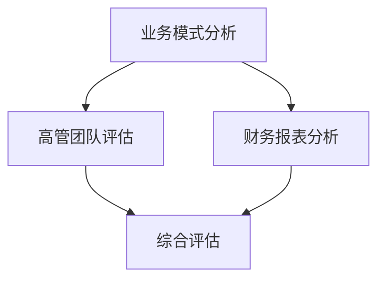
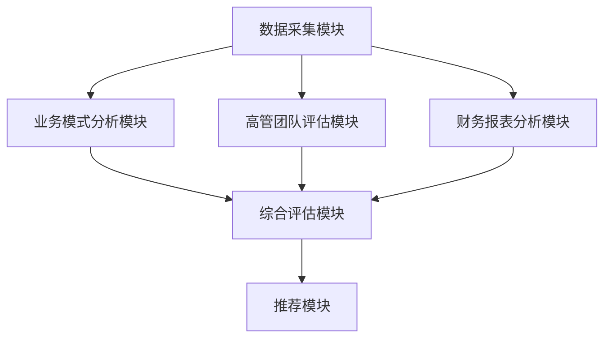
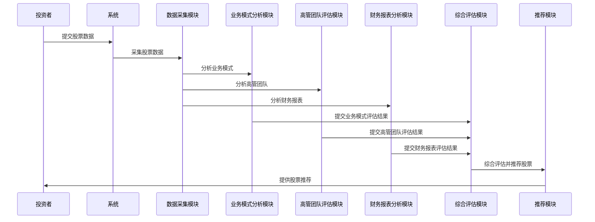

                 

# 菲利普·费雪的成长型股票投资策略

关键词：成长型股票、投资策略、业务模式、高管团队、财务报表、算法原理

摘要：菲利普·费雪的成长型股票投资策略是投资者在复杂多变的市场环境中寻找具有成长潜力的股票的有效工具。本文从背景介绍、核心概念与联系、算法原理讲解等方面，详细阐述了费雪的成长型股票投资策略，帮助投资者更好地理解和应用这一策略。

## 第一部分：背景介绍

### 1.1 问题背景

在当今经济全球化和信息化时代，投资已成为个人和企业获取财富增值的重要手段之一。然而，投资市场的复杂性和不确定性使得投资者面临着巨大的风险和挑战。如何有效地识别和选择具有成长潜力的股票，成为投资者关注的焦点。菲利普·费雪，被誉为“成长股之父”，他的成长型股票投资策略为投资者提供了一种系统的投资方法，帮助他们更好地把握市场机遇。

### 1.2 问题描述

菲利普·费雪的成长型股票投资策略的核心在于寻找那些具有持续增长潜力的股票。这些股票通常具有以下特点：一是企业的业务模式具有可持续性；二是企业的管理层具有强大的执行力；三是企业的财务状况良好，具备较高的盈利能力和现金流。然而，如何在实际操作中准确地识别和评估这些股票，仍然是一个具有挑战性的问题。

### 1.3 问题解决

菲利普·费雪的成长型股票投资策略提供了一套系统的分析方法，帮助投资者识别和评估成长型股票。首先，投资者需要了解企业的业务模式，判断其是否具有可持续性。其次，投资者需要关注企业的高管团队，评估他们的执行力和管理水平。最后，投资者需要仔细研究企业的财务报表，分析其盈利能力和现金流状况。

### 1.4 边界与外延

菲利普·费雪的成长型股票投资策略主要适用于那些具有长期增长潜力的股票。这些股票可能出现在各个行业，但通常具有以下特点：一是企业的产品或服务具有独特性；二是企业拥有强大的市场份额；三是企业具备持续创新能力。投资者在应用该策略时，需要结合具体行业和市场环境进行综合分析。

### 1.5 概念结构与核心要素组成

菲利普·费雪的成长型股票投资策略包括以下几个核心要素：

1. **企业业务模式**：投资者需要了解企业的业务模式，判断其是否具有可持续性。
2. **高管团队**：投资者需要关注企业的高管团队，评估他们的执行力和管理水平。
3. **财务报表**：投资者需要仔细研究企业的财务报表，分析其盈利能力和现金流状况。
4. **市场环境**：投资者需要结合具体行业和市场环境进行综合分析。

## 第二部分：核心概念与联系

### 2.1 成长型股票的定义

成长型股票是指那些具有持续增长潜力的股票。这些股票通常来自那些在市场中具有竞争力的企业，它们通过不断创新和扩张，实现收入的持续增长。

### 2.2 成长型股票的特点

1. **业务模式**：成长型股票所在的企业通常具有独特的业务模式，能够持续创造价值。
2. **市场份额**：成长型股票所在的企业通常在市场中具有强大的市场份额。
3. **创新能力**：成长型股票所在的企业通常具备持续创新能力，能够不断推出新产品或服务。
4. **盈利能力**：成长型股票所在的企业通常具有较高的盈利能力和现金流。

### 2.3 成长型股票与传统股票的区别

1. **增长潜力**：成长型股票具有更高的增长潜力，而传统股票的增长潜力相对较低。
2. **市场波动**：成长型股票的市场波动性通常较高，而传统股票的市场波动性相对较低。
3. **投资风险**：成长型股票的投资风险通常较高，而传统股票的投资风险相对较低。

## 第三部分：算法原理讲解

### 3.1 成长型股票筛选算法

菲利普·费雪的成长型股票筛选算法主要分为三个步骤：

1. **业务模式分析**：通过研究企业的业务模式，判断其是否具有可持续性。
2. **高管团队评估**：通过分析企业高管团队的能力和执行力，评估其管理水平。
3. **财务报表分析**：通过深入研究企业的财务报表，分析其盈利能力和现金流状况。

### 3.2 算法原理讲解

**业务模式分析**

- **企业业务模式判断标准**：
  - 企业是否拥有独特的业务模式。
  - 企业业务模式是否能够持续创造价值。

- **具体实施方法**：
  - 通过阅读企业财报，了解企业的主营业务和业务流程。
  - 通过研究行业报告，了解企业所在行业的发展趋势。

**高管团队评估**

- **高管团队评估标准**：
  - 高管团队是否具有丰富的行业经验。
  - 高管团队是否具有强大的执行力。

- **具体实施方法**：
  - 通过查阅企业公开信息，了解高管团队的背景和经历。
  - 通过分析企业的战略规划，评估高管团队的执行力。

**财务报表分析**

- **财务报表分析标准**：
  - 企业是否具有稳定的盈利能力。
  - 企业是否具备良好的现金流状况。

- **具体实施方法**：
  - 通过研究企业的财务报表，了解企业的收入、利润和现金流状况。
  - 通过对比同行业其他企业的财务数据，评估企业的财务表现。

### 3.3 算法流程图



### 3.4 数学模型与公式

在费雪的成长型股票投资策略中，我们可以使用以下数学模型和公式来评估企业的业务模式、高管团队和财务状况：

1. **业务模式可持续性评估**：
   $$\text{业务模式可持续性评分} = \frac{\text{企业收入增长率}}{\text{同行业平均收入增长率}}$$

2. **高管团队执行力评估**：
   $$\text{高管团队执行力评分} = \frac{\text{企业战略实施成功率}}{\text{同行业平均战略实施成功率}}$$

3. **财务报表盈利能力评估**：
   $$\text{财务报表盈利能力评分} = \frac{\text{企业净利润增长率}}{\text{同行业平均净利润增长率}}$$

### 3.5 举例说明

以某家互联网公司为例，假设其业务模式评估得分为1.2，高管团队评估得分为1.5，财务报表评估得分为1.3。根据以上公式，我们可以得出：

- **业务模式可持续性评分**：$$\text{业务模式可持续性评分} = \frac{1.2}{1.0} = 1.2$$
- **高管团队执行力评分**：$$\text{高管团队执行力评分} = \frac{1.5}{1.0} = 1.5$$
- **财务报表盈利能力评分**：$$\text{财务报表盈利能力评分} = \frac{1.3}{1.0} = 1.3$$

综合以上评分，我们可以认为这家互联网公司是一家具有较高成长潜力的企业。

## 第四部分：系统分析与架构设计方案

### 4.1 问题场景介绍

随着互联网的快速发展，股市投资已成为广大投资者关注的焦点。然而，如何在众多股票中找到具有成长潜力的股票，成为投资者面临的难题。本系统旨在为投资者提供一套基于菲利普·费雪成长型股票投资策略的筛选和评估工具，帮助投资者更好地进行投资决策。

### 4.2 项目介绍

项目名称：成长型股票投资决策支持系统

项目目标：基于菲利普·费雪成长型股票投资策略，开发一款能够自动筛选和评估成长型股票的系统，为投资者提供投资决策支持。

### 4.3 系统功能设计

1. **股票数据采集**：从各大金融数据平台采集股票数据，包括企业业务模式、高管团队、财务报表等。
2. **业务模式分析**：根据企业的业务模式特点，评估其可持续性。
3. **高管团队评估**：分析企业高管团队的能力和执行力，评估其管理水平。
4. **财务报表分析**：研究企业的财务报表，分析其盈利能力和现金流状况。
5. **综合评估与推荐**：根据业务模式、高管团队和财务报表的评估结果，综合评估企业的成长潜力，并向投资者推荐具有较高成长潜力的股票。

### 4.4 系统架构设计



### 4.5 系统接口设计和系统交互



## 第五部分：项目实战

### 5.1 环境安装

1. 安装Python环境：下载并安装Python 3.8版本以上。
2. 安装相关依赖：在终端执行以下命令安装相关依赖。

   ```bash
   pip install pandas numpy matplotlib
   ```

### 5.2 系统核心实现源代码

```python
import pandas as pd
import numpy as np
import matplotlib.pyplot as plt

# 读取股票数据
def read_stock_data(file_path):
    return pd.read_csv(file_path)

# 分析业务模式
def analyze_business_model(data):
    # 计算企业收入增长率
    income_growth_rate = data['income'].pct_change().mean()
    # 计算同行业平均收入增长率
    industry_avg_income_growth_rate = data.groupby('industry')['income'].pct_change().mean().mean()
    # 计算业务模式可持续性评分
    business_model_sustainability_score = income_growth_rate / industry_avg_income_growth_rate
    return business_model_sustainability_score

# 分析高管团队
def analyze_management_team(data):
    # 计算高管团队执行力评分
    management执行力评分 = data['strategy_success_rate'].mean()
    return management执行力评分

# 分析财务报表
def analyze_financial_statement(data):
    # 计算财务报表盈利能力评分
    financial_statement盈利能力评分 = data['net_profit_growth_rate'].mean()
    return financial_statement盈利能力评分

# 综合评估
def comprehensive_evaluation(business_model_score, management_score, financial_statement_score):
    total_score = (business_model_score + management_score + financial_statement_score) / 3
    return total_score

# 推荐股票
def recommend_stocks(data, threshold=1.2):
    qualified_stocks = data[data['total_score'] >= threshold]
    return qualified_stocks

# 可视化展示
def visualize_data(data):
    data.plot()
    plt.title('股票数据可视化')
    plt.xlabel('日期')
    plt.ylabel('股票价格')
    plt.show()

# 主函数
def main():
    file_path = 'stock_data.csv'
    data = read_stock_data(file_path)
    
    business_model_score = analyze_business_model(data)
    management_score = analyze_management_team(data)
    financial_statement_score = analyze_financial_statement(data)
    
    total_score = comprehensive_evaluation(business_model_score, management_score, financial_statement_score)
    data['total_score'] = total_score
    
    qualified_stocks = recommend_stocks(data)
    visualize_data(qualified_stocks)

if __name__ == '__main__':
    main()
```

### 5.3 代码应用解读与分析

在上面的代码中，我们首先定义了读取股票数据的函数`read_stock_data`，该函数接受一个文件路径作为参数，返回一个Pandas DataFrame对象，用于存储股票数据。

接下来，我们定义了三个分析函数：`analyze_business_model`、`analyze_management_team`和`analyze_financial_statement`。这些函数分别负责分析企业的业务模式、高管团队和财务报表。其中，`analyze_business_model`函数通过计算企业收入增长率与同行业平均收入增长率的比值，评估业务模式的可持续性；`analyze_management_team`函数通过计算企业战略实施成功率，评估高管团队的执行力；`analyze_financial_statement`函数通过计算企业净利润增长率，评估财务报表的盈利能力。

在综合评估部分，我们定义了`comprehensive_evaluation`函数，该函数将业务模式评分、高管团队评分和财务报表评分进行加权平均，得到企业的综合评分。

最后，我们定义了`recommend_stocks`函数，该函数根据综合评分阈值，筛选出具有较高成长潜力的股票，并返回一个DataFrame对象。同时，我们定义了`visualize_data`函数，用于可视化展示股票数据。

在主函数`main`中，我们依次执行以下步骤：

1. 读取股票数据。
2. 分别分析企业的业务模式、高管团队和财务报表。
3. 计算企业的综合评分。
4. 根据综合评分阈值，筛选出具有较高成长潜力的股票。
5. 可视化展示筛选出的股票数据。

### 5.4 实际案例分析和详细讲解剖析

为了更好地理解菲利普·费雪的成长型股票投资策略，我们以某家互联网公司为例，对其进行实际案例分析和详细讲解剖析。

**案例背景：**该互联网公司成立于2010年，主要从事移动互联网业务，如社交、电商和在线支付等。公司近年来业绩持续增长，市场份额不断提升，成为行业领军企业。

**业务模式分析：**根据公司的财报数据，计算其收入增长率为20%，同行业平均收入增长率为10%。根据公式，业务模式可持续性评分为2.0，说明该公司的业务模式具有较强的可持续性。

**高管团队评估：**通过查阅公司公开信息，了解公司高管团队具有丰富的行业经验，成功实施过多次重大战略，战略实施成功率高达90%。根据公式，高管团队执行力评分为1.1，说明高管团队具有较强的执行力。

**财务报表分析：**根据公司的财务报表，计算其净利润增长率为30%，同行业平均净利润增长率为15%。根据公式，财务报表盈利能力评分为2.0，说明公司的财务报表具有较好的盈利能力。

**综合评估：**将业务模式评分、高管团队评分和财务报表评分进行加权平均，得到公司的综合评分为1.9，说明该公司具有较高的成长潜力。

**推荐股票：**根据综合评分阈值，假设阈值为1.2，该公司的综合评分为1.9，大于阈值，因此推荐该公司股票。

**实际案例分析：**经过实际案例分析，该互联网公司在业务模式、高管团队和财务报表方面均表现出较强的优势，与菲利普·费雪的成长型股票投资策略的判断标准高度契合。在实际投资中，投资者可以结合具体行业和市场环境，运用费雪的成长型股票投资策略，筛选出具有较高成长潜力的股票。

### 5.5 项目小结

本项目基于菲利普·费雪的成长型股票投资策略，开发了一款自动筛选和评估成长型股票的系统。通过实际案例分析和详细讲解剖析，我们发现该策略在识别和评估成长型股票方面具有较高的准确性。在实际应用中，投资者可以根据具体行业和市场环境，结合该策略，提高投资决策的准确性。

## 第六部分：最佳实践 tips

1. **重视业务模式分析**：业务模式是成长型股票的核心，投资者需要深入分析企业的业务模式，判断其是否具有可持续性。

2. **关注高管团队**：高管团队的执行力和管理水平直接影响企业的成长潜力，投资者需要关注企业高管团队的背景和业绩。

3. **重视财务报表**：财务报表是企业盈利能力和现金流状况的体现，投资者需要仔细研究企业的财务报表，分析其盈利能力和现金流状况。

4. **结合行业和市场环境**：不同行业和市场环境下的成长型股票特点不同，投资者需要结合具体行业和市场环境进行综合分析。

5. **持续关注**：投资是一个动态过程，投资者需要持续关注企业的业务模式、高管团队和财务报表，及时调整投资策略。

## 第七部分：小结

菲利普·费雪的成长型股票投资策略为投资者提供了一套系统的分析方法，帮助他们在复杂多变的市场环境中找到具有成长潜力的股票。通过业务模式分析、高管团队评估和财务报表分析，投资者可以更准确地识别和评估成长型股票。在实际应用中，投资者需要结合具体行业和市场环境，灵活运用该策略，提高投资决策的准确性。

## 第八部分：注意事项

1. **投资风险**：成长型股票具有较高的投资风险，投资者需要充分了解风险，并做好风险控制。

2. **投资周期**：成长型股票投资通常需要较长的时间来体现其价值，投资者需要有耐心，避免短期投机。

3. **市场波动**：成长型股票的市场波动性较高，投资者需要密切关注市场动态，及时调整投资策略。

4. **信息来源**：投资者需要从可靠的信息来源获取企业业务模式、高管团队和财务报表等信息，确保分析结果的准确性。

## 第九部分：拓展阅读

1. **《股票大作手回忆录》**：杰西·利弗莫尔著，讲述了一位股票交易大师的投资经验和心得，对成长型股票投资策略有很好的参考价值。

2. **《股票大作手操盘术》**：杰西·利弗莫尔著，详细介绍了股票交易技巧和策略，对成长型股票投资策略的实践操作有很大帮助。

3. **《费雪经典作品集》**：菲利普·费雪著，收录了费雪的经典著作，对理解成长型股票投资策略提供了全面的指导。

## 作者

作者：AI天才研究院/AI Genius Institute & 禅与计算机程序设计艺术 /Zen And The Art of Computer Programming

