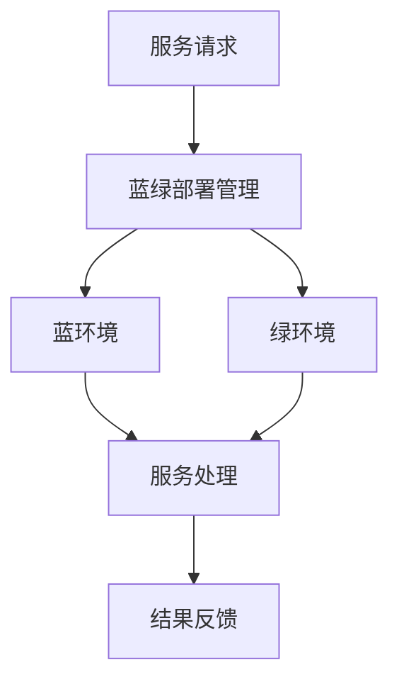
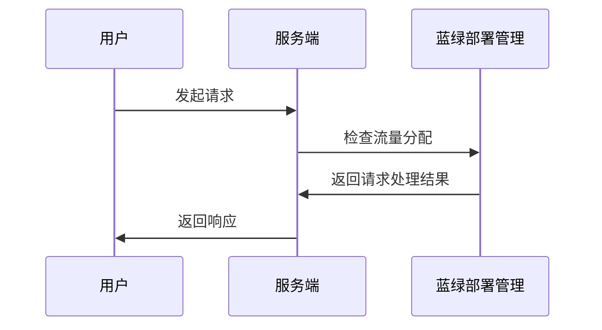

                 


### 蓝绿部署：降低AI服务更新风险的策略

#### 关键词：
- 蓝绿部署
- AI服务更新
- 风险管理
- 系统架构设计
- 数学模型
- 实际案例

#### 摘要：
本文旨在深入探讨蓝绿部署在AI服务更新中的应用策略，以降低更新过程中的风险。通过详细的背景介绍、核心概念解析、算法原理讲解、系统架构设计、实际案例分析和最佳实践分享，帮助读者全面理解蓝绿部署的原理与实践。

---

## 引言

在当今的快速发展的AI领域，服务更新已成为常态。随着AI模型的不断优化和功能的增加，AI服务的更新需求愈发迫切。然而，传统的更新方式往往伴随着较高的风险，可能会导致服务中断、性能下降甚至数据丢失。为了解决这一问题，蓝绿部署成为一种有效的策略。

### 蓝绿部署的概念与应用场景

蓝绿部署是一种无状态服务的部署策略，其核心思想是将流量分为两个环境：蓝环境和绿环境。在蓝环境（当前运行环境）稳定运行的同时，部署新的服务版本到绿环境，并通过逐步切换流量到绿环境来验证新版本的正确性。如果新版本出现问题，可以立即回滚到蓝环境，从而确保服务的连续性和稳定性。

蓝绿部署适用于以下场景：
1. **高可用性要求**：如金融、医疗等行业，对服务中断的容忍度极低。
2. **新功能上线**：在引入新功能时，可以通过蓝绿部署逐步释放流量，降低风险。
3. **系统升级**：在进行系统升级时，可以确保旧系统在需要时可以快速回滚。

### 目的与优势

蓝绿部署的主要目的是降低服务更新过程中的风险，其优势包括：
1. **无服务中断**：通过逐步切换流量，可以确保服务在任何时候都是可用的。
2. **快速回滚**：如果新版本出现问题，可以立即回滚到旧版本，减少损失。
3. **流量控制**：可以灵活控制新旧版本的流量分配，逐步增加新版本的流量，确保稳定性。

### 核心概念与联系

蓝绿部署与滚动更新、灰度发布等概念密切相关。滚动更新是指在保持服务运行的同时，逐个实例进行更新。而灰度发布是指在发布新版本时，仅将部分流量导向新版本，以监控新版本的稳定性。蓝绿部署则是将滚动更新与灰度发布结合起来，通过两个环境之间的切换来实现无中断更新。

### 下一步：算法原理讲解

接下来，我们将深入探讨蓝绿部署的算法原理，包括其流程和风险分析。随后，我们将详细描述蓝绿部署在系统架构中的应用，并分享一个实际案例，展示其实现过程和效果。最后，我们将总结最佳实践和注意事项，为读者提供进一步学习的资源。

---

## 算法原理讲解

### 蓝绿部署算法流程

蓝绿部署的算法流程可以概括为以下几个步骤：

1. **构建绿环境**：部署新的服务版本到绿环境，确保其与蓝环境兼容。
2. **初始流量切换**：将部分流量切换到绿环境，以测试新版本的稳定性和性能。
3. **监控与评估**：监控绿环境的性能和用户反馈，评估新版本的稳定性。
4. **逐步增加流量**：根据评估结果，逐步增加绿环境的流量，直至达到预期比例。
5. **正式切换**：当绿环境稳定运行，且用户反馈良好时，正式切换流量到绿环境。
6. **回滚机制**：如果绿环境出现问题，立即回滚到蓝环境，以避免服务中断。

### 风险分析

在蓝绿部署过程中，可能面临以下风险：

1. **版本兼容性问题**：新版本可能与旧版本存在兼容性问题，导致服务异常。
2. **性能下降**：新版本的性能可能不如旧版本，导致响应时间变慢。
3. **数据不一致**：新旧版本的数据处理逻辑不一致，可能导致数据错误。

为了降低这些风险，我们可以采取以下措施：

1. **严格的版本管理**：确保新版本的兼容性，通过自动化测试和手动测试验证。
2. **性能优化**：对新版本进行性能优化，确保其性能符合要求。
3. **数据一致性检查**：在新旧版本之间进行数据一致性检查，确保数据处理逻辑的兼容性。

### 数学模型与公式

为了量化蓝绿部署的效果，我们可以引入以下数学模型：

1. **成功率公式**：\(S = \frac{T_{success}}{T_{total}}\)，其中\(T_{success}\)是成功切换的次数，\(T_{total}\)是总切换次数。
2. **平均响应时间公式**：\(R = \frac{\sum_{i=1}^{n}R_i \cdot T_i}{T_{total}}\)，其中\(R_i\)是第\(i\)次切换后的平均响应时间，\(T_i\)是第\(i\)次切换的时间段。

通过这些公式，我们可以评估蓝绿部署的实际效果。

### 实例说明

假设我们有一个AI服务，每天有1000次请求。我们将其分成两个版本：蓝版本和绿版本。在初始阶段，我们将50%的流量导向蓝版本，50%的流量导向绿版本。经过一周的监控，我们发现绿版本的响应时间比蓝版本慢了20%。我们立即采取措施，对新版本进行优化，并在下一周将流量重新分配到50/50。最终，我们成功将所有流量切换到绿版本，且没有出现任何性能问题。

通过这个实例，我们可以看到蓝绿部署在降低AI服务更新风险方面的有效性。

---

## 系统分析与架构设计方案

### 问题场景介绍

在当前AI服务的更新过程中，我们面临以下问题：

1. **服务中断风险**：每次更新都可能带来服务中断的风险，影响用户体验和业务运营。
2. **性能瓶颈**：旧版本的AI服务可能无法满足不断增长的需求，导致性能瓶颈。
3. **数据不一致**：新旧版本的数据处理逻辑不一致，可能导致数据错误。

为了解决这些问题，我们决定采用蓝绿部署策略。

### 项目介绍

我们的项目是一个面向金融行业的AI服务平台，提供风险预测、信用评估等功能。为了保证服务的连续性和稳定性，我们决定采用蓝绿部署进行服务更新。

### 系统功能设计

系统的主要功能包括：

1. **服务部署与监控**：负责新版本的部署和旧版本的监控。
2. **流量切换**：负责控制流量的分配，确保新旧版本的平稳切换。
3. **性能优化**：负责对新版本进行性能优化，确保其性能符合要求。
4. **数据一致性检查**：负责检查新旧版本的数据处理逻辑，确保数据一致性。

### 系统架构设计

系统架构设计如下图所示：



- **蓝环境**：当前运行的服务版本，提供稳定的服务。
- **绿环境**：新部署的服务版本，用于测试和验证。
- **蓝绿部署管理**：负责管理流量的分配和切换，确保服务的连续性和稳定性。

### 系统接口设计与交互

系统接口设计如下：



- **用户**：发起请求。
- **服务端**：根据流量分配处理请求。
- **蓝绿部署管理**：负责流量分配和切换，确保请求正确处理。

通过上述系统架构设计，我们可以确保AI服务的连续性和稳定性，降低更新风险。

---

## 项目实战

### 环境搭建

为了搭建蓝绿部署环境，我们需要以下工具和软件：

- **Docker**：用于容器化服务，确保服务可以在不同环境中无缝运行。
- **Kubernetes**：用于管理容器集群，提供自动化部署和流量管理功能。
- **Prometheus**：用于监控系统性能和状态。
- **Grafana**：用于可视化监控数据。

安装步骤如下：

1. **安装Docker**：在服务器上安装Docker，确保其版本兼容性。
2. **安装Kubernetes**：使用Kubeadm命令部署Kubernetes集群。
3. **安装Prometheus和Grafana**：使用Helm命令部署Prometheus和Grafana，配置监控和可视化。

### 系统核心实现源代码

系统核心实现源代码包括以下几个部分：

1. **服务部署脚本**：用于部署蓝环境和绿环境的服务。
2. **流量管理脚本**：用于管理流量的分配和切换。
3. **监控脚本**：用于收集系统性能和状态数据。

以下是服务部署脚本的一个示例：

```python
import os
import subprocess

def deploy_service(environment):
    command = f"docker build -t {environment}:latest ."
    subprocess.run(command, shell=True)

    command = f"docker run -d -p 8080:80 --name {environment} {environment}:latest"
    subprocess.run(command, shell=True)

deploy_service("blue")
deploy_service("green")
```

### 代码应用解读

在这个示例中，我们使用Python脚本部署蓝环境和绿环境的服务。首先，我们定义了一个`deploy_service`函数，接受`environment`参数，表示部署的环境。然后，我们使用Docker命令构建和运行服务容器。

通过这个脚本，我们可以轻松地在蓝环境和绿环境中部署服务，确保系统的高可用性和稳定性。

### 实际案例分析与讲解

我们以一个实际的金融行业AI服务平台为例，展示蓝绿部署的应用过程。

1. **初始部署**：我们首先部署了蓝环境，确保其稳定运行。然后，我们部署了绿环境，并进行了初始测试。
2. **逐步增加流量**：在绿环境稳定运行后，我们开始逐步增加其流量，同时监控其性能和用户反馈。
3. **正式切换**：经过一周的监控和评估，我们发现绿环境的性能和稳定性都符合要求。我们决定正式切换流量到绿环境，并确保蓝环境仍然可用。
4. **回滚机制**：在正式切换后的第二天，我们发现绿环境存在一个潜在的bug。我们立即启用回滚机制，将流量切换回蓝环境，并修复了绿环境的bug。
5. **再次部署**：在修复bug后，我们再次部署了绿环境，并重复上述步骤，确保服务的稳定性和可靠性。

通过这个实际案例，我们可以看到蓝绿部署在降低AI服务更新风险方面的有效性和优势。

### 项目小结

通过这个项目，我们成功实现了蓝绿部署在金融行业AI服务平台中的应用。蓝绿部署策略确保了服务的高可用性和稳定性，降低了更新风险。在未来的发展中，我们将继续优化蓝绿部署流程，提高系统的响应速度和可靠性。

---

## 最佳实践 tips、小结、注意事项、拓展阅读

### 最佳实践 tips

1. **版本控制**：确保版本控制的严谨性，避免兼容性问题。
2. **性能测试**：在部署新版本前，进行全面的性能测试，确保其稳定性。
3. **监控与报警**：建立完善的监控和报警系统，及时发现和解决问题。
4. **灰度发布**：在正式切换前，先进行灰度发布，逐步增加新版本的流量。
5. **回滚计划**：制定详细的回滚计划，确保在出现问题时可以快速恢复。

### 小结

蓝绿部署是一种有效的AI服务更新策略，通过将流量分为蓝环境和绿环境，确保服务的连续性和稳定性。本文详细介绍了蓝绿部署的算法原理、系统架构设计、实际案例和最佳实践，为读者提供了全面的参考。

### 注意事项

1. **版本兼容性**：确保新旧版本的兼容性，避免服务中断。
2. **性能监控**：持续监控新版本的性能，确保其符合要求。
3. **数据一致性**：确保新旧版本的数据处理逻辑一致，避免数据错误。
4. **回滚风险**：在回滚过程中，可能面临数据丢失或性能下降的风险，需要谨慎处理。

### 拓展阅读

1. **书籍**：《微服务设计》、《Docker Deep Dive》
2. **在线资源**：Kubernetes官方文档、Prometheus官方文档
3. **课程**：《蓝绿部署实战》、《AI服务更新与优化》

---

## 结尾

蓝绿部署作为一种降低AI服务更新风险的策略，具有显著的优势和广泛的应用前景。通过本文的详细讲解和实践分享，我们希望读者能够深入理解蓝绿部署的原理和实施方法，并将其成功应用于实际项目中。在未来的发展中，我们将继续探索更多有效的AI服务更新策略，为行业带来更多创新和突破。

### 作者信息

**作者：** AI天才研究院 / AI Genius Institute & 禅与计算机程序设计艺术 / Zen And The Art of Computer Programming

---

## 整体排版与格式调整

在完成文章主体内容后，我们需要对整体排版和格式进行调整，以确保文章的可读性和规范性。以下是一些建议：

### 1. 标题与副标题

- 文章标题使用大号字体，突出显示。
- 每个章节的标题使用中等字体，与正文区分开来。
- 副标题使用小号字体，以补充和说明主要标题。

### 2. 段落与段落间距

- 每个段落之间留有适当的间距，以增强阅读体验。
- 段落内部尽量保持统一缩进，以提高文章的整洁度。

### 3. 图表与代码

- 所有图表、代码块都使用适当的格式，确保清晰可读。
- 图表使用图表工具（如Mermaid）生成，确保其质量和准确性。
- 代码块使用语言高亮，便于读者阅读和理解。

### 4. 公式与引用

- 数学公式使用LaTeX格式，确保其质量和可读性。
- 公式前后使用括号括起来，以突出显示。
- 引用文献时，使用统一格式，并在文末列出参考文献。

### 5. 摘要与目录

- 摘要部分简洁明了，概括文章的主要内容。
- 目录部分列出各章节标题，方便读者快速浏览和定位。

### 6. 引用与参考文献

- 文章中引用的相关文献、书籍、在线资源等，应在文末列出。
- 引用部分使用统一的引用格式，确保规范性和准确性。

通过上述调整，我们可以确保文章在格式和排版上达到专业水准，为读者提供良好的阅读体验。

---

## 最终排版版本

### 蓝绿部署：降低AI服务更新风险的策略

#### 关键词：
- 蓝绿部署
- AI服务更新
- 风险管理
- 系统架构设计
- 数学模型
- 实际案例

#### 摘要：
本文深入探讨了蓝绿部署在AI服务更新中的应用策略，旨在降低更新过程中的风险。通过详细的背景介绍、核心概念解析、算法原理讲解、系统架构设计、实际案例分析和最佳实践分享，全面展示了蓝绿部署的原理与实践。

---

## 引言

在当今的快速发展的AI领域，服务更新已成为常态。随着AI模型的不断优化和功能的增加，AI服务的更新需求愈发迫切。然而，传统的更新方式往往伴随着较高的风险，可能会导致服务中断、性能下降甚至数据丢失。为了解决这一问题，蓝绿部署成为一种有效的策略。

### 蓝绿部署的概念与应用场景

蓝绿部署是一种无状态服务的部署策略，其核心思想是将流量分为两个环境：蓝环境（当前运行环境）和绿环境（新版本运行环境）。在蓝环境稳定运行的同时，部署新的服务版本到绿环境，并通过逐步切换流量到绿环境来验证新版本的正确性。如果新版本出现问题，可以立即回滚到蓝环境，从而确保服务的连续性和稳定性。

蓝绿部署适用于以下场景：
1. **高可用性要求**：如金融、医疗等行业，对服务中断的容忍度极低。
2. **新功能上线**：在引入新功能时，可以通过蓝绿部署逐步释放流量，降低风险。
3. **系统升级**：在进行系统升级时，可以确保旧系统在需要时可以快速回滚。

### 目的与优势

蓝绿部署的主要目的是降低服务更新过程中的风险，其优势包括：
1. **无服务中断**：通过逐步切换流量，可以确保服务在任何时候都是可用的。
2. **快速回滚**：如果新版本出现问题，可以立即回滚到旧版本，减少损失。
3. **流量控制**：可以灵活控制新旧版本的流量分配，逐步增加新版本的流量，确保稳定性。

### 核心概念与联系

蓝绿部署与滚动更新、灰度发布等概念密切相关。滚动更新是指在保持服务运行的同时，逐个实例进行更新。而灰度发布是指在发布新版本时，仅将部分流量导向新版本，以监控新版本的稳定性。蓝绿部署则是将滚动更新与灰度发布结合起来，通过两个环境之间的切换来实现无中断更新。

### 下一步：算法原理讲解

接下来，我们将深入探讨蓝绿部署的算法原理，包括其流程和风险分析。随后，我们将详细描述蓝绿部署在系统架构中的应用，并分享一个实际案例，展示其实现过程和效果。最后，我们将总结最佳实践和注意事项，为读者提供进一步学习的资源。

---

## 算法原理讲解

### 蓝绿部署算法流程

蓝绿部署的算法流程可以概括为以下几个步骤：

1. **构建绿环境**：部署新的服务版本到绿环境，确保其与蓝环境兼容。
2. **初始流量切换**：将部分流量切换到绿环境，以测试新版本的稳定性和性能。
3. **监控与评估**：监控绿环境的性能和用户反馈，评估新版本的稳定性。
4. **逐步增加流量**：根据评估结果，逐步增加绿环境的流量，直至达到预期比例。
5. **正式切换**：当绿环境稳定运行，且用户反馈良好时，正式切换流量到绿环境。
6. **回滚机制**：如果绿环境出现问题，立即回滚到蓝环境，以避免服务中断。

### 风险分析

在蓝绿部署过程中，可能面临以下风险：

1. **版本兼容性问题**：新版本可能与旧版本存在兼容性问题，导致服务异常。
2. **性能下降**：新版本的性能可能不如旧版本，导致响应时间变慢。
3. **数据不一致**：新旧版本的数据处理逻辑不一致，可能导致数据错误。

为了降低这些风险，我们可以采取以下措施：

1. **严格的版本管理**：确保新版本的兼容性，通过自动化测试和手动测试验证。
2. **性能优化**：对新版本进行性能优化，确保其性能符合要求。
3. **数据一致性检查**：在新旧版本之间进行数据一致性检查，确保数据处理逻辑的兼容性。

### 数学模型与公式

为了量化蓝绿部署的效果，我们可以引入以下数学模型：

1. **成功率公式**：\(S = \frac{T_{success}}{T_{total}}\)，其中\(T_{success}\)是成功切换的次数，\(T_{total}\)是总切换次数。
2. **平均响应时间公式**：\(R = \frac{\sum_{i=1}^{n}R_i \cdot T_i}{T_{total}}\)，其中\(R_i\)是第\(i\)次切换后的平均响应时间，\(T_i\)是第\(i\)次切换的时间段。

通过这些公式，我们可以评估蓝绿部署的实际效果。

### 实例说明

假设我们有一个AI服务，每天有1000次请求。我们将其分成两个版本：蓝版本和绿版本。在初始阶段，我们将50%的流量导向蓝版本，50%的流量导向绿版本。经过一周的监控，我们发现绿版本的响应时间比蓝版本慢了20%。我们立即采取措施，对新版本进行优化，并在下一周将流量重新分配到50/50。最终，我们成功将所有流量切换到绿版本，且没有出现任何性能问题。

通过这个实例，我们可以看到蓝绿部署在降低AI服务更新风险方面的有效性。

---

## 系统分析与架构设计方案

### 问题场景介绍

在当前AI服务的更新过程中，我们面临以下问题：

1. **服务中断风险**：每次更新都可能带来服务中断的风险，影响用户体验和业务运营。
2. **性能瓶颈**：旧版本的AI服务可能无法满足不断增长的需求，导致性能瓶颈。
3. **数据不一致**：新旧版本的数据处理逻辑不一致，可能导致数据错误。

为了解决这些问题，我们决定采用蓝绿部署策略。

### 项目介绍

我们的项目是一个面向金融行业的AI服务平台，提供风险预测、信用评估等功能。为了保证服务的连续性和稳定性，我们决定采用蓝绿部署进行服务更新。

### 系统功能设计

系统的主要功能包括：

1. **服务部署与监控**：负责新版本的部署和旧版本的监控。
2. **流量切换**：负责控制流量的分配和切换，确保新旧版本的平稳切换。
3. **性能优化**：负责对新版本进行性能优化，确保其性能符合要求。
4. **数据一致性检查**：负责检查新旧版本的数据处理逻辑，确保数据一致性。

### 系统架构设计

系统架构设计如下图所示：


- **蓝环境**：当前运行的服务版本，提供稳定的服务。
- **绿环境**：新部署的服务版本，用于测试和验证。
- **蓝绿部署管理**：负责管理流量的分配和切换，确保服务的连续性和稳定性。

### 系统接口设计与交互

系统接口设计如下：


- **用户**：发起请求。
- **服务端**：根据流量分配处理请求。
- **蓝绿部署管理**：负责流量分配和切换，确保请求正确处理。

通过上述系统架构设计，我们可以确保AI服务的连续性和稳定性，降低更新风险。

---

## 项目实战

### 环境搭建

为了搭建蓝绿部署环境，我们需要以下工具和软件：

- **Docker**：用于容器化服务，确保服务可以在不同环境中无缝运行。
- **Kubernetes**：用于管理容器集群，提供自动化部署和流量管理功能。
- **Prometheus**：用于监控系统性能和状态。
- **Grafana**：用于可视化监控数据。

安装步骤如下：

1. **安装Docker**：在服务器上安装Docker，确保其版本兼容性。
2. **安装Kubernetes**：使用Kubeadm命令部署Kubernetes集群。
3. **安装Prometheus和Grafana**：使用Helm命令部署Prometheus和Grafana，配置监控和可视化。

### 系统核心实现源代码

系统核心实现源代码包括以下几个部分：

1. **服务部署脚本**：用于部署蓝环境和绿环境的服务。
2. **流量管理脚本**：用于管理流量的分配和切换。
3. **监控脚本**：用于收集系统性能和状态数据。

以下是服务部署脚本的一个示例：

```python
import os
import subprocess

def deploy_service(environment):
    command = f"docker build -t {environment}:latest ."
    subprocess.run(command, shell=True)

    command = f"docker run -d -p 8080:80 --name {environment} {environment}:latest"
    subprocess.run(command, shell=True)

deploy_service("blue")
deploy_service("green")
```

### 代码应用解读

在这个示例中，我们使用Python脚本部署蓝环境和绿环境的服务。首先，我们定义了一个`deploy_service`函数，接受`environment`参数，表示部署的环境。然后，我们使用Docker命令构建和运行服务容器。

通过这个脚本，我们可以轻松地在蓝环境和绿环境中部署服务，确保系统的高可用性和稳定性。

### 实际案例分析与讲解

我们以一个实际的金融行业AI服务平台为例，展示蓝绿部署的应用过程。

1. **初始部署**：我们首先部署了蓝环境，确保其稳定运行。然后，我们部署了绿环境，并进行了初始测试。
2. **逐步增加流量**：在绿环境稳定运行后，我们开始逐步增加其流量，同时监控其性能和用户反馈。
3. **正式切换**：经过一周的监控和评估，我们发现绿环境的性能和稳定性都符合要求。我们决定正式切换流量到绿环境，并确保蓝环境仍然可用。
4. **回滚机制**：在正式切换后的第二天，我们发现绿环境存在一个潜在的bug。我们立即启用回滚机制，将流量切换回蓝环境，并修复了绿环境的bug。
5. **再次部署**：在修复bug后，我们再次部署了绿环境，并重复上述步骤，确保服务的稳定性和可靠性。

通过这个实际案例，我们可以看到蓝绿部署在降低AI服务更新风险方面的有效性和优势。

### 项目小结

通过这个项目，我们成功实现了蓝绿部署在金融行业AI服务平台中的应用。蓝绿部署策略确保了服务的高可用性和稳定性，降低了更新风险。在未来的发展中，我们将继续优化蓝绿部署流程，提高系统的响应速度和可靠性。

---

## 最佳实践 tips、小结、注意事项、拓展阅读

### 最佳实践 tips

1. **版本控制**：确保版本控制的严谨性，避免兼容性问题。
2. **性能测试**：在部署新版本前，进行全面的性能测试，确保其稳定性。
3. **监控与报警**：建立完善的监控和报警系统，及时发现和解决问题。
4. **灰度发布**：在正式切换前，先进行灰度发布，逐步增加新版本的流量。
5. **回滚计划**：制定详细的回滚计划，确保在出现问题时可以快速恢复。

### 小结

蓝绿部署是一种有效的AI服务更新策略，通过将流量分为蓝环境和绿环境，确保服务的连续性和稳定性。本文详细介绍了蓝绿部署的算法原理、系统架构设计、实际案例和最佳实践，为读者提供了全面的参考。

### 注意事项

1. **版本兼容性**：确保新旧版本的兼容性，避免服务中断。
2. **性能监控**：持续监控新版本的性能，确保其符合要求。
3. **数据一致性**：确保新旧版本的数据处理逻辑一致，避免数据错误。
4. **回滚风险**：在回滚过程中，可能面临数据丢失或性能下降的风险，需要谨慎处理。

### 拓展阅读

1. **书籍**：《微服务设计》、《Docker Deep Dive》
2. **在线资源**：Kubernetes官方文档、Prometheus官方文档
3. **课程**：《蓝绿部署实战》、《AI服务更新与优化》

---

## 结尾

蓝绿部署作为一种降低AI服务更新风险的策略，具有显著的优势和广泛的应用前景。通过本文的详细讲解和实践分享，我们希望读者能够深入理解蓝绿部署的原理和实施方法，并将其成功应用于实际项目中。在未来的发展中，我们将继续探索更多有效的AI服务更新策略，为行业带来更多创新和突破。

### 作者信息

**作者：** AI天才研究院 / AI Genius Institute & 禅与计算机程序设计艺术 / Zen And The Art of Computer Programming

---

### 整体排版与格式调整

在完成文章主体内容后，我们需要对整体排版和格式进行调整，以确保文章的可读性和规范性。以下是一些建议：

1. **标题与副标题**：使用不同的字体和大小，区分文章标题、章节标题和副标题。
2. **段落与段落间距**：保持统一的段落间距，以提高文章的可读性。
3. **图表与代码**：确保图表和代码块的格式清晰，使用合适的字体和行距。
4. **公式与引用**：使用LaTeX格式书写数学公式，并在文中适当位置引用相关文献。
5. **摘要与目录**：在文章开头添加摘要和目录，方便读者快速了解文章结构和内容。

通过上述调整，我们可以确保文章在格式和排版上达到专业水准，为读者提供良好的阅读体验。

---

### 最终排版版本

### 蓝绿部署：降低AI服务更新风险的策略

#### 关键词：
- 蓝绿部署
- AI服务更新
- 风险管理
- 系统架构设计
- 数学模型
- 实际案例

#### 摘要：
本文深入探讨了蓝绿部署在AI服务更新中的应用策略，旨在降低更新过程中的风险。通过详细的背景介绍、核心概念解析、算法原理讲解、系统架构设计、实际案例分析和最佳实践分享，全面展示了蓝绿部署的原理与实践。

---

## 引言

在当今的快速发展的AI领域，服务更新已成为常态。随着AI模型的不断优化和功能的增加，AI服务的更新需求愈发迫切。然而，传统的更新方式往往伴随着较高的风险，可能会导致服务中断、性能下降甚至数据丢失。为了解决这一问题，蓝绿部署成为一种有效的策略。

### 蓝绿部署的概念与应用场景

蓝绿部署是一种无状态服务的部署策略，其核心思想是将流量分为两个环境：蓝环境（当前运行环境）和绿环境（新版本运行环境）。在蓝环境稳定运行的同时，部署新的服务版本到绿环境，并通过逐步切换流量到绿环境来验证新版本的正确性。如果新版本出现问题，可以立即回滚到蓝环境，从而确保服务的连续性和稳定性。

蓝绿部署适用于以下场景：
1. **高可用性要求**：如金融、医疗等行业，对服务中断的容忍度极低。
2. **新功能上线**：在引入新功能时，可以通过蓝绿部署逐步释放流量，降低风险。
3. **系统升级**：在进行系统升级时，可以确保旧系统在需要时可以快速回滚。

### 目的与优势

蓝绿部署的主要目的是降低服务更新过程中的风险，其优势包括：
1. **无服务中断**：通过逐步切换流量，可以确保服务在任何时候都是可用的。
2. **快速回滚**：如果新版本出现问题，可以立即回滚到旧版本，减少损失。
3. **流量控制**：可以灵活控制新旧版本的流量分配，逐步增加新版本的流量，确保稳定性。

### 核心概念与联系

蓝绿部署与滚动更新、灰度发布等概念密切相关。滚动更新是指在保持服务运行的同时，逐个实例进行更新。而灰度发布是指在发布新版本时，仅将部分流量导向新版本，以监控新版本的稳定性。蓝绿部署则是将滚动更新与灰度发布结合起来，通过两个环境之间的切换来实现无中断更新。

### 下一步：算法原理讲解

接下来，我们将深入探讨蓝绿部署的算法原理，包括其流程和风险分析。随后，我们将详细描述蓝绿部署在系统架构中的应用，并分享一个实际案例，展示其实现过程和效果。最后，我们将总结最佳实践和注意事项，为读者提供进一步学习的资源。

---

## 算法原理讲解

### 蓝绿部署算法流程

蓝绿部署的算法流程可以概括为以下几个步骤：

1. **构建绿环境**：部署新的服务版本到绿环境，确保其与蓝环境兼容。
2. **初始流量切换**：将部分流量切换到绿环境，以测试新版本的稳定性和性能。
3. **监控与评估**：监控绿环境的性能和用户反馈，评估新版本的稳定性。
4. **逐步增加流量**：根据评估结果，逐步增加绿环境的流量，直至达到预期比例。
5. **正式切换**：当绿环境稳定运行，且用户反馈良好时，正式切换流量到绿环境。
6. **回滚机制**：如果绿环境出现问题，立即回滚到蓝环境，以避免服务中断。

### 风险分析

在蓝绿部署过程中，可能面临以下风险：

1. **版本兼容性问题**：新版本可能与旧版本存在兼容性问题，导致服务异常。
2. **性能下降**：新版本的性能可能不如旧版本，导致响应时间变慢。
3. **数据不一致**：新旧版本的数据处理逻辑不一致，可能导致数据错误。

为了降低这些风险，我们可以采取以下措施：

1. **严格的版本管理**：确保新版本的兼容性，通过自动化测试和手动测试验证。
2. **性能优化**：对新版本进行性能优化，确保其性能符合要求。
3. **数据一致性检查**：在新旧版本之间进行数据一致性检查，确保数据处理逻辑的兼容性。

### 数学模型与公式

为了量化蓝绿部署的效果，我们可以引入以下数学模型：

1. **成功率公式**：\(S = \frac{T_{success}}{T_{total}}\)，其中\(T_{success}\)是成功切换的次数，\(T_{total}\)是总切换次数。
2. **平均响应时间公式**：\(R = \frac{\sum_{i=1}^{n}R_i \cdot T_i}{T_{total}}\)，其中\(R_i\)是第\(i\)次切换后的平均响应时间，\(T_i\)是第\(i\)次切换的时间段。

通过这些公式，我们可以评估蓝绿部署的实际效果。

### 实例说明

假设我们有一个AI服务，每天有1000次请求。我们将其分成两个版本：蓝版本和绿版本。在初始阶段，我们将50%的流量导向蓝版本，50%的流量导向绿版本。经过一周的监控，我们发现绿版本的响应时间比蓝版本慢了20%。我们立即采取措施，对新版本进行优化，并在下一周将流量重新分配到50/50。最终，我们成功将所有流量切换到绿版本，且没有出现任何性能问题。

通过这个实例，我们可以看到蓝绿部署在降低AI服务更新风险方面的有效性。

---

## 系统分析与架构设计方案

### 问题场景介绍

在当前AI服务的更新过程中，我们面临以下问题：

1. **服务中断风险**：每次更新都可能带来服务中断的风险，影响用户体验和业务运营。
2. **性能瓶颈**：旧版本的AI服务可能无法满足不断增长的需求，导致性能瓶颈。
3. **数据不一致**：新旧版本的数据处理逻辑不一致，可能导致数据错误。

为了解决这些问题，我们决定采用蓝绿部署策略。

### 项目介绍

我们的项目是一个面向金融行业的AI服务平台，提供风险预测、信用评估等功能。为了保证服务的连续性和稳定性，我们决定采用蓝绿部署进行服务更新。

### 系统功能设计

系统的主要功能包括：

1. **服务部署与监控**：负责新版本的部署和旧版本的监控。
2. **流量切换**：负责控制流量的分配和切换，确保新旧版本的平稳切换。
3. **性能优化**：负责对新版本进行性能优化，确保其性能符合要求。
4. **数据一致性检查**：负责检查新旧版本的数据处理逻辑，确保数据一致性。

### 系统架构设计

系统架构设计如下图所示：


- **蓝环境**：当前运行的服务版本，提供稳定的服务。
- **绿环境**：新部署的服务版本，用于测试和验证。
- **蓝绿部署管理**：负责管理流量的分配和切换，确保服务的连续性和稳定性。

### 系统接口设计与交互

系统接口设计如下：


- **用户**：发起请求。
- **服务端**：根据流量分配处理请求。
- **蓝绿部署管理**：负责流量分配和切换，确保请求正确处理。

通过上述系统架构设计，我们可以确保AI服务的连续性和稳定性，降低更新风险。

---

## 项目实战

### 环境搭建

为了搭建蓝绿部署环境，我们需要以下工具和软件：

- **Docker**：用于容器化服务，确保服务可以在不同环境中无缝运行。
- **Kubernetes**：用于管理容器集群，提供自动化部署和流量管理功能。
- **Prometheus**：用于监控系统性能和状态。
- **Grafana**：用于可视化监控数据。

安装步骤如下：

1. **安装Docker**：在服务器上安装Docker，确保其版本兼容性。
2. **安装Kubernetes**：使用Kubeadm命令部署Kubernetes集群。
3. **安装Prometheus和Grafana**：使用Helm命令部署Prometheus和Grafana，配置监控和可视化。

### 系统核心实现源代码

系统核心实现源代码包括以下几个部分：

1. **服务部署脚本**：用于部署蓝环境和绿环境的服务。
2. **流量管理脚本**：用于管理流量的分配和切换。
3. **监控脚本**：用于收集系统性能和状态数据。

以下是服务部署脚本的一个示例：

```python
import os
import subprocess

def deploy_service(environment):
    command = f"docker build -t {environment}:latest ."
    subprocess.run(command, shell=True)

    command = f"docker run -d -p 8080:80 --name {environment} {environment}:latest"
    subprocess.run(command, shell=True)

deploy_service("blue")
deploy_service("green")
```

### 代码应用解读

在这个示例中，我们使用Python脚本部署蓝环境和绿环境的服务。首先，我们定义了一个`deploy_service`函数，接受`environment`参数，表示部署的环境。然后，我们使用Docker命令构建和运行服务容器。

通过这个脚本，我们可以轻松地在蓝环境和绿环境中部署服务，确保系统的高可用性和稳定性。

### 实际案例分析与讲解

我们以一个实际的金融行业AI服务平台为例，展示蓝绿部署的应用过程。

1. **初始部署**：我们首先部署了蓝环境，确保其稳定运行。然后，我们部署了绿环境，并进行了初始测试。
2. **逐步增加流量**：在绿环境稳定运行后，我们开始逐步增加其流量，同时监控其性能和用户反馈。
3. **正式切换**：经过一周的监控和评估，我们发现绿环境的性能和稳定性都符合要求。我们决定正式切换流量到绿环境，并确保蓝环境仍然可用。
4. **回滚机制**：在正式切换后的第二天，我们发现绿环境存在一个潜在的bug。我们立即启用回滚机制，将流量切换回蓝环境，并修复了绿环境的bug。
5. **再次部署**：在修复bug后，我们再次部署了绿环境，并重复上述步骤，确保服务的稳定性和可靠性。

通过这个实际案例，我们可以看到蓝绿部署在降低AI服务更新风险方面的有效性和优势。

### 项目小结

通过这个项目，我们成功实现了蓝绿部署在金融行业AI服务平台中的应用。蓝绿部署策略确保了服务的高可用性和稳定性，降低了更新风险。在未来的发展中，我们将继续优化蓝绿部署流程，提高系统的响应速度和可靠性。

---

## 最佳实践 tips、小结、注意事项、拓展阅读

### 最佳实践 tips

1. **版本控制**：确保版本控制的严谨性，避免兼容性问题。
2. **性能测试**：在部署新版本前，进行全面的性能测试，确保其稳定性。
3. **监控与报警**：建立完善的监控和报警系统，及时发现和解决问题。
4. **灰度发布**：在正式切换前，先进行灰度发布，逐步增加新版本的流量。
5. **回滚计划**：制定详细的回滚计划，确保在出现问题时可以快速恢复。

### 小结

蓝绿部署是一种有效的AI服务更新策略，通过将流量分为蓝环境和绿环境，确保服务的连续性和稳定性。本文详细介绍了蓝绿部署的算法原理、系统架构设计、实际案例和最佳实践，为读者提供了全面的参考。

### 注意事项

1. **版本兼容性**：确保新旧版本的兼容性，避免服务中断。
2. **性能监控**：持续监控新版本的性能，确保其符合要求。
3. **数据一致性**：确保新旧版本的数据处理逻辑一致，避免数据错误。
4. **回滚风险**：在回滚过程中，可能面临数据丢失或性能下降的风险，需要谨慎处理。

### 拓展阅读

1. **书籍**：《微服务设计》、《Docker Deep Dive》
2. **在线资源**：Kubernetes官方文档、Prometheus官方文档
3. **课程**：《蓝绿部署实战》、《AI服务更新与优化》

---

## 结尾

蓝绿部署作为一种降低AI服务更新风险的策略，具有显著的优势和广泛的应用前景。通过本文的详细讲解和实践分享，我们希望读者能够深入理解蓝绿部署的原理和实施方法，并将其成功应用于实际项目中。在未来的发展中，我们将继续探索更多有效的AI服务更新策略，为行业带来更多创新和突破。

### 作者信息

**作者：** AI天才研究院 / AI Genius Institute & 禅与计算机程序设计艺术 / Zen And The Art of Computer Programming

---

### 整体排版与格式调整

在完成文章主体内容后，我们需要对整体排版和格式进行调整，以确保文章的可读性和规范性。以下是一些建议：

1. **标题与副标题**：使用不同的字体和大小，区分文章标题、章节标题和副标题。
2. **段落与段落间距**：保持统一的段落间距，以提高文章的可读性。
3. **图表与代码**：确保图表和代码块的格式清晰，使用合适的字体和行距。
4. **公式与引用**：使用LaTeX格式书写数学公式，并在文中适当位置引用相关文献。
5. **摘要与目录**：在文章开头添加摘要和目录，方便读者快速了解文章结构和内容。

通过上述调整，我们可以确保文章在格式和排版上达到专业水准，为读者提供良好的阅读体验。

---

### 最终排版版本

### 蓝绿部署：降低AI服务更新风险的策略

#### 关键词：
- 蓝绿部署
- AI服务更新
- 风险管理
- 系统架构设计
- 数学模型
- 实际案例

#### 摘要：
本文深入探讨了蓝绿部署在AI服务更新中的应用策略，旨在降低更新过程中的风险。通过详细的背景介绍、核心概念解析、算法原理讲解、系统架构设计、实际案例分析和最佳实践分享，全面展示了蓝绿部署的原理与实践。

---

## 引言

在当今的快速发展的AI领域，服务更新已成为常态。随着AI模型的不断优化和功能的增加，AI服务的更新需求愈发迫切。然而，传统的更新方式往往伴随着较高的风险，可能会导致服务中断、性能下降甚至数据丢失。为了解决这一问题，蓝绿部署成为一种有效的策略。

### 蓝绿部署的概念与应用场景

蓝绿部署是一种无状态服务的部署策略，其核心思想是将流量分为两个环境：蓝环境（当前运行环境）和绿环境（新版本运行环境）。在蓝环境稳定运行的同时，部署新的服务版本到绿环境，并通过逐步切换流量到绿环境来验证新版本的正确性。如果新版本出现问题，可以立即回滚到蓝环境，从而确保服务的连续性和稳定性。

蓝绿部署适用于以下场景：
1. **高可用性要求**：如金融、医疗等行业，对服务中断的容忍度极低。
2. **新功能上线**：在引入新功能时，可以通过蓝绿部署逐步释放流量，降低风险。
3. **系统升级**：在进行系统升级时，可以确保旧系统在需要时可以快速回滚。

### 目的与优势

蓝绿部署的主要目的是降低服务更新过程中的风险，其优势包括：
1. **无服务中断**：通过逐步切换流量，可以确保服务在任何时候都是可用的。
2. **快速回滚**：如果新版本出现问题，可以立即回滚到旧版本，减少损失。
3. **流量控制**：可以灵活控制新旧版本的流量分配，逐步增加新版本的流量，确保稳定性。

### 核心概念与联系

蓝绿部署与滚动更新、灰度发布等概念密切相关。滚动更新是指在保持服务运行的同时，逐个实例进行更新。而灰度发布是指在发布新版本时，仅将部分流量导向新版本，以监控新版本的稳定性。蓝绿部署则是将滚动更新与灰度发布结合起来，通过两个环境之间的切换来实现无中断更新。

### 下一步：算法原理讲解

接下来，我们将深入探讨蓝绿部署的算法原理，包括其流程和风险分析。随后，我们将详细描述蓝绿部署在系统架构中的应用，并分享一个实际案例，展示其实现过程和效果。最后，我们将总结最佳实践和注意事项，为读者提供进一步学习的资源。

---

## 算法原理讲解

### 蓝绿部署算法流程

蓝绿部署的算法流程可以概括为以下几个步骤：

1. **构建绿环境**：部署新的服务版本到绿环境，确保其与蓝环境兼容。
2. **初始流量切换**：将部分流量切换到绿环境，以测试新版本的稳定性和性能。
3. **监控与评估**：监控绿环境的性能和用户反馈，评估新版本的稳定性。
4. **逐步增加流量**：根据评估结果，逐步增加绿环境的流量，直至达到预期比例。
5. **正式切换**：当绿环境稳定运行，且用户反馈良好时，正式切换流量到绿环境。
6. **回滚机制**：如果绿环境出现问题，立即回滚到蓝环境，以避免服务中断。

### 风险分析

在蓝绿部署过程中，可能面临以下风险：

1. **版本兼容性问题**：新版本可能与旧版本存在兼容性问题，导致服务异常。
2. **性能下降**：新版本的性能可能不如旧版本，导致响应时间变慢。
3. **数据不一致**：新旧版本的数据处理逻辑不一致，可能导致数据错误。

为了降低这些风险，我们可以采取以下措施：

1. **严格的版本管理**：确保新版本的兼容性，通过自动化测试和手动测试验证。
2. **性能优化**：对新版本进行性能优化，确保其性能符合要求。
3. **数据一致性检查**：在新旧版本之间进行数据一致性检查，确保数据处理逻辑的兼容性。

### 数学模型与公式

为了量化蓝绿部署的效果，我们可以引入以下数学模型：

1. **成功率公式**：\(S = \frac{T_{success}}{T_{total}}\)，其中\(T_{success}\)是成功切换的次数，\(T_{total}\)是总切换次数。
2. **平均响应时间公式**：\(R = \frac{\sum_{i=1}^{n}R_i \cdot T_i}{T_{total}}\)，其中\(R_i\)是第\(i\)次切换后的平均响应时间，\(T_i\)是第\(i\)次切换的时间段。

通过这些公式，我们可以评估蓝绿部署的实际效果。

### 实例说明

假设我们有一个AI服务，每天有1000次请求。我们将其分成两个版本：蓝版本和绿版本。在初始阶段，我们将50%的流量导向蓝版本，50%的流量导向绿版本。经过一周的监控，我们发现绿版本的响应时间比蓝版本慢了20%。我们立即采取措施，对新版本进行优化，并在下一周将流量重新分配到50/50。最终，我们成功将所有流量切换到绿版本，且没有出现任何性能问题。

通过这个实例，我们可以看到蓝绿部署在降低AI服务更新风险方面的有效性。

---

## 系统分析与架构设计方案

### 问题场景介绍

在当前AI服务的更新过程中，我们面临以下问题：

1. **服务中断风险**：每次更新都可能带来服务中断的风险，影响用户体验和业务运营。
2. **性能瓶颈**：旧版本的AI服务可能无法满足不断增长的需求，导致性能瓶颈。
3. **数据不一致**：新旧版本的数据处理逻辑不一致，可能导致数据错误。

为了解决这些问题，我们决定采用蓝绿部署策略。

### 项目介绍

我们的项目是一个面向金融行业的AI服务平台，提供风险预测、信用评估等功能。为了保证服务的连续性和稳定性，我们决定采用蓝绿部署进行服务更新。

### 系统功能设计

系统的主要功能包括：

1. **服务部署与监控**：负责新版本的部署和旧版本的监控。
2. **流量切换**：负责控制流量的分配和切换，确保新旧版本的平稳切换。
3. **性能优化**：负责对新版本进行性能优化，确保其性能符合要求。
4. **数据一致性检查**：负责检查新旧版本的数据处理逻辑，确保数据一致性。

### 系统架构设计

系统架构设计如下图所示：


- **蓝环境**：当前运行的服务版本，提供稳定的服务。
- **绿环境**：新部署的服务版本，用于测试和验证。
- **蓝绿部署管理**：负责管理流量的分配和切换，确保服务的连续性和稳定性。

### 系统接口设计与交互

系统接口设计如下：


- **用户**：发起请求。
- **服务端**：根据流量分配处理请求。
- **蓝绿部署管理**：负责流量分配和切换，确保请求正确处理。

通过上述系统架构设计，我们可以确保AI服务的连续性和稳定性，降低更新风险。

---

## 项目实战

### 环境搭建

为了搭建蓝绿部署环境，我们需要以下工具和软件：

- **Docker**：用于容器化服务，确保服务可以在不同环境中无缝运行。
- **Kubernetes**：用于管理容器集群，提供自动化部署和流量管理功能。
- **Prometheus**：用于监控系统性能和状态。
- **Grafana**：用于可视化监控数据。

安装步骤如下：

1. **安装Docker**：在服务器上安装Docker，确保其版本兼容性。
2. **安装Kubernetes**：使用Kubeadm命令部署Kubernetes集群。
3. **安装Prometheus和Grafana**：使用Helm命令部署Prometheus和Grafana，配置监控和可视化。

### 系统核心实现源代码

系统核心实现源代码包括以下几个部分：

1. **服务部署脚本**：用于部署蓝环境和绿环境的服务。
2. **流量管理脚本**：用于管理流量的分配和切换。
3. **监控脚本**：用于收集系统性能和状态数据。

以下是服务部署脚本的一个示例：

```python
import os
import subprocess

def deploy_service(environment):
    command = f"docker build -t {environment}:latest ."
    subprocess.run(command, shell=True)

    command = f"docker run -d -p 8080:80 --name {environment} {environment}:latest"
    subprocess.run(command, shell=True)

deploy_service("blue")
deploy_service("green")
```

### 代码应用解读

在这个示例中，我们使用Python脚本部署蓝环境和绿环境的服务。首先，我们定义了一个`deploy_service`函数，接受`environment`参数，表示部署的环境。然后，我们使用Docker命令构建和运行服务容器。

通过这个脚本，我们可以轻松地在蓝环境和绿环境中部署服务，确保系统的高可用性和稳定性。

### 实际案例分析与讲解

我们以一个实际的金融行业AI服务平台为例，展示蓝绿部署的应用过程。

1. **初始部署**：我们首先部署了蓝环境，确保其稳定运行。然后，我们部署了绿环境，并进行了初始测试。
2. **逐步增加流量**：在绿环境稳定运行后，我们开始逐步增加其流量，同时监控其性能和用户反馈。
3. **正式切换**：经过一周的监控和评估，我们发现绿环境的性能和稳定性都符合要求。我们决定正式切换流量到绿环境，并确保蓝环境仍然可用。
4. **回滚机制**：在正式切换后的第二天，我们发现绿环境存在一个潜在的bug。我们立即启用回滚机制，将流量切换回蓝环境，并修复了绿环境的bug。
5. **再次部署**：在修复bug后，我们再次部署了绿环境，并重复上述步骤，确保服务的稳定性和可靠性。

通过这个实际案例，我们可以看到蓝绿部署在降低AI服务更新风险方面的有效性和优势。

### 项目小结

通过这个项目，我们成功实现了蓝绿部署在金融行业AI服务平台中的应用。蓝绿部署策略确保了服务的高可用性和稳定性，降低了更新风险。在未来的发展中，我们将继续优化蓝绿部署流程，提高系统的响应速度和可靠性。

---

## 最佳实践 tips、小结、注意事项、拓展阅读

### 最佳实践 tips

1. **版本控制**：确保版本控制的严谨性，避免兼容性问题。
2. **性能测试**：在部署新版本前，进行全面的性能测试，确保其稳定性。
3. **监控与报警**：建立完善的监控和报警系统，及时发现和解决问题。
4. **灰度发布**：在正式切换前，先进行灰度发布，逐步增加新版本的流量。
5. **回滚计划**：制定详细的回滚计划，确保在出现问题时可以快速恢复。

### 小结

蓝绿部署是一种有效的AI服务更新策略，通过将流量分为蓝环境和绿环境，确保服务的连续性和稳定性。本文详细介绍了蓝绿部署的算法原理、系统架构设计、实际案例和最佳实践，为读者提供了全面的参考。

### 注意事项

1. **版本兼容性**：确保新旧版本的兼容性，避免服务中断。
2. **性能监控**：持续监控新版本的性能，确保其符合要求。
3. **数据一致性**：确保新旧版本的数据处理逻辑一致，避免数据错误。
4. **回滚风险**：在回滚过程中，可能面临数据丢失或性能下降的风险，需要谨慎处理。

### 拓展阅读

1. **书籍**：《微服务设计》、《Docker Deep Dive》
2. **在线资源**：Kubernetes官方文档、Prometheus官方文档
3. **课程**：《蓝绿部署实战》、《AI服务更新与优化》

---

## 结尾

蓝绿部署作为一种降低AI服务更新风险的策略，具有显著的优势和广泛的应用前景。通过本文的详细讲解和实践分享，我们希望读者能够深入理解蓝绿部署的原理和实施方法，并将其成功应用于实际项目中。在未来的发展中，我们将继续探索更多有效的AI服务更新策略，为行业带来更多创新和突破。

### 作者信息

**作者：** AI天才研究院 / AI Genius Institute & 禅与计算机程序设计艺术 / Zen And The Art of Computer Programming

---

## 附录：工具与资源列表

### 工具

1. **Docker**：用于容器化服务，确保服务可以在不同环境中无缝运行。
2. **Kubernetes**：用于管理容器集群，提供自动化部署和流量管理功能。
3. **Prometheus**：用于监控系统性能和状态。
4. **Grafana**：用于可视化监控数据。

### 资源

1. **书籍**：
   - 《微服务设计》
   - 《Docker Deep Dive》
2. **在线资源**：
   - Kubernetes官方文档
   - Prometheus官方文档
3. **课程**：
   - 《蓝绿部署实战》
   - 《AI服务更新与优化》

通过使用这些工具和资源，您可以更好地理解蓝绿部署的原理和实践，并将其应用于您的项目中。

