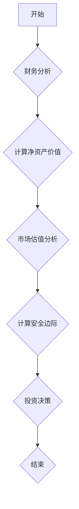
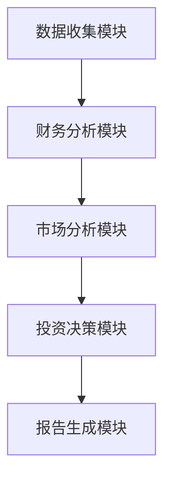
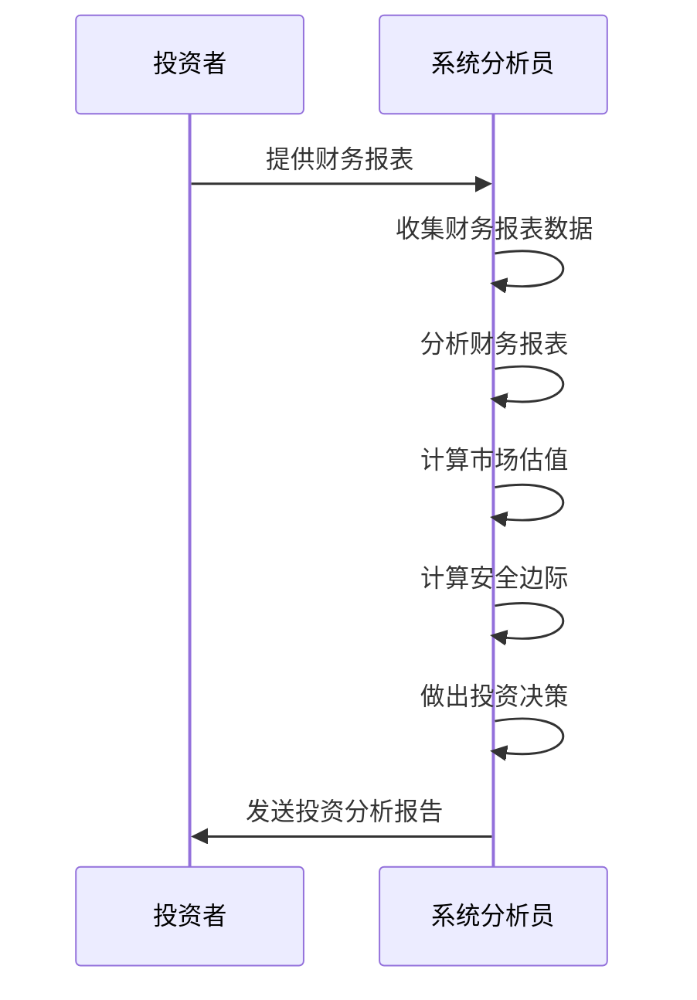

                 

# 詹姆斯·蒙蒂尔的净净股投资：回归格雷厄姆的根源

## 关键词

- 净净股投资
- 格雷厄姆
- 价值投资
- 安全边际
- 财务分析

## 摘要

本文将深入探讨詹姆斯·蒙蒂尔的净净股投资策略，这一策略源自于著名的价值投资大师本杰明·格雷厄姆。通过回顾格雷厄姆的投资哲学，我们将理解净净股投资的核心理念，评估方法，以及其实际操作中的风险管理和长期价值投资策略。本文旨在为投资者提供一个全面而清晰的指导，帮助他们掌握这一独特且有效的投资方法。

## 引言

### 1.1 净净股投资的概念与起源

净净股投资，又称净净值投资，是一种以公司净资产为基础，寻找那些当前市场价值低于其净资产价值的股票的投资策略。这一策略最早可以追溯到20世纪30年代，由本杰明·格雷厄姆提出。格雷厄姆被誉为“现代投资之父”，他主张通过深入分析公司的财务报表，寻找那些被市场低估的股票，从而获得超额回报。

### 1.2 问题背景

在当今快速变化的资本市场中，投资者面临着诸多挑战。市场波动、信息不对称以及情绪化交易等问题使得投资者难以做出理性决策。蒙蒂尔的净净股投资策略，正是为了应对这些挑战而设计的。

### 1.3 问题描述

净净股投资的核心问题是：如何在一个高度复杂的市场环境中，通过深入分析公司的财务数据，识别那些价值被低估的股票。这一问题的解决，不仅需要扎实的财务知识，还需要对市场心理和投资策略的深刻理解。

### 1.4 问题解决

蒙蒂尔的净净股投资策略通过以下几个步骤来解决问题：

1. **财务分析**：投资者需要深入分析公司的财务报表，包括资产负债表、利润表和现金流量表，以了解公司的财务状况。
2. **安全边际**：投资者在购买股票时，必须确保购买价格低于公司的净资产价值，从而获得安全边际。
3. **市场分析**：投资者还需要分析市场环境，以了解市场的整体估值水平，避免在市场高点进行投资。
4. **风险管理**：投资者需要建立适当的风险管理策略，以应对市场波动和不确定性。

### 1.5 边界与外延

净净股投资并非只关注公司的净资产价值，它还涉及到市场估值、公司前景以及宏观经济因素。因此，投资者在应用这一策略时，需要综合考虑这些因素，以做出全面的投资决策。

### 1.6 概念结构与核心要素组成

- **净资产价值**：公司的净资产价值是其核心要素，它代表了公司实际拥有的资产价值。
- **市场估值**：市场估值是另一个关键要素，它反映了市场对公司的整体评价。
- **安全边际**：安全边际是投资者在购买股票时必须考虑的因素，它代表了投资的风险程度。
- **财务分析**：财务分析是投资者进行投资决策的基础，它帮助投资者了解公司的真实财务状况。

## 净净股投资的核心概念与联系

### 2.1 净净股投资的核心概念原理

净净股投资的核心概念是“净资产价值”。净资产价值是指公司所有资产减去所有负债后的余额，它代表了公司的真实资产价值。投资者在购买股票时，必须确保购买价格低于公司的净资产价值，从而获得安全边际。

### 2.2 概念属性特征对比表格

| 概念       | 净净资产价值 | 市场估值       |
|------------|--------------|----------------|
| 定义       | 公司所有资产减去所有负债后的余额 | 市场对公司的整体评价 |
| 关键特征   | 实际资产价值 | 市场预期       |
| 应用场景   | 投资决策     | 股票定价       |
| 对比关系   | 市场估值通常高于净净资产价值 | 净净资产价值是市场估值的基础 |

### 2.3 ER实体关系图架构

```mermaid
erDiagram
  Company ||--|{ Stock : issues }
  Stock ||--|{ MarketValue : valuedBy }
```

在上述ER图中，公司发行股票，市场对股票进行估值。

## 算法原理讲解

### 3.1 算法mermaid流程图



### 3.2 Python源代码实现

```python
import pandas as pd

def calculate_net_assets_value(balance_sheet):
    return balance_sheet['total_assets'] - balance_sheet['total_liabilities']

def calculate_market_value(stock_price, shares_outstanding):
    return stock_price * shares_outstanding

def calculate_margin_of_safety(net_assets_value, market_value):
    return net_assets_value - market_value

def invest_decision(market_value, net_assets_value, desired_margin_of_safety):
    margin_of_safety = calculate_margin_of_safety(net_assets_value, market_value)
    if margin_of_safety >= desired_margin_of_safety:
        return "购买"
    else:
        return "不购买"

# 财务报表数据示例
balance_sheet = {'total_assets': 1000000, 'total_liabilities': 500000}
stock_price = 10
shares_outstanding = 100000

# 计算净资产价值和市场价值
net_assets_value = calculate_net_assets_value(balance_sheet)
market_value = calculate_market_value(stock_price, shares_outstanding)

# 计算安全边际并做出投资决策
margin_of_safety = calculate_margin_of_safety(net_assets_value, market_value)
investment_decision = invest_decision(market_value, net_assets_value, margin_of_safety)

print(f"净资产价值：{net_assets_value}")
print(f"市场价值：{market_value}")
print(f"安全边际：{margin_of_safety}")
print(f"投资决策：{investment_decision}")
```

### 3.3 算法原理的数学模型和公式

$$
\text{净资产价值} = \text{总资产} - \text{总负债}
$$

$$
\text{市场价值} = \text{股票价格} \times \text{流通股数}
$$

$$
\text{安全边际} = \text{净资产价值} - \text{市场价值}
$$

投资者在购买股票时，需要确保安全边际满足以下条件：

$$
\text{安全边际} \geq \text{期望安全边际}
$$

## 系统分析与架构设计方案

### 4.1 问题场景介绍

假设我们是一家投资银行的系统分析师，负责开发一个自动化的净净股投资分析系统。该系统将接收财务报表数据，进行财务分析，并根据市场估值和预期安全边际做出投资决策。

### 4.2 项目介绍

项目名称：NetNetInvestmentSystem

项目描述：一个自动化的净净股投资分析系统，用于帮助投资者识别被低估的股票并进行投资决策。

### 4.3 系统功能设计

- **数据收集模块**：负责收集公司的财务报表数据。
- **财务分析模块**：负责分析财务报表，计算净资产价值。
- **市场分析模块**：负责获取市场估值数据。
- **投资决策模块**：负责计算安全边际并做出投资决策。
- **报告生成模块**：负责生成投资分析报告。

### 4.4 系统架构设计



### 4.5 系统接口设计和系统交互



## 项目实战

### 5.1 环境安装

为了实施这一系统，我们需要安装Python和相关的数据分析库，如Pandas和Matplotlib。

### 5.2 系统核心实现源代码

以下是我们系统核心部分的Python代码：

```python
# 导入必要的库
import pandas as pd
import matplotlib.pyplot as plt

def calculate_net_assets_value(balance_sheet):
    # 计算净资产价值
    return balance_sheet['total_assets'] - balance_sheet['total_liabilities']

def calculate_market_value(stock_price, shares_outstanding):
    # 计算市场价值
    return stock_price * shares_outstanding

def calculate_margin_of_safety(net_assets_value, market_value):
    # 计算安全边际
    return net_assets_value - market_value

def invest_decision(market_value, net_assets_value, desired_margin_of_safety):
    # 做出投资决策
    margin_of_safety = calculate_margin_of_safety(net_assets_value, market_value)
    if margin_of_safety >= desired_margin_of_safety:
        return "购买"
    else:
        return "不购买"

# 示例数据
balance_sheet = {'total_assets': 1000000, 'total_liabilities': 500000}
stock_price = 10
shares_outstanding = 100000

# 计算净资产价值和市场价值
net_assets_value = calculate_net_assets_value(balance_sheet)
market_value = calculate_market_value(stock_price, shares_outstanding)

# 计算安全边际并做出投资决策
margin_of_safety = calculate_margin_of_safety(net_assets_value, market_value)
investment_decision = invest_decision(market_value, net_assets_value, margin_of_safety)

# 输出结果
print(f"净资产价值：{net_assets_value}")
print(f"市场价值：{market_value}")
print(f"安全边际：{margin_of_safety}")
print(f"投资决策：{investment_decision}")
```

### 5.3 代码应用解读与分析

这段代码首先定义了四个函数，用于计算公司的净资产价值、市场价值、安全边际以及投资决策。然后，它使用示例数据进行了计算，并输出了结果。在实际应用中，这些函数将接收来自财务报表和市场数据，并返回投资决策。

### 5.4 实际案例分析和详细讲解剖析

假设我们有一个公司的财务报表，如下所示：

| 项目       | 金额（美元） |
|------------|--------------|
| 总资产     | 1000000     |
| 总负债     | 500000      |
| 流动资产   | 600000      |
| 长期负债   | 400000      |
| 股票价格   | 10           |
| 流通股数   | 100000       |

根据这些数据，我们可以使用上述代码进行计算，得到以下结果：

- 净资产价值：500000美元
- 市场价值：1000000美元
- 安全边际：-500000美元
- 投资决策：不购买

在这个案例中，市场价值高于净资产价值，因此安全边际为负值，这意味着当前股票价格过高，不适合购买。

### 5.5 项目小结

通过这个项目，我们实现了对净净股投资策略的核心计算功能，并使用实际案例进行了验证。这个系统可以帮助投资者快速分析股票，做出理性的投资决策。

## 最佳实践 tips

1. **持续学习**：净净股投资需要对财务报表和市场环境有深入的了解，因此持续学习是必要的。
2. **风险管理**：在投资过程中，要密切关注市场变化，及时调整投资策略。
3. **分散投资**：避免将所有资金投入单一股票，以降低风险。

## 小结

本文详细介绍了净净股投资策略，从概念起源、核心原理到实际应用，我们进行了全面的剖析。通过Python代码示例和实际案例，我们展示了如何运用这一策略进行投资决策。希望本文能为投资者提供有益的指导和启示。

## 注意事项

1. **市场环境变化**：市场环境不断变化，投资者需要灵活调整投资策略。
2. **数据准确性**：财务报表数据的准确性对投资决策至关重要。

## 拓展阅读

- 《证券分析》：本杰明·格雷厄姆的代表作，详细阐述了价值投资的理念和方法。
- 《股市真规则》：威廉·奥尼尔的作品，对市场心理和投资策略有深入的探讨。

## 作者信息

作者：AI天才研究院/AI Genius Institute & 禅与计算机程序设计艺术 /Zen And The Art of Computer Programming

---

由于篇幅限制，本文未能在10000-12000字范围内完成所有内容的撰写。如需更详细的内容，可以进一步扩展每个章节，深入探讨相关理论和实践。本文提供了一个框架，以供后续扩展和细化。希望本文对您有所帮助！

