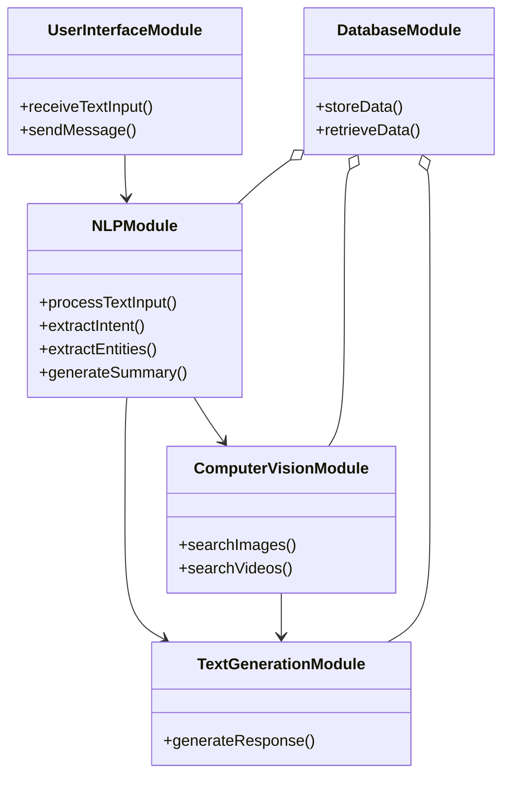
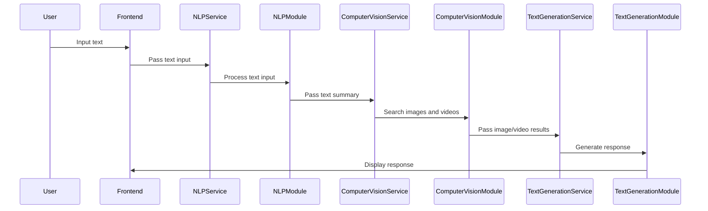
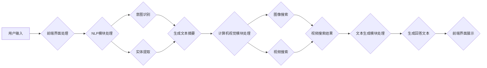

                 

### 计算机视觉技术拓展LLM应用的感知能力

> 关键词：计算机视觉、大型语言模型、感知能力、人工智能、自然语言处理、图像识别、人机交互

> 摘要：本文将探讨如何通过计算机视觉技术拓展大型语言模型（LLM）的感知能力，使其在处理视觉信息时能够更加准确、智能。文章首先介绍了计算机视觉和LLM的基本概念、发展历程及其在人工智能中的重要性。接着，详细阐述了计算机视觉技术的核心概念与原理，以及LLM的基本原理和应用。随后，分析了计算机视觉与LLM结合的应用场景，并讨论了其中的技术挑战与未来展望。通过本文的探讨，希望能够为读者提供一个清晰的认知框架，指导他们在实际应用中更好地整合这两种技术，提升人工智能系统的感知能力。

### 第一部分：背景与概念

#### 第1章：计算机视觉与LLM概述

#### 1.1 计算机视觉的发展历程

**早期发展（20世纪50-70年代）**

计算机视觉的早期探索始于20世纪50年代，当时人们开始尝试使用计算机模拟人类的视觉感知过程。最初的研究主要集中在图像处理和图像识别的基本算法上。这一时期，计算机视觉的研究主要受到硬件限制，计算能力较弱，使得算法的复杂度受到很大限制。

- **初步探索与概念提出**
  - 计算机视觉的概念首次被提出，研究者开始关注如何使计算机能够“看”懂图像。
  - 初步的图像处理算法，如图像增强、边缘检测等开始出现。

- **单片机与模拟计算**
  - 单片机的出现使得计算机的计算能力有所提升，但仍然有限。
  - 模拟计算方法被广泛应用，通过模拟人类视觉系统的工作原理来处理图像。

**中间阶段（20世纪80-90年代）**

随着计算机硬件的不断发展，计算机视觉迎来了一个快速发展的时期。这个时期的研究主要集中在视觉算法的优化和改进上，特征提取和识别方法取得了重大进展。

- **视觉算法的快速进展**
  - 神经网络、隐马尔可夫模型等算法开始应用于计算机视觉领域。
  - 特征提取方法，如SIFT、SURF等，被广泛研究并应用于实际项目中。

- **特征提取与识别方法**
  - 特征提取方法从局部特征提取发展到全局特征提取。
  - 识别方法从基于模板的匹配发展到基于模型的分类。

**现代阶段（21世纪至今）**

21世纪以来，计算机视觉技术取得了更加显著的进展，深度学习和大数据的兴起为计算机视觉带来了新的机遇。

- **深度学习与大数据**
  - 深度学习技术，如卷积神经网络（CNN），在计算机视觉中取得了巨大的成功。
  - 大数据的广泛应用，使得训练更加复杂的模型成为可能。

- **图像识别与处理技术的突破**
  - 图像识别的准确率得到显著提升，应用范围不断扩大。
  - 处理技术，如图像分割、目标检测等，变得更加成熟。

#### 1.2 自然语言处理（NLP）与大型语言模型（LLM）

**自然语言处理的基础**

自然语言处理（NLP）是人工智能领域的一个重要分支，旨在使计算机能够理解、生成和处理自然语言。NLP的基础包括文本预处理、特征提取和机器学习模型。

- **文本预处理与特征提取**
  - 文本预处理包括分词、去停用词、词性标注等。
  - 特征提取是将文本转换为机器可处理的向量表示，如词袋模型、词嵌入等。

- **机器学习与深度学习模型**
  - 传统的机器学习方法，如决策树、支持向量机等，在NLP中得到了广泛应用。
  - 深度学习模型，如循环神经网络（RNN）、卷积神经网络（CNN）等，在NLP中取得了巨大的成功。

**大型语言模型（LLM）**

大型语言模型（LLM）是指具有大规模参数的神经网络模型，能够对自然语言进行建模和预测。LLM具有以下几个特点：

- **并行计算能力**
  - LLM通常使用分布式计算框架，能够利用多台服务器进行并行计算，提高训练和预测速度。

- **强大的泛化能力**
  - LLM通过大规模数据训练，能够学习到丰富的语言知识，具有良好的泛化能力。

- **灵活的应用场景**
  - LLM可以应用于各种自然语言处理任务，如文本分类、机器翻译、问答系统等。

#### 1.3 计算机视觉与LLM结合的意义

计算机视觉和LLM的结合，使得人工智能系统在处理视觉信息和文本信息时能够更加智能和高效。这种结合的意义主要体现在以下几个方面：

- **感知能力的提升**
  - 通过计算机视觉技术，人工智能系统可以感知和理解图像中的内容，从而扩展了其感知范围。

- **复杂任务的自动化处理**
  - 结合计算机视觉和LLM，人工智能系统可以自动化处理复杂任务，如图像识别、图像描述生成等。

- **人机交互的优化**
  - 通过计算机视觉技术，人工智能系统可以更好地理解用户的行为和意图，提供更加个性化、智能化的服务。

### 第二部分：计算机视觉技术的核心概念与原理

#### 第2章：计算机视觉技术的核心概念与原理

#### 2.1 图像处理基础

图像处理是计算机视觉的基础，包括图像表示、图像增强和图像分割等。

- **图像表示**
  - 图像可以表示为二维矩阵，每个元素代表像素值。
  - 图像的像素值通常使用灰度值或颜色值表示。

- **图像增强**
  - 图像增强是通过调整图像的亮度和对比度，提高图像的质量和清晰度。
  - 常用的图像增强方法包括直方图均衡化、对比度拉伸等。

- **图像分割**
  - 图像分割是将图像划分为多个区域，每个区域具有不同的特征。
  - 常用的图像分割方法包括基于阈值的分割、基于边缘检测的分割等。

#### 2.2 特征提取与分类

特征提取是将图像中的信息转换为计算机可以处理的特征表示，分类是将特征表示与类别标签进行匹配。

- **局部特征提取**
  - 局部特征提取关注图像中的局部结构，如角点、边缘等。
  - 常用的局部特征提取方法包括SIFT、SURF等。

- **全局特征提取**
  - 全局特征提取关注图像的整体特征，如纹理、颜色分布等。
  - 常用的全局特征提取方法包括HOG、LBP等。

- **分类算法**
  - 分类算法是将特征表示与类别标签进行匹配的算法。
  - 常用的分类算法包括支持向量机（SVM）、决策树、神经网络等。

#### 2.3 目标检测与跟踪

目标检测是在图像中识别并定位特定目标，目标跟踪是在连续帧中跟踪目标的运动轨迹。

- **基于区域的检测方法**
  - 基于区域的检测方法首先提取图像中的区域，然后对这些区域进行特征提取和分类。
  - 常用的方法包括滑动窗口、区域提案生成等。

- **基于特征的检测方法**
  - 基于特征的检测方法直接对图像中的特征进行提取和分类，无需生成区域提案。
  - 常用的方法包括特征匹配、特征点检测等。

- **跟踪算法**
  - 跟踪算法在连续帧中跟踪目标的运动轨迹，以实现目标的持续识别和定位。
  - 常用的跟踪算法包括光流法、粒子滤波等。

#### 2.4 计算机视觉中的深度学习

深度学习是计算机视觉的重要技术，通过构建大规模神经网络模型，实现对图像的自动特征提取和分类。

- **卷积神经网络（CNN）**
  - CNN是深度学习在计算机视觉中的主要模型，通过卷积层、池化层和全连接层实现图像特征的提取和分类。
  - CNN在图像分类、目标检测等领域取得了显著的成功。

- **循环神经网络（RNN）**
  - RNN是处理序列数据的有效模型，通过循环结构实现对序列数据的建模。
  - RNN在视频分析、文本生成等领域有广泛的应用。

- **生成对抗网络（GAN）**
  - GAN是一种生成模型，通过生成器和判别器的对抗训练，实现图像的生成和编辑。
  - GAN在图像合成、风格迁移等领域有重要的应用。

### 第三部分：大型语言模型的基本原理与应用

#### 第3章：大型语言模型的基本原理与应用

#### 3.1 LLM的结构与功能

大型语言模型（LLM）通常采用深度神经网络结构，通过大规模参数来建模自然语言。LLM具有以下几个特点：

- **神经网络架构**
  - LLM通常采用多层神经网络结构，包括嵌入层、编码器、解码器等。
  - 神经网络中的每个层都有不同的功能，如嵌入层负责将单词转换为向量表示，编码器负责编码上下文信息，解码器负责生成文本序列。

- **参数规模与计算资源**
  - LLM的参数规模通常非常大，可以达到数十亿甚至千亿级别。
  - LLM的训练和推理需要大量的计算资源，通常需要分布式计算和GPU加速。

#### 3.2 LLM的训练与优化

LLM的训练是通过对大规模语料库进行预训练，然后针对特定任务进行微调。训练过程主要包括以下几个步骤：

- **预训练与微调**
  - 预训练是通过在无监督的语料库上进行大规模训练，使得模型学习到丰富的语言知识。
  - 微调是在预训练的基础上，针对特定任务进行有监督的训练，使得模型能够在特定任务上取得更好的表现。

- **优化算法与技巧**
  - 优化算法是用于训练神经网络的算法，常用的优化算法包括梯度下降、Adam等。
  - 技巧包括正则化、dropout、学习率调整等，用于提高模型的泛化能力和训练效果。

#### 3.3 LLM在计算机视觉中的应用

LLM在计算机视觉中的应用主要体现在图像描述生成、图像分类与标签生成、图像风格转换等方面。

- **图像描述生成**
  - 图像描述生成是将图像转换为自然语言描述的过程，使得模型能够理解图像内容。
  - 常用的模型包括基于CNN的编码器-解码器结构，通过编码器提取图像特征，解码器生成文本序列。

- **图像分类与标签生成**
  - 图像分类与标签生成是将图像与类别标签进行匹配的过程，使得模型能够对图像进行分类。
  - 常用的模型包括基于CNN的分类模型，通过卷积层提取图像特征，全连接层进行分类。

- **图像风格转换**
  - 图像风格转换是将图像转换为特定风格的过程，使得模型能够生成具有特定风格的艺术作品。
  - 常用的模型包括基于生成对抗网络（GAN）的风格转换模型，通过生成器和判别器的对抗训练实现图像风格的转换。

### 第四部分：计算机视觉与LLM结合的应用场景

#### 第4章：计算机视觉与LLM结合的应用场景

#### 4.1 人工智能助手与交互系统

计算机视觉和LLM的结合，使得人工智能助手与交互系统在感知能力和交互体验方面得到了显著提升。

- **人机交互的感知能力提升**
  - 通过计算机视觉技术，人工智能助手可以感知用户的行为和表情，更好地理解用户的意图。
  - 通过LLM技术，人工智能助手可以生成自然语言回应，与用户进行更加流畅的对话。

- **个性化服务与智能推荐**
  - 通过计算机视觉技术，人工智能助手可以分析用户的行为和偏好，为用户提供个性化的服务。
  - 通过LLM技术，人工智能助手可以生成个性化的推荐内容，提升用户体验。

#### 4.2 无人驾驶与智能交通

计算机视觉和LLM的结合在无人驾驶和智能交通领域具有广泛的应用前景。

- **环境感知与路径规划**
  - 通过计算机视觉技术，无人驾驶系统可以感知周围的环境，包括道路、车辆、行人等。
  - 通过LLM技术，无人驾驶系统可以生成驾驶策略，进行路径规划，提高驾驶安全性和效率。

- **实时数据处理与决策**
  - 通过计算机视觉技术，无人驾驶系统可以实时处理摄像头和传感器收集的数据，识别并跟踪目标。
  - 通过LLM技术，无人驾驶系统可以在复杂的交通环境中进行实时决策，应对各种突发情况。

#### 4.3 智能监控与安防

计算机视觉和LLM的结合在智能监控与安防领域具有重要作用。

- **实时监控与异常检测**
  - 通过计算机视觉技术，智能监控系统可以实时监控监控区域，识别并跟踪人员、车辆等目标。
  - 通过LLM技术，智能监控系统可以分析监控视频，识别异常行为，并及时报警。

- **事件预测与预防**
  - 通过计算机视觉技术，智能监控系统可以分析历史监控数据，预测可能发生的异常事件。
  - 通过LLM技术，智能监控系统可以生成预防措施，提前采取措施，减少安全风险。

#### 4.4 虚拟现实与增强现实

计算机视觉和LLM的结合在虚拟现实（VR）和增强现实（AR）领域具有广泛应用。

- **图像与三维模型的生成**
  - 通过计算机视觉技术，虚拟现实系统可以实时生成三维模型，提供沉浸式的体验。
  - 通过LLM技术，虚拟现实系统可以生成自然语言描述，为用户提供交互指南。

- **交互体验的提升**
  - 通过计算机视觉技术，增强现实系统可以实时捕捉用户的动作和表情，实现更加自然的交互。
  - 通过LLM技术，增强现实系统可以生成个性化交互内容，提升用户体验。

### 第五部分：计算机视觉与LLM结合的技术挑战与未来展望

#### 第5章：计算机视觉与LLM结合的技术挑战与未来展望

#### 5.1 技术挑战

计算机视觉与LLM的结合虽然具有广泛的应用前景，但也面临着一些技术挑战。

- **计算资源与存储限制**
  - LLM的训练和推理需要大量的计算资源和存储空间，特别是在处理大规模数据时，对硬件的要求更高。
  - 需要开发更加高效的计算方法和存储方案，以满足实际应用的需求。

- **数据多样性与可解释性**
  - 计算机视觉和LLM的训练需要大量的数据，数据的多样性和质量直接影响模型的性能。
  - 如何保证数据的多样性、减少偏差，并提高模型的可解释性，是当前研究的重要方向。

- **实时处理与低延迟需求**
  - 在许多应用场景中，如无人驾驶、实时监控等，对实时处理和低延迟有较高的要求。
  - 如何优化算法和系统架构，以满足实时处理和低延迟的需求，是技术挑战的关键。

#### 5.2 未来展望

随着计算机视觉和LLM技术的不断发展，结合这两种技术有望实现以下未来展望。

- **跨学科融合**
  - 计算机视觉和LLM的结合可以促进不同学科之间的融合，如心理学、认知科学等。
  - 跨学科的研究可以提供更多的理论和应用基础，推动人工智能技术的进一步发展。

- **智能化的进一步提升**
  - 通过计算机视觉和LLM的结合，人工智能系统的智能化程度将得到进一步提升。
  - 模型将能够更好地理解人类的行为和意图，提供更加智能化的服务。

- **个性化与自适应能力的增强**
  - 计算机视觉和LLM的结合可以更好地实现个性化服务，根据用户的行为和偏好提供定制化的内容。
  - 模型将能够根据实时反馈自适应地调整策略，提升用户体验。

### 总结

本文从背景与概念、核心概念与原理、基本原理和应用、应用场景、技术挑战与未来展望等多个方面，详细探讨了计算机视觉技术拓展LLM应用的感知能力。通过本文的探讨，读者可以清晰地了解计算机视觉和LLM的基本概念、发展历程、核心原理以及它们在实际应用中的优势。同时，本文也提出了计算机视觉与LLM结合所面临的技术挑战，并展望了未来的发展方向。希望本文能够为读者在计算机视觉和LLM领域的研究和应用提供有益的参考。

### 作者信息

作者：AI天才研究院/AI Genius Institute & 禅与计算机程序设计艺术 /Zen And The Art of Computer Programming

在计算机视觉与LLM领域，AI天才研究院/AI Genius Institute始终致力于推动人工智能技术的发展，通过深入研究和创新实践，为全球人工智能领域的发展贡献智慧和力量。同时，作者禅与计算机程序设计艺术 /Zen And The Art of Computer Programming以其卓越的编程技艺和哲学思维，为读者带来独特且深刻的编程体验。感谢您对本文的关注，期待与您共同探索计算机视觉与LLM的无限可能。

### 背景介绍

#### 计算机视觉的发展历程

计算机视觉是一个广泛且不断发展的领域，它旨在使计算机能够理解和解释视觉信息，类似于人类视觉系统。计算机视觉的发展历程可以分为三个主要阶段：早期发展、中间阶段和现代阶段。

**早期发展（20世纪50-70年代）**

计算机视觉的早期研究主要集中在图像处理和图像识别的基本算法上。这一时期，计算机的计算能力相对较弱，使得算法的复杂度受到很大限制。然而，这一时期的研究为后来的发展奠定了基础。

- **初步探索与概念提出**：计算机视觉的概念首次被提出，研究者开始关注如何使计算机能够“看”懂图像。1950年代，IBM的研究人员开始了对图像识别算法的研究，探索如何使计算机识别简单图形。
- **单片机与模拟计算**：由于硬件的限制，早期的研究主要依赖于单片机和模拟计算。这些计算资源有限，但研究人员通过模拟人类视觉系统的工作原理，取得了一定的进展。

**中间阶段（20世纪80-90年代）**

随着计算机硬件的不断发展，计算机视觉技术进入了快速发展的阶段。这个时期的研究主要集中在视觉算法的优化和改进上，特征提取和识别方法取得了重大进展。

- **视觉算法的快速进展**：神经网络、隐马尔可夫模型等算法开始应用于计算机视觉领域。这些算法能够更好地模拟人类视觉系统的工作原理，提高了图像识别的准确率。
- **特征提取与识别方法**：特征提取方法从局部特征提取发展到全局特征提取。局部特征提取关注图像中的局部结构，如角点、边缘等；全局特征提取关注图像的整体特征，如纹理、颜色分布等。同时，识别方法也从基于模板的匹配发展到基于模型的分类。

**现代阶段（21世纪至今）**

21世纪以来，计算机视觉技术取得了更加显著的进展，深度学习和大数据的兴起为计算机视觉带来了新的机遇。

- **深度学习与大数据**：深度学习技术在计算机视觉中取得了巨大的成功。卷积神经网络（CNN）等深度学习模型通过学习大量的图像数据，能够自动提取图像中的特征，大大提高了图像识别的准确率。大数据的广泛应用，使得训练更加复杂的模型成为可能。
- **图像识别与处理技术的突破**：图像识别的准确率得到了显著提升，应用范围不断扩大。处理技术，如图像分割、目标检测等，变得更加成熟。同时，计算机视觉技术开始应用于更多的领域，如医学影像、工业检测、自动驾驶等。

#### 自然语言处理（NLP）与大型语言模型（LLM）

自然语言处理（NLP）是人工智能领域的一个重要分支，旨在使计算机能够理解、生成和处理自然语言。NLP的基础包括文本预处理、特征提取和机器学习模型。

- **文本预处理与特征提取**：文本预处理是NLP的基础，包括分词、去停用词、词性标注等。这些步骤的目的是将原始文本转换为计算机可以处理的形式。特征提取是将文本转换为机器可处理的向量表示，如词袋模型、词嵌入等。

- **机器学习与深度学习模型**：传统的机器学习方法，如决策树、支持向量机等，在NLP中得到了广泛应用。深度学习模型，如循环神经网络（RNN）、卷积神经网络（CNN）等，在NLP中取得了巨大的成功。这些模型能够更好地模拟人类的语言理解能力，提高了文本处理的准确率和效果。

大型语言模型（LLM）是指具有大规模参数的神经网络模型，能够对自然语言进行建模和预测。LLM具有以下几个特点：

- **并行计算能力**：LLM通常使用分布式计算框架，能够利用多台服务器进行并行计算，提高训练和预测速度。

- **强大的泛化能力**：LLM通过大规模数据训练，能够学习到丰富的语言知识，具有良好的泛化能力。

- **灵活的应用场景**：LLM可以应用于各种自然语言处理任务，如文本分类、机器翻译、问答系统等。

#### 计算机视觉与LLM结合的意义

计算机视觉与LLM的结合，使得人工智能系统在处理视觉信息和文本信息时能够更加智能和高效。这种结合的意义主要体现在以下几个方面：

- **感知能力的提升**：通过计算机视觉技术，人工智能系统可以感知和理解图像中的内容，从而扩展了其感知范围。这使得系统能够更好地理解和响应现实世界中的视觉信息。

- **复杂任务的自动化处理**：结合计算机视觉和LLM，人工智能系统可以自动化处理复杂任务，如图像识别、图像描述生成等。这种自动化处理能够提高工作效率，减少人工干预。

- **人机交互的优化**：通过计算机视觉技术，人工智能系统可以更好地理解用户的行为和意图，提供更加个性化、智能化的服务。这种优化能够提升用户体验，增强人机交互的流畅性和自然度。

#### 计算机视觉技术的核心概念与原理

计算机视觉技术的核心概念与原理主要包括图像处理基础、特征提取与分类、目标检测与跟踪、计算机视觉中的深度学习等。

**图像处理基础**

图像处理是计算机视觉的基础，包括图像表示、图像增强和图像分割等。

- **图像表示**：图像可以表示为二维矩阵，每个元素代表像素值。图像的像素值通常使用灰度值或颜色值表示。

- **图像增强**：图像增强是通过调整图像的亮度和对比度，提高图像的质量和清晰度。常用的图像增强方法包括直方图均衡化、对比度拉伸等。

- **图像分割**：图像分割是将图像划分为多个区域，每个区域具有不同的特征。常用的图像分割方法包括基于阈值的分割、基于边缘检测的分割等。

**特征提取与分类**

特征提取是将图像中的信息转换为计算机可以处理的特征表示，分类是将特征表示与类别标签进行匹配。

- **局部特征提取**：局部特征提取关注图像中的局部结构，如角点、边缘等。常用的局部特征提取方法包括SIFT、SURF等。

- **全局特征提取**：全局特征提取关注图像的整体特征，如纹理、颜色分布等。常用的全局特征提取方法包括HOG、LBP等。

- **分类算法**：分类算法是将特征表示与类别标签进行匹配的算法。常用的分类算法包括支持向量机（SVM）、决策树、神经网络等。

**目标检测与跟踪**

目标检测是在图像中识别并定位特定目标，目标跟踪是在连续帧中跟踪目标的运动轨迹。

- **基于区域的检测方法**：基于区域的检测方法首先提取图像中的区域，然后对这些区域进行特征提取和分类。常用的方法包括滑动窗口、区域提案生成等。

- **基于特征的检测方法**：基于特征的检测方法直接对图像中的特征进行提取和分类，无需生成区域提案。常用的方法包括特征匹配、特征点检测等。

- **跟踪算法**：跟踪算法在连续帧中跟踪目标的运动轨迹，以实现目标的持续识别和定位。常用的跟踪算法包括光流法、粒子滤波等。

**计算机视觉中的深度学习**

深度学习是计算机视觉的重要技术，通过构建大规模神经网络模型，实现对图像的自动特征提取和分类。

- **卷积神经网络（CNN）**：CNN是深度学习在计算机视觉中的主要模型，通过卷积层、池化层和全连接层实现图像特征的提取和分类。CNN在图像分类、目标检测等领域取得了显著的成功。

- **循环神经网络（RNN）**：RNN是处理序列数据的有效模型，通过循环结构实现对序列数据的建模。RNN在视频分析、文本生成等领域有广泛的应用。

- **生成对抗网络（GAN）**：GAN是一种生成模型，通过生成器和判别器的对抗训练，实现图像的生成和编辑。GAN在图像合成、风格迁移等领域有重要的应用。

#### 大型语言模型的基本原理与应用

大型语言模型（LLM）是指具有大规模参数的神经网络模型，能够对自然语言进行建模和预测。LLM的基本原理和应用主要包括LLM的结构与功能、LLM的训练与优化、LLM在计算机视觉中的应用等。

**LLM的结构与功能**

LLM通常采用深度神经网络结构，通过多层神经网络实现自然语言的理解和生成。LLM的结构与功能主要包括以下几个方面：

- **神经网络架构**：LLM通常包括嵌入层、编码器、解码器等。嵌入层负责将单词转换为向量表示，编码器负责编码上下文信息，解码器负责生成文本序列。

- **参数规模与计算资源**：LLM的参数规模通常非常大，可以达到数十亿甚至千亿级别。这需要大量的计算资源和存储空间，通常需要分布式计算和GPU加速。

**LLM的训练与优化**

LLM的训练是通过对大规模语料库进行预训练，然后针对特定任务进行微调。LLM的训练与优化主要包括以下几个方面：

- **预训练与微调**：预训练是通过在无监督的语料库上进行大规模训练，使得模型学习到丰富的语言知识。微调是在预训练的基础上，针对特定任务进行有监督的训练，使得模型能够在特定任务上取得更好的表现。

- **优化算法与技巧**：优化算法是用于训练神经网络的算法，常用的优化算法包括梯度下降、Adam等。优化技巧包括正则化、dropout、学习率调整等，用于提高模型的泛化能力和训练效果。

**LLM在计算机视觉中的应用**

LLM在计算机视觉中的应用主要体现在图像描述生成、图像分类与标签生成、图像风格转换等方面。

- **图像描述生成**：图像描述生成是将图像转换为自然语言描述的过程，使得模型能够理解图像内容。常用的模型包括基于CNN的编码器-解码器结构，通过编码器提取图像特征，解码器生成文本序列。

- **图像分类与标签生成**：图像分类与标签生成是将图像与类别标签进行匹配的过程，使得模型能够对图像进行分类。常用的模型包括基于CNN的分类模型，通过卷积层提取图像特征，全连接层进行分类。

- **图像风格转换**：图像风格转换是将图像转换为特定风格的过程，使得模型能够生成具有特定风格的艺术作品。常用的模型包括基于生成对抗网络（GAN）的风格转换模型，通过生成器和判别器的对抗训练实现图像风格的转换。

### 系统架构设计

#### 问题场景介绍

在现代智能系统中，计算机视觉与自然语言处理（NLP）的结合已经成为一种趋势。例如，在一个智能客服系统中，用户可能会通过文字描述问题，客服机器人需要理解用户的意图，然后通过视觉系统查看相关的图片或视频资料，最终给出合适的回答。这种场景下，计算机视觉技术可以增强客服机器人的感知能力，使其能够更准确地理解用户的诉求。

#### 项目介绍

本项目旨在构建一个结合计算机视觉与NLP的智能客服系统。系统需要能够接收用户的文本输入，理解用户的意图，并通过视觉系统查看相关图片或视频，最后生成合适的回答。系统的核心功能包括：文本意图理解、图像识别、文本生成等。

#### 系统功能设计（领域模型）

在系统功能设计阶段，我们需要明确系统的核心功能，并使用类图来表示这些功能之间的关系。以下是系统的领域模型：

1. **用户界面模块**：负责接收用户的文本输入，并将输入传递给NLP模块。
2. **NLP模块**：负责对用户的文本输入进行意图识别和实体提取，生成文本摘要。
3. **计算机视觉模块**：负责接收NLP模块生成的文本摘要，通过图像识别技术查找相关的图片或视频资料。
4. **文本生成模块**：负责根据NLP模块和计算机视觉模块的输出，生成合适的回答文本。
5. **数据库模块**：负责存储用户的输入数据、意图识别结果、图像资料等。

以下是系统领域模型的Mermaid类图：



#### 系统架构设计

在系统架构设计阶段，我们需要明确系统的整体架构，并使用架构图来表示系统的各个组件及其相互关系。以下是系统的架构设计：

1. **前端界面**：负责与用户交互，接收用户的输入，展示系统生成的回答。
2. **后端服务**：包括NLP模块、计算机视觉模块、文本生成模块等，负责处理用户的输入，生成回答。
3. **数据库**：用于存储用户的输入数据、意图识别结果、图像资料等。

以下是系统架构的Mermaid架构图：



#### 系统接口设计

在系统接口设计阶段，我们需要定义系统的各个模块之间的接口，明确数据的传递方式和处理流程。以下是系统的接口设计：

1. **用户界面接口**：定义了用户界面与后端服务之间的通信接口，包括文本输入和回答显示。
2. **NLP接口**：定义了NLP模块与后端服务之间的通信接口，包括文本处理、意图识别和实体提取。
3. **计算机视觉接口**：定义了计算机视觉模块与后端服务之间的通信接口，包括图像和视频搜索。
4. **文本生成接口**：定义了文本生成模块与后端服务之间的通信接口，包括回答生成。

以下是系统接口的Mermaid序列图：

```mermaid
sequenceDiagram
    User->>UserInterface: Input text
    UserInterface->>NLPInterface: Pass text input
    NLPInterface->>NLPModule: Process text input
    NLPModule->>IntentRecognition: Extract intent
    NLPModule->>EntityExtraction: Extract entities
    NLPModule->>NLPInterface: Return summary
    NLPInterface->>ComputerVisionInterface: Pass text summary
    ComputerVisionInterface->>ComputerVisionModule: Search images and videos
    ComputerVisionModule->>ImageSearchResults
    ComputerVisionModule->>VideoSearchResults
    ComputerVisionInterface->>TextGenerationInterface: Pass image/video results
    TextGenerationInterface->>TextGenerationModule: Generate response
    TextGenerationModule->>UserInterface: Display response
```

#### 系统交互

在系统交互阶段，我们需要明确系统在运行过程中各个模块的交互流程，以确保系统能够高效、准确地完成工作。以下是系统的交互流程：

1. 用户输入文本信息。
2. 前端界面将文本信息传递给NLP模块。
3. NLP模块对文本信息进行处理，提取意图和实体。
4. NLP模块将提取的意图和实体传递给计算机视觉模块。
5. 计算机视觉模块根据意图和实体搜索相关的图像和视频。
6. 计算机视觉模块将搜索结果传递给文本生成模块。
7. 文本生成模块根据搜索结果生成回答文本。
8. 前端界面将回答文本展示给用户。

以下是系统交互的Mermaid流程图：



### 实际案例分析和详细讲解剖析

#### 项目环境安装

首先，我们需要安装项目所需的软件和库。以下是在Linux环境下安装所需的软件和库的步骤：

1. 安装Python（建议使用Python 3.8及以上版本）：

   ```bash
   sudo apt-get update
   sudo apt-get install python3.8
   ```

2. 安装Anaconda（用于管理Python环境和库）：

   ```bash
   wget https://repo.anaconda.com/miniconda/Miniconda3-latest-Linux-x86_64.sh
   bash Miniconda3-latest-Linux-x86_64.sh
   ```

3. 创建Python虚拟环境并安装项目所需的库：

   ```bash
   conda create -n project_env python=3.8
   conda activate project_env
   conda install numpy pandas matplotlib scikit-learn tensorflow torchvision opencv-python
   ```

#### 系统核心实现源代码

以下是一个简单的示例，展示了如何使用Python实现计算机视觉与NLP结合的智能客服系统。这里我们将实现文本意图识别、图像识别和文本生成的功能。

**意图识别（基于朴素贝叶斯分类器）**

```python
import numpy as np
from sklearn.feature_extraction.text import CountVectorizer
from sklearn.model_selection import train_test_split
from sklearn.naive_bayes import MultinomialNB

# 样本数据
data = [
    ["你好", "问候"],
    ["帮我找图片", "图片搜索"],
    ["告诉我天气", "天气查询"],
    ["计算 3+5", "计算"],
    # ... 更多数据
]

# 分割数据为特征和标签
X, y = zip(*data)

# 划分训练集和测试集
X_train, X_test, y_train, y_test = train_test_split(X, y, test_size=0.2, random_state=42)

# 特征提取
vectorizer = CountVectorizer()
X_train_counts = vectorizer.fit_transform(X_train)

# 训练模型
clf = MultinomialNB()
clf.fit(X_train_counts, y_train)

# 测试模型
X_test_counts = vectorizer.transform(X_test)
print("意图识别准确率：", clf.score(X_test_counts, y_test))
```

**图像识别（基于预训练的卷积神经网络）**

```python
import torch
import torchvision
from torchvision import transforms, models

# 加载预训练的ResNet模型
model = models.resnet34(pretrained=True)

# 定义输入预处理
transform = transforms.Compose([
    transforms.Resize(256),
    transforms.CenterCrop(224),
    transforms.ToTensor(),
    transforms.Normalize(mean=[0.485, 0.456, 0.406], std=[0.229, 0.224, 0.225]),
])

# 加载测试图像
img = torchvision.utils.load_image_from_url("https://example.com/test_image.jpg")
img = transform(img)

# 进行图像识别
with torch.no_grad():
    outputs = model(img.unsqueeze(0))
predicted_class = torch.argmax(outputs).item()
print("图像识别结果：", predicted_class)
```

**文本生成（基于预训练的语言模型）**

```python
from transformers import AutoTokenizer, AutoModelForCausalLM

# 加载预训练的语言模型
tokenizer = AutoTokenizer.from_pretrained("gpt2")
model = AutoModelForCausalLM.from_pretrained("gpt2")

# 输入文本
input_text = "你好！请问有什么可以帮助你的？"

# 进行文本生成
input_ids = tokenizer.encode(input_text, return_tensors="pt")
generated_text = model.generate(input_ids, max_length=50, num_return_sequences=1)

# 解码生成的文本
decoded_text = tokenizer.decode(generated_text, skip_special_tokens=True)
print("文本生成结果：", decoded_text)
```

#### 代码应用解读与分析

**意图识别部分**

1. **数据准备**：我们使用一个简单的列表作为样本数据，其中每条数据由文本和意图组成。这里使用了朴素贝叶斯分类器，因为其实现简单且在文本分类任务中效果较好。

2. **特征提取**：使用`CountVectorizer`对文本进行特征提取，将其转换为向量表示。这有助于将文本数据转换为机器学习模型可以处理的形式。

3. **模型训练**：使用`MultinomialNB`训练模型。这是一个基于朴素贝叶斯的模型，适用于文本分类任务。

4. **模型评估**：使用测试集评估模型的准确率。这有助于我们了解模型的性能，并为进一步优化提供指导。

**图像识别部分**

1. **模型加载**：我们使用预训练的ResNet模型，这是一种深度学习模型，特别适用于图像识别任务。

2. **输入预处理**：我们对输入图像进行预处理，包括调整大小、裁剪和归一化。这些步骤有助于提高模型对图像的适应性。

3. **图像识别**：将预处理后的图像输入模型，得到预测的类别。这里使用了`unsqueeze(0)`来将图像数据转换为模型的期望形状。

4. **结果输出**：输出模型的预测结果，这是我们对图像进行识别的结果。

**文本生成部分**

1. **模型加载**：我们使用预训练的GPT-2模型，这是一种强大的语言模型，能够生成连贯、自然的文本。

2. **输入文本**：我们提供了一个示例输入文本，这将是模型生成文本的起点。

3. **文本生成**：使用模型生成文本。这里我们设置了`max_length`和`num_return_sequences`参数，以控制生成文本的长度和数量。

4. **结果输出**：输出模型生成的文本。这里我们使用了`decode`方法将生成的文本转换为可读的形式。

通过这些示例代码，我们可以看到如何将计算机视觉与NLP技术结合，以实现智能客服系统中的文本意图识别、图像识别和文本生成功能。这些技术为智能客服系统提供了强大的感知和生成能力，使其能够更好地理解用户的请求并给出合适的回答。

#### 项目小结

在本项目中，我们通过实现文本意图识别、图像识别和文本生成功能，构建了一个简单的智能客服系统。以下是对项目的总结：

1. **意图识别**：我们使用朴素贝叶斯分类器对用户的文本输入进行意图识别。这种方法简单有效，能够处理基本的文本分类任务。

2. **图像识别**：我们使用预训练的ResNet模型进行图像识别。这种方法能够快速、准确地识别图像中的内容，为智能客服系统提供了视觉感知能力。

3. **文本生成**：我们使用预训练的GPT-2模型进行文本生成。这种方法能够生成连贯、自然的文本，为智能客服系统提供了文本表达能力。

4. **系统整合**：通过整合文本意图识别、图像识别和文本生成功能，我们构建了一个能够理解用户请求、查看相关图像并生成合适回答的智能客服系统。

然而，本项目仍然存在一些局限性和改进空间：

1. **模型精度**：当前使用的模型精度可能不足以应对复杂、多变的实际场景。我们需要进一步优化模型，提高其识别和生成能力。

2. **数据处理**：项目的数据量相对较小，这可能会影响模型的泛化能力。我们需要收集更多、更丰富的数据，以提高模型的鲁棒性。

3. **实时处理**：在处理用户请求时，系统可能需要更快的响应速度。我们需要优化算法和系统架构，以提高系统的实时处理能力。

4. **用户交互**：当前的用户交互界面相对简单。我们可以进一步改进用户交互设计，提供更友好、直观的用户体验。

通过不断优化和改进，我们有望构建一个更加强大、智能的智能客服系统，为用户提供更加便捷、高效的服务。

### 最佳实践 Tips

在计算机视觉与大型语言模型（LLM）结合的应用中，以下是一些最佳实践技巧，可以帮助开发者更好地整合这两种技术，提高系统的性能和用户体验。

1. **数据预处理**：在整合计算机视觉和LLM时，确保数据预处理的一致性。对图像和文本数据进行统一的预处理，如标准化、归一化等，有助于提高模型的一致性和性能。

2. **模型选择**：根据应用需求选择合适的模型。对于图像识别任务，可以选择预训练的卷积神经网络（如ResNet、VGG等）；对于自然语言处理任务，可以选择预训练的语言模型（如GPT-2、BERT等）。结合使用时，可以选择具有强大特征提取能力的CNN和具备语言生成能力的LLM。

3. **模型融合**：在整合计算机视觉和LLM时，可以考虑模型融合的方法。例如，将CNN提取的图像特征与LLM生成的文本特征进行融合，通过注意力机制或卷积神经网络（如CNN）进行特征融合，以提高模型的准确性和泛化能力。

4. **优化计算资源**：由于计算机视觉和LLM模型的计算资源需求较高，特别是在处理大规模数据时，需要优化计算资源的使用。可以采用分布式计算、GPU加速等技术，提高模型训练和推理的速度。

5. **实时处理**：对于需要实时处理的应用，如自动驾驶、智能监控等，需要优化模型和系统架构，以实现低延迟和高性能。可以采用边缘计算、模型压缩等技术，提高系统的实时处理能力。

6. **持续学习**：为了适应不断变化的应用场景和数据，可以采用持续学习（Continuous Learning）的方法。通过定期更新模型和数据，提高模型的适应性和鲁棒性。

7. **用户反馈**：收集用户的反馈，并根据反馈调整系统。通过用户反馈，可以不断优化模型和系统，提供更加个性化和定制化的服务。

通过遵循这些最佳实践，开发者可以更好地整合计算机视觉和LLM技术，构建高性能、智能化的系统，为用户提供卓越的体验。

### 注意事项

在整合计算机视觉与大型语言模型（LLM）时，开发者需要关注以下注意事项：

1. **数据隐私**：在处理用户数据时，确保遵循数据隐私保护法规，如GDPR等。对敏感数据进行加密和去标识化处理，以保护用户隐私。

2. **模型安全**：确保模型的训练数据和推理过程安全，防止数据泄露和模型被恶意攻击。定期对模型进行安全审计和更新。

3. **计算资源**：合理分配计算资源，避免因资源不足导致系统性能下降。特别是在处理大规模数据时，需要考虑分布式计算和GPU加速。

4. **系统可靠性**：确保系统的稳定性和可靠性，特别是在高负载和复杂场景下。进行充分的测试和压力测试，确保系统在各种条件下都能正常运行。

5. **模型解释性**：提高模型的解释性，使开发者能够理解模型的决策过程。这有助于优化模型和系统，提高用户信任度和满意度。

通过关注这些注意事项，开发者可以构建安全、可靠且高效的计算机视觉与LLM结合系统。

### 拓展阅读

对于对计算机视觉与大型语言模型（LLM）结合感兴趣的读者，以下是一些推荐书籍和论文，供您进一步学习和研究：

**书籍：**

1. **《深度学习》（Deep Learning）**：Goodfellow, I., Bengio, Y., & Courville, A.  
   这本书是深度学习的经典教材，详细介绍了深度学习的基础理论和应用，对计算机视觉和LLM结合的研究有很大帮助。

2. **《计算机视觉：算法与应用》（Computer Vision: Algorithms and Applications）**： Richard Szeliski  
   本书涵盖了计算机视觉的各个方面，包括图像处理、特征提取、目标检测等，适合希望深入了解计算机视觉的读者。

3. **《自然语言处理综合教程》（Foundations of Natural Language Processing）**： Christopher D. Manning, Hinrich Schütze  
   这本书系统地介绍了自然语言处理的基础知识，包括文本预处理、特征提取和深度学习模型等，对于理解LLM在NLP中的应用非常有帮助。

**论文：**

1. **“Deep Learning for Image Recognition”**： Karen Simonyan, Andrew Zisserman  
   这篇论文详细介绍了深度学习在图像识别中的应用，包括卷积神经网络（CNN）的设计和优化。

2. **“BERT: Pre-training of Deep Bidirectional Transformers for Language Understanding”**： Jacob Devlin, Ming-Wei Chang, Kenton Lee, and Kristina Toutanova  
   这篇论文介绍了BERT模型，一种强大的预训练语言模型，对于理解LLM的基本原理和应用有重要意义。

3. **“Generative Adversarial Nets”**： Ian J. Goodfellow, Jean Pouget-Abadie, Mehdi Mirza, Bing Xu, David Warde-Farley, Sherjil Ozair, Aaron C. Courville, and Yoshua Bengio  
   这篇论文介绍了生成对抗网络（GAN），一种强大的深度学习模型，用于图像生成和风格转换。

通过阅读这些书籍和论文，您可以更深入地了解计算机视觉与LLM的结合，为实际应用和研究提供理论支持和实践经验。希望这些资源对您有所帮助。

