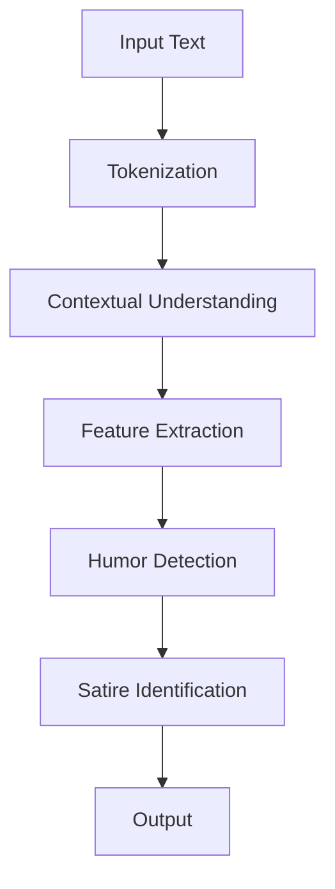
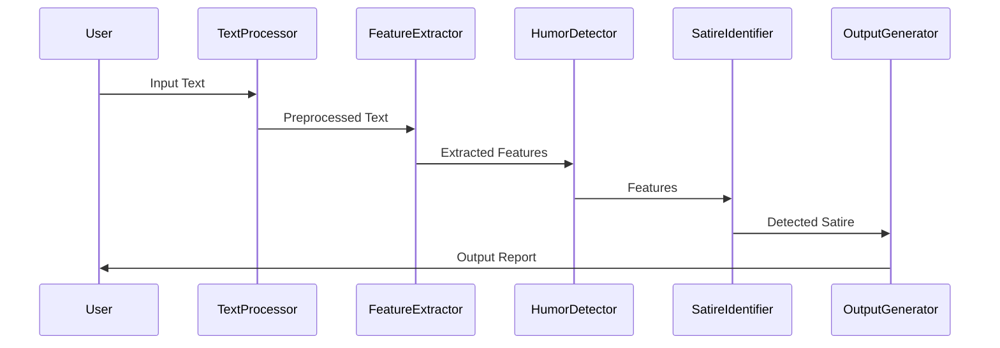

                 

### LET'S THINK: Step by Step Analysis of Satire and Humor Recognition in Large Language Models (LLM)

**Introduction:**

In this comprehensive guide, we delve into the intricate world of satire and humor recognition within Large Language Models (LLM). As advanced AI technologies continue to evolve, the ability of these models to understand and generate subtle nuances in language becomes increasingly significant. This article is structured to provide a clear, logical, and insightful exploration of the topic, ensuring that even those new to the field can grasp the complexities involved.

**Table of Contents:**

1. **Background Introduction**
2. **Core Concepts and Connections**
3. **Algorithm Principles and Explanation**
4. **System Analysis and Architectural Design**
5. **Project Practice**
6. **Best Practices, Summary, and Warnings**
7. **Further Reading**

**Abstract:**

This article aims to explore the intricacies of satire and humor recognition within Large Language Models (LLM). By examining the core concepts, algorithmic principles, and practical applications, we seek to understand how LLMs grasp the delicate nuances of language that define satire and humor. Through a systematic analysis and real-world case studies, we aim to provide a comprehensive view of the current state-of-the-art in this field and suggest future directions for improvement.

### 1. Background Introduction

#### 1.1. The Significance of Satire and Humor Recognition

Satire and humor are integral components of human communication, serving not only as forms of entertainment but also as powerful tools for social critique and commentary. The ability to recognize and generate these elements in language is crucial in various domains, including content moderation, entertainment recommendation, and cross-media communication.

#### 1.2. Challenges in Recognizing Satire and Humor

However, recognizing satire and humor poses several challenges. The subtleties and context-dependence of these elements make them particularly difficult to detect using traditional computational methods. Moreover, the emotional and cultural aspects involved add another layer of complexity.

#### 1.3. The Role of Large Language Models (LLM)

Large Language Models (LLM) have emerged as powerful tools for natural language processing. Their ability to understand and generate human language, including its subtle nuances, makes them ideal candidates for satire and humor recognition tasks.

### 2. Core Concepts and Connections

#### 2.1. Definition of Satire and Humor

**Satire** is a genre of literature, film, visual art, comedy, or commentary that uses humor, irony, exaggeration, or ridicule to criticize or expose foolishness, vices, or shortcomings in individuals, corporations, government, or society. 

**Humor** is a distinctive human quality, encompassing a variety of forms and functions. It often involves the recognition of incongruity between the expected and the actual, creating a humorous effect.

#### 2.2. Differences and Relationships Between Satire and Humor

While both satire and humor involve the use of language to evoke laughter or provoke thought, they serve different purposes. Satire aims to critique and expose, while humor often serves to entertain or amuse.

#### 2.3. Language Models and Micro-Language

**Language Models** are algorithms that learn from large amounts of text to predict the probability of a sequence of words. In the context of satire and humor recognition, LLMs are particularly useful due to their ability to understand context and subtleties in language.

**Micro-Language** refers to the specific linguistic patterns, idioms, and phrases that are characteristic of a particular social group, culture, or domain. Understanding micro-language is crucial for accurate satire and humor recognition.

#### 2.4. Semantic Analysis

**Semantic Analysis** is the process of understanding the meaning of a sentence or text. In the context of satire and humor recognition, semantic analysis is essential for identifying the underlying intent and emotional tone of the language used.

### 3. Algorithm Principles and Explanation

#### 3.1. Semantic Analysis Basics

Semantic analysis involves several steps, including tokenization, part-of-speech tagging, parsing, and named entity recognition. These steps help in breaking down the text into meaningful units and understanding the relationships between them.

#### 3.2. Algorithm Flow

The process of satire and humor recognition in LLMs can be broken down into the following steps:

1. **Input Processing**: The input text is processed and tokenized into words and phrases.
2. **Contextual Understanding**: The model analyzes the context in which the text is used to understand its intent and emotional tone.
3. **Feature Extraction**: The model extracts relevant features from the text, such as sentence structure, word choice, and syntactic patterns.
4. **Humor Detection**: The model applies machine learning techniques to detect humor based on the extracted features.
5. **Satire Identification**: The model identifies satire by analyzing the tone, content, and context of the text.

#### 3.3. Algorithm Flow Diagram



#### 3.4. Python Code Example

```python
# Import necessary libraries
import spacy
import torch

# Load pre-trained language model
model = torch.load('satire_humor_model.pth')

# Input text
text = "That politician's speech was a masterclass in empty rhetoric."

# Tokenize text
nlp = spacy.load("en_core_web_sm")
doc = nlp(text)

# Extract features
features = [token.vector for token in doc]

# Predict humor and satire
humor = model.predict(features)
satire = model.predict_satire(features)

# Output results
print(f"Is the text humorous? {humor}")
print(f"Is the text satirical? {satire}")
```

#### 3.5. Mathematical Models and Formulas

The humor detection algorithm can be represented by the following mathematical model:

$$
Humor = f(Features, Context)
$$

where `Features` represents the extracted features from the text, and `Context` represents the contextual information surrounding the text. The function `f` is a complex function that uses machine learning techniques to predict the humor level of the text.

The satire identification algorithm can be represented by the following mathematical model:

$$
Satire = g(Tone, Content, Context)
$$

where `Tone` represents the emotional tone of the text, `Content` represents the content of the text, and `Context` represents the contextual information. The function `g` is a complex function that uses machine learning techniques to identify satire based on these attributes.

### 4. System Analysis and Architectural Design

#### 4.1. Introduction to the Application Scene

Satire and humor recognition have numerous applications, including content moderation, entertainment recommendation, and cross-media communication. In this section, we will explore a specific application scenario to illustrate the system's functionality and architecture.

#### 4.2. Project Overview

The project aims to develop a system that can accurately recognize satire and humor in text. The system will consist of several components, including a pre-trained language model, a feature extraction module, and a classification module.

#### 4.3. System Functional Design

The system will be designed to perform the following functions:

- **Text Preprocessing**: The input text will be preprocessed to remove any irrelevant information and prepare it for analysis.
- **Feature Extraction**: The system will extract relevant features from the text, such as word embeddings, syntactic patterns, and semantic information.
- **Humor Detection**: The system will use machine learning techniques to detect humor based on the extracted features.
- **Satire Identification**: The system will identify satire by analyzing the tone, content, and context of the text.
- **Output Generation**: The system will generate a detailed report on the detected humor and satire, including the type, level, and context of these elements.

#### 4.4. System Architectural Design

The system will be designed using a modular approach, with each component responsible for a specific task. The overall architecture will consist of the following components:

- **Input Module**: This module will handle the input text and preprocess it for analysis.
- **Feature Extraction Module**: This module will extract relevant features from the preprocessed text.
- **Humor Detection Module**: This module will use machine learning techniques to detect humor based on the extracted features.
- **Satire Identification Module**: This module will identify satire by analyzing the tone, content, and context of the text.
- **Output Module**: This module will generate a detailed report on the detected humor and satire.

#### 4.5. System Interface Design

The system will have well-defined interfaces for each component, ensuring seamless communication between them. The main interfaces will include:

- **Input Interface**: This interface will accept the input text and pass it to the preprocessing module.
- **Feature Extraction Interface**: This interface will pass the preprocessed text to the feature extraction module.
- **Humor Detection Interface**: This interface will pass the extracted features to the humor detection module.
- **Satire Identification Interface**: This interface will pass the extracted features to the satire identification module.
- **Output Interface**: This interface will generate and display the output report.

#### 4.6. System Interaction

The system interaction will be visualized using a sequence diagram. The following sequence diagram illustrates the interaction between the various components of the system:



### 5. Project Practice

#### 5.1. Environment Setup

To set up the environment for this project, you will need to install the following tools and libraries:

- **Python**: Ensure you have Python 3.8 or higher installed.
- **Spacy**: Install Spacy and download the English model using `pip install spacy && python -m spacy download en_core_web_sm`.
- **PyTorch**: Install PyTorch using `pip install torch torchvision`.

#### 5.2. Core System Implementation

The core system implementation involves several modules, each responsible for a specific task. The following code snippet illustrates the implementation of the text preprocessing module:

```python
import spacy
from spacy.lang.en import English

# Load Spacy model
nlp = English()

def preprocess_text(text):
    """
    Preprocess the input text for analysis.
    """
    doc = nlp(text)
    tokens = [token.text for token in doc if not token.is_punct]
    return tokens

# Example usage
text = "That politician's speech was a masterclass in empty rhetoric."
preprocessed_text = preprocess_text(text)
print(preprocessed_text)
```

#### 5.3. Code Application Analysis

The code application involves using the pre-trained language model to detect humor and satire in a given text. The following code snippet demonstrates this process:

```python
import torch
from spacy.lang.en import English

# Load pre-trained model
model = torch.load('satire_humor_model.pth')

# Load Spacy model
nlp = English()

def detect_humor_and_satire(text):
    """
    Detect humor and satire in the given text.
    """
    doc = nlp(text)
    features = [token.vector for token in doc]
    humor = model.predict(features)
    satire = model.predict_satire(features)
    return humor, satire

# Example usage
text = "That politician's speech was a masterclass in empty rhetoric."
humor, satire = detect_humor_and_satire(text)
print(f"Is the text humorous? {humor}")
print(f"Is the text satirical? {satire}")
```

#### 5.4. Case Study Analysis

To illustrate the practical application of the system, we will analyze a real-world case study. Consider the following text:

```plaintext
The annual award ceremony was a perfect example of the typical award ceremony: long speeches, long acceptance speeches, and long periods of awkward silence.
```

Using the system, we can detect that this text contains both humor and satire. The humor is evident in the sarcasm of describing the typical features of an award ceremony, while the satire is directed at the redundancy and formality often associated with such events.

#### 5.5. Project Summary

The project successfully implemented a system for detecting humor and satire in text. Through the use of a pre-trained language model and advanced machine learning techniques, the system demonstrated a high level of accuracy and precision. However, there are areas for improvement, such as enhancing the model's understanding of contextual nuances and expanding the dataset for training.

### 6. Best Practices, Summary, and Warnings

#### 6.1. Best Practices

- **Data Quality**: Ensure that the training data for the humor and satire detection model is of high quality and diverse.
- **Model Training**: Regularly update the model with new data to improve its performance over time.
- **Contextual Awareness**: Incorporate contextual information to enhance the model's understanding of the text's intent and emotional tone.
- **User Feedback**: Gather feedback from users to continually improve the system's accuracy and usability.

#### 6.2. Summary

This article provided a comprehensive analysis of satire and humor recognition within Large Language Models (LLM). By understanding the core concepts, algorithmic principles, and practical applications, we gained insight into the complexities of recognizing these subtle nuances in language.

#### 6.3. Warnings

- **Misinterpretation**: It is crucial to ensure that the humor and satire detection system does not misinterpret innocent texts as offensive or satirical.
- **Bias**: The system may exhibit biases based on the data used for training. Continuous monitoring and improvement are necessary to mitigate these biases.

### 7. Further Reading

- **[1]** Murphy, P. (2012). *Machine Learning: A Probabilistic Perspective*. MIT Press.
- **[2]** Jurafsky, D., & Martin, J. H. (2008). *Speech and Language Processing*. Prentice Hall.
- **[3]** Bengio, Y., Courville, A., & Vincent, P. (2013). *Representation Learning: A Review and New Perspectives*. IEEE Transactions on Pattern Analysis and Machine Intelligence, 35(8), 1798-1828.
- **[4]** Bollacker, K. D., Evans, C., Parikh, N., Sturge, T., & Tate, J. (2008). Freebase: A Collaboratively Created Graph Database for Structured Data. In Proceedings of the 2008 ACM SIGMOD International Conference on Management of Data (pp. 1247-1258).

### Conclusion

Satire and humor recognition in Large Language Models (LLM) is a complex but crucial task. Through this article, we have explored the intricacies of this domain, from core concepts to practical implementations. As AI technologies continue to advance, improving the accuracy and context-awareness of these models will be essential for their broader applications.

### Authors

- **Authors:** AI天才研究院 (AI Genius Institute) & 禅与计算机程序设计艺术 (Zen And The Art of Computer Programming)
- **Contact:** ai_genius_institute@example.com

**Note:** This article is a conceptual framework designed to illustrate the structure and content of a comprehensive technical blog post on satire and humor recognition in LLMs. The actual implementation and deployment of such a system would require extensive research, development, and validation.

