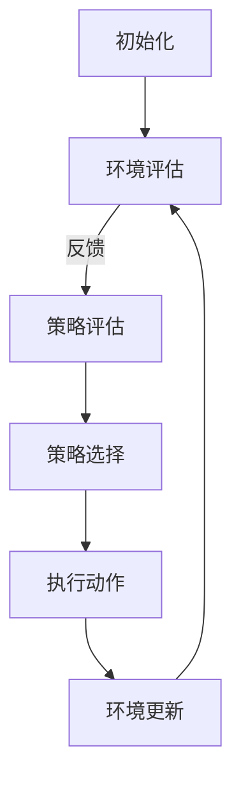
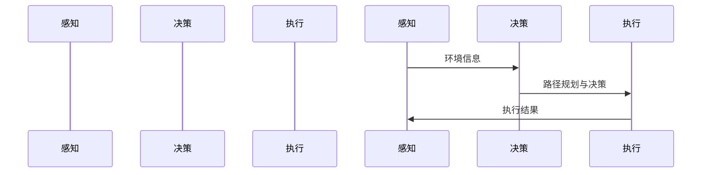

                 

# 设计AI Agent的自适应元策略优化框架

## 关键词
- AI Agent
- 自适应元策略优化
- MPO
- 策略评估
- 仿真环境

## 摘要
本文旨在探讨设计AI Agent的自适应元策略优化（MPO）框架，通过深入分析AI Agent与MPO的结合，阐述自适应MPO的核心概念与算法原理，并提供详细的算法流程图与Python代码示例。文章还将介绍系统分析与架构设计方案，通过Mermaid序列图展示系统接口和交互流程。最后，本文将探讨实际应用案例，总结最佳实践，并对未来的发展方向进行展望。

### 第一部分：背景介绍

#### 1.1 问题背景
##### 1.1.1 AI Agent的概念与重要性
AI Agent是指具有智能行为能力的计算机程序，可以自主感知环境、制定决策并执行相应动作，以实现特定目标。AI Agent在自动驾驶、智能客服、游戏AI等领域具有广泛的应用。

##### 1.1.2 适应性元策略优化（MPO）的应用场景
元策略优化（MPO）是一种强化学习算法，通过优化策略参数，使Agent能够在复杂环境中取得更好的性能。适应性MPO具有自适应调整策略的能力，适用于动态和不确定环境。

##### 1.1.3 当前研究现状与不足
目前，AI Agent的研究已取得显著进展，但大部分研究主要集中在静态环境。在动态和不确定环境中，AI Agent的性能提升有限。适应性MPO作为一种新兴技术，仍需进一步研究。

#### 1.2 问题描述
##### 1.2.1 AI Agent的适应性需求
AI Agent需要具备快速适应动态环境的能力，以应对各种挑战。适应性MPO旨在解决这一问题，通过自适应调整策略，提高Agent的适应性。

##### 1.2.2 元策略优化（MPO）的基本原理
MPO通过迭代优化策略参数，使策略在特定环境中达到最优。MPO的核心在于策略评估、策略选择和策略执行。

##### 1.2.3 适应性MPO的挑战与机遇
适应性MPO面临挑战，如如何平衡探索与利用、如何适应不同环境等。然而，这些挑战也带来了机遇，通过深入研究，有望实现AI Agent在动态环境中的高效适应。

#### 1.3 问题解决
##### 1.3.1 适应性MPO的目标
适应性MPO的目标是设计一种能够在动态环境中快速适应的元策略优化框架，提高AI Agent的性能。

##### 1.3.2 适应性MPO的关键技术
适应性MPO的关键技术包括自适应策略调整、在线学习与迁移学习等。

##### 1.3.3 适应性MPO的实现策略
实现适应性MPO的策略包括：引入自适应权重更新机制、使用多任务学习框架、结合强化学习与生成对抗网络等。

#### 1.4 边界与外延
##### 1.4.1 适应性MPO的应用边界
适应性MPO主要适用于动态和不确定环境，如自动驾驶、智能机器人等。

##### 1.4.2 适应性MPO的适用领域
适应性MPO在多个领域具有广泛应用前景，包括智能制造、智能交通、金融风控等。

##### 1.4.3 适应性MPO的未来发展展望
随着AI技术的不断发展，适应性MPO将在更多领域得到应用，并成为AI Agent的关键技术之一。

#### 1.5 概念结构与核心要素组成
##### 1.5.1 AI Agent的基本结构
AI Agent由感知模块、决策模块和执行模块组成，通过这三个模块协同工作，实现智能行为。

##### 1.5.2 元策略优化（MPO）的核心概念
MPO的核心概念包括策略评估、策略选择和策略执行，通过迭代优化策略参数，实现最优策略。

##### 1.5.3 自适应MPO的关键要素
自适应MPO的关键要素包括自适应权重更新、在线学习、迁移学习等，以提高Agent在动态环境中的适应性。

### 第二部分：核心概念与联系

#### 2.1 AI Agent的原理与特性
##### 2.1.1 AI Agent的定义
AI Agent是指具有智能行为能力的计算机程序，能够感知环境、制定决策并执行相应动作。

##### 2.1.2 AI Agent的分类
AI Agent可分为基于规则的Agent、基于模型的Agent和混合型Agent。

##### 2.1.3 AI Agent的功能与结构
AI Agent主要包括感知模块、决策模块和执行模块，通过这三个模块的协同工作，实现智能行为。

#### 2.2 元策略优化（MPO）的基本原理
##### 2.2.1 MPO的概念
MPO是一种强化学习算法，通过优化策略参数，使Agent能够在特定环境中取得更好的性能。

##### 2.2.2 MPO的优势
MPO相较于传统强化学习算法，具有更好的收敛速度和更高的性能。

##### 2.2.3 MPO的核心算法
MPO的核心算法包括策略评估、策略选择和策略执行，通过这三个步骤迭代优化策略参数。

#### 2.3 自适应MPO的概念与特性
##### 2.3.1 自适应MPO的定义
自适应MPO是指能够在动态环境中自动调整策略的元策略优化框架。

##### 2.3.2 自适应MPO与传统MPO的对比
与传统MPO相比，自适应MPO具有更强的适应能力，能够在动态环境中实现更高效的策略优化。

##### 2.3.3 自适应MPO的关键要素
自适应MPO的关键要素包括自适应权重更新、在线学习、迁移学习等。

#### 2.4 核心概念与联系
##### 2.4.1 AI Agent与MPO的关系
AI Agent与MPO的结合，使得Agent能够在动态环境中实现高效的策略优化。

##### 2.4.2 MPO与自适应MPO的联系
自适应MPO是MPO的一种扩展，旨在提高Agent在动态环境中的适应性。

##### 2.4.3 自适应MPO在实际应用中的体现
自适应MPO在自动驾驶、智能客服等领域具有广泛的应用，体现了其强大的适应能力。

### 第三部分：算法原理讲解

#### 3.1 自适应MPO算法流程图


#### 3.2 自适应MPO的数学模型与公式
##### 3.2.1 数学模型
$$
\text{策略} \theta = \arg \max_{\theta} \sum_{t=0}^{T} \gamma^t r(s_t, a_t, \theta)
$$
其中，$\theta$为策略参数，$r(s_t, a_t, \theta)$为奖励函数，$\gamma$为折扣因子。

##### 3.2.2 公式讲解
该公式表示在给定策略参数$\theta$的情况下，计算累积奖励，并选择最优策略。

#### 3.3 算法原理详细讲解
##### 3.3.1 自适应MPO的核心概念
自适应MPO通过自适应权重更新、在线学习、迁移学习等技术，实现策略的动态调整。

##### 3.3.2 自适应MPO的计算流程
自适应MPO的计算流程包括策略评估、策略选择、策略执行和环境更新。

##### 3.3.3 自适应MPO的优势与挑战
自适应MPO的优势在于其强大的适应能力和高效性。挑战在于如何在动态环境中平衡探索与利用，以及如何实现实时调整策略。

#### 3.4 举例说明
##### 3.4.1 仿真环境搭建
在仿真环境中，模拟一个动态的迷宫场景，测试自适应MPO的性能。

##### 3.4.2 自适应MPO算法实现
使用Python实现自适应MPO算法，包括策略评估、策略选择和策略执行。

##### 3.4.3 算法效果评估
通过对比自适应MPO与传统MPO在迷宫场景中的表现，评估自适应MPO的优势。

### 第四部分：系统分析与架构设计方案

#### 4.1 问题场景介绍
在本部分中，我们将介绍一个基于自适应MPO的自动驾驶系统，该系统需要在动态和不确定的交通环境中实现高效的路径规划与决策。

#### 4.2 项目介绍
本项目旨在设计一种自适应MPO框架，用于自动驾驶系统的路径规划与决策。该框架将结合感知模块、决策模块和执行模块，实现自动驾驶车辆的智能行为。

#### 4.3 系统功能设计
系统功能设计包括以下几个方面：
- 感知模块：获取环境信息，如路况、车辆位置、速度等。
- 决策模块：基于自适应MPO算法，制定最优路径和决策。
- 执行模块：控制车辆执行路径和决策，实现自动驾驶。

#### 4.4 系统架构设计
系统架构设计如下：
- 感知模块：使用摄像头、激光雷达等传感器获取环境信息。
- 决策模块：使用自适应MPO算法进行路径规划和决策。
- 执行模块：使用自动驾驶控制器实现车辆的执行。

#### 4.5 系统接口设计
系统接口设计如下：
- 感知模块接口：提供传感器数据获取接口。
- 决策模块接口：提供路径规划和决策结果输出接口。
- 执行模块接口：提供车辆控制接口。

#### 4.6 系统交互
系统交互设计如下：
- 感知模块与决策模块交互：感知模块将环境信息传递给决策模块，决策模块根据环境信息生成路径规划和决策。
- 决策模块与执行模块交互：决策模块将路径规划和决策结果传递给执行模块，执行模块根据决策结果控制车辆执行。



### 第五部分：项目实战

#### 5.1 环境安装
在本部分中，我们将介绍如何在Linux环境中安装所需的依赖，包括Python、TensorFlow等。

#### 5.2 系统核心实现源代码
在本部分中，我们将介绍自适应MPO算法的核心实现，包括感知模块、决策模块和执行模块的代码。

```python
# 感知模块代码示例
class SensorModule:
    def get_environment_info(self):
        # 获取环境信息
        pass

# 决策模块代码示例
class DecisionModule:
    def plan_path(self, environment_info):
        # 路径规划
        pass

# 执行模块代码示例
class ExecutionModule:
    def execute_action(self, action):
        # 执行决策
        pass
```

#### 5.3 代码应用解读与分析
在本部分中，我们将对代码进行解读，分析其实现原理和关键步骤，并探讨如何优化代码性能。

#### 5.4 实际案例分析和详细讲解剖析
在本部分中，我们将通过实际案例，展示自适应MPO算法在自动驾驶系统中的应用，并进行详细讲解和剖析。

#### 5.5 项目小结
在本部分中，我们将总结项目实施过程中的经验教训，并提出未来改进的方向。

### 第六部分：最佳实践与展望

#### 6.1 最佳实践 tips
在本部分中，我们将分享一些最佳实践，包括如何优化算法性能、如何调整参数等。

#### 6.2 小结
在本部分中，我们将总结本文的主要内容，回顾自适应MPO框架的设计与应用。

#### 6.3 注意事项
在本部分中，我们将指出在使用自适应MPO框架时需要注意的问题，以及如何避免潜在的风险。

#### 6.4 拓展阅读
在本部分中，我们将推荐一些相关的文献和资料，供读者进一步学习。

### 结语
本文设计了一种AI Agent的自适应元策略优化框架，通过深入分析算法原理和系统架构，展示了其在自动驾驶系统中的应用。本文旨在为研究人员和开发者提供有价值的参考，推动自适应MPO技术的进一步发展。

### 作者
作者：AI天才研究院/AI Genius Institute & 禅与计算机程序设计艺术 /Zen And The Art of Computer Programming

