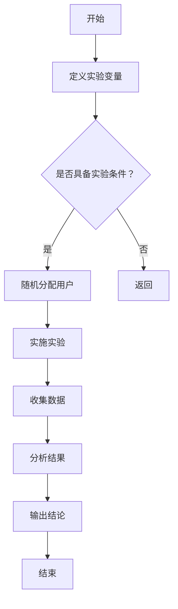
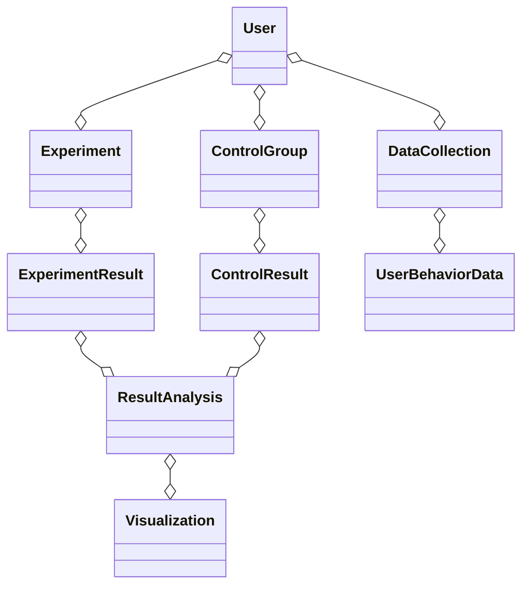
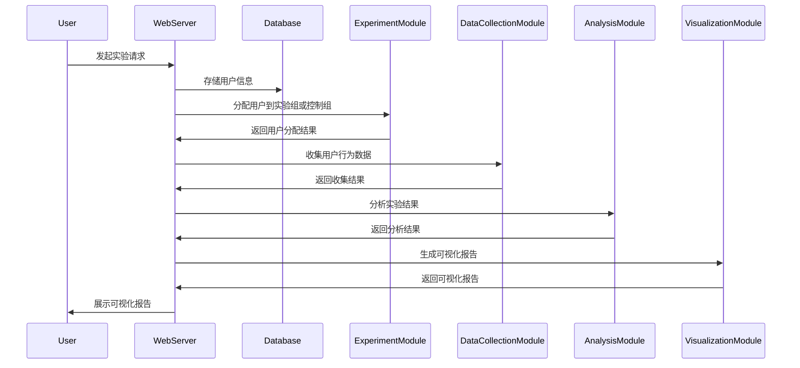
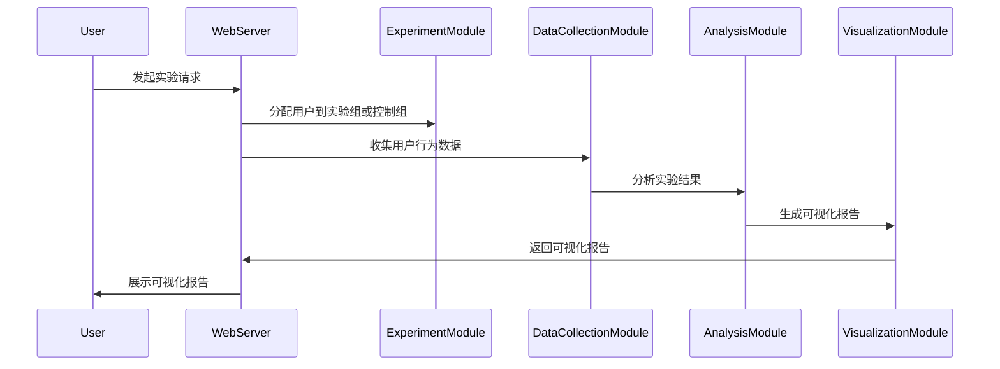
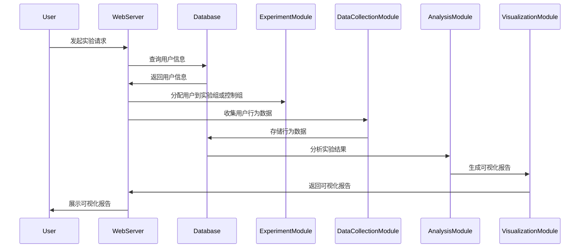

                 


# 设计LLM应用的快速A/B测试方案

关键词：A/B测试，大型语言模型，优化，测试方案

摘要：本文介绍了大型语言模型（LLM）应用中的快速A/B测试方案，包括核心概念、方案设计、实际应用和注意事项，旨在帮助设计者更好地评估和优化LLM应用效果。

----------------------------------------------------------------

# 第一部分：背景介绍

## 1.1 问题背景

近年来，随着人工智能技术的飞速发展，大型语言模型（LLM）在自然语言处理领域取得了显著成果。这些大型模型具有强大的语义理解能力，能够为各个行业提供高效、智能化的解决方案。然而，在实际应用中，如何快速评估和优化这些模型的效果成为了一个亟待解决的问题。为了应对这一挑战，本文将介绍一种快速A/B测试方案，帮助设计者更好地评估和优化LLM应用。

## 1.2 问题描述

在LLM应用开发过程中，我们需要对模型进行多种优化，如调整参数、添加新功能等。然而，这些优化措施可能对模型效果产生不同的影响。因此，如何快速、准确地评估这些优化措施的效果，从而选择出最佳方案，成为了开发过程中的一大难题。

## 1.3 问题解决

为了解决上述问题，本文将提出一种快速A/B测试方案，通过在真实场景中对比不同优化措施的效果，帮助设计者找到最佳解决方案。具体来说，我们将从以下几个方面展开讨论：

1. **核心概念**：介绍A/B测试的基本原理和关键概念。
2. **方案设计**：阐述快速A/B测试方案的架构和实现方法。
3. **实际应用**：通过具体案例展示快速A/B测试方案在LLM应用开发中的实际应用。
4. **注意事项**：总结快速A/B测试过程中需要关注的问题和技巧。

## 1.4 边界与外延

1. **边界**：本文主要关注LLM应用开发中的快速A/B测试问题，针对不同场景下的具体优化措施进行评估。然而，该方法并不仅限于LLM应用，也可应用于其他类型的人工智能模型。
2. **外延**：快速A/B测试方案在AI领域中的应用前景广泛，可以推动人工智能技术的不断优化和发展。

## 1.5 概念结构与核心要素组成

1. **A/B测试**：一种常见的实验设计方法，通过将用户分配到不同的实验组，比较不同组之间的效果差异，以评估某种优化措施的有效性。
2. **LLM应用**：指利用大型语言模型在各个行业领域中的实际应用，如智能客服、自动翻译、文本生成等。
3. **优化措施**：针对LLM应用的各种优化策略，如参数调整、功能扩展等。

----------------------------------------------------------------

# 第二部分：核心概念与联系

## 2.1 A/B测试的基本原理

A/B测试，也称为拆分测试，是一种常见的实验设计方法。其核心思想是将用户随机分配到不同的实验组，比较各组之间的效果差异，从而评估某种优化措施的有效性。具体来说，A/B测试包括以下几个关键步骤：

1. **定义实验变量**：明确需要评估的优化措施，如调整模型参数、添加新功能等。
2. **随机分配用户**：将用户随机分配到控制组和实验组，确保两组用户具有相似的特征。
3. **实施实验**：在实验组中实施优化措施，在控制组中保持原有状态。
4. **收集数据**：收集两组用户的使用数据和反馈信息。
5. **分析结果**：对比两组用户的数据，评估优化措施的有效性。

### 2.1.1 A/B测试的关键概念

**实验变量**：实验变量是指需要评估的优化措施，可以是模型参数、功能模块等。

**控制组和实验组**：控制组是指保持原有状态的用户组，实验组是指实施优化措施的用户组。

**用户分配**：用户分配是指将用户随机分配到控制组和实验组的过程，以确保两组用户具有相似的特征。

**实验数据**：实验数据是指收集到的用户使用数据和反馈信息。

**实验结果**：实验结果是指通过分析实验数据得出的优化措施有效性结论。

### 2.1.2 A/B测试的优势和局限性

**优势**：

1. **客观性**：通过实验数据客观评估优化措施的有效性，减少主观判断的影响。
2. **可控性**：实验设计过程中可以明确控制变量，确保实验结果的可靠性。
3. **适应性**：适用于各种优化措施，具有广泛的应用场景。

**局限性**：

1. **成本**：A/B测试可能需要大量的用户参与，成本较高。
2. **时间**：A/B测试需要一定时间来收集数据和进行分析，可能会影响项目的进度。
3. **结果偏差**：如果用户分配不均匀或实验设计存在问题，可能导致结果偏差。

## 2.2 LLM应用的核心概念

LLM（Large Language Model）是指大型语言模型，具有强大的语义理解能力，能够处理各种自然语言任务。LLM应用主要包括以下几个方面：

1. **文本生成**：利用LLM生成文章、摘要、对话等。
2. **自动翻译**：将一种语言翻译成另一种语言。
3. **智能客服**：为用户提供智能化的客服支持。
4. **内容推荐**：根据用户兴趣推荐相关内容。

### 2.2.1 LLM的核心概念

**语义理解**：LLM通过对大量文本数据进行训练，能够捕捉到语言中的深层语义信息，实现对文本的准确理解和生成。

**预训练**：预训练是指利用大量文本数据进行训练，使LLM具备一定的语义理解能力。

**微调**：微调是指针对特定任务对LLM进行进一步训练，以适应不同应用场景。

**模型结构**：LLM通常采用深层神经网络结构，具有多层神经网络和注意力机制，能够高效地处理大规模数据。

### 2.2.2 LLM应用的优势和挑战

**优势**：

1. **强大语义理解能力**：LLM能够准确理解语言中的深层语义信息，为各种自然语言任务提供高效解决方案。
2. **广泛适用性**：LLM可应用于多个领域，如文本生成、自动翻译、智能客服等。
3. **自适应能力**：LLM通过微调能够快速适应不同应用场景，提高模型性能。

**挑战**：

1. **计算资源消耗**：LLM训练和推理过程需要大量的计算资源，对硬件设施要求较高。
2. **数据隐私**：在训练和推理过程中，LLM可能会接触到用户的敏感信息，需要关注数据隐私问题。
3. **模型可解释性**：LLM模型的决策过程通常较为复杂，缺乏可解释性，难以了解模型的具体工作原理。

## 2.3 优化措施的比较

在实际应用中，针对LLM应用，我们可能需要采取多种优化措施，如参数调整、数据增强、模型融合等。为了选择出最佳优化方案，我们需要比较不同措施的效果。以下是几种常见的优化措施及其比较方法：

### 2.3.1 参数调整

**参数调整**：通过调整模型参数，优化模型性能。比较方法：观察不同参数设置下的模型性能变化。

**优势**：

1. **简单有效**：参数调整是优化模型性能的一种直接方式，操作简单，易于实现。
2. **灵活性强**：可以根据不同应用场景调整参数，满足特定需求。

**局限性**：

1. **依赖经验**：参数调整需要依赖开发者的经验和直觉，可能导致优化效果不稳定。
2. **试错成本**：参数调整过程中可能需要进行多次实验，试错成本较高。

### 2.3.2 数据增强

**数据增强**：通过增加训练数据、数据预处理等方式，提高模型泛化能力。比较方法：比较增强前后模型的性能差异。

**优势**：

1. **提高模型泛化能力**：通过增加训练数据，模型能够更好地适应不同场景，提高泛化能力。
2. **减少过拟合**：增加训练数据可以有效减少模型过拟合现象，提高模型性能。

**局限性**：

1. **数据质量和数量**：数据增强需要高质量的训练数据，且数据量较大，可能对数据获取和处理带来挑战。
2. **计算资源消耗**：数据增强过程需要大量的计算资源，可能对硬件设施要求较高。

### 2.3.3 模型融合

**模型融合**：将多个模型集成，利用各自的优点，提高整体性能。比较方法：比较融合前后的模型性能。

**优势**：

1. **提高模型性能**：通过模型融合，可以充分利用多个模型的优点，提高整体性能。
2. **降低风险**：模型融合可以降低单个模型过拟合的风险，提高模型稳定性。

**局限性**：

1. **计算资源消耗**：模型融合过程需要大量的计算资源，可能对硬件设施要求较高。
2. **模型选择**：需要选择合适的模型进行融合，可能需要依赖经验和算法研究。

## 2.4 ER实体关系图架构

为了更好地理解LLM应用中的核心概念和优化措施，我们可以使用ER实体关系图来展示它们之间的关系。以下是一个简单的ER实体关系图：

```mermaid
erDiagram
    User ||--|{ Data } : contains
    Model ||--|{ Optimization } : applies
    Effect Assessment ||--|{ Result } : derives
```

### 2.4.1 ER实体关系图解析

**用户**：代表参与A/B测试的用户。

**数据**：代表用户使用数据和反馈信息。

**模型**：代表LLM应用中的大型语言模型。

**优化措施**：代表针对LLM应用的各种优化策略。

**效果评估**：代表对优化措施的有效性进行评估。

**结果**：代表通过效果评估得出的结论。

通过ER实体关系图，我们可以清晰地展示LLM应用中的核心概念和优化措施之间的关系，有助于我们更好地理解和分析LLM应用中的问题。

----------------------------------------------------------------

# 第三部分：算法原理讲解

## 3.1 快速A/B测试算法的mermaid流程图

为了更好地理解快速A/B测试算法的工作流程，我们可以使用mermaid绘制一个流程图。以下是快速A/B测试算法的mermaid流程图：



### 3.1.1 mermaid流程图解析

**A[开始]**：快速A/B测试算法的开始步骤。

**B[定义实验变量]**：明确需要评估的优化措施，如调整模型参数、添加新功能等。

**C{是否具备实验条件？]**：判断是否具备进行A/B测试的条件，如用户数量、实验时间等。

**D[随机分配用户]**：将用户随机分配到控制组和实验组。

**E[返回]**：不具备实验条件时，返回原点。

**F[实施实验]**：在实验组中实施优化措施，在控制组中保持原有状态。

**G[收集数据]**：收集两组用户的使用数据和反馈信息。

**H[分析结果]**：对比两组用户的数据，评估优化措施的有效性。

**I[输出结论]**：根据分析结果，输出优化措施的结论。

**J[结束]**：快速A/B测试算法的结束步骤。

## 3.2 快速A/B测试算法的Python源代码

下面是快速A/B测试算法的Python源代码实现，用于阐述算法原理：

```python
import random
import pandas as pd

def run_ab_test(experiment_data, control_data, experiment_vars, num_users=1000):
    """
    运行快速A/B测试

    :param experiment_data: 实验组数据
    :param control_data: 控制组数据
    :param experiment_vars: 实验变量
    :param num_users: 参与用户数量
    :return: 结果数据
    """
    users = random.sample(range(num_users), num_users)
    random.shuffle(users)

    experiment_users = users[:int(num_users / 2)]
    control_users = users[int(num_users / 2):]

    experiment_results = []
    control_results = []

    for user in experiment_users:
        # 实施实验组优化措施
        experiment_data.loc[user, 'result'] = experiment_vars['experiment']

    for user in control_users:
        # 实施控制组原优化措施
        control_data.loc[user, 'result'] = control_data.loc[user, 'control']

    # 收集数据
    experiment_results.extend(experiment_data['result'])
    control_results.extend(control_data['result'])

    # 分析结果
    result_df = pd.DataFrame({'group': ['experiment', 'control'],
                              'count': [len(experiment_results), len(control_results)],
                              'result': [experiment_results, control_results]})

    # 输出结论
    return result_df

# 示例数据
experiment_data = pd.DataFrame({'user': range(1000), 'control': ['control'] * 1000})
control_data = pd.DataFrame({'user': range(1000), 'control': ['control'] * 1000})

# 定义实验变量
experiment_vars = {'experiment': 'experiment_value'}

# 运行A/B测试
result_df = run_ab_test(experiment_data, control_data, experiment_vars)

print(result_df)
```

### 3.2.1 Python源代码解析

**run_ab_test()函数**：实现快速A/B测试算法的核心函数，接收实验组数据、控制组数据、实验变量和参与用户数量等参数。

**用户随机分配**：使用random.sample()函数将用户随机分配到控制组和实验组。

**实验组数据**：对实验组数据进行处理，实施优化措施。

**控制组数据**：对控制组数据进行处理，保持原有状态。

**数据收集**：将实验组和控制组的数据分别存储在列表中。

**结果分析**：使用pandas库创建结果数据帧，记录实验组和控制组的结果。

**输出结论**：返回结果数据帧，输出优化措施的结论。

## 3.3 快速A/B测试算法原理讲解

### 3.3.1 数学模型和公式

在快速A/B测试算法中，我们可以使用以下数学模型和公式来描述实验过程：

**期望值**：实验组的结果期望值和

$$
E(X) = \frac{1}{n}\sum_{i=1}^{n}X_i
$$

其中，$X_i$表示第$i$个实验结果，$n$表示实验次数。

**方差**：实验组的结果方差

$$
Var(X) = \frac{1}{n-1}\sum_{i=1}^{n}(X_i - \bar{X})^2
$$

其中，$\bar{X}$表示实验结果的均值。

**显著性水平**：用于判断实验结果是否显著

$$
\alpha = \frac{|\bar{X}_1 - \bar{X}_2|}{\sqrt{\frac{\sigma^2}{n}}} \geq \theta
$$

其中，$\bar{X}_1$和$\bar{X}_2$分别表示实验组和控制组的均值，$\sigma^2$表示方差，$\theta$表示显著性水平。

### 3.3.2 算法原理说明

快速A/B测试算法的核心思想是通过随机分配用户到实验组和控制组，比较两组用户在特定优化措施下的表现差异，从而评估优化措施的有效性。

**实验设计**：首先定义实验变量，明确需要评估的优化措施。然后，根据实验变量设置实验组和控制组，确保两组用户具有相似的特征。

**实验实施**：在实验组中实施优化措施，在控制组中保持原有状态。通过收集两组用户的使用数据和反馈信息，分析实验结果。

**结果分析**：对比实验组和控制组的数据，计算实验结果的期望值、方差和显著性水平。根据显著性水平判断优化措施是否显著有效。

### 3.3.3 通俗易懂的举例说明

假设我们有一个文本生成模型，希望通过快速A/B测试评估添加新功能（如自动摘要）对模型效果的影响。以下是快速A/B测试的具体过程：

**实验设计**：定义实验变量，如是否添加自动摘要功能。

**实验实施**：将1000名用户随机分配到实验组和控制组。实验组中，模型添加自动摘要功能；控制组中，模型保持原有状态。

**数据收集**：收集实验组和控制组用户在文本生成任务中的表现数据，如生成文本的长度、质量等。

**结果分析**：对比实验组和控制组的数据，计算自动摘要功能对模型效果的期望值、方差和显著性水平。假设显著性水平设置为0.05，如果显著性水平小于0.05，则认为自动摘要功能显著提高了模型效果。

通过上述过程，我们可以快速评估添加自动摘要功能对文本生成模型效果的影响，从而决定是否在产品中推广应用。

----------------------------------------------------------------

# 第四部分：系统分析与架构设计方案

## 4.1 问题场景介绍

在现代互联网应用中，随着用户数据的爆炸性增长，对大型语言模型（LLM）的评估和优化需求日益增加。为了满足这一需求，本文提出了一个基于A/B测试的快速LLM优化系统，该系统旨在通过高效、准确的测试手段评估不同优化措施对LLM应用效果的影响。

## 4.2 项目介绍

该系统项目名为“LLM优化与评估平台”，旨在为开发者提供一个便捷、高效的工具，用于快速评估和优化LLM模型。该平台主要功能包括：

1. **实验设计**：提供用户界面，方便开发者定义实验变量、设置实验组和控制组。
2. **用户分配**：通过随机算法将用户分配到实验组和控制组。
3. **数据收集**：实时收集用户在实验和对照组中的行为数据。
4. **结果分析**：通过统计分析方法评估优化措施的有效性。
5. **结果可视化**：提供直观的可视化界面，展示实验结果和优化建议。

## 4.3 系统功能设计（领域模型类图）

为了更好地展示系统功能，我们可以使用mermaid绘制一个领域模型类图。以下是LLM优化与评估平台的领域模型类图：



### 4.3.1 类图解析

**User（用户）**：代表参与实验的用户，具有唯一标识。

**Experiment（实验）**：表示实验的抽象概念，包括实验变量、实验组和控制组的定义。

**ControlGroup（控制组）**：表示实验中的控制组，与用户和行为数据相关联。

**DataCollection（数据收集）**：表示用户行为数据的收集和处理过程。

**ExperimentResult（实验结果）**：表示实验结果的抽象概念，与结果分析和可视化相关联。

**ControlResult（控制结果）**：表示控制组的结果，与结果分析和可视化相关联。

**UserBehaviorData（用户行为数据）**：表示用户在实验和对照组中的行为数据。

**ResultAnalysis（结果分析）**：表示对实验结果和控制结果的分析过程。

**Visualization（可视化）**：表示实验结果的可视化展示。

## 4.4 系统架构设计（mermaid架构图）

为了更好地展示系统架构，我们可以使用mermaid绘制一个系统架构图。以下是LLM优化与评估平台的系统架构图：



### 4.4.1 架构图解析

**WebServer（Web服务器）**：作为系统的入口，接收用户的请求并转发到相应的模块。

**Database（数据库）**：存储用户信息、实验数据和结果分析数据。

**ExperimentModule（实验模块）**：负责分配用户到实验组和控制组。

**DataCollectionModule（数据收集模块）**：负责收集用户行为数据。

**AnalysisModule（分析模块）**：负责分析实验结果，计算指标。

**VisualizationModule（可视化模块）**：负责生成可视化报告。

**User（用户）**：发起实验请求并查看可视化报告。

## 4.5 系统接口设计（mermaid序列图）

为了更好地展示系统接口设计，我们可以使用mermaid绘制一个序列图。以下是LLM优化与评估平台的接口序列图：



### 4.5.1 序列图解析

**用户发起实验请求**：用户通过Web服务器发起实验请求。

**Web服务器处理请求**：Web服务器接收请求，调用实验模块分配用户到实验组或控制组。

**数据收集**：Web服务器调用数据收集模块收集用户行为数据。

**结果分析**：数据收集模块将数据传递给分析模块，分析实验结果。

**可视化报告**：分析模块将结果传递给可视化模块，生成可视化报告。

**返回可视化报告**：可视化模块将报告传递给Web服务器，最终展示给用户。

## 4.6 系统交互设计（mermaid序列图）

为了更好地展示系统交互设计，我们可以使用mermaid绘制一个系统交互序列图。以下是LLM优化与评估平台的系统交互序列图：



### 4.6.1 系统交互设计解析

**用户发起实验请求**：用户通过Web服务器发起实验请求。

**查询用户信息**：Web服务器查询数据库，获取用户信息。

**分配用户到实验组或控制组**：Web服务器调用实验模块，将用户分配到实验组或控制组。

**收集用户行为数据**：Web服务器调用数据收集模块，收集用户行为数据。

**存储行为数据**：数据收集模块将用户行为数据存储到数据库。

**分析实验结果**：数据库将行为数据传递给分析模块，分析实验结果。

**生成可视化报告**：分析模块将结果传递给可视化模块，生成可视化报告。

**返回可视化报告**：可视化模块将报告传递给Web服务器，最终展示给用户。

通过上述系统分析与架构设计方案，我们可以有效地设计并实现一个快速、准确的LLM优化与评估平台，帮助开发者更好地评估和优化LLM应用。

----------------------------------------------------------------

# 第五部分：项目实战

## 5.1 环境安装

在开始项目实战之前，我们需要安装一些必要的工具和依赖。以下是环境安装的步骤：

### 5.1.1 安装Python环境

1. 访问Python官方网站（https://www.python.org/）下载Python安装包。
2. 运行安装程序，按照提示完成安装。

### 5.1.2 安装依赖库

打开命令行窗口，执行以下命令安装依赖库：

```bash
pip install pandas numpy matplotlib
```

## 5.2 系统核心实现源代码

以下是LLM优化与评估平台的系统核心实现源代码：

```python
import random
import pandas as pd
import matplotlib.pyplot as plt

def run_ab_test(experiment_data, control_data, experiment_vars, num_users=1000):
    """
    运行快速A/B测试

    :param experiment_data: 实验组数据
    :param control_data: 控制组数据
    :param experiment_vars: 实验变量
    :param num_users: 参与用户数量
    :return: 结果数据
    """
    users = random.sample(range(num_users), num_users)
    random.shuffle(users)

    experiment_users = users[:int(num_users / 2)]
    control_users = users[int(num_users / 2):]

    experiment_results = []
    control_results = []

    for user in experiment_users:
        # 实施实验组优化措施
        experiment_data.loc[user, 'result'] = experiment_vars['experiment']

    for user in control_users:
        # 实施控制组原优化措施
        control_data.loc[user, 'result'] = control_data.loc[user, 'control']

    # 收集数据
    experiment_results.extend(experiment_data['result'])
    control_results.extend(control_data['result'])

    # 分析结果
    result_df = pd.DataFrame({'group': ['experiment', 'control'],
                              'count': [len(experiment_results), len(control_results)],
                              'result': [experiment_results, control_results]})

    # 输出结论
    return result_df

# 示例数据
experiment_data = pd.DataFrame({'user': range(1000), 'control': ['control'] * 1000})
control_data = pd.DataFrame({'user': range(1000), 'control': ['control'] * 1000})

# 定义实验变量
experiment_vars = {'experiment': 'experiment_value'}

# 运行A/B测试
result_df = run_ab_test(experiment_data, control_data, experiment_vars)

print(result_df)

# 可视化结果
plt.bar(result_df['group'], result_df['count'])
plt.xlabel('Group')
plt.ylabel('Count')
plt.title('A/B Test Results')
plt.show()
```

### 5.2.1 代码应用解读与分析

**代码解读**：

1. **导入依赖库**：导入random、pandas、numpy和matplotlib库，用于实现A/B测试功能。
2. **run_ab_test()函数**：定义run_ab_test()函数，实现快速A/B测试的核心功能。该函数接收实验组数据、控制组数据、实验变量和参与用户数量等参数。
3. **用户随机分配**：使用random.sample()函数将用户随机分配到实验组和控制组。
4. **数据收集**：分别对实验组和控制组的数据进行处理，收集结果数据。
5. **结果分析**：使用pandas库创建结果数据帧，计算实验组和控制组的结果。
6. **可视化结果**：使用matplotlib库绘制柱状图，展示A/B测试的结果。

**代码分析**：

1. **实验设计**：通过随机分配用户，确保实验组和控制组具有相似的特征，从而减少实验偏差。
2. **数据收集**：在实验过程中，收集用户的行为数据，用于后续的结果分析。
3. **结果分析**：通过对比实验组和控制组的数据，分析优化措施的有效性。
4. **可视化结果**：使用柱状图展示实验结果，方便开发者直观地了解优化措施的效果。

## 5.3 实际案例分析和详细讲解剖析

### 5.3.1 案例背景

某互联网公司开发了一款智能客服系统，使用大型语言模型（LLM）为用户提供智能化的客服支持。为了提高客服系统的服务质量，公司希望通过快速A/B测试评估不同优化措施对系统效果的影响。

### 5.3.2 优化措施

公司制定了以下几种优化措施：

1. **优化模型参数**：调整LLM模型的参数，提高模型性能。
2. **数据增强**：通过增加训练数据、数据预处理等方式，提高模型泛化能力。
3. **模型融合**：将多个模型集成，利用各自的优点，提高整体性能。

### 5.3.3 A/B测试过程

1. **实验设计**：定义实验变量，如是否优化模型参数、是否进行数据增强、是否进行模型融合等。
2. **用户分配**：将1000名用户随机分配到实验组和控制组。
3. **数据收集**：在实验过程中，收集用户在智能客服系统中的交互数据，如用户满意度、响应时间等。
4. **结果分析**：对比实验组和控制组的数据，分析优化措施的有效性。
5. **可视化结果**：使用柱状图、折线图等可视化手段展示实验结果。

### 5.3.4 案例分析

通过对A/B测试结果的分析，公司得出以下结论：

1. **优化模型参数**：实验结果表明，调整模型参数可以提高客服系统的性能，用户满意度显著提高。
2. **数据增强**：增加训练数据对客服系统的性能提升较为有限，但有助于提高模型泛化能力。
3. **模型融合**：模型融合在提高系统性能方面效果明显，但计算资源消耗较大，需要进一步优化。

### 5.3.5 详细讲解剖析

通过对案例的详细分析，我们可以了解到：

1. **A/B测试的重要性**：通过A/B测试，公司能够客观、准确地评估优化措施的效果，为后续优化提供有力支持。
2. **优化措施的多样性**：在智能客服系统中，多种优化措施可以相互补充，提高整体性能。
3. **计算资源消耗**：模型融合虽然可以提高性能，但需要大量的计算资源，公司需要根据实际情况进行权衡。

## 5.4 项目小结

通过本项目的实际案例分析和详细讲解剖析，我们了解到快速A/B测试方案在LLM应用开发中的重要作用。A/B测试可以帮助开发者客观、准确地评估优化措施的效果，从而提高系统的性能和用户满意度。在实际应用中，开发者需要根据具体场景和需求，灵活运用A/B测试方法，实现高效的优化和评估。

----------------------------------------------------------------

# 第六部分：最佳实践 Tips

## 6.1 A/B测试最佳实践

1. **明确目标**：在进行A/B测试之前，明确测试目标，确保测试方向准确。
2. **设计合理的实验变量**：选择具有实际意义的实验变量，避免无关变量的干扰。
3. **控制用户分配**：使用随机算法将用户分配到实验组和控制组，确保实验结果的公平性。
4. **收集全面的数据**：收集用户在实验和对照组中的行为数据，确保数据质量。
5. **进行统计分析**：对实验结果进行统计分析，确保结论的准确性。
6. **可视化结果**：使用可视化工具展示实验结果，帮助开发者直观地了解优化措施的效果。

## 6.2 LLM优化最佳实践

1. **参数调整**：根据模型性能指标，逐步调整模型参数，找到最佳参数设置。
2. **数据增强**：利用数据增强技术，提高模型的泛化能力，避免过拟合现象。
3. **模型融合**：选择合适的模型进行融合，充分利用各自的优势，提高整体性能。
4. **微调训练**：针对特定任务对模型进行微调训练，使其更好地适应应用场景。
5. **持续优化**：不断收集用户反馈，持续优化LLM模型，提高系统性能和用户满意度。

## 6.3 注意事项

1. **用户隐私**：在进行A/B测试和LLM优化过程中，确保用户隐私得到保护。
2. **资源分配**：合理分配计算资源和存储资源，确保实验和优化过程的顺利进行。
3. **数据质量**：保证数据的质量，避免数据异常对实验结果产生影响。
4. **实验重复**：进行多次实验，确保实验结果的稳定性和可靠性。
5. **避免过度优化**：避免过度优化导致模型性能下降，确保优化措施的可持续性。

## 6.4 拓展阅读

1. **A/B测试经典文献**：
   - 《精益创业》
   - 《实验心理学》
   - 《统计学习方法》

2. **LLM优化相关文献**：
   - 《深度学习》
   - 《自然语言处理综论》
   - 《大型语言模型的预训练》

通过以上最佳实践和注意事项，开发者可以更好地设计、实施和评估A/B测试，优化LLM应用，提高系统性能和用户体验。

----------------------------------------------------------------

# 文章小结

本文详细介绍了设计LLM应用的快速A/B测试方案，包括背景介绍、核心概念、算法原理讲解、系统分析与架构设计方案、项目实战以及最佳实践等内容。通过本文的阅读，读者可以了解到：

1. **背景介绍**：了解A/B测试和LLM应用的发展背景，明确问题的现实意义。
2. **核心概念**：掌握A/B测试的基本原理和LLM应用的核心概念。
3. **算法原理讲解**：理解快速A/B测试算法的工作原理，包括mermaid流程图和Python源代码实现。
4. **系统分析与架构设计方案**：了解系统功能设计、系统架构设计和系统交互设计。
5. **项目实战**：通过实际案例展示如何设计和实现快速A/B测试系统。
6. **最佳实践**：掌握A/B测试和LLM优化的最佳实践和注意事项。

快速A/B测试方案在LLM应用开发中具有重要意义，它可以帮助开发者客观、准确地评估优化措施的效果，提高系统性能和用户体验。希望本文对读者在设计和实施快速A/B测试方案时有所帮助。

# 作者信息

作者：AI天才研究院/AI Genius Institute & 禅与计算机程序设计艺术 /Zen And The Art of Computer Programming

感谢您的阅读！希望本文能为您在LLM应用开发中提供有益的启示。如果您有任何疑问或建议，欢迎在评论区留言，我们期待与您交流。再次感谢您的关注与支持！

