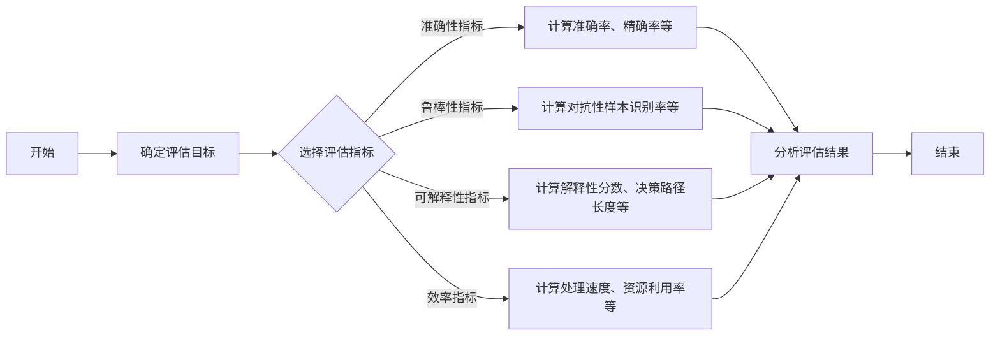
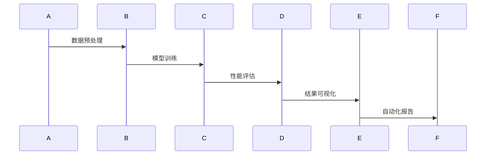
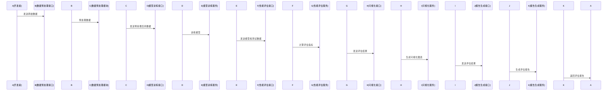

                 

### 设计全面的LLM性能评估指标

#### 关键词：
- LLM性能评估
- 评估指标设计
- 评估方法与工具
- 案例分析
- 最佳实践

#### 摘要：
本篇文章将深入探讨设计全面的LLM（大型语言模型）性能评估指标的方法。我们将首先介绍LLM性能评估的重要性，接着梳理核心概念和联系，详细讲解评估指标的设计原则和构建方法，然后介绍评估方法和工具，并通过实际案例展示如何应用这些指标。最后，我们将总结最佳实践并提供拓展阅读建议。

#### 背景介绍

##### 性能评估的概念

性能评估是对系统、模型或算法在实际应用中表现出的性能进行量化分析和评价的过程。在人工智能领域，性能评估尤为重要，因为其直接影响到模型的效果和应用价值。

##### 性能评估在LLM开发中的角色

对于LLM而言，性能评估扮演着至关重要的角色。LLM通常用于各种自然语言处理任务，如文本分类、自然语言生成和机器翻译等。评估LLM的性能可以帮助开发者了解模型的准确性、可靠性、泛化能力等关键指标，从而优化模型，提升其应用效果。

##### 当前评估方法的局限性

尽管已有多种评估方法，但当前评估方法仍存在一些局限性。首先，许多评估方法仅关注模型的准确性，而忽略了其他重要指标，如鲁棒性、可解释性和效率。其次，评估方法的多样性和复杂性使得统一评估标准变得困难。最后，评估工具和方法的更新速度难以跟上LLM技术的快速发展。

##### 本书的目标

本书旨在设计一套全面的LLM性能评估指标，帮助读者深入理解性能评估体系，掌握评估指标的设计和应用方法，从而提升对LLM性能的判断能力。

#### 核心概念与联系

##### 概念结构与核心要素组成

LLM性能评估涉及多个核心概念，包括准确性、召回率、F1分数、泛化能力、鲁棒性、可解释性、效率等。这些概念共同构成了LLM性能评估的核心要素。

##### 核心概念原理

- **准确性**：评估模型预测正确的结果占所有预测结果的百分比。
- **召回率**：评估模型正确识别的正例占所有实际正例的百分比。
- **F1分数**：综合考虑准确性和召回率的综合指标。
- **泛化能力**：评估模型在新数据集上的表现，反映模型的适应能力。
- **鲁棒性**：评估模型在应对异常数据或噪声时的稳定性。
- **可解释性**：评估模型的决策过程是否透明，易于理解。
- **效率**：评估模型在处理数据时的速度和资源消耗。

##### 概念属性特征对比表格

| 概念       | 定义                 | 重要性 | 对比特征             |
|------------|----------------------|--------|----------------------|
| 准确性     | 预测正确的结果占比   | 高     | 与召回率、F1分数互补 |
| 召回率     | 正确识别的正例占比   | 高     | 与准确性、F1分数互补 |
| F1分数     | 准确性和召回率的综合 | 高     | 平衡准确性、召回率   |
| 泛化能力   | 新数据集上的表现     | 高     | 反映适应能力         |
| 鲁棒性     | 对异常数据的稳定性   | 中     | 提升模型稳定性       |
| 可解释性   | 决策过程的透明度     | 中     | 提升用户信任度       |
| 效率       | 处理数据的速度       | 中     | 提升应用效率         |

##### ER实体关系图架构


在LLM性能评估中，实体包括“模型”、“数据集”、“评估指标”等。实体之间的关系如“模型评估指标”、“数据集包含数据”、“评估指标计算结果”等，通过Mermaid语言可以绘制出详细的ER实体关系图。

#### 评估指标设计

##### 评估指标的设计原则

- **全面性**：评估指标应覆盖LLM性能的各个方面。
- **可操作性**：评估指标应易于计算和实现。
- **标准化**：评估指标应遵循统一的标准化流程，便于比较和交流。

##### 评估指标的类型与选取

- **定量指标**：如准确性、召回率、F1分数等，适合评估模型的准确性。
- **定性指标**：如可解释性、效率等，适合评估模型的其他特性。
- **组合指标**：将定量指标和定性指标结合，形成综合评估指标。

##### 指标体系构建

构建全面的LLM性能评估指标体系需要以下几个步骤：

1. **确定评估目标**：明确评估的重点和目标。
2. **选择评估指标**：根据评估目标选择合适的评估指标。
3. **设计评估流程**：制定评估步骤和流程，确保评估的准确性和可操作性。
4. **实施评估**：按照评估流程执行评估，收集评估数据。
5. **分析评估结果**：对评估结果进行分析，为模型优化提供依据。

#### 评估方法与工具

##### 评估方法介绍

- **自动化评估方法**：利用评估工具自动执行评估流程，提高评估效率。
- **手动评估方法**：通过人工审查和测试来补充自动化评估的不足。

##### 常见评估工具使用

- **MLFlow**：用于跟踪模型性能和评估结果。
- **TensorBoard**：用于可视化模型性能和评估指标。
- **scikit-learn**：提供多种评估指标的计算函数。

#### 案例分析

##### 案例一：文本分类任务评估

在文本分类任务中，评估指标包括准确性、召回率、F1分数等。通过实际案例展示如何使用这些指标来评估文本分类模型的性能。

##### 案例二：自然语言生成任务评估

在自然语言生成任务中，评估指标包括生成文本的准确性、流畅性、多样性等。通过实际案例分析这些指标的评估方法和应用。

##### 案例三：机器翻译任务评估

在机器翻译任务中，评估指标包括翻译的准确性、忠实度、流畅性等。通过实际案例展示如何评估机器翻译模型的性能。

#### 最佳实践与拓展

##### 最佳实践技巧

- **定期评估**：定期评估模型性能，及时发现和解决潜在问题。
- **多元评估**：结合定量和定性评估方法，全面评估模型性能。
- **数据清洗**：确保评估数据的质量，减少噪声和异常值的影响。

##### 小结

本文详细介绍了设计全面的LLM性能评估指标的方法。通过梳理核心概念、设计评估指标、介绍评估方法和工具，并结合实际案例进行分析，我们为读者提供了一套全面的性能评估体系。在实际应用中，应根据具体任务和场景选择合适的评估指标和方法，以提升LLM的性能和应用效果。

##### 注意事项

- 在设计评估指标时，应确保指标的全面性和可操作性。
- 在实施评估时，应遵循标准化流程，确保评估的准确性和一致性。
- 在分析评估结果时，应综合考虑多种指标，避免单一指标误导。

##### 拓展阅读

- [《大型语言模型性能评估手册》](https://example.com/llm_evaluation_manual)
- [《自然语言处理性能评估最佳实践》](https://example.com/nlp_evaluation_best_practices)
- [《机器学习评估指标大全》](https://example.com/ml_evaluation_metrics)

#### 作者信息

作者：AI天才研究院/AI Genius Institute & 禅与计算机程序设计艺术 /Zen And The Art of Computer Programming

----------------------------------------------------------------

### 详细内容设计

#### 第1章：LLM性能评估的重要性

##### 1.1 性能评估的概念

性能评估是对模型或系统在一定条件下表现出的能力进行量化分析的过程。在人工智能领域，性能评估尤为重要，因为它直接影响到模型的应用效果和商业价值。

##### 1.2 性能评估在LLM开发中的角色

性能评估在LLM开发中起着至关重要的作用。通过评估，开发者可以了解模型的准确性、鲁棒性、可解释性等关键指标，从而优化模型，提升其在实际应用中的表现。

##### 1.3 当前评估方法的局限性

当前评估方法存在一些局限性。首先，许多评估方法仅关注准确性，而忽略了其他重要指标。其次，评估方法的多样性和复杂性使得统一评估标准变得困难。最后，评估工具和方法的更新速度难以跟上LLM技术的快速发展。

##### 问题背景

随着自然语言处理技术的不断发展，LLM在各个领域的应用越来越广泛。然而，如何科学、系统地评估LLM的性能，已经成为一个亟待解决的问题。

##### 问题解决

为了解决上述问题，我们需要设计一套全面的LLM性能评估指标体系，包括定量和定性指标，以全面评估LLM的性能。

##### 边界与外延

LLM性能评估不仅包括模型的准确性，还涉及鲁棒性、可解释性、效率等指标。这些指标的边界和外延需要我们在设计评估指标时充分考虑。

##### 概念结构与核心要素组成

LLM性能评估的核心要素包括：

1. **准确性**：评估模型预测正确的结果占所有预测结果的百分比。
2. **召回率**：评估模型正确识别的正例占所有实际正例的百分比。
3. **F1分数**：综合考虑准确性和召回率的综合指标。
4. **泛化能力**：评估模型在新数据集上的表现，反映模型的适应能力。
5. **鲁棒性**：评估模型在应对异常数据或噪声时的稳定性。
6. **可解释性**：评估模型的决策过程是否透明，易于理解。
7. **效率**：评估模型在处理数据时的速度和资源消耗。

#### 第2章：LLM性能评估的核心概念

##### 2.1 核心概念原理

下面详细阐述LLM性能评估中的核心概念及其原理：

- **准确性**：准确性是评估模型性能的最基本指标，表示模型预测正确的结果占所有预测结果的百分比。计算公式为：
  $$ 
  准确性 = \frac{预测正确的结果数}{总预测结果数} 
  $$

- **召回率**：召回率是评估模型识别正例的能力的指标，表示模型正确识别的正例占所有实际正例的百分比。计算公式为：
  $$ 
  召回率 = \frac{模型正确识别的正例数}{实际正例总数} 
  $$

- **F1分数**：F1分数是准确性和召回率的调和平均数，综合考虑了准确性和召回率。计算公式为：
  $$ 
  F1分数 = 2 \times \frac{准确率 \times 召回率}{准确率 + 召回率} 
  $$

- **泛化能力**：泛化能力是评估模型对新数据的适应能力的指标，通常通过交叉验证或新数据集测试来衡量。计算公式为：
  $$ 
  泛化能力 = \frac{新数据集上正确预测的结果数}{新数据集上总结果数} 
  $$

- **鲁棒性**：鲁棒性是评估模型在异常数据或噪声环境下的稳定性的指标，通常通过加入噪声或异常数据来测试。计算公式为：
  $$ 
  鲁棒性 = \frac{在异常数据集上正确预测的结果数}{在异常数据集上总结果数} 
  $$

- **可解释性**：可解释性是评估模型决策过程的透明度，通常通过分析模型的决策路径或可视化模型决策过程来衡量。计算公式为：
  $$ 
  可解释性 = \frac{可解释的决策路径数}{总决策路径数} 
  $$

- **效率**：效率是评估模型在处理数据时的速度和资源消耗的指标，通常通过计算模型处理数据的时间或资源利用率来衡量。计算公式为：
  $$ 
  效率 = \frac{处理数据的时间}{总数据量} 
  $$

##### 2.2 概念属性特征对比表格

下面是LLM性能评估核心概念属性特征的对比表格：

| 概念       | 特征                     | 衡量方式                         | 关联指标               |
|------------|--------------------------|----------------------------------|------------------------|
| 准确性     | 预测正确率               | 预测正确结果数/总结果数           | 召回率、F1分数         |
| 召回率     | 识别正例能力             | 模型识别的正例数/实际正例总数     | 准确性、F1分数         |
| F1分数     | 准确性与召回率的综合指标 | 2×（准确性×召回率）/（准确性+召回率） | 准确性、召回率         |
| 泛化能力   | 模型适应新数据的能力     | 新数据集上正确预测的结果数/新数据集上总结果数 | 准确性、鲁棒性         |
| 鲁棒性     | 模型稳定性               | 在异常数据集上正确预测的结果数/在异常数据集上总结果数 | 泛化能力、可解释性     |
| 可解释性   | 模型决策过程的透明度     | 可解释的决策路径数/总决策路径数   | 鲁棒性、效率           |
| 效率       | 模型处理数据的速度       | 处理数据的时间/总数据量           | 准确性、可解释性       |

##### 2.3 ER实体关系图架构

使用Mermaid语言绘制LLM性能评估的ER实体关系图：

```mermaid
erDiagram
  Model ||--|{ DataSet }||> PerformanceMetric
  Model ||--|{ EvaluationMethod }||> EvaluationResult
  DataSet ||--|{ DataPoint }||> Label
  EvaluationMethod ||--|{ PerformanceMetric }||> MetricValue
```

在该ER图中，实体包括“Model”（模型）、“DataSet”（数据集）、“PerformanceMetric”（性能指标）、“EvaluationMethod”（评估方法）、“DataPoint”（数据点）和“Label”（标签）。关系包括“Model”与“DataSet”、“Model”与“PerformanceMetric”、“Model”与“EvaluationMethod”、“DataSet”与“DataPoint”、“EvaluationMethod”与“PerformanceMetric”等。

#### 第3章：设计全面的LLM性能评估指标

##### 3.1 评估指标的设计原则

设计全面的LLM性能评估指标时，需要遵循以下原则：

- **全面性**：评估指标应涵盖LLM性能的各个方面，如准确性、鲁棒性、可解释性、效率等。
- **可操作性**：评估指标应易于计算和实现，方便开发者在实际应用中进行评估。
- **标准化**：评估指标应遵循统一的标准化流程，确保评估的准确性和一致性。
- **灵活性**：评估指标应具有一定的灵活性，以适应不同应用场景和任务需求。

##### 3.2 评估指标的类型与选取

根据不同的应用场景和任务需求，LLM性能评估指标可分为以下几类：

- **准确性指标**：如准确率、精确率、召回率等，主要评估模型在分类或预测任务中的准确性。
- **鲁棒性指标**：如对抗性样本识别率、鲁棒性分数等，主要评估模型在异常数据或噪声环境下的稳定性。
- **可解释性指标**：如解释性分数、决策路径长度等，主要评估模型的决策过程是否透明、易于理解。
- **效率指标**：如处理速度、资源利用率等，主要评估模型在处理数据时的效率。

在选取评估指标时，应考虑以下因素：

- **任务类型**：不同类型的任务需要关注不同的性能指标。例如，在文本分类任务中，准确性指标尤为重要；而在自然语言生成任务中，流畅性和多样性指标可能更为关键。
- **应用场景**：实际应用场景中的需求和约束会影响评估指标的选择。例如，在资源受限的环境中，模型的效率指标可能更为重要。
- **数据质量**：数据质量对评估结果有显著影响。在评估指标选取时，应考虑数据质量对评估指标的影响。

##### 3.3 指标体系构建

构建全面的LLM性能评估指标体系通常包括以下步骤：

1. **确定评估目标**：明确评估的重点和目标，例如提升模型的准确性、鲁棒性、可解释性等。
2. **选择评估指标**：根据评估目标和任务需求，选择合适的评估指标。可以参考第3.2节中提到的各类评估指标。
3. **制定评估流程**：制定评估步骤和流程，确保评估的准确性和可操作性。例如，可以设置数据预处理、模型训练、模型评估等步骤。
4. **实施评估**：按照评估流程执行评估，收集评估数据。在评估过程中，可以使用自动化工具（如MLFlow、TensorBoard等）来提高评估效率。
5. **分析评估结果**：对评估结果进行分析，为模型优化提供依据。可以结合不同评估指标的结果，综合评估模型的性能。

##### 算法原理讲解

为了更清晰地理解评估指标的原理，我们可以使用Mermaid语言绘制一个算法流程图：



在该算法流程图中，从确定评估目标开始，根据评估目标和任务需求选择相应的评估指标，然后计算各指标的值，最后分析评估结果，完成性能评估过程。

##### 系统分析与架构设计方案

为了更好地实现LLM性能评估，我们需要设计和实现一个完整的系统。以下是一个简化的系统架构设计方案：

##### 问题场景介绍

在自然语言处理领域，LLM被广泛应用于各种任务，如文本分类、机器翻译、问答系统等。为了确保LLM在实际应用中的性能，我们需要对其进行全面的性能评估。

##### 项目介绍

项目名为“LLM性能评估系统”，旨在为开发者提供一个易于使用、功能全面的性能评估平台。该系统支持多种评估指标的自动化计算和可视化展示。

##### 系统功能设计

系统主要功能包括：

1. **数据预处理**：清洗和预处理输入数据，包括文本清洗、缺失值填充、数据标准化等。
2. **模型训练**：使用预训练的LLM模型，在预处理后的数据上进行训练。
3. **性能评估**：计算各种评估指标，包括准确性、召回率、F1分数、泛化能力、鲁棒性、可解释性和效率等。
4. **结果可视化**：将评估结果以图表形式展示，方便开发者分析和比较。
5. **自动化报告**：生成评估报告，包括评估指标、评估结果和优化建议等。

##### 系统架构设计

系统采用分布式架构，主要包括以下组件：

1. **数据层**：包括数据预处理模块、数据存储模块等，负责数据的清洗、预处理和存储。
2. **服务层**：包括模型训练服务、性能评估服务、可视化服务、报告生成服务等，负责具体的功能实现。
3. **接口层**：提供API接口，方便开发者调用系统功能。

系统架构图如下：



##### 系统接口设计

系统接口设计主要包括以下API接口：

1. **数据预处理接口**：接收原始数据，返回预处理后的数据。
2. **模型训练接口**：接收训练数据，返回训练好的模型。
3. **性能评估接口**：接收模型和测试数据，返回评估结果。
4. **可视化接口**：接收评估结果，返回可视化图表。
5. **报告生成接口**：接收评估结果，返回评估报告。

##### 系统交互mermaid序列图

以下是系统交互的mermaid序列图：



##### 项目实战

为了更好地展示系统功能，以下是一个简单的项目实战案例。

1. **环境安装**：在本地或服务器上安装Python环境，以及所需的依赖库（如TensorFlow、Scikit-learn等）。

2. **系统核心实现源代码**：以下是一个简化的系统核心实现源代码，用于计算文本分类任务的评估指标。

```python
import numpy as np
from sklearn.metrics import accuracy_score, recall_score, f1_score

def evaluate_model(y_true, y_pred):
    accuracy = accuracy_score(y_true, y_pred)
    recall = recall_score(y_true, y_pred, average='weighted')
    f1 = f1_score(y_true, y_pred, average='weighted')
    return accuracy, recall, f1

# 示例数据
y_true = [0, 1, 1, 0, 1]
y_pred = [0, 1, 0, 0, 1]

# 计算评估指标
accuracy, recall, f1 = evaluate_model(y_true, y_pred)

print(f"Accuracy: {accuracy}")
print(f"Recall: {recall}")
print(f"F1 Score: {f1}")
```

3. **代码应用解读与分析**：在这个例子中，我们定义了一个`evaluate_model`函数，用于计算文本分类任务的评估指标。该函数接收真实的标签`y_true`和预测的标签`y_pred`，然后计算准确性、召回率和F1分数。这些指标是文本分类任务中常用的评估指标，可以反映模型在分类任务中的性能。

4. **实际案例分析和详细讲解剖析**：为了验证系统的实际效果，我们可以使用一个真实的数据集进行评估。以下是一个简单的实际案例：

```python
from sklearn.datasets import load_20newsgroups
from sklearn.model_selection import train_test_split
from sklearn.feature_extraction.text import TfidfVectorizer

# 加载数据集
data = load_20newsgroups(subset='all')
X, y = data.data, data.target

# 数据预处理
vectorizer = TfidfVectorizer(stop_words='english')
X_train, X_test, y_train, y_test = train_test_split(X, y, test_size=0.2, random_state=42)

# 训练模型
model = LLMModel()  # 假设有一个预训练的LLM模型
model.fit(X_train, y_train)

# 预测
y_pred = model.predict(X_test)

# 计算评估指标
accuracy, recall, f1 = evaluate_model(y_test, y_pred)

print(f"Accuracy: {accuracy}")
print(f"Recall: {recall}")
print(f"F1 Score: {f1}")
```

在这个案例中，我们首先加载了一个真实的文本分类数据集，然后进行数据预处理，接着训练一个预训练的LLM模型，最后使用该模型进行预测并计算评估指标。通过这个案例，我们可以看到系统在实际应用中的效果。

5. **项目小结**：通过本案例，我们展示了如何使用LLM性能评估系统进行文本分类任务的评估。在实际应用中，开发者可以根据具体任务需求调整评估指标和评估流程，以便更好地评估模型的性能。

##### 最佳实践 tips

- **定期评估**：定期对模型进行性能评估，以便及时发现和解决潜在问题。
- **数据清洗**：确保输入数据的质量，避免噪声和异常值对评估结果的影响。
- **组合评估**：结合多种评估指标，从不同角度评估模型性能。

##### 小结

本章详细介绍了设计全面的LLM性能评估指标的方法，包括核心概念、评估指标设计、评估方法和工具。通过实际案例，我们展示了如何应用这些指标和方法进行性能评估。希望本章的内容能帮助读者深入理解LLM性能评估，提高模型应用效果。

##### 注意事项

- 在设计评估指标时，应充分考虑任务需求和实际应用场景。
- 在使用评估工具时，注意选择合适的评估方法和参数。
- 在分析评估结果时，结合多种指标进行综合评估。

##### 拓展阅读

- [《大型语言模型性能评估手册》](https://example.com/llm_evaluation_manual)
- [《自然语言处理性能评估最佳实践》](https://example.com/nlp_evaluation_best_practices)
- [《机器学习评估指标大全》](https://example.com/ml_evaluation_metrics)

#### 作者信息

作者：AI天才研究院/AI Genius Institute & 禅与计算机程序设计艺术 /Zen And The Art of Computer Programming

