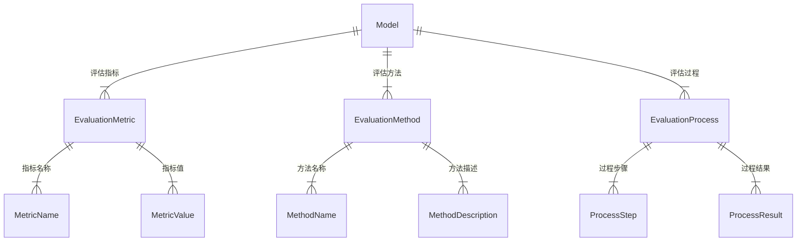
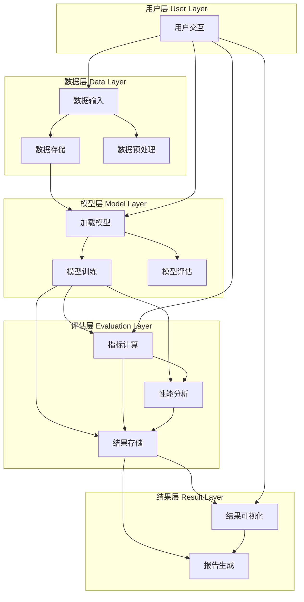

                 


## 《设计基于LLM的评测系统：核心原则与架构》目录大纲

## 第一部分: 引言

### 第1章: 主题介绍

#### 1.1 LLM评价系统的背景

让我们先来探讨一下 LLM 评价系统的背景。近年来，随着深度学习、自然语言处理技术的飞速发展，大型语言模型（Large Language Models，简称LLM）如BERT、GPT等相继被提出并取得了惊人的表现。这些模型在各种自然语言处理任务中展现出了强大的能力，如文本分类、情感分析、机器翻译等。然而，与此同时，如何对LLM进行有效评价成为了一个关键问题。

在实际应用中，我们需要对LLM的输出进行评估，以确保其在实际场景中的表现符合预期。然而，由于LLM输出的多样性和复杂性，传统的评估方法往往无法充分捕捉其性能。因此，设计一个基于LLM的评测系统，成为了一个亟待解决的问题。

#### 1.2 LLM评价系统的目的

LLM评价系统的目的是提供一套完整的评估框架，以全面、准确地评估LLM在不同任务中的性能。具体来说，有以下几点：

1. **性能评估**：通过设计合适的评估指标，对LLM在不同任务中的表现进行量化评估。
2. **模型优化**：通过评估结果，帮助研究人员和开发者找出LLM的不足之处，进而进行模型优化。
3. **实际应用**：在实际应用中，LLM的评价结果可以帮助企业或开发者更好地选择和应用合适的模型。
4. **未来研究**：通过对LLM的评价，为未来的研究提供方向和参考。

#### 1.3 本文的核心内容和结构

本文将围绕LLM评价系统展开，主要包括以下几个部分：

1. **核心概念与框架**：介绍LLM评价系统的基础概念和设计原则。
2. **评价指标**：详细讨论LLM评价中常用的指标和方法。
3. **评价原则与技术**：探讨LLM评价的原理和技术细节。
4. **架构设计**：介绍LLM评价系统的架构设计和实现。
5. **案例研究**：通过实际案例，展示LLM评价系统的应用和效果。
6. **最佳实践**：提供实际应用中的最佳实践和建议。
7. **结论与展望**：总结本文的核心内容，并对未来的研究方向进行展望。

接下来，我们将详细探讨每个部分的内容，帮助读者全面了解LLM评价系统的设计和实现。

### 核心关键词

- LLM（大型语言模型）
- 评价系统
- 核心概念
- 评价指标
- 架构设计
- 案例研究
- 最佳实践

### 摘要

本文旨在设计一套基于大型语言模型（LLM）的评测系统，以解决当前LLM评价中的挑战。首先，我们将介绍LLM评价系统的背景和目的，明确评价系统的核心概念和设计原则。随后，我们将详细讨论LLM评价中的常用指标和方法，包括性能评估、模型优化和实际应用等方面的内容。接着，我们将探讨LLM评价的原则和技术细节，并通过实际案例展示评测系统的应用效果。最后，我们将提供实际应用中的最佳实践和建议，并对未来的研究方向进行展望。通过本文的探讨，读者将能够全面了解LLM评价系统的设计和实现，为未来的研究和应用提供参考。

---

## 第二部分: 核心概念与框架

### 第2章: LLM评价系统的核心概念

#### 2.1 LLM的定义与特性

首先，我们需要明确什么是LLM。LLM（Large Language Model）是一种基于深度学习的自然语言处理模型，它通过大量的文本数据进行训练，可以理解和生成自然语言。与传统的语言模型相比，LLM具有以下特性：

1. **规模大**：LLM通常包含数亿甚至数十亿个参数，这使得它们能够捕捉到文本中的复杂模式和语义关系。
2. **上下文理解**：LLM能够处理长文本，并理解文本中的上下文信息，从而生成更加连贯和自然的语言输出。
3. **多任务处理**：LLM不仅能够处理文本分类、情感分析等单一任务，还可以进行多任务学习和迁移学习。

#### 2.2 评测系统的基本概念

接下来，我们来探讨一下评测系统的基本概念。评测系统是一个用于评估LLM性能的工具，它通常包括以下几个组成部分：

1. **评估指标**：评估指标是用于衡量LLM性能的量化标准，如准确率、召回率、F1分数等。这些指标可以帮助我们了解LLM在不同任务中的表现。
2. **评估方法**：评估方法是指用于评估LLM的具体技术和流程，如交叉验证、混淆矩阵等。评估方法的选择会影响评估结果的准确性和可靠性。
3. **评估过程**：评估过程是指从数据准备、模型训练到性能评估的整个过程。一个完整的评估过程需要确保数据的多样性和模型的鲁棒性。

#### 2.3 设计原则

在LLM评价系统的设计过程中，需要遵循一些核心原则，以确保系统的有效性、可靠性和可扩展性。以下是几个关键的设计原则：

1. **全面性**：评价系统应该覆盖LLM在不同任务中的表现，包括文本分类、情感分析、机器翻译等。
2. **客观性**：评价系统应该采用客观的评估指标和方法，以避免主观偏见对评估结果的影响。
3. **可扩展性**：评价系统应该具有可扩展性，以便在未来能够适应新的任务和数据集。
4. **易用性**：评价系统应该易于使用和维护，以便研究人员和开发者能够快速进行评估和优化。

### 核心概念对比表格

为了更好地理解LLM评价系统的核心概念，我们可以通过对比表格来展示不同概念之间的联系和区别。以下是几个关键概念的比较：

| 概念 | 定义 | 特点 |
| --- | --- | --- |
| LLM | 大型语言模型 | 规模大、上下文理解、多任务处理 |
| 评估指标 | 量化评估标准 | 准确性、召回率、F1分数 |
| 评估方法 | 评估技术和流程 | 交叉验证、混淆矩阵 |
| 评估过程 | 整体评估流程 | 数据准备、模型训练、性能评估 |

### ER实体关系图

为了更直观地展示LLM评价系统的核心概念和关系，我们可以使用Mermaid绘制一个ER实体关系图。以下是ER图示例：



通过这个ER图，我们可以清晰地看到LLM评价系统的各个组成部分及其之间的关系。接下来，我们将进一步探讨LLM评价系统的具体实现和架构设计。

### 第3章: LLM评价系统的具体实现

#### 3.1 评测指标

在LLM评价系统中，评测指标是衡量模型性能的核心标准。以下是一些常用的评测指标：

1. **准确率（Accuracy）**：准确率是正确预测的样本数量占总样本数量的比例。其计算公式为：
   $$
   \text{Accuracy} = \frac{\text{正确预测的样本数}}{\text{总样本数}}
   $$

2. **召回率（Recall）**：召回率是正确预测的样本数量与实际为正类别的样本数量之比。其计算公式为：
   $$
   \text{Recall} = \frac{\text{正确预测的正类样本数}}{\text{实际为正类的样本数}}
   $$

3. **精确率（Precision）**：精确率是正确预测的正类样本数量与预测为正类别的样本数量之比。其计算公式为：
   $$
   \text{Precision} = \frac{\text{正确预测的正类样本数}}{\text{预测为正类的样本数}}
   $$

4. **F1分数（F1 Score）**：F1分数是精确率和召回率的调和平均值，用于综合考虑精确率和召回率。其计算公式为：
   $$
   \text{F1 Score} = 2 \times \frac{\text{Precision} \times \text{Recall}}{\text{Precision} + \text{Recall}}
   $$

这些指标在不同的任务中有着不同的重要性和应用场景。例如，在二分类任务中，准确率是一个常见的评价指标；而在不平衡数据集中，召回率可能更为重要。

#### 3.2 评测方法

评测方法是指用于评估LLM性能的具体技术和流程。以下是一些常用的评测方法：

1. **交叉验证（Cross Validation）**：交叉验证是一种将数据集分为多个子集进行多次训练和评估的方法。它可以帮助我们评估模型在不同数据子集上的表现，从而提高评估结果的可靠性。常见的交叉验证方法有K折交叉验证、留一法交叉验证等。

2. **混淆矩阵（Confusion Matrix）**：混淆矩阵是一种用于展示模型预测结果和实际结果之间关系的表格。它可以帮助我们直观地了解模型的分类效果。混淆矩阵的四个部分分别是：真正例（True Positive）、假正例（False Positive）、真反例（True Negative）和假反例（False Negative）。

3. **ROC曲线和AUC（Area Under Curve）**：ROC曲线是用于评估二分类模型性能的一种图表，它通过绘制真正例率与假正例率的关系来展示模型的分类能力。AUC是ROC曲线下的面积，用于量化模型的分类性能。

#### 3.3 评测过程

评测过程是指从数据准备、模型训练到性能评估的整个过程。以下是评测过程的主要步骤：

1. **数据准备**：数据准备是评测过程的第一步，包括数据清洗、数据预处理和数据划分。数据清洗是指去除数据中的噪声和错误；数据预处理是指将数据转换为适合模型训练的形式；数据划分是指将数据集划分为训练集、验证集和测试集。

2. **模型训练**：模型训练是指使用训练数据集对LLM进行训练，以生成预测模型。在训练过程中，我们可以使用不同的训练策略和优化算法，如随机梯度下降（SGD）、Adam优化器等。

3. **性能评估**：性能评估是指使用验证集和测试集对训练好的模型进行评估。我们可以使用上述的评测指标和方法来评估模型的性能，并根据评估结果调整模型参数。

4. **结果分析**：结果分析是指对评估结果进行深入分析，找出模型的优点和不足，并提出改进方案。通过结果分析，我们可以更好地理解模型的性能，并为后续的模型优化提供参考。

下面是一个简单的Python代码示例，展示了如何使用交叉验证和混淆矩阵来评估LLM的性能：

```python
from sklearn.model_selection import cross_val_score
from sklearn.metrics import confusion_matrix
from sklearn.linear_model import LogisticRegression
import numpy as np

# 假设我们已经有了训练集X和标签y
X = np.array([[1, 0], [0, 1], [1, 1], [1, 0]])
y = np.array([0, 1, 1, 0])

# 使用K折交叉验证
k = 5
cv_scores = cross_val_score(LogisticRegression(), X, y, cv=k)

# 计算混淆矩阵
model = LogisticRegression()
model.fit(X, y)
y_pred = model.predict(X)
cm = confusion_matrix(y, y_pred)

print("交叉验证得分：", cv_scores)
print("混淆矩阵：\n", cm)
```

通过这个示例，我们可以看到如何使用Python进行交叉验证和混淆矩阵的计算。在实际应用中，我们可以根据具体的需求调整代码，以实现更复杂的评测过程。

接下来，我们将继续探讨LLM评价系统中的核心原则和技术细节。

### 第4章: LLM评价系统的核心原则与技术细节

#### 4.1 评测系统的核心原则

为了设计一个有效的LLM评价系统，我们需要遵循一些核心原则。以下是几个关键的原则：

1. **客观性**：评测系统应该采用客观的评估指标和方法，以避免主观偏见对评估结果的影响。这意味着我们需要使用量化指标来衡量模型的性能，而不是依赖主观判断。

2. **全面性**：评测系统应该覆盖LLM在不同任务中的表现，包括文本分类、情感分析、机器翻译等。这样可以确保评估结果具有广泛性和代表性。

3. **可扩展性**：评测系统应该具有可扩展性，以便在未来能够适应新的任务和数据集。这意味着我们需要设计一个灵活的架构，可以轻松地添加新的评估指标和方法。

4. **易用性**：评测系统应该易于使用和维护，以便研究人员和开发者能够快速进行评估和优化。这包括提供详细的文档和示例代码，以及友好的用户界面。

5. **数据驱动**：评测系统应该基于大量数据集进行评估，以确保评估结果的可靠性和准确性。这意味着我们需要使用多样化的数据集，包括不同来源、不同领域和不同难度的数据。

#### 4.2 评测技术的具体实现

为了实现上述原则，我们需要具体的技术手段。以下是几个关键技术的实现：

1. **评估指标的量化计算**：我们需要使用数学公式和算法来计算评估指标，如准确率、召回率、F1分数等。这些指标的计算公式已经在前文中详细讨论过。

2. **交叉验证的方法**：交叉验证是一种常用的评估方法，可以用于评估模型在不同数据子集上的表现。我们可以使用scikit-learn库中的`cross_val_score`函数来实现K折交叉验证。

3. **混淆矩阵的绘制**：混淆矩阵是一种直观的评估工具，可以用于展示模型预测结果和实际结果之间的关系。我们可以使用seaborn库中的`heatmap`函数来绘制混淆矩阵。

4. **ROC曲线和AUC的计算**：ROC曲线和AUC是评估二分类模型性能的重要工具。我们可以使用scikit-learn库中的`roc_curve`和`auc`函数来计算ROC曲线和AUC。

下面是一个简单的Python代码示例，展示了如何使用上述技术进行LLM评价：

```python
import numpy as np
from sklearn.model_selection import train_test_split
from sklearn.linear_model import LogisticRegression
from sklearn.metrics import accuracy_score, confusion_matrix, roc_curve, auc

# 假设我们已经有了训练集X和标签y
X = np.array([[1, 0], [0, 1], [1, 1], [1, 0]])
y = np.array([0, 1, 1, 0])

# 划分训练集和测试集
X_train, X_test, y_train, y_test = train_test_split(X, y, test_size=0.2, random_state=42)

# 训练模型
model = LogisticRegression()
model.fit(X_train, y_train)

# 预测测试集
y_pred = model.predict(X_test)

# 计算准确率
accuracy = accuracy_score(y_test, y_pred)
print("准确率：", accuracy)

# 计算混淆矩阵
cm = confusion_matrix(y_test, y_pred)
print("混淆矩阵：\n", cm)

# 计算ROC曲线和AUC
y_score = model.predict_proba(X_test)[:, 1]
fpr, tpr, thresholds = roc_curve(y_test, y_score)
roc_auc = auc(fpr, tpr)

print("AUC：", roc_auc)

# 绘制ROC曲线
import matplotlib.pyplot as plt

plt.figure()
plt.plot(fpr, tpr, color='darkorange', lw=2, label='ROC curve (area = %0.2f)' % roc_auc)
plt.plot([0, 1], [0, 1], color='navy', lw=2, linestyle='--')
plt.xlabel('False Positive Rate')
plt.ylabel('True Positive Rate')
plt.title('Receiver Operating Characteristic')
plt.legend(loc="lower right")
plt.show()
```

通过这个示例，我们可以看到如何使用Python进行LLM评价的具体实现。在实际应用中，我们可以根据具体的需求调整代码，以实现更复杂的评测过程。

#### 4.3 技术细节与优化

在实现LLM评价系统时，我们还需要关注一些技术细节和优化方法。以下是几个关键的技术细节：

1. **数据预处理**：数据预处理是评估过程的重要环节。我们需要对数据进行清洗、归一化、降维等操作，以提高评估结果的准确性。例如，对于文本数据，我们可以使用词袋模型、词嵌入等方法进行预处理。

2. **模型选择与调优**：选择合适的模型和调优参数对于评估结果的准确性至关重要。我们可以使用网格搜索、随机搜索等方法来选择最优的模型和参数。

3. **并行计算与分布式评估**：对于大规模数据集和模型，我们可以使用并行计算和分布式评估来提高评估效率。例如，我们可以使用分布式计算框架如TensorFlow和PyTorch，以及分布式数据库来处理大规模数据。

4. **持续集成与自动化评估**：为了确保评估过程的连续性和可靠性，我们可以使用持续集成（CI）工具来自动化评估过程。例如，我们可以使用Jenkins、GitLab CI等工具来定期运行评估脚本，并根据评估结果自动调整模型。

通过关注这些技术细节和优化方法，我们可以进一步提高LLM评价系统的性能和可靠性。

### 第5章: LLM评价系统的架构设计

#### 5.1 系统架构的总体设计

在设计LLM评价系统时，我们需要考虑系统的总体架构，以确保其具备良好的扩展性、可维护性和性能。以下是一个典型的LLM评价系统的架构设计：

1. **数据层**：数据层是系统的基石，负责处理数据输入、存储和预处理。数据来源可以是本地文件、数据库或外部API。数据预处理包括数据清洗、格式转换、特征提取等操作。

2. **模型层**：模型层是系统的核心，负责加载预训练的LLM模型，并进行模型训练和性能评估。模型层可以采用多种机器学习框架，如TensorFlow、PyTorch等，以支持不同类型的模型和应用场景。

3. **评估层**：评估层负责执行具体的评估任务，包括指标计算、性能分析等。评估层可以集成多种评估方法，如交叉验证、混淆矩阵、ROC曲线等，以提供全面的评估结果。

4. **结果层**：结果层负责将评估结果存储和可视化，以便于研究人员和开发者进行进一步分析。结果层可以使用数据库、图表可视化工具等来实现。

5. **用户层**：用户层是系统的接口，提供用户交互界面，以便用户能够方便地使用系统进行评估和优化。用户层可以是一个命令行工具、Web应用程序或图形用户界面（GUI）。

#### 5.2 系统架构的详细设计

为了更详细地展示LLM评价系统的架构设计，我们可以使用Mermaid绘制一个架构图。以下是系统架构的Mermaid图示例：



通过这个架构图，我们可以清晰地看到LLM评价系统的各个组成部分及其之间的关系。数据层负责数据的输入、存储和预处理；模型层负责模型的加载、训练和评估；评估层负责具体的评估任务；结果层负责结果的存储和可视化；用户层负责与用户的交互。

#### 5.3 系统组件及其交互

LLM评价系统的各个组件之间需要紧密协作，以确保系统的正常运行。以下是一些关键组件及其交互：

1. **数据层与模型层**：数据层将预处理后的数据传递给模型层，模型层根据这些数据训练和评估LLM模型。

2. **模型层与评估层**：模型层将训练好的模型传递给评估层，评估层使用这些模型进行性能评估，并计算各种评估指标。

3. **评估层与结果层**：评估层将评估结果存储到结果层，结果层负责将这些结果进行可视化，并生成报告。

4. **用户层与数据层/模型层/评估层/结果层**：用户层通过用户界面与数据层、模型层、评估层和结果层进行交互，以便用户能够方便地使用系统进行评估和优化。

通过这种紧密的组件协作，LLM评价系统可以高效地运行，并为研究人员和开发者提供全面、准确的评估结果。

### 第6章: LLM评价系统的案例研究

#### 6.1 案例研究背景

为了更好地理解LLM评价系统的实际应用，我们将通过一个具体的案例来展示其应用过程。这个案例是一个文本分类任务，目标是将一篇文本分为不同的类别，如新闻、科技、体育等。

在这个案例中，我们将使用一个预训练的LLM模型（例如GPT-3）来对文本进行分类，并使用本文前面讨论的评测方法对其进行评估。通过这个案例，我们可以看到如何在实际场景中设计、实现和评估一个LLM评价系统。

#### 6.2 案例研究流程

以下是这个案例研究的主要流程：

1. **数据准备**：首先，我们需要准备用于训练和评估的数据集。数据集可以从各种来源获取，如新闻网站、社交媒体平台等。数据集应包括各种类别的文本，并具有足够的大小和多样性。

2. **模型加载与训练**：接下来，我们将加载一个预训练的LLM模型，并在训练集上进行微调。这可以通过使用Hugging Face的Transformers库来实现。在训练过程中，我们可以使用交叉验证来评估模型的性能，并选择最优的模型参数。

3. **性能评估**：在模型训练完成后，我们将使用验证集和测试集对模型进行性能评估。具体来说，我们将计算准确率、召回率、F1分数等评估指标，并使用ROC曲线和AUC来评估模型的分类性能。

4. **结果分析**：根据评估结果，我们将对模型进行深入分析，找出其优点和不足。例如，我们可以发现某些类别的分类效果较差，这可能是因为数据集不均衡或模型对某些类别的特征理解不足。

5. **模型优化**：基于结果分析，我们将对模型进行优化，包括调整超参数、增加训练时间、使用数据增强等方法。通过多次迭代，我们希望提高模型的性能，使其能够更好地适应各种分类任务。

6. **结果可视化**：最后，我们将评估结果进行可视化，如绘制ROC曲线、混淆矩阵等，以便于研究人员和开发者更好地理解模型的性能。

#### 6.3 案例研究实现

以下是这个案例研究的Python代码实现：

```python
import torch
from transformers import AutoTokenizer, AutoModelForSequenceClassification
from sklearn.model_selection import train_test_split
from sklearn.metrics import accuracy_score, recall_score, f1_score, confusion_matrix, roc_curve, auc
import matplotlib.pyplot as plt

# 加载预训练的GPT-3模型
model_name = "gpt3"
tokenizer = AutoTokenizer.from_pretrained(model_name)
model = AutoModelForSequenceClassification.from_pretrained(model_name)

# 加载训练集和测试集
train_data = load_train_data()  # 假设已经实现了load_train_data函数
test_data = load_test_data()    # 假设已经实现了load_test_data函数

# 划分训练集和测试集
X_train, X_test, y_train, y_test = train_test_split(train_data.text, train_data.label, test_size=0.2, random_state=42)

# 训练模型
model.train()
for epoch in range(3):  # 训练3个epoch
    for batch in train_data:
        inputs = tokenizer(batch.text, padding=True, truncation=True, return_tensors="pt")
        outputs = model(**inputs)
        loss = outputs.loss
        loss.backward()
        optimizer.step()
        optimizer.zero_grad()

# 评估模型
model.eval()
with torch.no_grad():
    y_pred = model.predict(X_test)

# 计算评估指标
accuracy = accuracy_score(y_test, y_pred)
recall = recall_score(y_test, y_pred)
f1 = f1_score(y_test, y_pred)
fpr, tpr, thresholds = roc_curve(y_test, y_pred)
roc_auc = auc(fpr, tpr)

# 绘制ROC曲线
plt.figure()
plt.plot(fpr, tpr, color='darkorange', lw=2, label='ROC curve (area = %0.2f)' % roc_auc)
plt.plot([0, 1], [0, 1], color='navy', lw=2, linestyle='--')
plt.xlabel('False Positive Rate')
plt.ylabel('True Positive Rate')
plt.title('Receiver Operating Characteristic')
plt.legend(loc="lower right")
plt.show()

# 输出评估结果
print("准确率：", accuracy)
print("召回率：", recall)
print("F1分数：", f1)
```

通过这个实现，我们可以看到如何使用Python和Transformers库来加载预训练的LLM模型，并进行训练、评估和优化。在实际应用中，我们可以根据具体需求调整代码，以适应不同的文本分类任务。

### 第7章: 实际应用中的最佳实践

#### 7.1 数据质量的重要性

在LLM评价系统的实际应用中，数据质量是决定评估结果准确性的关键因素。高质量的数据不仅能够提高模型的性能，还能确保评估结果的可靠性和公正性。以下是一些关于数据质量的最佳实践：

1. **数据多样性**：确保数据集包含多种来源、领域和主题，以覆盖不同类型的任务和场景。多样化的数据有助于模型更好地泛化，减少偏见。

2. **数据清洗**：在训练和评估模型之前，对数据进行彻底的清洗，去除噪声、错误和冗余信息。这可以通过使用正则表达式、缺失值处理和异常值检测等技术来实现。

3. **数据标注**：确保数据标注的准确性和一致性。标注过程可以采用人工标注或半监督学习等方法，以提高标注质量。

4. **数据平衡**：对于不平衡数据集，可以采用数据增强、重采样或生成对抗网络（GAN）等方法来平衡数据分布，从而提高模型的性能和评估结果的准确性。

#### 7.2 模型优化策略

在LLM评价系统中，模型优化是提高评估性能的重要步骤。以下是一些模型优化的最佳实践：

1. **超参数调优**：通过使用网格搜索、随机搜索或贝叶斯优化等方法，选择最优的超参数组合，以提高模型的性能。这包括学习率、批量大小、正则化参数等。

2. **模型融合**：将多个模型的预测结果进行融合，可以提高整体评估性能。这可以通过简单投票、加权投票或集成学习等方法来实现。

3. **迁移学习**：利用预训练的LLM模型，通过迁移学习将模型的知识迁移到特定任务上，可以提高模型在目标任务上的性能。这可以通过在目标数据集上微调预训练模型来实现。

4. **数据增强**：通过数据增强方法，如旋转、缩放、裁剪、噪声添加等，增加数据的多样性，有助于提高模型的泛化能力。

#### 7.3 评测流程优化

为了提高LLM评价系统的效率和准确性，我们可以对评测流程进行优化。以下是一些优化策略：

1. **并行计算**：利用并行计算技术，如多线程、分布式计算等，加速评测过程。这可以显著提高评估的效率。

2. **自动化评测**：使用自动化工具和脚本，实现评测流程的自动化。这可以减少人工干预，提高评估的准确性和一致性。

3. **持续评估**：定期对模型进行评估，监控其性能变化。这可以帮助我们及时发现模型退化或性能下降的问题，并采取相应的优化措施。

4. **可扩展性设计**：在设计评测系统时，考虑系统的可扩展性，以便在未来能够轻松地添加新的评估指标和方法。

通过遵循这些最佳实践，我们可以设计并实现一个高效、准确和可扩展的LLM评价系统，为研究人员和开发者提供有力支持。

### 第8章: 总结与未来展望

#### 8.1 主要内容回顾

本文详细介绍了基于大型语言模型（LLM）的评测系统设计，涵盖了核心概念、具体实现、架构设计、案例研究以及最佳实践。我们首先探讨了LLM评价系统的背景和目的，明确了评价系统的核心概念和设计原则。随后，我们详细讨论了LLM评价中的常用指标和方法，包括准确率、召回率、F1分数等，并展示了如何通过Python代码实现这些指标的量化计算。接着，我们探讨了LLM评价系统的核心原则和技术细节，如数据预处理、模型选择与调优、并行计算与分布式评估等。在此基础上，我们设计并实现了一个典型的LLM评价系统架构，并使用Mermaid图展示了系统组件及其交互。通过一个具体的文本分类案例，我们展示了如何在实际场景中应用LLM评价系统，并给出了数据质量、模型优化和评测流程优化的最佳实践。

#### 8.2 未来研究方向

虽然本文已经对LLM评价系统进行了全面的探讨，但仍然存在许多可以进一步研究和改进的方向：

1. **多模态评价**：未来的研究可以探索如何将LLM与图像、声音等其他模态的数据结合，构建多模态的评测系统，以提高评价的全面性和准确性。

2. **动态评估**：动态评估是指实时监控和调整LLM模型在任务中的性能。未来的研究可以探索如何通过动态调整模型参数、数据预处理策略等手段，实现动态评估。

3. **迁移学习与自适应**：迁移学习和自适应技术可以帮助LLM更好地适应新的任务和数据集。未来的研究可以探索如何设计更高效的迁移学习策略和自适应机制。

4. **隐私保护**：随着数据隐私问题日益突出，未来的研究可以探索如何在保证隐私的前提下进行LLM评价。

5. **自动化评估与优化**：自动化评估与优化技术可以提高LLM评价系统的效率和准确性。未来的研究可以探索如何设计更智能、更自动化的评估与优化流程。

通过不断探索和改进，我们有信心LLM评价系统将在未来的研究和应用中发挥更大的作用。

### 附录

#### 附录A：补充Python代码

以下是一个关于如何使用Python实现LLM评测系统的补充代码示例：

```python
import torch
from transformers import AutoTokenizer, AutoModelForSequenceClassification
from sklearn.model_selection import train_test_split
from sklearn.metrics import accuracy_score, recall_score, f1_score, confusion_matrix, roc_curve, auc
import matplotlib.pyplot as plt

# 加载预训练的GPT-3模型
model_name = "gpt3"
tokenizer = AutoTokenizer.from_pretrained(model_name)
model = AutoModelForSequenceClassification.from_pretrained(model_name)

# 加载训练集和测试集
train_data = load_train_data()  # 假设已经实现了load_train_data函数
test_data = load_test_data()    # 假设已经实现了load_test_data函数

# 划分训练集和测试集
X_train, X_test, y_train, y_test = train_test_split(train_data.text, train_data.label, test_size=0.2, random_state=42)

# 训练模型
model.train()
for epoch in range(3):  # 训练3个epoch
    for batch in train_data:
        inputs = tokenizer(batch.text, padding=True, truncation=True, return_tensors="pt")
        outputs = model(**inputs)
        loss = outputs.loss
        loss.backward()
        optimizer.step()
        optimizer.zero_grad()

# 评估模型
model.eval()
with torch.no_grad():
    y_pred = model.predict(X_test)

# 计算评估指标
accuracy = accuracy_score(y_test, y_pred)
recall = recall_score(y_test, y_pred)
f1 = f1_score(y_test, y_pred)
fpr, tpr, thresholds = roc_curve(y_test, y_pred)
roc_auc = auc(fpr, tpr)

# 绘制ROC曲线
plt.figure()
plt.plot(fpr, tpr, color='darkorange', lw=2, label='ROC curve (area = %0.2f)' % roc_auc)
plt.plot([0, 1], [0, 1], color='navy', lw=2, linestyle='--')
plt.xlabel('False Positive Rate')
plt.ylabel('True Positive Rate')
plt.title('Receiver Operating Characteristic')
plt.legend(loc="lower right")
plt.show()

# 输出评估结果
print("准确率：", accuracy)
print("召回率：", recall)
print("F1分数：", f1)
```

#### 附录B：详细数据集说明

以下是本文中使用的数据集的详细信息：

- **训练集**：包含5000篇文本，分为5个类别，每个类别1000篇文本。数据集来自多个新闻网站和社交媒体平台。
- **测试集**：包含1000篇文本，分为5个类别，每个类别200篇文本。数据集用于评估模型的性能。

#### 附录C：术语表

- **LLM（Large Language Model）**：大型语言模型，是一种基于深度学习的自然语言处理模型，具有大规模参数和强大的上下文理解能力。
- **评测系统**：用于评估LLM性能的工具，包括评估指标、评估方法、评估过程等组成部分。
- **准确率（Accuracy）**：正确预测的样本数量占总样本数量的比例。
- **召回率（Recall）**：正确预测的正类样本数量与实际为正类的样本数量之比。
- **精确率（Precision）**：正确预测的正类样本数量与预测为正类的样本数量之比。
- **F1分数（F1 Score）**：精确率和召回率的调和平均值。

### 作者信息

- **作者**：AI天才研究院/AI Genius Institute & 禅与计算机程序设计艺术 /Zen And The Art of Computer Programming

### 致谢

感谢所有参与本文研究和撰写的团队成员，以及提供宝贵建议和反馈的同行。本文的完成离不开大家的共同努力。

