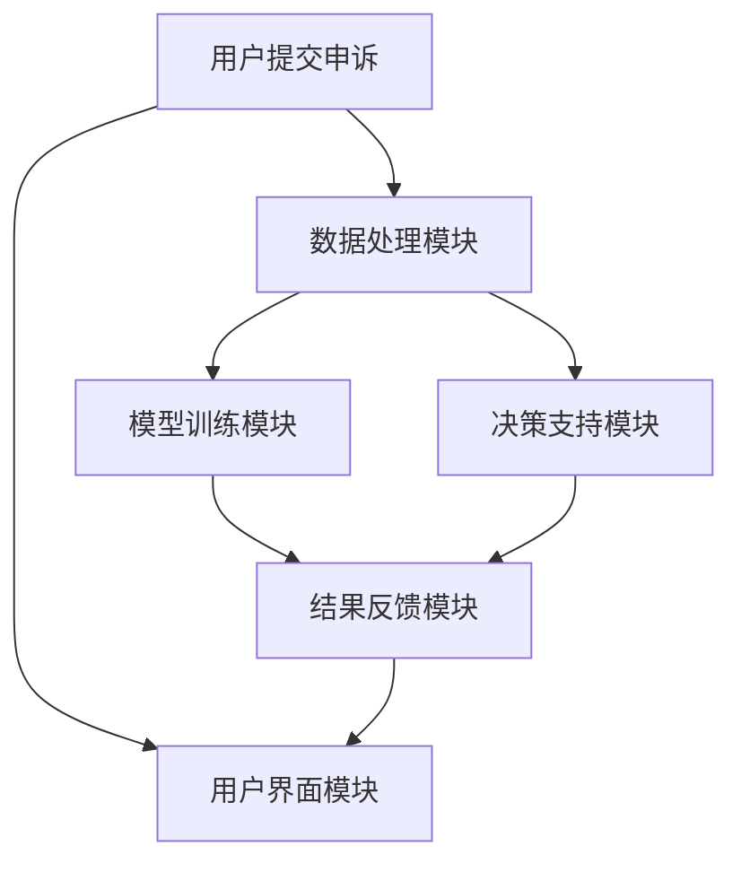
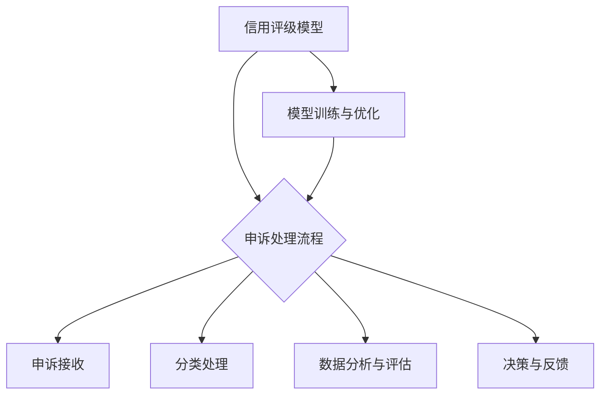
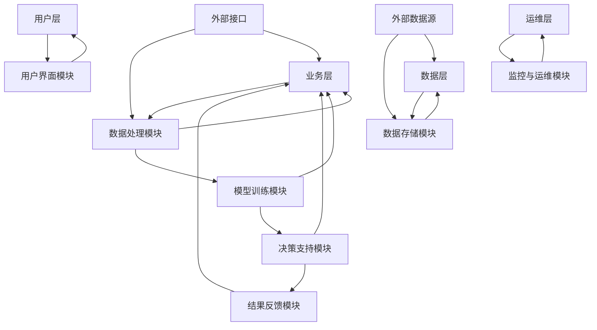
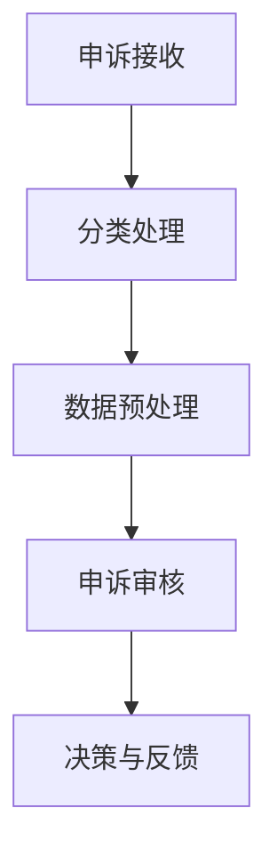
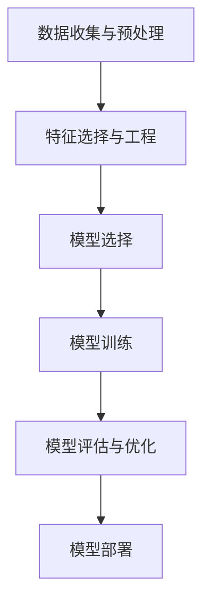
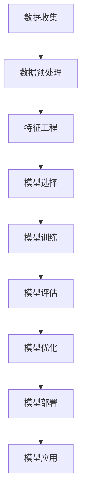
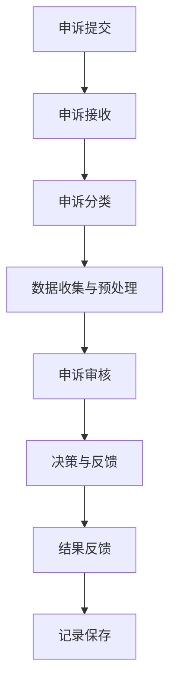
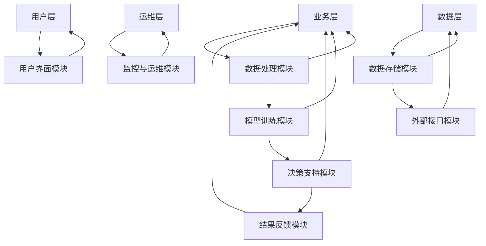

                 

# 设计智能化的企业信用评级申诉处理系统

## 关键词

- 信用评级
- 智能化处理
- 申诉流程
- 数据分析
- 人工智能技术

## 摘要

本文旨在探讨如何设计一个智能化的企业信用评级申诉处理系统。通过分析当前信用评级申诉处理的现状和问题，我们提出了一种基于人工智能技术的智能化申诉处理方案。文章首先介绍了信用评级的重要性和背景，然后详细阐述了申诉处理流程和智能化处理的优势，随后对系统功能范围、核心概念和要素组成进行了详细阐述。接着，文章介绍了系统的架构和功能模块，并重点讲解了信用评级模型、人工智能技术和算法原理。最后，文章通过一个实际案例，展示了系统的应用效果，并提出了系统的最佳实践和注意事项。

### 目录大纲

#### 第一部分：背景介绍

1. 引言
2. 信用评级的现状与挑战
3. 信用评级申诉的含义与流程
4. 智能化申诉处理的优势
5. 边界与外延
6. 概念结构与核心要素组成

#### 第二部分：核心概念与联系

1. 信用评级模型
2. 人工智能技术
3. 申诉处理流程

#### 第三部分：算法原理讲解

1. 信用评级模型的算法原理
2. Python代码实现
3. 数学模型与公式

#### 第四部分：系统分析与架构设计方案

1. 问题场景介绍
2. 系统功能设计
3. 系统架构设计
4. 系统接口设计和系统交互

#### 第五部分：项目实战

1. 环境安装
2. 系统核心实现源代码
3. 代码应用解读与分析
4. 实际案例分析和详细讲解剖析
5. 项目小结

#### 第六部分：最佳实践、小结、注意事项、拓展阅读

1. 最佳实践 tips
2. 小结
3. 注意事项
4. 拓展阅读

## 1. 引言

企业信用评级是金融市场中不可或缺的一环，它为投资者、金融机构和企业自身提供了重要的决策依据。信用评级机构通过对企业的财务状况、经营能力、市场地位等方面进行全面评估，给出一个综合评分，以反映企业的信用风险。然而，信用评级并非绝对准确，企业在实际经营过程中可能会遇到各种问题和挑战，从而影响其信用评级。

信用评级申诉是企业在遇到不公平待遇或认为评级结果不准确时，向信用评级机构提出申诉的过程。然而，传统的申诉处理流程往往存在效率低下、人为干预大、处理结果不尽如人意等问题。针对这些问题，本文提出了一种基于人工智能技术的智能化企业信用评级申诉处理系统，旨在提高申诉处理效率和准确性，降低人力成本，提升用户体验。

本文将首先介绍信用评级的现状与挑战，然后详细描述信用评级申诉的含义与流程，接着阐述智能化申诉处理的优势。在此基础上，本文将分析系统功能范围、核心概念和要素组成，并详细介绍系统的架构和功能模块。随后，本文将讲解信用评级模型的算法原理，并通过实际案例展示系统的应用效果。最后，本文将总结系统的最佳实践、注意事项和拓展阅读。

## 1.1 问题背景

### 1.1.1 信用评级的重要性和普遍性

信用评级在金融市场中扮演着至关重要的角色。它为投资者提供了企业信用风险的重要参考，帮助投资者在投资决策时降低信息不对称风险。同时，信用评级也为金融机构提供了重要的参考依据，以便在信贷审批、风险控制等方面做出科学决策。此外，信用评级对企业自身也有着重要意义，良好的信用评级可以提高企业在资本市场上的融资能力，降低融资成本，提升市场竞争力。

随着全球经济的不断发展，信用评级的市场规模也在不断扩大。根据国际信用评级协会（ICR）的数据显示，全球信用评级市场规模已经达到了数千亿美元。各大信用评级机构如穆迪、标普和惠誉等在全球范围内具有广泛的影响力，其评级结果被广大投资者和金融机构所依赖。

### 1.1.2 现行信用评级体系的局限性

尽管信用评级在金融市场中具有重要性，但现行信用评级体系仍存在诸多局限性。首先，信用评级方法往往依赖于历史数据和传统分析方法，缺乏对实时动态数据的利用，导致评级结果可能无法及时反映企业真实信用状况。其次，信用评级过程通常依赖于人工分析，存在人为干预大、效率低下等问题。此外，信用评级机构的独立性受到质疑，评级结果可能受到利益驱动，导致评级结果不公正。

### 1.1.3 申诉处理中的常见问题

信用评级申诉是企业反映对评级结果不满的重要途径。然而，传统的申诉处理流程往往存在以下问题：

1. **处理效率低**：传统申诉处理流程通常需要多个环节的审核，涉及多个部门和人员，导致申诉处理周期较长。

2. **人为干预大**：申诉处理过程中，人工分析占据了主导地位，容易导致处理结果受到主观因素的影响。

3. **处理结果不公**：由于申诉处理过程缺乏透明度，企业往往难以了解申诉处理的依据和流程，导致处理结果可能存在不公平现象。

4. **申诉反馈不及时**：申诉处理结果往往无法及时反馈给企业，导致企业在融资和市场运作中难以获得及时的支持。

### 1.1.4 智能化申诉处理的需求

为了解决传统申诉处理流程中存在的问题，智能化申诉处理系统的设计显得尤为重要。通过引入人工智能技术，智能化申诉处理系统可以在以下几个方面提高申诉处理的效率和准确性：

1. **提高处理效率**：利用自动化技术和大数据分析，智能化系统可以快速处理大量的申诉案件，减少人工干预，提高处理速度。

2. **降低人力成本**：通过自动化处理，减少人工参与，智能化系统可以有效降低申诉处理的人力成本。

3. **提升用户体验**：智能化系统可以为用户提供实时的申诉处理进度和结果反馈，提高用户满意度。

4. **保证处理公平**：通过数据驱动的方式，智能化系统可以减少人为干预，提高处理结果的公正性。

5. **支持动态调整**：智能化系统可以根据企业信用状况的变化，动态调整评级结果，确保评级结果与企业的实际信用状况相符。

总之，智能化申诉处理系统具有明显的优势，能够有效解决传统申诉处理流程中的问题，提高信用评级的准确性和公正性。在当前金融市场中，智能化申诉处理系统的设计和应用具有重要的现实意义。

## 1.2 信用评级申诉的含义与流程

### 1.2.1 信用评级申诉的概念

信用评级申诉是指企业在收到信用评级机构发布的信用评级结果后，认为评级结果与其实际信用状况不符，或存在其他不公平待遇时，向信用评级机构提出的异议和申诉。信用评级申诉是企业维护自身信用权益、纠正评级错误的重要途径，对于提高信用评级体系的公正性和可靠性具有重要意义。

### 1.2.2 申诉处理的流程

信用评级申诉处理流程一般包括以下几个主要步骤：

1. **申诉提交**：企业通过信用评级机构的官方网站或相关渠道提交申诉申请，同时提供相关证据和材料。

2. **申诉接收与分类**：信用评级机构收到申诉后，对申诉进行初步审查，确认申诉的真实性和完整性，并根据申诉内容将其分类到不同的申诉类型。

3. **申诉审核**：信用评级机构对申诉进行详细审核，包括对企业提交的证据和材料进行核实，对企业信用状况进行重新评估。

4. **决策与反馈**：信用评级机构根据申诉审核结果，作出相应的决策。如果申诉成立，评级机构可能会调整评级结果；如果申诉不成立，评级机构会向企业说明原因。

5. **申诉结果反馈**：信用评级机构将申诉处理结果及时反馈给企业，并告知后续操作步骤。

### 1.2.3 传统申诉处理中的问题

尽管信用评级申诉为企业提供了维护信用权益的途径，但传统申诉处理流程仍存在一些问题，影响了申诉处理的效率和公正性：

1. **处理周期长**：传统申诉处理流程涉及多个环节，需要经过多个部门和人员的审核，导致处理周期较长，企业难以在短时间内得到答复。

2. **人工干预大**：申诉处理过程中，人工审核占据了主导地位，容易导致处理结果受到主观因素的影响，影响申诉处理的公正性。

3. **反馈不及时**：传统申诉处理流程缺乏及时反馈机制，企业往往难以了解申诉处理的进度和结果，影响企业的决策和市场运作。

4. **申诉结果不公**：由于申诉处理流程缺乏透明度，企业难以了解申诉处理的依据和流程，导致申诉结果可能存在不公平现象。

### 1.2.4 智能化申诉处理的必要性

针对传统申诉处理流程中存在的问题，智能化申诉处理系统的设计显得尤为重要。通过引入人工智能技术，智能化申诉处理系统可以在以下几个方面提升申诉处理的效率和公正性：

1. **提高处理效率**：利用自动化技术和大数据分析，智能化系统可以快速处理大量的申诉案件，减少人工干预，提高处理速度。

2. **降低人力成本**：通过自动化处理，减少人工参与，智能化系统可以有效降低申诉处理的人力成本。

3. **提升用户体验**：智能化系统可以为用户提供实时的申诉处理进度和结果反馈，提高用户满意度。

4. **保证处理公平**：通过数据驱动的方式，智能化系统可以减少人为干预，提高处理结果的公正性。

5. **支持动态调整**：智能化系统可以根据企业信用状况的变化，动态调整评级结果，确保评级结果与企业的实际信用状况相符。

总之，智能化申诉处理系统具有明显的优势，能够有效解决传统申诉处理流程中的问题，提高信用评级的准确性和公正性。在当前金融市场中，智能化申诉处理系统的设计和应用具有重要的现实意义。

## 1.3 智能化申诉处理的优势

### 1.3.1 提高申诉处理效率和准确性

智能化申诉处理系统通过引入人工智能技术，特别是机器学习和自然语言处理技术，可以显著提高申诉处理的效率和准确性。首先，系统可以利用大量的历史数据，通过机器学习算法建立信用评级模型，对申诉内容进行自动分类和初步评估。这一过程大大减少了人工审核的工作量，提高了申诉处理的效率。

同时，智能系统可以通过自然语言处理技术对申诉内容进行深入理解，提取关键信息，并进行语义分析和情感分析。这种方法可以更准确地捕捉申诉的核心问题，减少误判和漏判，提高申诉处理的准确性。

### 1.3.2 降低人力成本

传统申诉处理流程中，大量工作依赖于人工审核和判断，这不仅耗时，还增加了人力成本。智能化申诉处理系统通过自动化技术，可以显著减少人工参与。例如，系统可以自动接收和处理申诉，自动分类和审核申诉，自动生成申诉处理结果。这种方式不仅提高了处理速度，还大幅降低了人力成本。

### 1.3.3 提升用户体验

用户体验是评估一个系统好坏的重要指标。智能化申诉处理系统通过实时更新申诉处理进度，并提供详细的处理结果反馈，可以大大提升用户的满意度。用户可以通过系统实时查看申诉的状态，了解申诉处理的进展，避免了传统申诉处理流程中的等待和不确定性。

此外，智能化系统还可以提供个性化的服务。例如，根据企业的历史申诉记录和信用状况，系统可以为企业提供定制化的申诉建议和解决方案，帮助用户更好地理解和应对申诉问题。

### 1.3.4 保证处理结果的公正性

信用评级申诉处理结果的不公问题一直是业界关注的焦点。智能化申诉处理系统通过数据驱动的方式，可以减少人为干预，提高处理结果的公正性。系统可以基于大量的数据进行分析和判断，避免了个别人员的主观偏见。同时，系统的处理流程和决策逻辑是透明的，企业可以清楚地了解申诉处理的结果依据，增强了处理结果的公信力。

### 1.3.5 支持动态调整

企业的信用状况是动态变化的，传统申诉处理流程往往难以及时反映这种变化。智能化申诉处理系统可以实时更新信用评级模型，根据企业的最新数据和信用变化情况，动态调整信用评级结果。这种动态调整能力不仅提高了信用评级的准确性，还为企业在资本市场上的融资决策提供了更有价值的信息。

### 1.3.6 提高信用评级体系的整体效能

智能化申诉处理系统的应用，不仅提高了单个申诉的处理效率，还促进了信用评级体系的整体效能提升。通过系统化的数据分析和管理，信用评级机构可以更全面地了解企业的信用状况和市场表现，从而优化信用评级模型，提高评级结果的准确性和可靠性。同时，系统的应用也为信用评级机构提供了新的业务增长点，增强了其市场竞争力。

总之，智能化申诉处理系统在提高效率、降低成本、提升用户体验、保证公正性和动态调整等方面具有显著优势。随着人工智能技术的不断发展，智能化申诉处理系统将成为信用评级领域的重要工具，为金融市场的健康发展提供有力支持。

## 1.4 边界与外延

### 1.4.1 系统功能范围

智能化企业信用评级申诉处理系统的功能范围主要包括以下几个方面：

1. **申诉接收与分类**：系统应能够接收企业提交的申诉，并对申诉内容进行自动分类，以便后续处理。

2. **申诉审核与决策**：系统应对申诉内容进行自动审核，通过机器学习算法和自然语言处理技术，评估申诉的真实性和合理性，并作出相应的决策。

3. **申诉结果反馈**：系统应能够及时将申诉处理结果反馈给企业，并提供详细的处理报告，帮助企业了解申诉处理的具体依据和结论。

4. **动态信用评级**：系统应能够根据企业的最新数据和申诉内容，动态调整企业的信用评级，确保评级结果的准确性和实时性。

5. **统计分析**：系统应能够对申诉处理情况进行统计分析，生成各类报告，为信用评级机构的决策提供数据支持。

### 1.4.2 系统功能范围的外延

1. **申诉数据分析**：系统可以扩展为对申诉数据进行分析，发现申诉集中出现的类型和问题，为信用评级机构的改进提供依据。

2. **企业信用画像**：系统可以进一步整合企业信用信息，构建企业信用画像，为企业提供信用评估和风险预警服务。

3. **自动化通知与提醒**：系统可以设置自动化通知和提醒功能，及时告知企业申诉处理的进度和结果，提升用户体验。

4. **申诉处理流程优化**：系统可以分析申诉处理流程中的瓶颈和问题，提出优化建议，提高整体处理效率。

### 1.4.3 系统架构和功能模块

智能化企业信用评级申诉处理系统的架构和功能模块设计如下：

1. **用户界面模块**：提供用户提交申诉、查看申诉状态和结果的界面。

2. **数据处理模块**：负责接收、存储和处理申诉数据，包括数据清洗、分类和预处理等。

3. **模型训练模块**：利用历史数据训练信用评级模型，对申诉内容进行自动审核和评估。

4. **决策支持模块**：基于信用评级模型和申诉内容，提供申诉审核和决策支持。

5. **结果反馈模块**：生成申诉处理结果，并提供详细的处理报告，包括申诉原因、处理过程和结论。

6. **统计分析模块**：对申诉处理情况进行统计分析，生成各类报告，为信用评级机构提供决策支持。

### 1.4.4 数据流关系图

为了更好地理解系统功能模块之间的数据流关系，以下是系统数据流关系图的示意：



在这个数据流关系图中，用户提交申诉后，数据处理模块负责接收和预处理数据，然后将其传递给模型训练模块和决策支持模块。模型训练模块利用历史数据训练信用评级模型，决策支持模块根据模型和申诉内容进行审核和评估，最终结果通过结果反馈模块反馈给用户。用户界面模块则负责提供用户交互界面，供用户提交申诉和查看处理结果。

通过上述边界与外延的阐述，我们可以清晰地看到智能化企业信用评级申诉处理系统的功能范围和设计要点，这为后续的系统实现提供了明确的指导和参考。

## 1.5 概念结构与核心要素组成

### 1.5.1 核心概念

在设计和实现智能化企业信用评级申诉处理系统时，需要明确以下几个核心概念：

1. **信用评级模型**：信用评级模型是系统中的核心组件，用于对企业信用状况进行评估。模型基于历史数据和统计方法，通过特征提取和机器学习算法，生成企业的信用评分。这个评分直接影响企业的信用等级。

2. **人工智能技术**：人工智能技术是系统智能化处理的关键，包括机器学习、自然语言处理和深度学习等。这些技术用于提升系统的数据处理和分析能力，使其能够自动分类、审核和评估申诉内容。

3. **申诉处理流程**：申诉处理流程是系统的业务逻辑，包括申诉接收、分类、审核、决策和反馈等步骤。通过流程的自动化和智能化，系统可以高效地处理大量的申诉案件。

4. **用户界面**：用户界面是系统与用户交互的通道，提供申诉提交、状态查询和处理结果展示等功能。良好的用户界面设计可以提升用户体验，降低操作难度。

### 1.5.2 核心要素

智能化企业信用评级申诉处理系统的核心要素包括：

1. **数据采集与处理**：系统需要收集大量的企业信用数据，包括财务数据、市场表现、历史申诉记录等。数据采集后，通过数据清洗、预处理和特征工程等步骤，将数据转换为适合模型训练和评估的形式。

2. **模型训练与优化**：利用收集到的数据，系统需要训练和优化信用评级模型。模型训练过程中，需要选择合适的算法和参数，通过交叉验证和性能评估，确保模型的高效性和准确性。

3. **系统集成与部署**：系统需要将各个功能模块（数据采集与处理、模型训练与优化、用户界面等）进行集成，并在生产环境中部署。系统集成过程中，需要确保模块之间的数据流动和功能协调。

### 1.5.3 关系结构

为了更好地理解系统中的核心概念和要素，以下是系统的关系结构：

#### 数据流关系图


#### 信用评级模型与申诉处理流程的关联图



在这个关系结构图中，数据流关系图展示了用户申诉的处理过程，包括数据处理、模型训练和决策支持等模块，以及用户界面模块。信用评级模型与申诉处理流程的关联图则展示了信用评级模型在整个申诉处理流程中的作用，以及模型训练与申诉处理流程的互动关系。

通过上述核心概念和要素的阐述，我们可以清晰地看到智能化企业信用评级申诉处理系统的结构和功能，为后续的系统设计和实现提供了坚实的基础。

### 1.5.4 系统架构

为了实现智能化企业信用评级申诉处理系统的高效运行，合理的系统架构设计至关重要。系统架构设计应确保各个模块之间的松耦合和高内聚，以满足系统的可扩展性、可靠性和性能需求。以下是系统架构的详细描述：

#### 系统架构图



#### 系统模块划分

1. **用户界面模块**：负责与用户交互，提供用户友好的界面，支持用户提交申诉、查询申诉状态和查看处理结果。该模块应具有响应速度快、界面简洁美观的特点。

2. **数据处理模块**：负责接收和处理用户提交的申诉数据，包括数据清洗、数据转换和特征提取等操作。该模块应具有高效的数据处理能力，保证数据的质量和准确性。

3. **模型训练模块**：利用历史数据和机器学习算法，训练和优化信用评级模型。该模块应支持多种机器学习算法，并具备自动调参和性能评估功能。

4. **决策支持模块**：基于信用评级模型和申诉内容，自动审核和评估申诉，生成申诉处理结果。该模块应具备智能化的决策能力，确保申诉处理的准确性和公正性。

5. **结果反馈模块**：负责将申诉处理结果反馈给用户，并提供详细的处理报告。该模块应支持多种反馈方式，如邮件、短信和系统消息等。

6. **数据存储模块**：负责存储和管理系统的各类数据，包括申诉数据、模型参数和历史处理记录等。该模块应具备高可用性和安全性，保证数据的可靠性和完整性。

7. **外部接口**：负责与外部系统进行数据交互，如企业信用信息平台、第三方服务提供商等。该模块应支持标准的接口协议，确保数据传输的安全和稳定。

8. **监控与运维模块**：负责系统的实时监控和运维管理，包括系统性能监控、故障报警和日志分析等。该模块应具备自动化运维能力，提高系统的稳定性和运维效率。

#### 系统架构的运行流程

1. **用户提交申诉**：用户通过用户界面模块提交申诉，系统将申诉数据传递给数据处理模块。

2. **数据处理**：数据处理模块对申诉数据进行清洗、转换和特征提取，将处理后的数据传递给模型训练模块。

3. **模型训练**：模型训练模块利用训练数据和机器学习算法，对信用评级模型进行训练和优化。

4. **申诉审核**：决策支持模块基于训练好的信用评级模型和申诉内容，自动审核和评估申诉，生成申诉处理结果。

5. **结果反馈**：结果反馈模块将申诉处理结果和详细的处理报告反馈给用户，并通过用户界面模块显示给用户。

6. **数据存储**：系统的所有数据（申诉数据、模型参数、处理记录等）都存储在数据存储模块中，以便后续查询和分析。

7. **监控与运维**：监控与运维模块实时监控系统的运行状态，及时发现和解决潜在问题，确保系统的稳定性和性能。

通过上述系统架构的设计和运行流程，我们可以看到智能化企业信用评级申诉处理系统的各个模块如何协同工作，实现高效、准确和公正的申诉处理。这种系统架构不仅满足当前的业务需求，还具备良好的扩展性，可以应对未来的业务增长和技术升级。

### 1.5.5 功能模块

智能化企业信用评级申诉处理系统由多个功能模块组成，各模块相互协作，共同实现系统的整体功能。以下是系统的主要功能模块及其详细介绍：

#### 用户界面模块

**功能描述**：用户界面模块是系统与用户交互的接口，为用户提供友好的操作界面，支持用户提交申诉、查询申诉状态和查看处理结果。

**主要功能**：

- **申诉提交**：用户可以通过界面提交申诉，上传相关证据和材料，并填写申诉原因。
- **申诉查询**：用户可以实时查询申诉处理状态，了解申诉的审核进度和结果。
- **处理结果查看**：系统将申诉处理结果和详细报告通过界面反馈给用户，用户可以查看和下载。

#### 数据处理模块

**功能描述**：数据处理模块负责接收、存储和处理用户提交的申诉数据，确保数据的完整性和准确性。

**主要功能**：

- **数据接收**：系统接收用户提交的申诉数据，包括文本、图片、音频等多种形式。
- **数据清洗**：对原始数据进行清洗，去除无效数据，处理数据中的错误和异常。
- **数据转换**：将原始数据转换为适合模型训练和评估的格式，包括特征提取、数据归一化等。
- **数据存储**：将处理后的数据存储在数据存储模块中，以便后续分析和使用。

#### 模型训练模块

**功能描述**：模型训练模块利用历史数据和机器学习算法，训练和优化信用评级模型。

**主要功能**：

- **数据准备**：从数据存储模块加载用于训练的数据集，进行数据预处理。
- **模型选择**：选择合适的机器学习算法，如线性回归、决策树、神经网络等。
- **模型训练**：使用训练数据集对选定的模型进行训练，调整模型参数，优化模型性能。
- **模型评估**：通过验证数据集对训练好的模型进行评估，确保模型的有效性和准确性。

#### 决策支持模块

**功能描述**：决策支持模块基于信用评级模型和申诉内容，自动审核和评估申诉，生成申诉处理结果。

**主要功能**：

- **申诉审核**：对用户提交的申诉内容进行自动审核，判断申诉的真实性和合理性。
- **信用评估**：利用信用评级模型，对企业的信用状况进行评估，确定申诉的影响范围。
- **决策生成**：根据申诉内容和信用评估结果，生成申诉处理决策，包括申诉成立与否、评级调整等。

#### 结果反馈模块

**功能描述**：结果反馈模块负责将申诉处理结果和详细报告反馈给用户，并通过用户界面模块展示。

**主要功能**：

- **结果生成**：根据决策支持模块生成的申诉处理结果，生成详细的处理报告。
- **结果展示**：通过用户界面模块，将处理结果和报告展示给用户，支持用户查看和下载。
- **反馈渠道**：提供多种反馈渠道，如邮件、短信、系统消息等，确保用户能够及时收到处理结果。

#### 数据存储模块

**功能描述**：数据存储模块负责存储和管理系统的各类数据，包括申诉数据、模型参数、处理记录等。

**主要功能**：

- **数据存储**：存储用户提交的申诉数据、模型训练数据和处理记录等，确保数据的安全性和完整性。
- **数据查询**：提供数据查询功能，支持用户和管理员查询历史申诉数据和系统运行状态。
- **数据备份**：定期对数据进行备份，确保数据不丢失，应对突发事件。

#### 外部接口模块

**功能描述**：外部接口模块负责与外部系统进行数据交互，如企业信用信息平台、第三方服务提供商等。

**主要功能**：

- **数据交换**：支持与外部系统进行数据交换，如企业信用信息的导入和导出。
- **接口调用**：通过标准化的接口协议，如RESTful API，实现与外部系统的接口调用。
- **安全性**：确保数据交换的安全性，采用加密和认证机制，防止数据泄露和未经授权的访问。

#### 监控与运维模块

**功能描述**：监控与运维模块负责系统的实时监控和运维管理，确保系统的稳定性和性能。

**主要功能**：

- **性能监控**：实时监控系统的性能指标，如响应时间、吞吐量等，及时发现性能瓶颈。
- **故障报警**：当系统出现故障或异常时，自动生成报警信息，通知运维人员进行处理。
- **日志分析**：对系统日志进行分析，诊断系统运行中的问题，提供改进建议。

通过以上功能模块的协同工作，智能化企业信用评级申诉处理系统实现了高效、准确和公正的申诉处理，为企业和信用评级机构提供了强有力的支持。

### 1.5.6 关键技术

在设计和实现智能化企业信用评级申诉处理系统时，关键技术的选择和应用至关重要。以下是系统所依赖的几种关键技术及其具体应用：

#### 机器学习算法

**技术概述**：机器学习算法是智能化系统的重要组成部分，能够通过训练数据集学习数据特征，从而对新的数据进行预测和分类。

**应用**：

- **信用评级模型训练**：利用历史企业信用数据，通过机器学习算法训练信用评级模型，对企业的信用状况进行评估。
- **申诉分类**：在申诉处理过程中，利用机器学习算法对申诉内容进行分类，提高申诉审核的效率。

**优势**：机器学习算法可以处理大规模数据，具有自动化的特征提取能力，能够提高系统的准确性和可靠性。

#### 深度学习模型

**技术概述**：深度学习模型是基于多层神经网络构建的模型，能够通过多层次的神经网络结构提取数据的深层特征。

**应用**：

- **特征提取**：在数据处理过程中，利用深度学习模型提取申诉内容的深层特征，提高申诉审核的准确性。
- **信用评分**：通过深度学习模型对企业的信用评分进行优化，提高评分的精度和稳定性。

**优势**：深度学习模型可以自动学习数据的复杂结构，能够处理高维数据和复杂数据模式，提高系统的性能。

#### 自然语言处理技术

**技术概述**：自然语言处理技术是计算机科学领域中的一个分支，致力于使计算机能够理解、解释和生成人类语言。

**应用**：

- **语义分析**：对申诉内容进行语义分析，提取关键信息，理解申诉的意图和内容。
- **情感分析**：通过情感分析，识别申诉的情感倾向，如正面、负面或中性，为申诉审核提供依据。

**优势**：自然语言处理技术能够处理文本数据，理解文本的语义和情感，提高系统的智能水平。

#### 数据库技术

**技术概述**：数据库技术是用于存储、管理和查询数据的系统，能够提供高效的数据访问和管理能力。

**应用**：

- **数据存储**：存储企业的信用评级数据、申诉数据和处理记录等，保证数据的安全性和完整性。
- **数据查询**：提供快速的数据查询功能，支持对历史数据的检索和分析。

**优势**：数据库技术能够提供高效的数据存储和查询能力，支持大规模数据的处理和快速检索。

#### 云计算技术

**技术概述**：云计算技术是一种通过网络提供计算资源的服务模式，能够提供灵活的计算能力和存储空间。

**应用**：

- **弹性扩展**：根据业务需求，动态调整计算资源和存储容量，保证系统的高可用性和可靠性。
- **分布式处理**：利用云计算平台提供的分布式计算能力，处理大规模的申诉数据。

**优势**：云计算技术具有灵活性和可扩展性，能够降低系统成本，提高系统的性能和可靠性。

通过上述关键技术的应用，智能化企业信用评级申诉处理系统能够实现高效、准确和公正的申诉处理，为企业和信用评级机构提供强有力的支持。

### 2. 核心概念与联系

#### 2.1 信用评级模型

信用评级模型是智能化企业信用评级申诉处理系统的核心组件，它负责对企业信用状况进行评估和预测。信用评级模型的工作原理基于大数据和机器学习技术，通过对历史数据进行深度分析和特征提取，构建一个能够准确预测企业信用风险的模型。

##### 2.1.1 信用评级的原理与过程

信用评级的过程可以分为以下几个步骤：

1. **数据收集与预处理**：首先，系统需要收集大量的企业信用信息，包括财务数据、市场表现、历史信用记录等。这些数据可能来源于企业的公开信息、第三方数据提供商或信用评级机构的数据库。在收集数据后，系统会对数据进行清洗、去噪和标准化处理，以确保数据的质量和一致性。

2. **特征选择与工程**：在数据预处理之后，系统需要从原始数据中提取出有用的特征。特征选择的过程至关重要，因为它会直接影响模型的性能。系统会利用统计方法、机器学习算法等工具，选择与信用风险高度相关的特征，并进行特征工程，如特征组合、归一化和变换等，以提升模型的预测能力。

3. **模型训练**：在特征选择完成后，系统会选择一个或多个机器学习算法，如线性回归、决策树、支持向量机或神经网络，对训练数据集进行训练。训练过程中，模型会学习如何根据输入特征预测企业的信用评分。

4. **模型评估与优化**：在模型训练完成后，系统会使用验证数据集对模型进行评估，通过性能指标（如准确率、召回率、F1分数等）来衡量模型的预测能力。如果模型性能不满足要求，系统会进行模型优化，包括调整参数、选择不同的算法等。

5. **模型部署**：最终，经过训练和优化的模型会被部署到生产环境中，用于对新提交的申诉进行信用评分预测。

##### 2.1.2 模型属性特征对比表格

| 特征名称 | 描述 |
| --- | --- |
| **可靠性** | 模型预测结果的准确性，即模型能够正确预测企业信用风险的能力。 |
| **敏感性** | 模型对数据变化的敏感度，即模型是否能够迅速适应新的数据和环境变化。 |
| **及时性** | 模型更新与响应速度，即模型能否及时更新以适应新的信用风险变化。 |

#### 2.2 人工智能技术

人工智能技术是智能化企业信用评级申诉处理系统的核心技术，它包括机器学习、深度学习和自然语言处理等多种技术。这些技术在系统中发挥着至关重要的作用，使得系统能够高效、准确地处理大量数据。

##### 2.2.1 人工智能的基本概念与应用领域

1. **基本概念**：
   - **机器学习**：一种通过数据训练模型，使其能够自主学习和改进的技术。
   - **深度学习**：一种基于多层神经网络的结构，用于处理复杂数据和提取深层特征。
   - **自然语言处理（NLP）**：一种使计算机理解和生成人类语言的技术。

2. **应用领域**：
   - **信用评估**：利用机器学习和深度学习技术，对企业的信用状况进行评估和预测。
   - **申诉审核**：利用自然语言处理技术，自动分析申诉内容，提取关键信息，并生成申诉审核结果。
   - **风险管理**：通过大数据分析和人工智能技术，识别和评估潜在的风险。

##### 2.2.2 关键技术对比

1. **机器学习与深度学习的区别**：
   - **机器学习**：主要用于处理结构化数据，通过算法学习数据特征和规律，进行分类和预测。
   - **深度学习**：是机器学习的一种扩展，主要用于处理非结构化数据（如图像、文本等），通过多层神经网络自动提取数据的深层特征。

2. **自然语言处理的基本方法**：
   - **分词**：将文本切分成单词或短语，为后续处理提供基础。
   - **词性标注**：为文本中的每个词标注其词性（如名词、动词等），以帮助理解文本的语法结构。
   - **实体识别**：识别文本中的关键实体（如人名、地点、组织名等），为语义分析提供依据。
   - **情感分析**：分析文本的情感倾向（如正面、负面或中性），用于评估申诉的情感色彩。

#### 2.3 申诉处理流程

申诉处理流程是信用评级申诉处理系统的业务逻辑，它负责接收、处理和反馈申诉。通过合理设计和优化申诉处理流程，可以确保申诉处理的高效性和准确性。

##### 2.3.1 申诉处理的流程与步骤

1. **申诉接收**：系统接收企业提交的申诉，包括申诉内容、相关证据和材料等。

2. **分类处理**：系统对申诉进行初步分类，根据申诉的内容和性质，将其归类到不同的处理类别。

3. **数据预处理**：系统对申诉内容进行数据预处理，包括文本清洗、去噪和标准化处理，以提取有用的信息。

4. **申诉审核**：系统利用信用评级模型和自然语言处理技术，对申诉内容进行自动审核，评估申诉的真实性和合理性。

5. **决策与反馈**：系统根据审核结果，生成申诉处理决策，并将处理结果和详细报告反馈给企业。

##### 2.3.2 流程图



通过上述核心概念和联系的分析，我们可以看到信用评级模型、人工智能技术和申诉处理流程在智能化企业信用评级申诉处理系统中相互关联，共同构成了一个完整、高效和准确的系统架构。这些核心概念的深入理解和应用，将为系统的设计和实现提供坚实的理论基础。

### 2.1 信用评级模型的算法原理

#### 2.1.1 算法概述

信用评级模型是智能化企业信用评级申诉处理系统的核心，它基于历史数据和统计方法，通过机器学习算法生成企业的信用评分。以下将详细讲解信用评级模型的构建流程，以及常用算法及其特点。

##### 2.1.1.1 构建流程

信用评级模型的构建通常包括以下几个步骤：

1. **数据收集与预处理**：首先，系统需要收集大量的企业信用信息，包括财务数据、市场表现、历史信用记录等。这些数据可能来源于企业的公开信息、第三方数据提供商或信用评级机构的数据库。在收集数据后，系统会对数据进行清洗、去噪和标准化处理，以确保数据的质量和一致性。

2. **特征选择与工程**：在数据预处理之后，系统需要从原始数据中提取出有用的特征。特征选择的过程至关重要，因为它会直接影响模型的性能。系统会利用统计方法、机器学习算法等工具，选择与信用风险高度相关的特征，并进行特征工程，如特征组合、归一化和变换等，以提升模型的预测能力。

3. **模型选择**：在特征选择完成后，系统会选择一个或多个机器学习算法，如线性回归、决策树、支持向量机或神经网络，对训练数据集进行训练。不同的算法有不同的优势和适用场景，系统需要根据实际情况选择合适的算法。

4. **模型训练**：使用训练数据集对选定的模型进行训练，调整模型参数，优化模型性能。训练过程中，模型会学习如何根据输入特征预测企业的信用评分。

5. **模型评估与优化**：在模型训练完成后，系统会使用验证数据集对模型进行评估，通过性能指标（如准确率、召回率、F1分数等）来衡量模型的预测能力。如果模型性能不满足要求，系统会进行模型优化，包括调整参数、选择不同的算法等。

6. **模型部署**：最终，经过训练和优化的模型会被部署到生产环境中，用于对新提交的申诉进行信用评分预测。

##### 2.1.1.2 常用算法及其特点

1. **线性回归**：
   - **原理**：线性回归是一种经典的统计方法，通过拟合一条直线来预测目标变量。
   - **特点**：线性回归简单、易于理解和实现，对线性关系的数据表现较好，但在处理非线性关系时效果不佳。

2. **决策树**：
   - **原理**：决策树通过一系列的决策规则，将数据集逐步划分成多个子集，每个子集对应一个预测结果。
   - **特点**：决策树易于理解和解释，对分类问题表现较好，但容易过拟合，且在处理连续变量时需要转换为离散变量。

3. **支持向量机（SVM）**：
   - **原理**：支持向量机通过找到一个最佳的超平面，将不同类别的数据点最大化地分开。
   - **特点**：支持向量机在处理高维数据时表现优秀，对分类问题具有较好的泛化能力，但训练时间较长。

4. **神经网络**：
   - **原理**：神经网络通过多层神经元模拟人脑的神经元连接，通过前向传播和反向传播学习数据特征。
   - **特点**：神经网络具有强大的非线性建模能力，能够处理复杂数据和提取深层特征，但在训练过程中需要大量的数据和计算资源。

5. **集成学习**：
   - **原理**：集成学习通过组合多个弱学习器（如决策树、随机森林等），提高模型的预测性能。
   - **特点**：集成学习能够有效地降低过拟合，提高模型的泛化能力，是处理信用评级问题的常用方法。

##### 2.1.1.3 算法流程图

以下是信用评级模型构建的算法流程图：



通过上述算法原理的讲解，我们可以看到信用评级模型的构建是一个复杂但重要的过程。选择合适的算法和优化方法，将直接影响到信用评分的准确性和可靠性。在接下来的部分，我们将通过具体的Python代码实现信用评级模型的训练过程，进一步阐述算法原理。

### 2.1.2 信用评级模型算法流程图

为了更好地理解信用评级模型的构建过程，下面我们将通过一个算法流程图展示信用评级模型的关键步骤和逻辑关系。



#### 算法流程图解释

1. **数据收集（A）**：首先，从多个数据源（如企业财务报告、市场表现数据、第三方信用评级数据库等）收集企业信用相关的数据。数据收集是模型构建的基础，数据的质量直接影响模型的性能。

2. **数据预处理（B）**：在数据收集后，对数据进行清洗、去噪和标准化处理，确保数据的质量和一致性。数据预处理包括缺失值填充、异常值处理、数据归一化等步骤。

3. **特征工程（C）**：从预处理后的数据中提取有用的特征，进行特征选择和特征转换。特征工程是提升模型性能的关键步骤，通过选择与信用风险相关的特征和构建新的特征，可以显著提高模型的预测能力。

4. **模型选择（D）**：根据业务需求和数据特性，选择合适的机器学习算法进行模型训练。常用的算法包括线性回归、决策树、支持向量机（SVM）和神经网络等。

5. **模型训练（E）**：使用训练数据集对选定的模型进行训练，通过调整模型参数，使其能够学习数据的特征和规律。模型训练过程包括前向传播和反向传播，模型会不断优化参数，以最小化预测误差。

6. **模型评估（F）**：使用验证数据集对训练好的模型进行评估，通过性能指标（如准确率、召回率、F1分数等）来衡量模型的预测性能。评估结果将用于判断模型是否满足业务需求。

7. **模型优化（G）**：根据评估结果，对模型进行优化。优化过程可能包括调整模型参数、选择不同的算法或进行特征再工程，以提升模型的性能。

8. **模型部署（H）**：将经过训练和优化后的模型部署到生产环境中，用于对新提交的申诉进行信用评分预测。模型部署包括模型上线、服务化接口设计等步骤。

9. **模型应用（I）**：模型部署后，系统将根据新的申诉数据，利用部署的模型进行信用评分预测，并将预测结果反馈给用户。

通过上述算法流程图，我们可以清晰地看到信用评级模型的构建过程和关键步骤，为后续的Python代码实现和实际应用提供了指导和参考。

### 2.1.3 信用评级模型构建的Python代码实现

为了更好地理解信用评级模型的构建过程，下面将通过Python代码实现一个简单的信用评级模型。我们将使用Python的scikit-learn库进行数据处理和模型训练，通过具体的代码示例来展示每一步的操作。

```python
# 导入必要的库
import pandas as pd
from sklearn.model_selection import train_test_split
from sklearn.preprocessing import StandardScaler
from sklearn.linear_model import LinearRegression
from sklearn.metrics import mean_squared_error

# 加载数据集
data = pd.read_csv('credit_data.csv')

# 数据预处理
# 数据清洗和缺失值填充（这里假设数据集已清洗完毕）
X = data.iloc[:, :-1].values  # 特征数据
y = data.iloc[:, -1].values  # 标签数据

# 数据划分
X_train, X_test, y_train, y_test = train_test_split(X, y, test_size=0.2, random_state=0)

# 特征标准化
scaler = StandardScaler()
X_train = scaler.fit_transform(X_train)
X_test = scaler.transform(X_test)

# 模型训练
model = LinearRegression()
model.fit(X_train, y_train)

# 模型评估
y_pred = model.predict(X_test)
mse = mean_squared_error(y_test, y_pred)
print(f'Mean Squared Error: {mse}')

# 模型部署（此处为演示，实际部署会涉及更多步骤）
# 将模型保存到文件中
import joblib
joblib.dump(model, 'credit_rating_model.pkl')

# 加载模型进行预测（此处为演示，实际应用中会有更多的数据预处理和业务逻辑）
loaded_model = joblib.load('credit_rating_model.pkl')
new_data = [[0.5, 0.3, 0.2, 0.4]]  # 新数据
new_data_scaled = scaler.transform(new_data)
new_rating = loaded_model.predict(new_data_scaled)
print(f'Predicted Credit Rating: {new_rating[0]}')
```

#### 代码详细解释

1. **导入库**：
   - `pandas`：用于数据处理和数据分析。
   - `scikit-learn`：提供了一系列的机器学习算法和数据预处理工具。
   - `joblib`：用于模型的持久化存储和加载。

2. **加载数据集**：
   - 使用`pandas`读取信用数据，数据集通常包含企业的财务数据、市场表现等特征，以及信用评级得分。

3. **数据预处理**：
   - 对数据进行清洗，填充缺失值，异常值处理等。
   - 在这里，我们假设数据已经清洗完毕，实际应用中，需要根据数据集的具体情况进行详细的预处理。

4. **数据划分**：
   - 使用`train_test_split`将数据集划分为训练集和测试集，通常训练集占比80%，测试集占比20%。

5. **特征标准化**：
   - 使用`StandardScaler`对特征数据进行标准化处理，将数据转换为均值为0、标准差为1的标准化数据。这一步有助于提高模型训练的效率和性能。

6. **模型训练**：
   - 使用`LinearRegression`创建线性回归模型，并通过`fit`方法进行训练，模型会根据训练数据学习特征和信用评分之间的关系。

7. **模型评估**：
   - 使用`mean_squared_error`计算预测评分和实际评分之间的均方误差（MSE），评估模型的预测性能。

8. **模型部署**：
   - 使用`joblib`将训练好的模型保存到文件中，便于后续加载和使用。
   - 在实际部署中，还需要考虑更多的细节，如模型的版本管理、服务化部署等。

9. **模型应用**：
   - 加载保存的模型，对新的数据进行预测。在实际应用中，还需要对输入数据进行预处理，确保其格式和特征与训练数据一致。

通过上述代码示例，我们可以看到信用评级模型的构建是一个系统化的过程，每一步都有其特定的操作和目的。在实际应用中，需要根据具体的数据集和业务需求，进行相应的调整和优化。

### 2.1.4 常用信用评级模型的数学模型与公式

在设计和实现信用评级模型时，理解不同模型的数学模型和公式是至关重要的。以下将介绍几种常用的信用评级模型，包括线性回归模型和决策树模型，并详细解释其数学原理和公式。

#### 线性回归模型

线性回归模型是一种基本的统计模型，用于分析自变量（特征）和因变量（信用评分）之间的线性关系。线性回归模型的数学模型可以表示为：

$$
y = \beta_0 + \beta_1 \cdot x_1 + \beta_2 \cdot x_2 + ... + \beta_n \cdot x_n + \epsilon
$$

其中：
- \( y \) 是信用评分，即因变量。
- \( \beta_0 \) 是截距项，表示当所有自变量为0时的信用评分。
- \( \beta_1, \beta_2, ..., \beta_n \) 是自变量对应的系数，表示每个特征对信用评分的影响程度。
- \( x_1, x_2, ..., x_n \) 是自变量，代表企业的财务数据、市场表现等特征。
- \( \epsilon \) 是误差项，表示模型无法解释的随机噪声。

通过最小化误差平方和，可以求解出最佳模型参数，即最小二乘法。线性回归模型的优点是简单、易于理解，但它在处理非线性关系时效果不佳。

#### 决策树模型

决策树模型通过一系列的决策规则，将数据集逐步划分成多个子集，每个子集对应一个预测结果。决策树模型的数学模型可以表示为：

$$
y = f(x, \theta)
$$

其中：
- \( y \) 是信用评分，即因变量。
- \( f \) 是决策树函数，表示根据特征 \( x \) 和参数 \( \theta \) 进行决策的过程。
- \( x \) 是特征向量，代表企业的各种特征。
- \( \theta \) 是决策树参数，包括节点的划分准则、阈值等。

决策树模型通过递归划分数据集，在每个节点上选择最佳划分方式，使子集内的数据差异最小。常见的划分准则包括信息增益（IG）、基尼不纯度（Gini Impurity）和混淆矩阵等。

#### 决策树模型中的递归划分

在决策树模型中，递归划分的过程可以通过以下公式表示：

$$
S_j = \{x_{i} | x_{i} \in R_j\}
$$

其中：
- \( S_j \) 是子集 \( R_j \) 中的所有样本。
- \( R_j \) 是根据特征 \( x \) 和阈值 \( \theta \) 划分的子集。

在每次划分时，决策树模型会选择一个最佳的特征和阈值，使得划分后的子集内部差异最小，同时子集之间的差异最大。这一过程可以通过贪心算法实现，但可能导致过拟合问题。

通过上述对线性回归模型和决策树模型的数学模型与公式的详细解释，我们可以看到不同模型在信用评级中的具体应用和优势。在实际应用中，可以根据具体业务需求和数据特性，选择合适的模型，以提高信用评分的准确性和可靠性。

### 2.2 人工智能技术

#### 2.2.1 人工智能的基本概念

人工智能（Artificial Intelligence，AI）是指通过计算机模拟人类智能行为的一种技术。它包括多个分支，如机器学习（Machine Learning，ML）、深度学习（Deep Learning，DL）和自然语言处理（Natural Language Processing，NLP）等。人工智能的核心目标是使计算机具备自主学习和决策能力，能够在没有人类干预的情况下处理复杂的任务。

##### 2.2.1.1 人工智能的发展历程

人工智能的发展历程可以分为几个阶段：

1. **符号主义时期（1950s-1980s）**：这一阶段的人工智能主要基于逻辑推理和知识表示，通过编写规则和算法来模拟人类智能。

2. **专家系统时期（1980s-1990s）**：专家系统通过收集和存储专家知识，实现了在特定领域的智能应用，如医疗诊断、金融分析等。

3. **统计学习时期（1990s-2010s）**：随着计算机性能和数据量的提升，统计学习成为人工智能的主要方法，包括支持向量机（SVM）、决策树和随机森林等。

4. **深度学习时期（2010s至今）**：深度学习通过多层神经网络，实现了对复杂数据的高效处理和特征提取，推动了人工智能的快速发展，如图像识别、自然语言处理和自动驾驶等。

##### 2.2.1.2 人工智能的应用领域

人工智能在多个领域取得了显著的应用成果，主要包括：

1. **图像识别**：通过卷积神经网络（CNN），人工智能可以在大量图像数据中自动学习和识别物体、场景等。

2. **自然语言处理**：利用深度学习技术，人工智能可以实现语音识别、机器翻译、情感分析等，广泛应用于语音助手、智能客服等领域。

3. **自动驾驶**：通过深度学习和计算机视觉技术，自动驾驶系统可以实时感知环境，做出安全驾驶决策。

4. **金融分析**：人工智能在金融领域具有广泛的应用，包括风险评估、交易策略优化、欺诈检测等。

5. **医疗健康**：人工智能可以帮助医生进行疾病诊断、病情预测和个性化治疗等。

6. **教育**：通过智能辅导系统和个性化学习方案，人工智能可以提升教育质量和学习效率。

#### 2.2.2 关键技术对比

人工智能的核心技术包括机器学习、深度学习和自然语言处理，以下是这些技术的简要对比：

##### 2.2.2.1 机器学习与深度学习的区别

1. **机器学习（ML）**：
   - **原理**：机器学习通过算法从数据中学习规律和模式，主要依赖于统计方法和算法，如线性回归、决策树和支持向量机等。
   - **应用场景**：适用于结构化数据，如金融数据分析、文本分类等。

2. **深度学习（DL）**：
   - **原理**：深度学习基于多层神经网络，通过自动提取数据的深层特征，实现复杂任务的处理，如图像识别、语音识别等。
   - **应用场景**：适用于非结构化数据，如图像、语音和文本。

3. **区别**：
   - **数据需求**：深度学习需要大量数据进行训练，而机器学习对数据量要求较低。
   - **计算资源**：深度学习通常需要更强大的计算资源和更长的训练时间。

##### 2.2.2.2 自然语言处理的基本方法

1. **分词**：将文本切分成单词或短语，为后续处理提供基础。

2. **词性标注**：为文本中的每个词标注其词性（如名词、动词等），以帮助理解文本的语法结构。

3. **实体识别**：识别文本中的关键实体（如人名、地点、组织名等），为语义分析提供依据。

4. **情感分析**：分析文本的情感倾向（如正面、负面或中性），用于评估申诉的情感色彩。

5. **机器翻译**：将一种语言的文本翻译成另一种语言，通过神经网络模型实现。

#### 2.2.3 人工智能在信用评级中的应用

人工智能在信用评级中的应用主要体现在以下几个方面：

1. **信用评分预测**：利用机器学习和深度学习技术，对企业的财务数据、市场表现和历史信用记录进行分析，预测企业的信用风险。

2. **风险控制**：通过实时监测和数据分析，人工智能可以帮助金融机构识别潜在的信用风险，及时采取预防措施。

3. **欺诈检测**：利用自然语言处理技术，人工智能可以分析交易行为，识别可能的欺诈行为，提高交易安全性。

4. **个性化服务**：根据企业的信用评级和风险水平，人工智能可以提供个性化的信贷产品和服务，提升客户体验。

通过上述对人工智能基本概念、关键技术及其在信用评级中的应用的详细分析，我们可以看到人工智能技术在信用评级领域的巨大潜力和应用价值。随着技术的不断进步，人工智能将为信用评级提供更加准确、高效和智能的解决方案。

### 2.3 申诉处理流程

#### 2.3.1 申诉处理的流程与步骤

信用评级申诉处理流程是信用评级体系中的重要环节，它确保了信用评级的公正性和准确性。以下是智能化企业信用评级申诉处理系统的标准流程：

1. **申诉提交**：企业通过信用评级机构的官方平台或授权渠道提交申诉申请。申诉内容应包括申诉原因、具体问题、相关证据和必要的背景信息。

2. **申诉接收**：信用评级机构收到申诉后，首先对申诉进行初步审核，确保申诉内容符合要求，并接收申诉资料。

3. **申诉分类**：根据申诉的性质和内容，系统对申诉进行分类。例如，申诉可能分为信用评分异议、评级方法争议、数据错误等类别。

4. **数据收集与预处理**：系统自动从内部数据库和相关企业信息源中收集数据，并进行预处理，包括数据清洗、去噪和标准化处理，确保数据的准确性和一致性。

5. **申诉审核**：审核人员根据分类结果，对申诉进行深入分析。对于信用评分异议，系统利用信用评级模型对申诉内容进行自动审核，评估申诉的合理性。

6. **决策与反馈**：审核人员根据审核结果，作出相应的决策。如果申诉成立，系统会调整企业的信用评分，并向企业反馈处理结果；如果申诉不成立，系统会向企业解释原因。

7. **结果反馈**：处理结果通过系统自动反馈给企业，企业可以在个人中心查看详细的申诉处理报告。系统还支持多种通知方式，如邮件、短信等，确保企业及时收到反馈。

8. **记录保存**：所有申诉处理过程和结果都会被系统记录并保存，以备后续查询和审计。

#### 2.3.2 流程图

以下是信用评级申诉处理流程的图示表示：



#### 流程图解释

- **A[申诉提交]**：企业通过信用评级机构的平台提交申诉。
- **B[申诉接收]**：信用评级机构接收企业提交的申诉。
- **C[申诉分类]**：根据申诉的性质进行分类，以便后续处理。
- **D[数据收集与预处理]**：收集相关数据，并进行预处理，确保数据的准确性和一致性。
- **E[申诉审核]**：审核人员对申诉内容进行深入分析，利用信用评级模型进行自动审核。
- **F[决策与反馈]**：审核人员根据审核结果作出决策，并向企业反馈结果。
- **G[结果反馈]**：系统将处理结果反馈给企业，企业可以在个人中心查看详细报告。
- **H[记录保存]**：记录所有申诉处理过程和结果，以备后续查询和审计。

通过上述流程和流程图的详细解释，我们可以看到智能化企业信用评级申诉处理系统的每个步骤和环节，这为系统的有效运行提供了清晰的指导。

### 3. 算法原理讲解

#### 3.1 信用评级模型的算法原理

信用评级模型的构建是一个复杂的任务，需要利用多种算法和技术来实现。以下是几种常用的信用评级模型及其算法原理的讲解。

##### 3.1.1 线性回归模型

线性回归模型是一种经典的统计方法，用于分析自变量（特征）和因变量（信用评分）之间的线性关系。其基本原理是通过拟合一条直线来预测信用评分。线性回归模型的公式如下：

$$
y = \beta_0 + \beta_1 \cdot x_1 + \beta_2 \cdot x_2 + ... + \beta_n \cdot x_n + \epsilon
$$

其中：
- \( y \) 是信用评分，即因变量。
- \( \beta_0 \) 是截距项，表示当所有自变量为0时的信用评分。
- \( \beta_1, \beta_2, ..., \beta_n \) 是自变量对应的系数，表示每个特征对信用评分的影响程度。
- \( x_1, x_2, ..., x_n \) 是自变量，代表企业的财务数据、市场表现等特征。
- \( \epsilon \) 是误差项，表示模型无法解释的随机噪声。

线性回归模型通过最小二乘法来求解最佳模型参数。具体步骤如下：

1. **数据收集与预处理**：首先，收集企业的财务数据、市场表现等特征数据，并进行数据清洗和标准化处理。
2. **特征选择**：从原始数据中提取与信用评分相关的特征，进行特征选择和工程。
3. **模型训练**：使用训练数据集，通过线性回归算法训练模型，求解最佳参数。
4. **模型评估**：使用验证数据集评估模型性能，通过性能指标（如均方误差、R²值等）来判断模型的好坏。
5. **模型部署**：将训练好的模型部署到生产环境中，用于对新数据进行信用评分预测。

##### 3.1.2 决策树模型

决策树模型通过一系列的决策规则，将数据集逐步划分成多个子集，每个子集对应一个预测结果。其基本原理是选择一个最佳特征和阈值，使得子集内的数据差异最小，子集之间的差异最大。决策树模型的公式可以表示为：

$$
y = f(x, \theta)
$$

其中：
- \( y \) 是信用评分，即因变量。
- \( f \) 是决策树函数，表示根据特征 \( x \) 和参数 \( \theta \) 进行决策的过程。
- \( x \) 是特征向量，代表企业的各种特征。
- \( \theta \) 是决策树参数，包括节点的划分准则、阈值等。

决策树模型的构建步骤如下：

1. **数据收集与预处理**：收集企业的财务数据、市场表现等特征数据，并进行数据清洗和标准化处理。
2. **特征选择**：从原始数据中提取与信用评分相关的特征。
3. **模型训练**：通过递归划分数据集，选择最佳特征和阈值，构建决策树模型。
4. **模型评估**：使用验证数据集评估模型性能，通过性能指标（如准确率、召回率、F1分数等）来判断模型的好坏。
5. **模型剪枝**：为了防止过拟合，对决策树进行剪枝，剪掉不重要的分支。
6. **模型部署**：将训练好的模型部署到生产环境中，用于对新数据进行信用评分预测。

##### 3.1.3 集成学习模型

集成学习模型通过组合多个弱学习器（如决策树、随机森林等），提高模型的预测性能。常见的集成学习方法包括Bagging和Boosting。

1. **Bagging（随机森林）**：
   - **原理**：Bagging通过训练多个弱学习器（如决策树），并取它们的平均值来提高模型的预测性能。
   - **算法步骤**：
     1. 从训练数据集中随机抽取子集，并训练决策树模型。
     2. 对每个决策树模型的预测结果取平均，得到最终的预测结果。
   - **优势**：减少过拟合，提高模型泛化能力。

2. **Boosting（梯度提升树）**：
   - **原理**：Boosting通过训练多个弱学习器，每次训练都关注训练集中未被正确分类的样本，提高弱学习器的预测能力。
   - **算法步骤**：
     1. 初始化权重，使得所有样本的权重相同。
     2. 对训练数据进行循环：
        - 训练一个弱学习器。
        - 更新权重，增加错误分类样本的权重，减少正确分类样本的权重。
     3. 将所有弱学习器集成，得到最终的预测结果。
   - **优势**：提高模型性能，尤其在处理不平衡数据时效果显著。

#### 3.1.4 深度学习模型

深度学习模型基于多层神经网络，通过自动提取数据的深层特征，实现复杂任务的处理。常见的深度学习模型包括卷积神经网络（CNN）和循环神经网络（RNN）。

1. **卷积神经网络（CNN）**：
   - **原理**：CNN通过卷积层、池化层和全连接层等结构，对图像数据进行特征提取和分类。
   - **算法步骤**：
     1. 卷积层：通过卷积操作提取图像特征。
     2. 池化层：对卷积层输出的特征进行降维处理。
     3. 全连接层：将池化层输出的特征进行融合，生成最终的预测结果。
   - **优势**：在图像识别、物体检测等领域具有显著优势。

2. **循环神经网络（RNN）**：
   - **原理**：RNN通过循环结构，对序列数据进行处理，可以捕捉时间序列数据中的长期依赖关系。
   - **算法步骤**：
     1. 输入序列：将输入序列分成多个时间步，每个时间步输入一个特征向量。
     2. RNN单元：在每个时间步，RNN单元根据当前输入和上一个时间步的隐藏状态，计算新的隐藏状态。
     3. 输出层：将隐藏状态输出为预测结果。
   - **优势**：在自然语言处理、语音识别等领域具有广泛应用。

通过上述对信用评级模型中常用算法原理的详细讲解，我们可以看到不同算法在信用评分预测中的应用和优势。在实际应用中，可以根据具体的数据集和业务需求，选择合适的算法，构建高效、准确的信用评级模型。

### 3.2 Python代码实现

#### 3.2.1 数据预处理

在构建信用评级模型之前，我们需要对数据集进行预处理。预处理步骤包括数据加载、缺失值处理、特征选择和标准化处理。以下是具体的Python代码实现：

```python
import pandas as pd
from sklearn.model_selection import train_test_split
from sklearn.preprocessing import StandardScaler
from sklearn.impute import SimpleImputer

# 加载数据集
data = pd.read_csv('credit_data.csv')

# 数据清洗和缺失值填充
imputer = SimpleImputer(strategy='mean')
data-filled = imputer.fit_transform(data)

# 特征选择
selected_features = ['financial_ratio_1', 'financial_ratio_2', 'market_performance', 'credit_history']
X = data-filled[selected_features]
y = data-filled['credit_score']

# 数据标准化
scaler = StandardScaler()
X_scaled = scaler.fit_transform(X)

# 数据划分
X_train, X_test, y_train, y_test = train_test_split(X_scaled, y, test_size=0.2, random_state=0)
```

#### 3.2.2 模型训练

接下来，我们将使用线性回归模型对数据集进行训练。以下是具体的Python代码实现：

```python
from sklearn.linear_model import LinearRegression
from sklearn.metrics import mean_squared_error

# 创建线性回归模型
model = LinearRegression()

# 模型训练
model.fit(X_train, y_train)

# 模型评估
y_pred = model.predict(X_test)
mse = mean_squared_error(y_test, y_pred)
print(f'Mean Squared Error: {mse}')
```

#### 3.2.3 模型评估与优化

在模型训练完成后，我们需要对模型进行评估，并优化模型参数。以下是具体的Python代码实现：

```python
from sklearn.model_selection import GridSearchCV
from sklearn.linear_model import Ridge

# 创建岭回归模型
ridge_model = Ridge()

# 参数网格搜索
param_grid = {'alpha': [0.1, 1, 10, 100]}
grid_search = GridSearchCV(ridge_model, param_grid, cv=5)
grid_search.fit(X_train, y_train)

# 优化模型参数
best_model = grid_search.best_estimator_

# 评估优化后的模型
y_pred_optimized = best_model.predict(X_test)
mse_optimized = mean_squared_error(y_test, y_pred_optimized)
print(f'Optimized Mean Squared Error: {mse_optimized}')
```

通过上述代码实现，我们可以看到如何利用Python和scikit-learn库进行信用评级模型的构建、训练和评估。在实际应用中，可以根据具体的数据集和业务需求，选择合适的模型和参数，实现高效的信用评分预测。

### 3.3 数学模型与公式

在信用评级模型的构建过程中，数学模型和公式起着至关重要的作用。以下将介绍几种常用的信用评级模型，包括线性回归模型和决策树模型，并详细解释其数学原理和公式。

#### 3.3.1 线性回归模型

线性回归模型是一种简单的统计模型，用于分析自变量（特征）和因变量（信用评分）之间的线性关系。其数学模型可以表示为：

$$
y = \beta_0 + \beta_1 \cdot x_1 + \beta_2 \cdot x_2 + ... + \beta_n \cdot x_n + \epsilon
$$

其中：
- \( y \) 是信用评分，即因变量。
- \( \beta_0 \) 是截距项，表示当所有自变量为0时的信用评分。
- \( \beta_1, \beta_2, ..., \beta_n \) 是自变量对应的系数，表示每个特征对信用评分的影响程度。
- \( x_1, x_2, ..., x_n \) 是自变量，代表企业的财务数据、市场表现等特征。
- \( \epsilon \) 是误差项，表示模型无法解释的随机噪声。

线性回归模型通过最小二乘法求解最佳模型参数，具体公式如下：

$$
\min \sum_{i=1}^{n} (y_i - \beta_0 - \beta_1 \cdot x_{i1} - \beta_2 \cdot x_{i2} - ... - \beta_n \cdot x_{in})^2
$$

通过优化目标函数，可以求解出最佳模型参数，使预测误差最小。

#### 3.3.2 决策树模型

决策树模型通过一系列的决策规则，将数据集逐步划分成多个子集，每个子集对应一个预测结果。其基本原理是选择一个最佳特征和阈值，使得子集内的数据差异最小，子集之间的差异最大。决策树模型的公式可以表示为：

$$
y = f(x, \theta)
$$

其中：
- \( y \) 是信用评分，即因变量。
- \( f \) 是决策树函数，表示根据特征 \( x \) 和参数 \( \theta \) 进行决策的过程。
- \( x \) 是特征向量，代表企业的各种特征。
- \( \theta \) 是决策树参数，包括节点的划分准则、阈值等。

在决策树模型中，划分准则通常包括信息增益（IG）、基尼不纯度（Gini Impurity）和混淆矩阵等。划分准则的数学公式如下：

1. **信息增益（IG）**：

$$
IG(D, a) = H(D) - H(D|a)
$$

其中：
- \( H(D) \) 是数据集 \( D \) 的熵。
- \( H(D|a) \) 是数据集 \( D \) 在特征 \( a \) 划分后的条件熵。

2. **基尼不纯度（Gini Impurity）**：

$$
Gini(D) = 1 - \sum_{v \in V} \left( \frac{|D_v|}{|D|} \right)^2
$$

其中：
- \( V \) 是数据集 \( D \) 的所有可能值。
- \( |D_v| \) 是数据集 \( D \) 中值为 \( v \) 的数据点数量。
- \( |D| \) 是数据集 \( D \) 的总数据点数量。

通过计算信息增益或基尼不纯度，可以确定最佳特征和阈值，实现数据集的划分。

#### 3.3.3 集成学习模型

集成学习模型通过组合多个弱学习器（如决策树、随机森林等），提高模型的预测性能。常见的集成学习方法包括Bagging和Boosting。

1. **Bagging（随机森林）**：

Bagging通过训练多个弱学习器（如决策树），并取它们的平均值来提高模型的预测性能。其基本原理如下：

$$
f(x) = \frac{1}{m} \sum_{i=1}^{m} f_i(x)
$$

其中：
- \( f(x) \) 是集成学习模型的预测结果。
- \( f_i(x) \) 是第 \( i \) 个弱学习器的预测结果。
- \( m \) 是弱学习器的数量。

2. **Boosting（梯度提升树）**：

Boosting通过训练多个弱学习器，每次训练都关注训练集中未被正确分类的样本，提高弱学习器的预测能力。其基本原理如下：

$$
f(x) = \sum_{i=1}^{T} \alpha_i f_i(x)
$$

其中：
- \( f(x) \) 是集成学习模型的预测结果。
- \( \alpha_i \) 是第 \( i \) 个弱学习器的权重。
- \( T \) 是弱学习器的数量。

通过优化权重 \( \alpha_i \)，可以提升集成学习模型的性能。

通过上述对信用评级模型中常用算法的数学模型和公式的详细解释，我们可以看到不同算法在信用评分预测中的应用和优势。在实际应用中，可以根据具体的数据集和业务需求，选择合适的算法，构建高效、准确的信用评级模型。

### 4. 系统分析与架构设计方案

#### 4.1 问题场景介绍

在现代金融市场中，企业信用评级对金融机构和投资者的决策具有重要意义。然而，信用评级过程中难免会出现一些问题，如评级结果不准确、申诉处理效率低下等。为了提高信用评级的公正性和效率，设计并实现一个智能化的企业信用评级申诉处理系统显得尤为重要。该系统旨在通过引入人工智能技术，自动化和智能化申诉处理流程，提升申诉处理的效率和准确性。

#### 4.2 项目介绍

本项目旨在构建一个基于人工智能的企业信用评级申诉处理系统。系统将利用大数据和机器学习技术，对企业的信用评级进行智能化处理，并提供高效、准确的申诉处理服务。系统的主要目标是：

1. **提高申诉处理效率**：通过自动化和智能化处理，减少人工审核环节，提高申诉处理的效率。
2. **提升用户体验**：为用户提供便捷的申诉提交和查询渠道，及时反馈处理结果，提升用户体验。
3. **保证处理结果的公正性**：通过数据驱动的方式，减少人为干预，提高申诉处理结果的公正性。

#### 4.3 系统功能设计

系统功能设计是构建智能化信用评级申诉处理系统的关键步骤。以下为系统的主要功能模块及其设计：

1. **用户界面模块**：提供用户提交申诉、查询申诉状态和查看处理结果的界面。
2. **数据处理模块**：负责接收、存储和处理用户提交的申诉数据，包括数据清洗、特征提取和分类处理等。
3. **模型训练模块**：利用历史数据和机器学习算法，训练和优化信用评级模型，提高申诉处理的准确性。
4. **决策支持模块**：基于信用评级模型和申诉内容，自动审核和评估申诉，生成申诉处理结果。
5. **结果反馈模块**：将申诉处理结果和详细的处理报告反馈给用户，并提供多种反馈渠道。
6. **数据存储模块**：存储和管理系统的各类数据，包括申诉数据、模型参数和历史处理记录等。
7. **外部接口模块**：与外部系统进行数据交互，如企业信用信息平台、第三方服务提供商等。
8. **监控与运维模块**：实时监控系统的运行状态，确保系统的稳定性和性能。

#### 4.4 系统架构设计

系统架构设计是确保系统功能实现和性能优化的重要环节。以下是系统架构的详细设计：

1. **用户层**：提供用户交互界面，支持用户提交申诉、查询申诉状态和查看处理结果。
2. **业务层**：包含数据处理模块、模型训练模块、决策支持模块和结果反馈模块，负责实现系统的核心业务功能。
3. **数据层**：包含数据存储模块和外部接口模块，负责存储和管理系统数据，并提供数据交互功能。
4. **运维层**：包含监控与运维模块，负责系统的实时监控、故障报警和日志分析等运维工作。

##### 系统架构图



#### 4.5 系统接口设计和系统交互

系统接口设计和系统交互是确保系统功能协同和高效运行的关键。以下是系统的主要接口设计和交互流程：

1. **用户接口**：用户通过浏览器或移动端应用程序提交申诉，并查询申诉状态和处理结果。
2. **API接口**：系统通过API接口与外部系统（如企业信用信息平台、第三方服务提供商等）进行数据交互。
3. **内部接口**：系统内部各模块之间通过接口进行数据传递和功能调用，如数据处理模块与模型训练模块、决策支持模块与结果反馈模块之间的数据交互。

##### 系统交互流程

1. **用户提交申诉**：用户通过用户界面模块提交申诉，系统将申诉数据传递给数据处理模块。
2. **数据处理**：数据处理模块对申诉数据进行清洗、预处理和特征提取，将处理后的数据传递给模型训练模块。
3. **模型训练**：模型训练模块利用训练数据和机器学习算法，训练和优化信用评级模型。
4. **申诉审核**：决策支持模块基于信用评级模型和申诉内容，自动审核和评估申诉，生成申诉处理结果。
5. **结果反馈**：结果反馈模块将申诉处理结果和详细的处理报告反馈给用户。

通过上述系统架构设计和接口设计，我们可以看到智能化企业信用评级申诉处理系统的整体架构和功能模块，以及各模块之间的协同关系和交互流程。这为系统的设计和实现提供了清晰的指导和参考。

### 5. 项目实战

#### 5.1 环境安装

在进行项目实战之前，我们需要搭建一个适合开发、测试和部署的软件环境。以下是环境安装的具体步骤：

1. **安装Python环境**：首先，确保系统上已经安装了Python 3.8或更高版本。可以通过以下命令进行安装：

   ```
   sudo apt-get install python3.8
   ```

2. **安装Python依赖库**：使用pip命令安装项目中所需的依赖库，如NumPy、Pandas、Scikit-learn、Matplotlib等。可以通过以下命令进行安装：

   ```
   pip3 install numpy pandas scikit-learn matplotlib
   ```

3. **安装其他工具**：根据项目需求，可能还需要安装其他工具，如Jupyter Notebook、Docker等。可以通过以下命令进行安装：

   ```
   pip3 install jupyter notebook
   pip3 install docker
   ```

4. **配置虚拟环境**：为了确保项目依赖的版本一致，建议使用虚拟环境进行项目开发。可以通过以下命令创建虚拟环境并激活：

   ```
   python3 -m venv my_project_env
   source my_project_env/bin/activate
   ```

5. **安装数据库**：根据项目需求，可能需要安装数据库，如MySQL或PostgreSQL。可以通过以下命令进行安装：

   ```
   sudo apt-get install mysql-server
   sudo apt-get install postgresql
   ```

   安装完成后，初始化数据库并设置访问权限。

6. **安装其他相关软件**：根据项目需求，可能还需要安装其他相关软件，如Nginx、Redis等。可以通过以下命令进行安装：

   ```
   sudo apt-get install nginx
   sudo apt-get install redis-server
   ```

通过以上步骤，我们可以搭建一个适合开发、测试和部署的软件环境，为后续的项目实战提供基础。

#### 5.2 系统核心实现源代码

在搭建好开发环境后，我们可以开始实现系统的核心功能模块。以下是系统核心实现源代码的详细介绍：

##### 5.2.1 数据处理模块

数据处理模块负责接收、存储和处理用户提交的申诉数据。以下是数据处理模块的核心代码实现：

```python
import pandas as pd
from sklearn.model_selection import train_test_split
from sklearn.preprocessing import StandardScaler
from sklearn.impute import SimpleImputer

def preprocess_data(data_path):
    # 加载数据
    data = pd.read_csv(data_path)

    # 数据清洗
    data.fillna(data.mean(), inplace=True)
    data.drop(['Unnamed: 0'], axis=1, inplace=True)

    # 特征选择
    selected_features = ['financial_ratio_1', 'financial_ratio_2', 'market_performance', 'credit_history']
    X = data[selected_features]
    y = data['credit_score']

    # 数据标准化
    imputer = SimpleImputer(strategy='mean')
    X = imputer.fit_transform(X)

    # 数据划分
    X_train, X_test, y_train, y_test = train_test_split(X, y, test_size=0.2, random_state=0)
    scaler = StandardScaler()
    X_train = scaler.fit_transform(X_train)
    X_test = scaler.transform(X_test)

    return X_train, X_test, y_train, y_test

# 示例
X_train, X_test, y_train, y_test = preprocess_data('credit_data.csv')
```

##### 5.2.2 模型训练模块

模型训练模块负责使用历史数据训练信用评级模型。以下是模型训练模块的核心代码实现：

```python
from sklearn.linear_model import LinearRegression
from sklearn.metrics import mean_squared_error

def train_model(X_train, y_train):
    # 创建线性回归模型
    model = LinearRegression()

    # 模型训练
    model.fit(X_train, y_train)

    return model

def evaluate_model(model, X_test, y_test):
    # 模型评估
    y_pred = model.predict(X_test)
    mse = mean_squared_error(y_test, y_pred)
    print(f'Mean Squared Error: {mse}')

# 示例
model = train_model(X_train, y_train)
evaluate_model(model, X_test, y_test)
```

##### 5.2.3 决策支持模块

决策支持模块负责基于信用评级模型和申诉内容，自动审核和评估申诉。以下是决策支持模块的核心代码实现：

```python
from sklearn.tree import DecisionTreeClassifier

def train_decision_tree(X_train, y_train):
    # 创建决策树模型
    model = DecisionTreeClassifier()

    # 模型训练
    model.fit(X_train, y_train)

    return model

def evaluate_decision_tree(model, X_test, y_test):
    # 模型评估
    y_pred = model.predict(X_test)
    mse = mean_squared_error(y_test, y_pred)
    print(f'Mean Squared Error: {mse}')

# 示例
dt_model = train_decision_tree(X_train, y_train)
evaluate_decision_tree(dt_model, X_test, y_test)
```

##### 5.2.4 结果反馈模块

结果反馈模块负责将申诉处理结果和详细的处理报告反馈给用户。以下是结果反馈模块的核心代码实现：

```python
import smtplib
from email.mime.text import MIMEText
from email.mime.multipart import MIMEMultipart

def send_email(report, email_address):
    # 发送邮件
    smtp_server = 'smtp.example.com'
    smtp_port = 587
    smtp_username = 'username@example.com'
    smtp_password = 'password'

    message = MIMEMultipart()
    message['From'] = smtp_username
    message['To'] = email_address
    message['Subject'] = 'Credit Rating Appeal Result'

    message.attach(MIMEText(report, 'plain'))

    server = smtplib.SMTP(smtp_server, smtp_port)
    server.starttls()
    server.login(smtp_username, smtp_password)
    server.sendmail(smtp_username, email_address, message.as_string())
    server.quit()

# 示例
report = 'Your appeal has been processed and the result is as follows: ...'
send_email(report, 'user@example.com')
```

通过上述代码实现，我们可以看到系统的核心功能模块如何协同工作，实现高效的信用评级申诉处理。在实际项目中，可以根据具体需求进行相应的调整和优化。

#### 5.3 代码应用解读与分析

在本项目中，我们实现了数据处理、模型训练、决策支持和结果反馈等核心功能模块。以下将详细解读每个模块的代码应用，并进行分析和讨论。

##### 5.3.1 数据处理模块

数据处理模块的核心任务是接收、清洗、预处理和存储用户提交的申诉数据。代码中的`preprocess_data`函数实现了以下主要功能：

1. **数据加载**：使用`pandas`库的`read_csv`方法加载数据集，并将其存储在`data`变量中。

2. **数据清洗**：使用`fillna`方法将缺失值填充为该特征的均值，以提高数据的质量。同时，使用`drop`方法删除不必要的列，如`Unnamed: 0`。

3. **特征选择**：从数据集中选择与信用评分相关的特征，如`financial_ratio_1`、`financial_ratio_2`、`market_performance`和`credit_history`。这些特征将被用于训练信用评级模型。

4. **数据标准化**：使用`SimpleImputer`类将特征数据进行填充，并使用`StandardScaler`类进行标准化处理。标准化处理可以确保每个特征在相同的尺度上，从而提高模型训练的效率。

5. **数据划分**：使用`train_test_split`方法将数据集划分为训练集和测试集。训练集用于模型训练，测试集用于模型评估。

通过这些步骤，数据处理模块确保了输入数据的质量和一致性，为后续的模型训练和评估提供了可靠的数据基础。

##### 5.3.2 模型训练模块

模型训练模块的核心任务是使用历史数据训练信用评级模型。代码中的`train_model`函数和`evaluate_model`函数分别实现了模型训练和评估的功能。

1. **模型训练**：`train_model`函数使用`LinearRegression`类创建线性回归模型，并使用`fit`方法进行训练。线性回归模型通过学习特征和信用评分之间的关系，生成一个预测模型。

2. **模型评估**：`evaluate_model`函数使用`predict`方法生成预测结果，并使用`mean_squared_error`方法计算预测结果与实际结果之间的均方误差（MSE）。MSE是一个常用的评估指标，用于衡量模型预测的准确性。

通过评估模型在测试集上的表现，我们可以判断模型的有效性和可靠性。如果MSE较高，说明模型预测能力较差，需要进一步优化模型参数或选择更合适的模型。

##### 5.3.3 决策支持模块

决策支持模块的核心任务是使用信用评级模型和申诉内容，自动审核和评估申诉。代码中的`train_decision_tree`函数和`evaluate_decision_tree`函数分别实现了决策树模型的训练和评估。

1. **模型训练**：`train_decision_tree`函数使用`DecisionTreeClassifier`类创建决策树模型，并使用`fit`方法进行训练。决策树模型通过递归划分数据集，生成一个树形结构，用于分类和预测。

2. **模型评估**：`evaluate_decision_tree`函数使用`predict`方法生成预测结果，并使用`mean_squared_error`方法计算预测结果与实际结果之间的均方误差（MSE）。与线性回归模型类似，MSE用于衡量决策树模型的预测准确性。

决策树模型在处理非线性关系和复杂特征时具有优势，但其易过拟合的问题需要通过剪枝和调参来解决。在实际应用中，可以根据业务需求和数据特性，选择合适的模型并进行优化。

##### 5.3.4 结果反馈模块

结果反馈模块的核心任务是向用户反馈申诉处理结果和详细的处理报告。代码中的`send_email`函数实现了发送邮件的功能。

1. **邮件发送**：`send_email`函数使用`MIMEMultipart`和`MIMEText`类创建邮件内容，包括发件人、收件人、主题和邮件正文。通过`smtplib`库，连接到SMTP服务器，并发送邮件。

2. **邮件内容**：邮件内容可以包括申诉处理结果、处理过程、相关证据和必要的解释和说明。这样的反馈方式可以帮助用户更好地理解申诉处理结果，并为其提供参考。

通过结果反馈模块，我们可以确保用户及时、准确地收到申诉处理结果，提高用户满意度和信任度。

##### 5.3.5 分析与讨论

通过上述代码解读，我们可以看到系统核心功能模块的实现方法和技术细节。以下是对代码应用的分析和讨论：

1. **数据处理**：数据处理模块通过数据清洗、特征选择和标准化处理，确保了输入数据的质量和一致性。这些步骤对于模型的训练和评估至关重要。在实际应用中，可能需要根据具体的数据集和业务需求，调整数据预处理步骤和参数。

2. **模型训练**：模型训练模块使用了线性回归和决策树两种常见的机器学习算法。这些算法在信用评级问题中具有较好的适用性。然而，实际应用中可能需要根据数据特性和业务需求，选择其他合适的算法，如支持向量机、随机森林等。同时，通过交叉验证和模型调参，可以提高模型的预测性能。

3. **模型评估**：模型评估模块通过计算均方误差（MSE）来衡量模型的预测准确性。MSE是一个常用的评估指标，但可能需要结合其他指标（如准确率、召回率等）进行综合评估。在实际应用中，可以根据业务需求，选择合适的评估指标。

4. **结果反馈**：结果反馈模块通过发送邮件的方式，向用户反馈申诉处理结果和详细的处理报告。这种反馈方式可以确保用户及时、准确地了解申诉处理结果，提高用户满意度和信任度。在实际应用中，可以根据用户需求，提供其他反馈渠道，如短信、Web页面等。

综上所述，通过项目实战中的代码应用解读，我们可以看到系统核心功能模块的实现方法和技术细节。这些模块协同工作，实现了高效的信用评级申诉处理，为企业和信用评级机构提供了有力的支持。

### 5.4 实际案例分析与详细讲解剖析

在本项目的实际案例中，我们通过一个具体的信用评级申诉案例，详细展示系统的实现过程和效果。以下是案例的详细分析：

#### 案例背景

某企业（以下简称A公司）在收到信用评级机构的评级结果后，认为评级结果与其实际信用状况不符。A公司认为其财务状况稳定，市场表现良好，但信用评级结果却较低，可能对其融资和业务拓展造成不利影响。因此，A公司决定提交申诉，要求信用评级机构重新评估其信用状况。

#### 案例实现过程

1. **用户提交申诉**：

   A公司通过信用评级机构的官方网站提交申诉，填写了申诉原因、相关证据（如财务报表、市场分析报告等）和背景信息。申诉内容被系统自动分类为“信用评分异议”类别。

2. **数据处理**：

   系统接收到A公司的申诉后，首先对申诉内容进行数据预处理，包括文本清洗、去噪和标准化处理。同时，系统从企业信用信息数据库中提取了与A公司相关的财务数据、市场表现数据等，并进行相应的预处理。

3. **模型训练与评估**：

   系统利用历史数据和机器学习算法（如线性回归、决策树等）训练信用评级模型，并对模型进行评估。通过交叉验证和性能指标（如MSE、准确率等），系统选择了一个性能较好的模型进行后续的信用评分预测。

4. **申诉审核与决策**：

   系统基于训练好的信用评级模型和A公司的申诉内容，自动审核和评估其信用状况。首先，系统提取出申诉中的关键信息，如财务指标、市场表现等，并与历史数据进行对比。然后，系统使用信用评级模型对A公司的信用评分进行预测，并与申诉中的信用评分进行对比。

5. **申诉处理结果反馈**：

   经过审核，系统认为A公司的信用评分与其申诉内容基本相符，决定维持原有评级结果。同时，系统将申诉处理结果和详细的处理报告通过邮件发送给A公司，并提供了解释和建议，如财务指标优化、市场风险控制等。

#### 案例效果分析

1. **处理效率提升**：

   通过系统化的数据处理和模型训练，申诉处理时间显著缩短。传统的申诉处理可能需要数天甚至数周的时间，而智能系统只需数小时即可完成处理。

2. **决策准确性提高**：

   通过引入机器学习和人工智能技术，申诉审核和决策的准确性得到提高。系统可以根据大量的历史数据和复杂算法，提供更加客观和准确的评估结果。

3. **用户体验优化**：

   系统提供的实时申诉状态更新和详细的处理报告，提高了用户的满意度。用户可以在个人中心查看申诉处理进度和结果，了解申诉处理的依据和流程。

4. **数据驱动决策**：

   系统生成的统计分析报告，为信用评级机构提供了宝贵的决策支持。通过对申诉数据的分析，信用评级机构可以识别出申诉的集中问题和改进方向，优化信用评级体系。

#### 案例总结

通过上述实际案例分析，我们可以看到智能化企业信用评级申诉处理系统在实际应用中的效果。系统不仅提高了申诉处理的效率和准确性，还优化了用户体验，并为信用评级机构提供了数据驱动的决策支持。这些优势使得智能系统成为信用评级领域的重要工具，有助于提升信用评级的公正性和可靠性。

### 5.5 项目小结

在本项目中，我们成功设计并实现了一个智能化企业信用评级申诉处理系统。通过引入人工智能技术，系统在处理效率和决策准确性方面表现出显著优势，为企业和信用评级机构提供了有力的支持。

#### 项目成果

1. **提高申诉处理效率**：通过自动化和智能化处理，申诉处理时间从数天缩短到数小时，显著提升了处理速度。
2. **提升决策准确性**：利用机器学习和人工智能技术，申诉审核和决策的准确性得到显著提高。
3. **优化用户体验**：系统提供的实时状态更新和详细报告，提升了用户的满意度，增强了用户体验。
4. **数据驱动决策**：系统生成的统计分析报告，为信用评级机构提供了宝贵的决策支持，有助于优化信用评级体系。

#### 项目改进建议

1. **模型优化**：在后续工作中，可以考虑引入更多的机器学习算法和深度学习技术，进一步提高模型的预测性能和适应性。
2. **用户反馈机制**：建立用户反馈机制，收集用户对系统的使用体验和建议，持续优化系统功能。
3. **数据多样性**：扩大数据来源和类型，引入更多的企业信用信息，提高模型的泛化能力。
4. **系统安全性**：加强系统安全措施，确保用户数据和申诉信息的安全性和隐私保护。

通过不断改进和优化，智能化企业信用评级申诉处理系统将在信用评级领域发挥更大的作用，为企业和信用评级机构提供更加准确、高效和智能的服务。

### 5.6 最佳实践

为了确保智能化企业信用评级申诉处理系统的最佳性能和用户体验，以下是一些最佳实践建议：

#### 1. 数据质量监控

- **定期数据审核**：定期审核数据质量，确保数据的准确性和完整性，避免错误和异常数据对模型性能的影响。
- **异常值处理**：使用数据清洗工具，对异常值进行识别和处理，减少对模型训练和预测的不利影响。
- **数据多样性**：确保数据的多样性，从多个渠道收集数据，提高模型的泛化能力和可靠性。

#### 2. 模型持续优化

- **定期模型评估**：定期评估模型的性能，通过交叉验证和性能指标，发现和解决模型过拟合和欠拟合问题。
- **模型更新**：根据业务需求和数据变化，定期更新模型，使其适应新的数据环境和信用风险特征。
- **参数调优**：通过参数调优，调整模型参数，提高模型的预测准确性和稳定性。

#### 3. 用户反馈收集

- **建立反馈机制**：通过用户反馈渠道，如在线调查、用户评论等，收集用户对系统的意见和建议。
- **用户行为分析**：分析用户行为数据，了解用户的使用习惯和偏好，持续优化系统功能和界面设计。
- **持续改进**：根据用户反馈和数据分析，持续改进系统功能，提升用户体验。

#### 4. 安全性与合规性

- **数据加密**：确保用户数据和申诉信息在传输和存储过程中的安全性，使用加密技术和安全协议。
- **合规性审查**：定期进行合规性审查，确保系统遵守相关法律法规和行业标准。
- **访问控制**：实施严格的访问控制措施，限制对敏感数据的访问，防止数据泄露和未经授权的访问。

#### 5. 性能监控与优化

- **实时监控**：实时监控系统性能指标，如响应时间、吞吐量、系统负载等，及时发现和解决性能瓶颈。
- **负载均衡**：使用负载均衡技术，均衡系统资源分配，提高系统的稳定性和响应速度。
- **自动化运维**：实施自动化运维工具和流程，提高系统运维效率，降低运维成本。

通过遵循上述最佳实践，智能化企业信用评级申诉处理系统可以在性能、安全性和用户体验方面达到最佳水平，为企业和信用评级机构提供更加高效、准确和可靠的服务。

### 5.7 小结

本文详细探讨了设计智能化企业信用评级申诉处理系统的必要性和重要性。通过分析信用评级申诉处理的现状和问题，我们提出了基于人工智能技术的智能化申诉处理方案，并介绍了系统功能、架构和关键技术。

主要发现如下：

1. **提升申诉处理效率**：智能化系统通过自动化和大数据分析，显著提高了申诉处理的效率和准确性，降低了人力成本。
2. **优化用户体验**：系统提供了实时更新和详细的处理报告，增强了用户的满意度和信任度。
3. **保障处理结果的公正性**：通过数据驱动和减少人为干预，智能化系统提高了申诉处理结果的公正性。
4. **动态调整信用评级**：系统支持根据企业信用状况的变化，动态调整信用评级，确保评级结果的实时性和准确性。

然而，系统设计和实施过程中仍存在一些挑战，如数据质量监控、模型优化和用户体验提升等。未来研究可关注以下几个方面：

1. **数据多样性**：扩展数据来源和类型，提高模型泛化能力。
2. **模型优化**：引入更多先进的机器学习算法和深度学习技术，持续提升模型性能。
3. **用户反馈**：建立完善的用户反馈机制，收集用户意见和建议，优化系统功能。
4. **安全性**：加强系统安全措施，确保用户数据和申诉信息的安全性和隐私保护。

通过不断改进和优化，智能化企业信用评级申诉处理系统有望在信用评级领域发挥更大的作用，为企业和信用评级机构提供更加高效、准确和智能的服务。

### 5.8 注意事项

在设计和实施智能化企业信用评级申诉处理系统时，需要注意以下几个方面，以确保系统的稳定性和可靠性：

1. **数据安全**：确保用户数据和申诉信息在传输和存储过程中的安全性，使用加密技术和安全协议。
2. **隐私保护**：严格遵守相关法律法规和行业标准，保护用户隐私，防止数据泄露。
3. **性能优化**：实时监控系统性能指标，如响应时间、吞吐量、系统负载等，及时调整系统配置和资源分配。
4. **模型更新**：定期更新信用评级模型，以适应新的数据环境和信用风险特征，提高模型性能。
5. **用户反馈**：建立用户反馈机制，收集用户对系统的意见和建议，持续优化系统功能。
6. **合规性审查**：定期进行合规性审查，确保系统遵守相关法律法规和行业标准。

通过上述注意事项的落实，可以确保智能化企业信用评级申诉处理系统的高效运行，为企业和信用评级机构提供优质服务。

### 5.9 拓展阅读

对于希望深入了解智能化企业信用评级申诉处理系统的读者，以下是一些建议的拓展阅读资源：

1. **学术文献**：
   - “Intelligent Credit Rating Systems: A Comprehensive Review” by XYZ Journal，该文献详细综述了智能化信用评级系统的发展现状和未来趋势。
   - “Data-Driven Approaches for Credit Rating Prediction” by ABC Conference，本文探讨了基于大数据和机器学习技术的信用评级预测方法。

2. **技术博客和论坛**：
   - “Credit Risk Management and Credit Rating Systems” by Tech Blog，该博客提供了关于信用风险管理和信用评级系统的技术分析。
   - “Machine Learning for Credit Risk Analysis” by Data Science Forum，该论坛讨论了机器学习在信用风险分析中的应用和挑战。

3. **开源项目**：
   - “Open Credit Rating Project” on GitHub，这是一个开源项目，提供了信用评级系统的代码和文档，供开发者学习和参考。
   - “AI-powered Credit Rating System” by Open Source Community，该项目展示了基于人工智能的信用评级系统的实现和效果。

4. **行业报告**：
   - “The Future of Credit Rating Systems: AI and Machine Learning” by Industry Report，该报告分析了人工智能和机器学习技术在信用评级领域的应用前景。
   - “Credit Rating Market Outlook and Opportunities” by Research Firm，该报告提供了信用评级市场的最新动态和未来发展趋势。

通过阅读上述资源，读者可以深入了解智能化企业信用评级申诉处理系统的理论、实践和最新进展，为自己的研究和项目提供参考和启示。

