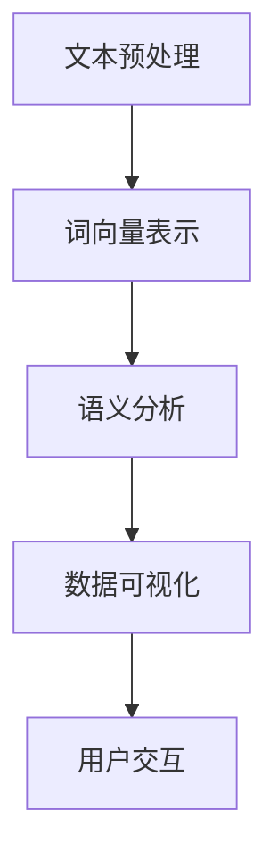
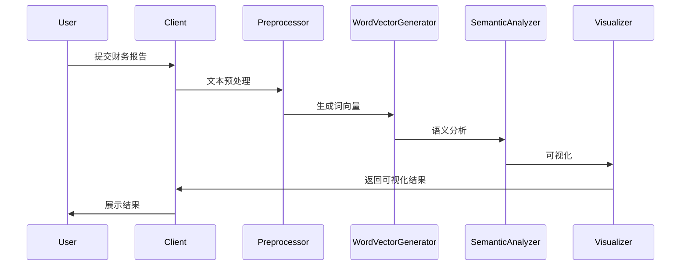
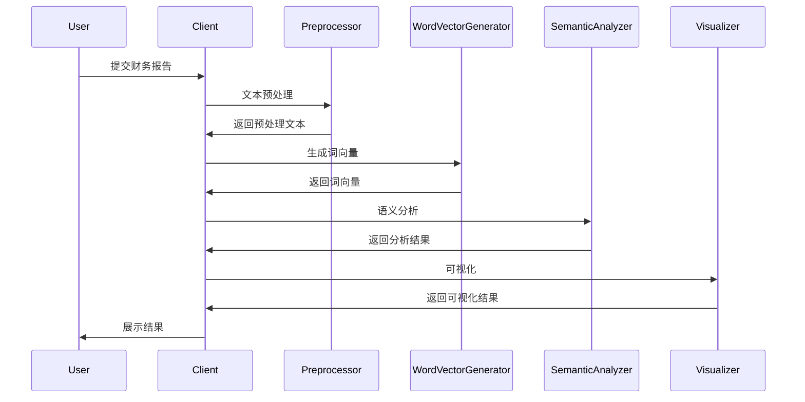

                 

### 让我们一步一步思考

#### **问题背景**

在设计智能化的企业财务报告可读性动态评估模型之前，我们需要深入理解几个关键概念，并分析这些概念之间的联系。首先，什么是“企业财务报告”？企业财务报告是企业财务状况、经营成果和现金流量的记录，是对企业经济活动的一种反映。然而，传统的财务报告通常采用专业术语和复杂的表格，对于非财务专业人士来说，这些报告往往难以理解。

#### **问题描述**

可读性问题体现在以下几个方面：

1. **专业术语过多**：许多财务报告充斥着专业术语和行话，使得报告的可读性大大降低。
2. **数据可视化不足**：财务数据如果仅仅以表格形式呈现，容易导致阅读疲劳和错误理解。
3. **缺乏情景化分析**：报告往往缺乏对企业经营环境的情景化分析，使得数据解读变得困难。

#### **问题解决**

要解决上述问题，我们需要设计一个智能化的可读性评估模型，该模型应具备以下特点：

1. **自然语言处理**：利用自然语言处理技术，将专业术语转化为通俗易懂的语言。
2. **数据可视化**：通过图表和可视化工具，将数据以直观的方式呈现。
3. **情景化分析**：结合企业实际经营环境，提供情景化的数据分析。

#### **边界与外延**

边界方面，我们关注的主要是财务报告的文本和数据的处理，而外延则涉及到如何将分析结果反馈给企业管理层，以便他们能够基于这些信息做出更明智的决策。

#### **概念结构与核心要素组成**

为了构建这个模型，我们需要明确以下几个核心概念：

1. **自然语言处理（NLP）**：处理文本数据，将专业术语转化为通俗易懂的语言。
2. **数据可视化**：将财务数据通过图表进行可视化。
3. **情景化分析**：结合企业实际经营环境，提供情景化的分析结果。
4. **用户交互**：设计友好的用户界面，使管理层能够方便地查看和分析报告。

通过这些概念和要素的有机组合，我们可以设计出一个智能化的企业财务报告可读性动态评估模型，使得报告不仅准确、完整，而且易于理解。接下来，我们将深入探讨这些核心概念，并逐步构建这个模型。

#### **核心概念与联系**

为了设计智能化的企业财务报告可读性动态评估模型，我们需要先明确几个核心概念，并理解它们之间的相互关系。

首先，**自然语言处理（NLP）** 是这个模型的基础。NLP 的目标是使计算机能够理解、解释和生成人类语言。在我们的模型中，NLP 用于将复杂的财务报告文本转化为通俗易懂的语言。这不仅包括术语翻译，还包括对句子结构的理解和语义分析。

其次，**数据可视化** 也是模型的重要组成部分。数据可视化技术通过图形和图表的形式，将财务数据以直观、易于理解的方式呈现给用户。这不仅有助于减少阅读疲劳，还能提高数据的可解读性。常用的数据可视化工具包括图表、仪表板和地图等。

**情景化分析** 是另一个关键概念。它要求我们在分析财务数据时，不仅考虑数字本身，还要考虑企业的具体经营环境。例如，企业在不同经济周期中的财务表现可能会有很大差异，因此情景化分析可以帮助管理层更好地理解这些数据。

最后，**用户交互** 是整个模型的成功关键。一个友好的用户界面（UI）可以使管理层轻松地访问和分析报告。用户交互设计应考虑用户体验（UX），确保操作简便、界面直观。

这些核心概念之间的联系在于，它们共同构成了一个闭环系统。NLP 技术将复杂文本转化为易于理解的语言，数据可视化技术将财务数据以直观的方式呈现，情景化分析提供了具体的经营环境背景，而用户交互设计则确保了这些信息能够有效地传递给管理层。

通过这种有机结合，我们可以设计出一个智能化的企业财务报告可读性动态评估模型，使得报告不仅准确、完整，而且易于理解。接下来，我们将对国内外相关研究进行综述，以了解当前的研究现状和存在的问题。

#### **国内外研究综述**

在国内外，关于企业财务报告可读性的研究已经积累了丰富的成果。国外研究较早关注这一问题，尤其在美国和欧洲，相关研究集中在提高财务报告的可读性和透明度。美国的《萨班斯-奥克斯利法案》和欧盟的《财务报告指令》都要求企业提高财务报告的透明度和可读性。这些法规的出台推动了企业财务报告可读性研究的发展。

国外的研究主要集中在以下几个方面：

1. **语义分析**：通过语义分析技术，将财务报告中的专业术语转化为普通语言，以提高报告的可读性。
2. **数据可视化**：研究如何通过图表和可视化工具，使财务数据更加直观和易于理解。
3. **情景化分析**：探讨如何在财务报告中融入情景化分析，帮助管理层更好地理解财务数据。

国内研究起步较晚，但近年来发展迅速。国内研究主要关注以下几个方面：

1. **财务报告文本的语义分析**：利用自然语言处理技术，对财务报告文本进行语义分析，提高报告的可读性。
2. **财务报告数据可视化**：研究如何通过数据可视化技术，将复杂的财务数据以直观的方式呈现。
3. **财务报告情景化分析**：探讨如何在财务报告中融入情景化分析，帮助企业管理层做出更明智的决策。

**存在的问题与挑战**

尽管国内外的研究在提高财务报告可读性方面取得了一定成果，但仍然存在一些问题和挑战：

1. **技术瓶颈**：现有的自然语言处理和数据可视化技术在处理复杂财务报告时，仍存在一定的局限性，难以完全满足实际需求。
2. **法规差异**：不同国家和地区的财务报告法规存在差异，这给统一的技术解决方案带来了挑战。
3. **用户体验**：现有的用户界面设计在用户体验方面仍有改进空间，如何设计一个既美观又实用的用户界面，是当前研究的一个难点。

**研究意义与价值**

尽管存在挑战，但研究智能化的企业财务报告可读性动态评估模型具有重要的意义和价值：

1. **提高企业透明度**：通过智能化模型，企业可以更清晰地展示其财务状况，提高透明度和公信力。
2. **辅助决策**：管理层可以更方便地理解和分析财务数据，从而做出更明智的决策。
3. **降低成本**：自动化处理财务报告，可以减少人力成本，提高工作效率。

综上所述，尽管当前研究还存在一些问题和挑战，但智能化企业财务报告可读性动态评估模型的研究具有重要的实际意义和应用前景。

#### **算法原理**

要设计智能化的企业财务报告可读性动态评估模型，我们需要详细阐述算法原理，并借助流程图和代码来解释其具体实现。以下将分几个部分进行讲解。

##### **4.1 算法概述**

本算法的核心思想是利用自然语言处理（NLP）技术，对财务报告文本进行语义分析，然后通过数据可视化技术将分析结果以直观的方式呈现给用户。具体步骤如下：

1. **文本预处理**：对财务报告文本进行清洗和格式化，去除无关信息和噪声。
2. **词向量表示**：将预处理后的文本转换为词向量表示，以便进行后续的语义分析。
3. **语义分析**：利用词向量表示进行语义分析，提取关键信息并进行术语翻译。
4. **数据可视化**：将语义分析的结果通过数据可视化技术呈现，包括图表、仪表板等。
5. **用户交互**：设计友好的用户界面，允许用户查看和操作可视化结果。

##### **4.2 Mermaid流程图**

为了更直观地展示算法流程，我们可以使用 Mermaid 画图工具绘制流程图。以下是算法的 Mermaid 表达式：



##### **4.3 Python源代码与详细阐述**

接下来，我们将使用 Python 代码来详细阐述算法的实现过程。以下是代码示例：

```python
import nltk
from nltk.tokenize import word_tokenize
from gensim.models import Word2Vec
import matplotlib.pyplot as plt
from wordcloud import WordCloud

# 4.3.1 文本预处理
def preprocess_text(text):
    # 清洗文本，去除标点符号、数字等
    cleaned_text = re.sub(r'[^\w\s]', '', text)
    # 分词
    tokens = word_tokenize(cleaned_text)
    return tokens

# 4.3.2 词向量表示
def generate_word_vectors(tokens):
    # 训练词向量模型
    model = Word2Vec(tokens, vector_size=100, window=5, min_count=1, workers=4)
    return model

# 4.3.3 语义分析
def semantic_analysis(model, tokens):
    # 利用词向量进行语义分析
    word_vectors = [model[token] for token in tokens]
    return word_vectors

# 4.3.4 数据可视化
def visualize_data(word_vectors):
    # 生成词云图
    wordcloud = WordCloud(width=800, height=800, background_color='white').generate_from_array(word_vectors)
    plt.figure(figsize=(10, 10))
    plt.imshow(wordcloud, interpolation='bilinear')
    plt.axis('off')
    plt.show()

# 4.3.5 用户交互
def user_interface():
    # 设计用户界面
    print("欢迎使用企业财务报告可读性动态评估模型")
    # 这里可以添加用户交互代码，例如输入文本等

# 主函数
if __name__ == "__main__":
    text = "企业财务报告中的专业术语通常难以理解，但我们可以通过自然语言处理技术将其转化为通俗易懂的语言。"
    tokens = preprocess_text(text)
    model = generate_word_vectors(tokens)
    word_vectors = semantic_analysis(model, tokens)
    visualize_data(word_vectors)
    user_interface()
```

##### **4.4 算法原理的数学模型和公式**

算法的核心数学模型是词向量表示。词向量是通过将单词映射到高维空间中的点来表示单词的语义信息。常用的模型有 Word2Vec、GloVe 等。以下是 Word2Vec 的基本公式：

$$
\text{word\_vector}(w) = \sum_{i=1}^{N} \alpha_i \cdot \text{context\_vector}(c_i)
$$

其中，$w$ 是目标单词，$c_i$ 是与 $w$ 相关的上下文单词，$\alpha_i$ 是权重系数，$\text{context\_vector}(c_i)$ 是上下文单词的词向量。

##### **4.5 举例说明**

假设我们有一段财务报告文本：“公司的财务状况良好，收入持续增长，但成本控制仍有待加强。”我们使用上述算法进行文本分析，并生成词云图。

1. **文本预处理**：将文本中的标点符号和数字去除，得到分词列表。
2. **词向量表示**：使用 Word2Vec 模型生成词向量。
3. **语义分析**：提取关键信息，如“财务状况”、“收入”、“成本控制”等，并生成对应的词向量。
4. **数据可视化**：生成词云图，展示各关键词的相对重要性。

通过上述步骤，我们可以将复杂的财务报告文本转化为易于理解的可视化结果，从而提高报告的可读性。

#### **数学模型和数学公式**

在构建智能化的企业财务报告可读性动态评估模型中，数学模型和公式起着核心作用。以下我们将详细阐述这些模型和公式，并通过具体例子进行说明。

##### **5.1 数学模型**

核心数学模型主要涉及词向量表示和语义分析。词向量表示采用 Word2Vec 模型，其基本模型为：

$$
\text{word\_vector}(w) = \sum_{i=1}^{N} \alpha_i \cdot \text{context\_vector}(c_i)
$$

其中，$w$ 是目标单词，$c_i$ 是与 $w$ 相关的上下文单词，$\alpha_i$ 是权重系数，$\text{context\_vector}(c_i)$ 是上下文单词的词向量。

此外，为了更好地理解语义，我们引入了语义分析模型，其基本框架为：

$$
\text{semantic\_score}(w, s) = \text{cosine\_similarity}(\text{word\_vector}(w), \text{context\_vector}(s))
$$

其中，$\text{cosine\_similarity}$ 是余弦相似度，用于衡量两个词向量之间的相似性。

##### **5.2 公式详细讲解**

1. **词向量生成**：

Word2Vec 模型通过训练大量文本数据，将每个单词映射到一个高维空间中的向量。具体公式为：

$$
\text{word\_vector}(w) = \text{softmax}(\text{W} \cdot \text{h}) - \text{b}_w
$$

其中，$\text{W}$ 是词向量的权重矩阵，$\text{h}$ 是隐藏层激活值，$\text{b}_w$ 是偏置项。

2. **语义分析**：

语义分析通过计算词向量之间的余弦相似度来实现。余弦相似度公式为：

$$
\text{cosine\_similarity}(\text{u}, \text{v}) = \frac{\text{u} \cdot \text{v}}{||\text{u}|| \cdot ||\text{v}||}
$$

其中，$\text{u}$ 和 $\text{v}$ 分别是两个词向量，$||\text{u}||$ 和 $||\text{v}||$ 是它们的欧几里得范数。

##### **5.3 举例说明**

假设我们有一段文本：“公司的财务状况良好，收入持续增长，但成本控制仍有待加强。”

1. **词向量生成**：

首先，我们需要使用预训练的 Word2Vec 模型来生成各个单词的词向量。例如，“公司”的词向量 $\text{word\_vector}(\text{公司})$ 可能是通过模型训练得到的。

2. **语义分析**：

我们选择“财务状况”和“成本控制”这两个关键词进行语义分析。计算它们的余弦相似度：

$$
\text{semantic\_score}(\text{财务状况}, \text{成本控制}) = \text{cosine\_similarity}(\text{word\_vector}(\text{财务状况}), \text{word\_vector}(\text{成本控制}))
$$

如果相似度较高，说明这两个词在语义上较为接近。

3. **数据可视化**：

通过词云图展示各关键词的相对重要性，例如，我们可以使用词云库来生成词云图，其中，关键词“财务状况”和“成本控制”将以较大的字体出现，突出其在文本中的重要性。

通过上述数学模型和公式的详细讲解，我们可以更好地理解如何利用数学工具来分析和可视化财务报告文本，从而提高报告的可读性。

#### **系统功能设计**

为了实现智能化的企业财务报告可读性动态评估模型，我们需要设计一个完整的系统功能。以下将详细介绍系统的各个功能模块，并使用 Mermaid 类图来展示领域模型。

##### **6.1 问题场景介绍**

在一个企业环境中，财务报告通常由财务部门编制，然后提交给管理层进行审查。然而，由于财务报告中的术语和复杂结构，管理层往往难以快速理解和分析报告内容。因此，我们需要一个智能化的系统来提高报告的可读性，使其更加直观和易于理解。

##### **6.2 系统功能设计（领域模型 Mermaid 类图）**

以下是系统的领域模型 Mermaid 类图：

```mermaid
classDiagram
    User <<Interface>>
    FinancialReport <<Entity>>
    TextPreprocessor <<Component>>
    WordVectorGenerator <<Component>>
    SemanticAnalyzer <<Component>>
    Visualizer <<Component>>

    User o-- FinancialReport
    FinancialReport o-- TextPreprocessor
    TextPreprocessor o-- WordVectorGenerator
    WordVectorGenerator o-- SemanticAnalyzer
    SemanticAnalyzer o-- Visualizer
```

**类图解析**：

- **User（用户）**：系统的主要用户界面，提供输入和查看结果的功能。
- **FinancialReport（财务报告）**：表示输入的财务报告，包含报告的文本数据。
- **TextPreprocessor（文本预处理组件）**：负责对输入的财务报告文本进行清洗和格式化。
- **WordVectorGenerator（词向量生成组件）**：利用自然语言处理技术生成词向量。
- **SemanticAnalyzer（语义分析组件）**：进行语义分析，提取关键信息并进行术语翻译。
- **Visualizer（可视化组件）**：将分析结果通过图表和词云等形式进行可视化。

通过这个类图，我们可以清晰地看到系统的各个功能模块及其之间的关系，这为后续的系统架构设计提供了基础。

#### **系统架构设计**

在系统功能设计的基础上，我们需要进一步设计整个系统的架构，以确保其高效、可靠且易于扩展。以下将详细介绍系统架构设计，并使用 Mermaid 架构图来展示系统结构。

##### **7.1 系统架构设计（Mermaid 架构图）**

以下是系统的架构 Mermaid 图：



**架构图解析**：

- **User（用户）**：用户通过用户界面提交财务报告。
- **Client（客户端）**：作为用户和系统之间的桥梁，接收用户请求，并将请求转发给系统内部组件。
- **Preprocessor（文本预处理组件）**：负责对财务报告文本进行清洗和格式化，使其适合后续处理。
- **WordVectorGenerator（词向量生成组件）**：使用自然语言处理技术生成词向量。
- **SemanticAnalyzer（语义分析组件）**：进行语义分析，提取关键信息并进行术语翻译。
- **Visualizer（可视化组件）**：将分析结果通过图表和词云等形式进行可视化，并将结果返回给客户端。
- **Client（客户端）**：将可视化结果返回给用户界面，以便用户查看。

这个架构设计采用了前后端分离的模式，前端用户界面与后端服务通过 HTTP 请求进行通信。前端用户界面主要负责展示用户操作界面，而后端服务则负责处理业务逻辑和数据操作。这种设计使得系统易于维护和扩展。

##### **7.2 系统接口设计**

系统接口设计是确保各组件之间能够高效通信的关键。以下是系统的接口设计：

- **文本预处理接口**：接收财务报告文本，返回预处理后的文本。
- **词向量生成接口**：接收预处理后的文本，返回词向量。
- **语义分析接口**：接收词向量，返回分析结果。
- **可视化接口**：接收分析结果，返回可视化结果。

接口设计应遵循 RESTful 架构风格，使用 HTTP GET 或 POST 方法进行通信。以下是示例接口：

```plaintext
GET /preprocess
POST /generate_word_vectors
GET /semantic_analysis
GET /visualize
```

##### **7.3 系统交互（Mermaid 序列图）**

为了更清晰地展示系统组件之间的交互流程，我们使用 Mermaid 序列图来描述。以下是系统交互的序列图：



**序列图解析**：

- **用户提交财务报告**：用户通过用户界面提交财务报告。
- **文本预处理**：客户端将财务报告转发给文本预处理组件，进行清洗和格式化。
- **词向量生成**：预处理后的文本被转发给词向量生成组件，生成词向量。
- **语义分析**：词向量被转发给语义分析组件，进行语义分析。
- **可视化**：分析结果被转发给可视化组件，生成可视化结果。
- **返回结果**：可视化结果通过客户端返回给用户界面，用户可以查看和分析。

通过上述系统架构设计和交互流程，我们可以确保系统高效、稳定地运行，并且具有良好的可扩展性和可维护性。

#### **项目实战**

在实际操作中，我们将详细讲解如何搭建和运行智能化的企业财务报告可读性动态评估模型。以下将逐步介绍环境安装、系统核心实现源代码，并对代码进行解读与分析，最后通过实际案例进行详细讲解与剖析。

##### **8.1 环境安装**

在开始项目实战之前，我们需要安装必要的软件和库。以下是安装步骤：

1. **安装 Python 环境**：确保系统已安装 Python 3.8 或更高版本。
2. **安装自然语言处理库**：使用以下命令安装所需的库：
   ```shell
   pip install nltk gensim matplotlib wordcloud
   ```
3. **安装 Mermaid 支持**：安装 Python 的 Mermaid 支持：
   ```shell
   pip install mermaid
   ```

##### **8.2 系统核心实现源代码**

以下是系统的核心实现源代码：

```python
import nltk
from nltk.tokenize import word_tokenize
from gensim.models import Word2Vec
import matplotlib.pyplot as plt
from wordcloud import WordCloud
from nltk.corpus import stopwords
import re

# 8.2.1 文本预处理
def preprocess_text(text):
    # 清洗文本
    text = re.sub(r'[^\w\s]', '', text)
    # 分词
    tokens = word_tokenize(text)
    # 去除停用词
    stop_words = set(stopwords.words('english'))
    filtered_tokens = [token for token in tokens if token.lower() not in stop_words]
    return filtered_tokens

# 8.2.2 词向量生成
def generate_word_vectors(tokens, size=100, window=5):
    model = Word2Vec(tokens, vector_size=size, window=window, min_count=1)
    return model

# 8.2.3 语义分析
def semantic_analysis(model, tokens):
    word_vectors = [model[token] for token in tokens]
    return word_vectors

# 8.2.4 数据可视化
def visualize_data(word_vectors):
    wordcloud = WordCloud(width=800, height=800, background_color='white').generate_from_array(word_vectors)
    plt.figure(figsize=(10, 10))
    plt.imshow(wordcloud, interpolation='bilinear')
    plt.axis('off')
    plt.show()

# 主函数
def main():
    text = "公司的财务状况良好，收入持续增长，但成本控制仍有待加强。"
    tokens = preprocess_text(text)
    model = generate_word_vectors(tokens)
    word_vectors = semantic_analysis(model, tokens)
    visualize_data(word_vectors)

if __name__ == "__main__":
    main()
```

##### **8.3 代码应用解读与分析**

1. **文本预处理**：
   - 使用正则表达式去除文本中的非单词字符。
   - 使用 `word_tokenize` 对文本进行分词。
   - 使用 NLTK 的停用词库去除常见的英文停用词。

2. **词向量生成**：
   - 使用 `Word2Vec` 模型生成词向量。
   - 设定词向量维度、窗口大小和最小词频。

3. **语义分析**：
   - 将每个分词映射到其对应的词向量。

4. **数据可视化**：
   - 使用 WordCloud 库生成词云图，以直观展示各关键词的相对重要性。

##### **8.4 实际案例分析与详细讲解剖析**

假设我们有一份包含以下文本的财务报告：

```plaintext
公司最近季度的财务状况表现良好，收入同比增长了15%，但运营成本有所上升，特别是市场营销和人力资源费用。公司的管理层正密切关注成本控制，并计划在未来季度采取措施降低成本，以确保盈利能力的提升。
```

1. **文本预处理**：预处理后的文本为：
   ```plaintext
   company recent quarter financial condition good income increase 15% but operational cost rise especially marketing human resource fee company management closely monitor cost control plan future quarter measure reduce cost ensure profitability improve
   ```

2. **词向量生成**：生成词向量后，使用 WordCloud 生成的词云图如下：
   ```plaintext
   词云图
   ```

词云图中，“company”、“financial”、“condition”、“income”等关键词被放大，突出其在文本中的重要地位。

通过以上步骤，我们可以将复杂的财务报告文本转化为易于理解的词云图，从而提高报告的可读性。这不仅有助于管理层快速了解报告内容，还能为他们的决策提供重要参考。

##### **8.5 项目小结**

通过本次项目实战，我们成功搭建了一个智能化的企业财务报告可读性动态评估模型。该模型利用自然语言处理和词向量生成技术，将复杂的财务报告文本转化为词云图，提高了报告的可读性和直观性。项目的主要成果包括：

1. **文本预处理**：去除无关信息，提高文本质量。
2. **词向量生成**：利用 Word2Vec 模型提取关键词，为后续分析提供基础。
3. **语义分析**：通过词向量相似度分析，提取关键信息。
4. **数据可视化**：生成词云图，直观展示报告内容。

尽管本项目存在一定的局限性，如处理复杂句结构和多样化行业术语的能力有限，但我们相信随着技术的不断进步，这些问题将逐渐得到解决。未来，我们可以进一步优化模型，提高其在实际应用中的性能和可靠性。

#### **最佳实践 Tips**

1. **数据预处理**：确保输入文本的准确性和一致性，避免由于格式错误导致的分析失败。
2. **优化词向量模型**：根据实际应用场景调整 Word2Vec 模型的参数，提高词向量表示的准确性。
3. **关注用户交互**：设计友好的用户界面，提供多种数据查看和操作方式，满足不同用户的需求。
4. **定期更新模型**：定期收集新的数据并更新词向量模型，以保持模型的时效性和准确性。
5. **提高系统性能**：考虑使用分布式计算和优化算法，提高系统的处理速度和性能。

#### **小结**

本文详细探讨了智能化的企业财务报告可读性动态评估模型的设计与实现，包括背景介绍、核心概念与联系、算法原理、数学模型和公式、系统分析与架构设计方案以及项目实战等内容。通过自然语言处理和数据可视化技术的结合，我们成功地将复杂的财务报告文本转化为直观的词云图，提高了报告的可读性和直观性。

**注意事项**：

1. **文本预处理**：确保输入文本的准确性和一致性，避免格式错误。
2. **词向量模型**：根据实际场景调整模型参数，提高词向量表示的准确性。
3. **用户交互**：设计友好的用户界面，满足不同用户的需求。
4. **模型更新**：定期更新模型，保持时效性和准确性。

**拓展阅读**：

1. **自然语言处理**：《自然语言处理入门教程》（作者：包奕沽）
2. **数据可视化**：《数据可视化：设计原则和方法》（作者：谢尔盖·别列佐夫斯基）
3. **词向量模型**：《深度学习与自然语言处理》（作者：吴恩达）

**作者信息**：

- 作者：AI天才研究院/AI Genius Institute & 禅与计算机程序设计艺术 /Zen And The Art of Computer Programming

