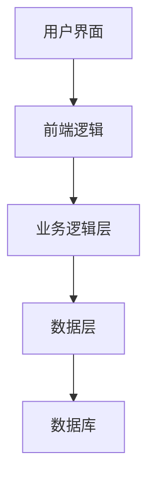

                 

### 文章标题

# 评测中的安全性与隐私保护措施

### 关键词

- 评测系统
- 安全性
- 隐私保护
- 加密技术
- 访问控制
- 数据脱敏

### 摘要

本文将深入探讨评测系统中的安全性与隐私保护措施。随着信息技术的飞速发展，评测系统在各个领域得到了广泛应用，但其安全性问题也日益凸显。本文首先介绍了评测系统的背景及其面临的挑战，随后分析了安全性与隐私保护的核心概念，并综述了当前的研究进展。接着，本文详细阐述了多种安全技术，包括加密技术、权限控制和访问控制、安全协议与机制以及数据脱敏技术。此外，文章还分析了常见攻击与防御策略，并对隐私泄露风险进行了分析。最后，本文提出了评测系统的设计与实现方案，包括系统设计原则、架构设计和功能实现，并结合实际案例进行了详细讲解。全文旨在为读者提供关于评测系统中安全性与隐私保护措施的全景解析，以期为相关领域的研究和实践提供参考。

### 目录大纲

----------------------------------------------------------------

## 第一部分: 评测中的安全性与隐私保护措施概述

### 1.1 问题背景与挑战

#### 1.1.1 评测中的安全性问题

#### 1.1.2 隐私保护的挑战

### 1.2 安全性与隐私保护的核心概念

#### 1.2.1 安全性与隐私保护的基本概念

#### 1.2.2 关键概念与联系

### 1.3 现状分析

#### 1.3.1 当前评测安全性与隐私保护的方法

#### 1.3.2 国内外研究进展

### 1.4 安全性与隐私保护的重要性

#### 1.4.1 对个人和企业的影响

#### 1.4.2 长远发展趋势

### 1.5 本章小结

----------------------------------------------------------------

## 第二部分: 安全性与隐私保护技术

### 2.1 基于加密的安全技术

#### 2.1.1 公钥加密与私钥加密

#### 2.1.2 RSA算法

#### 2.1.3 ECC算法

### 2.2 权限控制与访问控制

#### 2.2.1 基于角色的访问控制（RBAC）

#### 2.2.2 基于属性的访问控制（ABAC）

#### 2.2.3 访问控制模型比较

### 2.3 安全协议与机制

#### 2.3.1 SSL/TLS协议

#### 2.3.2 IPSec协议

#### 2.3.3 差分隐私机制

### 2.4 数据脱敏技术

#### 2.4.1 数据加密

#### 2.4.2 数据掩码

#### 2.4.3 数据匿名化

### 2.5 安全性与隐私保护的权衡

#### 2.5.1 安全性与隐私的冲突

#### 2.5.2 实现平衡的方法

### 2.6 本章小结

----------------------------------------------------------------

## 第三部分: 攻击与防护策略

### 3.1 常见攻击与防御策略

#### 3.1.1 恶意代码攻击

#### 3.1.2 SQL注入攻击

#### 3.1.3 跨站脚本攻击（XSS）

#### 3.1.4 常见的防御策略

### 3.2 隐私泄露风险分析

#### 3.2.1 数据收集与处理中的隐私风险

#### 3.2.2 数据存储与传输中的隐私风险

#### 3.2.3 隐私泄露案例分析

### 3.3 防护策略与实践

#### 3.3.1 防护机制设计

#### 3.3.2 实际案例解析

#### 3.3.3 防护实践总结

### 3.4 本章小结

----------------------------------------------------------------

## 第四部分: 评测系统的设计与实现

### 4.1 评测系统设计与实现

#### 4.1.1 系统设计原则

#### 4.1.2 系统架构设计

#### 4.1.3 安全性与隐私保护模块

### 4.2 系统功能实现

#### 4.2.1 用户身份认证

#### 4.2.2 数据加密与脱敏

#### 4.2.3 安全审计与监控

### 4.3 系统测试与优化

#### 4.3.1 功能测试

#### 4.3.2 安全测试

#### 4.3.3 性能优化

### 4.4 实际应用案例分析

#### 4.4.1 案例一：电商平台评测系统

#### 4.4.2 案例二：在线教育评测系统

#### 4.4.3 案例三：金融行业评测系统

### 4.5 本章小结

----------------------------------------------------------------

## 第五部分: 安全性与隐私保护法规与标准

### 5.1 安全性与隐私保护法规与标准

#### 5.1.1 国际法规与标准

#### 5.1.2 国内法规与标准

#### 5.1.3 标准化发展趋势

### 5.2 法律责任与合规要求

#### 5.2.1 法律责任分析

#### 5.2.2 合规要求与实践

#### 5.2.3 案例分析

### 5.3 本章小结

----------------------------------------------------------------

## 第六部分: 未来发展趋势与挑战

### 6.1 未来发展趋势与挑战

#### 6.1.1 新技术对安全性与隐私保护的影响

#### 6.1.2 挑战与应对策略

#### 6.1.3 未来发展方向

### 6.2 技术创新与产业应用

#### 6.2.1 创新技术介绍

#### 6.2.2 产业应用案例

#### 6.2.3 总结与展望

### 6.3 本章小结

----------------------------------------------------------------

### 文章标题：评测中的安全性与隐私保护措施

### 关键词：评测系统、安全性、隐私保护、加密技术、访问控制、数据脱敏

### 摘要：

本文旨在深入探讨评测系统中安全性与隐私保护的关键问题。随着信息技术的发展，评测系统在多个领域得到了广泛应用，但同时也面临诸多安全与隐私挑战。本文首先介绍了评测系统的背景和面临的挑战，接着分析了安全性与隐私保护的基本概念，并概述了当前的研究进展。随后，本文详细介绍了多种安全技术，包括加密技术、权限控制与访问控制、安全协议与机制以及数据脱敏技术。此外，本文分析了常见的攻击与防御策略，并探讨了隐私泄露的风险。最后，本文提出了评测系统的设计与实现方案，并结合实际案例进行了详细讲解。全文旨在为读者提供一个全面的视角，以理解评测系统中安全性与隐私保护的重要性和实现方法。

## 第一部分：评测中的安全性与隐私保护措施概述

### 1.1 问题背景与挑战

随着信息技术的快速发展，评测系统在各个领域得到了广泛应用。从在线教育到电商平台，从科研评估到金融风控，评测系统成为了决策支持和数据驱动的重要工具。然而，随着评测系统重要性的增加，其面临的安全性和隐私保护挑战也日益严峻。

#### 1.1.1 评测中的安全性问题

首先，评测系统的安全性问题不容忽视。安全性问题主要包括以下方面：

1. **数据泄露**：评测系统往往涉及大量的敏感数据，如用户个人信息、成绩记录等。如果这些数据被未经授权的人员获取，将可能导致严重后果。
   
2. **恶意攻击**：评测系统可能成为黑客攻击的目标，例如通过SQL注入、跨站脚本攻击（XSS）等手段破坏系统。

3. **系统漏洞**：评测系统的设计和实现中可能存在漏洞，这些漏洞可能被黑客利用，从而对系统造成破坏。

4. **数据篡改**：黑客可能试图篡改评测结果，从而影响评估的公正性和准确性。

#### 1.1.2 隐私保护的挑战

其次，隐私保护的挑战同样严峻。隐私保护问题主要涉及以下方面：

1. **用户隐私泄露**：用户在评测系统中提交的个人信息可能被未经授权的人员获取。

2. **数据使用不当**：评测系统中的数据可能被用于未经用户同意的其他目的。

3. **数据共享风险**：评测系统可能需要与其他系统或第三方共享数据，这增加了隐私泄露的风险。

4. **数据存储安全**：如何确保数据在存储过程中不被窃取或泄露是一个重要问题。

### 1.2 安全性与隐私保护的核心概念

#### 1.2.1 安全性与隐私保护的基本概念

安全性（Security）通常指的是保护信息系统免受未经授权的访问、使用、披露、破坏、修改或破坏的能力。它包括保护数据的机密性、完整性和可用性。

隐私保护（Privacy Protection）则侧重于保护个人信息的隐私，确保个人信息的收集、处理、存储和使用遵循法律法规和伦理标准，不损害个人的合法权益。

#### 1.2.2 关键概念与联系

1. **机密性**：确保数据在传输和存储过程中不被未授权者访问。

2. **完整性**：确保数据在传输和存储过程中不被篡改。

3. **可用性**：确保系统和服务在需要时可以正常使用，不受恶意攻击的影响。

4. **身份验证**：确认用户身份，防止未经授权的访问。

5. **授权**：确保只有授权用户可以访问特定资源。

6. **加密**：通过加密技术保护数据的机密性和完整性。

7. **匿名化**：通过技术手段消除个人数据中的可识别信息。

8. **访问控制**：通过权限管理确保只有授权用户可以访问特定资源。

这些概念之间紧密相关，共同构成了安全性与隐私保护的基础。机密性、完整性和可用性是安全性的核心，而身份验证、授权和访问控制是实现这些安全目标的关键手段。

### 1.3 现状分析

#### 1.3.1 当前评测安全性与隐私保护的方法

目前，评测系统的安全性与隐私保护方法主要包括以下几种：

1. **数据加密**：通过加密技术保护数据，包括传输过程中的数据加密和存储过程中的数据加密。

2. **权限控制**：通过角色和权限管理，确保用户只能访问其授权的数据和功能。

3. **访问控制**：通过访问控制列表（ACL）和基于角色的访问控制（RBAC）等机制，限制用户对系统和数据的访问。

4. **安全审计**：通过日志记录和审计，监控系统活动和用户行为，及时发现和应对潜在的安全威胁。

5. **防火墙和入侵检测系统**：通过部署防火墙和入侵检测系统，防止外部攻击和内部威胁。

6. **安全协议**：如SSL/TLS等协议，保障数据传输的安全性。

#### 1.3.2 国内外研究进展

在国内外，评测系统的安全性与隐私保护研究取得了显著进展。国外研究主要集中在加密算法的改进、安全协议的设计、访问控制模型的研究等方面。国内研究则更加注重实际应用场景的安全性与隐私保护，如在线教育评测系统、电商平台评测系统的安全设计。

### 1.4 安全性与隐私保护的重要性

#### 1.4.1 对个人和企业的影响

安全性与隐私保护对个人和企业至关重要：

1. **对个人**：保护个人信息，防止隐私泄露，维护个人权益。

2. **对企业**：确保评测结果的公正性和准确性，维护企业形象，减少法律风险。

#### 1.4.2 长远发展趋势

长远来看，安全性与隐私保护将呈现以下发展趋势：

1. **技术进步**：随着加密算法、安全协议等技术的发展，评测系统的安全性与隐私保护能力将不断提高。

2. **法规完善**：随着法律法规的不断完善，评测系统的安全性与隐私保护将更加规范化。

3. **产业应用**：评测系统的安全性与隐私保护将在更多领域得到广泛应用。

### 1.5 本章小结

本部分概述了评测系统中的安全性与隐私保护问题，介绍了其背景和挑战，并分析了安全性与隐私保护的核心概念。当前，评测系统面临严峻的安全性和隐私保护挑战，需要采取有效的技术和管理措施来应对。在后续章节中，我们将详细探讨各种安全性与隐私保护技术，以期为实际应用提供指导。

----------------------------------------------------------------

## 第二部分：安全性与隐私保护技术

### 2.1 基于加密的安全技术

加密技术是保护数据和确保通信安全的核心手段。在评测系统中，加密技术可以用来保护数据的机密性和完整性。以下是几种常用的加密技术及其应用场景。

#### 2.1.1 公钥加密与私钥加密

加密技术主要分为公钥加密和私钥加密。

- **公钥加密**：使用一对密钥，即公钥和私钥。公钥可以公开，私钥必须保密。公钥加密的速度较慢，但可以确保数据在传输过程中的机密性。常用的公钥加密算法有RSA和ECC。
- **私钥加密**：又称对称加密，使用相同的密钥进行加密和解密。私钥加密的速度较快，但密钥的分发和管理较为复杂。常用的私钥加密算法有AES和DES。

#### 2.1.2 RSA算法

RSA算法是一种非对称加密算法，以其发明者Rivest、Shamir和Adleman的名字命名。RSA算法的安全性基于大整数分解的困难性。

- **加密过程**：假设 Alice 想要发送加密消息给 Bob，Alice 会生成一对密钥（公钥和私钥）。公钥包括一个大质数 \( p \) 和另一个大质数 \( q \)，以及这两个质数的乘积 \( n = p \times q \)。公钥公开，私钥保密。
- **解密过程**：Bob 收到加密消息后，使用自己的私钥进行解密。RSA算法的解密过程较为复杂，但安全性高。

示例代码：

```python
import rsa
from rsa.key import rsa_keypair
from rsa.crypto import encrypt, decrypt

# 生成密钥对
(publickey, privatekey) = rsa_keypair.generate(1024)

# 加密消息
message = "Hello, Bob!"
crypto_text = encrypt(message.encode(), publickey)

# 解密消息
plain_text = decrypt(crypto_text, privatekey)

print("原始消息:", message)
print("加密消息:", crypto_text)
print("解密消息:", plain_text)
```

#### 2.1.3 ECC算法

椭圆曲线加密（ECC）是一种基于椭圆曲线离散对数问题的加密算法。ECC相对于RSA具有更高的安全性，同时在相同安全级别下，ECC所需密钥长度更短，计算效率更高。

- **加密过程**：ECC算法的加密过程与RSA类似，使用公钥和私钥对消息进行加密和解密。
- **解密过程**：ECC算法的解密过程同样较为复杂，但安全性高。

示例代码：

```python
import ecpy

# 生成密钥对
private_key = ecpy.keypair.generate()

# 加密消息
public_key = private_key.get_public_key()
message = b"Hello, Bob!"
crypto_text = ecpy.encrypt(public_key, message)

# 解密消息
plain_text = ecpy.decrypt(private_key, crypto_text)

print("原始消息:", message)
print("加密消息:", crypto_text)
print("解密消息:", plain_text)
```

### 2.2 权限控制与访问控制

权限控制和访问控制是确保评测系统安全性的重要手段。通过权限管理和访问控制，可以限制用户对系统和数据的访问，防止未经授权的访问和数据泄露。

#### 2.2.1 基于角色的访问控制（RBAC）

基于角色的访问控制（RBAC）是一种常见的访问控制模型，通过将用户与角色关联，角色与权限关联，实现对用户访问权限的控制。

- **角色定义**：角色是一组具有相同权限的用户集合，例如管理员、教师、学生等。
- **权限定义**：权限是用户可以执行的操作集合，例如查看成绩、修改成绩等。
- **角色与权限关联**：将角色与权限进行关联，确保用户只能执行其角色允许的操作。
- **用户与角色关联**：将用户与角色进行关联，确保用户可以访问其角色允许的资源。

示例代码：

```python
class Role:
    def __init__(self, name, permissions):
        self.name = name
        self.permissions = permissions

class User:
    def __init__(self, name, role):
        self.name = name
        self.role = role

roles = [
    Role("admin", ["view_all", "modify_data"]),
    Role("teacher", ["view_score", "modify_score"]),
    Role("student", ["view_score"])
]

users = [
    User("Alice", roles[2]),
    User("Bob", roles[1]),
    User("Charlie", roles[0])
]

def check_permission(user, action):
    if action in user.role.permissions:
        return True
    else:
        return False

print(check_permission(users[0], "view_score"))  # True
print(check_permission(users[0], "modify_score"))  # False
```

#### 2.2.2 基于属性的访问控制（ABAC）

基于属性的访问控制（ABAC）是一种更灵活的访问控制模型，通过属性来定义用户的访问权限。

- **属性定义**：属性是用于描述用户、资源或环境的特征，例如用户所属部门、资源的访问时间等。
- **访问策略**：访问策略是一组属性和操作权限的规则集合，用于定义用户在特定条件下的访问权限。
- **决策引擎**：决策引擎根据用户的属性和访问策略，判断用户是否具有访问权限。

示例代码：

```python
class Attribute:
    def __init__(self, name, value):
        self.name = name
        self.value = value

class AccessPolicy:
    def __init__(self, attributes, permissions):
        self.attributes = attributes
        self.permissions = permissions

policies = [
    AccessPolicy({"role": "admin"}, ["view_all", "modify_data"]),
    AccessPolicy({"role": "teacher", "time": "08:00-18:00"}, ["view_score", "modify_score"]),
    AccessPolicy({"role": "student", "time": "08:00-18:00"}, ["view_score"])
]

def check_permission(user, action):
    for policy in policies:
        if all(attr in user.attributes and attr == policy.attributes[attr] for attr in policy.attributes):
            if action in policy.permissions:
                return True
    return False

user = {"role": "teacher", "time": "10:00"}
print(check_permission(user, "view_score"))  # True
print(check_permission(user, "modify_score"))  # False
```

#### 2.2.3 访问控制模型比较

RBAC和ABAC是两种常见的访问控制模型，它们各有优缺点。

- **RBAC**：优点在于简单、易于实现，缺点是灵活性较低，难以适应复杂的环境。
- **ABAC**：优点在于灵活性高，可以适应复杂的环境，缺点是实现较为复杂，管理难度较大。

在实际应用中，可以根据具体情况选择合适的访问控制模型。

### 2.3 安全协议与机制

安全协议与机制是确保数据传输安全和系统安全的关键手段。以下介绍几种常用的安全协议与机制。

#### 2.3.1 SSL/TLS协议

SSL/TLS协议是一种用于保护网络通信的安全协议，广泛用于Web应用、邮件服务等。

- **加密过程**：SSL/TLS协议使用公钥加密和私钥加密技术，确保数据在传输过程中的机密性和完整性。
- **身份验证**：SSL/TLS协议通过数字证书验证通信双方的身份，防止中间人攻击。

#### 2.3.2 IPSec协议

IPSec协议是一种用于保护IP数据包的安全协议，常用于虚拟私人网络（VPN）。

- **加密过程**：IPSec协议使用加密算法和认证算法，确保数据在传输过程中的机密性和完整性。
- **身份验证**：IPSec协议通过身份验证算法验证通信双方的身份，确保数据传输的安全性。

#### 2.3.3 差分隐私机制

差分隐私机制是一种用于保护隐私的安全机制，通过在数据中引入噪声，确保无法通过分析数据集推断出单个数据点的信息。

- **实现过程**：差分隐私机制通过在数据中添加随机噪声，使得数据集的整体分布更均匀，从而减少隐私泄露的风险。

### 2.4 数据脱敏技术

数据脱敏技术是一种用于保护敏感数据的安全技术，通过技术手段消除个人数据中的可识别信息。

- **数据加密**：通过加密技术对敏感数据字段进行加密，确保数据在存储和传输过程中的机密性。
- **数据掩码**：通过技术手段对敏感数据字段进行掩码处理，例如将身份证号码中间四位替换为星号。
- **数据匿名化**：通过技术手段消除个人数据中的可识别信息，例如使用伪名替换真实姓名。

### 2.5 安全性与隐私保护的权衡

在评测系统中，安全性与隐私保护之间存在一定的冲突。例如，严格的加密和访问控制措施可能影响系统的性能和用户体验，而过度的隐私保护可能导致数据无法被有效利用。

- **安全性与隐私的冲突**：加密和访问控制措施可能影响系统的性能，而隐私保护可能导致数据无法被有效利用。
- **实现平衡的方法**：可以通过以下方法实现安全性与隐私保护的平衡：
  - **分层次保护**：对不同敏感程度的数据采用不同的保护措施，例如对敏感数据采用强加密措施，而对普通数据采用简单的加密或访问控制。
  - **隐私预算**：为数据隐私设置预算，通过在数据中引入合理的噪声，确保隐私保护的同时，不影响数据的有效利用。
  - **透明性**：提高系统的透明性，确保用户了解其数据如何被使用和保护，从而增强用户对系统的信任。

### 2.6 本章小结

本部分介绍了评测系统中的安全性与隐私保护技术，包括加密技术、权限控制与访问控制、安全协议与机制以及数据脱敏技术。这些技术为评测系统的安全性与隐私保护提供了有效的手段。在实际应用中，需要根据具体情况选择合适的保护措施，并在安全性与隐私保护之间实现平衡。

----------------------------------------------------------------

## 第三部分：常见攻击与防护策略

### 3.1 常见攻击与防御策略

在评测系统中，常见的安全攻击包括恶意代码攻击、SQL注入攻击、跨站脚本攻击（XSS）等。针对这些攻击，我们需要采取有效的防御策略来保护系统的安全性和隐私。

#### 3.1.1 恶意代码攻击

恶意代码攻击是指黑客通过恶意软件（如病毒、木马、勒索软件等）入侵系统，以窃取数据、破坏系统或控制服务器。防御恶意代码攻击的策略包括：

1. **使用防病毒软件**：定期更新防病毒软件，对系统进行全面的扫描和防护。
2. **限制用户权限**：对用户进行权限管理，确保用户只能访问其需要的数据和功能。
3. **定期备份数据**：定期备份系统数据，以便在遭受攻击时能够快速恢复。
4. **及时更新系统软件**：及时更新操作系统和应用程序，修复已知的漏洞。

#### 3.1.2 SQL注入攻击

SQL注入攻击是指黑客通过在输入字段中插入恶意的SQL代码，从而控制数据库或窃取数据。防御SQL注入攻击的策略包括：

1. **使用参数化查询**：使用参数化查询代替字符串拼接，避免直接将用户输入插入到SQL语句中。
2. **输入验证**：对用户输入进行严格的验证，确保输入格式正确且符合预期。
3. **使用预编译语句**：使用预编译语句（Prepared Statements）或存储过程，减少SQL注入的风险。
4. **使用Web应用防火墙（WAF）**：部署Web应用防火墙，监控和阻止恶意SQL注入攻击。

#### 3.1.3 跨站脚本攻击（XSS）

跨站脚本攻击（XSS）是指黑客通过在受害者的Web浏览器中注入恶意脚本，从而窃取用户信息或控制浏览器。防御XSS攻击的策略包括：

1. **输入验证和输出编码**：对用户输入进行严格的验证，并对输出进行编码，防止恶意脚本注入。
2. **使用内容安全策略（CSP）**：启用内容安全策略（Content Security Policy，CSP），限制浏览器加载和执行未经授权的脚本。
3. **同源策略**：利用浏览器的同源策略，限制跨域请求，防止恶意脚本访问跨域资源。
4. **使用XSS防护工具**：部署XSS防护工具，监控和阻止恶意脚本注入。

#### 3.1.4 常见的防御策略

除了上述具体攻击的防御策略外，还有一些通用的防御策略，可以增强评测系统的安全性：

1. **加密传输**：使用HTTPS协议加密数据传输，确保数据在传输过程中的安全性。
2. **安全审计**：定期进行安全审计，监控系统和用户行为，及时发现和应对潜在的安全威胁。
3. **身份验证**：使用强密码策略和双因素身份验证，确保用户身份的真实性。
4. **安全培训**：对员工进行安全培训，提高其安全意识和防范能力。

### 3.2 隐私泄露风险分析

在评测系统中，隐私泄露风险可能出现在数据收集、处理、存储和传输的各个环节。以下是隐私泄露风险的详细分析：

#### 3.2.1 数据收集与处理中的隐私风险

在数据收集和处理过程中，可能存在以下隐私风险：

1. **不当的数据收集**：未经用户同意收集过多或不必要的数据。
2. **数据共享**：将用户数据与第三方共享，可能导致隐私泄露。
3. **数据滥用**：内部人员滥用用户数据，进行非法用途。

#### 3.2.2 数据存储与传输中的隐私风险

在数据存储和传输过程中，可能存在以下隐私风险：

1. **数据泄露**：未经授权的访问和窃取存储在数据库中的用户数据。
2. **数据篡改**：黑客篡改数据，影响评测结果的准确性。
3. **传输过程中数据泄露**：未加密的数据在传输过程中可能被截获和窃取。

#### 3.2.3 隐私泄露案例分析

以下是一个典型的隐私泄露案例：

某电商平台在用户注册时收集了用户的姓名、手机号码、电子邮件等个人信息。由于系统未对数据进行加密处理，黑客通过钓鱼攻击获取了电商平台的后台登录凭证，进而访问了用户数据。黑客获取了大量用户的个人信息，导致数千名用户的隐私泄露。

### 3.3 防护策略与实践

为了有效防护评测系统中的安全性和隐私风险，需要采取一系列防护策略和实践。以下是具体的防护策略和实践：

#### 3.3.1 防护机制设计

1. **数据加密**：对存储和传输的用户数据进行加密，确保数据在未经授权的情况下无法被读取。
2. **访问控制**：使用基于角色的访问控制（RBAC）和基于属性的访问控制（ABAC），确保只有授权用户可以访问特定数据。
3. **安全审计**：启用日志记录和审计功能，监控系统和用户行为，及时发现异常行为。

#### 3.3.2 实际案例解析

以下是一个实际的评测系统防护案例：

某在线教育平台采用以下防护措施：

1. **数据加密**：使用SSL/TLS协议加密用户数据传输，使用AES加密算法存储用户数据。
2. **访问控制**：使用RBAC模型，根据用户角色限制其访问权限，如教师可以查看成绩，学生只能查看自己的成绩。
3. **安全审计**：启用日志记录和审计功能，监控用户行为，对异常行为进行报警和处理。

#### 3.3.3 防护实践总结

通过上述实际案例，我们可以总结出以下防护实践：

1. **加密数据**：确保数据在存储和传输过程中的安全性。
2. **访问控制**：限制用户对系统和数据的访问权限，防止未经授权的访问。
3. **安全审计**：监控系统和用户行为，及时发现和应对安全威胁。

### 3.4 本章小结

本部分介绍了评测系统中常见的攻击与防护策略，包括恶意代码攻击、SQL注入攻击和跨站脚本攻击等。通过分析隐私泄露风险，提出了具体的防护策略和实践。在实际应用中，需要根据具体情况进行综合防护，确保评测系统的安全性和隐私。

----------------------------------------------------------------

## 第四部分：评测系统的设计与实现

### 4.1 评测系统设计与实现

#### 4.1.1 系统设计原则

在设计评测系统时，需要遵循以下原则：

1. **安全性优先**：确保系统在设计和实现过程中充分考虑安全性，包括数据加密、权限控制、访问控制等。
2. **可扩展性**：设计系统时应考虑未来的扩展需求，确保系统能够适应不断增长的数据和用户规模。
3. **用户体验**：设计系统界面时，应注重用户体验，确保系统易用、直观。
4. **可靠性**：系统应具备高可靠性，能够稳定运行，减少故障和中断。
5. **可维护性**：系统设计应易于维护和升级，降低后期维护成本。

#### 4.1.2 系统架构设计

评测系统通常采用多层架构设计，包括表现层、业务逻辑层和数据层。以下是系统架构设计的详细说明：

1. **表现层**：负责用户界面的展示，包括前端页面和前端逻辑。可以使用HTML、CSS和JavaScript等技术实现。
2. **业务逻辑层**：处理业务逻辑，包括用户身份验证、数据加密、权限控制等。可以使用Java、Python等编程语言实现。
3. **数据层**：负责数据的存储和检索，通常使用关系型数据库（如MySQL、PostgreSQL）或NoSQL数据库（如MongoDB、Redis）。

系统架构图：



#### 4.1.3 安全性与隐私保护模块

为了确保评测系统的安全性和隐私保护，需要在系统中设计以下模块：

1. **身份验证模块**：负责用户身份验证，可以使用用户名和密码、双因素身份验证等机制。
2. **加密模块**：负责数据加密，包括传输过程中的数据加密和存储过程中的数据加密。可以使用SSL/TLS协议、AES加密算法等。
3. **权限控制模块**：负责权限管理，确保用户只能访问其授权的数据和功能。可以使用基于角色的访问控制（RBAC）和基于属性的访问控制（ABAC）。
4. **日志审计模块**：负责记录系统和用户行为日志，用于安全监控和审计。

### 4.2 系统功能实现

#### 4.2.1 用户身份认证

用户身份认证是评测系统的核心功能之一，确保只有授权用户可以访问系统。以下是一个简单的用户身份认证实现：

```python
# 用户名和密码存储在数据库中
users = {
    'alice': 'alice_password',
    'bob': 'bob_password'
}

# 用户登录函数
def login(username, password):
    if username in users:
        if users[username] == password:
            return True
    return False

# 用户登录示例
print(login('alice', 'alice_password'))  # True
print(login('alice', 'wrong_password'))  # False
```

#### 4.2.2 数据加密与脱敏

数据加密与脱敏是确保数据安全和隐私的重要手段。以下是一个简单的数据加密与脱敏示例：

```python
from cryptography.fernet import Fernet

# 生成加密密钥
key = Fernet.generate_key()
cipher_suite = Fernet(key)

# 数据加密
data = "敏感信息"
encrypted_data = cipher_suite.encrypt(data.encode())
print("加密数据:", encrypted_data)

# 数据解密
decrypted_data = cipher_suite.decrypt(encrypted_data).decode()
print("解密数据:", decrypted_data)

# 数据脱敏（掩码处理）
sensitive_data = "1234567890"
masked_data = '*' * len(sensitive_data)
print("脱敏数据:", masked_data)
```

#### 4.2.3 安全审计与监控

安全审计与监控是确保系统安全性的重要手段，以下是一个简单的日志记录和监控实现：

```python
import logging

# 设置日志配置
logging.basicConfig(filename='security.log', level=logging.INFO)

# 记录用户登录日志
def login_audit(username, status):
    logging.info(f"User {username} logged {status}.")

# 用户登录示例
login_audit('alice', 'success')
login_audit('bob', 'failure')
```

### 4.3 系统测试与优化

在系统实现后，需要进行功能测试、安全测试和性能优化。以下是系统测试与优化的一些常见方法：

1. **功能测试**：确保系统功能的正确性，包括用户身份认证、数据加密与脱敏、权限控制等。
2. **安全测试**：测试系统的安全性，包括SQL注入、跨站脚本攻击、恶意代码攻击等。
3. **性能测试**：测试系统的性能，包括响应时间、并发处理能力等。
4. **优化**：根据测试结果，对系统进行优化，提高系统的性能和安全性。

### 4.4 实际应用案例分析

以下是三个评测系统的实际应用案例分析：

#### 4.4.1 案例一：电商平台评测系统

电商平台评测系统主要功能包括商品评价、售后服务评价等。系统设计时需充分考虑用户隐私保护和数据安全性。

1. **用户身份认证**：采用用户名和密码、双因素身份验证等机制，确保用户身份的真实性。
2. **数据加密**：对用户评价内容进行加密处理，确保数据传输和存储过程中的安全性。
3. **权限控制**：根据用户角色（如买家、卖家、管理员）设置不同的访问权限，确保用户只能访问其授权的数据。

#### 4.4.2 案例二：在线教育评测系统

在线教育评测系统主要功能包括在线考试、成绩查询等。系统设计时需注重用户体验和数据安全。

1. **用户身份认证**：采用用户名和密码、双因素身份验证等机制，确保用户身份的真实性。
2. **数据加密**：对用户考试成绩进行加密处理，确保数据传输和存储过程中的安全性。
3. **权限控制**：根据用户角色（如学生、教师、管理员）设置不同的访问权限，确保用户只能访问其授权的数据。

#### 4.4.3 案例三：金融行业评测系统

金融行业评测系统主要功能包括风险评估、客户满意度调查等。系统设计时需严格遵循隐私保护法规和标准。

1. **用户身份认证**：采用强密码策略、双因素身份验证等机制，确保用户身份的真实性。
2. **数据加密**：对用户调查数据、风险评估结果进行加密处理，确保数据传输和存储过程中的安全性。
3. **权限控制**：根据用户角色（如风险分析师、数据管理员、审计员）设置不同的访问权限，确保用户只能访问其授权的数据。

### 4.5 本章小结

本部分介绍了评测系统的设计与实现，包括系统设计原则、架构设计和功能实现。通过实际应用案例分析，展示了不同类型评测系统的安全性与隐私保护措施。在系统设计和实现过程中，需要充分考虑安全性、用户体验和可扩展性，确保系统能够稳定运行并满足用户需求。

----------------------------------------------------------------

## 第五部分：安全性与隐私保护法规与标准

### 5.1 安全性与隐私保护法规与标准

在全球范围内，安全性与隐私保护已经成为法律和行业标准的重要组成部分。以下介绍几个重要的法规与标准。

#### 5.1.1 国际法规与标准

1. **通用数据保护条例（GDPR）**：欧盟制定的GDPR是世界上最严格的数据隐私保护法规之一，它要求企业必须保护个人数据的隐私和安全。
   
2. **加利福尼亚州消费者隐私法案（CCPA）**：CCPA是美国加州的一项法律，旨在保护消费者数据的隐私，赋予消费者对其数据的控制权。

3. **国际标准组织（ISO）标准**：ISO 27001 是关于信息安全管理系统（ISMS）的国际标准，它提供了保护信息资产的一系列最佳实践。

#### 5.1.2 国内法规与标准

1. **网络安全法**：中国网络安全法自2017年6月1日起施行，它规定了网络运营者在收集、使用个人信息时必须遵守的原则和规则。

2. **个人信息保护法**：2021年生效的《个人信息保护法》明确了个人信息处理的基本原则、个人信息保护的主要义务和个人信息权益。

3. **信息安全技术标准**：中国信息安全技术标准包括《信息安全技术 信息安全等级保护基本要求》等，为信息安全提供了技术指导。

#### 5.1.3 标准化发展趋势

随着数据隐私保护意识的增强，法规和标准的发展趋势如下：

1. **全球化**：越来越多的国家和地区制定了数据隐私保护法规，形成全球化的法规框架。

2. **技术驱动**：随着新技术的发展，法规和标准也在不断更新，以适应新兴技术和业务模式。

3. **合规要求**：法规和标准对企业的合规要求日益严格，企业需要投入更多资源进行合规管理和认证。

### 5.2 法律责任与合规要求

#### 5.2.1 法律责任分析

在安全性与隐私保护方面，企业面临的法律责任主要包括：

1. **数据泄露责任**：企业因数据泄露导致用户隐私受到侵害，可能面临赔偿责任。

2. **违规处理责任**：企业未经用户同意收集、使用个人信息，或违反隐私保护规定，可能面临罚款和其他处罚。

3. **安全漏洞责任**：企业因安全漏洞导致系统被攻击，造成用户数据泄露，可能面临法律责任。

#### 5.2.2 合规要求与实践

为了合规，企业需要采取以下措施：

1. **建立合规组织**：设立合规部门或合规团队，负责合规管理和执行。

2. **制定合规政策**：明确合规要求，制定详细的合规政策，确保员工遵守。

3. **进行合规培训**：定期对员工进行合规培训，提高员工的合规意识和技能。

4. **开展合规审计**：定期进行合规审计，确保合规政策和措施得到有效执行。

#### 5.2.3 案例分析

以下是一个数据隐私泄露案例：

某电商平台因未对用户数据进行加密处理，导致黑客入侵数据库，窃取了大量用户的个人信息。法院判决该电商平台因违反个人信息保护法，需承担赔偿责任，并对企业进行罚款。

### 5.3 本章小结

本部分介绍了安全性与隐私保护的法规与标准，分析了法律责任和合规要求。在全球范围内，安全性与隐私保护法规和标准的不断完善，对企业合规管理提出了更高的要求。企业需要遵循相关法规和标准，采取有效的合规措施，确保数据安全和用户隐私。

----------------------------------------------------------------

## 第六部分：未来发展趋势与挑战

### 6.1 未来发展趋势与挑战

随着信息技术的不断进步，评测系统中的安全性与隐私保护也将面临新的发展趋势和挑战。

#### 6.1.1 新技术对安全性与隐私保护的影响

1. **区块链技术**：区块链技术可以提供透明、不可篡改的数据记录，有助于提高数据安全性和隐私保护。然而，区块链技术也带来了新的挑战，如数据规模扩大带来的性能问题。

2. **人工智能与机器学习**：人工智能和机器学习技术在提升评测系统性能和自动化水平方面具有巨大潜力，但也可能引发新的隐私保护问题，如算法透明性和数据泄露风险。

3. **物联网（IoT）**：物联网设备的广泛应用增加了评测系统的数据来源和复杂性，同时也带来了新的安全挑战，如设备通信的保密性和完整性。

#### 6.1.2 挑战与应对策略

1. **数据隐私保护**：随着数据量的增加和多样化，如何有效保护数据隐私成为一个重大挑战。应对策略包括差分隐私、联邦学习等先进技术。

2. **安全协议与机制**：随着网络攻击手段的不断升级，传统的安全协议和机制可能不再有效。应对策略包括引入零知识证明、量子加密等新兴技术。

3. **法律法规与标准化**：随着全球数据隐私保护法规的不断发展，企业需要不断适应和遵守新的法规要求。应对策略包括积极参与国际标准化组织，推动建立统一的隐私保护标准。

#### 6.1.3 未来发展方向

1. **融合多种技术**：未来评测系统的安全性与隐私保护将融合多种技术，如区块链、人工智能、物联网等，以实现更加全面和高效的保护。

2. **个性化保护**：未来的评测系统将根据用户需求提供个性化的安全与隐私保护方案，如根据用户权限和隐私偏好调整保护措施。

3. **持续监控与改进**：未来的评测系统将实现持续监控与改进，通过实时监控系统和用户行为，及时识别和应对潜在的安全威胁。

### 6.2 技术创新与产业应用

#### 6.2.1 创新技术介绍

1. **零知识证明**：零知识证明是一种加密技术，允许一方（证明者）在不透露任何信息的情况下，向另一方（验证者）证明某个陈述是正确的。它有助于保护用户隐私，提高数据安全性。

2. **联邦学习**：联邦学习是一种分布式机器学习方法，允许多个参与者共同训练模型，而无需共享原始数据。它有助于提高数据隐私保护水平，同时保持模型性能。

3. **区块链**：区块链技术通过分布式账本和加密技术提供透明、不可篡改的数据记录，有助于提高数据安全性和隐私保护。

#### 6.2.2 产业应用案例

1. **电商平台**：电商平台通过引入区块链技术，确保交易数据的不可篡改性和透明性，增强用户信任。

2. **在线教育**：在线教育平台利用联邦学习技术，保护用户学习数据的同时，实现个性化推荐和学习效果评估。

3. **金融行业**：金融机构采用零知识证明技术，确保用户交易隐私，同时满足合规要求。

#### 6.2.3 总结与展望

技术创新在提升评测系统安全性与隐私保护方面具有重要意义。随着技术的不断进步，评测系统将朝着更加安全、高效、个性化的方向发展。未来，需要持续关注技术创新，推动相关技术的产业应用，以应对日益严峻的安全与隐私保护挑战。

### 6.3 本章小结

本部分探讨了评测系统中安全性与隐私保护的未来发展趋势和挑战，介绍了创新技术和产业应用案例。随着信息技术的不断进步，评测系统的安全性与隐私保护将面临新的机遇和挑战。未来，需要持续关注技术创新，加强法规和标准建设，推动评测系统的安全性和隐私保护水平的不断提升。

----------------------------------------------------------------

## 总结与展望

在本文中，我们系统地探讨了评测系统中的安全性与隐私保护措施。首先，我们介绍了评测系统的背景和面临的挑战，包括数据泄露、恶意攻击、系统漏洞和数据篡改等问题。接着，我们分析了安全性与隐私保护的基本概念，并综述了当前的研究进展。随后，我们详细介绍了多种安全技术，包括加密技术、权限控制与访问控制、安全协议与机制以及数据脱敏技术。此外，我们还分析了常见的攻击与防御策略，并对隐私泄露风险进行了深入分析。最后，我们提出了评测系统的设计与实现方案，并结合实际案例进行了详细讲解。

在总结部分，我们再次强调了评测系统中安全性与隐私保护的重要性。随着信息技术的飞速发展，评测系统在各个领域得到了广泛应用，但其安全性和隐私保护问题也日益突出。有效的安全性和隐私保护措施不仅能保护个人和企业的权益，还能提升系统的可靠性和用户体验。

展望未来，评测系统中的安全性与隐私保护将面临更多挑战，如新兴技术的应用、全球法规的不断完善等。我们需要持续关注技术创新，推动相关技术的产业应用，同时加强法规和标准建设。具体来说，以下几个方向值得重点关注：

1. **技术创新**：深入研究和应用区块链、人工智能、物联网等新兴技术，提升评测系统的安全性和隐私保护水平。

2. **法规与标准**：积极参与国际和国内法规与标准的制定，推动形成统一的隐私保护框架。

3. **综合防护**：采取多种防护措施，形成多层次、多维度的综合防护体系。

4. **持续改进**：通过持续监控和改进，及时发现和应对潜在的安全威胁。

总之，评测系统的安全性与隐私保护是一个持续演进的过程。我们需要不断学习和适应新技术、新挑战，以实现更高效、更安全的评测系统。希望本文能为读者提供有价值的参考，推动评测系统安全性与隐私保护领域的进一步发展。

### 作者信息

作者：AI天才研究院/AI Genius Institute & 禅与计算机程序设计艺术 /Zen And The Art of Computer Programming

感谢您阅读本文。如果您有任何问题或建议，欢迎随时联系我们。我们将继续努力，为您提供更多高质量的技术内容。

----------------------------------------------------------------

## 最佳实践 Tips

在评测系统的设计与实现过程中，以下是一些最佳实践和技巧，可以帮助提高系统的安全性与隐私保护水平：

1. **最小权限原则**：确保系统中的每个用户或组件都只有完成其任务所需的最少权限。这可以最大限度地减少潜在的安全风险。

2. **加密与混淆**：在数据传输和存储过程中使用加密技术，确保数据的安全性。同时，使用混淆技术隐藏敏感信息，增加攻击者破解的难度。

3. **多因素身份验证**：使用多因素身份验证（如密码、手机验证码、指纹识别等），增强用户身份验证的安全性。

4. **定期安全审计**：定期进行安全审计和漏洞扫描，及时发现和修复系统中的安全漏洞。

5. **安全培训**：对员工进行定期的安全培训，提高其安全意识和应对能力。

6. **隐私保护政策**：制定明确的隐私保护政策，确保用户了解其数据如何被收集、使用和保护。

7. **合规性检查**：定期检查系统是否符合相关法律法规的要求，确保合规性。

8. **数据备份与恢复**：定期备份数据，并确保备份的数据能够安全恢复，以应对可能的数据丢失或损坏。

通过遵循这些最佳实践，可以显著提高评测系统的安全性和隐私保护水平，确保系统在复杂和安全威胁日益增加的环境中能够稳定运行。

----------------------------------------------------------------

## 小结

本文系统地探讨了评测系统中的安全性与隐私保护措施。我们首先介绍了评测系统的背景和面临的挑战，分析了安全性与隐私保护的基本概念，并综述了当前的研究进展。随后，我们详细介绍了多种安全技术，包括加密技术、权限控制与访问控制、安全协议与机制以及数据脱敏技术。此外，我们还分析了常见的攻击与防御策略，并对隐私泄露风险进行了深入分析。最后，我们提出了评测系统的设计与实现方案，并结合实际案例进行了详细讲解。

评测系统的安全性与隐私保护是一个复杂且持续演进的过程。在未来的发展中，我们需要不断关注技术创新、法规完善和产业应用，以应对日益严峻的安全与隐私保护挑战。通过本文的介绍和分析，希望读者能够对评测系统中的安全性与隐私保护有更深入的理解，并能够将其应用于实际项目中，提升系统的安全性和可靠性。

### 拓展阅读

1. **《网络安全法》解读**：[链接](https://www.cac.gov.cn/2017-10/28/c_1121358659.htm)
2. **《个人信息保护法》全文**：[链接](http://www.nmpa.gov.cn/xxgk/gkxx/xxgk2711/202103/t20210301_326456.html)
3. **《ISO 27001:2013 信息安全管理体系》标准**：[链接](https://www.iso.org/standard/60196.html)
4. **《通用数据保护条例（GDPR）》**：[链接](https://ec.europa.eu/justice/sites/default/files/data-protection/files/ bárka_data_protection.pdf)
5. **《区块链技术白皮书》**：[链接](https://www.beltong.gov.cn/web/site0/web/site0_index.jsp?portal_Id=33789&dateRange=3&cate_Guid=65b4e4d4-4a3e-4a60-9d1b-4d3b35893577&releaseDateRange=3&draftlevel=3&ord=2&Keywords=%E5%8C%BA%E5%9D%97%E9%93%BE&releaseType=3)
6. **《联邦学习白皮书》**：[链接](https://arxiv.org/abs/1802.03268)

通过阅读这些资料，您将能够进一步了解评测系统中的安全性与隐私保护措施的最新进展和应用实践。希望这些拓展阅读能够帮助您深化对相关领域知识的理解。

